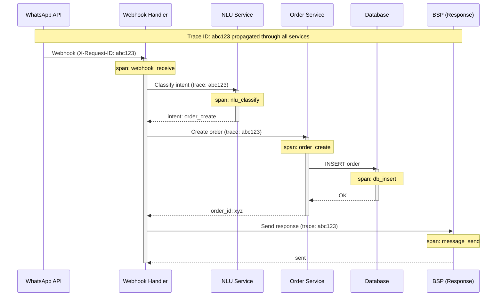

# Observability

[Back to Index](./00-index.md)

---

## Observability Strategy

### Three Pillars + Business Metrics

| Pillar | Focus | Tools |
|--------|-------|-------|
| **Metrics** | System health, performance | Prometheus, Grafana |
| **Logs** | Event records, debugging | ELK Stack, Loki |
| **Traces** | Request flow, latency | Jaeger, OpenTelemetry |
| **Business Metrics** | SMB health, adoption | Custom dashboards |

---

## Key Metrics

### Infrastructure Metrics (USE Method)

| Component | Utilization | Saturation | Errors |
|-----------|-------------|------------|--------|
| **Webhook Workers** | CPU, Memory % | Queue depth | 5xx rate |
| **Database** | Connections, CPU | Replication lag | Query errors |
| **Message Queue** | Memory | Queue length | DLQ size |
| **Cache** | Memory, Hit rate | Eviction rate | Connection errors |

### Application Metrics (RED Method)

| Service | Rate | Errors | Duration |
|---------|------|--------|----------|
| **Webhook Handler** | Messages/sec | 4xx, 5xx rate | p50, p95, p99 |
| **NLU Service** | Inferences/sec | Classification failures | Latency |
| **OCR Service** | Documents/sec | Extraction failures | Processing time |
| **Order Service** | Orders/sec | Creation failures | Latency |
| **Invoice Service** | Invoices/sec | Generation failures | PDF time |
| **Payment Service** | Callbacks/sec | Processing failures | Latency |

### WhatsApp-Specific Metrics

```
WHATSAPP METRICS
================

Message Delivery:
─────────────────
whatsapp_messages_sent_total{status}
whatsapp_messages_delivered_total{status}
whatsapp_messages_read_total{status}
whatsapp_messages_failed_total{error_code}

Delivery Rate = delivered / sent
Read Rate = read / delivered

Webhook Processing:
───────────────────
webhook_received_total{message_type}
webhook_processed_total{status}
webhook_latency_seconds{quantile}
webhook_queue_depth

Processing Success Rate = processed / received

Rate Limiting:
──────────────
rate_limit_tokens_available{phone_number}
rate_limit_messages_queued{priority}
rate_limit_messages_dropped{priority}

WhatsApp Flows:
───────────────
flow_started_total{flow_name}
flow_completed_total{flow_name}
flow_abandoned_total{flow_name, step}

Completion Rate = completed / started
```

### AI/NLU Metrics

```
AI METRICS
==========

Intent Classification:
──────────────────────
nlu_requests_total{language}
nlu_intent_classified_total{intent, confidence_bucket}
nlu_fallback_total  # Classified as "unknown"
nlu_latency_seconds{quantile}

Confidence Distribution:
- high (>0.9): Auto-process
- medium (0.7-0.9): Process with caution
- low (<0.7): Fallback to buttons

Classification Accuracy (via feedback):
nlu_corrections_total{original_intent, corrected_intent}

OCR Processing:
───────────────
ocr_requests_total{document_type}
ocr_success_total{document_type}
ocr_confidence_score{document_type, quantile}
ocr_latency_seconds{quantile}

Accuracy = fields_correct / fields_extracted
```

### Business Metrics

```
BUSINESS HEALTH METRICS
=======================

Tenant Activity:
────────────────
active_businesses_total  # Message in last 7 days
new_businesses_total{period}  # Daily, weekly, monthly
churned_businesses_total{period}  # No activity in 30 days

Feature Adoption:
─────────────────
feature_usage_total{feature, business_tier}
  - feature: orders, invoices, expenses, flows, catalog
  - business_tier: free, basic, premium

Orders:
───────
orders_created_total{source}  # whatsapp, flow, manual
orders_value_total{currency}
orders_completed_total
orders_cancelled_total

Invoices:
─────────
invoices_generated_total
invoices_paid_total
invoices_overdue_total
invoice_payment_time_days{quantile}

Payments:
─────────
payments_received_total{method}  # upi, card, cash
payments_value_total{method}
payment_success_rate

Engagement:
───────────
messages_per_business_daily{quantile}
response_time_seconds{quantile}  # Business reply time
customer_interactions_total
```

---

## Dashboards

### Operations Dashboard

```
┌─────────────────────────────────────────────────────────────────┐
│                  OPERATIONS DASHBOARD                            │
├─────────────────────────────────────────────────────────────────┤
│                                                                 │
│  SYSTEM HEALTH                    MESSAGE THROUGHPUT            │
│  ─────────────                    ──────────────────            │
│  ┌──────────────┐                 ┌────────────────────────┐    │
│  │ ● Services   │ 23/23 healthy   │     Messages/min       │    │
│  │ ● Database   │ Primary OK      │  ████████████████ 850  │    │
│  │ ● Queue      │ Depth: 142      │  Target: 1000          │    │
│  │ ● Cache      │ Hit: 94%        └────────────────────────┘    │
│  └──────────────┘                                               │
│                                                                 │
│  LATENCY (p95)                    ERROR RATE                    │
│  ─────────────                    ──────────────                │
│  Webhook:     450ms [OK]          Webhook:     0.1% [OK]        │
│  NLU:         180ms [OK]          NLU:         0.5% [OK]        │
│  Order:       320ms [OK]          Payments:    0.05% [OK]       │
│  Invoice:     1.2s  [OK]          OCR:         2.1% [WARN]      │
│                                                                 │
│  WHATSAPP STATUS                  QUEUE DEPTHS                  │
│  ───────────────                  ────────────                  │
│  Delivery Rate:  99.2%            P0 (Critical): 12             │
│  Read Rate:      87.5%            P1 (Important): 45            │
│  Rate Limit:     15% utilized     P2 (Normal): 142              │
│  Template OK:    All approved     P3 (Low): 523                 │
│                                                                 │
└─────────────────────────────────────────────────────────────────┘
```

### Business Health Dashboard

```
┌─────────────────────────────────────────────────────────────────┐
│                  BUSINESS HEALTH DASHBOARD                       │
├─────────────────────────────────────────────────────────────────┤
│                                                                 │
│  TENANT METRICS                   REVENUE INDICATORS            │
│  ──────────────                   ──────────────────            │
│  Total Tenants:     98,523        Orders Today:      45,230     │
│  Active (7d):       71,234 (72%)  GMV Today:     ₹12.3 Cr       │
│  New Today:            234        Invoices:          28,450     │
│  Churned (30d):        892        Payments:      ₹8.7 Cr        │
│                                                                 │
│  FEATURE ADOPTION                 TOP INTENTS TODAY             │
│  ────────────────                 ─────────────────             │
│  ┌─────────────────────────┐      inventory_query    35%        │
│  │ Orders      ████████ 89%│      order_create       28%        │
│  │ Invoices    ███████  78%│      invoice_generate   18%        │
│  │ Flows       ████     42%│      report_request     12%        │
│  │ Expenses    ███      31%│      other               7%        │
│  │ Catalog     ██       22%│                                    │
│  └─────────────────────────┘                                    │
│                                                                 │
│  PAYMENT METHODS                  NLU PERFORMANCE               │
│  ───────────────                  ──────────────                │
│  UPI:          67%                Accuracy:        94.2%        │
│  Cash:         28%                Avg Confidence:  0.87         │
│  Card:          5%                Fallback Rate:   5.8%         │
│                                                                 │
└─────────────────────────────────────────────────────────────────┘
```

### WhatsApp API Dashboard

```
┌─────────────────────────────────────────────────────────────────┐
│                  WHATSAPP API DASHBOARD                          │
├─────────────────────────────────────────────────────────────────┤
│                                                                 │
│  MESSAGE FLOW (Last Hour)                                       │
│  ─────────────────────────                                      │
│       Received    Processed    Responded    Delivered           │
│  ┌──────────────────────────────────────────────────────────┐   │
│  │   52,340   →   52,128    →   51,890   →   51,456        │   │
│  │            (99.6%)        (99.5%)       (99.2%)          │   │
│  └──────────────────────────────────────────────────────────┘   │
│                                                                 │
│  DELIVERY STATUS                  RATE LIMIT STATUS             │
│  ───────────────                  ─────────────────             │
│  ● Sent:        51,890           Tokens Available:    68/80     │
│  ● Delivered:   51,456 (99.2%)   Queue Depth:         142       │
│  ● Read:        44,987 (87.4%)   Throttled:           23        │
│  ● Failed:         434 (0.8%)    Fallback (SMS):      12        │
│                                                                 │
│  FAILURE BREAKDOWN                WEBHOOK HEALTH                │
│  ─────────────────                ──────────────                │
│  Rate Limited:      145          Received:       52,340/hr      │
│  Invalid Number:     89          Processed:      52,128/hr      │
│  Template Error:     67          Avg Latency:    342ms          │
│  Network Error:      78          Signature OK:   100%           │
│  Other:              55          Dedup Hits:     1.2%           │
│                                                                 │
│  WHATSAPP FLOWS                   TEMPLATE PERFORMANCE          │
│  ──────────────                   ────────────────              │
│  Order Flow:                      order_confirmation:  98.5%    │
│    Started:    1,234              invoice_share:       97.2%    │
│    Completed:    987 (80%)        payment_reminder:    96.8%    │
│    Abandoned:    247              low_stock_alert:     99.1%    │
│                                                                 │
└─────────────────────────────────────────────────────────────────┘
```

---

## Logging Strategy

### Log Levels & Usage

| Level | Usage | Examples |
|-------|-------|----------|
| **ERROR** | Failures requiring attention | Payment failure, DB error |
| **WARN** | Potential issues | High latency, retry needed |
| **INFO** | Normal operations | Order created, message sent |
| **DEBUG** | Detailed debugging | NLU scores, query plans |

### Structured Log Format

```json
{
  "timestamp": "2025-01-15T10:30:45.123Z",
  "level": "INFO",
  "service": "webhook-handler",
  "trace_id": "abc123def456",
  "span_id": "span789",
  "business_id": "uuid-business",
  "message_id": "wamid.xxx",
  "event": "message_processed",
  "duration_ms": 342,
  "intent": "order_create",
  "confidence": 0.92,
  "metadata": {
    "message_type": "text",
    "language": "hi",
    "entities_count": 3
  }
}
```

### Log Retention Policy

| Log Type | Hot (Searchable) | Warm (Archived) | Cold (Compliance) |
|----------|------------------|-----------------|-------------------|
| Application | 7 days | 30 days | 1 year |
| Security | 30 days | 90 days | 7 years |
| Audit | 90 days | 1 year | 7 years |
| Debug | 24 hours | - | - |

### Sensitive Data Handling

```
LOGGING RULES FOR PII
=====================

NEVER log:
- Full phone numbers (mask: +91XXXXX1234)
- Customer names (mask: S***a ji)
- Payment details (mask: UPI: xxxx@xxx)
- GSTIN (mask: 27XXXXX****X1Z5)

ALWAYS log:
- Business ID (UUID, not PII)
- Message ID (WhatsApp reference)
- Intent and confidence
- Latency and status
- Error codes (not messages with PII)

EXAMPLE:

BAD:
{"message": "Order created for Sharma ji, phone +919876543210, amount 15000"}

GOOD:
{"event": "order_created", "business_id": "uuid", "order_id": "uuid",
 "customer_hash": "a1b2c3", "amount_bucket": "10k-50k"}
```

---

## Distributed Tracing

### Trace Propagation



### Key Spans to Instrument

| Service | Span Name | Attributes |
|---------|-----------|------------|
| Webhook | `webhook.receive` | message_type, signature_valid |
| Webhook | `webhook.validate` | business_id, is_duplicate |
| NLU | `nlu.classify` | intent, confidence, language |
| NLU | `nlu.extract_entities` | entity_count, entity_types |
| Order | `order.create` | order_id, item_count, total |
| Order | `order.validate_inventory` | items_checked, all_available |
| Invoice | `invoice.generate` | invoice_number, total |
| Invoice | `invoice.pdf_render` | page_count, size_bytes |
| Payment | `payment.callback` | amount, method, status |
| BSP | `message.send` | template_name, delivery_status |

### Trace Sampling Strategy

```
SAMPLING CONFIGURATION
======================

Default: 1% sampling (production)

Always sample (100%):
- Errors (status >= 400)
- High latency (>2s)
- Payment transactions
- Security events

Head-based sampling:
- Decision at trace start
- Propagate decision downstream

Rate limiting:
- Max 100 traces/second
- Burst: 500 traces
```

---

## Alerting

### Alert Severity Levels

| Severity | Response Time | Notification | Examples |
|----------|---------------|--------------|----------|
| **P0 Critical** | 5 min | Page on-call | Payment processing down |
| **P1 High** | 30 min | Slack + SMS | High error rate |
| **P2 Medium** | 4 hours | Slack | Elevated latency |
| **P3 Low** | 24 hours | Email | Disk space warning |

### Critical Alerts (Page-Worthy)

```yaml
alerts:
  - name: WhatsAppWebhookFailureHigh
    severity: P0
    condition: >
      rate(webhook_errors_total[5m]) / rate(webhook_received_total[5m]) > 0.01
    for: 2m
    message: "WhatsApp webhook failure rate >1% for 2 minutes"
    runbook: "runbooks/webhook-failures.md"

  - name: PaymentCallbackFailure
    severity: P0
    condition: >
      rate(payment_callback_errors_total[5m]) > 0
    for: 1m
    message: "Payment callback processing failures detected"
    runbook: "runbooks/payment-failures.md"

  - name: DatabaseReplicationLag
    severity: P0
    condition: >
      pg_replication_lag_seconds > 30
    for: 2m
    message: "Database replication lag >30 seconds"
    runbook: "runbooks/db-replication.md"

  - name: QueueDepthCritical
    severity: P0
    condition: >
      message_queue_depth{priority="P0"} > 1000
    for: 5m
    message: "Critical message queue depth >1000"
    runbook: "runbooks/queue-overflow.md"
```

### Warning Alerts

```yaml
  - name: MessageLatencyHigh
    severity: P2
    condition: >
      histogram_quantile(0.95, webhook_latency_seconds) > 2
    for: 10m
    message: "Message processing p95 latency >2s"

  - name: NLUAccuracyDrop
    severity: P2
    condition: >
      rate(nlu_fallback_total[1h]) / rate(nlu_requests_total[1h]) > 0.1
    for: 30m
    message: "NLU fallback rate >10% (accuracy drop)"

  - name: OCRErrorRateHigh
    severity: P2
    condition: >
      rate(ocr_errors_total[1h]) / rate(ocr_requests_total[1h]) > 0.05
    for: 1h
    message: "OCR error rate >5%"
```

### Business Alerts

```yaml
  - name: TenantChurnSpike
    severity: P2
    condition: >
      rate(churned_businesses_total[24h]) > rate(churned_businesses_total[7d]) * 2
    for: 1d
    message: "Tenant churn rate 2x above weekly average"

  - name: OrderVolumeAnomaly
    severity: P3
    condition: >
      orders_created_total < avg_over_time(orders_created_total[7d]) * 0.5
    for: 2h
    message: "Order volume 50% below 7-day average"

  - name: PaymentSuccessRateLow
    severity: P1
    condition: >
      rate(payments_success_total[1h]) / rate(payments_total[1h]) < 0.95
    for: 30m
    message: "Payment success rate <95%"
```

---

## Runbook References

### Runbook: High Webhook Error Rate

```
RUNBOOK: webhook-failures.md
============================

Symptom: webhook_errors_total rate > 1%

Diagnosis:
1. Check error breakdown by code
   - 400: Bad request (signature issue?)
   - 429: Rate limited
   - 500: Internal error
   - 503: Service unavailable

2. Check BSP status page
3. Check database connectivity
4. Check message queue health

Resolution by error type:

400 Errors:
- Verify webhook signature secret matches
- Check for payload schema changes from Meta
- Review recent deployments

429 Rate Limited:
- Check token bucket metrics
- Enable message aggregation
- Activate SMS fallback if needed

500 Internal Errors:
- Check service logs for stack traces
- Check database connection pool
- Check dependent service health
- Rollback if recent deployment

503 Service Unavailable:
- Check if services are running
- Check Kubernetes pod health
- Scale up if resource constrained

Escalation:
- If not resolved in 15 min: Page senior on-call
- If customer-impacting: Notify customer success
```

---

## Observability Summary

```
┌─────────────────────────────────────────────────────────────────┐
│            OBSERVABILITY SUMMARY                                 │
├─────────────────────────────────────────────────────────────────┤
│                                                                 │
│  METRICS                          LOGGING                       │
│  ───────                          ───────                       │
│  • Prometheus + Grafana           • Structured JSON             │
│  • Custom WhatsApp metrics        • ELK Stack / Loki            │
│  • Business health scores         • PII masking enforced        │
│  • 15s scrape interval            • 7-year audit retention      │
│                                                                 │
│  TRACING                          ALERTING                      │
│  ───────                          ────────                      │
│  • OpenTelemetry + Jaeger         • 4 severity levels           │
│  • 1% sampling (100% for errors)  • PagerDuty integration       │
│  • End-to-end trace propagation   • Runbooks for all P0/P1      │
│  • Key spans instrumented         • Slack + SMS + Email         │
│                                                                 │
│  KEY SLOS                                                       │
│  ────────                                                       │
│  • Message latency p95: <2s                                     │
│  • Webhook success rate: >99%                                   │
│  • Payment callback success: >99.9%                             │
│  • NLU accuracy: >94%                                           │
│  • System availability: >99.9%                                  │
│                                                                 │
└─────────────────────────────────────────────────────────────────┘
```
