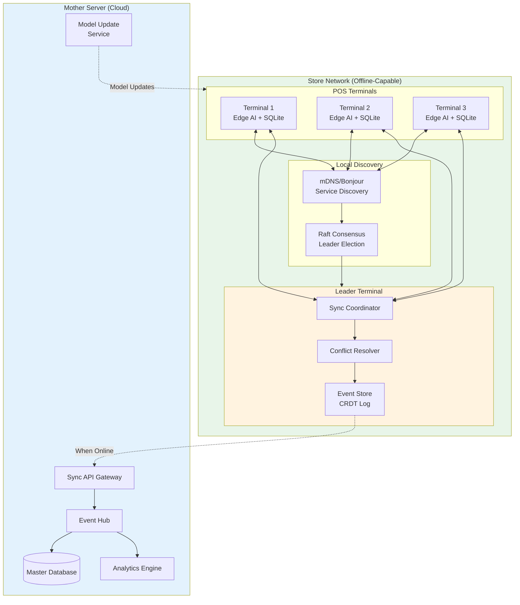

# AI Native Offline First POS - System Design

[Back to System Design Index](../README.md)

---

## System Overview

An **AI Native Offline First POS (Point of Sale)** system is a next-generation retail transaction platform that operates without dependency on network connectivity while leveraging embedded AI for intelligent automation. Unlike traditional cloud-dependent POS systems that fail during internet outages, this architecture treats offline operation as the primary mode and network connectivity as an enhancement for synchronization.

The defining architectural challenges include: (1) **embedded AI models** running locally on terminals for product recognition, fraud detection, and voice commands, (2) **automatic terminal discovery** via mDNS/Bonjour within the store's local network with Raft-based leader election, (3) **CRDT-based data synchronization** ensuring conflict-free replication across all terminals, (4) **AI-powered conflict resolution** for edge cases requiring semantic understanding, and (5) **hierarchical sync architecture** where terminals sync with a local leader who coordinates with the cloud mother server.

Real-world implementations like Tote.ai (NACS 2025), Square Offline Mode, Toast, and Clover demonstrate the viability of offline-capable POS systems, while this design extends the pattern with AI-native intelligence and mesh networking for complete store-level autonomy.

---

## Key Characteristics

| Characteristic | Value | Implication |
|----------------|-------|-------------|
| **Traffic Pattern** | Write-heavy locally, batch sync to cloud | Local-first architecture, event sourcing |
| **Consistency Model** | Strong eventual (CRDTs) | No coordination required, automatic merge |
| **Availability Target** | 100% locally, 99.9% cloud sync | Offline-first design, graceful degradation |
| **Latency Target** | <100ms local, <5s sync | Edge processing, delta sync |
| **AI Processing** | Edge-native, embedded models | TensorFlow Lite, ONNX Runtime |
| **Network Requirement** | Optional (offline-first) | mDNS discovery, opportunistic sync |
| **Compliance** | PCI-DSS, GDPR, SOX | Encrypted local storage, audit trails |

---

## Complexity Rating

| Aspect | Rating | Reason |
|--------|--------|--------|
| **Overall** | Very High | Distributed systems + AI + offline-first + leader election |
| **Embedded AI** | High | Local model deployment, inference optimization |
| **Leader Election** | High | Raft consensus, failover handling |
| **CRDT Sync** | High | Conflict-free replication, delta sync |
| **Offline Architecture** | Medium-High | Local storage, queue management |
| **Cloud Sync** | Medium | Batch upload, retry logic |

---

## Quick Navigation

| Document | Description |
|----------|-------------|
| [01 - Requirements & Estimations](./01-requirements-and-estimations.md) | Functional/Non-functional requirements, capacity for 100K stores |
| [02 - High-Level Design](./02-high-level-design.md) | Architecture, terminal discovery, leader election, sync layers |
| [03 - Low-Level Design](./03-low-level-design.md) | CRDT schemas, Raft algorithm, sync protocols, AI inference |
| [04 - Deep Dive & Bottlenecks](./04-deep-dive-and-bottlenecks.md) | Leader election, sync engine, edge AI runtime |
| [05 - Scalability & Reliability](./05-scalability-and-reliability.md) | 24+ hour offline, failover, disaster recovery |
| [06 - Security & Compliance](./06-security-and-compliance.md) | PCI-DSS, device auth, encrypted storage, threat model |
| [07 - Observability](./07-observability.md) | Sync lag, AI metrics, leader health monitoring |
| [08 - Interview Guide](./08-interview-guide.md) | 45-min pacing, trade-offs, trap questions |

---

## Offline-First vs Cloud-First POS

| Aspect | Cloud-First POS | Offline-First POS |
|--------|-----------------|-------------------|
| **Primary Dependency** | Network connectivity | Local storage |
| **Failure Mode** | System down when offline | Full operation, sync later |
| **Data Authority** | Cloud is source of truth | Local is source, cloud aggregates |
| **Consistency Model** | Strong (via cloud) | Eventually consistent (CRDTs) |
| **Sync Pattern** | Real-time push | Batch delta sync |
| **AI Processing** | Cloud APIs | Edge/embedded models |
| **Latency** | Network-bound (~100-500ms) | Local (<100ms) |
| **Use Cases** | Always-connected retail | Unreliable connectivity, mobile POS |

---

## Core POS Modules (AI-Native)

| Module | Offline Capability | AI Enhancement |
|--------|-------------------|----------------|
| **Sales/Checkout** | Full - local transaction processing | Product recognition, fraud scoring |
| **Inventory** | Full - local stock tracking | Demand prediction, auto-reorder |
| **Payments** | Partial - offline auth with limits | Fraud detection, anomaly alerts |
| **Customer Lookup** | Full - cached customer data | Personalized recommendations |
| **Reporting** | Partial - local aggregates | Natural language queries |
| **Product Catalog** | Full - local cache with images | Barcode/image-based search |

---

## Architecture Overview



---

## Key Design Decisions

| Decision | Choice | Rationale |
|----------|--------|-----------|
| **Data Model** | CRDTs (G-Counter, LWW-Register, OR-Set) | Conflict-free merge without coordination |
| **Leader Election** | Raft consensus | Well-understood, fast failover |
| **AI Runtime** | TensorFlow Lite + ONNX | Cross-platform, optimized for edge |
| **Local Storage** | SQLite with CRDT layer | Reliable, low footprint |
| **Sync Protocol** | Delta sync with Lamport timestamps | Bandwidth efficient |
| **Discovery** | mDNS (Bonjour/Avahi) | Zero-config, works offline |

---

## When to Use This Design

**Use Offline-First POS When:**
- Retail locations have unreliable internet connectivity
- Mobile/pop-up retail operations (food trucks, markets)
- High-availability is critical (cannot afford downtime)
- Multiple terminals need local coordination
- AI features must work without cloud latency
- Compliance requires local data retention

**Do NOT Use When:**
- Real-time inventory sync across locations is critical
- Centralized payment authorization is mandatory
- Simple single-terminal setup
- Always reliable high-speed connectivity
- No need for AI features

---

## Real-World Implementations

| Platform | Offline Capability | AI Features | Notable |
|----------|-------------------|-------------|---------|
| **Tote.ai** | Full offline | Product recognition, analytics | First AI-native POS (NACS 2025) |
| **Square** | 24-hour offline | Limited | Widely adopted |
| **Toast** | Restaurant-specific offline | Kitchen display sync | Restaurant focus |
| **Clover** | Basic offline mode | Minimal | SMB market |
| **Lightspeed** | Robust offline | Inventory prediction | Multi-location |
| **Ditto** | P2P sync platform | None (sync only) | Sync infrastructure |

---

## Technology Stack (Reference)

| Layer | Technology Options | Selection Criteria |
|-------|-------------------|-------------------|
| **Terminal OS** | Android, Linux (embedded), Windows IoT | Hardware support, AI runtime |
| **Local Database** | SQLite, RxDB, PouchDB | CRDT support, reliability |
| **AI Runtime** | TensorFlow Lite, ONNX Runtime | Model compatibility, performance |
| **Discovery** | mDNS (Avahi, Bonjour) | Platform support |
| **Sync Protocol** | Custom gRPC, WebSocket | Bandwidth, reliability |
| **Cloud Database** | PostgreSQL, CockroachDB | Multi-region, consistency |
| **Event Store** | Kafka, Pulsar | Durability, replay |
| **Message Queue** | Redis Streams, RabbitMQ | Local + cloud sync |

---

## Quick Reference Card

```
┌─────────────────────────────────────────────────────────────────┐
│      AI NATIVE OFFLINE FIRST POS - QUICK REFERENCE             │
├─────────────────────────────────────────────────────────────────┤
│                                                                 │
│  SCALE TARGETS               KEY PATTERNS                      │
│  ─────────────               ────────────                      │
│  • 100K+ stores              • Offline-first architecture      │
│  • 3-15 terminals/store      • CRDTs for conflict-free sync    │
│  • 100-1000 txn/day/store    • Raft leader election            │
│  • 24+ hours offline         • mDNS terminal discovery         │
│  • <100ms local latency      • Edge AI inference               │
│                                                                 │
├─────────────────────────────────────────────────────────────────┤
│                                                                 │
│  AI FEATURES                 SYNC ARCHITECTURE                  │
│  ───────────                 ─────────────────                  │
│  • Product recognition       • Terminal ↔ Leader (P2P)         │
│  • Fraud detection           • Leader → Cloud (batch)          │
│  • Voice commands            • Delta sync (Lamport TS)         │
│  • Demand prediction         • Time-based (5-15 min)           │
│  • Anomaly detection         • Network-triggered               │
│                                                                 │
├─────────────────────────────────────────────────────────────────┤
│                                                                 │
│  CONFLICT RESOLUTION         COMPLIANCE                         │
│  ───────────────────         ──────────                         │
│  • CRDTs (automatic)         • PCI-DSS (payments)              │
│  • LWW for simple values     • GDPR (customer data)            │
│  • AI for semantic merge     • SOX (financial audit)           │
│  • Human escalation          • Local data retention            │
│                                                                 │
├─────────────────────────────────────────────────────────────────┤
│                                                                 │
│  INTERVIEW KEYWORDS                                             │
│  ─────────────────                                              │
│  Offline-first, CRDTs, Raft consensus, mDNS/Bonjour,           │
│  Leader election, Delta sync, Lamport timestamps,              │
│  Edge AI, TensorFlow Lite, SQLite, Event sourcing,             │
│  Strong eventual consistency, Split-brain, Failover            │
│                                                                 │
└─────────────────────────────────────────────────────────────────┘
```

---

## Interview Readiness Checklist

| Topic | Must Know | Deep Dive |
|-------|-----------|-----------|
| Offline-First | Local-first principles, benefits | CRDT implementations, delta sync |
| CRDTs | G-Counter, LWW-Register, OR-Set | Semantic types, custom CRDTs |
| Leader Election | Raft basics, leader role | Term handling, log replication |
| mDNS | Zero-config discovery | Service registration, TTL |
| Edge AI | Model deployment, inference | Quantization, ONNX export |
| Sync Protocol | Delta sync, batching | Lamport timestamps, vector clocks |
| Conflict Resolution | Automatic merge | AI-enhanced resolution |
| PCI-DSS | Payment data handling | Encryption, tokenization |

---

## Related Systems

- [Distributed Lock Manager](../1.8-distributed-lock-manager/00-index.md) - Leader election patterns
- [Event Sourcing System](../1.18-event-sourcing-system/00-index.md) - Event-based sync
- [Edge Data Processing](../2.14-edge-data-processing/00-index.md) - Edge architecture
- [Edge AI/ML Inference](../2.13-edge-ai-ml-inference/00-index.md) - Local AI models
- [Multi-Region Active-Active](../2.9-multi-region-active-active/00-index.md) - CRDT patterns

---

## References

- Tote.ai AI-Native POS System - NACS 2025 Chicago
- Martin Kleppmann - "Conflict Resolution for Eventual Consistency"
- Raft Consensus Algorithm - Diego Ongaro, John Ousterhout
- CRDTs: Consistency Without Concurrency Control - Marc Shapiro et al.
- TensorFlow Lite for Microcontrollers Documentation
- ONNX Runtime Edge Deployment Guide
- PouchDB/CouchDB Replication Protocol
- Square Engineering Blog - Offline Mode Architecture
- Ditto - Local-First Sync Platform Documentation
