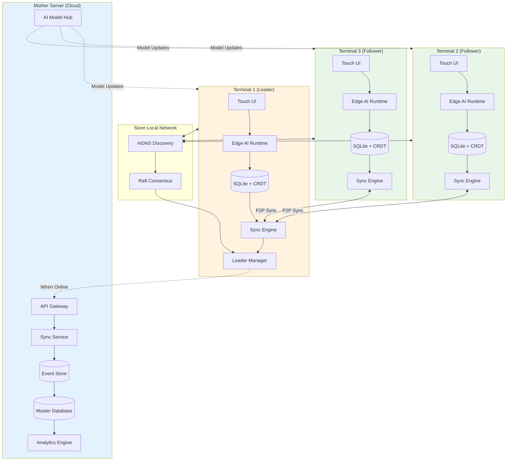
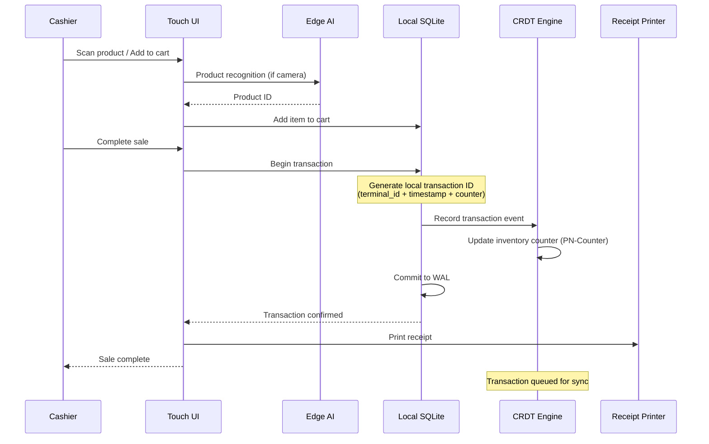
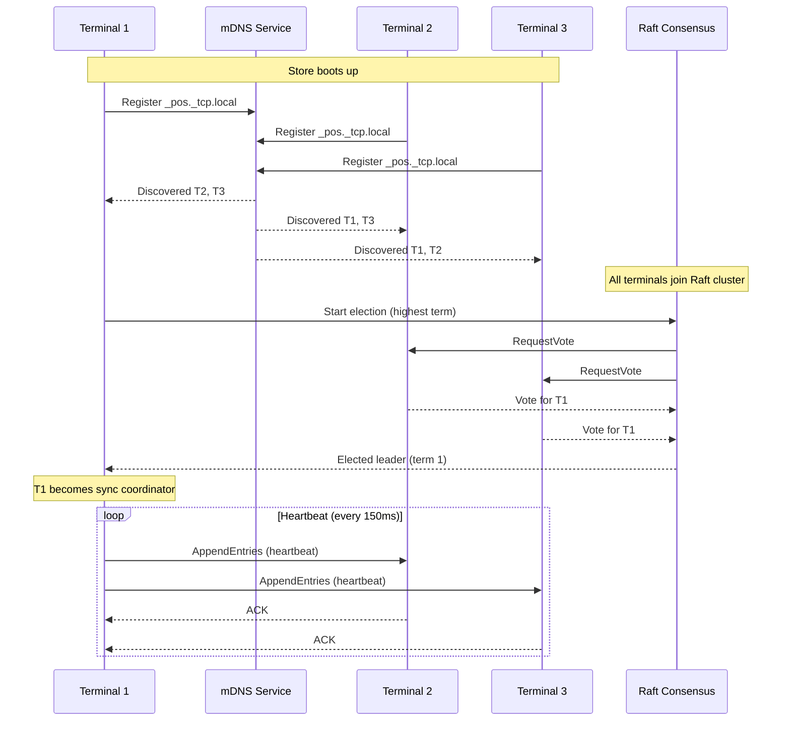
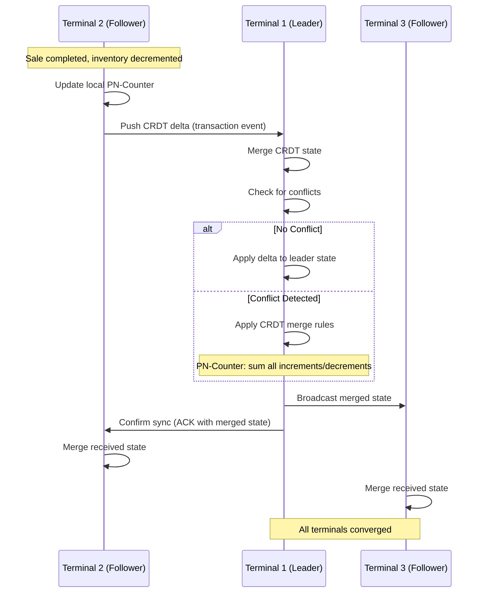
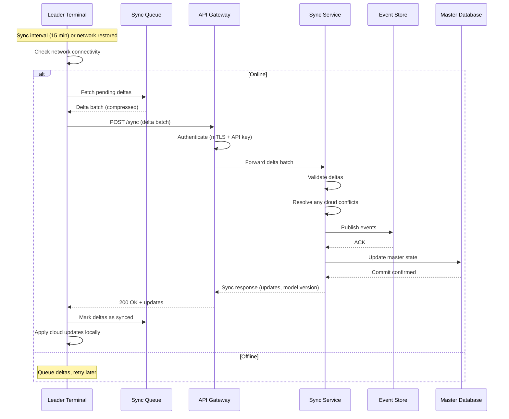
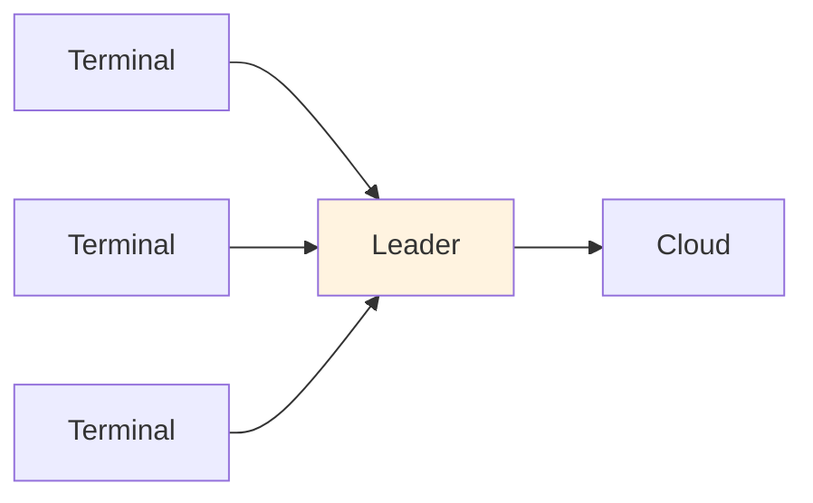
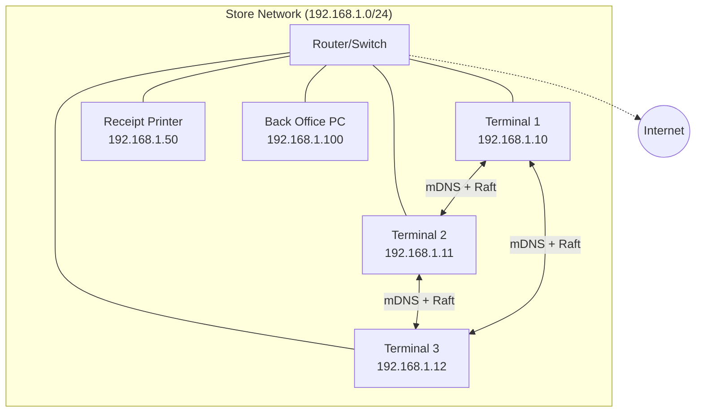
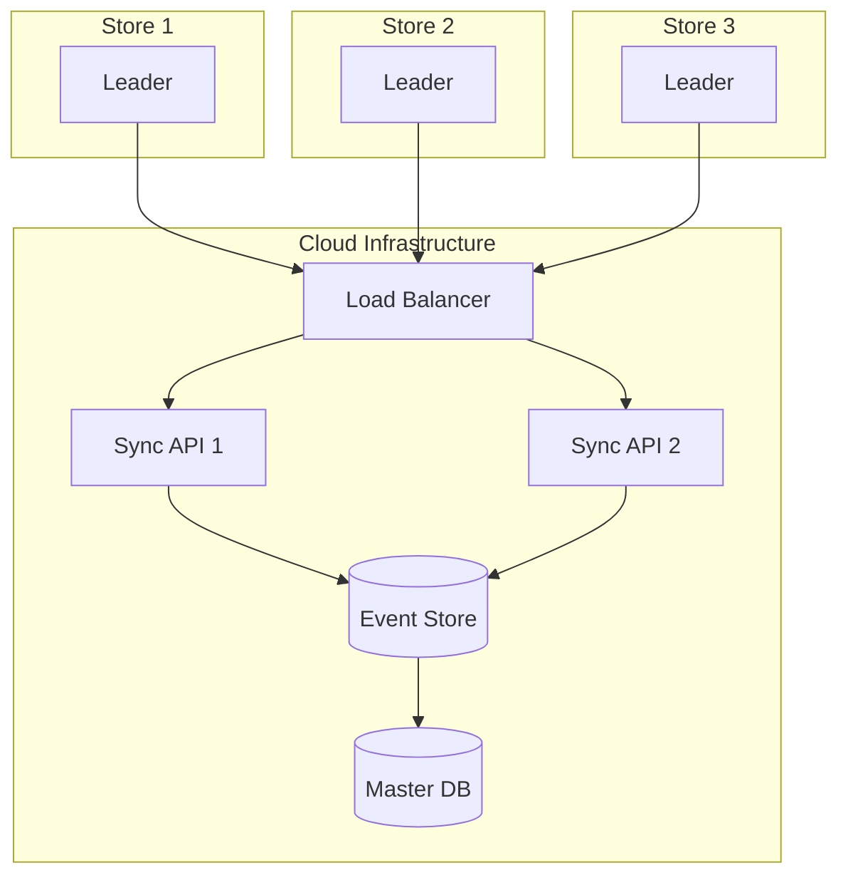
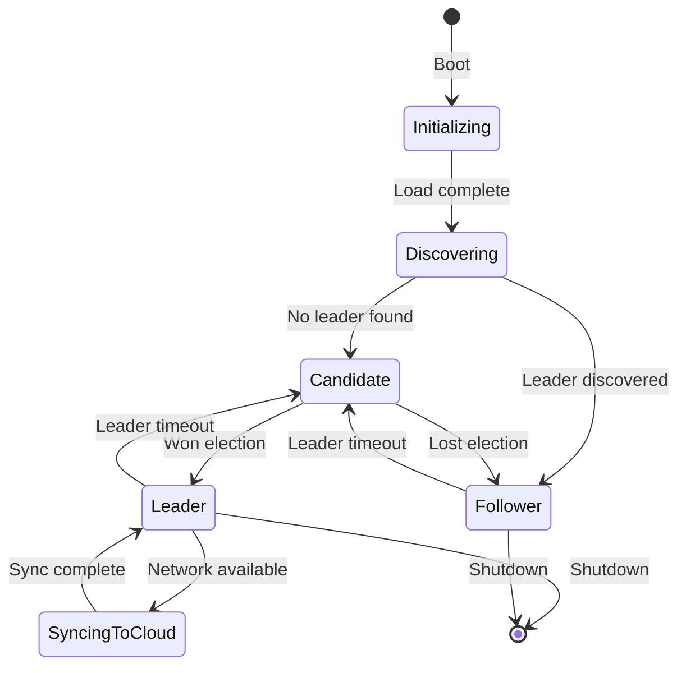
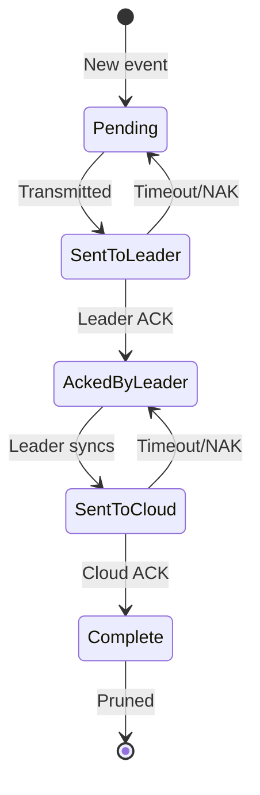

# High-Level Design

[Back to Index](./00-index.md)

---

## System Architecture

The AI Native Offline First POS follows a **three-tier hierarchical architecture**:

1. **Terminal Layer** - Individual POS terminals with embedded AI and local storage
2. **Store Layer** - Mesh of terminals with leader election and in-store sync
3. **Cloud Layer** - Central mother server for aggregation and management



---

## Component Overview

### Terminal Layer Components

| Component | Responsibility | Technology |
|-----------|---------------|------------|
| **Touch UI** | User interface, input handling | Android/Linux native |
| **Edge AI Runtime** | Local model inference | TensorFlow Lite, ONNX |
| **Local Database** | Transaction storage, CRDT state | SQLite with CRDT layer |
| **Sync Engine** | Delta computation, merge logic | Custom CRDT implementation |
| **Leader Manager** | Raft participation, leader duties | Embedded Raft library |

### Store Layer Components

| Component | Responsibility | Technology |
|-----------|---------------|------------|
| **mDNS Discovery** | Zero-config terminal discovery | Avahi (Linux), Bonjour (others) |
| **Raft Consensus** | Leader election, log replication | Custom lightweight Raft |
| **P2P Mesh** | Direct terminal-to-terminal sync | gRPC / WebSocket |

### Cloud Layer Components

| Component | Responsibility | Technology |
|-----------|---------------|------------|
| **API Gateway** | Authentication, routing, rate limiting | Kong / Envoy |
| **Sync Service** | Receive deltas, resolve conflicts, persist | Custom microservice |
| **Event Store** | Immutable event log for all stores | Kafka / Pulsar |
| **Master Database** | Aggregated data, source of truth | PostgreSQL / CockroachDB |
| **Analytics Engine** | Cross-store analytics, reporting | ClickHouse / BigQuery |
| **AI Model Hub** | Model versioning, distribution | MLflow / Custom |

---

## Data Flow Diagrams

### Flow 1: Offline Transaction Processing



### Flow 2: Terminal Discovery & Leader Election



### Flow 3: In-Store CRDT Synchronization



### Flow 4: Cloud Sync (Leader to Mother Server)



---

## Key Architectural Decisions

### Decision 1: Local-First with CRDTs

| Aspect | Decision |
|--------|----------|
| **Choice** | CRDTs (G-Counter, PN-Counter, LWW-Register, OR-Set) |
| **Alternatives Considered** | OT (Operational Transformation), Last-write-wins only, Manual conflict resolution |
| **Rationale** | CRDTs mathematically guarantee convergence without coordination, perfect for offline scenarios |
| **Trade-off** | Higher storage overhead (state-based), limited data structure support |

**CRDT Types Used:**

| Data | CRDT Type | Merge Behavior |
|------|-----------|----------------|
| Inventory counts | PN-Counter | Sum increments, sum decrements |
| Transaction log | OR-Set (Observed-Remove) | Union of all transactions |
| Product prices | LWW-Register | Last timestamp wins |
| Customer data | LWW-Map | Per-field LWW |

### Decision 2: Raft-Based Leader Election

| Aspect | Decision |
|--------|----------|
| **Choice** | Simplified Raft consensus for leader election |
| **Alternatives Considered** | Bully algorithm, Ring election, No leader (pure P2P) |
| **Rationale** | Raft is well-understood, has formal proof, handles network partitions |
| **Trade-off** | Requires odd number of nodes for optimal quorum, complexity |

**Why Not Pure P2P:**
- Cloud sync needs a single coordinator to avoid duplicate uploads
- Ordering of events is simpler with a leader
- Conflict resolution can be centralized at leader

### Decision 3: Delta Sync with Lamport Timestamps

| Aspect | Decision |
|--------|----------|
| **Choice** | Delta-based sync with Lamport logical timestamps |
| **Alternatives Considered** | Full state sync, Vector clocks, Hybrid logical clocks |
| **Rationale** | Delta sync is bandwidth-efficient; Lamport timestamps are simple and sufficient |
| **Trade-off** | Requires tracking sync state, potential for missed deltas |

**Sync Protocol:**
```
Delta = {
  terminal_id: string,
  from_timestamp: lamport_ts,
  to_timestamp: lamport_ts,
  events: [CRDTOperation...]
}
```

### Decision 4: Edge AI with TensorFlow Lite

| Aspect | Decision |
|--------|----------|
| **Choice** | TensorFlow Lite for model inference, ONNX for model portability |
| **Alternatives Considered** | Cloud API calls, PyTorch Mobile, CoreML |
| **Rationale** | TF Lite is mature, supports quantization, runs on Android/Linux |
| **Trade-off** | Model size limits, accuracy vs latency trade-off |

**Model Deployment Pipeline:**
```
Train (Cloud) → Export (SavedModel) → Convert (TFLite) →
Quantize (INT8) → Deploy (OTA Update) → Inference (Edge)
```

### Decision 5: Hierarchical Sync (Terminal → Leader → Cloud)

| Aspect | Decision |
|--------|----------|
| **Choice** | Three-tier: Terminal syncs with Leader, Leader syncs with Cloud |
| **Alternatives Considered** | Direct terminal-to-cloud, Peer-to-peer only, Hub-and-spoke |
| **Rationale** | Reduces cloud connections, aggregates deltas, single point of coordination |
| **Trade-off** | Leader is critical path, failover needed |



---

## Architecture Pattern Checklist

| Pattern | Decision | Justification |
|---------|----------|---------------|
| **Sync vs Async** | Async (event-driven) | Offline-first requires async by nature |
| **Event-driven vs Request-response** | Event-driven | CRDTs are event-based |
| **Push vs Pull** | Push (leader broadcasts) | Faster convergence |
| **Stateless vs Stateful** | Stateful (terminals have local state) | Offline-first requirement |
| **Read-heavy vs Write-heavy** | Write-heavy (sales transactions) | Optimized for fast local writes |
| **Real-time vs Batch** | Hybrid (real-time local, batch cloud) | Balance latency and efficiency |
| **Edge vs Origin** | Edge-first | Core requirement |

---

## Network Topology

### Store Network (LAN)



### Multi-Store Cloud Architecture



---

## State Management

### Terminal State Machine



### Sync Queue States



---

## Failure Modes & Handling

| Failure Mode | Detection | Handling |
|--------------|-----------|----------|
| **Leader crash** | Heartbeat timeout (500ms) | Raft election, new leader |
| **Follower crash** | Peer timeout | Continue without, resync on recovery |
| **Network partition (store)** | Split-brain detection | Smaller partition becomes read-only |
| **Internet outage** | Connectivity check | Queue syncs, continue local ops |
| **Cloud unavailable** | Sync failure | Exponential backoff retry |
| **Local DB corruption** | Checksum failure | Restore from peer or cloud |
| **AI model failure** | Inference timeout | Fallback to manual entry |
