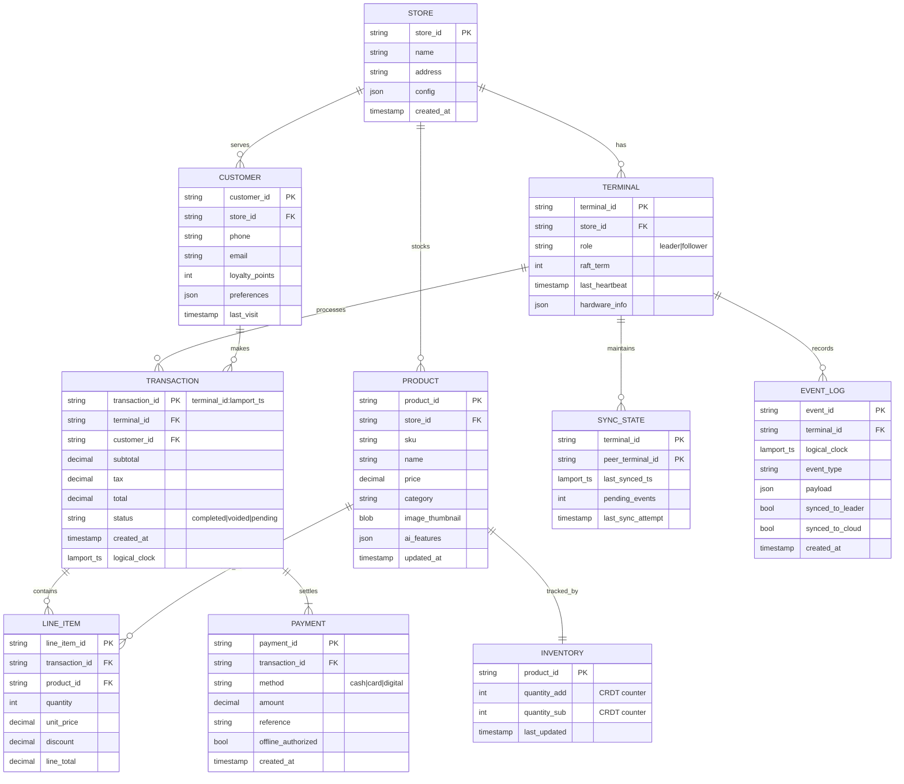

# Low-Level Design

[Back to Index](./00-index.md)

---

## Data Model

### Entity Relationship Diagram



### CRDT Data Structures

#### Inventory PN-Counter (Positive-Negative Counter)

```
PN-Counter for Inventory:

State:
  P: Map<TerminalId, Int>  // Positive (additions)
  N: Map<TerminalId, Int>  // Negative (removals)

Value:
  sum(P) - sum(N)

Example:
  Terminal A adds 10 items:     P[A] = 10
  Terminal B sells 3 items:     N[B] = 3
  Terminal A sells 2 items:     N[A] = 2

  Inventory = (10) - (3 + 2) = 5
```

**Pseudocode:**

```
class PNCounter:
    P: Map<TerminalId, Int> = {}
    N: Map<TerminalId, Int> = {}

    function increment(terminal_id, amount):
        P[terminal_id] = P.get(terminal_id, 0) + amount

    function decrement(terminal_id, amount):
        N[terminal_id] = N.get(terminal_id, 0) + amount

    function value():
        return sum(P.values()) - sum(N.values())

    function merge(other):
        for tid in union(P.keys(), other.P.keys()):
            P[tid] = max(P.get(tid, 0), other.P.get(tid, 0))
        for tid in union(N.keys(), other.N.keys()):
            N[tid] = max(N.get(tid, 0), other.N.get(tid, 0))
```

#### Transaction OR-Set (Observed-Remove Set)

```
OR-Set for Transactions:

State:
  Elements: Set<(TransactionId, Tag)>
  Tombstones: Set<(TransactionId, Tag)>

Add(txn):
  tag = generate_unique_tag()
  Elements.add((txn.id, tag))

Remove(txn):
  for (id, tag) in Elements where id == txn.id:
    Tombstones.add((id, tag))

Lookup(txn_id):
  exists = any((id, tag) in Elements where id == txn_id)
  removed = all((id, tag) in Tombstones where id == txn_id)
  return exists AND NOT removed
```

#### LWW-Register (Last-Write-Wins Register)

```
LWW-Register for Product Price:

State:
  value: Any
  timestamp: LamportTimestamp

Update(new_value, new_ts):
  if new_ts > timestamp:
    value = new_value
    timestamp = new_ts

Merge(other):
  if other.timestamp > timestamp:
    value = other.value
    timestamp = other.timestamp
  elif other.timestamp == timestamp:
    // Tie-breaker: use terminal_id lexicographically
    if other.terminal_id > this.terminal_id:
      value = other.value
```

### Indexing Strategy

| Table | Index | Type | Purpose |
|-------|-------|------|---------|
| `TRANSACTION` | `(terminal_id, created_at)` | B-tree | Local queries by time |
| `TRANSACTION` | `(customer_id)` | B-tree | Customer lookup |
| `TRANSACTION` | `(status, synced_to_cloud)` | Composite | Sync queue |
| `PRODUCT` | `(sku)` | Unique B-tree | Barcode lookup |
| `PRODUCT` | `(name)` | Full-text | Search |
| `EVENT_LOG` | `(logical_clock)` | B-tree | Ordering |
| `EVENT_LOG` | `(synced_to_leader, synced_to_cloud)` | Composite | Sync tracking |
| `INVENTORY` | `(product_id)` | Primary | Direct lookup |

### Partitioning / Sharding (Cloud)

| Table | Partition Key | Strategy | Retention |
|-------|---------------|----------|-----------|
| `TRANSACTION` | `store_id` + `month` | Range | 7 years |
| `EVENT_LOG` | `store_id` + `day` | Range | 90 days |
| `PRODUCT` | `store_id` | Hash | Indefinite |
| `CUSTOMER` | `store_id` | Hash | GDPR-compliant |

---

## API Design

### Terminal-to-Terminal API (gRPC)

```protobuf
syntax = "proto3";

package pos.sync;

service TerminalSync {
    // Leader election
    rpc RequestVote(VoteRequest) returns (VoteResponse);
    rpc AppendEntries(AppendEntriesRequest) returns (AppendEntriesResponse);

    // CRDT sync
    rpc PushDelta(DeltaRequest) returns (DeltaResponse);
    rpc PullState(StateRequest) returns (StateResponse);

    // Health
    rpc Heartbeat(HeartbeatRequest) returns (HeartbeatResponse);
}

message VoteRequest {
    string candidate_id = 1;
    int32 term = 2;
    int64 last_log_index = 3;
    int64 last_log_term = 4;
}

message VoteResponse {
    int32 term = 1;
    bool vote_granted = 2;
}

message AppendEntriesRequest {
    string leader_id = 1;
    int32 term = 2;
    int64 prev_log_index = 3;
    int64 prev_log_term = 4;
    repeated LogEntry entries = 5;
    int64 leader_commit = 6;
}

message LogEntry {
    int64 index = 1;
    int32 term = 2;
    bytes crdt_operation = 3;
}

message DeltaRequest {
    string sender_id = 1;
    int64 from_lamport_ts = 2;
    int64 to_lamport_ts = 3;
    repeated CRDTEvent events = 4;
}

message CRDTEvent {
    string event_id = 1;
    string event_type = 2;  // "TRANSACTION_CREATED", "INVENTORY_UPDATED", etc.
    int64 lamport_ts = 3;
    bytes payload = 4;      // Serialized CRDT operation
}

message DeltaResponse {
    bool success = 1;
    int64 acked_up_to = 2;
    repeated CRDTEvent missing_events = 3;  // Events we have that sender missed
}
```

### Terminal-to-Cloud API (REST)

#### Sync Endpoint

```
POST /api/v1/stores/{store_id}/sync
Authorization: Bearer {api_key}
Content-Type: application/json

Request:
{
  "terminal_id": "store-001-term-01",
  "sync_batch_id": "uuid-v4",
  "from_lamport_ts": 100500,
  "to_lamport_ts": 100750,
  "events": [
    {
      "event_id": "store-001-term-01:100501",
      "event_type": "TRANSACTION_CREATED",
      "lamport_ts": 100501,
      "payload": {
        "transaction_id": "store-001-term-01:100501",
        "total": 45.99,
        "line_items": [...],
        "payments": [...]
      }
    },
    {
      "event_id": "store-001-term-01:100502",
      "event_type": "INVENTORY_DECREMENTED",
      "lamport_ts": 100502,
      "payload": {
        "product_id": "SKU-12345",
        "terminal_id": "store-001-term-01",
        "decrement_amount": 2
      }
    }
  ],
  "checksum": "sha256:abcdef..."
}

Response (200 OK):
{
  "sync_batch_id": "uuid-v4",
  "status": "accepted",
  "acked_up_to": 100750,
  "updates": {
    "products": [
      {
        "product_id": "SKU-99999",
        "action": "upsert",
        "data": {...}
      }
    ],
    "config": {
      "tax_rate": 0.08
    }
  },
  "model_updates": {
    "fraud_detection": {
      "version": "v2.3.1",
      "download_url": "/models/fraud-v2.3.1.tflite"
    }
  }
}

Response (409 Conflict):
{
  "sync_batch_id": "uuid-v4",
  "status": "conflict",
  "conflicts": [
    {
      "event_id": "store-001-term-01:100510",
      "conflict_type": "OVERSOLD",
      "product_id": "SKU-12345",
      "cloud_inventory": 0,
      "local_change": -2,
      "resolution_required": true
    }
  ]
}
```

#### Idempotency

| Mechanism | Implementation |
|-----------|----------------|
| **Idempotency Key** | `sync_batch_id` (UUID) prevents duplicate processing |
| **Event IDs** | `terminal_id:lamport_ts` ensures uniqueness |
| **Checksum** | SHA256 of payload verifies integrity |
| **Replay Detection** | Server tracks `acked_up_to` per terminal |

### AI Inference API (Local)

```
POST /inference/product-recognition
Content-Type: multipart/form-data

Request:
  image: (binary image data)

Response:
{
  "predictions": [
    {
      "product_id": "SKU-12345",
      "confidence": 0.94,
      "bounding_box": [100, 50, 300, 250]
    }
  ],
  "inference_time_ms": 45
}
```

```
POST /inference/fraud-score
Content-Type: application/json

Request:
{
  "transaction": {
    "total": 1250.00,
    "payment_method": "card",
    "customer_id": "cust-123",
    "line_items": [...]
  },
  "context": {
    "time_of_day": "23:45",
    "terminal_id": "term-01",
    "customer_history": {...}
  }
}

Response:
{
  "fraud_score": 0.12,
  "risk_level": "low",
  "factors": [
    {"factor": "high_value", "weight": 0.3},
    {"factor": "late_hour", "weight": 0.2}
  ],
  "recommendation": "approve"
}
```

---

## Core Algorithms

### Algorithm 1: Raft Leader Election (Simplified)

```
// Constants
HEARTBEAT_INTERVAL = 150ms
ELECTION_TIMEOUT = random(300ms, 500ms)

class RaftNode:
    state = FOLLOWER
    currentTerm = 0
    votedFor = null
    log = []
    commitIndex = 0
    lastApplied = 0

    // Leader state
    nextIndex = {}
    matchIndex = {}

function onElectionTimeout():
    if state != LEADER:
        state = CANDIDATE
        currentTerm += 1
        votedFor = self.id
        votesReceived = 1

        for each peer in peers:
            send RequestVote(
                term = currentTerm,
                candidateId = self.id,
                lastLogIndex = len(log) - 1,
                lastLogTerm = log[-1].term if log else 0
            ) to peer

        resetElectionTimer()

function onReceiveRequestVote(request):
    if request.term < currentTerm:
        return VoteResponse(term=currentTerm, voteGranted=false)

    if request.term > currentTerm:
        currentTerm = request.term
        state = FOLLOWER
        votedFor = null

    logOk = (request.lastLogTerm > lastLogTerm) or
            (request.lastLogTerm == lastLogTerm and
             request.lastLogIndex >= len(log) - 1)

    if (votedFor == null or votedFor == request.candidateId) and logOk:
        votedFor = request.candidateId
        resetElectionTimer()
        return VoteResponse(term=currentTerm, voteGranted=true)

    return VoteResponse(term=currentTerm, voteGranted=false)

function onReceiveVoteResponse(response):
    if state != CANDIDATE:
        return

    if response.term > currentTerm:
        currentTerm = response.term
        state = FOLLOWER
        return

    if response.voteGranted:
        votesReceived += 1
        if votesReceived > len(peers) / 2:
            becomeLeader()

function becomeLeader():
    state = LEADER
    for each peer in peers:
        nextIndex[peer] = len(log)
        matchIndex[peer] = 0
    sendHeartbeats()

function sendHeartbeats():
    if state == LEADER:
        for each peer in peers:
            send AppendEntries(
                term = currentTerm,
                leaderId = self.id,
                prevLogIndex = nextIndex[peer] - 1,
                prevLogTerm = log[nextIndex[peer] - 1].term,
                entries = [],  // heartbeat has no entries
                leaderCommit = commitIndex
            ) to peer
        schedule sendHeartbeats() after HEARTBEAT_INTERVAL
```

**Time Complexity:** O(n) per election where n = number of terminals
**Space Complexity:** O(log_size) for storing log entries

### Algorithm 2: CRDT Merge (PN-Counter)

```
function mergePNCounter(local, remote):
    // Create new merged counter
    merged = new PNCounter()

    // Merge positive counts (take max per terminal)
    allTerminals = union(local.P.keys(), remote.P.keys())
    for tid in allTerminals:
        merged.P[tid] = max(
            local.P.get(tid, 0),
            remote.P.get(tid, 0)
        )

    // Merge negative counts (take max per terminal)
    allTerminals = union(local.N.keys(), remote.N.keys())
    for tid in allTerminals:
        merged.N[tid] = max(
            local.N.get(tid, 0),
            remote.N.get(tid, 0)
        )

    return merged

// Example:
// Local:  P={A:10, B:5}  N={A:2, B:1}  value = 15-3 = 12
// Remote: P={A:10, C:3}  N={A:2, C:2}  value = 13-4 = 9
// Merged: P={A:10, B:5, C:3}  N={A:2, B:1, C:2}  value = 18-5 = 13
```

**Time Complexity:** O(t) where t = number of terminals
**Space Complexity:** O(t) for storing terminal counts

### Algorithm 3: Delta Sync Protocol

```
class DeltaSyncEngine:
    lamportClock = 0
    eventLog = []
    syncState = {}  // peer_id -> last_synced_ts

function recordEvent(eventType, payload):
    lamportClock += 1
    event = {
        id: terminal_id + ":" + lamportClock,
        type: eventType,
        ts: lamportClock,
        payload: payload,
        syncedToLeader: false,
        syncedToCloud: false
    }
    eventLog.append(event)
    return event

function computeDelta(peer_id):
    lastSynced = syncState.get(peer_id, 0)
    delta = []
    for event in eventLog:
        if event.ts > lastSynced:
            delta.append(event)
    return delta

function receiveDelta(peer_id, delta):
    for event in delta:
        // Update Lamport clock
        lamportClock = max(lamportClock, event.ts) + 1

        // Apply CRDT operation
        applyCRDTOperation(event.type, event.payload)

        // Record in local log (for further propagation)
        if not eventExists(event.id):
            eventLog.append(event)

    // Update sync state
    if len(delta) > 0:
        syncState[peer_id] = max(e.ts for e in delta)

    return syncState[peer_id]

function applyCRDTOperation(eventType, payload):
    switch eventType:
        case "INVENTORY_INCREMENT":
            inventory[payload.product_id].increment(
                payload.terminal_id,
                payload.amount
            )
        case "INVENTORY_DECREMENT":
            inventory[payload.product_id].decrement(
                payload.terminal_id,
                payload.amount
            )
        case "TRANSACTION_CREATED":
            transactions.add(payload.transaction)
        // ... other event types
```

**Time Complexity:** O(d) where d = number of delta events
**Space Complexity:** O(e) where e = total events in log

### Algorithm 4: AI Conflict Resolution

```
class AIConflictResolver:
    model = loadModel("conflict_resolution_v1.tflite")

function resolveConflict(conflict):
    // Classify conflict type
    conflictType = classifyConflict(conflict)

    switch conflictType:
        case "INVENTORY_OVERSELL":
            return resolveOversell(conflict)
        case "PRICE_MISMATCH":
            return resolvePriceMismatch(conflict)
        case "TRANSACTION_DUPLICATE":
            return resolveDuplicate(conflict)
        case "COMPLEX":
            return escalateToHuman(conflict)

function resolveOversell(conflict):
    // Get transaction context
    transactions = getRelatedTransactions(conflict.product_id)

    // Use AI to determine which transaction to void
    features = extractFeatures(transactions, conflict)
    prediction = model.predict(features)

    if prediction.confidence > 0.85:
        // Auto-resolve
        if prediction.action == "VOID_LATER":
            voidTransaction(transactions.sortByTime().last())
        elif prediction.action == "BACKORDER":
            createBackorder(conflict.product_id)
        return Resolution(
            action = prediction.action,
            auto_resolved = true
        )
    else:
        // Escalate to human
        return escalateToHuman(conflict)

function extractFeatures(transactions, conflict):
    return {
        "time_gap_seconds": timeDiff(transactions[0], transactions[1]),
        "total_amount_0": transactions[0].total,
        "total_amount_1": transactions[1].total,
        "customer_loyalty_0": getCustomerLoyalty(transactions[0]),
        "customer_loyalty_1": getCustomerLoyalty(transactions[1]),
        "payment_method_0": encodePaymentMethod(transactions[0]),
        "payment_method_1": encodePaymentMethod(transactions[1]),
        "inventory_value": conflict.product_value
    }

function escalateToHuman(conflict):
    notification = {
        type: "CONFLICT_ESCALATION",
        conflict: conflict,
        suggested_actions: generateSuggestions(conflict),
        deadline: now() + 24_HOURS
    }
    sendToBackOffice(notification)

    return Resolution(
        action = "PENDING_HUMAN_REVIEW",
        auto_resolved = false,
        notification_id = notification.id
    )
```

---

## Database Schema (SQLite - Terminal)

```sql
-- Enable WAL mode for better concurrency
PRAGMA journal_mode=WAL;
PRAGMA synchronous=NORMAL;

-- Transactions table
CREATE TABLE transactions (
    transaction_id TEXT PRIMARY KEY,
    terminal_id TEXT NOT NULL,
    customer_id TEXT,
    subtotal REAL NOT NULL,
    tax REAL NOT NULL,
    total REAL NOT NULL,
    status TEXT CHECK(status IN ('pending', 'completed', 'voided')),
    lamport_ts INTEGER NOT NULL,
    created_at TEXT DEFAULT (datetime('now')),
    synced_to_leader INTEGER DEFAULT 0,
    synced_to_cloud INTEGER DEFAULT 0
);

CREATE INDEX idx_transactions_sync ON transactions(synced_to_leader, synced_to_cloud);
CREATE INDEX idx_transactions_customer ON transactions(customer_id);
CREATE INDEX idx_transactions_lamport ON transactions(lamport_ts);

-- Line items
CREATE TABLE line_items (
    line_item_id TEXT PRIMARY KEY,
    transaction_id TEXT NOT NULL REFERENCES transactions(transaction_id),
    product_id TEXT NOT NULL,
    quantity INTEGER NOT NULL,
    unit_price REAL NOT NULL,
    discount REAL DEFAULT 0,
    line_total REAL NOT NULL
);

CREATE INDEX idx_line_items_transaction ON line_items(transaction_id);

-- Inventory (CRDT PN-Counter)
CREATE TABLE inventory (
    product_id TEXT PRIMARY KEY,
    quantity_increments TEXT DEFAULT '{}',  -- JSON: {terminal_id: count}
    quantity_decrements TEXT DEFAULT '{}',  -- JSON: {terminal_id: count}
    last_updated TEXT DEFAULT (datetime('now'))
);

-- Event log for CRDT operations
CREATE TABLE event_log (
    event_id TEXT PRIMARY KEY,
    terminal_id TEXT NOT NULL,
    event_type TEXT NOT NULL,
    lamport_ts INTEGER NOT NULL,
    payload TEXT NOT NULL,  -- JSON
    synced_to_leader INTEGER DEFAULT 0,
    synced_to_cloud INTEGER DEFAULT 0,
    created_at TEXT DEFAULT (datetime('now'))
);

CREATE INDEX idx_event_log_lamport ON event_log(lamport_ts);
CREATE INDEX idx_event_log_sync ON event_log(synced_to_leader, synced_to_cloud);

-- Sync state with peers
CREATE TABLE sync_state (
    peer_terminal_id TEXT PRIMARY KEY,
    last_synced_lamport_ts INTEGER DEFAULT 0,
    last_sync_attempt TEXT,
    sync_status TEXT CHECK(sync_status IN ('ok', 'pending', 'failed'))
);

-- Products (local cache)
CREATE TABLE products (
    product_id TEXT PRIMARY KEY,
    sku TEXT UNIQUE,
    name TEXT NOT NULL,
    price REAL NOT NULL,
    category TEXT,
    image_path TEXT,
    ai_embedding BLOB,  -- For product recognition
    version INTEGER DEFAULT 1,
    updated_at TEXT DEFAULT (datetime('now'))
);

CREATE INDEX idx_products_sku ON products(sku);
CREATE INDEX idx_products_name ON products(name);

-- Customers (local cache)
CREATE TABLE customers (
    customer_id TEXT PRIMARY KEY,
    phone TEXT,
    email TEXT,
    loyalty_points INTEGER DEFAULT 0,
    preferences TEXT,  -- JSON
    last_visit TEXT
);
```

---

## Model Deployment Specification

### AI Models on Terminal

| Model | Size (INT8) | Inference Time | Purpose |
|-------|-------------|----------------|---------|
| **Product Recognition** | 50 MB | <100ms | Identify products from camera |
| **Barcode Scanner** | 5 MB | <20ms | Decode barcodes |
| **Fraud Detection** | 10 MB | <30ms | Score transaction risk |
| **Voice Command** | 30 MB | <150ms | Process voice input |
| **Demand Prediction** | 15 MB | <50ms | Suggest reorder quantities |

### Model Update Protocol

```
function checkModelUpdates():
    currentVersions = getLocalModelVersions()

    response = api.get("/models/versions", {
        store_id: store_id,
        current_versions: currentVersions
    })

    for update in response.updates:
        if update.version > currentVersions[update.model_name]:
            downloadAndInstallModel(update)

function downloadAndInstallModel(update):
    // Download in background
    tempPath = download(update.download_url)

    // Verify integrity
    if sha256(tempPath) != update.checksum:
        raise IntegrityError()

    // Atomic swap
    modelPath = "/models/" + update.model_name + ".tflite"
    atomicReplace(tempPath, modelPath)

    // Reload model
    reloadModel(update.model_name)
```
