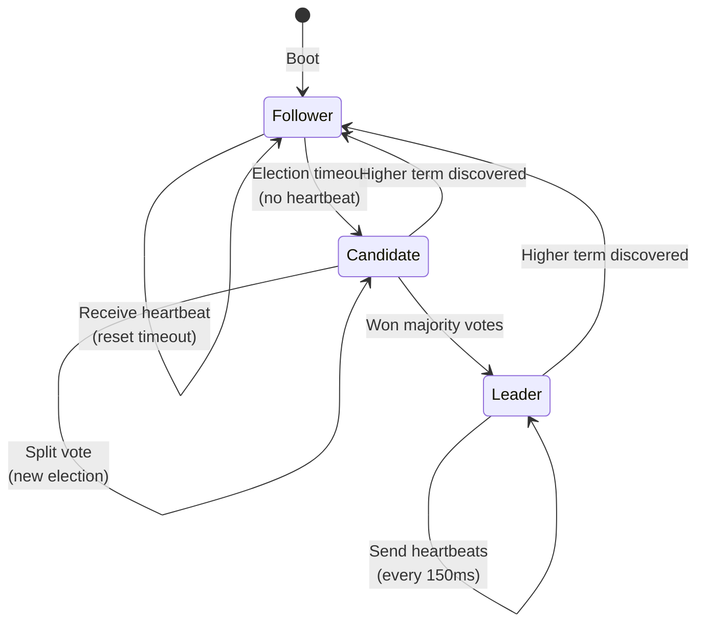
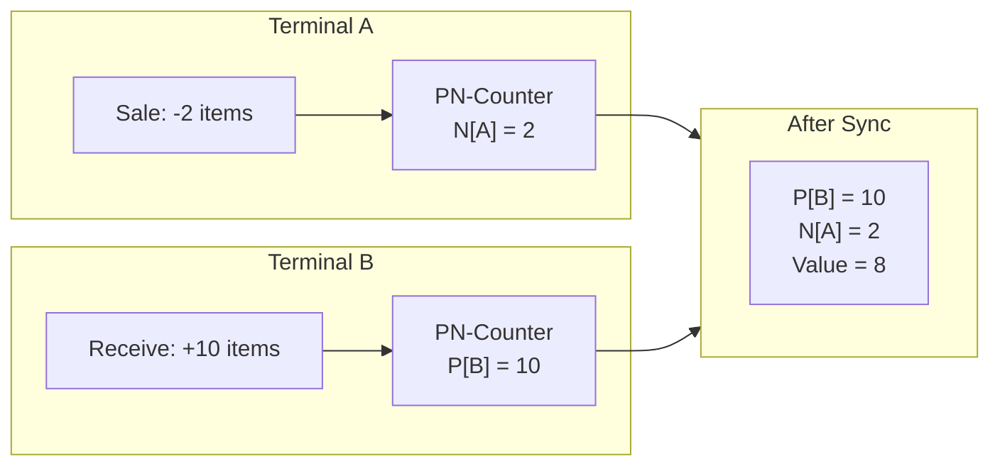
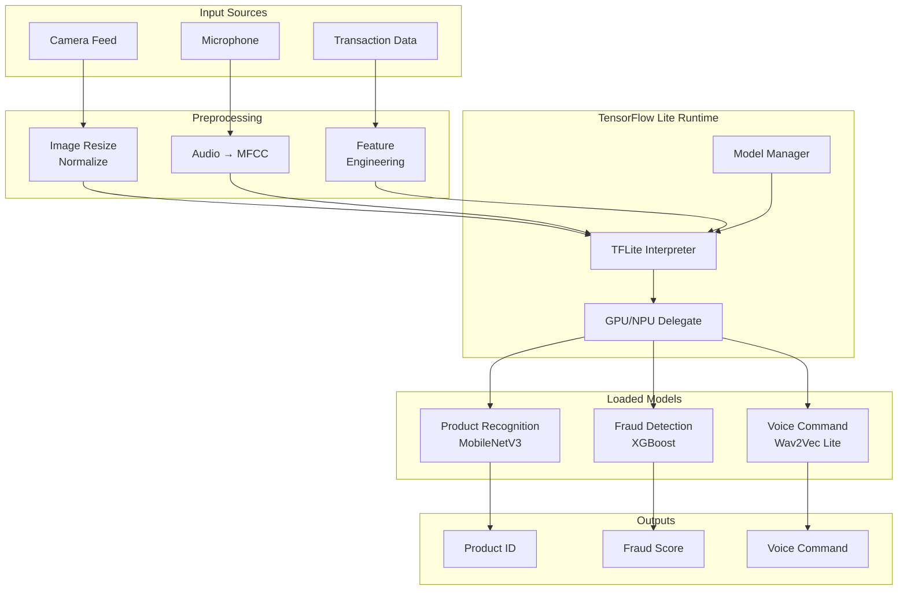

# Deep Dive & Bottlenecks

[Back to Index](./00-index.md)

---

## Critical Component 1: Raft-Based Leader Election Engine

### Why This Is Critical

The leader terminal is the **single point of coordination** for:
- Aggregating deltas from all follower terminals
- Coordinating cloud sync (only leader talks to cloud)
- Resolving conflicts that CRDTs can't handle automatically
- Managing store-wide configuration updates

If leader election fails or is slow, in-store sync degrades and cloud sync stops.

### How It Works Internally



**Election Flow:**

1. **Follower starts** with random election timeout (300-500ms)
2. **Timeout fires** → becomes Candidate, increments term, votes for self
3. **RequestVote RPCs** sent to all peers
4. **Majority votes** → becomes Leader, starts heartbeats
5. **Heartbeats** (AppendEntries with no entries) every 150ms
6. **Followers reset timeout** on heartbeat receipt

**Key Parameters:**

| Parameter | Value | Rationale |
|-----------|-------|-----------|
| Election timeout | 300-500ms (random) | Long enough to avoid false elections |
| Heartbeat interval | 150ms | 2-3 per election timeout |
| Max cluster size | 15 terminals | Practical limit for store |

### Failure Modes

| Failure | Detection | Impact | Recovery |
|---------|-----------|--------|----------|
| **Leader crash** | No heartbeat for 500ms | No cloud sync, local sync continues | New election (2-5s) |
| **Network partition** | Timeout + split quorum | Smaller partition read-only | Partition heals, new leader |
| **Split brain** | Two leaders with diff terms | Conflicting decisions | Higher term wins |
| **Slow leader** | Heartbeat delays | Election triggered | New leader elected |
| **All terminals down** | N/A | Store offline | Manual restart |

### Split Brain Handling

```
Scenario: 5 terminals, network splits into [A, B] and [C, D, E]

Partition 1: [A, B] (2 nodes) - cannot form quorum
  - A was leader (term 5)
  - Keeps heartbeating to B
  - Cannot commit new entries (needs 3/5)
  - Enters "leader without quorum" mode
  - Stops cloud sync

Partition 2: [C, D, E] (3 nodes) - can form quorum
  - Election timeout fires
  - C becomes candidate (term 6)
  - Gets votes from D, E
  - C becomes leader (term 6)
  - Continues cloud sync

Network heals:
  - A receives heartbeat from C with term 6
  - A steps down (term 5 < term 6)
  - A, B become followers of C
  - Log entries reconciled via AppendEntries
```

### How We Handle Failures

```
function handleLeaderFailure():
    // Follower detects no heartbeat
    if timeSinceLastHeartbeat > ELECTION_TIMEOUT:
        startElection()

    // During election, local ops continue
    // Transactions saved to local DB
    // Marked as "pending sync to leader"

function handleSplitBrain():
    // On receiving AppendEntries with higher term
    if request.term > currentTerm:
        stepDown()
        currentTerm = request.term
        reconcileLog(request.entries)

function handleLeaderWithoutQuorum():
    // Leader can't reach majority
    if successfulHeartbeats < quorumSize:
        enterDegradedMode()
        // Accept local transactions
        // Queue cloud syncs
        // Alert store manager
```

---

## Critical Component 2: CRDT Sync Engine

### Why This Is Critical

CRDTs are the foundation of **conflict-free offline operation**. Every terminal can independently:
- Create transactions
- Update inventory
- Modify customer data

All changes must merge correctly when terminals sync, without requiring coordination.

### How It Works Internally



**CRDT Types Used:**

| Data Type | CRDT | Merge Rule | Example |
|-----------|------|------------|---------|
| Inventory | PN-Counter | Sum P, sum N | 10 received - 5 sold = 5 |
| Transactions | OR-Set | Union, tombstones | All transactions kept |
| Product price | LWW-Register | Latest timestamp | Price $9.99 @ T+100 |
| Customer points | G-Counter | Sum per terminal | A:50 + B:30 = 80 points |

**Delta Propagation:**

```
Terminal A timeline:
  T=100: Sale (inventory -1)
  T=101: Sale (inventory -2)
  T=102: Sync to leader (send delta T=100-102)

Leader receives:
  Delta from A: [
    {ts:100, type:INV_DEC, product:SKU1, amount:1},
    {ts:101, type:INV_DEC, product:SKU1, amount:2}
  ]

  Merge:
    inventory[SKU1].N[A] = max(0, 3) = 3

Broadcast to B, C:
  {ts:100-102, delta from A: N[A]=3}

Terminal B merges:
  Local: P[B]=10, N[B]=1
  Received: N[A]=3
  Merged: P[B]=10, N[A]=3, N[B]=1
  Value: 10 - 3 - 1 = 6
```

### Failure Modes

| Failure | Detection | Impact | Recovery |
|---------|-----------|--------|----------|
| **Delta lost** | ACK timeout | Temporary divergence | Resend delta |
| **Merge conflict** | Impossible for CRDTs | N/A | N/A (mathematically safe) |
| **Clock skew** | Lamport TS comparison | None (logical clocks) | Clocks synchronized on merge |
| **Event log full** | Storage threshold | Cannot record events | Compact log, sync first |
| **Tombstone buildup** | OR-Set size | Memory bloat | Garbage collection |

### Garbage Collection for CRDTs

```
function compactEventLog():
    // Events synced to cloud can be compacted
    minSafeTs = min(syncState[peer].lastSynced for peer in allPeers)
    cloudSyncedTs = getCloudSyncedTimestamp()

    safeToPrune = min(minSafeTs, cloudSyncedTs)

    // Prune old events
    for event in eventLog:
        if event.ts < safeToPrune:
            archiveEvent(event)  // Compress and store
            deleteFromLog(event)

function compactPNCounter(counter):
    // Periodically, leader can checkpoint
    checkpoint = {
        value: counter.value(),
        timestamp: now(),
        checkpointed_by: leader_id
    }
    // Reset P and N with single entry
    counter.P = {leader_id: counter.value() if value > 0 else 0}
    counter.N = {leader_id: abs(counter.value()) if value < 0 else 0}
```

---

## Critical Component 3: Edge AI Runtime

### Why This Is Critical

Edge AI enables **intelligent automation without network dependency**:
- Product recognition eliminates barcode dependency
- Fraud detection protects during offline mode
- Voice commands enable hands-free operation
- Demand prediction optimizes inventory

All inference must complete within latency budgets on constrained hardware.

### How It Works Internally



**Model Specifications:**

| Model | Architecture | Input | Output | Latency (INT8) |
|-------|--------------|-------|--------|----------------|
| **Product Recognition** | MobileNetV3-Small | 224x224 RGB | 1000-class + bbox | 45ms |
| **Barcode Detection** | Custom CNN | 320x240 gray | Barcode value | 15ms |
| **Fraud Detection** | XGBoost (TFLite) | 20 features | [0,1] score | 5ms |
| **Voice Command** | Wav2Vec Lite | 1s audio | 50 commands | 80ms |

**Hardware Acceleration:**

```
function initializeRuntime():
    interpreter = TFLiteInterpreter()

    // Try GPU delegate first
    if isGPUAvailable():
        gpuDelegate = GPUDelegate(
            precision = "FP16",
            allow_quant = true
        )
        interpreter.addDelegate(gpuDelegate)

    // Fallback to NNAPI (Android)
    elif isNNAPIAvailable():
        nnapiDelegate = NNAPIDelegate()
        interpreter.addDelegate(nnapiDelegate)

    // Fallback to XNNPACK (CPU optimized)
    else:
        xnnpackOptions = XNNPackDelegateOptions(num_threads=4)
        interpreter.addDelegate(XNNPackDelegate(xnnpackOptions))

    return interpreter
```

### Failure Modes

| Failure | Detection | Impact | Recovery |
|---------|-----------|--------|----------|
| **Model file corrupt** | Checksum mismatch | Inference fails | Fallback to manual, redownload |
| **Inference timeout** | >300ms | Slow checkout | Skip AI, log incident |
| **OOM during inference** | Memory allocation fail | Crash risk | Reduce batch size, restart |
| **Wrong prediction** | Confidence < threshold | Incorrect product | Require manual confirmation |
| **Model drift** | Accuracy drop over time | Quality degradation | Cloud triggers update |

### Inference Optimization

```
function runProductRecognition(image):
    // Preprocess
    resized = resize(image, 224, 224)
    normalized = (resized - 127.5) / 127.5  // INT8 range

    // Batch if multiple products
    if queue.size > 1:
        batch = stack(queue.take(4))  // Max batch 4
        results = interpreter.runBatch(batch)
    else:
        results = interpreter.run(normalized)

    // Post-process
    for result in results:
        if result.confidence < 0.7:
            result.requires_confirmation = true

    return results

function runWithTimeout(model, input, timeout_ms):
    future = asyncRun(model.run, input)

    try:
        result = await future.wait(timeout_ms)
        return result
    except TimeoutError:
        log.warn("Inference timeout", model=model.name)
        return FallbackResult(
            action = "MANUAL_ENTRY",
            reason = "inference_timeout"
        )
```

---

## Concurrency & Race Conditions

### Race Condition 1: Last Item Sold Simultaneously

```
Scenario:
  Inventory(SKU-123) = 1
  Terminal A: Sells 1 unit
  Terminal B: Sells 1 unit (same instant)

Problem:
  Both terminals see inventory = 1
  Both decrement locally
  Both complete sale
  Actual inventory = -1 (oversold)

CRDT Behavior:
  A: N[A] = 1
  B: N[B] = 1
  Merged: N[A] = 1, N[B] = 1
  Value = 0 - 1 - 1 = -2 (if no initial P)

  With starting inventory:
  P[initial] = 10, N[A] = 5, N[B] = 6
  Value = 10 - 5 - 6 = -1

Solution:
  - CRDTs correctly merge (sum of decrements)
  - Negative inventory detected post-sync
  - AI resolver determines which sale to flag
  - Options: backorder, void, adjust inventory
```

**Resolution Logic:**

```
function detectOversell():
    for product in products:
        inventory = getInventoryValue(product.id)
        if inventory < 0:
            conflicts.append({
                product_id: product.id,
                current_value: inventory,
                transactions: getRecentSales(product.id)
            })

    for conflict in conflicts:
        resolution = aiResolver.resolveOversell(conflict)
        applyResolution(resolution)

function applyResolution(resolution):
    switch resolution.action:
        case "BACKORDER":
            createBackorder(resolution.product_id, abs(resolution.shortfall))
            notifyManager("Backorder created for " + resolution.product_id)

        case "VOID_TRANSACTION":
            voidTransaction(resolution.transaction_id)
            refundCustomer(resolution.transaction_id)
            notifyManager("Transaction voided: " + resolution.transaction_id)

        case "ADJUST_INVENTORY":
            manualAdjustment(resolution.product_id, resolution.adjustment)
            createAuditLog("Manual adjustment by system")
```

### Race Condition 2: Leader Failover During Cloud Sync

```
Scenario:
  Leader has 100 pending events to sync
  Leader starts cloud sync (50 events sent)
  Leader crashes mid-sync
  New leader elected

Problem:
  Which events were acked by cloud?
  New leader might resend duplicates

Solution:
  - Cloud sync is idempotent (event IDs)
  - New leader queries cloud for last acked event
  - Resumes from last confirmed position
```

**Sync Handoff Protocol:**

```
function onBecomeLeader():
    // Query cloud for sync state
    cloudState = api.get("/sync/state", {store_id: store_id})
    lastAckedTs = cloudState.last_acked_lamport_ts

    // Build sync queue from local + all followers
    syncQueue = []
    for terminal in cluster:
        events = terminal.getEventsSince(lastAckedTs)
        syncQueue.extend(events)

    // Deduplicate and sort
    syncQueue = dedupe(syncQueue, key = event.id)
    syncQueue.sort(key = event.lamport_ts)

    // Resume cloud sync
    startCloudSync(syncQueue)
```

### Race Condition 3: Concurrent Price Update

```
Scenario:
  Cloud pushes new price for SKU-123: $9.99
  Backoffice user updates price: $8.99
  Both arrive at terminal nearly simultaneously

CRDT Behavior (LWW-Register):
  Cloud update: value=$9.99, ts=1000
  Backoffice: value=$8.99, ts=1001

  Result: $8.99 wins (higher timestamp)

Edge Case:
  What if cloud timestamp is higher due to clock?
  → Use hybrid logical clocks (HLC)
  → Physical time + logical counter
  → Tie-breaker: terminal ID
```

---

## Bottleneck Analysis

### Bottleneck 1: Sync Bandwidth During Peak Hours

| Metric | Normal | Peak | Limit |
|--------|--------|------|-------|
| Events/terminal/min | 10 | 100 | - |
| Event size | 500 B | 500 B | - |
| Terminal count | 5 | 5 | - |
| Raw bandwidth | 25 KB/min | 250 KB/min | - |
| Peak sync burst | - | 2.5 MB (10 min backlog) | 10 Mbps LAN |

**Mitigation:**

1. **Delta compression**: gzip deltas (70% reduction)
2. **Batching**: Sync every 30s during peak instead of 5s
3. **Prioritization**: Transactions first, inventory second
4. **Backpressure**: Leader throttles followers if overloaded

```
function syncWithBackpressure(delta, follower):
    if leaderQueueSize > HIGH_WATER_MARK:
        // Slow down acceptance
        delay = calculateBackoff(leaderQueueSize)
        sleep(delay)

    if leaderQueueSize > CRITICAL_WATER_MARK:
        // Reject new deltas temporarily
        return SyncResponse(
            status = "BACKPRESSURE",
            retry_after_ms = 1000
        )

    // Normal processing
    processeDelta(delta)
    return SyncResponse(status = "OK")
```

### Bottleneck 2: AI Model Inference Latency

| Model | CPU (ms) | GPU (ms) | Target (ms) |
|-------|----------|----------|-------------|
| Product Recognition | 150 | 45 | <100 |
| Fraud Detection | 20 | 5 | <50 |
| Voice Command | 200 | 80 | <150 |

**Mitigation:**

1. **Model quantization**: INT8 reduces size 4x, speeds up 2x
2. **Hardware delegation**: Use GPU/NPU when available
3. **Async inference**: Don't block checkout for non-critical AI
4. **Caching**: Cache recent product recognition results

```
class InferenceCache:
    cache = LRU(size=1000)

    function recognizeProduct(image):
        hash = perceptualHash(image)

        if cache.has(hash):
            return cache.get(hash)

        result = model.infer(image)
        cache.put(hash, result, ttl=5_MINUTES)
        return result
```

### Bottleneck 3: Local Storage on Terminals

| Data Type | Per Day | 30 Days | Limit |
|-----------|---------|---------|-------|
| Transactions | 2 MB | 60 MB | - |
| Event log | 5 MB | 150 MB | - |
| Product images | 0 (cached) | 500 MB | - |
| AI models | 0 (static) | 150 MB | - |
| Total | 7 MB | 860 MB | 2 GB |

**Mitigation:**

1. **Aggressive pruning**: Delete synced events after 7 days
2. **Compression**: Compress old transaction data
3. **Cloud offload**: Move images to cloud, keep thumbnails
4. **Model streaming**: Load models on-demand if space-constrained

```
function pruneLocalStorage():
    // Prune events synced to cloud
    syncedEvents = query("SELECT * FROM event_log WHERE synced_to_cloud = 1 AND created_at < ?", daysAgo(7))
    for event in syncedEvents:
        delete(event)

    // Compress old transactions
    oldTransactions = query("SELECT * FROM transactions WHERE created_at < ?", daysAgo(30))
    compressedBlob = compress(serialize(oldTransactions))
    archive("transactions_archive", compressedBlob)
    delete(oldTransactions)

    // Clear product image cache if low on space
    if freeSpace() < 500_MB:
        clearImageCache(keep_recent=100)
```

---

## Monitoring Points for Critical Components

| Component | Key Metrics | Alert Threshold |
|-----------|-------------|-----------------|
| **Leader Election** | Election frequency | >3/hour |
| **Leader Election** | Failover duration | >10 seconds |
| **Leader Election** | Split brain events | >0 |
| **CRDT Sync** | Sync lag (terminal to leader) | >60 seconds |
| **CRDT Sync** | Event queue depth | >10,000 events |
| **CRDT Sync** | Conflict rate | >1% of transactions |
| **Edge AI** | Inference latency p99 | >300ms |
| **Edge AI** | Model accuracy (sampled) | <90% |
| **Edge AI** | Fallback rate | >5% of inferences |
