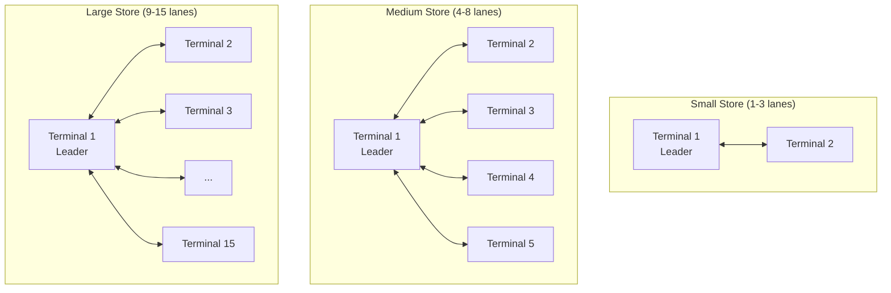
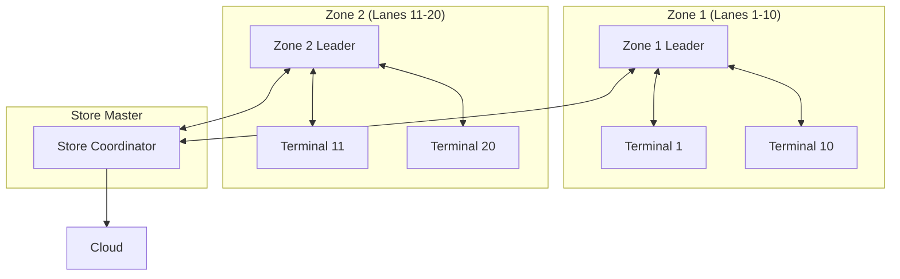
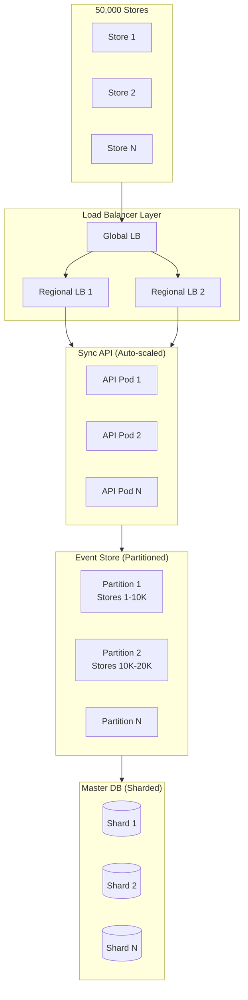
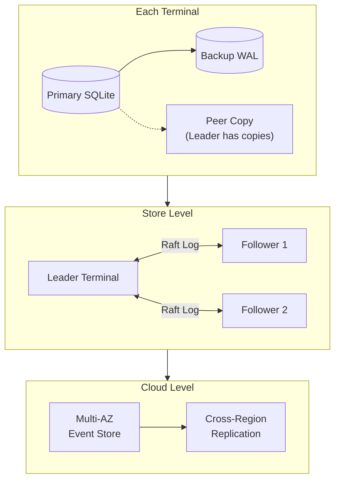
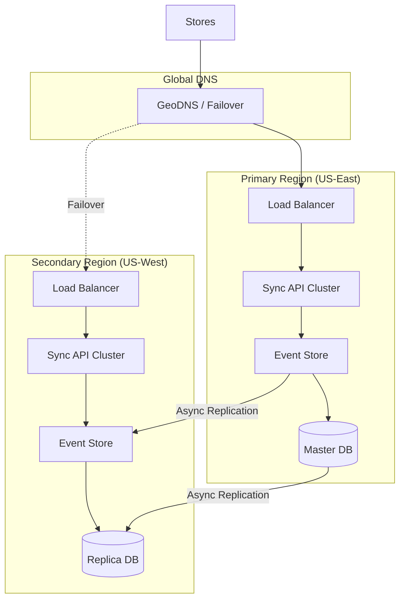

# Scalability & Reliability

[Back to Index](./00-index.md)

---

## Scalability

### Scaling Dimensions

| Dimension | Current | Target | Max Tested |
|-----------|---------|--------|------------|
| **Stores** | 10,000 | 50,000 | 100,000 |
| **Terminals per store** | 3-5 | 5-10 | 15 |
| **Transactions/day/store** | 500 | 2,000 | 10,000 |
| **Products/store** | 5,000 | 20,000 | 100,000 |
| **Cloud sync frequency** | 15 min | 5 min | 1 min |

### Horizontal vs Vertical Scaling

| Layer | Scaling Strategy | Rationale |
|-------|------------------|-----------|
| **Terminal** | Vertical (better hardware) | Fixed deployment per lane |
| **Store Cluster** | Horizontal (add terminals) | Up to 15 for Raft efficiency |
| **Cloud Sync API** | Horizontal (add instances) | Stateless, load balanced |
| **Event Store** | Horizontal (partitioned) | By store_id |
| **Master Database** | Horizontal (sharded) | By store_id |

### Store-Level Scaling



**Why 15 Terminal Limit:**
- Raft consensus overhead increases with cluster size
- Leader must send heartbeats to N-1 followers
- Election timeout scales with cluster size
- Network bandwidth for full mesh sync
- Practical limit for retail store lanes

**For Larger Stores (>15 lanes):**



### Cloud-Level Scaling



### Auto-Scaling Configuration

```yaml
# Cloud API Auto-scaling
apiVersion: autoscaling/v2
kind: HorizontalPodAutoscaler
metadata:
  name: pos-sync-api
spec:
  scaleTargetRef:
    apiVersion: apps/v1
    kind: Deployment
    name: pos-sync-api
  minReplicas: 10
  maxReplicas: 100
  metrics:
    - type: Resource
      resource:
        name: cpu
        target:
          type: Utilization
          averageUtilization: 70
    - type: Pods
      pods:
        metric:
          name: sync_requests_per_second
        target:
          type: AverageValue
          averageValue: "500"
  behavior:
    scaleUp:
      stabilizationWindowSeconds: 60
      policies:
        - type: Percent
          value: 100
          periodSeconds: 60
    scaleDown:
      stabilizationWindowSeconds: 300
      policies:
        - type: Percent
          value: 10
          periodSeconds: 60
```

### Database Sharding Strategy

| Shard Key | Strategy | Rationale |
|-----------|----------|-----------|
| `store_id` | Hash modulo N | Even distribution |
| Lookups | Shard-aware routing | No cross-shard queries |
| Analytics | Separate OLAP cluster | No impact on OLTP |

```
function routeToShard(store_id):
    shard_number = hash(store_id) % NUM_SHARDS
    return getShardConnection(shard_number)

function syncTransaction(store_id, transaction):
    shard = routeToShard(store_id)
    shard.insert("transactions", transaction)
```

### Caching Strategy

| Cache Layer | Technology | TTL | Hit Rate Target |
|-------------|------------|-----|-----------------|
| **Terminal L1** | In-memory | 5 min | 95% (products) |
| **Leader L2** | Redis | 15 min | 80% (aggregates) |
| **Cloud L3** | Redis Cluster | 1 hour | 70% (store configs) |
| **CDN** | Edge cache | 24 hours | 99% (AI models) |

```
class MultiLevelCache:
    l1 = LocalMemoryCache(max_size=1000)
    l2 = RedisCache(leader_address)
    l3 = CloudRedisCache(cluster_address)

    function get(key, level="L1"):
        // Try L1 first
        value = l1.get(key)
        if value:
            return value

        // Try L2 if terminal is synced with leader
        if level >= "L2" and leaderAvailable:
            value = l2.get(key)
            if value:
                l1.put(key, value)
                return value

        // Try L3 if online
        if level >= "L3" and isOnline:
            value = l3.get(key)
            if value:
                l1.put(key, value)
                return value

        return None
```

---

## Reliability & Fault Tolerance

### Availability Targets by Component

| Component | Availability | Downtime/Year | Notes |
|-----------|--------------|---------------|-------|
| **Local Transaction** | 100% | 0 | Hardware-dependent |
| **In-Store Sync** | 99.9% | 8.7 hours | Leader failover |
| **Cloud Sync** | 99.5% | 1.8 days | Network + cloud |
| **AI Inference** | 99.9% | 8.7 hours | Model availability |
| **Reporting** | 99.0% | 3.6 days | Acceptable delay |

### Single Points of Failure (SPOF)

| SPOF | Impact | Mitigation |
|------|--------|------------|
| **Leader terminal** | No cloud sync | Raft failover (<5s) |
| **Store router** | No in-store sync | Fallback to direct sync |
| **Internet connection** | No cloud sync | 24+ hour offline mode |
| **Local storage** | Data loss risk | RAID + backup to peer |
| **AI model files** | No AI features | Fallback to manual |

### Redundancy Strategy



### Failover Mechanisms

#### Leader Failover (Raft)

```
Timeline of Leader Failure:

T+0:       Leader sends heartbeat
T+150ms:   Leader crashes
T+300ms:   Followers detect missing heartbeat
T+350ms:   Election timeout (random 300-500ms)
T+350ms:   Follower A becomes candidate
T+400ms:   Votes received from B, C
T+400ms:   Follower A becomes new leader
T+450ms:   New leader sends heartbeat
T+500ms:   Cluster stable

Total downtime: ~350ms (sync pause only)
Transactions: Never interrupted (local)
```

**Failover Pseudocode:**

```
function onHeartbeatTimeout():
    if state == FOLLOWER:
        // Become candidate
        state = CANDIDATE
        currentTerm += 1
        votedFor = self.id
        votesReceived = {self.id}

        // Request votes
        for peer in peers:
            response = sendRequestVote(peer, currentTerm, lastLogIndex, lastLogTerm)
            if response.voteGranted:
                votesReceived.add(peer.id)

            if len(votesReceived) > len(peers) / 2:
                becomeLeader()
                return

function becomeLeader():
    state = LEADER

    // Initialize leader state
    for peer in peers:
        nextIndex[peer] = len(log)
        matchIndex[peer] = 0

    // Send immediate heartbeat
    sendHeartbeatsToAll()

    // Query cloud for last sync state
    resumeCloudSync()
```

#### Cloud Sync Failover

```
function syncWithRetry(delta):
    retries = 0
    maxRetries = 5
    backoff = 1000  // ms

    while retries < maxRetries:
        try:
            response = api.post("/sync", delta, timeout=30s)
            if response.status == 200:
                return Success(response)
            elif response.status == 409:  // Conflict
                return handleConflict(response)
            else:
                throw RetriableError(response)

        except NetworkError, TimeoutError as e:
            retries += 1
            backoff = min(backoff * 2, 60000)  // Max 1 minute
            sleep(backoff + random(0, 1000))  // Jitter

    // All retries failed
    markDeltaForLaterRetry(delta)
    alertOperations("Cloud sync failing for store " + store_id)
    return Failure("Max retries exceeded")
```

### Circuit Breaker Pattern

```
class CircuitBreaker:
    state = CLOSED
    failureCount = 0
    successCount = 0
    lastFailureTime = null

    FAILURE_THRESHOLD = 5
    SUCCESS_THRESHOLD = 3
    TIMEOUT = 30_SECONDS

    function call(operation):
        if state == OPEN:
            if now() - lastFailureTime > TIMEOUT:
                state = HALF_OPEN
            else:
                return CachedResponse() or ErrorResponse()

        try:
            result = operation()
            onSuccess()
            return result
        except Exception as e:
            onFailure()
            throw e

    function onSuccess():
        if state == HALF_OPEN:
            successCount += 1
            if successCount >= SUCCESS_THRESHOLD:
                state = CLOSED
                failureCount = 0
                successCount = 0

    function onFailure():
        failureCount += 1
        lastFailureTime = now()
        if failureCount >= FAILURE_THRESHOLD:
            state = OPEN
```

### Graceful Degradation

| Scenario | Degraded Mode | User Impact |
|----------|---------------|-------------|
| **Cloud offline** | Local-only, queue syncs | Delayed reporting |
| **Leader offline** | Direct peer sync | Slightly slower sync |
| **AI model unavailable** | Manual product entry | Slower checkout |
| **Payment gateway down** | Cash-only or offline auth | Limited payment options |
| **Low storage** | Prune old data, compress | Reduced history |

```
function determineOperatingMode():
    modes = []

    if not isCloudReachable():
        modes.append("OFFLINE_SYNC")

    if not isLeaderAvailable():
        modes.append("PEER_SYNC")

    if not isAIModelLoaded("product_recognition"):
        modes.append("MANUAL_PRODUCT_ENTRY")

    if freeStoragePercent() < 10:
        modes.append("LOW_STORAGE")
        triggerEmergencyPruning()

    return modes

function displayDegradedModeUI(modes):
    for mode in modes:
        showBanner(getDegradedModeMessage(mode))

    // Still allow core operations
    enableCoreFeatures()  // Always: sales, cash payments
    disableOptionalFeatures(modes)  // AI, reporting, etc.
```

---

## Disaster Recovery

### Recovery Objectives

| Metric | Target | Justification |
|--------|--------|---------------|
| **RTO (Recovery Time)** | 4 hours | Business continuity |
| **RPO (Recovery Point)** | 15 minutes | Sync interval |
| **Local RTO** | 5 minutes | Terminal restart |
| **Local RPO** | 0 | WAL persistence |

### Backup Strategy

| Data | Backup Location | Frequency | Retention |
|------|-----------------|-----------|-----------|
| **Transactions** | Cloud event store | 15 min (sync) | 7 years |
| **Inventory** | Cloud + peer terminals | 15 min | Current |
| **Products** | Cloud master | Daily | Indefinite |
| **AI Models** | CDN + local cache | On update | 3 versions |
| **Configuration** | Cloud | On change | 30 days |

### Recovery Scenarios

#### Scenario 1: Single Terminal Failure

```
Impact: 1 checkout lane unavailable
RTO: 5 minutes (replacement terminal)
RPO: 0 (data replicated to leader)

Recovery Steps:
1. Detect terminal offline (heartbeat timeout)
2. Replace or restart terminal
3. Terminal boots, discovers leader via mDNS
4. Terminal requests state from leader
5. Full state sync (products, inventory, config)
6. Terminal operational
```

#### Scenario 2: Store-Wide Power Outage

```
Impact: Entire store offline
RTO: 10 minutes (after power restored)
RPO: 0 (SQLite WAL persistent)

Recovery Steps:
1. Power restored, all terminals boot
2. Each terminal recovers from local WAL
3. mDNS discovery establishes cluster
4. Leader election (first booted or highest log)
5. CRDT sync across terminals (reconcile any gaps)
6. Cloud sync resumes (push accumulated events)
```

#### Scenario 3: Cloud Region Outage

```
Impact: No cloud sync for all stores in region
RTO: N/A (offline mode)
RPO: Duration of outage (events queued)

Mitigation:
1. All stores continue in offline mode
2. Events queue on leader terminals
3. Multi-region failover for cloud (DNS-based)
4. Stores reconnect to secondary region
5. Sync queues drain
```

#### Scenario 4: Ransomware Attack on Terminal

```
Impact: Terminal data encrypted
RTO: 30 minutes (wipe and restore)
RPO: 0 (data replicated)

Recovery Steps:
1. Detect anomaly (checksum failures, encryption patterns)
2. Isolate affected terminal from network
3. Wipe terminal to factory state
4. Reinstall POS software from signed image
5. Terminal joins cluster, syncs from leader
6. Report incident for forensics
```

### Multi-Region Cloud Architecture



### Runbook: Store Recovery After Disaster

```
RUNBOOK: Store Recovery After Disaster

Prerequisites:
- Access to store location
- Replacement hardware (if needed)
- Network connectivity

Step 1: Assess Damage
□ Check physical terminal status
□ Check network equipment
□ Check power supply
□ Document damaged equipment

Step 2: Restore Network
□ Power on router/switch
□ Verify LAN connectivity
□ Verify internet connectivity (if available)

Step 3: Boot Terminals (in order)
□ Boot first terminal (will become leader)
□ Wait for leader election (30 seconds)
□ Boot remaining terminals

Step 4: Verify Cluster Health
□ Check all terminals discovered (mDNS)
□ Verify leader elected
□ Check heartbeat status

Step 5: Data Recovery Check
□ Verify local transactions recovered from WAL
□ Run inventory reconciliation
□ Compare with last cloud sync

Step 6: Resume Cloud Sync
□ Check cloud connectivity
□ Monitor sync queue drain
□ Verify sync completion

Step 7: Validation
□ Process test transaction
□ Verify synced to leader
□ Verify synced to cloud (if online)

Step 8: Documentation
□ Document incident timeline
□ Record any data discrepancies
□ Update incident ticket
```

---

## Load Testing Benchmarks

| Scenario | TPS | Latency p99 | Pass Criteria |
|----------|-----|-------------|---------------|
| **Steady state (5 terminals)** | 50 | <100ms | All transactions processed |
| **Peak hour (5 terminals)** | 150 | <200ms | <1% timeout |
| **Leader failover** | - | <5s recovery | No lost transactions |
| **Cloud sync burst** | 1000 events | <10s | All synced |
| **24-hour offline** | 5000 txn | - | All recovered on reconnect |

```
function loadTest_SteadyState():
    terminals = [Terminal() for _ in range(5)]
    transactions_per_minute = 10

    for 60 minutes:
        for terminal in terminals:
            for _ in range(transactions_per_minute):
                transaction = generateRandomTransaction()
                latency = terminal.processTransaction(transaction)
                record(latency)

    assert percentile(latencies, 99) < 100ms
    assert all transactions synced

function loadTest_LeaderFailover():
    terminals = [Terminal() for _ in range(5)]
    leader = electLeader(terminals)

    // Generate traffic
    startTransactionLoad(terminals, tps=50)

    // Kill leader at T+30s
    at T+30s:
        leader.crash()

    // Measure recovery
    newLeader = waitForLeaderElection()
    recoveryTime = newLeader.electionTime - leader.crashTime

    assert recoveryTime < 5s
    assert no transactions lost
```
