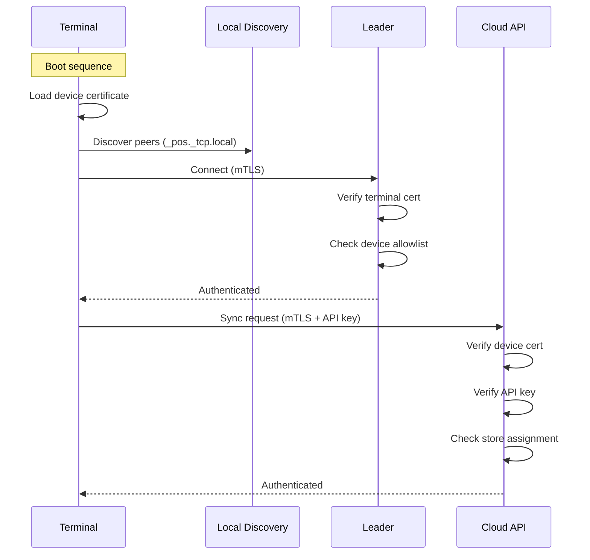
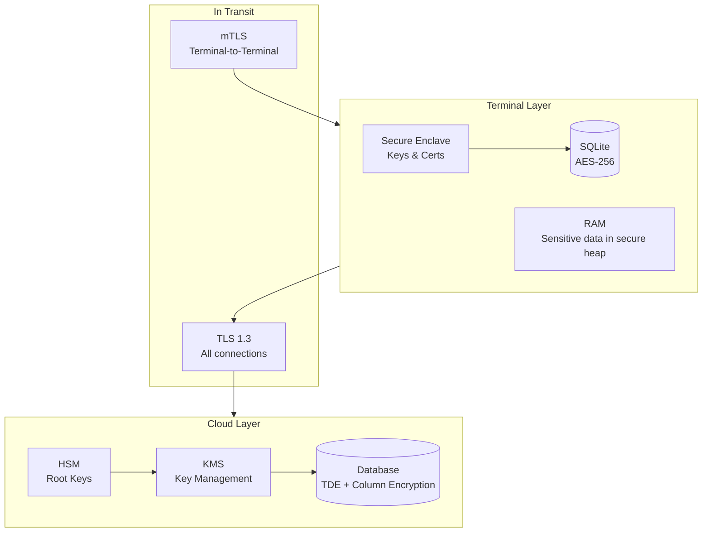
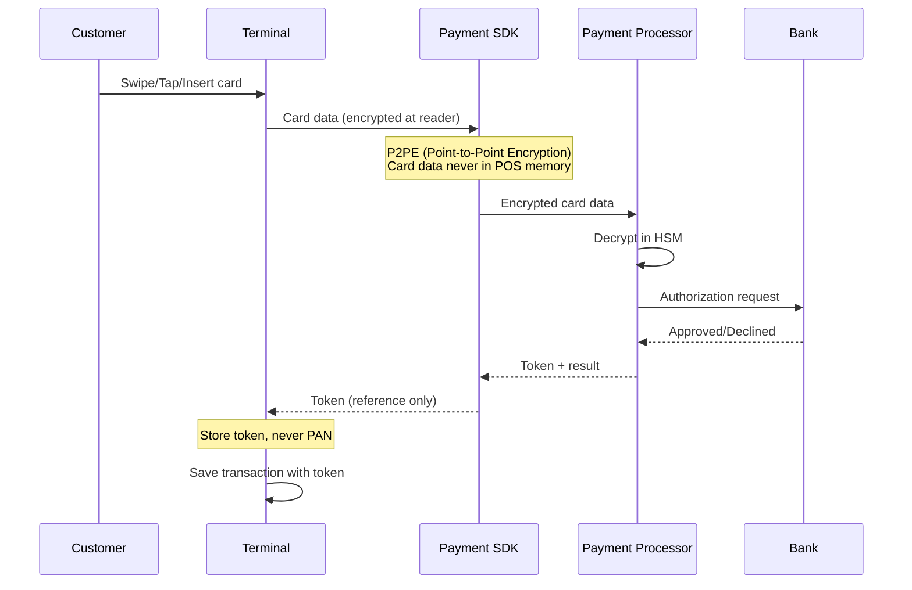
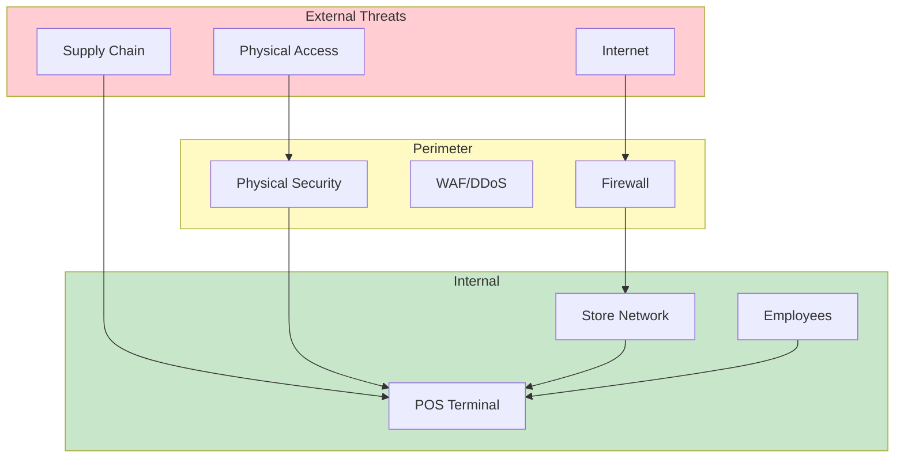

# Security & Compliance

[Back to Index](./00-index.md)

---

## Authentication & Authorization

### Device Authentication

POS terminals are critical infrastructure and require strong device authentication.



**Device Certificate Management:**

| Certificate | Issuer | Validity | Rotation |
|-------------|--------|----------|----------|
| **Terminal Cert** | Company CA | 2 years | Annual renewal |
| **Leader Cert** | Company CA | 2 years | Annual renewal |
| **Cloud API Cert** | Public CA | 1 year | Automated via ACME |
| **mTLS Client Cert** | Internal CA | 1 year | On device provision |

**Enrollment Flow:**

```
function enrollNewTerminal(device):
    // Generate key pair on device
    keyPair = device.generateKeyPair(algorithm="ECDSA", curve="P-256")

    // Create CSR
    csr = createCSR(
        subject = "CN=" + device.serial_number,
        publicKey = keyPair.public
    )

    // Submit to enrollment service
    certificate = enrollmentService.signCSR(
        csr = csr,
        storeId = device.assigned_store,
        deviceType = "pos_terminal"
    )

    // Store securely
    device.secureStorage.store("device_cert", certificate)
    device.secureStorage.store("private_key", keyPair.private)

    // Add to store's device allowlist
    storeConfig.addDevice(device.serial_number, certificate.fingerprint)
```

### User Authentication

| User Type | Auth Method | Session Duration | MFA |
|-----------|-------------|------------------|-----|
| **Cashier** | PIN (4-6 digits) | Shift (8 hours) | Optional |
| **Supervisor** | PIN + Badge | Transaction | Required |
| **Manager** | Username/Password | Session (30 min) | Required |
| **Admin** | SSO (OIDC) | Session (15 min) | Required |

**Cashier PIN Auth (Local):**

```
function authenticateCashier(pin):
    // Hash PIN with device-specific salt
    hashedPin = hash(pin, device.salt, algorithm="Argon2id")

    // Lookup in local user cache
    user = localUserCache.findByPinHash(hashedPin)

    if user and user.status == "active":
        // Check shift assignment
        if not isUserAssignedToShift(user.id, currentShift):
            return AuthResult.DENIED("Not assigned to current shift")

        // Create local session
        session = createSession(user, duration=8_HOURS)
        return AuthResult.SUCCESS(session)

    return AuthResult.DENIED("Invalid PIN")
```

### Authorization Model (RBAC)

| Role | Permissions | Scope |
|------|-------------|-------|
| **Cashier** | Process sales, view products, apply discounts (limit) | Own terminal |
| **Supervisor** | Void transactions, override prices, cash drawer | Store |
| **Manager** | All operations, reports, config changes | Store |
| **Admin** | System config, user management, multi-store | Organization |

**Permission Check:**

```
function checkPermission(user, action, resource):
    role = user.role
    permissions = rolePermissions[role]

    if action not in permissions:
        return Denied("Insufficient permissions")

    // Check scope
    if permissions[action].scope == "own_terminal":
        if resource.terminal_id != user.current_terminal:
            return Denied("Cannot access other terminal's resources")

    if permissions[action].scope == "store":
        if resource.store_id != user.store_id:
            return Denied("Cannot access other store's resources")

    // Check limits
    if action == "apply_discount":
        if resource.discount_percent > permissions[action].max_discount:
            return RequiresSupervisor("Discount exceeds limit")

    return Allowed()
```

---

## Data Security

### Encryption Architecture



### Encryption at Rest

| Data Type | Encryption | Key Location | Rotation |
|-----------|------------|--------------|----------|
| **SQLite DB** | AES-256-GCM | Secure Enclave | Yearly |
| **Transaction logs** | AES-256 | Device TPM | Yearly |
| **Payment tokens** | AES-256-GCM | HSM reference | Per transaction |
| **AI models** | Signed + encrypted | Device cert | On update |
| **Cloud database** | TDE (Transparent) | Cloud KMS | Quarterly |
| **PII columns** | Column-level AES | KMS | Monthly |

**SQLite Encryption:**

```
function openEncryptedDatabase():
    // Get encryption key from secure storage
    key = secureEnclave.getKey("db_encryption_key")

    if not key:
        // First boot: generate and store key
        key = secureEnclave.generateKey(
            algorithm = "AES-256-GCM",
            extractable = false
        )
        secureEnclave.storeKey("db_encryption_key", key)

    // Open SQLite with SQLCipher
    db = SQLCipher.open(
        path = "/data/pos.db",
        key = key,
        cipher = "aes-256-gcm",
        kdf_iter = 256000
    )

    return db
```

### Encryption in Transit

| Connection | Protocol | Cipher Suite | Certificate Pinning |
|------------|----------|--------------|---------------------|
| **Terminal ↔ Terminal** | mTLS (TLS 1.3) | TLS_AES_256_GCM_SHA384 | Yes (internal CA) |
| **Terminal ↔ Cloud** | TLS 1.3 | TLS_AES_256_GCM_SHA384 | Yes (public key) |
| **Terminal ↔ Payment** | TLS 1.3 + tokenization | TLS_AES_256_GCM_SHA384 | Yes |

### PII Handling

| PII Type | Storage | Masking | Retention |
|----------|---------|---------|-----------|
| **Customer name** | Encrypted | Full access (authorized) | GDPR-compliant |
| **Phone number** | Encrypted | Last 4 digits | GDPR-compliant |
| **Email** | Encrypted | Partial (j***@example.com) | GDPR-compliant |
| **Card number** | Never stored | Tokenized | Never stored |
| **CVV** | Never stored | Never stored | Never stored |

**PII Masking Utility:**

```
function maskPII(data, field, accessLevel):
    switch field:
        case "phone":
            if accessLevel >= "supervisor":
                return data  // Full access
            else:
                return "***-***-" + data[-4:]

        case "email":
            if accessLevel >= "supervisor":
                return data
            else:
                parts = data.split("@")
                return parts[0][0] + "***@" + parts[1]

        case "card_number":
            // Never return full card number
            return "****-****-****-" + data[-4:]

        default:
            return data
```

---

## Payment Security (PCI-DSS)

### PCI-DSS Scope

| Requirement | Implementation | Status |
|-------------|----------------|--------|
| **1. Firewall** | Network segmentation, terminal isolation | Required |
| **2. Secure defaults** | Hardened OS, no default passwords | Required |
| **3. Protect stored data** | Tokenization, no full PAN storage | Required |
| **4. Encrypt transmission** | TLS 1.3 for all payment data | Required |
| **5. Anti-malware** | Host-based security, signed software | Required |
| **6. Secure systems** | Patch management, vulnerability scanning | Required |
| **7. Access control** | RBAC, least privilege | Required |
| **8. User authentication** | Unique IDs, MFA for admin | Required |
| **9. Physical security** | Device tamper detection | Required |
| **10. Logging/monitoring** | Audit trails, SIEM integration | Required |
| **11. Security testing** | Quarterly scans, annual pentest | Required |
| **12. Security policy** | Documented, trained staff | Required |

### Payment Flow (Tokenization)



**Payment SDK Integration:**

```
function processCardPayment(amount):
    // Start P2PE session
    session = paymentSDK.startSession(
        amount = amount,
        currency = "USD",
        timeout = 60_SECONDS
    )

    // Wait for card input (encrypted at hardware level)
    encryptedCardData = session.awaitCardInput()

    // Send to PSP (we never see plaintext card data)
    result = paymentSDK.authorize(
        sessionId = session.id,
        encryptedData = encryptedCardData
    )

    if result.approved:
        // Store only token for reference
        transaction.paymentToken = result.token
        transaction.last4 = result.last4
        transaction.cardBrand = result.brand
        return PaymentResult.SUCCESS(result)
    else:
        return PaymentResult.DECLINED(result.reason)
```

### Offline Payment Handling

| Scenario | Limit | Risk Mitigation |
|----------|-------|-----------------|
| **Offline card auth** | $50 per transaction | Velocity checks, fraud model |
| **Offline cash** | Unlimited | Cash drawer reconciliation |
| **Offline digital** | $0 (requires online) | Queue for online retry |
| **Cumulative offline** | $500 per shift | Force online auth |

```
function canProcessOfflinePayment(transaction):
    if transaction.paymentMethod == "digital":
        return CannotProcess("Digital payments require online connection")

    if transaction.paymentMethod == "card":
        if transaction.amount > OFFLINE_CARD_LIMIT:
            return CannotProcess("Amount exceeds offline limit")

        // Check cumulative
        cumulativeOffline = getCumulativeOfflineAmount(currentShift)
        if cumulativeOffline + transaction.amount > CUMULATIVE_OFFLINE_LIMIT:
            return CannotProcess("Cumulative offline limit exceeded")

        // Run fraud check locally
        fraudScore = localFraudModel.score(transaction)
        if fraudScore > HIGH_RISK_THRESHOLD:
            return RequiresOnline("High risk transaction")

        return CanProcess(mode="store_and_forward")

    return CanProcess()  // Cash always OK
```

---

## Threat Model

### STRIDE Analysis

| Threat | Category | Attack Vector | Impact | Mitigation |
|--------|----------|---------------|--------|------------|
| **Rogue terminal** | Spoofing | Add unauthorized terminal to network | Data theft | Device allowlist, mTLS |
| **MITM on LAN** | Tampering | ARP spoofing, intercept sync | Data corruption | mTLS, certificate pinning |
| **Transaction replay** | Replay | Resubmit transaction | Financial loss | Idempotency keys, timestamps |
| **Privilege escalation** | Elevation | Exploit to gain admin | Full control | Least privilege, sandboxing |
| **Data exfiltration** | Disclosure | Malware on terminal | PII/PCI breach | Encryption, DLP, monitoring |
| **Ransomware** | DoS | Encrypt local data | Store shutdown | Redundancy, peer backup |
| **Insider threat** | All | Malicious employee | Varies | Audit logs, separation of duties |

### Attack Surface



### Top 5 Attack Vectors & Mitigations

#### 1. Rogue Terminal Injection

**Attack:** Attacker connects unauthorized device to store network, pretending to be a POS terminal.

**Mitigation:**
```
function validatePeerTerminal(connection):
    // Verify mTLS certificate
    cert = connection.peerCertificate
    if not cert.isSignedBy(COMPANY_CA):
        reject("Certificate not from trusted CA")

    // Check device allowlist
    deviceSerial = cert.subject.commonName
    if deviceSerial not in storeConfig.allowedDevices:
        reject("Device not in allowlist")
        alert("Unknown device attempted connection: " + deviceSerial)

    // Verify certificate fingerprint
    if cert.fingerprint != storeConfig.deviceFingerprints[deviceSerial]:
        reject("Certificate fingerprint mismatch")
        alert("Possible certificate spoofing: " + deviceSerial)

    accept()
```

#### 2. Man-in-the-Middle on Local Network

**Attack:** Attacker performs ARP spoofing to intercept terminal-to-terminal traffic.

**Mitigation:**
- **mTLS** for all terminal communication
- **Certificate pinning** to prevent MITM with fake certs
- **Network segmentation** (VLANs for POS)
- **ARP inspection** on managed switches

#### 3. Offline Data Tampering

**Attack:** Modify SQLite database during offline period to alter transactions.

**Mitigation:**
```
function verifyTransactionIntegrity(transaction):
    // Each transaction has HMAC signature
    expectedHmac = hmac(
        key = device.integrityKey,
        data = transaction.serialize()
    )

    if transaction.hmac != expectedHmac:
        flagTransaction(transaction, "INTEGRITY_FAILURE")
        alert("Transaction integrity failure: " + transaction.id)
        return Invalid()

    // Check Lamport timestamp continuity
    if transaction.lamport_ts <= lastVerifiedTs:
        flagTransaction(transaction, "TIMESTAMP_ANOMALY")
        return Invalid()

    return Valid()
```

#### 4. AI Model Poisoning

**Attack:** Inject malicious model that misclassifies products (lower price recognition) or approves fraud.

**Mitigation:**
```
function validateModelUpdate(update):
    // Verify signature from AI Hub
    if not verifySignature(update.signature, AI_HUB_PUBLIC_KEY):
        reject("Invalid model signature")
        return

    // Verify hash
    if sha256(update.modelData) != update.expectedHash:
        reject("Model hash mismatch")
        return

    // Run validation tests
    testResults = runModelValidationSuite(update.modelData)
    if testResults.accuracy < MINIMUM_ACCURACY_THRESHOLD:
        reject("Model accuracy below threshold")
        alert("Suspicious model update rejected")
        return

    // Atomic install
    atomicInstall(update.modelData)
```

#### 5. Cloud Sync Manipulation

**Attack:** Inject false transactions or inventory updates during cloud sync.

**Mitigation:**
```
function validateIncomingSync(syncData):
    // Verify comes from authenticated store
    if syncData.storeId != authenticatedStore.id:
        reject("Store ID mismatch")

    for event in syncData.events:
        // Verify event signature
        if not verifyEventSignature(event):
            reject("Invalid event signature")

        // Verify terminal is in store
        if event.terminalId not in storeConfig.terminals:
            reject("Unknown terminal")

        // Verify Lamport timestamp progression
        if event.lamport_ts <= lastKnownTs[event.terminalId]:
            reject("Stale or replayed event")

        // Apply
        applyEvent(event)
```

### Rate Limiting & DDoS Protection

| Endpoint | Rate Limit | Burst | Action on Exceed |
|----------|------------|-------|------------------|
| **Cloud Sync API** | 10 req/min/store | 20 | 429 + backoff |
| **Login attempts** | 5/min/terminal | 10 | Lock 15 min |
| **Void transactions** | 10/hour/user | 15 | Supervisor required |
| **Price overrides** | 20/hour/user | 30 | Manager required |

---

## Compliance

### Regulatory Compliance Matrix

| Regulation | Scope | Key Requirements | Implementation |
|------------|-------|------------------|----------------|
| **PCI-DSS** | Payment data | Tokenization, encryption, access control | Payment SDK, mTLS |
| **GDPR** | EU customer data | Consent, right to erasure, data minimization | Consent flow, deletion sync |
| **CCPA** | CA customer data | Opt-out, data access requests | Privacy portal integration |
| **SOX** | Financial records | Audit trails, integrity | Event log, WORM storage |
| **ADA** | Accessibility | Accessible UI | Screen reader, high contrast |

### Audit Trail Requirements

```
// Every significant action logged
function logAuditEvent(action, actor, resource, details):
    event = {
        timestamp: now(),
        event_id: generateUUID(),
        action: action,  // "VOID_TRANSACTION", "PRICE_OVERRIDE", etc.
        actor: {
            user_id: actor.id,
            role: actor.role,
            terminal_id: actor.terminal
        },
        resource: {
            type: resource.type,
            id: resource.id
        },
        details: details,
        integrity_hash: null
    }

    // Chain hash for tamper detection
    previousHash = getLastAuditEventHash()
    event.integrity_hash = hash(
        previousHash + serialize(event)
    )

    // Write to append-only log
    auditLog.append(event)

    // Sync to cloud (compliance store)
    complianceQueue.push(event)
```

### Data Retention Schedule

| Data Type | Retention | Legal Basis | Deletion Process |
|-----------|-----------|-------------|------------------|
| **Transactions** | 7 years | Tax/SOX | Archived after 1 year, deleted after 7 |
| **Audit logs** | 7 years | SOX | WORM storage, no deletion |
| **Customer PII** | Until consent withdrawn | GDPR | Erasure within 30 days |
| **Payment tokens** | Transaction duration | PCI-DSS | Auto-expire |
| **Session logs** | 90 days | Security | Auto-purge |

### GDPR Right to Erasure

```
function processErasureRequest(customerId):
    // Verify identity
    if not verifyCustomerIdentity(customerId):
        return Error("Identity verification failed")

    // Check for legal holds
    if hasLegalHold(customerId):
        return Error("Cannot delete: legal hold in place")

    // Anonymize transactions (keep for accounting, remove PII)
    anonymizeTransactions(customerId)

    // Delete customer record
    deleteCustomer(customerId)

    // Propagate deletion to cloud
    syncDeletionEvent(customerId)

    // Propagate to all terminals
    broadcastDeletion(customerId)

    // Audit
    logAuditEvent("GDPR_ERASURE", system, customer, {
        customer_id: customerId,
        erasure_date: now()
    })

    return Success("Erasure completed within 30 days")
```
