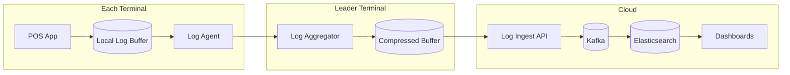
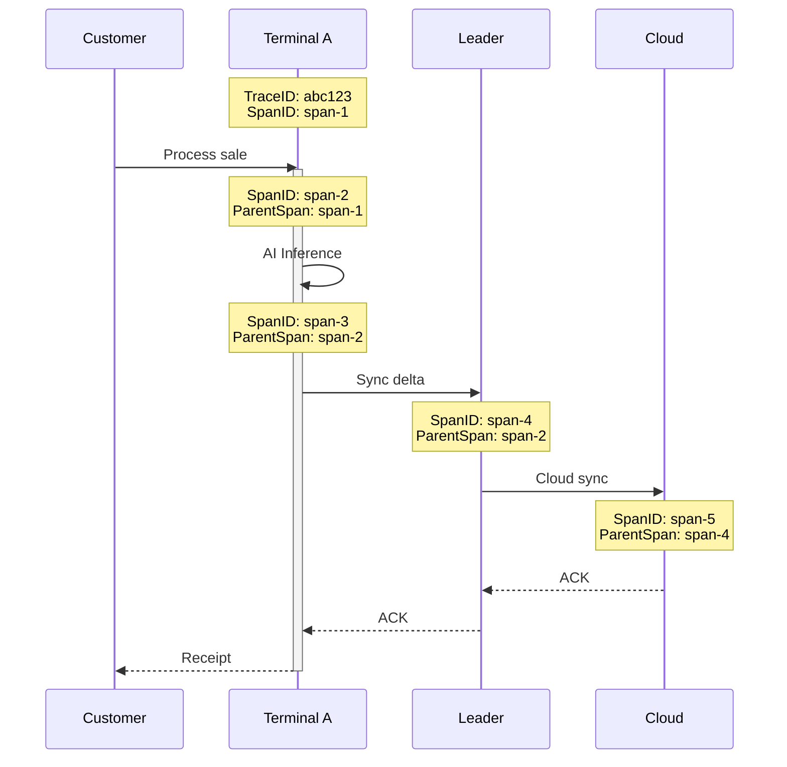
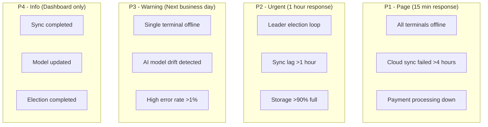

# Observability

[Back to Index](./00-index.md)

---

## Metrics (USE/RED)

### USE Metrics (Infrastructure)

| Component | Utilization | Saturation | Errors |
|-----------|-------------|------------|--------|
| **Terminal CPU** | % used | Run queue depth | Kernel panics |
| **Terminal Memory** | % used | Swap usage | OOM kills |
| **Terminal Storage** | % used | I/O queue depth | Disk errors |
| **Store Network** | Bandwidth % | Packet queue | Packet loss |
| **Cloud API** | Request rate | Connection pool | 5xx errors |

### RED Metrics (Services)

| Service | Rate | Errors | Duration |
|---------|------|--------|----------|
| **Transaction Processing** | Transactions/min | Failed transactions | p50, p95, p99 latency |
| **In-Store Sync** | Syncs/min | Failed syncs | Sync duration |
| **Cloud Sync** | Events/min | Sync failures | Batch duration |
| **AI Inference** | Inferences/min | Model errors | Inference latency |
| **Leader Election** | Elections/hour | Failed elections | Election duration |

### Key Metrics Dashboard

```
┌─────────────────────────────────────────────────────────────────────────────┐
│                         POS OBSERVABILITY DASHBOARD                         │
├─────────────────────────────────────────────────────────────────────────────┤
│                                                                             │
│  STORE HEALTH                          TRANSACTION METRICS                  │
│  ────────────                          ───────────────────                  │
│  ┌─────────────────────────────┐       ┌─────────────────────────────┐     │
│  │ Terminals Online: 5/5  ✓   │       │ TPS: 2.3        ████████    │     │
│  │ Leader: Terminal-01        │       │ p99 Latency: 45ms           │     │
│  │ Last Election: 2h ago      │       │ Error Rate: 0.1%            │     │
│  │ Cluster Health: HEALTHY    │       │ Daily Total: 1,247          │     │
│  └─────────────────────────────┘       └─────────────────────────────┘     │
│                                                                             │
│  SYNC STATUS                           AI METRICS                           │
│  ───────────                           ──────────                           │
│  ┌─────────────────────────────┐       ┌─────────────────────────────┐     │
│  │ In-Store Lag: 0.5s    ✓    │       │ Recognition Acc: 94%        │     │
│  │ Cloud Lag: 12m 30s         │       │ Fraud Score Avg: 0.12       │     │
│  │ Pending Events: 342        │       │ Inference p99: 85ms         │     │
│  │ Last Cloud Sync: 2m ago    │       │ Model Version: v2.3.1       │     │
│  └─────────────────────────────┘       └─────────────────────────────┘     │
│                                                                             │
│  TERMINAL RESOURCES                                                         │
│  ──────────────────                                                         │
│  ┌─────────────────────────────────────────────────────────────────────┐   │
│  │ Terminal  │ CPU   │ Memory │ Storage │ Status  │ Role     │        │   │
│  │───────────┼───────┼────────┼─────────┼─────────┼──────────│        │   │
│  │ Term-01   │ 35%   │ 62%    │ 45%     │ Online  │ Leader   │        │   │
│  │ Term-02   │ 28%   │ 55%    │ 42%     │ Online  │ Follower │        │   │
│  │ Term-03   │ 42%   │ 58%    │ 48%     │ Online  │ Follower │        │   │
│  │ Term-04   │ 22%   │ 51%    │ 40%     │ Online  │ Follower │        │   │
│  │ Term-05   │ 31%   │ 54%    │ 44%     │ Online  │ Follower │        │   │
│  └─────────────────────────────────────────────────────────────────────┘   │
│                                                                             │
└─────────────────────────────────────────────────────────────────────────────┘
```

### Metric Collection

```
class MetricsCollector:
    // Prometheus-compatible metrics
    transaction_counter = Counter(
        name = "pos_transactions_total",
        labels = ["terminal_id", "status", "payment_method"]
    )

    transaction_duration = Histogram(
        name = "pos_transaction_duration_seconds",
        labels = ["terminal_id"],
        buckets = [0.01, 0.025, 0.05, 0.1, 0.25, 0.5, 1.0]
    )

    sync_lag_gauge = Gauge(
        name = "pos_sync_lag_seconds",
        labels = ["terminal_id", "sync_type"]
    )

    ai_inference_duration = Histogram(
        name = "pos_ai_inference_duration_seconds",
        labels = ["model_name"],
        buckets = [0.01, 0.025, 0.05, 0.1, 0.2, 0.5]
    )

    function recordTransaction(terminal_id, status, payment_method, duration):
        transaction_counter.inc(
            labels = {terminal_id, status, payment_method}
        )
        transaction_duration.observe(
            value = duration,
            labels = {terminal_id}
        )

    function recordSyncLag(terminal_id, sync_type, lag_seconds):
        sync_lag_gauge.set(
            value = lag_seconds,
            labels = {terminal_id, sync_type}
        )
```

---

## Logging

### Log Levels Strategy

| Level | Usage | Examples | Retention |
|-------|-------|----------|-----------|
| **ERROR** | Failures requiring attention | DB errors, sync failures, AI crashes | 90 days |
| **WARN** | Degraded but operational | High latency, fallback mode | 30 days |
| **INFO** | Normal operations | Transactions, syncs, elections | 7 days |
| **DEBUG** | Development/troubleshooting | CRDT merges, Raft messages | 1 day (disabled in prod) |

### Structured Log Format

```json
{
  "timestamp": "2025-01-15T10:30:45.123Z",
  "level": "INFO",
  "service": "pos-terminal",
  "terminal_id": "store-001-term-01",
  "store_id": "store-001",
  "trace_id": "abc123def456",
  "span_id": "789xyz",
  "event": "transaction_completed",
  "transaction_id": "store-001-term-01:150234",
  "duration_ms": 45,
  "attributes": {
    "total": 29.99,
    "items": 3,
    "payment_method": "card",
    "offline_mode": false
  }
}
```

### What to Log

| Event | Level | Required Fields | Optional Fields |
|-------|-------|-----------------|-----------------|
| **Transaction created** | INFO | txn_id, total, items | customer_id, payment |
| **Sync completed** | INFO | sync_type, events_count, duration | conflicts_resolved |
| **Leader elected** | INFO | new_leader, term, election_duration | previous_leader |
| **AI inference** | DEBUG | model, duration, result | confidence, input_hash |
| **Sync failed** | ERROR | sync_type, error, retry_count | last_success |
| **Payment declined** | WARN | txn_id, reason, amount | card_last4 |
| **Offline mode entered** | WARN | reason, pending_syncs | estimated_duration |

### Log Shipping Architecture



**Log Agent Configuration:**

```yaml
# Fluent Bit configuration for POS terminal
[SERVICE]
    Flush         5
    Log_Level     info
    Daemon        off

[INPUT]
    Name          tail
    Path          /var/log/pos/*.log
    Tag           pos.*
    Parser        json
    Mem_Buf_Limit 50MB

[FILTER]
    Name          record_modifier
    Match         *
    Record        terminal_id ${TERMINAL_ID}
    Record        store_id ${STORE_ID}

[OUTPUT]
    Name          forward
    Match         *
    Host          ${LEADER_IP}
    Port          24224
    Retry_Limit   5

# Fallback to local storage when leader unavailable
[OUTPUT]
    Name          file
    Match         *
    Path          /var/log/pos/buffer
    Format        json_lines
```

---

## Distributed Tracing

### Trace Propagation

All operations carry trace context through the system:



### Key Spans to Instrument

| Operation | Span Name | Key Attributes |
|-----------|-----------|----------------|
| **Transaction** | `pos.transaction` | txn_id, total, items, payment |
| **Cart add** | `pos.cart.add_item` | product_id, quantity |
| **AI inference** | `pos.ai.inference` | model, duration, confidence |
| **Payment** | `pos.payment.process` | method, amount, result |
| **In-store sync** | `pos.sync.local` | events_count, peer_id |
| **Cloud sync** | `pos.sync.cloud` | events_count, batch_size |
| **Leader election** | `pos.raft.election` | term, candidates, winner |

### Trace Implementation

```
class TracingMiddleware:
    tracer = initTracer("pos-terminal")

    function traceTransaction(transaction):
        span = tracer.startSpan("pos.transaction", {
            attributes: {
                "txn.id": transaction.id,
                "txn.total": transaction.total,
                "txn.items": transaction.itemCount,
                "terminal.id": terminalId
            }
        })

        try:
            // Add items
            for item in transaction.items:
                with tracer.startSpan("pos.cart.add_item", parent=span):
                    addItemToCart(item)

            // AI fraud check
            with tracer.startSpan("pos.ai.inference", parent=span) as aiSpan:
                fraudScore = runFraudCheck(transaction)
                aiSpan.setAttribute("ai.model", "fraud_v2")
                aiSpan.setAttribute("ai.score", fraudScore)

            // Payment
            with tracer.startSpan("pos.payment.process", parent=span) as paySpan:
                result = processPayment(transaction)
                paySpan.setAttribute("payment.method", result.method)
                paySpan.setAttribute("payment.result", result.status)

            span.setStatus(OK)
        except Exception as e:
            span.setStatus(ERROR, e.message)
            span.recordException(e)
            raise
        finally:
            span.end()
```

### Trace Sampling

| Environment | Strategy | Rate | Notes |
|-------------|----------|------|-------|
| **Development** | Always | 100% | Full visibility |
| **Staging** | Always | 100% | Test validation |
| **Production** | Probabilistic | 1% | Cost control |
| **Production (errors)** | Always | 100% | All errors traced |
| **Production (slow)** | Tail-based | >500ms | Capture outliers |

---

## Alerting

### Alert Hierarchy



### Critical Alerts (P1 - Page)

| Alert | Condition | Response |
|-------|-----------|----------|
| **Store Offline** | All terminals unreachable >15 min | On-call engineer |
| **Cloud Sync Critical** | No sync >4 hours, >10K pending events | Cloud ops team |
| **Payment System Down** | Payment failures >10% for 5 min | Payment on-call |
| **Data Corruption** | Integrity check failures | Security + Engineering |

### Warning Alerts (P2/P3)

| Alert | Condition | Response |
|-------|-----------|----------|
| **Leader Instability** | >3 elections/hour | Review network, terminal health |
| **High Sync Lag** | In-store lag >5 min | Check leader, network |
| **Storage Warning** | Any terminal >85% | Trigger pruning, plan upgrade |
| **AI Accuracy Drop** | Recognition accuracy <85% | Review model, plan update |
| **High Fraud Scores** | Avg fraud score >0.5 for 1 hour | Security review |

### Alert Configuration

```yaml
# Prometheus Alertmanager rules
groups:
  - name: pos_critical
    rules:
      - alert: StoreOffline
        expr: sum(pos_terminal_up{store_id="$STORE_ID"}) == 0
        for: 15m
        labels:
          severity: page
        annotations:
          summary: "Store {{ $labels.store_id }} is completely offline"
          runbook: "https://runbooks.internal/pos/store-offline"

      - alert: CloudSyncCritical
        expr: pos_cloud_sync_lag_seconds > 14400  # 4 hours
        for: 5m
        labels:
          severity: page
        annotations:
          summary: "Cloud sync lag exceeds 4 hours for {{ $labels.store_id }}"

      - alert: LeaderElectionLoop
        expr: increase(pos_leader_elections_total[1h]) > 3
        labels:
          severity: warning
        annotations:
          summary: "Excessive leader elections in {{ $labels.store_id }}"

      - alert: AIAccuracyDrop
        expr: pos_ai_accuracy_ratio < 0.85
        for: 30m
        labels:
          severity: warning
        annotations:
          summary: "AI recognition accuracy below threshold"
```

### Runbook References

| Alert | Runbook |
|-------|---------|
| Store Offline | [/runbooks/pos/store-offline](./runbooks/store-offline.md) |
| Cloud Sync Critical | [/runbooks/pos/cloud-sync-critical](./runbooks/cloud-sync.md) |
| Leader Election Loop | [/runbooks/pos/leader-election](./runbooks/leader-election.md) |
| Storage Critical | [/runbooks/pos/storage-critical](./runbooks/storage.md) |
| Payment Failures | [/runbooks/pos/payment-failures](./runbooks/payments.md) |

---

## Health Check Endpoints

### Terminal Health

```
GET /health
Response:
{
  "status": "healthy",  // healthy, degraded, unhealthy
  "terminal_id": "store-001-term-01",
  "role": "follower",
  "leader_id": "store-001-term-03",
  "checks": {
    "database": {"status": "ok", "latency_ms": 2},
    "ai_models": {"status": "ok", "models_loaded": 4},
    "storage": {"status": "ok", "free_percent": 55},
    "network": {"status": "ok", "peers_reachable": 4},
    "sync": {"status": "ok", "lag_seconds": 0.5}
  },
  "uptime_seconds": 86400,
  "version": "2.3.1"
}
```

### Leader Health (Aggregated)

```
GET /health/cluster
Response:
{
  "status": "healthy",
  "store_id": "store-001",
  "leader_id": "store-001-term-03",
  "cluster_size": 5,
  "terminals": [
    {"id": "term-01", "status": "healthy", "role": "follower"},
    {"id": "term-02", "status": "healthy", "role": "follower"},
    {"id": "term-03", "status": "healthy", "role": "leader"},
    {"id": "term-04", "status": "healthy", "role": "follower"},
    {"id": "term-05", "status": "degraded", "role": "follower", "issues": ["high_storage"]}
  ],
  "sync_status": {
    "in_store": {"status": "ok", "avg_lag_seconds": 0.3},
    "cloud": {"status": "ok", "pending_events": 45, "last_sync": "2025-01-15T10:28:00Z"}
  }
}
```

---

## Operational Dashboards

### Store Manager Dashboard

```
┌─────────────────────────────────────────────────────────────────────────┐
│                    STORE 001 - OPERATIONS DASHBOARD                     │
├─────────────────────────────────────────────────────────────────────────┤
│                                                                         │
│  TODAY'S SUMMARY                                                        │
│  ───────────────                                                        │
│  Transactions: 847        Revenue: $12,450.23        Avg Basket: $14.70 │
│  Peak Hour: 12:00-13:00   Busiest Terminal: Term-02                     │
│                                                                         │
│  ┌────────────────────────────────────────────────────────────────┐    │
│  │  Transactions by Hour                                          │    │
│  │  30│          ██                                               │    │
│  │    │        ████                                               │    │
│  │  20│      ██████  ██                                           │    │
│  │    │    ████████████                                           │    │
│  │  10│  ████████████████                                         │    │
│  │    │████████████████████                                       │    │
│  │   0└──────────────────────────────────────────────             │    │
│  │    6  7  8  9 10 11 12  1  2  3  4  5  6  7  8  9             │    │
│  └────────────────────────────────────────────────────────────────┘    │
│                                                                         │
│  ALERTS                          SYNC STATUS                            │
│  ──────                          ───────────                            │
│  [!] Terminal 5 storage >80%     Cloud: ✓ Synced 2 min ago              │
│  [i] New products synced         In-Store: ✓ All terminals synced       │
│                                                                         │
└─────────────────────────────────────────────────────────────────────────┘
```

### Cloud Operations Dashboard

```
┌─────────────────────────────────────────────────────────────────────────┐
│                      CLOUD OPERATIONS - ALL STORES                      │
├─────────────────────────────────────────────────────────────────────────┤
│                                                                         │
│  FLEET STATUS                    SYNC PIPELINE                          │
│  ────────────                    ─────────────                          │
│  Stores Online: 49,823/50,000    Events/sec: 15,234                     │
│  Terminals Online: 198,542       Batch Queue: 2,345                     │
│  Degraded: 127 stores            Avg Latency: 125ms                     │
│  Offline: 50 stores              Error Rate: 0.02%                      │
│                                                                         │
│  ┌────────────────────────────────────────────────────────────────┐    │
│  │  Regional Distribution                                         │    │
│  │                                                                 │    │
│  │  US-East   ████████████████████████  12,500 stores             │    │
│  │  US-West   ███████████████████       10,200 stores             │    │
│  │  Europe    ██████████████            8,100 stores              │    │
│  │  Asia      ████████████████████      11,000 stores             │    │
│  │  Other     ████████                  8,200 stores              │    │
│  └────────────────────────────────────────────────────────────────┘    │
│                                                                         │
│  ACTIVE INCIDENTS                                                       │
│  ────────────────                                                       │
│  [P2] Region EU-West: 15 stores with sync lag >1hr                      │
│  [P3] Store 12345: Leader election loop - investigating                 │
│                                                                         │
└─────────────────────────────────────────────────────────────────────────┘
```
