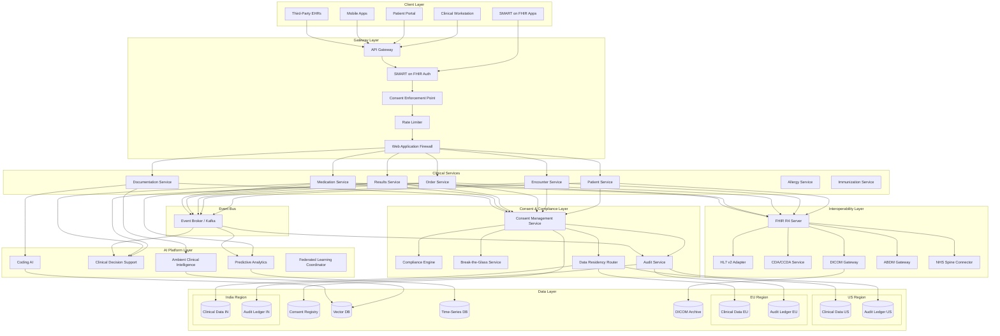
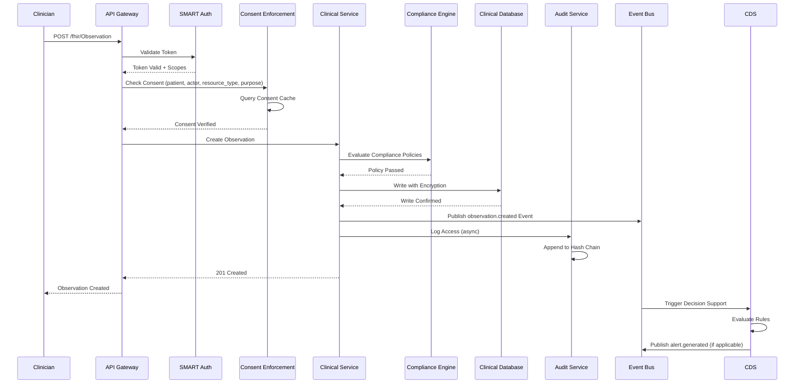
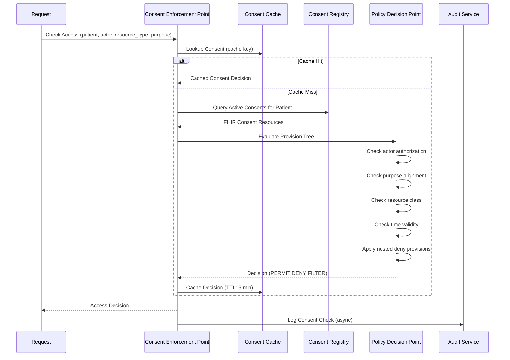
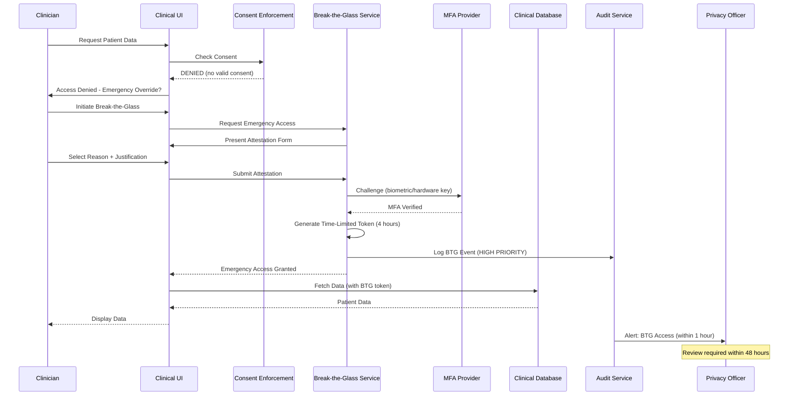
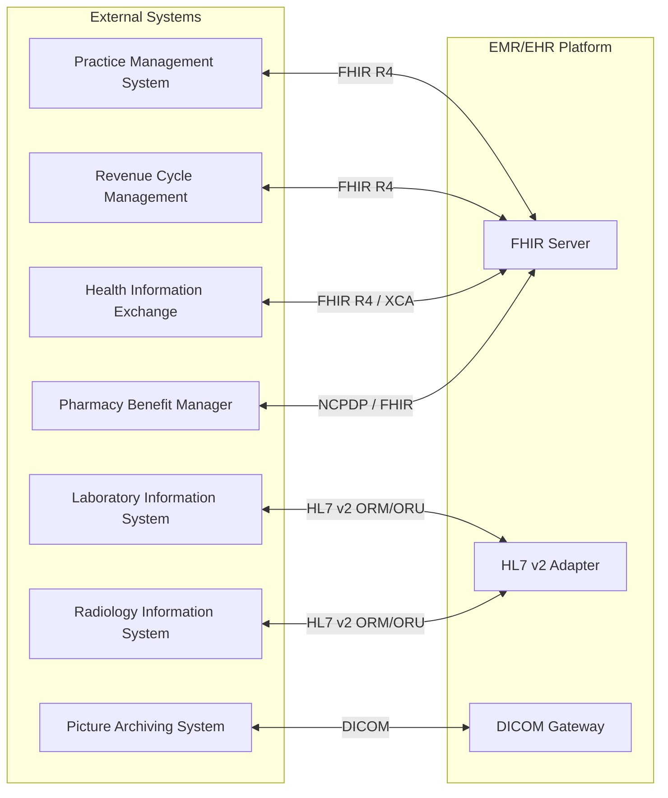

# High-Level Design

## System Architecture



---

## Data Flow Diagrams

### Clinical Data Write Path



### Consent Verification Flow



### Break-the-Glass Emergency Access



---

## Key Architectural Decisions

### 1. Microservices with Event-Driven Architecture

**Decision**: Decompose into domain-specific microservices with asynchronous event communication.

**Rationale**:
- Independent scaling of clinical services (Patient service scales differently than Imaging)
- Fault isolation (failure in AI service doesn't impact clinical workflows)
- Regulatory compliance (different services can have different data residency)
- Team autonomy (different teams own different services)

**Trade-offs**:
| Pros | Cons |
|------|------|
| Independent deployment | Distributed transaction complexity |
| Technology diversity | Network latency overhead |
| Fault isolation | Operational complexity |
| Scalability | Data consistency challenges |

### 2. FHIR R4 as Canonical Data Model

**Decision**: Use HL7 FHIR R4 as the internal data representation, not just for external APIs.

**Rationale**:
- Industry standard for healthcare interoperability
- Rich resource types covering all clinical domains
- Built-in extension mechanism for customization
- SMART on FHIR authorization model
- Consent resource (R4) for consent management

**Trade-offs**:
| Pros | Cons |
|------|------|
| Native interoperability | Learning curve for developers |
| Standard vocabulary bindings | Verbosity of resources |
| Extensibility | Performance overhead vs custom schema |
| Regulatory alignment | FHIR versioning complexity |

### 3. Consent-Gated Data Access at Every Layer

**Decision**: Enforce consent verification at the gateway layer with policy caching.

**Rationale**:
- Single enforcement point prevents bypass
- Caching enables low-latency verification
- Policy decision point separation allows complex rules
- Audit trail captures all access attempts

**Implementation**:
```
Request → Gateway → Consent Enforcement Point → Policy Decision Point
                           ↓
                    Consent Cache (Redis)
                           ↓
                    Consent Registry (PostgreSQL)
```

### 4. Multi-Region Deployment with Data Residency Routing

**Decision**: Deploy clinical data stores in each regulated region with intelligent routing.

**Rationale**:
- GDPR requires EU data to stay in EU
- DPDP Act requires India data mirroring
- Latency optimization for regional users
- Regulatory audit simplification

**Region Mapping**:
| Patient Location | Primary Region | DR Region | Cross-Border Allowed |
|-----------------|----------------|-----------|---------------------|
| EU (GDPR) | EU-West | EU-North | With SCCs to adequacy countries |
| India (DPDP) | India-Mumbai | India-Delhi | With explicit consent |
| UK (NHS) | UK-London | EU-West (with DPA) | To EU with safeguards |
| USA (HIPAA) | US-East | US-West | Globally with BAA |
| Brazil (LGPD) | Brazil-SP | None | Restricted |
| Australia | AU-Sydney | AU-Melbourne | To adequacy countries |

### 5. Privacy-Preserving AI with Federated Learning

**Decision**: Deploy AI with federated learning and on-premise options for data sovereignty.

**Rationale**:
- PHI cannot be centralized for model training
- Federated learning enables multi-site ML without data movement
- On-premise deployment for organizations requiring complete control
- Differential privacy protects individual patient data

**AI Deployment Options**:
| Option | Data Location | Model Location | Use Case |
|--------|---------------|----------------|----------|
| Cloud Inference | Cloud (encrypted) | Cloud | Standard SaaS customers |
| Hybrid | On-premise | Cloud (API) | Moderate sensitivity |
| On-Premise | On-premise | On-premise | Government, high security |
| Federated | Distributed | Distributed | Multi-site research |

---

## Architecture Pattern Checklist

| Pattern | Decision | Rationale |
|---------|----------|-----------|
| Sync vs Async | **Async (Event-Driven)** | Decoupling, fault tolerance, audit trail |
| Event-driven vs Request-response | **Hybrid** | Request-response for reads, events for writes |
| Push vs Pull | **Push** (Subscriptions) | Real-time clinical alerts |
| Stateless vs Stateful | **Stateless services** | Horizontal scaling, failover |
| Read-heavy vs Write-heavy | **Both** | CQRS pattern for optimization |
| Real-time vs Batch | **Real-time** | Clinical safety requires immediacy |
| Edge vs Origin | **Origin with regional caching** | Data residency constraints |

---

## Component Responsibilities

### Gateway Layer

| Component | Responsibility | Technology |
|-----------|---------------|------------|
| API Gateway | Routing, TLS termination, request transformation | Kong / Envoy |
| SMART on FHIR Auth | OAuth 2.0 + OIDC, scope validation | Custom + Keycloak |
| Consent Enforcement Point | Real-time consent verification | Custom service |
| Rate Limiter | Per-user, per-tenant throttling | Redis-backed |
| WAF | OWASP protection, DDoS mitigation | Cloud WAF |

### Clinical Services Layer

| Service | Responsibility | Scale Target |
|---------|---------------|--------------|
| Patient Service | Demographics, MPI, patient matching | 1000 TPS |
| Encounter Service | Visits, admissions, encounter lifecycle | 500 TPS |
| Order Service | Lab/imaging orders, referrals | 400 TPS |
| Results Service | Lab results, radiology reports | 500 TPS |
| Medication Service | Prescriptions, MAR, reconciliation | 400 TPS |
| Documentation Service | Clinical notes, assessments | 300 TPS |

### Consent & Compliance Layer

| Component | Responsibility |
|-----------|---------------|
| Consent Management Service | FHIR Consent CRUD, provision management |
| Compliance Engine | Multi-framework policy evaluation (OPA) |
| Break-the-Glass Service | Emergency access, attestation, review workflow |
| Audit Service | Immutable logging, hash chain, blockchain anchoring |
| Data Residency Router | Region selection based on patient location |

### AI Platform Layer

| Component | Responsibility | Latency Target |
|-----------|---------------|----------------|
| Ambient Clinical Intelligence | Speech-to-text, note generation | Real-time streaming |
| Clinical Decision Support | Drug interactions, guidelines | < 100ms |
| Coding AI | ICD-10, CPT, SNOMED-CT suggestions | < 500ms |
| Predictive Analytics | Risk scoring, forecasting | < 1s |
| Federated Learning Coordinator | Multi-site model training | Async |

### Interoperability Layer

| Component | Responsibility |
|-----------|---------------|
| FHIR Server | R4 resources, search, operations, subscriptions |
| HL7 v2 Adapter | MLLP listener, ADT/ORM/ORU translation |
| CDA Service | C-CDA generation and parsing |
| DICOM Gateway | DICOMweb, DIMSE, imaging workflows |
| ABDM Gateway | India health data exchange |
| NHS Spine Connector | UK national health integration |

---

## Cross-Cutting Concerns

### Authentication & Authorization

```
┌─────────────────────────────────────────────────────────────────────────────┐
│                    AUTHENTICATION & AUTHORIZATION                            │
├─────────────────────────────────────────────────────────────────────────────┤
│                                                                             │
│  AUTHENTICATION (Who are you?):                                             │
│  ├── OpenID Connect (OIDC) for user identity                                │
│  ├── Federated identity with hospital IdP (SAML, OIDC)                      │
│  ├── MFA required for clinical access                                       │
│  └── Hardware keys (FIDO2) for privileged access                            │
│                                                                             │
│  AUTHORIZATION (What can you do?):                                          │
│  ├── OAuth 2.0 scopes for API access                                        │
│  ├── SMART on FHIR scopes (patient/*.read, user/*.write)                    │
│  ├── RBAC for role-based permissions                                        │
│  ├── ABAC for attribute-based decisions                                     │
│  │   ├── Treatment relationship                                             │
│  │   ├── Department membership                                              │
│  │   ├── Time-of-day restrictions                                           │
│  │   └── Location (on-site vs remote)                                       │
│  └── Consent overlay for patient-level permissions                          │
│                                                                             │
│  SCOPE EXAMPLES:                                                            │
│  ├── patient/Observation.read - Read observations for specific patient      │
│  ├── user/MedicationRequest.write - Write medication orders                 │
│  ├── system/Patient.read - Backend system access                            │
│  └── launch/patient - EHR launch with patient context                       │
│                                                                             │
└─────────────────────────────────────────────────────────────────────────────┘
```

### Encryption Strategy

| Layer | Encryption | Key Management |
|-------|------------|----------------|
| Transit | TLS 1.3 | Managed certificates |
| At Rest (Database) | AES-256-GCM | Tenant-specific DEKs |
| At Rest (Object Storage) | AES-256 | Per-object keys |
| Field-Level (PHI) | AES-256-GCM | Field-specific keys |
| Backups | AES-256 | Offline master key |

### Observability

| Concern | Implementation |
|---------|---------------|
| Metrics | Prometheus + Grafana (latency, throughput, errors) |
| Logging | Structured JSON logs, centralized aggregation |
| Tracing | Distributed tracing with consent context |
| Alerting | PagerDuty integration for clinical alerts |
| Compliance Dashboard | Real-time policy violation monitoring |

---

## Graceful Degradation Levels

| Level | Scenario | Degraded Behavior |
|-------|----------|-------------------|
| 0 | Normal | Full functionality |
| 1 | AI Services Down | AI features disabled, manual coding |
| 2 | Consent Cache Down | Direct DB queries (slower) |
| 3 | Regional DB Down | Failover to DR region |
| 4 | Multiple Regions Down | Read-only from surviving region |
| 5 | Complete Outage | Offline mode with local cache |

---

## Integration Points


