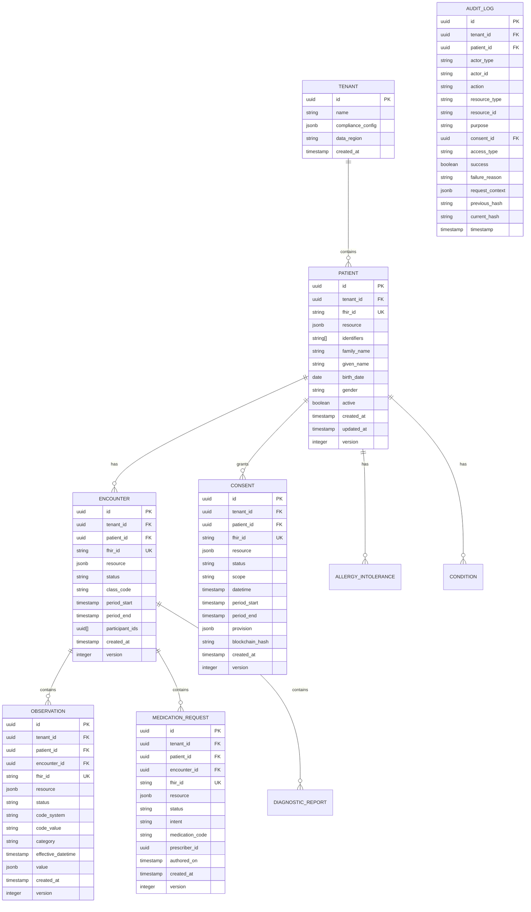

# Low-Level Design

## Data Model

### FHIR-Native Database Schema

The clinical data store uses PostgreSQL with FHIR resources stored as JSONB, combined with typed columns for efficient search.



### Temporal Tables for Version History

Every clinical resource table uses temporal tables for full audit history:

```
PSEUDOCODE: Temporal Table Structure

TABLE patient_history (
    id: UUID
    tenant_id: UUID
    fhir_id: STRING
    resource: JSONB
    version: INTEGER
    valid_from: TIMESTAMP
    valid_to: TIMESTAMP  -- NULL for current
    operation: ENUM('INSERT', 'UPDATE', 'DELETE')
    modified_by: STRING
    modification_reason: STRING
)

-- Trigger on INSERT/UPDATE/DELETE to patient table
TRIGGER patient_versioning
    BEFORE UPDATE OR DELETE ON patient
    FOR EACH ROW
    INSERT INTO patient_history (
        id: OLD.id,
        tenant_id: OLD.tenant_id,
        fhir_id: OLD.fhir_id,
        resource: OLD.resource,
        version: OLD.version,
        valid_from: OLD.updated_at,
        valid_to: NOW(),
        operation: TG_OP,
        modified_by: current_user_id(),
        modification_reason: get_modification_reason()
    )
```

### FHIR Consent Resource Structure

```
FHIR CONSENT RESOURCE (R4):

{
  "resourceType": "Consent",
  "id": "consent-abc123",
  "meta": {
    "versionId": "3",
    "lastUpdated": "2025-01-23T10:00:00Z",
    "profile": ["http://hl7.org/fhir/StructureDefinition/Consent"]
  },
  "status": "active",
  "scope": {
    "coding": [{
      "system": "http://terminology.hl7.org/CodeSystem/consentscope",
      "code": "patient-privacy",
      "display": "Privacy Consent"
    }]
  },
  "category": [{
    "coding": [{
      "system": "http://loinc.org",
      "code": "59284-0",
      "display": "Consent Document"
    }]
  }],
  "patient": {
    "reference": "Patient/patient-456"
  },
  "dateTime": "2025-01-01T00:00:00Z",
  "performer": [{
    "reference": "Patient/patient-456"
  }],
  "organization": [{
    "reference": "Organization/hospital-789"
  }],
  "sourceAttachment": {
    "contentType": "application/pdf",
    "url": "/documents/consent/signed-form.pdf"
  },
  "policy": [{
    "authority": "http://hipaa.gov",
    "uri": "http://hipaa.gov/consent-policy-2025"
  }],
  "provision": {
    "type": "permit",
    "period": {
      "start": "2025-01-01",
      "end": "2026-01-01"
    },
    "actor": [{
      "role": {
        "coding": [{
          "system": "http://terminology.hl7.org/CodeSystem/v3-ParticipationType",
          "code": "PRCP",
          "display": "Primary Information Recipient"
        }]
      },
      "reference": {
        "reference": "Organization/hospital-789"
      }
    }],
    "action": [{
      "coding": [{
        "system": "http://terminology.hl7.org/CodeSystem/consentaction",
        "code": "access"
      }]
    }, {
      "coding": [{
        "system": "http://terminology.hl7.org/CodeSystem/consentaction",
        "code": "collect"
      }]
    }],
    "purpose": [{
      "system": "http://terminology.hl7.org/CodeSystem/v3-ActReason",
      "code": "TREAT",
      "display": "Treatment"
    }, {
      "system": "http://terminology.hl7.org/CodeSystem/v3-ActReason",
      "code": "ETREAT",
      "display": "Emergency Treatment"
    }],
    "class": [{
      "system": "http://hl7.org/fhir/resource-types",
      "code": "Observation"
    }, {
      "system": "http://hl7.org/fhir/resource-types",
      "code": "DiagnosticReport"
    }, {
      "system": "http://hl7.org/fhir/resource-types",
      "code": "MedicationRequest"
    }],
    "dataPeriod": {
      "start": "2020-01-01"
    },
    -- Nested denial provisions
    "provision": [{
      "type": "deny",
      "class": [{
        "system": "http://hl7.org/fhir/resource-types",
        "code": "Observation"
      }],
      "code": [{
        "coding": [{
          "system": "http://loinc.org",
          "code": "75622-1",
          "display": "HIV 1 and 2 Ab panel"
        }]
      }]
    }, {
      "type": "deny",
      "actor": [{
        "role": {
          "coding": [{
            "system": "http://terminology.hl7.org/CodeSystem/v3-ParticipationType",
            "code": "IRCP"
          }]
        },
        "reference": {
          "reference": "Organization/research-org"
        }
      }],
      "purpose": [{
        "system": "http://terminology.hl7.org/CodeSystem/v3-ActReason",
        "code": "HRESCH",
        "display": "Healthcare Research"
      }]
    }]
  },
  "extension": [{
    "url": "http://example.org/fhir/StructureDefinition/consent-blockchain-hash",
    "valueString": "sha256:abc123def456..."
  }, {
    "url": "http://example.org/fhir/StructureDefinition/consent-chain-previous",
    "valueString": "sha256:previoushash..."
  }]
}
```

### Audit Log Schema with Hash Chain

```
AUDIT LOG RECORD:

{
  "id": "audit-uuid-123",
  "tenant_id": "tenant-456",
  "timestamp": "2025-01-23T10:30:00.123Z",

  -- Actor Information
  "actor": {
    "type": "Practitioner",
    "id": "Practitioner/dr-smith-789",
    "name": "Dr. Jane Smith",
    "role": "Physician",
    "department": "Cardiology"
  },

  -- Action Details
  "action": "read",
  "resource_type": "DiagnosticReport",
  "resource_id": "DiagnosticReport/lab-result-123",

  -- Patient Context
  "patient": {
    "id": "Patient/patient-456",
    "mrn": "MRN12345"
  },

  -- Consent Information
  "consent": {
    "id": "Consent/consent-abc",
    "version": "3",
    "purpose": "TREAT",
    "decision": "PERMIT"
  },

  -- Access Context
  "access_type": "normal",  -- or "break-the-glass"
  "btg_details": null,      -- populated if BTG

  -- Request Context
  "request": {
    "ip_address": "10.0.1.50",
    "user_agent": "Epic/2025.1",
    "session_id": "session-xyz",
    "source_application": "clinical-workstation",
    "location": "on-site"
  },

  -- Outcome
  "success": true,
  "response_code": 200,
  "failure_reason": null,

  -- Hash Chain
  "previous_hash": "sha256:abc123...",
  "current_hash": "sha256:def456...",

  -- Blockchain Anchor (periodic)
  "blockchain_anchor": {
    "network": "hyperledger",
    "transaction_id": "tx-123",
    "block_number": 456789,
    "anchored_at": "2025-01-23T10:35:00Z"
  }
}

HASH CALCULATION:
current_hash = SHA256(
  previous_hash +
  timestamp +
  actor.id +
  action +
  resource_id +
  patient.id +
  consent.id +
  access_type +
  success
)
```

---

## API Design

### FHIR R4 REST API

```
BASE URL: https://api.ehr.example.com/fhir/r4

AUTHENTICATION:
  Authorization: Bearer <SMART_on_FHIR_access_token>

COMMON HEADERS:
  Content-Type: application/fhir+json
  Accept: application/fhir+json
  X-Request-ID: <correlation-id>
  X-Purpose: TREAT|ETREAT|HRESCH|... (consent purpose)
```

#### Resource Operations

| Operation | HTTP Method | Endpoint | Description |
|-----------|-------------|----------|-------------|
| Read | GET | `/Patient/{id}` | Retrieve patient by ID |
| VRead | GET | `/Patient/{id}/_history/{vid}` | Retrieve specific version |
| Create | POST | `/Patient` | Create new patient |
| Update | PUT | `/Patient/{id}` | Full resource update |
| Patch | PATCH | `/Patient/{id}` | Partial update (JSON Patch) |
| Delete | DELETE | `/Patient/{id}` | Logical delete |
| History | GET | `/Patient/{id}/_history` | Version history |
| Search | GET | `/Patient?{params}` | Search patients |

#### FHIR Search Parameters

```
-- Patient Search
GET /Patient?
    identifier=MRN12345&
    family=Smith&
    given=John&
    birthdate=1990-01-15&
    gender=male&
    _include=Patient:organization&
    _revinclude=Encounter:patient&
    _count=20&
    _sort=-_lastUpdated

-- Observation Search with Chaining
GET /Observation?
    patient.identifier=MRN12345&
    category=laboratory&
    code=http://loinc.org|2339-0&
    date=ge2025-01-01&
    _include=Observation:patient&
    _count=50

-- Medication Request with $everything
GET /Patient/123/$everything?
    _since=2025-01-01&
    _type=MedicationRequest,Medication
```

#### Custom Operations

```
-- Consent Check Operation
POST /Patient/123/$consent-check
Content-Type: application/fhir+json

{
  "resourceType": "Parameters",
  "parameter": [{
    "name": "actor",
    "valueReference": {
      "reference": "Practitioner/456"
    }
  }, {
    "name": "purpose",
    "valueCode": "TREAT"
  }, {
    "name": "resource-type",
    "valueCode": "Observation"
  }]
}

RESPONSE:
{
  "resourceType": "Parameters",
  "parameter": [{
    "name": "decision",
    "valueCode": "permit"
  }, {
    "name": "consent",
    "valueReference": {
      "reference": "Consent/abc123"
    }
  }, {
    "name": "restrictions",
    "part": [{
      "name": "excluded-codes",
      "valueCoding": {
        "system": "http://loinc.org",
        "code": "75622-1"
      }
    }]
  }]
}
```

### SMART on FHIR Authorization

```
SMART LAUNCH SEQUENCE:

1. EHR Launch (Patient Context)
   GET https://ehr.example.com/launch?
       iss=https://api.ehr.example.com/fhir/r4&
       launch=abc123

2. Authorization Request
   GET https://auth.ehr.example.com/authorize?
       response_type=code&
       client_id=my_app&
       redirect_uri=https://myapp.com/callback&
       scope=launch patient/*.read user/Observation.write offline_access&
       state=xyz789&
       aud=https://api.ehr.example.com/fhir/r4&
       launch=abc123

3. Token Exchange
   POST https://auth.ehr.example.com/token
   Content-Type: application/x-www-form-urlencoded

   grant_type=authorization_code&
   code=auth_code_here&
   redirect_uri=https://myapp.com/callback&
   client_id=my_app&
   code_verifier=pkce_verifier

4. Token Response
   {
     "access_token": "eyJ...",
     "token_type": "Bearer",
     "expires_in": 3600,
     "scope": "launch patient/*.read user/Observation.write",
     "patient": "Patient/123",
     "encounter": "Encounter/456",
     "id_token": "eyJ...",
     "refresh_token": "refresh_token_here"
   }

SCOPE SYNTAX:
  clinical-scope = resource-context '/' resource-type '.' access-mode
  resource-context = 'patient' | 'user' | 'system'
  resource-type = FHIR-resource-type | '*'
  access-mode = 'read' | 'write' | '*'

EXAMPLES:
  patient/Observation.read     -- Read observations for launch patient
  user/MedicationRequest.write -- Write medication orders
  system/*.read                -- Backend system read access
```

### GraphQL API

```graphql
# GraphQL Schema for Clinical Data

type Query {
  Patient(id: ID!): Patient
  PatientList(
    identifier: String
    family: String
    given: String
    birthdate: String
    _count: Int = 20
    _offset: Int = 0
  ): PatientConnection!

  Observation(id: ID!): Observation
  ObservationList(
    patient: ID!
    category: String
    code: String
    date: DateRange
    _count: Int = 50
  ): ObservationConnection!

  MedicationRequest(id: ID!): MedicationRequest
  ActiveMedications(patient: ID!): [MedicationRequest!]!
}

type Patient {
  id: ID!
  identifier: [Identifier!]!
  name: [HumanName!]!
  birthDate: Date
  gender: String
  active: Boolean!

  # Related Resources
  encounters(status: String, _count: Int): [Encounter!]!
  conditions(clinicalStatus: String): [Condition!]!
  allergies: [AllergyIntolerance!]!
  medications(status: String): [MedicationRequest!]!
  observations(category: String, _count: Int): [Observation!]!
}

type Observation {
  id: ID!
  status: String!
  category: [CodeableConcept!]!
  code: CodeableConcept!
  subject: Reference!
  effectiveDateTime: DateTime
  value: ObservationValue
  interpretation: [CodeableConcept!]
  referenceRange: [ObservationReferenceRange!]
}

# Consent-Aware Directive
directive @consentRequired(
  purpose: String!
  resourceType: String!
) on FIELD_DEFINITION

type Query {
  # This field requires TREAT consent
  patientLabResults(patientId: ID!): [Observation!]!
    @consentRequired(purpose: "TREAT", resourceType: "Observation")
}
```

### Bulk Data Export API

```
-- Initiate Bulk Export
POST /Patient/$export
Prefer: respond-async
Accept: application/fhir+json

{
  "resourceType": "Parameters",
  "parameter": [{
    "name": "_outputFormat",
    "valueString": "application/fhir+ndjson"
  }, {
    "name": "_since",
    "valueInstant": "2025-01-01T00:00:00Z"
  }, {
    "name": "_type",
    "valueString": "Patient,Observation,MedicationRequest"
  }]
}

RESPONSE:
202 Accepted
Content-Location: https://api.ehr.example.com/fhir/r4/$export-poll/job123

-- Poll for Status
GET /fhir/r4/$export-poll/job123

RESPONSE (In Progress):
202 Accepted
X-Progress: 45%
Retry-After: 30

RESPONSE (Complete):
200 OK
{
  "transactionTime": "2025-01-23T12:00:00Z",
  "request": "https://api.ehr.example.com/fhir/r4/Patient/$export",
  "requiresAccessToken": true,
  "output": [{
    "type": "Patient",
    "url": "https://storage.example.com/exports/job123/Patient.ndjson",
    "count": 150000
  }, {
    "type": "Observation",
    "url": "https://storage.example.com/exports/job123/Observation.ndjson",
    "count": 5000000
  }],
  "error": []
}
```

---

## Core Algorithms

### Consent Decision Engine

```
ALGORITHM: Consent Provision Tree Evaluation

INPUT:
  - patient_id: STRING
  - actor: Actor (type, id, roles, organization)
  - action: STRING (access, collect, use, disclose)
  - resource_type: STRING (FHIR resource type)
  - resource_codes: LIST[Coding] (specific codes within resource)
  - purpose: STRING (TREAT, ETREAT, HRESCH, etc.)
  - current_time: TIMESTAMP

OUTPUT:
  - decision: ENUM(PERMIT, DENY, PERMIT_WITH_FILTER)
  - applicable_consent: Consent
  - filters: LIST[Filter] (codes/actors to exclude)

FUNCTION evaluate_consent(patient_id, actor, action, resource_type, resource_codes, purpose, current_time):

    -- Step 1: Load active consents for patient
    consents = query_consent_registry(
        patient_id = patient_id,
        status = 'active',
        scope = 'patient-privacy'
    )

    IF consents IS EMPTY:
        -- No consent = default deny (unless treatment exception)
        IF purpose IN ['TREAT', 'ETREAT'] AND jurisdiction_allows_implied_consent():
            RETURN (PERMIT, null, [])
        ELSE:
            RETURN (DENY, null, [])

    -- Step 2: Find most specific applicable consent
    applicable_consent = null
    best_specificity = -1

    FOR consent IN consents:
        -- Check if consent is temporally valid
        IF NOT is_time_valid(consent.provision.period, current_time):
            CONTINUE

        -- Check if data period covers requested data
        IF consent.provision.dataPeriod AND NOT is_time_valid(consent.provision.dataPeriod, resource_effective_date):
            CONTINUE

        specificity = calculate_specificity(consent, actor, action, resource_type, purpose)

        IF specificity > best_specificity:
            best_specificity = specificity
            applicable_consent = consent

    IF applicable_consent IS NULL:
        RETURN (DENY, null, [])

    -- Step 3: Evaluate provision tree
    decision, filters = evaluate_provision(
        applicable_consent.provision,
        actor,
        action,
        resource_type,
        resource_codes,
        purpose
    )

    RETURN (decision, applicable_consent, filters)

FUNCTION evaluate_provision(provision, actor, action, resource_type, resource_codes, purpose):

    -- Check base provision type
    base_type = provision.type  -- 'permit' or 'deny'

    -- Check actor authorization
    IF provision.actor IS NOT EMPTY:
        actor_match = FALSE
        FOR allowed_actor IN provision.actor:
            IF matches_actor(allowed_actor, actor):
                actor_match = TRUE
                BREAK
        IF NOT actor_match:
            RETURN (DENY, [])

    -- Check action authorization
    IF provision.action IS NOT EMPTY:
        action_match = FALSE
        FOR allowed_action IN provision.action:
            IF allowed_action.code == action:
                action_match = TRUE
                BREAK
        IF NOT action_match:
            RETURN (DENY, [])

    -- Check purpose authorization
    IF provision.purpose IS NOT EMPTY:
        purpose_match = FALSE
        FOR allowed_purpose IN provision.purpose:
            IF allowed_purpose.code == purpose:
                purpose_match = TRUE
                BREAK
        IF NOT purpose_match:
            RETURN (DENY, [])

    -- Check resource class authorization
    IF provision.class IS NOT EMPTY:
        class_match = FALSE
        FOR allowed_class IN provision.class:
            IF allowed_class.code == resource_type:
                class_match = TRUE
                BREAK
        IF NOT class_match:
            RETURN (DENY, [])

    -- Base provision passes, check nested provisions
    filters = []

    FOR nested IN provision.provision:
        nested_decision, nested_filters = evaluate_provision(
            nested, actor, action, resource_type, resource_codes, purpose
        )

        IF nested.type == 'deny' AND nested_decision == DENY:
            -- This nested provision denies specific items
            filters.extend(extract_denial_filters(nested))

        IF nested.type == 'deny' AND matches_all(nested, actor, resource_type, resource_codes, purpose):
            -- Complete denial from nested provision
            RETURN (DENY, [])

    IF filters IS NOT EMPTY:
        RETURN (PERMIT_WITH_FILTER, filters)

    IF base_type == 'permit':
        RETURN (PERMIT, [])
    ELSE:
        RETURN (DENY, [])

FUNCTION calculate_specificity(consent, actor, action, resource_type, purpose):
    -- Higher specificity = more specific consent takes precedence
    score = 0

    IF consent.provision.actor IS NOT EMPTY:
        IF any actor matches exactly: score += 100
        ELSE IF any actor matches by organization: score += 50
        ELSE IF any actor matches by role: score += 25

    IF consent.provision.class IS NOT EMPTY:
        IF resource_type IN provision.class: score += 75

    IF consent.provision.purpose IS NOT EMPTY:
        IF purpose IN provision.purpose: score += 50

    IF consent.provision.code IS NOT EMPTY:
        score += 100  -- Code-specific consent is most specific

    RETURN score
```

### Patient Matching (MPI)

```
ALGORITHM: Probabilistic Patient Matching

INPUT:
  - incoming_patient: Patient demographics
  - candidate_pool: LIST[Patient] (pre-filtered by blocking)

OUTPUT:
  - matches: LIST[(Patient, confidence_score)]
  - match_type: ENUM(EXACT, PROBABLE, POSSIBLE, NO_MATCH)

CONSTANTS:
  EXACT_THRESHOLD = 0.95
  PROBABLE_THRESHOLD = 0.85
  POSSIBLE_THRESHOLD = 0.70

FUNCTION match_patient(incoming_patient, candidate_pool):

    matches = []

    FOR candidate IN candidate_pool:
        score = calculate_match_score(incoming_patient, candidate)
        IF score >= POSSIBLE_THRESHOLD:
            matches.append((candidate, score))

    -- Sort by score descending
    matches.sort(key=lambda x: x[1], reverse=TRUE)

    IF matches IS EMPTY:
        RETURN ([], NO_MATCH)

    top_score = matches[0][1]

    IF top_score >= EXACT_THRESHOLD:
        RETURN (matches[:1], EXACT)
    ELSE IF top_score >= PROBABLE_THRESHOLD:
        RETURN (matches, PROBABLE)
    ELSE:
        RETURN (matches, POSSIBLE)

FUNCTION calculate_match_score(patient_a, patient_b):

    total_weight = 0
    total_score = 0

    -- SSN (if available) - very high weight
    IF patient_a.ssn AND patient_b.ssn:
        weight = 50
        total_weight += weight
        IF patient_a.ssn == patient_b.ssn:
            total_score += weight
        ELSE:
            total_score -= weight  -- SSN mismatch is strong negative

    -- Date of Birth - high weight
    weight = 20
    total_weight += weight
    IF patient_a.birth_date == patient_b.birth_date:
        total_score += weight
    ELSE IF year_matches(patient_a.birth_date, patient_b.birth_date):
        total_score += weight * 0.3  -- Partial credit for year match

    -- Last Name - high weight with fuzzy matching
    weight = 15
    total_weight += weight
    name_similarity = jaro_winkler(patient_a.family_name, patient_b.family_name)
    total_score += weight * name_similarity

    -- First Name - medium weight with fuzzy matching
    weight = 10
    total_weight += weight
    name_similarity = jaro_winkler(patient_a.given_name, patient_b.given_name)
    total_score += weight * name_similarity

    -- Gender - low weight
    weight = 3
    total_weight += weight
    IF patient_a.gender == patient_b.gender:
        total_score += weight

    -- Phone Number - medium weight
    IF patient_a.phone AND patient_b.phone:
        weight = 10
        total_weight += weight
        IF normalize_phone(patient_a.phone) == normalize_phone(patient_b.phone):
            total_score += weight

    -- Address - low weight with fuzzy matching
    IF patient_a.address AND patient_b.address:
        weight = 7
        total_weight += weight
        address_similarity = address_match_score(patient_a.address, patient_b.address)
        total_score += weight * address_similarity

    RETURN total_score / total_weight

FUNCTION jaro_winkler(s1, s2):
    -- Standard Jaro-Winkler string similarity
    -- Returns value between 0 and 1
    -- Implementation follows standard algorithm
    ...
```

### Drug Interaction Detection

```
ALGORITHM: Drug-Drug Interaction Detection

INPUT:
  - new_medication: Medication (code, dose, route)
  - active_medications: LIST[Medication]
  - patient_context: PatientContext (age, weight, conditions, allergies)

OUTPUT:
  - interactions: LIST[Interaction]
  - severity_max: ENUM(CRITICAL, HIGH, MODERATE, LOW)

DATA STRUCTURES:
  InteractionKnowledgeGraph:
    - nodes: Drug concepts (RxNorm, ATC)
    - edges: Interaction relationships with severity, mechanism, evidence

FUNCTION detect_interactions(new_medication, active_medications, patient_context):

    interactions = []

    -- Normalize new medication to standard concept (RxNorm)
    new_concept = normalize_to_rxnorm(new_medication.code)

    -- Get ingredient-level concepts (for combination drugs)
    new_ingredients = get_ingredients(new_concept)

    FOR active_med IN active_medications:
        active_concept = normalize_to_rxnorm(active_med.code)
        active_ingredients = get_ingredients(active_concept)

        -- Check ingredient-level interactions
        FOR new_ing IN new_ingredients:
            FOR active_ing IN active_ingredients:

                -- Query knowledge graph for interactions
                interaction = query_interaction_kb(new_ing, active_ing)

                IF interaction:
                    -- Adjust severity based on patient context
                    adjusted = adjust_for_patient(interaction, patient_context)
                    interactions.append(adjusted)

    -- Check class-level interactions (e.g., NSAIDs + anticoagulants)
    new_classes = get_drug_classes(new_concept)

    FOR active_med IN active_medications:
        active_classes = get_drug_classes(active_med.code)

        FOR new_class IN new_classes:
            FOR active_class IN active_classes:
                class_interaction = query_class_interaction_kb(new_class, active_class)
                IF class_interaction:
                    interactions.append(adjust_for_patient(class_interaction, patient_context))

    -- Check drug-condition interactions
    FOR condition IN patient_context.conditions:
        condition_interaction = query_drug_condition_kb(new_concept, condition)
        IF condition_interaction:
            interactions.append(condition_interaction)

    -- Deduplicate and rank by severity
    interactions = deduplicate(interactions)
    interactions.sort(key=lambda x: severity_rank(x.severity), reverse=TRUE)

    severity_max = interactions[0].severity IF interactions ELSE None

    RETURN (interactions, severity_max)

FUNCTION adjust_for_patient(interaction, patient_context):
    -- Adjust interaction severity based on patient factors

    adjusted = copy(interaction)

    -- Age adjustment
    IF patient_context.age > 65:
        IF interaction.age_related:
            adjusted.severity = increase_severity(adjusted.severity)

    -- Renal function adjustment
    IF patient_context.renal_function < 30:  -- GFR < 30
        IF interaction.renally_cleared:
            adjusted.severity = increase_severity(adjusted.severity)

    -- Hepatic function adjustment
    IF patient_context.hepatic_impairment:
        IF interaction.hepatically_metabolized:
            adjusted.severity = increase_severity(adjusted.severity)

    RETURN adjusted

FUNCTION query_interaction_kb(drug_a, drug_b):
    -- Query the drug interaction knowledge graph
    -- Returns interaction details if exists

    -- Check cache first
    cache_key = canonical_pair(drug_a, drug_b)
    IF cache.contains(cache_key):
        RETURN cache.get(cache_key)

    -- Query knowledge graph (vector similarity + graph traversal)
    result = knowledge_graph.query(
        """
        MATCH (a:Drug {rxcui: $drug_a})-[r:INTERACTS_WITH]-(b:Drug {rxcui: $drug_b})
        RETURN r.severity, r.mechanism, r.clinical_effect, r.management, r.evidence_level
        """,
        drug_a = drug_a,
        drug_b = drug_b
    )

    IF result:
        interaction = Interaction(
            drug_a = drug_a,
            drug_b = drug_b,
            severity = result.severity,
            mechanism = result.mechanism,
            clinical_effect = result.clinical_effect,
            management = result.management,
            evidence_level = result.evidence_level
        )
        cache.set(cache_key, interaction, ttl=3600)
        RETURN interaction

    RETURN None
```

### AI Clinical Coding

```
ALGORITHM: AI-Assisted ICD-10/CPT Coding

INPUT:
  - clinical_note: STRING (clinical documentation text)
  - encounter_type: STRING (inpatient, outpatient, ED)
  - existing_codes: LIST[Code] (previously assigned codes)

OUTPUT:
  - suggested_codes: LIST[CodeSuggestion]
  - confidence_scores: LIST[FLOAT]
  - requires_review: BOOLEAN

FUNCTION suggest_clinical_codes(clinical_note, encounter_type, existing_codes):

    -- Step 1: Preprocess and extract clinical entities
    entities = extract_clinical_entities(clinical_note)
    -- entities: diagnoses, procedures, symptoms, medications, findings

    -- Step 2: Embed clinical note
    note_embedding = encode_clinical_text(clinical_note)

    -- Step 3: Retrieve similar coded encounters (RAG)
    similar_encounters = vector_search(
        query_embedding = note_embedding,
        index = "coded_encounters",
        top_k = 20,
        filter = {"encounter_type": encounter_type}
    )

    -- Step 4: Generate code candidates using transformer model
    candidates = []

    FOR entity IN entities:
        IF entity.type == "diagnosis":
            icd_candidates = predict_icd10_codes(entity, similar_encounters)
            candidates.extend(icd_candidates)

        IF entity.type == "procedure":
            cpt_candidates = predict_cpt_codes(entity, similar_encounters)
            candidates.extend(cpt_candidates)

    -- Step 5: Rank and filter candidates
    ranked_candidates = rank_code_candidates(candidates, clinical_note, existing_codes)

    -- Step 6: Apply coding rules and validate
    validated = []
    FOR candidate IN ranked_candidates:
        IF validate_code_combination(candidate, validated):
            IF check_clinical_support(candidate, clinical_note):
                validated.append(candidate)

    -- Step 7: Determine if human review required
    requires_review = FALSE
    FOR code IN validated:
        IF code.confidence < 0.85:
            requires_review = TRUE
            break
        IF is_high_risk_code(code):  -- e.g., certain cancer codes
            requires_review = TRUE
            break

    RETURN (validated, [c.confidence for c in validated], requires_review)

FUNCTION predict_icd10_codes(diagnosis_entity, similar_encounters):

    -- Use transformer model fine-tuned on clinical coding
    model_input = {
        "diagnosis_text": diagnosis_entity.text,
        "context": diagnosis_entity.surrounding_context,
        "patient_demographics": diagnosis_entity.patient_context,
        "similar_codes": extract_codes_from_encounters(similar_encounters)
    }

    predictions = coding_model.predict(model_input, top_k=5)

    candidates = []
    FOR pred IN predictions:
        candidate = CodeSuggestion(
            code = pred.code,
            code_system = "http://hl7.org/fhir/sid/icd-10-cm",
            display = get_icd10_description(pred.code),
            confidence = pred.probability,
            evidence = {
                "source_text": diagnosis_entity.text,
                "span": diagnosis_entity.span,
                "similar_encounters": pred.supporting_encounters
            }
        )
        candidates.append(candidate)

    RETURN candidates

FUNCTION rank_code_candidates(candidates, clinical_note, existing_codes):

    -- Rerank using cross-encoder for note-code relevance
    FOR candidate IN candidates:
        relevance_score = cross_encoder.predict(
            query = candidate.evidence.source_text,
            document = get_code_definition(candidate.code)
        )
        candidate.relevance = relevance_score

    -- Combine confidence and relevance
    FOR candidate IN candidates:
        candidate.final_score = (
            0.6 * candidate.confidence +
            0.3 * candidate.relevance +
            0.1 * frequency_score(candidate.code)  -- Common codes get small boost
        )

    -- Sort by final score
    candidates.sort(key=lambda x: x.final_score, reverse=TRUE)

    -- Remove duplicates and conflicting codes
    deduplicated = []
    seen_codes = set()

    FOR candidate IN candidates:
        IF candidate.code NOT IN seen_codes:
            IF NOT conflicts_with(candidate.code, deduplicated):
                deduplicated.append(candidate)
                seen_codes.add(candidate.code)

    RETURN deduplicated
```

---

## Indexing Strategy

### Clinical Data Indexes

| Table | Index | Type | Purpose |
|-------|-------|------|---------|
| patient | (tenant_id, fhir_id) | B-tree Unique | Primary lookup |
| patient | (tenant_id, family_name, given_name) | B-tree | Name search |
| patient | (tenant_id, birth_date) | B-tree | DOB search |
| patient | GIN(identifiers) | GIN Array | Identifier search |
| patient | GIN(resource) | GIN JSONB | FHIR element search |
| observation | (tenant_id, patient_id, effective_datetime DESC) | B-tree | Patient observations |
| observation | (tenant_id, code_system, code_value) | B-tree | Code-based lookup |
| observation | (tenant_id, category, effective_datetime DESC) | B-tree | Category listing |
| consent | (tenant_id, patient_id, status) | B-tree | Active consents |
| audit_log | (tenant_id, timestamp DESC) | B-tree | Time-range queries |
| audit_log | (tenant_id, patient_id, timestamp DESC) | B-tree | Patient audit trail |
| audit_log | (tenant_id, actor_id, timestamp DESC) | B-tree | Actor audit trail |

### Vector Database Indexes (Clinical Knowledge RAG)

| Collection | Embedding Model | Dimensions | Index Type |
|------------|-----------------|------------|------------|
| clinical_guidelines | clinical-bert-base | 768 | HNSW |
| drug_interactions | clinical-bert-base | 768 | HNSW |
| icd10_definitions | clinical-bert-base | 768 | IVF |
| coded_encounters | clinical-bert-base | 768 | HNSW |

---

## Partitioning Strategy

### Clinical Data Partitioning

```
PARTITIONING SCHEME:

TABLE observation
  PARTITION BY RANGE (effective_datetime)
  SUBPARTITION BY LIST (tenant_id)

PARTITION p_2025_q1 VALUES FROM ('2025-01-01') TO ('2025-04-01')
  SUBPARTITION sp_tenant_a VALUES IN ('tenant-a'),
  SUBPARTITION sp_tenant_b VALUES IN ('tenant-b'),
  SUBPARTITION sp_default VALUES IN (DEFAULT)

-- Automated partition management
FUNCTION create_future_partitions():
  -- Create partitions 3 months ahead
  -- Drop partitions older than retention period
  -- Archive to cold storage before drop
```

### Audit Log Partitioning

```
TABLE audit_log
  PARTITION BY RANGE (timestamp)

-- Monthly partitions for recent data (hot)
PARTITION p_2025_01 VALUES FROM ('2025-01-01') TO ('2025-02-01')
PARTITION p_2025_02 VALUES FROM ('2025-02-01') TO ('2025-03-01')

-- Quarterly partitions for older data (warm)
PARTITION p_2024_q4 VALUES FROM ('2024-10-01') TO ('2025-01-01')

-- Yearly partitions for archival (cold)
PARTITION p_2023 VALUES FROM ('2023-01-01') TO ('2024-01-01')

-- Retention policy
-- Hot: < 3 months (SSD)
-- Warm: 3 months - 1 year (HDD)
-- Cold: 1 - 6/8 years (Object Storage, compressed)
```
