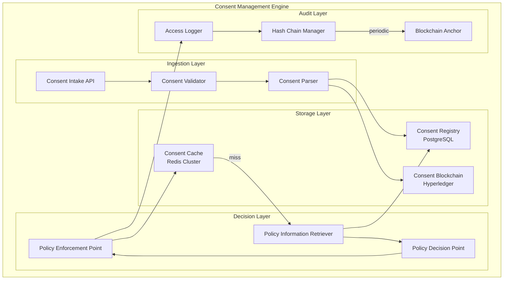
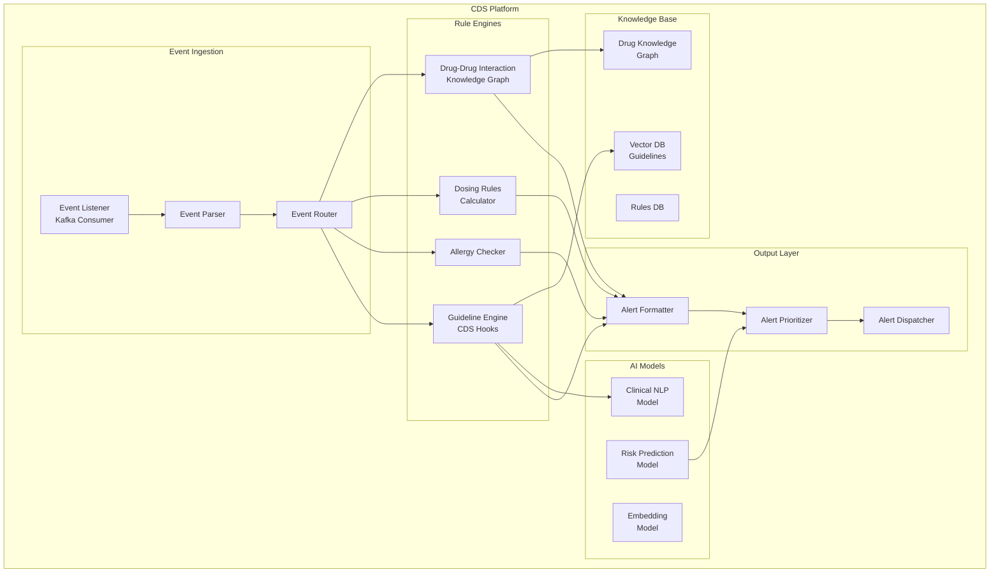
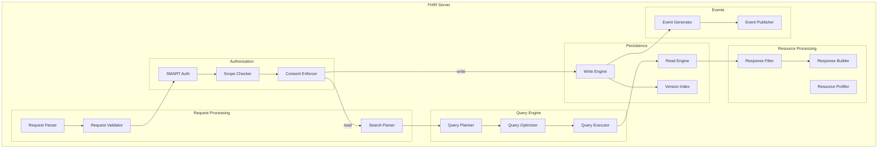

# Deep Dive and Bottlenecks

## Deep Dive 1: Consent Management Engine

### Why This Component is Critical

The Consent Management Engine is the cornerstone of the entire platform. Every data access must pass through consent verification:

- **Regulatory Mandate**: HIPAA, GDPR, ABDM all require patient consent for data access
- **Legal Liability**: Unauthorized access can result in $1M+ fines per violation
- **Patient Trust**: Consent violations destroy patient trust and platform reputation
- **Performance Impact**: Every API call requires consent verification

### Internal Architecture



### Consent Processing Flow

```
CONSENT CREATION FLOW:

1. INTAKE
   ├── Receive FHIR Consent resource
   ├── Validate structure (FHIR R4 conformance)
   ├── Validate patient reference exists
   └── Validate actor references exist

2. POLICY EXTRACTION
   ├── Parse provision tree
   ├── Normalize actors to canonical IDs
   ├── Normalize purposes to standard codes
   ├── Extract effective periods
   └── Identify nested deny provisions

3. CONFLICT DETECTION
   ├── Query existing active consents for patient
   ├── Check for overlapping provisions
   ├── Identify conflicts (same scope, different decision)
   └── Apply conflict resolution rules:
       ├── Most recent consent wins (temporal)
       ├── Most specific consent wins (specificity)
       └── Deny overrides permit (safety)

4. PERSISTENCE
   ├── Assign version number
   ├── Calculate consent hash
   ├── Store in Consent Registry
   ├── Invalidate cache entries for patient
   └── Publish consent.created event

5. BLOCKCHAIN ANCHORING (async)
   ├── Batch consents (every 5 minutes)
   ├── Calculate Merkle root
   ├── Submit to blockchain
   └── Store transaction reference
```

### Consent Verification Deep Dive

```
CONSENT VERIFICATION FLOW (per request):

FUNCTION verify_consent(request):

    -- Step 1: Extract request parameters
    patient_id = request.patient
    actor_id = request.actor
    actor_roles = request.actor_roles
    resource_type = request.resource_type
    resource_codes = request.resource_codes  -- specific LOINC/SNOMED codes
    purpose = request.purpose
    action = request.action  -- read, write, etc.

    -- Step 2: Check consent cache (Redis)
    cache_key = f"{patient_id}:{actor_id}:{resource_type}:{purpose}"
    cached_decision = redis.get(cache_key)

    IF cached_decision:
        -- Cache hit: fast path (~1ms)
        log_access(request, cached_decision, "cache_hit")
        RETURN cached_decision

    -- Step 3: Query consent registry (PostgreSQL)
    -- Cache miss: slow path (~20-50ms)
    active_consents = query_db(
        """
        SELECT * FROM consent
        WHERE patient_id = $1
          AND status = 'active'
          AND (period_end IS NULL OR period_end > NOW())
          AND period_start <= NOW()
        ORDER BY datetime DESC
        """,
        patient_id
    )

    -- Step 4: Evaluate consent provisions
    decision = evaluate_consents(
        active_consents,
        actor_id,
        actor_roles,
        resource_type,
        resource_codes,
        purpose,
        action
    )

    -- Step 5: Cache decision
    cache_ttl = 300  -- 5 minutes (balance freshness vs performance)
    redis.setex(cache_key, cache_ttl, decision)

    -- Step 6: Log access
    log_access(request, decision, "cache_miss")

    RETURN decision

-- Cache Invalidation Strategy
ON consent_changed(patient_id):
    -- Invalidate all cache entries for this patient
    pattern = f"{patient_id}:*"
    keys = redis.scan(match=pattern)
    redis.delete(*keys)

    -- Publish cache invalidation event (for distributed cache)
    publish("consent.cache.invalidate", patient_id)
```

### Break-the-Glass Implementation

```
BREAK-THE-GLASS PROTOCOL:

PRECONDITIONS:
  - Normal consent verification returned DENY
  - Clinician has appropriate role for BTG
  - MFA is enabled on clinician account

FUNCTION initiate_btg(clinician, patient, reason):

    -- Step 1: Verify BTG eligibility
    IF NOT clinician.roles.intersects(['physician', 'nurse', 'emergency_staff']):
        RAISE UnauthorizedError("Role not eligible for emergency access")

    IF NOT patient.is_active:
        RAISE InvalidRequestError("Patient record not active")

    -- Step 2: Present attestation form
    attestation = create_attestation_form(
        reasons = [
            "life_threatening_emergency",
            "patient_incapacitated",
            "mental_health_crisis",
            "child_protection",
            "other_emergency"
        ],
        required_fields = [
            "justification_text",  -- min 20 characters
            "expected_duration"    -- 1h, 4h, 8h, 24h
        ]
    )

    RETURN attestation

FUNCTION complete_btg(clinician, patient, attestation, mfa_response):

    -- Step 3: Verify MFA
    IF NOT verify_mfa(clinician, mfa_response):
        log_btg_attempt(clinician, patient, "mfa_failed")
        RAISE AuthenticationError("MFA verification failed")

    -- Step 4: Validate attestation
    IF attestation.justification_text.length < 20:
        RAISE ValidationError("Justification must be at least 20 characters")

    -- Step 5: Create time-limited access token
    btg_token = create_btg_token(
        clinician_id = clinician.id,
        patient_id = patient.id,
        reason = attestation.reason,
        justification = attestation.justification_text,
        expires_at = NOW() + parse_duration(attestation.expected_duration),
        max_duration = 24_hours  -- hard limit
    )

    -- Step 6: Log BTG event (HIGH PRIORITY)
    btg_event = {
        "event_type": "break_the_glass_initiated",
        "timestamp": NOW(),
        "clinician_id": clinician.id,
        "patient_id": patient.id,
        "reason": attestation.reason,
        "justification": attestation.justification_text,
        "token_id": btg_token.id,
        "expires_at": btg_token.expires_at,
        "review_required": TRUE,
        "review_due": NOW() + 48_hours
    }
    log_btg_event(btg_event)

    -- Step 7: Alert Privacy Officer (async)
    notify_privacy_officer(btg_event, urgency="within_1_hour")

    -- Step 8: Alert Patient (async, if configured)
    IF patient.btg_notification_preference == "immediate":
        notify_patient(patient, btg_event)

    RETURN btg_token

POST-EVENT REVIEW WORKFLOW:

FUNCTION btg_review_task(btg_event):

    -- Created as a task for Privacy Officer
    review_task = create_task(
        assignee = get_privacy_officer(btg_event.organization),
        due_date = btg_event.review_due,
        priority = "high",
        title = f"BTG Review: {btg_event.clinician_name} accessed {btg_event.patient_name}",
        data = {
            "btg_event": btg_event,
            "access_log": get_access_log(btg_event.token_id),
            "clinician_profile": get_clinician(btg_event.clinician_id),
            "patient_profile": get_patient(btg_event.patient_id)
        },
        actions = [
            "approve",      -- Access was appropriate
            "flag",         -- Needs further investigation
            "escalate",     -- Possible policy violation
            "remediate"     -- Requires corrective action
        ]
    )

    RETURN review_task

ON review_completed(review_task, decision):

    IF decision == "escalate" OR decision == "remediate":
        create_incident_report(review_task, decision)
        notify_compliance_officer(review_task, decision)

    -- Update BTG record with review outcome
    update_btg_record(review_task.btg_event.id, {
        "reviewed_at": NOW(),
        "reviewed_by": review_task.reviewer,
        "review_outcome": decision,
        "review_notes": review_task.notes
    })
```

### Failure Modes and Mitigations

| Failure Mode | Impact | Detection | Mitigation |
|--------------|--------|-----------|------------|
| Consent Cache Down | Higher latency (50ms → 200ms) | Health checks, latency alerts | Fallback to direct DB queries |
| Consent Registry Down | Cannot verify consents | Health checks | Fail-closed (deny all non-BTG) |
| Blockchain Down | Cannot anchor consents | Health checks | Queue for later anchoring |
| Consent Version Mismatch | Stale decision | Version comparison | Re-evaluate on mismatch |
| Race Condition on Update | Inconsistent cache | Optimistic locking | Retry with new version |

---

## Deep Dive 2: AI-Powered Clinical Decision Support

### Why This Component is Critical

Clinical Decision Support (CDS) directly impacts patient safety:

- **Drug Interactions**: Undetected DDIs cause 7,000+ US deaths annually
- **Dosing Errors**: AI can catch weight/age-inappropriate dosing
- **Guideline Adherence**: Evidence-based care improves outcomes
- **Alert Fatigue**: Poor CDS overwhelms clinicians with false positives

### Internal Architecture



### Drug Interaction Detection Flow

```
DRUG INTERACTION DETECTION PIPELINE:

TRIGGER: medication_request.created event

1. EVENT INGESTION
   ├── Parse MedicationRequest resource
   ├── Extract medication code (RxNorm)
   ├── Extract patient reference
   └── Extract prescriber reference

2. PATIENT CONTEXT LOADING
   ├── Query active medications for patient
   ├── Load allergy list
   ├── Load active conditions (Condition resources)
   ├── Load recent lab results (renal function, liver function)
   └── Load demographics (age, weight, BSA)

3. DRUG NORMALIZATION
   ├── Map medication code to RxNorm CUI
   ├── Get ingredient list (for combination drugs)
   ├── Get drug classes (ATC, therapeutic class)
   └── Get formulation details (route, strength)

4. KNOWLEDGE GRAPH QUERY
   FOR each new_ingredient:
       FOR each active_ingredient:
           -- Query interaction knowledge graph
           interaction = kg.query(
               """
               MATCH (a:Ingredient {cui: $new_ing})
                     -[r:INTERACTS_WITH]-
                     (b:Ingredient {cui: $active_ing})
               RETURN r.severity, r.mechanism, r.clinical_effect,
                      r.onset, r.documentation_level, r.management
               """
           )

           IF interaction:
               interactions.append(interaction)

5. SEVERITY ADJUSTMENT
   FOR each interaction:
       -- Adjust based on patient factors
       IF patient.age > 65:
           IF interaction.affects_elderly:
               interaction.severity = increase_severity(interaction.severity)

       IF patient.gfr < 30:
           IF interaction.renally_cleared:
               interaction.severity = increase_severity(interaction.severity)

       IF patient.has_condition(liver_disease):
           IF interaction.hepatically_metabolized:
               interaction.severity = increase_severity(interaction.severity)

6. ALERT GENERATION
   alerts = []
   FOR each interaction:
       alert = {
           "type": "drug-drug-interaction",
           "severity": interaction.severity,
           "drugs": [new_medication, interacting_medication],
           "mechanism": interaction.mechanism,
           "clinical_effect": interaction.clinical_effect,
           "onset": interaction.onset,
           "management": interaction.management,
           "evidence_level": interaction.documentation_level,
           "references": interaction.literature_references
       }
       alerts.append(alert)

7. ALERT PRIORITIZATION
   -- Apply alert fatigue mitigation
   FOR each alert:
       -- Check if alert was previously overridden
       IF was_recently_overridden(alert, patient, prescriber):
           alert.priority = decrease_priority(alert.priority)

       -- Check if patient on medication long-term
       IF patient.has_been_on(interacting_med, days=90):
           alert.priority = decrease_priority(alert.priority)

   -- Filter low-priority alerts during high-load periods
   IF system_load > 0.8:
       alerts = filter(alerts, lambda a: a.severity >= "moderate")

8. DISPATCH
   publish_cds_alert(alerts, destination="prescriber_inbox")
   publish_cds_alert(alerts, destination="pharmacist_queue")

   IF any(alert.severity == "critical" for alert in alerts):
       publish_cds_alert(alerts, destination="immediate_popup")
```

### RAG Pipeline for Clinical Guidelines

```
CLINICAL GUIDELINE RAG PIPELINE:

INPUT: Clinical context (patient conditions, current medications, proposed action)
OUTPUT: Relevant guideline recommendations with evidence

1. CONTEXT EMBEDDING
   -- Combine patient context into query
   query_text = f"""
       Patient: {age}yo {gender}
       Conditions: {conditions_list}
       Medications: {medications_list}
       Current action: {proposed_action}
       Question: What guidelines apply?
   """

   query_embedding = clinical_bert.encode(query_text)

2. VECTOR SEARCH
   -- Search clinical guidelines vector store
   candidates = vector_db.search(
       collection = "clinical_guidelines",
       query_vector = query_embedding,
       top_k = 20,
       filter = {
           "applicable_conditions": {"$in": patient.conditions},
           "source": {"$in": ["ADA", "ACC/AHA", "WHO", "NICE", "ICMR"]}
       }
   )

3. RERANKING
   -- Use cross-encoder for more accurate relevance
   reranked = []
   FOR candidate IN candidates:
       score = cross_encoder.predict(
           query = query_text,
           document = candidate.content
       )
       reranked.append((candidate, score))

   reranked.sort(key=lambda x: x[1], reverse=True)
   top_guidelines = reranked[:5]

4. RECOMMENDATION GENERATION
   -- Generate recommendations using LLM
   prompt = f"""
   Based on the following clinical guidelines and patient context,
   provide specific, actionable recommendations.

   Patient Context:
   {patient_summary}

   Relevant Guidelines:
   {format_guidelines(top_guidelines)}

   Current Clinical Question:
   {clinical_question}

   Provide recommendations in JSON format:
   {{
     "recommendations": [
       {{
         "action": "...",
         "rationale": "...",
         "evidence_level": "A/B/C",
         "guideline_source": "...",
         "contraindications": [...]
       }}
     ]
   }}
   """

   response = llm.generate(prompt, max_tokens=1000)
   recommendations = parse_json(response)

5. VALIDATION
   -- Validate recommendations against patient context
   FOR rec IN recommendations:
       -- Check for conflicts with allergies
       IF conflicts_with_allergies(rec, patient.allergies):
           rec.warnings.append("Conflicts with documented allergy")

       -- Check for contraindications
       FOR contra IN rec.contraindications:
           IF patient.has_condition(contra):
               rec.warnings.append(f"Patient has contraindication: {contra}")

6. OUTPUT FORMATTING
   RETURN {
       "recommendations": recommendations,
       "sources": [g.reference for g in top_guidelines],
       "confidence": calculate_confidence(reranked),
       "disclaimer": "AI-generated. Clinical judgment required."
   }
```

### Performance Optimization

```
CDS LATENCY OPTIMIZATION:

TARGET: < 100ms for synchronous checks, < 500ms for complex guidelines

OPTIMIZATION STRATEGIES:

1. PRE-COMPUTATION
   -- Pre-compute patient risk scores daily
   DAILY_JOB:
       FOR each active_patient:
           risk_scores = calculate_all_risk_scores(patient)
           cache.set(f"risk:{patient.id}", risk_scores, ttl=24h)

   -- Pre-compute drug interaction pairs for active medications
   ON medication_added(patient, medication):
       interactions = compute_all_interactions(patient.active_meds)
       cache.set(f"ddi:{patient.id}", interactions, ttl=12h)

2. TIERED CACHING
   L1_CACHE (in-memory, <1ms):
       - Drug metadata (RxNorm concepts)
       - Interaction pairs (top 10,000)
       - Dosing rules

   L2_CACHE (Redis, <5ms):
       - Patient-specific DDI results
       - Patient risk scores
       - Recent guideline queries

   L3_CACHE (read replica, <20ms):
       - Full drug knowledge graph
       - Guideline content

3. ASYNC PROCESSING
   -- Complex checks run async, simple checks sync
   IF check_type == "critical_ddi":
       -- Synchronous, blocking
       result = evaluate_sync(check, timeout=100ms)
   ELSE IF check_type == "guideline_recommendation":
       -- Async, non-blocking
       task_id = enqueue_async(check)
       notify_when_complete(task_id, callback_url)

4. MODEL OPTIMIZATION
   -- Quantized models for inference
   ddi_model = load_model("drug-interaction-classifier", quantization="int8")
   clinical_bert = load_model("clinical-bert-base", quantization="fp16")

   -- Batched inference for efficiency
   IF pending_requests.length > 10:
       batch_inference(pending_requests)
```

### Failure Modes and Mitigations

| Failure Mode | Impact | Detection | Mitigation |
|--------------|--------|-----------|------------|
| Knowledge Graph Down | Cannot check DDI | Health checks | Fallback to cached pairs |
| AI Model Down | No guideline recommendations | Health checks | Return "check unavailable" |
| High Latency (>100ms) | Alert delays | Latency monitoring | Auto-scale, shed low-priority |
| False Positive Flood | Alert fatigue | Override rate monitoring | Tune thresholds, ML filtering |
| False Negative | Missed interaction | Periodic audit vs reference | Cross-validate with FDA sources |

---

## Deep Dive 3: FHIR Server with Consent Integration

### Why This Component is Critical

The FHIR Server is the primary data access layer:

- **Single Point of Access**: All clinical data flows through FHIR
- **Interoperability Gateway**: External systems connect via FHIR
- **Consent Enforcement**: Every query must respect consent
- **Regulatory Compliance**: FHIR audit logs are evidence

### Internal Architecture



### Consent-Aware Query Processing

```
FHIR QUERY WITH CONSENT ENFORCEMENT:

REQUEST: GET /fhir/r4/Observation?patient=Patient/123&category=laboratory

1. REQUEST PARSING
   ├── Extract resource type: Observation
   ├── Extract search parameters:
   │   ├── patient = Patient/123
   │   └── category = laboratory
   ├── Extract includes/revincludes: none
   └── Extract pagination: _count=20, _offset=0

2. AUTHENTICATION
   ├── Validate Bearer token
   ├── Extract token claims:
   │   ├── user_id: Practitioner/456
   │   ├── scopes: ["patient/Observation.read"]
   │   ├── patient_context: Patient/123
   │   └── purpose: TREAT
   └── Validate token not expired

3. SCOPE VALIDATION
   ├── Required scope: patient/Observation.read
   ├── Token scopes: ["patient/Observation.read"]
   └── Result: AUTHORIZED

4. CONSENT VERIFICATION (pre-query)
   ├── Query consent cache for Patient/123
   ├── Evaluate consent for:
   │   ├── actor = Practitioner/456
   │   ├── resource_type = Observation
   │   ├── purpose = TREAT
   │   └── action = access
   ├── Decision: PERMIT_WITH_FILTER
   └── Filters: [exclude HIV tests (LOINC 75622-1)]

5. QUERY PLANNING
   ├── Base query:
   │   SELECT * FROM observation
   │   WHERE patient_id = 'Patient/123'
   │     AND category = 'laboratory'
   ├── Apply consent filters:
   │   AND code_value NOT IN ('75622-1')  -- HIV tests excluded
   ├── Apply pagination:
   │   ORDER BY effective_datetime DESC
   │   LIMIT 21 OFFSET 0  -- +1 for next page detection
   └── Estimated rows: 150

6. QUERY EXECUTION
   ├── Execute optimized query
   ├── Fetch from read replica (if available)
   └── Result: 21 rows

7. RESPONSE FILTERING
   FOR each row:
       -- Re-verify consent at row level (defense in depth)
       IF row.code IN consent.excluded_codes:
           SKIP row
       -- Apply field-level masking if needed
       IF row.has_sensitive_note:
           row.note = "[REDACTED]"
       filtered_results.append(row)

8. RESPONSE BUILDING
   ├── Build FHIR Bundle
   ├── Set total: 150 (before pagination)
   ├── Add pagination links:
   │   ├── self: /Observation?patient=...&_offset=0
   │   └── next: /Observation?patient=...&_offset=20
   └── Add OperationOutcome if warnings

9. AUDIT LOGGING (async)
   log_access({
       actor: Practitioner/456,
       action: search,
       resource_type: Observation,
       patient: Patient/123,
       consent_id: Consent/abc,
       filters_applied: ["exclude:75622-1"],
       results_returned: 20,
       total_matched: 150
   })

10. RETURN RESPONSE
    HTTP 200 OK
    Content-Type: application/fhir+json
    {
      "resourceType": "Bundle",
      "type": "searchset",
      "total": 150,
      "link": [...],
      "entry": [...]
    }
```

### FHIR Subscription with Consent

```
FHIR SUBSCRIPTION FLOW:

1. SUBSCRIPTION CREATION
   POST /fhir/r4/Subscription
   {
     "resourceType": "Subscription",
     "status": "requested",
     "criteria": "Observation?patient=Patient/123&category=vital-signs",
     "channel": {
       "type": "rest-hook",
       "endpoint": "https://app.example.com/webhook",
       "payload": "application/fhir+json"
     }
   }

2. SUBSCRIPTION VALIDATION
   ├── Validate subscriber has appropriate scopes
   ├── Validate consent exists for data access:
   │   ├── Check consent for patient in criteria
   │   ├── Verify subscriber is authorized actor
   │   └── Verify purpose (e.g., TREAT)
   ├── If consent missing/denied:
   │   └── Return 403 with OperationOutcome
   └── Store subscription with consent reference

3. EVENT TRIGGERING
   ON observation_created(observation):
       -- Check if observation matches any subscription
       matching_subs = find_matching_subscriptions(observation)

       FOR sub IN matching_subs:
           -- Re-verify consent at notification time
           consent = get_consent(
               patient = observation.patient,
               actor = sub.subscriber,
               resource_type = "Observation",
               purpose = sub.purpose
           )

           IF consent.decision == "PERMIT":
               -- Apply filters if PERMIT_WITH_FILTER
               filtered_obs = apply_consent_filters(observation, consent)
               send_notification(sub.channel, filtered_obs)

           ELSE:
               -- Consent revoked since subscription created
               log_blocked_notification(sub, observation, consent)
               -- Optionally deactivate subscription
               IF consent.status == "inactive":
                   deactivate_subscription(sub)

4. CONSENT CHANGE HANDLING
   ON consent_changed(patient_id, consent):
       -- Find subscriptions affected by this consent
       affected_subs = find_subscriptions_by_patient(patient_id)

       FOR sub IN affected_subs:
           -- Re-evaluate subscription validity
           new_decision = evaluate_consent(
               patient = patient_id,
               actor = sub.subscriber,
               resource_type = sub.resource_type,
               purpose = sub.purpose
           )

           IF new_decision == "DENY":
               -- Deactivate subscription
               update_subscription(sub.id, status="off")
               notify_subscriber(sub, "subscription_suspended", "consent_revoked")
```

### Failure Modes and Mitigations

| Failure Mode | Impact | Detection | Mitigation |
|--------------|--------|-----------|------------|
| FHIR Server Down | No data access | Health checks | Active-passive failover |
| Consent Service Down | Cannot authorize | Circuit breaker | Fail-closed (deny all) |
| Query Timeout | Slow searches | Query timeout | Query cancellation, caching |
| Subscription Backlog | Delayed notifications | Queue depth monitoring | Auto-scale consumers |
| Schema Drift | Invalid resources | Validation errors | Profile versioning |

---

## Bottleneck Analysis

### Top 3 Bottlenecks

#### Bottleneck 1: Consent Verification Latency

**Problem**: Every API request requires consent verification, adding latency.

**Analysis**:
- Cache hit path: ~1-5ms
- Cache miss path: ~20-50ms (DB query + evaluation)
- At 1000 QPS with 80% cache hit: 200 req/s hit DB
- At 1000 QPS with 50% cache hit: 500 req/s hit DB

**Mitigation Strategies**:

| Strategy | Implementation | Impact |
|----------|---------------|--------|
| Increase cache TTL | 5 min → 15 min | Higher hit rate, stale risk |
| Pre-warm cache | On consent change, pre-populate | Reduced cold start |
| Consent denormalization | Store decisions with resources | Fastest reads |
| Async validation | Validate post-response for reads | Lower perceived latency |
| Consent sharding | Shard by patient hash | Horizontal scale |

#### Bottleneck 2: AI Inference Latency

**Problem**: AI features add latency to clinical workflows.

**Analysis**:
- Drug interaction check: 50-100ms
- Guideline RAG: 200-500ms
- Ambient documentation: Real-time streaming
- Coding suggestions: 200-500ms

**Mitigation Strategies**:

| Strategy | Implementation | Impact |
|----------|---------------|--------|
| Model quantization | INT8/FP16 quantization | 2-4x speedup, minor accuracy loss |
| Batch inference | Batch requests every 10ms | Higher throughput |
| Speculative execution | Pre-compute likely requests | Faster perceived latency |
| Model distillation | Smaller specialized models | Faster inference |
| Edge caching | Cache frequent queries | Instant responses |
| Async processing | Return immediately, notify when ready | Non-blocking |

#### Bottleneck 3: Cross-Region Data Access

**Problem**: Data residency requirements prevent caching across regions.

**Analysis**:
- US clinician accessing EU patient: 100-200ms network RTT
- Query + consent verification: 50-100ms
- Total: 150-300ms (vs 50ms same-region)

**Mitigation Strategies**:

| Strategy | Implementation | Impact |
|----------|---------------|--------|
| Data mirroring (where legal) | Mirror to adjacent regions | Lower latency |
| Consent-based caching | Cache if consent permits | Faster subsequent access |
| Read replicas | Read from local replica | Query speedup |
| Request routing | Route user to nearest region | Reduce cross-region |
| Prefetching | Prefetch based on care relationships | Proactive loading |

### Bottleneck Comparison Matrix

| Bottleneck | Frequency | Impact | Mitigation Cost | Priority |
|------------|-----------|--------|-----------------|----------|
| Consent Verification | Every request | Medium (20-50ms) | Low | P1 |
| AI Inference | Per AI feature | Medium (100-500ms) | Medium | P2 |
| Cross-Region Access | 10% of requests | High (100-200ms) | High | P2 |
| FHIR Search Complexity | 20% of requests | Variable | Medium | P3 |
| Audit Log Write | Every request | Low (async) | Low | P4 |

### Concurrency and Race Conditions

#### Race Condition 1: Consent Update During Data Access

```
SCENARIO:
  T0: Request arrives, consent check passes
  T1: Consent is revoked
  T2: Data is returned to client

IMPACT: Data returned after consent was revoked

MITIGATION:
  - Use versioned consent with optimistic locking
  - Re-check consent version before response
  - Accept small window of exposure (ms) as unavoidable

PSEUDOCODE:
  consent_v1 = check_consent()  -- returns version
  data = fetch_data()
  consent_v2 = get_consent_version()
  IF consent_v1 != consent_v2:
      re_evaluate and potentially filter
```

#### Race Condition 2: Concurrent Medication Orders

```
SCENARIO:
  T0: Dr. A orders Drug X for Patient
  T1: Dr. B orders Drug Y for Patient (interacts with X)
  T2: Both orders saved, neither CDS fires

IMPACT: Drug interaction missed

MITIGATION:
  - Pessimistic locking on patient medication list
  - CDS re-evaluation on order commit
  - Post-commit DDI check as safety net

PSEUDOCODE:
  BEGIN TRANSACTION
  LOCK patient_medications FOR UPDATE
  existing_meds = get_active_medications(patient)
  new_order = create_medication_order(drug, patient)
  interactions = check_ddi(new_order, existing_meds)
  IF interactions.has_critical:
      ROLLBACK
      RETURN interaction_alert
  COMMIT
  async: rerun_cds_for_patient(patient)
```

#### Race Condition 3: Break-the-Glass Token Reuse

```
SCENARIO:
  T0: Clinician initiates BTG, gets token
  T1: Token expires
  T2: Clinician uses expired token

IMPACT: Unauthorized access after expiry

MITIGATION:
  - Token validation on every request
  - Short-lived tokens (max 4 hours)
  - Token revocation list for immediate revocation

PSEUDOCODE:
  IF btg_token.expires_at < NOW():
      RAISE TokenExpiredError()
  IF btg_token.id IN revocation_list:
      RAISE TokenRevokedError()
  -- Proceed with access
```
