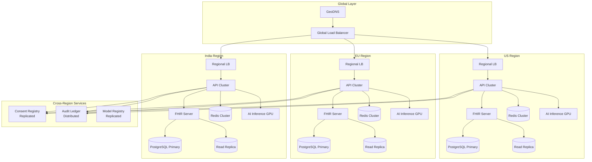
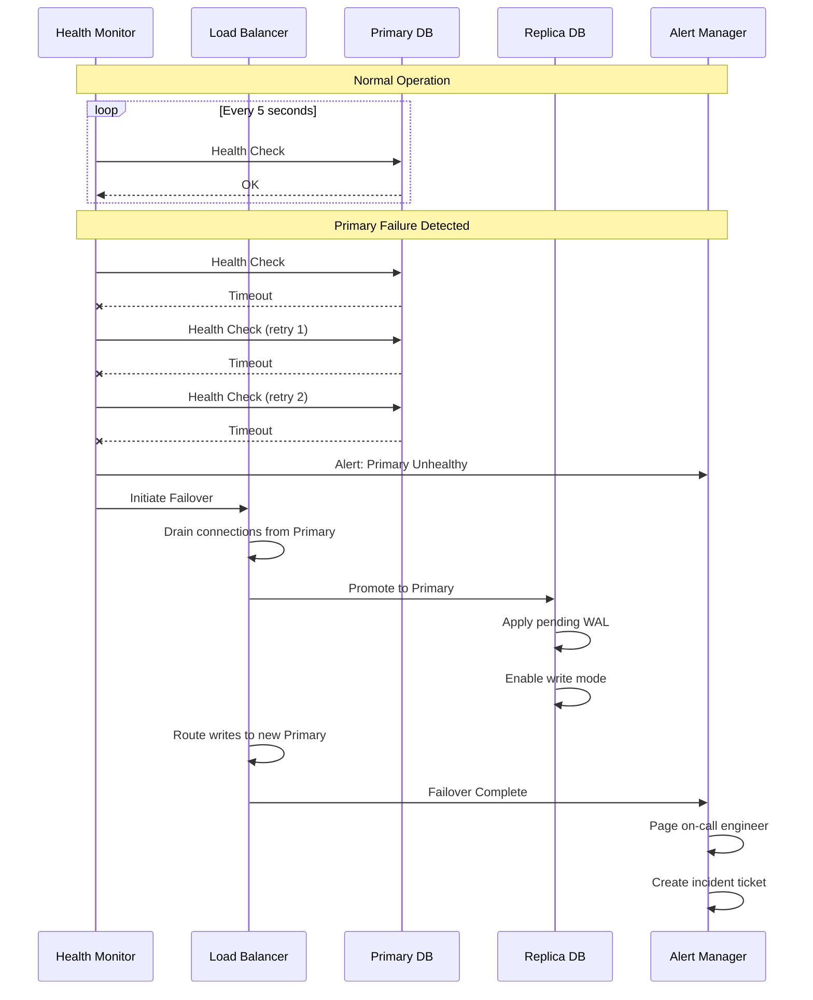

# Scalability and Reliability

## Scalability Strategy

### Horizontal vs Vertical Scaling Decisions

| Component | Scaling Type | Rationale |
|-----------|-------------|-----------|
| API Gateway | Horizontal | Stateless, load-balanced |
| FHIR Server | Horizontal | Stateless, partitioned by tenant |
| Clinical Services | Horizontal | Stateless microservices |
| Consent Service | Horizontal | Stateless with cache |
| AI Inference | Horizontal + Vertical | GPU scaling, model parallelism |
| PostgreSQL | Vertical + Read Replicas | Strong consistency requirement |
| Redis Cache | Horizontal (cluster) | Sharded by key |
| Kafka | Horizontal | Partition-based scaling |

### Multi-Region Architecture



### Auto-Scaling Configuration

```
AUTO-SCALING POLICIES:

API GATEWAY / FHIR SERVER:
  metric: cpu_utilization
  target: 70%
  min_instances: 3
  max_instances: 50
  scale_up_cooldown: 60s
  scale_down_cooldown: 300s

  metric: request_latency_p99
  threshold: 500ms
  scale_up_increment: 2
  evaluation_periods: 3

CLINICAL SERVICES:
  metric: queue_depth
  target: 100 messages
  min_instances: 2
  max_instances: 20

AI INFERENCE (GPU):
  metric: gpu_utilization
  target: 80%
  min_instances: 2
  max_instances: 16

  metric: inference_queue_depth
  threshold: 50
  scale_up_increment: 1

SCHEDULED SCALING:
  -- Pre-scale for known traffic patterns
  weekday_morning_ramp:
    start: 06:00 local
    end: 09:00 local
    min_instances: 2x baseline

  end_of_month_billing:
    days: [28, 29, 30, 31, 1]
    min_instances: 1.5x baseline
```

### Database Scaling Strategy

```
DATABASE SCALING:

PRIMARY DATABASE (PostgreSQL):
  -- Vertical scaling (larger instances)
  instance_type_progression:
    - db.r6g.xlarge (4 vCPU, 32GB)   -- Startup
    - db.r6g.2xlarge (8 vCPU, 64GB)  -- Growth
    - db.r6g.4xlarge (16 vCPU, 128GB) -- Scale
    - db.r6g.8xlarge (32 vCPU, 256GB) -- Enterprise

  -- Storage auto-scaling
  storage:
    initial: 500GB
    max: 64TB
    auto_scale_threshold: 80%

READ REPLICAS:
  per_region: 2-4 replicas
  lag_threshold: 100ms
  promotion_on_primary_failure: automatic

SHARDING STRATEGY:
  -- Shard by tenant_id for multi-tenant isolation
  shard_key: tenant_id
  shard_count: 16 (initial), expandable to 256

  -- Hot tenant isolation
  IF tenant.qps > 1000:
      migrate_to_dedicated_shard(tenant)

CONNECTION POOLING:
  pool_type: PgBouncer
  pool_mode: transaction
  max_connections_per_pool: 100
  pools_per_region: 3
```

### Caching Strategy

```
MULTI-LAYER CACHING:

L1 CACHE (Application Memory):
  type: In-process cache
  size: 1GB per instance
  ttl: 60 seconds
  use_case:
    - Frequently accessed FHIR resources
    - User session data
    - Terminology lookups

L2 CACHE (Redis Cluster):
  type: Distributed cache
  cluster_size: 6 nodes (3 primary, 3 replica)
  total_memory: 100GB
  ttl: 5-15 minutes
  use_case:
    - Consent decisions
    - Patient demographics
    - Search results
    - AI model outputs

L3 CACHE (CDN / Edge):
  type: Edge cache
  locations: 50+ PoPs
  ttl: 1 hour (static), 5 minutes (API)
  use_case:
    - Static assets
    - Terminology definitions
    - Public FHIR capability statements

CACHE INVALIDATION:
  strategy: Write-through with event-based invalidation

  ON resource_updated(resource):
      -- Invalidate L1 cache (broadcast)
      publish("cache.invalidate.l1", resource.id)

      -- Invalidate L2 cache
      redis.delete(f"resource:{resource.id}")
      redis.delete(f"patient:{resource.patient}:*")

      -- CDN purge (async)
      IF resource.is_public:
          cdn.purge(f"/fhir/{resource.type}/{resource.id}")

CACHE HIT RATES (TARGET):
  L1: 40-50%
  L2: 80-90%
  L3: 95%+ (static content)
```

### Hot Spot Mitigation

```
HOT SPOT SCENARIOS:

1. HOT PATIENT (Celebrity, high-profile case)
   Problem: Single patient accessed by many users
   Detection: QPS per patient > 100
   Mitigation:
     - Dedicated cache shard for hot patients
     - Read replica routing
     - Rate limiting per patient

2. HOT TENANT (Large hospital system)
   Problem: Single tenant generates majority of traffic
   Detection: Tenant QPS > 30% of total
   Mitigation:
     - Dedicated database shard
     - Isolated compute pool
     - Separate rate limits

3. HOT RESOURCE TYPE (Observations during flu season)
   Problem: Specific resource type overwhelms system
   Detection: Resource type QPS > 5x baseline
   Mitigation:
     - Additional read replicas
     - Query result caching
     - Async processing for non-critical

4. HOT TIME PERIOD (Morning rounds, shift changes)
   Problem: Predictable daily traffic spikes
   Detection: Historical pattern analysis
   Mitigation:
     - Scheduled pre-scaling
     - Request queuing during peak
     - Priority-based processing

IMPLEMENTATION:

FUNCTION handle_hot_spot(entity_type, entity_id, current_qps):

    threshold = get_threshold(entity_type)

    IF current_qps > threshold:
        -- Enable hot spot mode
        enable_dedicated_resources(entity_type, entity_id)
        increase_cache_allocation(entity_type, entity_id)
        enable_request_coalescing(entity_type, entity_id)
        alert_ops_team("hot_spot_detected", entity_type, entity_id)

    IF current_qps < threshold * 0.5:
        -- Disable hot spot mode after cooldown
        IF hot_spot_duration > 1_hour:
            disable_dedicated_resources(entity_type, entity_id)
```

---

## Reliability and Fault Tolerance

### Single Points of Failure Analysis

| Component | SPOF Risk | Mitigation |
|-----------|-----------|------------|
| Database Primary | High | Multi-AZ, automatic failover |
| Consent Registry | Critical | Active-active replication |
| API Gateway | High | Multi-instance, load balanced |
| DNS | High | Multiple providers, health checks |
| Kafka Cluster | Medium | Multi-broker, replication factor 3 |
| AI GPU Cluster | Medium | Multi-node, graceful degradation |
| Certificate Authority | Low | Multiple CAs, pre-rotation |

### Redundancy Strategy

```
REDUNDANCY LEVELS:

COMPUTE:
  api_instances_per_az: 3
  availability_zones: 3
  total_instances: 9 (minimum)

DATABASE:
  primary: 1
  synchronous_replica: 1 (same region, different AZ)
  asynchronous_replicas: 2-4
  cross_region_replica: 1 (DR)

CACHE:
  redis_primaries: 3
  redis_replicas: 3
  replication_factor: 1

MESSAGE QUEUE:
  kafka_brokers: 3
  replication_factor: 3
  min_insync_replicas: 2

OBJECT STORAGE:
  replication: 3 copies (within region)
  cross_region: 1 copy (DR)

AI INFERENCE:
  gpu_nodes: 4 minimum
  model_replicas: 2 per model
```

### Failover Mechanisms



### Circuit Breaker Implementation

```
CIRCUIT BREAKER CONFIGURATION:

PER SERVICE:

  consent_service:
    failure_threshold: 5          -- Failures before open
    success_threshold: 3          -- Successes to close
    timeout: 30s                  -- Time in open state
    half_open_requests: 3         -- Test requests in half-open

  ai_service:
    failure_threshold: 10
    success_threshold: 5
    timeout: 60s
    half_open_requests: 5
    fallback: "ai_disabled"

  external_hie:
    failure_threshold: 3
    success_threshold: 2
    timeout: 120s
    half_open_requests: 1
    fallback: "cached_data_only"

STATE MACHINE:

  CLOSED:
    -- Normal operation
    on_failure: increment failure_count
    IF failure_count >= failure_threshold:
        transition_to(OPEN)
    on_success: reset failure_count

  OPEN:
    -- Reject all requests immediately
    return_fallback()
    AFTER timeout:
        transition_to(HALF_OPEN)

  HALF_OPEN:
    -- Allow limited test requests
    allowed_requests = half_open_requests
    on_success: decrement allowed_requests
    IF success_count >= success_threshold:
        transition_to(CLOSED)
    on_failure:
        transition_to(OPEN)

PSEUDOCODE:

FUNCTION call_with_circuit_breaker(service, request):

    circuit = get_circuit(service)

    IF circuit.state == OPEN:
        IF circuit.should_try_half_open():
            circuit.state = HALF_OPEN
        ELSE:
            RETURN circuit.fallback(request)

    TRY:
        response = service.call(request, timeout=circuit.call_timeout)
        circuit.record_success()
        RETURN response

    CATCH TimeoutError, ServiceError:
        circuit.record_failure()
        IF circuit.state == HALF_OPEN:
            circuit.state = OPEN
        RETURN circuit.fallback(request)
```

### Retry Strategy

```
RETRY CONFIGURATION:

EXPONENTIAL BACKOFF WITH JITTER:

  FUNCTION retry_with_backoff(operation, max_retries=3, base_delay=100ms):

      FOR attempt IN range(max_retries):
          TRY:
              RETURN operation()

          CATCH RetryableError as e:
              IF attempt == max_retries - 1:
                  RAISE e

              -- Calculate delay with exponential backoff
              delay = base_delay * (2 ** attempt)

              -- Add jitter (±25%) to prevent thundering herd
              jitter = delay * random.uniform(-0.25, 0.25)
              actual_delay = delay + jitter

              -- Cap maximum delay
              actual_delay = min(actual_delay, 30_seconds)

              sleep(actual_delay)

RETRY POLICIES BY OPERATION:

  database_read:
    max_retries: 3
    base_delay: 50ms
    retryable_errors: [ConnectionError, TimeoutError]

  database_write:
    max_retries: 2
    base_delay: 100ms
    retryable_errors: [ConnectionError]
    -- Note: Check idempotency before retry

  external_api:
    max_retries: 3
    base_delay: 500ms
    retryable_errors: [TimeoutError, 502, 503, 504]

  ai_inference:
    max_retries: 2
    base_delay: 200ms
    retryable_errors: [GPUMemoryError, ModelLoadError]
    fallback: skip_ai_feature

IDEMPOTENCY:

  -- For write operations, use idempotency keys
  FUNCTION idempotent_write(resource, idempotency_key):

      existing = lookup_idempotency(idempotency_key)

      IF existing:
          RETURN existing.response

      response = perform_write(resource)
      store_idempotency(idempotency_key, response, ttl=24h)

      RETURN response
```

### Graceful Degradation

```
DEGRADATION LEVELS:

LEVEL 0 - NORMAL:
  All features operational
  Full AI capabilities
  Real-time interoperability

LEVEL 1 - AI DEGRADED:
  Trigger: AI service latency > 2s OR availability < 99%
  Actions:
    - Disable ambient documentation
    - Disable guideline recommendations
    - Keep critical DDI checks (use cached rules)
  User Impact: Manual documentation, no AI suggestions

LEVEL 2 - INTEROPERABILITY DEGRADED:
  Trigger: External HIE unavailable OR latency > 5s
  Actions:
    - Disable external data queries
    - Use cached external data (if recent)
    - Queue outbound messages
  User Impact: No cross-organization data, delayed sharing

LEVEL 3 - CONSENT SERVICE DEGRADED:
  Trigger: Consent cache miss rate > 50% AND DB latency > 500ms
  Actions:
    - Fail-closed for non-emergency access
    - Allow BTG for emergency access
    - Queue consent checks for async validation
  User Impact: Restricted data access, emergency-only

LEVEL 4 - DATABASE DEGRADED:
  Trigger: Primary DB failover in progress
  Actions:
    - Read-only mode (serve from replicas)
    - Queue write operations
    - Notify users of degraded state
  User Impact: Read-only, no new documentation

LEVEL 5 - REGIONAL OUTAGE:
  Trigger: Entire region unavailable
  Actions:
    - Failover to DR region
    - Accept potential data loss (RPO)
    - Extended recovery time
  User Impact: Service interruption, then DR mode

IMPLEMENTATION:

FUNCTION check_degradation_level():

    levels = []

    IF ai_service.health < 0.99 OR ai_service.latency_p99 > 2000:
        levels.append(LEVEL_1)

    IF hie_service.health < 0.95:
        levels.append(LEVEL_2)

    IF consent_cache.miss_rate > 0.5:
        levels.append(LEVEL_3)

    IF database.is_failover_active:
        levels.append(LEVEL_4)

    RETURN max(levels) IF levels ELSE LEVEL_0

FUNCTION apply_degradation(level):

    FOR feature IN all_features:
        IF feature.min_level > level:
            feature.disable()
        ELSE:
            feature.enable()

    broadcast_degradation_status(level)
```

### Bulkhead Pattern

```
BULKHEAD ISOLATION:

TENANT ISOLATION:
  -- Each tenant gets isolated resource pools
  tenant_pools:
    compute:
      dedicated_instances: based on tier
      shared_pool_quota: 10%

    database:
      connection_pool_size: 20 per tenant
      query_timeout: 30s

    cache:
      memory_quota: 1GB per tenant
      eviction: LRU within tenant

    ai_inference:
      request_quota: 100 req/min
      priority: based on tier

SERVICE ISOLATION:
  -- Critical vs non-critical service pools
  critical_pool:
    services: [fhir_server, consent_service, audit_service]
    resources: 60% of capacity
    priority: highest

  standard_pool:
    services: [documentation_service, scheduling_service]
    resources: 30% of capacity
    priority: normal

  ai_pool:
    services: [ai_inference, analytics]
    resources: 10% of capacity
    priority: lowest
    -- Can be shed during overload

IMPLEMENTATION:

CLASS BulkheadExecutor:
    def __init__(self, name, max_concurrent, max_wait):
        self.semaphore = Semaphore(max_concurrent)
        self.max_wait = max_wait
        self.metrics = BulkheadMetrics(name)

    def execute(self, operation):
        acquired = self.semaphore.acquire(timeout=self.max_wait)

        IF NOT acquired:
            self.metrics.rejected.increment()
            RAISE BulkheadFullError(f"{self.name} bulkhead full")

        TRY:
            self.metrics.active.increment()
            result = operation()
            self.metrics.success.increment()
            RETURN result

        FINALLY:
            self.metrics.active.decrement()
            self.semaphore.release()

-- Usage
consent_bulkhead = BulkheadExecutor("consent", max_concurrent=100, max_wait=5s)
ai_bulkhead = BulkheadExecutor("ai", max_concurrent=50, max_wait=10s)
```

---

## Disaster Recovery

### RTO and RPO Targets

| Scenario | RPO | RTO | Strategy |
|----------|-----|-----|----------|
| Single Instance Failure | 0 | < 30s | Auto-restart, load balancer health checks |
| Availability Zone Failure | 0 | < 5 min | Multi-AZ deployment, automatic failover |
| Database Primary Failure | < 1 min | < 15 min | Synchronous replica promotion |
| Regional Outage | < 5 min | < 1 hour | Cross-region DR, async replication |
| Complete Data Loss | < 24 hours | < 4 hours | Backup restoration |

### Backup Strategy

```
BACKUP CONFIGURATION:

DATABASE BACKUPS:
  continuous_wal_archiving: enabled
  wal_retention: 7 days

  full_backup:
    frequency: daily
    retention: 30 days
    storage: cross-region object storage
    encryption: AES-256

  incremental_backup:
    frequency: hourly
    retention: 7 days

  point_in_time_recovery:
    enabled: true
    retention: 7 days

AUDIT LOG BACKUPS:
  -- Compliance requires long-term retention
  hot_storage: 3 months (SSD)
  warm_storage: 1 year (HDD)
  cold_storage: 6-8 years (object storage, compressed)

  backup_verification:
    frequency: weekly
    method: restore to test environment

OBJECT STORAGE (DICOM):
  versioning: enabled
  cross_region_replication: enabled
  lifecycle_policy:
    - transition to IA after 90 days
    - transition to Glacier after 1 year
    - delete after 10 years (configurable)

BACKUP TESTING:
  restore_drill:
    frequency: monthly
    scope: random 10% of data
    success_criteria: data integrity verified

  full_dr_drill:
    frequency: quarterly
    scope: full regional failover
    success_criteria: RTO met, data consistent
```

### Multi-Region DR Architecture

```
DR ARCHITECTURE:

PRIMARY REGION (US-EAST):
  ├── Active workloads
  ├── Primary database
  ├── Real-time processing
  └── All AI features enabled

DR REGION (US-WEST):
  ├── Warm standby (scaled down)
  ├── Async replica (< 5 min lag)
  ├── Pre-deployed infrastructure
  └── AI models loaded (cold)

REPLICATION:
  database:
    type: asynchronous streaming
    lag_target: < 1 minute
    lag_alert: > 5 minutes

  object_storage:
    type: cross-region replication
    lag_target: < 15 minutes

  configuration:
    type: git-based (GitOps)
    sync: continuous

FAILOVER PROCEDURE:

  AUTOMATED (< 15 min RTO):
    1. Health check failure detected (3 consecutive)
    2. Alert triggered, confirm not false positive
    3. DNS failover initiated (TTL: 60s)
    4. DR database promoted to primary
    5. DR compute scaled up
    6. Traffic routing confirmed
    7. AI models warmed up
    8. Monitoring enabled

  MANUAL STEPS:
    1. Assess damage and data loss
    2. Communicate to stakeholders
    3. Disable replication from failed region
    4. Configure new replication (when recovered)

FAILBACK PROCEDURE:

  1. Original region recovered
  2. Replicate data back to original
  3. Wait for replication catch-up
  4. Scheduled maintenance window
  5. Failback DNS
  6. Verify functionality
  7. Resume normal replication
```

### Chaos Engineering

```
CHAOS ENGINEERING PROGRAM:

PRINCIPLES:
  - Run experiments in production (with safeguards)
  - Start small, increase blast radius gradually
  - Automate experiments
  - Learn from every experiment

EXPERIMENT CATEGORIES:

1. INFRASTRUCTURE FAILURES:
   - Instance termination
   - Availability zone failure
   - Network partition
   - DNS failure

2. APPLICATION FAILURES:
   - Service crash
   - Memory exhaustion
   - CPU starvation
   - Disk full

3. DEPENDENCY FAILURES:
   - Database connection loss
   - Cache unavailability
   - External API timeout
   - Message queue backlog

4. HEALTHCARE-SPECIFIC:
   - Consent service failure (critical path)
   - AI service degradation
   - FHIR search timeout
   - Break-the-glass under load

EXAMPLE EXPERIMENTS:

EXPERIMENT: consent_service_latency_injection
  description: "Inject 500ms latency into consent service"
  hypothesis: "System should degrade gracefully, clinical workflows continue"
  blast_radius: 10% of traffic
  duration: 15 minutes
  abort_conditions:
    - error_rate > 5%
    - p99_latency > 5s
  success_criteria:
    - error_rate < 1%
    - p99_latency < 2s
    - no patient safety alerts

EXPERIMENT: database_failover_during_peak
  description: "Trigger database failover during peak hours"
  hypothesis: "Failover completes within RTO, no data loss"
  blast_radius: single database
  duration: failover completion
  abort_conditions:
    - data loss detected
    - failover exceeds 20 minutes
  success_criteria:
    - failover < 15 minutes
    - zero data loss (RPO met)
    - application reconnects automatically

GAMEDAY SCHEDULE:
  weekly: Small experiments (single component)
  monthly: Medium experiments (cross-component)
  quarterly: Large experiments (regional failover)
```

---

## Federated Learning Scalability

### Multi-Site Training Architecture

```
FEDERATED LEARNING ARCHITECTURE:

CENTRAL COORDINATOR:
  - Manages training rounds
  - Aggregates model updates
  - Distributes global model
  - Does NOT see raw patient data

PARTICIPATING SITES:
  Site A (US Hospital):
    - 500,000 patient records
    - Local GPU cluster (4x A100)
    - Trains on local data
    - Sends encrypted gradients

  Site B (EU Hospital):
    - 300,000 patient records
    - Local GPU cluster (2x A100)
    - GDPR compliant (data stays in EU)
    - Sends encrypted gradients

  Site C (India Hospital):
    - 1,000,000 patient records
    - Local GPU cluster (4x A100)
    - DPDP compliant (data stays in India)
    - Sends encrypted gradients

TRAINING ROUND:

  1. Coordinator broadcasts global model M_t
  2. Each site downloads M_t
  3. Each site trains locally for E epochs
  4. Each site computes gradients G_i
  5. Each site applies differential privacy: G_i' = G_i + noise(ε, δ)
  6. Each site sends encrypted G_i' to coordinator
  7. Coordinator aggregates: M_{t+1} = M_t - η * Σ(w_i * G_i')
  8. Coordinator evaluates on held-out validation set
  9. If improved, continue; else, adjust hyperparameters

PRIVACY GUARANTEES:
  - Raw data never leaves site
  - Differential privacy (ε=1.0, δ=10^-5)
  - Secure aggregation (MPC)
  - Audit trail of all training rounds

SCALING:
  - Sites: 10-100 participating institutions
  - Training rounds: Weekly
  - Model size: Up to 1B parameters
  - Communication: Compressed gradients (~10MB per round)
```
