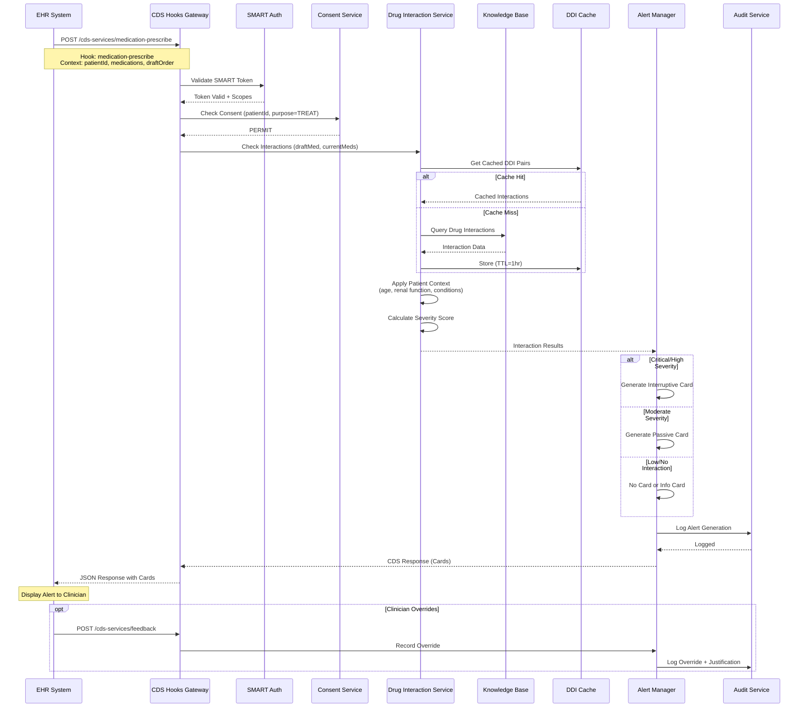
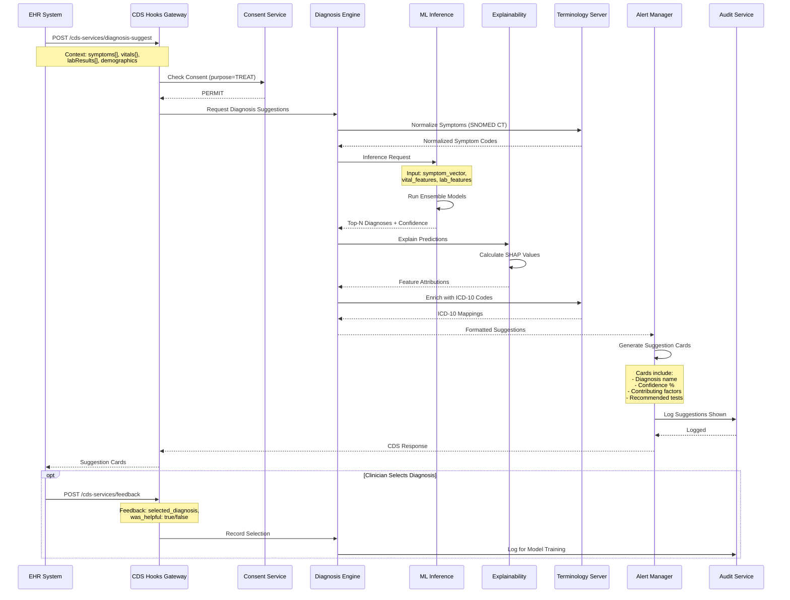
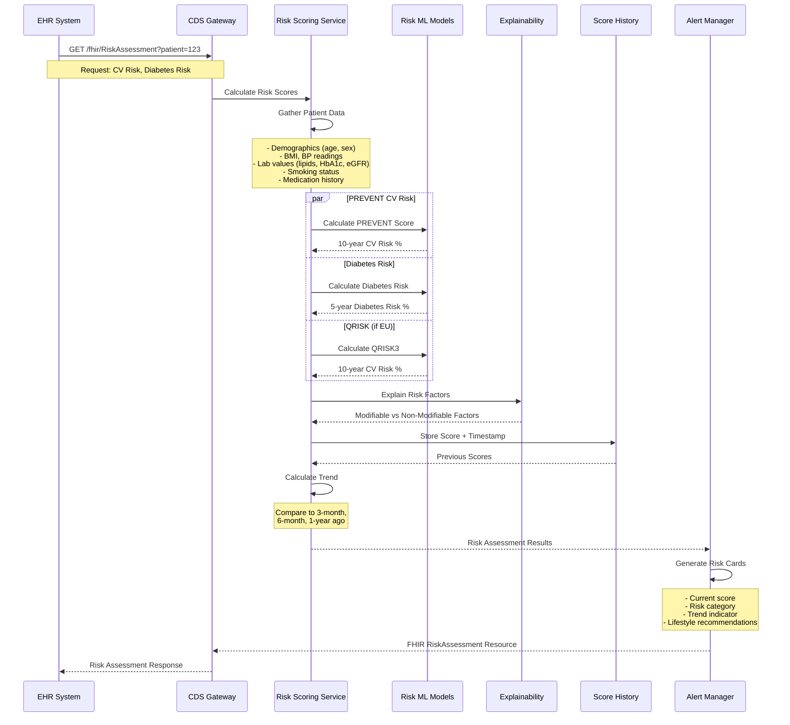
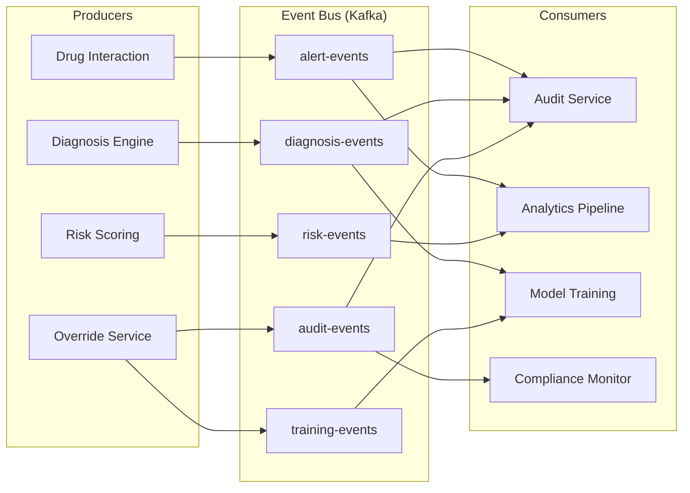
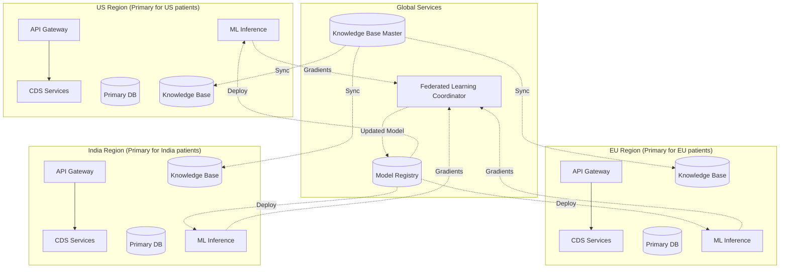

# High-Level Design

## System Architecture

```mermaid
flowchart TB
    subgraph Clients["EHR Systems"]
        Epic["Epic EHR"]
        Cerner["Oracle Cerner"]
        Meditech["MEDITECH"]
        Other["Other FHIR-Enabled EHRs"]
    end

    subgraph Gateway["API Gateway Layer"]
        CDSHooks["CDS Hooks Endpoint"]
        FHIRAPI["FHIR R4 API"]
        AdminAPI["Admin API"]
        RateLimit["Rate Limiter"]
        Auth["SMART on FHIR Auth"]
    end

    subgraph Core["Core CDS Services"]
        DDI["Drug Interaction<br/>Service"]
        Diagnosis["Diagnosis Suggestion<br/>Engine"]
        Guideline["Clinical Guideline<br/>Engine"]
        RiskScore["Risk Scoring<br/>Service"]
        AlertMgr["Alert Manager"]
        Override["Override Capture<br/>Service"]
    end

    subgraph AI["AI/ML Layer"]
        DiagnosisML["Diagnosis ML Models"]
        RiskML["Risk Prediction Models"]
        XAI["Explainability Engine<br/>(SHAP/LIME)"]
        FedLearn["Federated Learning<br/>Coordinator"]
    end

    subgraph Knowledge["Knowledge Layer"]
        DrugKB["Drug Knowledge Base<br/>(DrugBank, RxNorm, FDB)"]
        GuidelineKB["Guideline Repository<br/>(CQL Encoded)"]
        TermKB["Terminology Server<br/>(SNOMED, ICD-10, LOINC)"]
        GraphDB["Drug Interaction<br/>Knowledge Graph"]
    end

    subgraph Data["Data Layer"]
        Cache["Distributed Cache<br/>(DDI Pairs, Sessions)"]
        PrimaryDB["Primary Database<br/>(Alerts, Overrides)"]
        AuditLog["Immutable Audit Log"]
        ModelRegistry["Model Registry"]
        Analytics["Analytics Store"]
    end

    subgraph Compliance["Compliance Layer"]
        Consent["Consent Verification<br/>Service"]
        PolicyEngine["Policy Engine<br/>(OPA)"]
        AuditService["Audit Service"]
        BreachDetect["Breach Detection"]
    end

    subgraph External["External Integrations"]
        DrugDBExt["Drug Database<br/>Providers"]
        GuidelineExt["Guideline<br/>Publishers"]
        RegBody["Regulatory<br/>Reporting"]
    end

    %% Client connections
    Epic --> CDSHooks
    Cerner --> CDSHooks
    Meditech --> CDSHooks
    Other --> FHIRAPI

    %% Gateway routing
    CDSHooks --> RateLimit
    FHIRAPI --> RateLimit
    RateLimit --> Auth
    Auth --> DDI
    Auth --> Diagnosis
    Auth --> Guideline
    Auth --> RiskScore

    %% Core service connections
    DDI --> DrugKB
    DDI --> GraphDB
    DDI --> Cache
    DDI --> AlertMgr

    Diagnosis --> DiagnosisML
    Diagnosis --> XAI
    Diagnosis --> TermKB
    Diagnosis --> AlertMgr

    Guideline --> GuidelineKB
    Guideline --> AlertMgr

    RiskScore --> RiskML
    RiskScore --> XAI
    RiskScore --> AlertMgr

    AlertMgr --> Override
    Override --> AuditLog

    %% AI connections
    DiagnosisML --> ModelRegistry
    RiskML --> ModelRegistry
    FedLearn --> ModelRegistry

    %% Compliance connections
    Auth --> Consent
    Consent --> PolicyEngine
    AlertMgr --> AuditService
    AuditService --> AuditLog
    AuditService --> BreachDetect

    %% Data connections
    DDI --> PrimaryDB
    Override --> PrimaryDB
    AlertMgr --> Analytics

    %% External sync
    DrugKB -.->|Monthly Sync| DrugDBExt
    GuidelineKB -.->|As Published| GuidelineExt
    AuditService -.->|Compliance Reports| RegBody
```



---

## Data Flow Diagrams

### 1. Medication Prescribe Workflow (Primary Flow)



### 2. Diagnosis Suggestion Workflow



### 3. Risk Score Calculation Flow



---

## Key Architectural Decisions

### 1. Service Architecture

| Decision | Choice | Rationale |
|----------|--------|-----------|
| **Architecture Style** | Microservices | Independent scaling of DDI (high volume) vs Diagnosis (GPU-intensive) |
| **Communication** | Sync (CDS Hooks) + Async (Events) | Real-time alerts require sync; audit/analytics can be async |
| **Service Discovery** | DNS-based with health checks | Simple, reliable, cloud-agnostic |
| **API Protocol** | REST/JSON (CDS Hooks standard) | EHR interoperability requires CDS Hooks compliance |

### 2. Data Architecture

| Decision | Choice | Rationale |
|----------|--------|-----------|
| **Primary Database** | Relational (PostgreSQL) | ACID compliance for alert/override records |
| **Knowledge Graph** | Graph Database | Drug interactions are inherently relationship-centric |
| **Caching** | Distributed (Redis Cluster) | DDI pair caching, session management |
| **Audit Storage** | Append-only Log + Object Storage | Immutability, long-term retention |
| **Analytics** | Columnar (Time-series) | Efficient aggregation for metrics |

### 3. AI/ML Architecture

| Decision | Choice | Rationale |
|----------|--------|-----------|
| **Inference Location** | Cloud (primary) + Edge (optional) | Balance latency with privacy requirements |
| **Model Serving** | Dedicated inference cluster | GPU isolation, auto-scaling |
| **Explainability** | SHAP (global) + LIME (local) | Regulatory requirement for interpretability |
| **Training** | Federated Learning | Privacy-preserving; no raw PHI centralization |
| **Model Registry** | Versioned artifact store | PCCP compliance, rollback capability |

### 4. Integration Architecture

| Decision | Choice | Rationale |
|----------|--------|-----------|
| **EHR Integration** | CDS Hooks v2.0 | HL7 standard; Epic, Cerner, MEDITECH support |
| **Data Exchange** | FHIR R4 | Modern healthcare interoperability standard |
| **Authorization** | SMART on FHIR | OAuth 2.0 + OIDC for healthcare |
| **Guideline Encoding** | Clinical Quality Language (CQL) | HL7 standard for computable guidelines |

---

## Architecture Pattern Checklist

| Pattern | Decision | Implementation |
|---------|----------|----------------|
| **Sync vs Async** | Sync for alerts, Async for audit/analytics | CDS Hooks (sync), Kafka (async events) |
| **Event-driven vs Request-response** | Both | Request-response for CDS, Events for model training |
| **Push vs Pull** | Push for alerts, Pull for risk scores | Interruptive alerts pushed; scores on-demand |
| **Stateless vs Stateful** | Stateless services | All state in cache/DB; services scale horizontally |
| **Read-heavy vs Write-heavy** | Read-heavy (DDI checks) | Aggressive caching; read replicas |
| **Real-time vs Batch** | Real-time for alerts, Batch for analytics | Sub-200ms for DDI; hourly aggregation |
| **Edge vs Origin** | Origin primary; Edge for latency-sensitive | Optional edge deployment for large health systems |

---

## Component Responsibilities

### API Gateway Layer

```
┌─────────────────────────────────────────────────────────────────┐
│                       API GATEWAY LAYER                          │
├─────────────────────────────────────────────────────────────────┤
│                                                                 │
│  ┌─────────────────┐  ┌─────────────────┐  ┌─────────────────┐ │
│  │  CDS Hooks      │  │  FHIR R4 API    │  │  Admin API      │ │
│  │  Endpoint       │  │                 │  │                 │ │
│  ├─────────────────┤  ├─────────────────┤  ├─────────────────┤ │
│  │ • Discovery     │  │ • RiskAssess    │  │ • Model Mgmt    │ │
│  │ • med-prescribe │  │ • DeviceAlert   │  │ • KB Updates    │ │
│  │ • order-sign    │  │ • CarePlan      │  │ • Config        │ │
│  │ • patient-view  │  │ • Subscription  │  │ • Monitoring    │ │
│  │ • feedback      │  │                 │  │                 │ │
│  └─────────────────┘  └─────────────────┘  └─────────────────┘ │
│                                                                 │
│  ┌─────────────────────────────────────────────────────────┐   │
│  │                 CROSS-CUTTING CONCERNS                   │   │
│  │  • Rate Limiting (token bucket per tenant)              │   │
│  │  • SMART on FHIR Authentication                         │   │
│  │  • Request/Response Logging                             │   │
│  │  • Consent Verification (inline)                        │   │
│  │  • Request Routing                                      │   │
│  └─────────────────────────────────────────────────────────┘   │
│                                                                 │
└─────────────────────────────────────────────────────────────────┘
```

### Core CDS Services

| Service | Responsibility | Dependencies | Scaling |
|---------|---------------|--------------|---------|
| **Drug Interaction Service** | DDI detection, severity calculation, alternative suggestions | Knowledge Graph, Drug KB, Cache | Horizontal (stateless) |
| **Diagnosis Suggestion Engine** | Symptom analysis, ML inference, differential ranking | ML Models, Terminology, XAI | Horizontal + GPU |
| **Clinical Guideline Engine** | CQL execution, guideline matching, gap analysis | Guideline KB, Terminology | Horizontal |
| **Risk Scoring Service** | Risk calculations, trend analysis, lifestyle recommendations | Risk Models, History Store | Horizontal |
| **Alert Manager** | Alert formatting, severity tiering, delivery | All CDS services | Horizontal |
| **Override Capture Service** | Justification recording, feedback collection | Audit Log, Primary DB | Horizontal |

### Knowledge Layer

```
┌─────────────────────────────────────────────────────────────────┐
│                      KNOWLEDGE LAYER                             │
├─────────────────────────────────────────────────────────────────┤
│                                                                 │
│  ┌─────────────────────────────────────────────────────────┐   │
│  │              DRUG KNOWLEDGE BASE                         │   │
│  │  Sources: DrugBank, RxNorm, First Databank               │   │
│  │  ─────────────────────────────────────────────────────   │   │
│  │  • Drug metadata (names, ingredients, classes)          │   │
│  │  • DDI pairs with severity and evidence                 │   │
│  │  • Drug-condition contraindications                     │   │
│  │  • Dosing adjustments (renal, hepatic)                  │   │
│  │  • Alternative medications                               │   │
│  │  Update: Monthly sync + real-time critical alerts       │   │
│  └─────────────────────────────────────────────────────────┘   │
│                                                                 │
│  ┌─────────────────────────────────────────────────────────┐   │
│  │            DRUG INTERACTION KNOWLEDGE GRAPH              │   │
│  │  Model: Neo4j-style property graph                       │   │
│  │  ─────────────────────────────────────────────────────   │   │
│  │  Nodes: Drug, Ingredient, DrugClass, Condition          │   │
│  │  Edges: INTERACTS_WITH, CONTAINS, CONTRAINDICATED_IN    │   │
│  │  Properties: severity, mechanism, evidence_level        │   │
│  │  Queries: Multi-hop for novel combinations              │   │
│  └─────────────────────────────────────────────────────────┘   │
│                                                                 │
│  ┌─────────────────────────────────────────────────────────┐   │
│  │             CLINICAL GUIDELINE REPOSITORY                │   │
│  │  Format: CQL (Clinical Quality Language) encoded         │   │
│  │  ─────────────────────────────────────────────────────   │   │
│  │  • ADA Standards of Care (Diabetes)                     │   │
│  │  • WHO Clinical Protocols                               │   │
│  │  • ICMR Guidelines (India)                              │   │
│  │  • ESC Recommendations (Cardiology)                     │   │
│  │  • USPSTF Preventive Services                           │   │
│  │  Update: As published by guideline bodies               │   │
│  └─────────────────────────────────────────────────────────┘   │
│                                                                 │
│  ┌─────────────────────────────────────────────────────────┐   │
│  │              TERMINOLOGY SERVER                          │   │
│  │  Standards: SNOMED CT, ICD-10, RxNorm, LOINC            │   │
│  │  ─────────────────────────────────────────────────────   │   │
│  │  • Concept lookup and validation                        │   │
│  │  • Hierarchical traversal (is-a relationships)          │   │
│  │  • Cross-terminology mapping                            │   │
│  │  • Synonym resolution                                   │   │
│  │  Update: Per terminology release schedule               │   │
│  └─────────────────────────────────────────────────────────┘   │
│                                                                 │
└─────────────────────────────────────────────────────────────────┘
```

---

## Event-Driven Architecture

### Event Types

| Event | Producer | Consumers | Retention |
|-------|----------|-----------|-----------|
| `alert.generated` | Alert Manager | Audit Service, Analytics | 30 days |
| `alert.delivered` | API Gateway | Audit Service | 30 days |
| `alert.overridden` | Override Service | Audit Service, Model Training | 1 year |
| `diagnosis.suggested` | Diagnosis Engine | Audit Service, Analytics | 30 days |
| `diagnosis.selected` | Feedback Handler | Model Training | 1 year |
| `risk.calculated` | Risk Service | History Store, Analytics | 30 days |
| `model.deployed` | Model Registry | All ML Services | Indefinite |
| `kb.updated` | KB Sync Service | All CDS Services | 7 days |

### Event Flow



---

## Caching Strategy

### Cache Layers

```
┌─────────────────────────────────────────────────────────────────┐
│                       CACHING ARCHITECTURE                       │
├─────────────────────────────────────────────────────────────────┤
│                                                                 │
│  ┌─────────────────────────────────────────────────────────┐   │
│  │  L1: IN-PROCESS CACHE (per service instance)            │   │
│  │  ─────────────────────────────────────────────────────  │   │
│  │  • Hot DDI pairs (top 10K by frequency)                 │   │
│  │  • Active session tokens                                │   │
│  │  • Compiled CQL rules                                   │   │
│  │  TTL: 5 minutes | Size: 100MB per instance             │   │
│  └─────────────────────────────────────────────────────────┘   │
│                           │                                     │
│                           ▼                                     │
│  ┌─────────────────────────────────────────────────────────┐   │
│  │  L2: DISTRIBUTED CACHE (Redis Cluster)                  │   │
│  │  ─────────────────────────────────────────────────────  │   │
│  │  • All DDI pairs (500K)                                 │   │
│  │  • Patient consent decisions                            │   │
│  │  • Recent risk scores                                   │   │
│  │  • ML model feature vectors                             │   │
│  │  TTL: 1 hour (DDI), 5 min (consent) | Size: 5GB        │   │
│  └─────────────────────────────────────────────────────────┘   │
│                           │                                     │
│                           ▼                                     │
│  ┌─────────────────────────────────────────────────────────┐   │
│  │  L3: KNOWLEDGE BASE (Read Replicas)                     │   │
│  │  ─────────────────────────────────────────────────────  │   │
│  │  • Full drug database                                   │   │
│  │  • Complete knowledge graph                             │   │
│  │  • All terminology mappings                             │   │
│  │  Sync: Async from primary | Size: 20GB                 │   │
│  └─────────────────────────────────────────────────────────┘   │
│                                                                 │
└─────────────────────────────────────────────────────────────────┘
```

### Cache Invalidation Strategy

| Cache | Invalidation Trigger | Strategy |
|-------|---------------------|----------|
| DDI Pairs | KB update event | Publish invalidation event; lazy refresh |
| Consent | Consent change event | Immediate invalidation; query on miss |
| Risk Scores | New lab results | TTL-based (scores valid for 24h) |
| CQL Rules | Guideline update | Full cache clear; warm on startup |
| Session Tokens | Token refresh/revoke | Immediate invalidation |

---

## Multi-Region Deployment



### Data Residency Rules

| Patient Location | Primary Region | DR Region | Cross-Border Rules |
|-----------------|----------------|-----------|-------------------|
| United States | US-East | US-West | HIPAA BAA required |
| European Union | EU-West | EU-North | GDPR; SCCs for transfers |
| United Kingdom | UK-London | EU-West | UK GDPR + DPA |
| India | IN-Mumbai | IN-Delhi | DPDP Act; in-country preferred |
| Australia | AU-Sydney | AU-Melbourne | Privacy Act 1988 |

---

## Technology Stack Summary

| Layer | Technology | Justification |
|-------|------------|---------------|
| **API Gateway** | Kong / Envoy | CDS Hooks routing, SMART auth, rate limiting |
| **Service Runtime** | Containerized (Kubernetes) | Horizontal scaling, isolation |
| **Primary Database** | PostgreSQL | ACID, JSON support, mature ecosystem |
| **Knowledge Graph** | Neo4j / Amazon Neptune | Relationship-centric DDI queries |
| **Cache** | Redis Cluster | DDI pair caching, session management |
| **Message Queue** | Kafka | Event streaming, audit events |
| **ML Inference** | TensorFlow Serving / Triton | GPU acceleration, model versioning |
| **Terminology Server** | HAPI FHIR Server | FHIR-native terminology operations |
| **Observability** | OpenTelemetry + Prometheus + Grafana | Distributed tracing, metrics |
| **Audit Storage** | Object Storage + Time-series DB | Immutable logs, compliance |
