# Low-Level Design

## Data Model

### Entity Relationship Diagram

```mermaid
erDiagram
    DRUG ||--o{ DRUG_INGREDIENT : contains
    DRUG ||--o{ DRUG_CLASS : belongs_to
    DRUG_INGREDIENT ||--o{ DDI_PAIR : interacts
    DRUG_CLASS ||--o{ CLASS_INTERACTION : interacts
    DRUG ||--o{ DRUG_CONDITION_CONTRA : contraindicated_in

    PATIENT ||--o{ PATIENT_MEDICATION : takes
    PATIENT ||--o{ PATIENT_CONDITION : has
    PATIENT ||--o{ PATIENT_ALLERGY : allergic_to
    PATIENT ||--o{ CLINICAL_ALERT : receives
    PATIENT ||--o{ RISK_ASSESSMENT : assessed_for

    CLINICAL_ALERT ||--o{ ALERT_OVERRIDE : overridden_by
    CLINICAL_ALERT }o--|| ALERT_TYPE : categorized_as

    GUIDELINE ||--o{ GUIDELINE_RULE : contains
    GUIDELINE_RULE ||--o{ GUIDELINE_RECOMMENDATION : produces

    DIAGNOSIS_SUGGESTION ||--o{ CONTRIBUTING_FACTOR : explained_by
    DIAGNOSIS_SUGGESTION }o--|| PATIENT : suggested_for

    ML_MODEL ||--o{ MODEL_VERSION : versioned_as
    MODEL_VERSION ||--o{ MODEL_DEPLOYMENT : deployed_to

    DRUG {
        uuid drug_id PK
        string rxcui UK "RxNorm Concept ID"
        string ndc "National Drug Code"
        string name
        string generic_name
        string brand_name
        string[] ingredients
        string[] drug_classes
        jsonb dosage_forms
        jsonb strengths
        boolean active
        timestamp created_at
        timestamp updated_at
    }

    DRUG_INGREDIENT {
        uuid ingredient_id PK
        uuid drug_id FK
        string rxcui
        string name
        decimal concentration
        string unit
    }

    DDI_PAIR {
        uuid ddi_id PK
        uuid drug_a_ingredient FK
        uuid drug_b_ingredient FK
        enum severity "critical|high|moderate|low"
        string mechanism
        string clinical_effect
        string management
        string[] evidence_sources
        integer evidence_level "1-5"
        boolean active
        timestamp effective_date
    }

    DRUG_CONDITION_CONTRA {
        uuid contra_id PK
        uuid drug_id FK
        string condition_code "ICD-10"
        string condition_name
        enum severity "absolute|relative"
        string rationale
        string[] alternatives
    }

    PATIENT {
        uuid patient_id PK
        string mrn UK "Medical Record Number"
        date date_of_birth
        enum sex
        decimal weight_kg
        decimal height_cm
        decimal bmi
        decimal egfr "Estimated GFR"
        decimal creatinine
        boolean pregnant
        boolean lactating
        string[] active_conditions
        timestamp last_updated
    }

    PATIENT_MEDICATION {
        uuid med_id PK
        uuid patient_id FK
        uuid drug_id FK
        string dose
        string frequency
        string route
        date start_date
        date end_date
        enum status "active|discontinued|on-hold"
        uuid prescriber_id
    }

    CLINICAL_ALERT {
        uuid alert_id PK
        uuid patient_id FK
        uuid encounter_id
        enum alert_type "ddi|diagnosis|guideline|risk"
        enum severity "critical|high|moderate|low"
        string title
        text description
        jsonb context
        jsonb evidence
        jsonb recommendations
        decimal confidence_score
        enum status "active|acknowledged|overridden|dismissed"
        timestamp generated_at
        timestamp delivered_at
        uuid generated_by_model FK
    }

    ALERT_OVERRIDE {
        uuid override_id PK
        uuid alert_id FK
        uuid clinician_id
        enum override_reason_code
        text override_justification
        text alternative_action
        timestamp override_at
        boolean pharmacy_reviewed
        uuid pharmacy_reviewer_id
        timestamp pharmacy_review_at
    }

    RISK_ASSESSMENT {
        uuid assessment_id PK
        uuid patient_id FK
        enum risk_type "cv_prevent|cv_qrisk|diabetes|hypertension|ckd"
        decimal risk_score
        enum risk_category "low|moderate|high|very_high"
        jsonb input_parameters
        jsonb contributing_factors
        jsonb recommendations
        uuid model_version_id FK
        timestamp calculated_at
        timestamp valid_until
    }

    DIAGNOSIS_SUGGESTION {
        uuid suggestion_id PK
        uuid patient_id FK
        uuid encounter_id
        string icd10_code
        string diagnosis_name
        decimal confidence_score
        integer rank
        jsonb input_features
        jsonb shap_values
        enum status "suggested|selected|rejected"
        uuid model_version_id FK
        timestamp suggested_at
    }

    CONTRIBUTING_FACTOR {
        uuid factor_id PK
        uuid suggestion_id FK
        string feature_name
        string feature_value
        decimal shap_contribution
        enum direction "positive|negative"
    }

    GUIDELINE {
        uuid guideline_id PK
        string code UK
        string name
        string publisher "ADA|WHO|ICMR|ESC"
        string version
        date effective_date
        date expiration_date
        text cql_definition
        boolean active
    }

    GUIDELINE_RULE {
        uuid rule_id PK
        uuid guideline_id FK
        string rule_name
        text condition_expression
        text action_expression
        integer priority
    }

    ML_MODEL {
        uuid model_id PK
        string model_name UK
        enum model_type "diagnosis|risk|severity"
        text description
        jsonb input_schema
        jsonb output_schema
    }

    MODEL_VERSION {
        uuid version_id PK
        uuid model_id FK
        string version_tag
        string artifact_path
        jsonb training_metadata
        jsonb performance_metrics
        enum status "training|validating|staged|production|deprecated"
        timestamp created_at
        uuid approved_by
        timestamp approved_at
    }
```



---

## Schema Details

### Drug Interaction Tables

```sql
-- Drug Interaction Severity Levels
CREATE TYPE ddi_severity AS ENUM ('critical', 'high', 'moderate', 'low');

-- Main DDI pair table with evidence
CREATE TABLE ddi_pairs (
    ddi_id UUID PRIMARY KEY DEFAULT gen_random_uuid(),
    drug_a_rxcui VARCHAR(20) NOT NULL,
    drug_b_rxcui VARCHAR(20) NOT NULL,
    severity ddi_severity NOT NULL,
    mechanism TEXT,
    clinical_effect TEXT NOT NULL,
    management TEXT,
    onset VARCHAR(50), -- 'rapid', 'delayed', 'variable'
    evidence_level INTEGER CHECK (evidence_level BETWEEN 1 AND 5),
    evidence_sources TEXT[],
    documentation_level VARCHAR(20), -- 'excellent', 'good', 'fair'
    source_database VARCHAR(50) NOT NULL, -- 'drugbank', 'fdb', 'rxnorm'
    active BOOLEAN DEFAULT TRUE,
    effective_date DATE NOT NULL,
    created_at TIMESTAMPTZ DEFAULT NOW(),
    updated_at TIMESTAMPTZ DEFAULT NOW(),

    UNIQUE(drug_a_rxcui, drug_b_rxcui, source_database),
    CHECK (drug_a_rxcui < drug_b_rxcui) -- Canonical ordering
);

-- Index for fast lookup
CREATE INDEX idx_ddi_drug_a ON ddi_pairs(drug_a_rxcui) WHERE active = TRUE;
CREATE INDEX idx_ddi_drug_b ON ddi_pairs(drug_b_rxcui) WHERE active = TRUE;
CREATE INDEX idx_ddi_severity ON ddi_pairs(severity) WHERE active = TRUE;

-- Drug class level interactions
CREATE TABLE class_interactions (
    class_interaction_id UUID PRIMARY KEY DEFAULT gen_random_uuid(),
    class_a_code VARCHAR(50) NOT NULL, -- ATC code or similar
    class_b_code VARCHAR(50) NOT NULL,
    severity ddi_severity NOT NULL,
    mechanism TEXT,
    clinical_significance TEXT,
    management TEXT,
    active BOOLEAN DEFAULT TRUE,

    UNIQUE(class_a_code, class_b_code)
);
```

### Clinical Alert Tables

```sql
-- Alert types
CREATE TYPE alert_type AS ENUM ('ddi', 'diagnosis', 'guideline', 'risk', 'allergy', 'duplicate_therapy');
CREATE TYPE alert_severity AS ENUM ('critical', 'high', 'moderate', 'low', 'info');
CREATE TYPE alert_status AS ENUM ('active', 'acknowledged', 'overridden', 'dismissed', 'expired');

-- Main alerts table (partitioned by month for performance)
CREATE TABLE clinical_alerts (
    alert_id UUID NOT NULL,
    tenant_id UUID NOT NULL,
    patient_id UUID NOT NULL,
    encounter_id UUID,
    alert_type alert_type NOT NULL,
    severity alert_severity NOT NULL,
    title VARCHAR(255) NOT NULL,
    description TEXT,
    context JSONB NOT NULL, -- Trigger context (medications, symptoms, etc.)
    evidence JSONB, -- Supporting evidence and citations
    recommendations JSONB, -- Suggested actions
    confidence_score DECIMAL(5,4), -- 0.0000 to 1.0000
    model_version_id UUID,
    status alert_status DEFAULT 'active',
    generated_at TIMESTAMPTZ NOT NULL DEFAULT NOW(),
    delivered_at TIMESTAMPTZ,
    acknowledged_at TIMESTAMPTZ,
    acknowledged_by UUID,

    PRIMARY KEY (alert_id, generated_at)
) PARTITION BY RANGE (generated_at);

-- Create monthly partitions
CREATE TABLE clinical_alerts_2025_01 PARTITION OF clinical_alerts
    FOR VALUES FROM ('2025-01-01') TO ('2025-02-01');

-- Indexes
CREATE INDEX idx_alerts_patient ON clinical_alerts(patient_id, generated_at DESC);
CREATE INDEX idx_alerts_encounter ON clinical_alerts(encounter_id) WHERE encounter_id IS NOT NULL;
CREATE INDEX idx_alerts_status ON clinical_alerts(status) WHERE status = 'active';
CREATE INDEX idx_alerts_severity ON clinical_alerts(severity, generated_at DESC);

-- Override tracking
CREATE TYPE override_reason AS ENUM (
    'patient_tolerated_previously',
    'benefit_outweighs_risk',
    'alternative_unavailable',
    'dose_adjusted',
    'monitoring_in_place',
    'patient_informed_consent',
    'emergency_situation',
    'other'
);

CREATE TABLE alert_overrides (
    override_id UUID PRIMARY KEY DEFAULT gen_random_uuid(),
    alert_id UUID NOT NULL,
    alert_generated_at TIMESTAMPTZ NOT NULL, -- For partition routing
    clinician_id UUID NOT NULL,
    clinician_role VARCHAR(50),
    override_reason override_reason NOT NULL,
    custom_justification TEXT,
    alternative_action TEXT,
    override_at TIMESTAMPTZ DEFAULT NOW(),

    -- Pharmacy review for critical overrides
    pharmacy_review_required BOOLEAN DEFAULT FALSE,
    pharmacy_reviewer_id UUID,
    pharmacy_review_at TIMESTAMPTZ,
    pharmacy_review_notes TEXT,

    -- Audit chain
    previous_hash VARCHAR(64),
    current_hash VARCHAR(64) NOT NULL,

    FOREIGN KEY (alert_id, alert_generated_at)
        REFERENCES clinical_alerts(alert_id, generated_at)
);

CREATE INDEX idx_overrides_alert ON alert_overrides(alert_id);
CREATE INDEX idx_overrides_clinician ON alert_overrides(clinician_id, override_at DESC);
```

### Risk Assessment Tables

```sql
CREATE TYPE risk_type AS ENUM (
    'cv_prevent', 'cv_qrisk3', 'cv_ascvd',
    'diabetes_findrisc', 'diabetes_ada',
    'hypertension', 'ckd_progression',
    'readmission_30day'
);

CREATE TYPE risk_category AS ENUM ('low', 'moderate', 'high', 'very_high');

CREATE TABLE risk_assessments (
    assessment_id UUID PRIMARY KEY DEFAULT gen_random_uuid(),
    tenant_id UUID NOT NULL,
    patient_id UUID NOT NULL,
    encounter_id UUID,
    risk_type risk_type NOT NULL,

    -- Score and category
    risk_score DECIMAL(6,4) NOT NULL, -- Percentage or probability
    risk_category risk_category NOT NULL,

    -- Input parameters (for reproducibility)
    input_parameters JSONB NOT NULL,

    -- Explanation
    contributing_factors JSONB, -- Factor name, value, contribution
    modifiable_factors JSONB, -- Factors patient can change
    non_modifiable_factors JSONB,

    -- Recommendations
    recommendations JSONB,

    -- Model tracking
    model_version_id UUID NOT NULL,

    -- Timestamps
    calculated_at TIMESTAMPTZ DEFAULT NOW(),
    valid_until TIMESTAMPTZ, -- Score validity period

    -- Trend tracking
    previous_score DECIMAL(6,4),
    previous_calculated_at TIMESTAMPTZ,
    trend_direction VARCHAR(10) -- 'improving', 'worsening', 'stable'
);

CREATE INDEX idx_risk_patient ON risk_assessments(patient_id, calculated_at DESC);
CREATE INDEX idx_risk_type ON risk_assessments(risk_type, calculated_at DESC);
```

---

## API Design

### CDS Hooks Endpoints

#### Discovery Endpoint

```
GET /cds-services
```

**Response:**
```json
{
  "services": [
    {
      "hook": "medication-prescribe",
      "id": "drug-interaction-check",
      "title": "Drug Interaction Checker",
      "description": "Checks for drug-drug, drug-condition, and drug-allergy interactions",
      "prefetch": {
        "patient": "Patient/{{context.patientId}}",
        "medications": "MedicationRequest?patient={{context.patientId}}&status=active",
        "conditions": "Condition?patient={{context.patientId}}&clinical-status=active",
        "allergies": "AllergyIntolerance?patient={{context.patientId}}"
      }
    },
    {
      "hook": "patient-view",
      "id": "diagnosis-suggestion",
      "title": "Diagnosis Suggestion Engine",
      "description": "Suggests possible diagnoses based on symptoms and vitals",
      "prefetch": {
        "patient": "Patient/{{context.patientId}}",
        "observations": "Observation?patient={{context.patientId}}&date=ge{{today-7d}}",
        "conditions": "Condition?patient={{context.patientId}}"
      }
    },
    {
      "hook": "patient-view",
      "id": "risk-assessment",
      "title": "Predictive Risk Scoring",
      "description": "Calculates cardiovascular, diabetes, and other risk scores",
      "prefetch": {
        "patient": "Patient/{{context.patientId}}",
        "observations": "Observation?patient={{context.patientId}}&code=85354-9,8480-6,8462-4,29463-7,39156-5,2093-3,2085-9,4548-4",
        "medications": "MedicationRequest?patient={{context.patientId}}&status=active"
      }
    }
  ]
}
```

#### Drug Interaction Check

```
POST /cds-services/drug-interaction-check
Content-Type: application/json
Authorization: Bearer <SMART_token>
```

**Request:**
```json
{
  "hookInstance": "d1577c69-dfbe-44ad-ba6d-3e05e953b2ea",
  "hook": "medication-prescribe",
  "fhirServer": "https://ehr.example.com/fhir",
  "fhirAuthorization": {
    "access_token": "...",
    "token_type": "Bearer",
    "expires_in": 3600,
    "scope": "patient/*.read"
  },
  "context": {
    "userId": "Practitioner/123",
    "patientId": "Patient/456",
    "encounterId": "Encounter/789",
    "draftOrders": {
      "resourceType": "Bundle",
      "entry": [
        {
          "resource": {
            "resourceType": "MedicationRequest",
            "medicationCodeableConcept": {
              "coding": [
                {
                  "system": "http://www.nlm.nih.gov/research/umls/rxnorm",
                  "code": "197361",
                  "display": "Warfarin 5 MG Oral Tablet"
                }
              ]
            },
            "dosageInstruction": [
              {
                "timing": {
                  "repeat": {
                    "frequency": 1,
                    "period": 1,
                    "periodUnit": "d"
                  }
                },
                "doseAndRate": [
                  {
                    "doseQuantity": {
                      "value": 5,
                      "unit": "mg"
                    }
                  }
                ]
              }
            ]
          }
        }
      ]
    }
  },
  "prefetch": {
    "patient": {
      "resourceType": "Patient",
      "id": "456",
      "birthDate": "1955-03-15",
      "gender": "male"
    },
    "medications": {
      "resourceType": "Bundle",
      "entry": [
        {
          "resource": {
            "resourceType": "MedicationRequest",
            "medicationCodeableConcept": {
              "coding": [
                {
                  "system": "http://www.nlm.nih.gov/research/umls/rxnorm",
                  "code": "310965",
                  "display": "Ibuprofen 400 MG Oral Tablet"
                }
              ]
            },
            "status": "active"
          }
        }
      ]
    }
  }
}
```

**Response (Critical Interaction Detected):**
```json
{
  "cards": [
    {
      "uuid": "card-12345",
      "summary": "Critical Drug Interaction: Warfarin + Ibuprofen",
      "detail": "NSAIDs increase anticoagulant effect of warfarin and risk of GI bleeding. This combination has caused fatal bleeding events.",
      "indicator": "critical",
      "source": {
        "label": "Drug Interaction Knowledge Base",
        "url": "https://cds.example.com/evidence/ddi/warfarin-nsaid",
        "icon": "https://cds.example.com/icons/ddi.png"
      },
      "suggestions": [
        {
          "label": "Consider Acetaminophen instead",
          "uuid": "suggestion-1",
          "isRecommended": true,
          "actions": [
            {
              "type": "create",
              "description": "Order Acetaminophen 650mg q6h PRN",
              "resource": {
                "resourceType": "MedicationRequest",
                "medicationCodeableConcept": {
                  "coding": [
                    {
                      "system": "http://www.nlm.nih.gov/research/umls/rxnorm",
                      "code": "313782",
                      "display": "Acetaminophen 650 MG Oral Tablet"
                    }
                  ]
                }
              }
            },
            {
              "type": "delete",
              "description": "Remove Ibuprofen from current medications",
              "resourceId": "MedicationRequest/ibu-123"
            }
          ]
        },
        {
          "label": "Continue with close INR monitoring",
          "uuid": "suggestion-2",
          "actions": [
            {
              "type": "create",
              "description": "Order INR check in 3 days",
              "resource": {
                "resourceType": "ServiceRequest",
                "code": {
                  "coding": [
                    {
                      "system": "http://loinc.org",
                      "code": "6301-6",
                      "display": "INR"
                    }
                  ]
                }
              }
            }
          ]
        }
      ],
      "links": [
        {
          "label": "View evidence summary",
          "url": "https://cds.example.com/evidence/warfarin-nsaid",
          "type": "absolute"
        }
      ],
      "overrideReasons": [
        {
          "code": "patient-tolerated",
          "display": "Patient has tolerated this combination previously"
        },
        {
          "code": "benefit-outweighs-risk",
          "display": "Clinical benefit outweighs interaction risk"
        },
        {
          "code": "monitoring-in-place",
          "display": "Enhanced monitoring protocol in place"
        }
      ]
    }
  ]
}
```

### FHIR R4 Endpoints

#### Create/Query RiskAssessment

```
POST /fhir/RiskAssessment
Content-Type: application/fhir+json
```

**Request:**
```json
{
  "resourceType": "RiskAssessment",
  "status": "final",
  "subject": {
    "reference": "Patient/456"
  },
  "encounter": {
    "reference": "Encounter/789"
  },
  "occurrenceDateTime": "2025-01-23T10:30:00Z",
  "method": {
    "coding": [
      {
        "system": "https://cds.example.com/risk-models",
        "code": "prevent-cv-2024",
        "display": "PREVENT 10-Year CV Risk Calculator"
      }
    ]
  },
  "basis": [
    {
      "reference": "Observation/bp-123"
    },
    {
      "reference": "Observation/lipid-456"
    }
  ],
  "prediction": [
    {
      "outcome": {
        "coding": [
          {
            "system": "http://snomed.info/sct",
            "code": "22298006",
            "display": "Myocardial infarction"
          }
        ]
      },
      "probabilityDecimal": 0.082,
      "whenRange": {
        "low": {
          "value": 0,
          "unit": "years"
        },
        "high": {
          "value": 10,
          "unit": "years"
        }
      },
      "qualitativeRisk": {
        "coding": [
          {
            "system": "https://cds.example.com/risk-categories",
            "code": "moderate",
            "display": "Moderate Risk (5-10%)"
          }
        ]
      }
    }
  ],
  "note": [
    {
      "text": "Modifiable factors: LDL cholesterol (130 mg/dL), systolic BP (142 mmHg), smoking status"
    }
  ]
}
```

#### DeviceAlert for Clinical Alerts

```
GET /fhir/DeviceAlert?patient=Patient/456&status=active
```

**Response:**
```json
{
  "resourceType": "Bundle",
  "type": "searchset",
  "total": 2,
  "entry": [
    {
      "resource": {
        "resourceType": "DeviceAlert",
        "id": "alert-789",
        "status": "active",
        "type": {
          "coding": [
            {
              "system": "https://cds.example.com/alert-types",
              "code": "drug-interaction",
              "display": "Drug-Drug Interaction"
            }
          ]
        },
        "priority": "critical",
        "subject": {
          "reference": "Patient/456"
        },
        "condition": [
          {
            "coding": [
              {
                "system": "https://cds.example.com/ddi-codes",
                "code": "warfarin-nsaid",
                "display": "Warfarin-NSAID Interaction"
              }
            ]
          }
        ],
        "text": {
          "status": "generated",
          "div": "<div>Critical: Warfarin + Ibuprofen increases bleeding risk</div>"
        }
      }
    }
  ]
}
```

---

## Core Algorithms

### 1. Multi-Level Drug Interaction Detection

```
ALGORITHM: MultiLevelDDIDetection

INPUT:
  - draft_medication: Medication being prescribed
  - current_medications: List of active medications
  - patient: Patient demographics and clinical context

OUTPUT:
  - interactions: List of detected interactions with severity

FUNCTION detect_interactions(draft_medication, current_medications, patient):
    interactions = []

    // Step 1: Normalize medications to RxNorm
    draft_rxcui = normalize_to_rxcui(draft_medication)
    draft_ingredients = get_ingredients(draft_rxcui)
    draft_classes = get_drug_classes(draft_rxcui)

    FOR EACH current_med IN current_medications:
        current_rxcui = normalize_to_rxcui(current_med)
        current_ingredients = get_ingredients(current_rxcui)
        current_classes = get_drug_classes(current_rxcui)

        // Step 2: Check ingredient-level interactions (most specific)
        FOR EACH draft_ing IN draft_ingredients:
            FOR EACH current_ing IN current_ingredients:
                pair = canonical_pair(draft_ing, current_ing)

                // Check cache first
                cached = cache.get(pair)
                IF cached:
                    interactions.append(cached)
                    CONTINUE

                // Query knowledge base
                ddi = knowledge_base.query_ddi(pair)
                IF ddi EXISTS:
                    interactions.append(ddi)
                    cache.set(pair, ddi, TTL=1_HOUR)

        // Step 3: Check class-level interactions (if no ingredient match)
        IF NOT has_ingredient_interaction(draft_rxcui, current_rxcui):
            FOR EACH draft_class IN draft_classes:
                FOR EACH current_class IN current_classes:
                    class_ddi = knowledge_base.query_class_interaction(
                        draft_class, current_class
                    )
                    IF class_ddi EXISTS:
                        interactions.append(class_ddi)

    // Step 4: Check drug-condition contraindications
    FOR EACH condition IN patient.active_conditions:
        contra = knowledge_base.query_contraindication(
            draft_rxcui, condition.icd10_code
        )
        IF contra EXISTS:
            interactions.append({
                type: "drug-condition",
                severity: contra.severity,
                condition: condition,
                rationale: contra.rationale
            })

    // Step 5: Adjust severity based on patient context
    FOR EACH interaction IN interactions:
        interaction.adjusted_severity = adjust_severity(
            interaction.base_severity,
            patient
        )

    // Step 6: De-duplicate and rank by severity
    interactions = deduplicate(interactions)
    interactions = sort_by_severity(interactions)

    RETURN interactions

FUNCTION adjust_severity(base_severity, patient):
    severity_score = base_severity.numeric_value

    // Age adjustment
    IF patient.age > 65:
        severity_score = severity_score * 1.2  // 20% increase

    // Renal function adjustment
    IF patient.egfr < 30:  // Severe CKD
        severity_score = severity_score * 1.5
    ELSE IF patient.egfr < 60:  // Moderate CKD
        severity_score = severity_score * 1.2

    // Hepatic function adjustment
    IF patient.has_hepatic_impairment:
        severity_score = severity_score * 1.3

    // Pregnancy adjustment
    IF patient.pregnant:
        severity_score = severity_score * 1.5

    // Convert back to severity level
    RETURN numeric_to_severity(severity_score)

FUNCTION canonical_pair(rxcui_a, rxcui_b):
    // Ensure consistent ordering for cache key
    IF rxcui_a < rxcui_b:
        RETURN (rxcui_a, rxcui_b)
    ELSE:
        RETURN (rxcui_b, rxcui_a)
```

**Time Complexity:** O(n × m × k) where n = draft ingredients, m = current medications, k = ingredients per medication
**Space Complexity:** O(i) where i = number of interactions found

### 2. Diagnosis Suggestion with Explainability

```
ALGORITHM: DiagnosisSuggestionWithXAI

INPUT:
  - symptoms: List of symptom codes (SNOMED CT)
  - vitals: Dictionary of vital sign readings
  - lab_results: List of lab observations (LOINC coded)
  - demographics: Patient age, sex, etc.

OUTPUT:
  - suggestions: Ranked list of diagnoses with confidence and explanations

FUNCTION suggest_diagnoses(symptoms, vitals, lab_results, demographics):
    // Step 1: Feature engineering
    features = {}

    // Encode symptoms as multi-hot vector
    symptom_vector = encode_symptoms(symptoms, SYMPTOM_VOCAB)
    features.merge(symptom_vector)

    // Normalize vitals
    vital_features = {
        "bp_systolic_normalized": normalize(vitals.systolic, 90, 180),
        "bp_diastolic_normalized": normalize(vitals.diastolic, 60, 120),
        "heart_rate_normalized": normalize(vitals.heart_rate, 40, 150),
        "temperature_normalized": normalize(vitals.temperature, 35, 42),
        "spo2_normalized": normalize(vitals.spo2, 70, 100),
        "respiratory_rate_normalized": normalize(vitals.resp_rate, 8, 40)
    }
    features.merge(vital_features)

    // Encode lab results
    lab_features = encode_lab_results(lab_results, LAB_REFERENCE_RANGES)
    features.merge(lab_features)

    // Demographics
    demo_features = {
        "age_bucket": bucket_age(demographics.age),
        "sex_encoded": one_hot(demographics.sex)
    }
    features.merge(demo_features)

    // Step 2: Run ensemble inference
    feature_vector = vectorize(features)

    model_outputs = []
    FOR EACH model IN ENSEMBLE_MODELS:
        output = model.predict_proba(feature_vector)
        model_outputs.append(output)

    // Weighted ensemble
    combined_probs = weighted_average(model_outputs, MODEL_WEIGHTS)

    // Step 3: Get top-N diagnoses
    top_diagnoses = top_k(combined_probs, k=10)

    // Step 4: Generate explanations
    suggestions = []
    FOR EACH (diagnosis_code, probability) IN top_diagnoses:
        // Calculate SHAP values for this prediction
        shap_values = explainer.shap_values(
            feature_vector,
            target_class=diagnosis_code
        )

        // Extract top contributing factors
        contributions = []
        FOR EACH (feature_name, shap_value) IN sorted_by_abs(shap_values):
            IF len(contributions) >= 5:
                BREAK

            contributions.append({
                "feature": feature_name,
                "value": features[feature_name],
                "contribution": shap_value,
                "direction": "positive" IF shap_value > 0 ELSE "negative",
                "human_readable": humanize_feature(feature_name, features[feature_name])
            })

        // Map to ICD-10 and get diagnosis details
        icd10 = map_to_icd10(diagnosis_code)

        suggestions.append({
            "diagnosis_code": diagnosis_code,
            "icd10_code": icd10.code,
            "diagnosis_name": icd10.display,
            "confidence": probability,
            "rank": len(suggestions) + 1,
            "contributing_factors": contributions,
            "recommended_tests": get_confirmatory_tests(diagnosis_code),
            "differential_notes": get_differential_notes(diagnosis_code, symptoms)
        })

    // Step 5: Calibrate confidence scores
    suggestions = calibrate_confidence(suggestions)

    RETURN suggestions

FUNCTION calibrate_confidence(suggestions):
    // Apply isotonic regression calibration
    calibrator = load_calibration_model()

    FOR EACH suggestion IN suggestions:
        raw_conf = suggestion.confidence
        calibrated = calibrator.transform(raw_conf)
        suggestion.confidence = calibrated
        suggestion.raw_confidence = raw_conf

    RETURN suggestions
```

**Time Complexity:** O(m × f × c) where m = models, f = features, c = diagnosis classes
**Space Complexity:** O(f + c) for feature vector and output probabilities

### 3. Alert Severity Calculation

```
ALGORITHM: AlertSeverityCalculation

INPUT:
  - base_severity: Severity from knowledge base (critical/high/moderate/low)
  - interaction_type: Type of interaction (ddi/contraindication/allergy)
  - patient_context: Patient clinical data
  - medication_context: Dose, route, frequency

OUTPUT:
  - final_severity: Adjusted severity level
  - display_mode: interruptive|passive|info
  - override_requirements: List of required override steps

FUNCTION calculate_alert_severity(
    base_severity, interaction_type, patient_context, medication_context
):
    // Initialize score from base severity
    severity_scores = {
        "critical": 100,
        "high": 75,
        "moderate": 50,
        "low": 25
    }
    score = severity_scores[base_severity]

    // Patient risk factors
    risk_multiplier = 1.0

    IF patient_context.age > 80:
        risk_multiplier = risk_multiplier + 0.3
    ELSE IF patient_context.age > 65:
        risk_multiplier = risk_multiplier + 0.15

    IF patient_context.egfr < 30:
        risk_multiplier = risk_multiplier + 0.4
    ELSE IF patient_context.egfr < 60:
        risk_multiplier = risk_multiplier + 0.2

    IF patient_context.on_anticoagulant:
        risk_multiplier = risk_multiplier + 0.3

    IF patient_context.pregnant:
        risk_multiplier = risk_multiplier + 0.5

    IF patient_context.history_of_adverse_reaction:
        risk_multiplier = risk_multiplier + 0.4

    // Medication-specific factors
    IF medication_context.high_dose:
        risk_multiplier = risk_multiplier + 0.2

    IF medication_context.iv_route:
        risk_multiplier = risk_multiplier + 0.15

    IF medication_context.chronic_use:
        risk_multiplier = risk_multiplier + 0.1

    // Apply multiplier
    adjusted_score = score * risk_multiplier

    // Map back to severity level
    final_severity = score_to_severity(adjusted_score)

    // Determine display mode
    display_mode = determine_display_mode(final_severity, interaction_type)

    // Determine override requirements
    override_requirements = determine_override_requirements(
        final_severity, interaction_type
    )

    RETURN {
        "final_severity": final_severity,
        "base_severity": base_severity,
        "risk_multiplier": risk_multiplier,
        "adjusted_score": adjusted_score,
        "display_mode": display_mode,
        "override_requirements": override_requirements
    }

FUNCTION score_to_severity(score):
    IF score >= 90:
        RETURN "critical"
    ELSE IF score >= 65:
        RETURN "high"
    ELSE IF score >= 40:
        RETURN "moderate"
    ELSE:
        RETURN "low"

FUNCTION determine_display_mode(severity, interaction_type):
    IF severity == "critical":
        RETURN "interruptive"  // Hard stop, modal dialog
    ELSE IF severity == "high":
        IF interaction_type IN ["ddi", "contraindication"]:
            RETURN "interruptive"
        ELSE:
            RETURN "passive"  // Sidebar alert
    ELSE IF severity == "moderate":
        RETURN "passive"
    ELSE:
        RETURN "info"  // Non-intrusive notification

FUNCTION determine_override_requirements(severity, interaction_type):
    requirements = []

    IF severity == "critical":
        requirements.append("attending_physician_confirmation")
        requirements.append("clinical_justification_text")
        requirements.append("pharmacy_review")
        requirements.append("mfa_verification")
    ELSE IF severity == "high":
        requirements.append("physician_acknowledgment")
        requirements.append("reason_code_selection")
    ELSE IF severity == "moderate":
        requirements.append("acknowledgment_optional")

    RETURN requirements
```

### 4. Knowledge Graph Query for Novel Combinations

```
ALGORITHM: KnowledgeGraphDDIQuery

INPUT:
  - drug_a: Drug RxCUI
  - drug_b: Drug RxCUI

OUTPUT:
  - interactions: List of direct and inferred interactions

FUNCTION query_drug_interactions(drug_a, drug_b):
    interactions = []

    // Query 1: Direct ingredient-level interaction
    direct_query = """
        MATCH (d1:Drug {rxcui: $drug_a})-[:CONTAINS]->(i1:Ingredient)
        MATCH (d2:Drug {rxcui: $drug_b})-[:CONTAINS]->(i2:Ingredient)
        MATCH (i1)-[r:INTERACTS_WITH]-(i2)
        WHERE r.active = true
        RETURN r.severity, r.mechanism, r.clinical_effect,
               r.management, r.evidence_level
    """
    direct_results = graph.execute(direct_query, {drug_a, drug_b})
    interactions.extend(direct_results)

    // Query 2: Class-level interaction (1 hop)
    class_query = """
        MATCH (d1:Drug {rxcui: $drug_a})-[:BELONGS_TO]->(c1:DrugClass)
        MATCH (d2:Drug {rxcui: $drug_b})-[:BELONGS_TO]->(c2:DrugClass)
        MATCH (c1)-[r:CLASS_INTERACTS_WITH]-(c2)
        WHERE r.active = true
        RETURN r.severity, r.mechanism, r.clinical_significance,
               'class_level' AS interaction_level
    """
    class_results = graph.execute(class_query, {drug_a, drug_b})
    interactions.extend(class_results)

    // Query 3: Metabolic pathway interaction (2 hops)
    pathway_query = """
        MATCH (d1:Drug {rxcui: $drug_a})-[:METABOLIZED_BY]->(e:Enzyme)
        MATCH (d2:Drug {rxcui: $drug_b})-[:INHIBITS|INDUCES]->(e)
        RETURN e.name AS enzyme,
               type(d2_rel) AS interaction_type,
               'metabolic_pathway' AS interaction_level
    """
    pathway_results = graph.execute(pathway_query, {drug_a, drug_b})

    FOR EACH result IN pathway_results:
        // Infer severity based on interaction type
        IF result.interaction_type == "INHIBITS":
            severity = infer_inhibition_severity(drug_a, result.enzyme)
        ELSE:
            severity = infer_induction_severity(drug_a, result.enzyme)

        interactions.append({
            "type": "metabolic_interaction",
            "mechanism": f"{drug_b} {result.interaction_type} {result.enzyme}",
            "severity": severity,
            "inference_confidence": 0.7  // Lower confidence for inferred
        })

    // Query 4: Transporter interaction (2 hops)
    transporter_query = """
        MATCH (d1:Drug {rxcui: $drug_a})-[:SUBSTRATE_OF]->(t:Transporter)
        MATCH (d2:Drug {rxcui: $drug_b})-[:INHIBITS]->(t)
        RETURN t.name AS transporter,
               'transporter_interaction' AS interaction_level
    """
    transporter_results = graph.execute(transporter_query, {drug_a, drug_b})
    interactions.extend(process_transporter_results(transporter_results))

    // De-duplicate and prioritize
    interactions = deduplicate_by_mechanism(interactions)
    interactions = prioritize_by_evidence(interactions)

    RETURN interactions
```

---

## Indexing Strategy

### Primary Database Indexes

| Table | Index | Columns | Type | Purpose |
|-------|-------|---------|------|---------|
| `ddi_pairs` | `idx_ddi_lookup` | `(drug_a_rxcui, drug_b_rxcui)` | B-tree Unique | Fast DDI pair lookup |
| `ddi_pairs` | `idx_ddi_drug_a` | `drug_a_rxcui WHERE active` | B-tree Partial | Single drug query |
| `ddi_pairs` | `idx_ddi_severity` | `severity WHERE active` | B-tree Partial | Severity filtering |
| `clinical_alerts` | `idx_alerts_patient_time` | `(patient_id, generated_at DESC)` | B-tree | Patient alert history |
| `clinical_alerts` | `idx_alerts_encounter` | `encounter_id WHERE NOT NULL` | B-tree Partial | Encounter alerts |
| `clinical_alerts` | `idx_alerts_active` | `status WHERE status='active'` | B-tree Partial | Active alerts |
| `risk_assessments` | `idx_risk_patient_type` | `(patient_id, risk_type, calculated_at DESC)` | B-tree | Latest risk by type |
| `alert_overrides` | `idx_override_alert` | `alert_id` | B-tree | Override lookup |
| `alert_overrides` | `idx_override_clinician` | `(clinician_id, override_at DESC)` | B-tree | Clinician history |

### Knowledge Graph Indexes

| Node Label | Property | Index Type | Purpose |
|------------|----------|------------|---------|
| `Drug` | `rxcui` | Unique | Drug lookup |
| `Ingredient` | `rxcui` | Unique | Ingredient lookup |
| `DrugClass` | `code` | Unique | Class lookup |
| `Condition` | `icd10_code` | Unique | Condition matching |
| `Enzyme` | `name` | Index | Metabolic pathway queries |

### Cache Key Design

| Cache | Key Pattern | Example |
|-------|-------------|---------|
| DDI Pair | `ddi:{rxcui_a}:{rxcui_b}` | `ddi:197361:310965` |
| Patient Consent | `consent:{patient_id}:{purpose}` | `consent:456:TREAT` |
| Risk Score | `risk:{patient_id}:{risk_type}` | `risk:456:cv_prevent` |
| Session | `session:{token_hash}` | `session:abc123...` |
| Model Features | `features:{model}:{patient_id}` | `features:diag-v2:456` |

---

## Data Partitioning

### Alert Partitioning Strategy

```sql
-- Partition by month for alerts (high volume, time-series queries)
CREATE TABLE clinical_alerts (
    alert_id UUID,
    generated_at TIMESTAMPTZ,
    ...
) PARTITION BY RANGE (generated_at);

-- Create partitions for 2 years
CREATE TABLE clinical_alerts_2025_01 PARTITION OF clinical_alerts
    FOR VALUES FROM ('2025-01-01') TO ('2025-02-01');
-- ... repeat for each month

-- Automatic partition management
-- Retention: 6 years for HIPAA compliance
-- Archive to cold storage after 1 year
```

### Knowledge Base Sharding

```
Sharding Strategy: None required (read-heavy, fully cached)

Replication:
- Primary: Master for writes (rare - monthly KB updates)
- Read Replicas: Per region for low-latency reads
- Cache: Distributed cache for hot DDI pairs

Update Strategy:
1. Load new KB version to staging
2. Validate against test cases
3. Swap primary atomically
4. Invalidate caches with version tag
```
