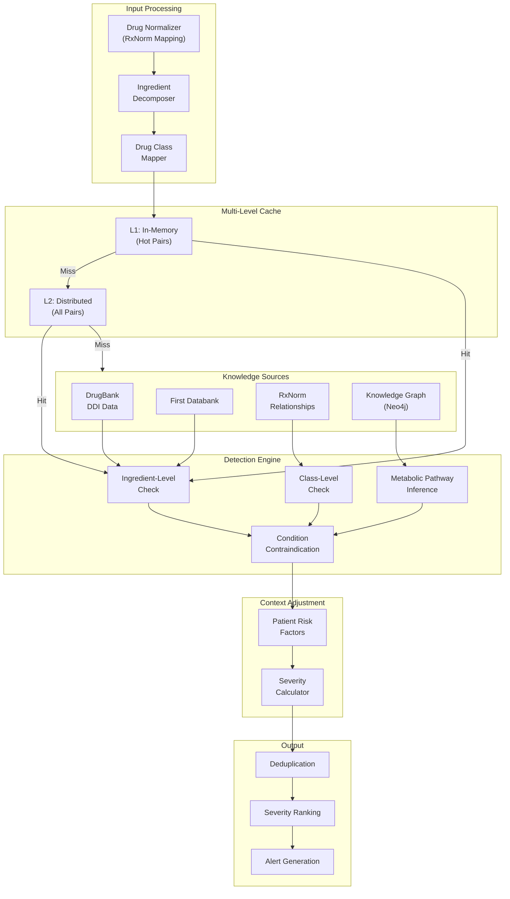
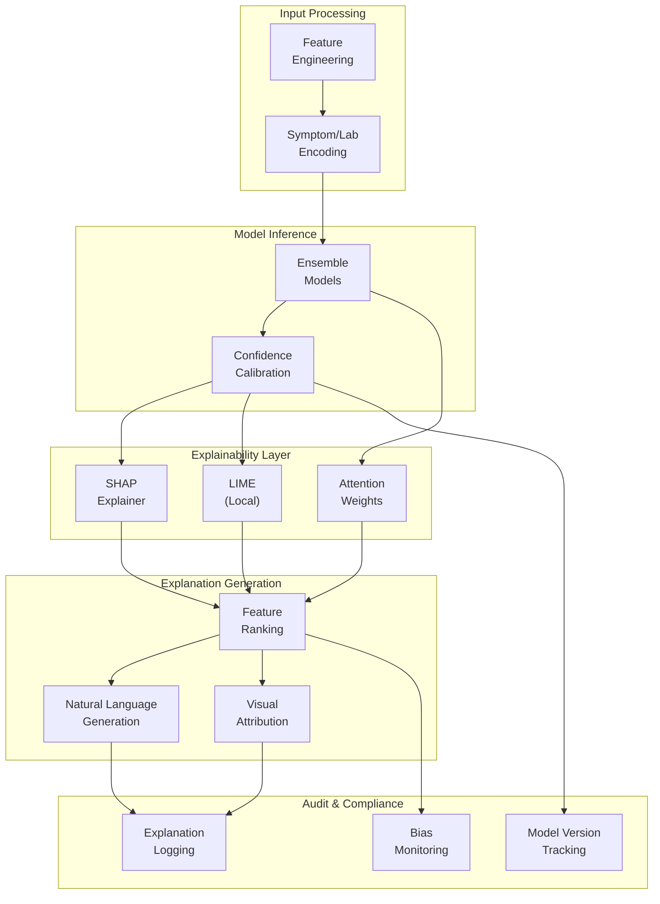
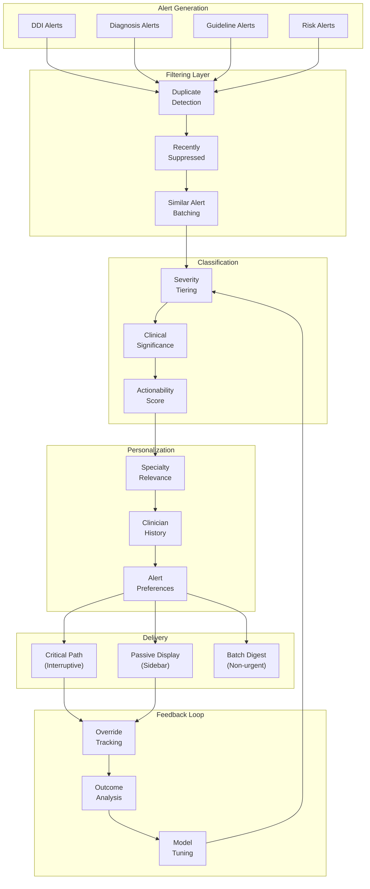

# Deep Dive & Bottleneck Analysis

## Critical Component 1: Drug Interaction Detection Engine

### Why Critical

The Drug Interaction Detection Engine is the most latency-sensitive and safety-critical component of the CDSS. It must:
- Process every medication order in real-time (< 200ms p99)
- Never miss a life-threatening interaction (> 95% recall)
- Minimize alert fatigue (< 10% false positive rate for critical alerts)
- Handle polypharmacy scenarios (patients on 10+ medications)

A failure in this component could result in:
- Patient harm from missed interactions
- Alert fatigue leading to override of legitimate warnings
- Workflow disruption if latency exceeds clinician patience threshold

### Internal Architecture



### Critical Path Analysis

```
CRITICAL PATH: Medication Order → DDI Alert

Timeline (p99 target: 200ms):

0ms      Request received at API Gateway
         ├── Auth validation (cached): 5ms
         └── Consent check (cached): 5ms

10ms     Drug Normalizer
         ├── RxNorm lookup (cached): 3ms
         ├── Ingredient decomposition: 5ms
         └── Class mapping: 2ms

20ms     Cache Lookup (L1)
         ├── Hit ratio: 85%
         └── Latency: 1ms

21ms     Cache Lookup (L2) if L1 miss
         ├── Hit ratio: 99% (of L1 misses)
         └── Latency: 3ms

25ms     Knowledge Base Query (if cache miss)
         ├── Direct DDI lookup: 10ms
         ├── Class-level lookup: 8ms
         └── Graph traversal (rare): 30ms

60ms     Patient Context Loading
         ├── Demographics: 5ms (cached)
         ├── Conditions: 10ms
         └── Lab values: 10ms

85ms     Severity Calculation
         ├── Risk factor computation: 5ms
         ├── Adjustment application: 2ms
         └── Override requirement: 3ms

95ms     Output Generation
         ├── Deduplication: 5ms
         ├── Ranking: 3ms
         └── Alert card generation: 7ms

110ms    Response serialization: 5ms

115ms    Response sent

BUFFER: 85ms for tail latency and retries
```

### Multi-Source Knowledge Aggregation

```
CHALLENGE: Multiple DDI sources with conflicting severity ratings

SOLUTION: Evidence-weighted aggregation with source reputation

ALGORITHM: AggregateInteractionSeverity

INPUT:
  - sources: List of (source_name, severity, evidence_level)

WEIGHTS:
  - DrugBank: 0.35 (comprehensive, well-cited)
  - First Databank: 0.30 (clinical focus, FDA-aligned)
  - Lexicomp: 0.25 (detailed management)
  - RxNorm: 0.10 (basic relationships only)

EVIDENCE_MULTIPLIERS:
  - Level 5 (RCT): 1.0
  - Level 4 (Observational): 0.8
  - Level 3 (Case series): 0.6
  - Level 2 (Case reports): 0.4
  - Level 1 (Theoretical): 0.2

FUNCTION aggregate_severity(sources):
    severity_scores = {
        "critical": 4,
        "high": 3,
        "moderate": 2,
        "low": 1
    }

    weighted_sum = 0
    total_weight = 0

    FOR EACH (source, severity, evidence) IN sources:
        weight = SOURCE_WEIGHTS[source] * EVIDENCE_MULTIPLIERS[evidence]
        score = severity_scores[severity]
        weighted_sum += weight * score
        total_weight += weight

    final_score = weighted_sum / total_weight

    // Map back to categorical
    IF final_score >= 3.5:
        RETURN "critical"
    ELSE IF final_score >= 2.5:
        RETURN "high"
    ELSE IF final_score >= 1.5:
        RETURN "moderate"
    ELSE:
        RETURN "low"

CONFLICT RESOLUTION:
  - If any source reports "critical": minimum final = "high"
  - Document all source opinions in evidence field
  - Flag conflicting sources for clinical review
```

### Failure Modes and Handling

| Failure Mode | Detection | Impact | Mitigation |
|--------------|-----------|--------|------------|
| **Cache unavailable** | Health check timeout | +50ms latency | Fall through to KB; circuit breaker |
| **Knowledge base down** | Query timeout (5s) | No new DDI detection | Return cached results; degrade to class-level |
| **Graph DB timeout** | Query timeout (2s) | No inferred interactions | Skip inference; return direct matches only |
| **High latency (>500ms)** | p99 monitoring | Workflow disruption | Shed low-priority requests; async for moderate |
| **Incorrect severity** | Post-hoc analysis | Potential harm or fatigue | Conservative fallback (assume higher severity) |

### Concurrency Handling

```
SCENARIO: Same patient, multiple concurrent medication orders

CHALLENGE:
  - Order A: Check Warfarin against current meds
  - Order B: Check Aspirin against current meds (same patient, same second)
  - Both should see each other's draft orders

SOLUTION: Optimistic locking with draft order aggregation

IMPLEMENTATION:

1. DRAFT ORDER CACHE:
   Key: draft_orders:{patient_id}:{encounter_id}
   Value: Set of draft medication RxCUIs
   TTL: 5 minutes
   Operations: SADD (add draft), SMEMBERS (get all drafts)

2. CHECK FLOW:
   FUNCTION check_with_drafts(patient_id, encounter_id, new_med):
       // Add to draft set
       cache.SADD(draft_key, new_med.rxcui)

       // Get all drafts
       all_drafts = cache.SMEMBERS(draft_key)

       // Check new med against:
       //   1. Current active medications
       //   2. All other draft medications
       current_meds = get_active_medications(patient_id)
       all_meds = current_meds + all_drafts - {new_med.rxcui}

       interactions = detect_interactions(new_med, all_meds)

       RETURN interactions

3. ORDER COMMIT:
   FUNCTION on_order_signed(patient_id, encounter_id, med):
       // Remove from drafts
       cache.SREM(draft_key, med.rxcui)
       // Med is now in active medications (EHR source of truth)
```

---

## Critical Component 2: Explainable AI for Diagnosis Suggestions

### Why Critical

Diagnosis suggestion is subject to the strictest regulatory scrutiny because:
- Incorrect suggestions could lead to misdiagnosis and delayed treatment
- FDA requires "meaningful human oversight" for AI-assisted diagnosis
- EU AI Act mandates explainability for high-risk AI systems
- Clinician trust depends on understanding why a suggestion was made

### Explainability Architecture



### SHAP Integration

```
ALGORITHM: DiagnosisExplanationWithSHAP

BACKGROUND:
  SHAP (SHapley Additive exPlanations) provides consistent,
  locally accurate feature attributions based on game theory.

IMPLEMENTATION:

1. GLOBAL EXPLAINER (Pre-computed):
   - Train TreeExplainer on diagnosis model ensemble
   - Compute expected values (baseline predictions)
   - Store for fast local explanations

   FUNCTION initialize_explainer(model):
       explainer = TreeExplainer(model)
       expected_value = explainer.expected_value
       SAVE(explainer, f"models/{model.version}/explainer.pkl")
       RETURN explainer

2. LOCAL EXPLANATION (Per prediction):
   FUNCTION explain_diagnosis(feature_vector, diagnosis_class):
       explainer = LOAD(f"models/{current_version}/explainer.pkl")

       // Get SHAP values for target class
       shap_values = explainer.shap_values(
           feature_vector,
           check_additivity=True
       )[diagnosis_class]

       // Rank features by absolute contribution
       feature_importances = []
       FOR i, (feature_name, shap_val) IN enumerate(zip(FEATURE_NAMES, shap_values)):
           feature_importances.append({
               "feature": feature_name,
               "value": feature_vector[i],
               "shap_value": shap_val,
               "abs_contribution": abs(shap_val),
               "direction": "supports" IF shap_val > 0 ELSE "opposes"
           })

       // Sort by absolute contribution
       feature_importances.sort(key=lambda x: x["abs_contribution"], reverse=True)

       // Take top 5 contributors
       top_features = feature_importances[:5]

       RETURN top_features

3. NATURAL LANGUAGE GENERATION:
   FUNCTION generate_explanation_text(diagnosis_name, top_features):
       supports = [f for f in top_features if f["direction"] == "supports"]
       opposes = [f for f in top_features if f["direction"] == "opposes"]

       text = f"Suggested diagnosis: {diagnosis_name}\n\n"
       text += "Supporting factors:\n"
       FOR f IN supports:
           text += f"  • {humanize(f['feature'])}: {f['value']} "
           text += f"(contribution: {f['shap_value']:.3f})\n"

       IF opposes:
           text += "\nFactors that reduce confidence:\n"
           FOR f IN opposes:
               text += f"  • {humanize(f['feature'])}: {f['value']} "
               text += f"(contribution: {f['shap_value']:.3f})\n"

       RETURN text

4. HUMANIZATION MAPPING:
   FEATURE_HUMANIZATION = {
       "symptom_chest_pain": "Chest pain present",
       "symptom_dyspnea": "Shortness of breath",
       "vital_bp_systolic_high": "Elevated systolic blood pressure",
       "lab_troponin_elevated": "Elevated troponin levels",
       "age_bucket_65_plus": "Age over 65 years",
       ...
   }
```

### Confidence Calibration

```
PROBLEM: Raw model probabilities are often miscalibrated
         (e.g., 80% confidence predictions are correct only 60% of the time)

SOLUTION: Isotonic regression calibration with holdout validation

IMPLEMENTATION:

1. CALIBRATION TRAINING:
   FUNCTION train_calibrator(model, calibration_data):
       // Get uncalibrated probabilities
       y_probs = model.predict_proba(calibration_data.X)
       y_true = calibration_data.y

       // Train isotonic regression for each class
       calibrators = {}
       FOR class_idx IN range(num_classes):
           iso_reg = IsotonicRegression(out_of_bounds='clip')
           iso_reg.fit(y_probs[:, class_idx], (y_true == class_idx))
           calibrators[class_idx] = iso_reg

       SAVE(calibrators, f"models/{model.version}/calibrators.pkl")

2. CALIBRATION INFERENCE:
   FUNCTION calibrate_predictions(raw_probs, class_idx):
       calibrators = LOAD(f"models/{current_version}/calibrators.pkl")
       calibrated = calibrators[class_idx].transform(raw_probs[class_idx])
       RETURN calibrated

3. CALIBRATION MONITORING:
   FUNCTION monitor_calibration():
       // Daily check on production predictions
       predictions = get_yesterday_predictions()
       outcomes = get_confirmed_diagnoses()

       // Calculate Expected Calibration Error (ECE)
       ece = expected_calibration_error(predictions, outcomes, n_bins=10)

       IF ece > 0.05:  // 5% threshold
           ALERT("Calibration drift detected", ece)
           trigger_recalibration()

       // Log for trending
       log_metric("calibration_ece", ece)
```

### Bias Detection and Monitoring

```
ALGORITHM: BiasMonitoring

DEMOGRAPHICS_TO_MONITOR:
  - age_group: ["0-18", "19-40", "41-65", "65+"]
  - sex: ["male", "female"]
  - ethnicity: ["White", "Black", "Hispanic", "Asian", "Other"]

METRICS:
  - True Positive Rate (Sensitivity) per group
  - False Positive Rate per group
  - Positive Predictive Value per group
  - Demographic Parity Difference

FUNCTION monitor_bias(predictions, outcomes, demographics):
    results = {}

    FOR EACH demographic_field IN DEMOGRAPHICS_TO_MONITOR:
        groups = demographics[demographic_field].unique()
        group_metrics = {}

        FOR EACH group IN groups:
            mask = demographics[demographic_field] == group
            group_preds = predictions[mask]
            group_outcomes = outcomes[mask]

            tpr = sensitivity(group_preds, group_outcomes)
            fpr = false_positive_rate(group_preds, group_outcomes)
            ppv = positive_predictive_value(group_preds, group_outcomes)

            group_metrics[group] = {
                "n": sum(mask),
                "tpr": tpr,
                "fpr": fpr,
                "ppv": ppv
            }

        // Calculate disparity
        tpr_values = [m["tpr"] for m in group_metrics.values()]
        tpr_disparity = max(tpr_values) - min(tpr_values)

        results[demographic_field] = {
            "group_metrics": group_metrics,
            "tpr_disparity": tpr_disparity,
            "alert": tpr_disparity > 0.1  // 10% threshold
        }

    RETURN results

ALERTING:
  - If TPR disparity > 10%: Create bias alert for review
  - If any group n < 100: Flag insufficient sample size
  - Weekly automated report to ML governance team
```

---

## Critical Component 3: Alert Fatigue Mitigation

### Why Critical

Alert fatigue is the leading cause of CDS failure:
- 33-96% of alerts are overridden in studies
- One ICU study found 187 alerts per patient per day
- Clinicians develop "alert blindness" and override legitimate critical alerts
- Excessive alerts reduce clinician satisfaction and trust

### Alert Fatigue Mitigation Architecture



### Three-Tier Alert Classification

```
ALGORITHM: AlertTierClassification

TIER DEFINITIONS:

TIER 1 - INTERRUPTIVE (Hard Stop):
  Criteria:
    - Severity: Critical OR
    - Interaction type: Life-threatening contraindication OR
    - Historical outcome: >5% serious adverse event rate
  Display: Modal dialog, requires explicit acknowledgment
  Override: Attending + Justification + Pharmacy review
  Target: <5% of all alerts

TIER 2 - PASSIVE (Sidebar Alert):
  Criteria:
    - Severity: High or Moderate AND
    - Clinically significant AND
    - Actionable recommendation available
  Display: Sidebar panel, visible but non-blocking
  Override: Acknowledgment + Reason code
  Target: 15-25% of all alerts

TIER 3 - INFORMATIONAL (Non-intrusive):
  Criteria:
    - Severity: Low or Moderate AND
    - Educational value OR
    - Low clinical impact
  Display: Info icon, expandable on click
  Override: No override needed
  Target: Remainder (may be suppressed entirely)

FUNCTION classify_alert_tier(alert, patient_context, clinician_profile):
    // Start with base severity
    tier = severity_to_initial_tier(alert.severity)

    // Upgrade based on patient risk
    IF patient_context.has_high_risk_factors:
        tier = min(tier, 2)  // At least Tier 2

    // Consider historical outcomes
    IF alert.type IN historical_high_impact_alerts:
        tier = min(tier, 1)  // Upgrade to Tier 1

    // Downgrade based on clinician specialty
    IF NOT is_relevant_to_specialty(alert, clinician_profile.specialty):
        tier = max(tier, 3)  // Downgrade to Tier 3

    // Check suppression rules
    IF is_recently_suppressed(alert, patient_context):
        tier = max(tier, 3)  // Don't re-interrupt

    // Apply clinician preferences
    IF clinician_profile.has_alert_override(alert.type):
        tier = clinician_profile.preferred_tier(alert.type)

    RETURN tier

FUNCTION severity_to_initial_tier(severity):
    mapping = {
        "critical": 1,
        "high": 2,
        "moderate": 3,
        "low": 3
    }
    RETURN mapping[severity]
```

### Duplicate and Similar Alert Suppression

```
ALGORITHM: AlertSuppression

SUPPRESSION RULES:

1. EXACT DUPLICATE:
   Key: (patient_id, alert_type, trigger_code, 24h window)
   Action: Suppress completely, increment counter

2. SIMILAR ALERT (Same interaction, different trigger):
   Key: (patient_id, interaction_mechanism)
   Action: Batch into single alert with multiple triggers

3. RECENTLY OVERRIDDEN:
   Key: (patient_id, alert_type, 7-day window)
   Action: Downgrade tier, show as informational

4. CLINICIAN-SPECIFIC SUPPRESSION:
   Key: (clinician_id, alert_type, 30-day override pattern)
   Action: If >80% override rate, prompt for preference update

IMPLEMENTATION:

FUNCTION check_suppression(alert, patient_id, clinician_id):
    suppression_key = f"suppress:{patient_id}:{alert.type}:{alert.trigger_code}"

    // Check exact duplicate
    IF cache.EXISTS(suppression_key):
        cache.INCR(f"{suppression_key}:count")
        RETURN {
            "action": "suppress",
            "reason": "duplicate_within_24h",
            "count": cache.GET(f"{suppression_key}:count")
        }

    // Check similar alerts for batching
    batch_key = f"batch:{patient_id}:{alert.mechanism}"
    existing_batch = cache.GET(batch_key)
    IF existing_batch:
        // Add to batch instead of separate alert
        cache.SADD(f"{batch_key}:triggers", alert.trigger_code)
        RETURN {
            "action": "batch",
            "batch_id": existing_batch.batch_id
        }

    // Check recent override pattern
    recent_overrides = get_recent_overrides(
        clinician_id, alert.type, days=30
    )
    IF recent_overrides.override_rate > 0.8:
        RETURN {
            "action": "downgrade",
            "reason": "high_override_rate",
            "suggested_preference": "tier_3"
        }

    // No suppression
    cache.SET(suppression_key, "1", EX=86400)  // 24h TTL
    RETURN {"action": "show"}
```

### Override Pattern Analysis for Model Improvement

```
ALGORITHM: OverridePatternAnalysis

PURPOSE:
  Learn from clinician overrides to improve alert precision
  and reduce future false positives.

DATA COLLECTION:
  FOR EACH override:
    - Alert details (type, severity, trigger)
    - Override reason code
    - Clinician specialty and experience level
    - Patient outcome (30-day follow-up)
    - Was the override clinically appropriate?

ANALYSIS FUNCTIONS:

1. OVERRIDE RATE BY ALERT TYPE:
   FUNCTION analyze_override_rates():
       query = """
           SELECT alert_type, severity,
                  COUNT(*) as total,
                  SUM(CASE WHEN overridden THEN 1 ELSE 0 END) as overridden,
                  SUM(CASE WHEN overridden AND adverse_outcome THEN 1 ELSE 0 END) as bad_override
           FROM clinical_alerts a
           LEFT JOIN alert_overrides o ON a.alert_id = o.alert_id
           LEFT JOIN patient_outcomes p ON a.patient_id = p.patient_id
           WHERE a.generated_at > NOW() - INTERVAL '30 days'
           GROUP BY alert_type, severity
       """

       results = execute(query)

       FOR EACH row IN results:
           override_rate = row.overridden / row.total
           bad_override_rate = row.bad_override / row.overridden

           IF override_rate > 0.7 AND bad_override_rate < 0.05:
               // High override, low adverse outcome = candidate for downgrade
               recommend_severity_adjustment(row.alert_type, "downgrade")

           IF override_rate < 0.3 AND bad_override_rate > 0.1:
               // Low override, significant adverse outcomes = upgrade
               recommend_severity_adjustment(row.alert_type, "upgrade")

2. CLINICIAN-SPECIFIC PATTERNS:
   FUNCTION analyze_clinician_patterns(clinician_id):
       overrides = get_clinician_overrides(clinician_id, days=90)

       // Calculate override rate by specialty norms
       specialty = get_clinician_specialty(clinician_id)
       specialty_avg = get_specialty_override_average(specialty)

       IF clinician_override_rate > specialty_avg * 1.5:
           flag_for_review(clinician_id, "high_override_rate")

       // Identify alert types this clinician consistently overrides
       frequent_overrides = group_by_alert_type(overrides)
       FOR EACH (alert_type, count) IN frequent_overrides:
           IF count > 10 AND override_rate > 0.9:
               suggest_preference_update(clinician_id, alert_type)

3. FEEDBACK TO MODEL TRAINING:
   FUNCTION generate_training_feedback():
       // False positives: High confidence, overridden, no adverse outcome
       false_positives = query("""
           SELECT a.*, o.override_reason
           FROM clinical_alerts a
           JOIN alert_overrides o ON a.alert_id = o.alert_id
           LEFT JOIN patient_outcomes p ON a.patient_id = p.patient_id
           WHERE a.confidence_score > 0.8
           AND o.override_reason != 'emergency_situation'
           AND p.adverse_outcome IS NULL
       """)

       // Add to training set with corrected labels
       FOR EACH fp IN false_positives:
           training_feedback.append({
               "features": fp.context,
               "original_prediction": fp.alert_type,
               "corrected_label": "no_alert",
               "weight": 0.5  // Lower weight for indirect feedback
           })

       RETURN training_feedback
```

---

## Bottleneck Analysis

### Bottleneck 1: Knowledge Graph Query Latency

**Problem:**
- Complex multi-hop queries (metabolic pathway, transporter interactions) can exceed 30ms
- Graph traversal scales poorly with polypharmacy (10+ medications = O(n²) pairs)

**Mitigation Strategies:**

| Strategy | Implementation | Impact |
|----------|----------------|--------|
| **Pre-computed paths** | Nightly batch job computes all 2-hop paths | 90% of queries become lookups |
| **Query timeout** | 2s timeout with fallback to direct matches only | Guarantees response time |
| **Parallel queries** | Fan out to multiple graph replicas | 40% latency reduction |
| **Result caching** | Cache full patient interaction results (5 min TTL) | 70% cache hit for same patient |
| **Graph sharding** | Shard by drug class for locality | Reduces cross-shard queries |

**Circuit Breaker Pattern:**
```
IF graph_query_p99 > 100ms for 5 minutes:
    ACTIVATE circuit breaker
    RETURN only direct DDI matches (from relational cache)
    LOG degradation event
    ALERT operations team

RECOVERY:
    Every 30 seconds, allow 1% of requests to graph
    IF p99 < 50ms for 5 requests:
        DEACTIVATE circuit breaker
        Resume normal operation
```

### Bottleneck 2: ML Inference at Scale

**Problem:**
- Diagnosis model inference: ~500ms on CPU, 50ms on GPU
- Peak load: 105 QPS for diagnosis suggestions
- GPU instances are expensive; cold start is 10-30s

**Mitigation Strategies:**

| Strategy | Implementation | Impact |
|----------|----------------|--------|
| **Model quantization** | INT8 quantization (TensorRT) | 3x throughput, minimal accuracy loss |
| **Batching** | Dynamic batching (max 10 requests, 50ms window) | 5x throughput improvement |
| **Model caching** | Keep warm pool of loaded models | Eliminate cold start |
| **Async inference** | Queue-based with webhook callback | Handle burst traffic |
| **Feature caching** | Cache computed features per patient (15 min TTL) | 30% inference skip |

**Auto-scaling Configuration:**
```
GPU_SCALING_POLICY:
  metric: gpu_utilization
  target: 70%
  scale_out:
    threshold: >80% for 2 minutes
    action: add 1 GPU instance
    cooldown: 5 minutes
  scale_in:
    threshold: <40% for 15 minutes
    action: remove 1 GPU instance
    min_instances: 2

QUEUE_BASED_SCALING:
  metric: inference_queue_depth
  scale_out:
    threshold: >500 pending for 1 minute
    action: add 2 GPU instances (aggressive)
```

### Bottleneck 3: Consent Verification in Critical Path

**Problem:**
- Every CDS request requires consent check
- Consent service adds 10-30ms to critical path
- Consent changes must be immediately reflected

**Mitigation Strategies:**

| Strategy | Implementation | Impact |
|----------|----------------|--------|
| **Aggressive caching** | Cache consent decisions (5 min TTL) | 95% hit rate |
| **Bloom filter** | Quick negative check for non-existent consents | Skip 40% of queries |
| **Consent prefetch** | Prefetch on patient-view hook | Consent ready when needed |
| **Async invalidation** | Event-driven cache invalidation | Real-time updates without polling |
| **Fail-secure default** | On timeout, deny (conservative) | No security bypass |

**Consent Cache Strategy:**
```
CACHE_KEY: consent:{patient_id}:{purpose}:{accessor_org}
TTL: 5 minutes
SIZE: 100MB (100K active consents)

ON CONSENT CHANGE EVENT:
    1. Publish to Kafka topic: consent-changes
    2. All CDS instances subscribe
    3. Invalidate matching cache keys immediately
    4. Next request fetches fresh consent

FALLBACK ON CACHE MISS:
    1. Query consent service (timeout: 100ms)
    2. If timeout: DENY access (fail-secure)
    3. Log consent check failure
    4. Alert if failure rate > 1%
```

---

## Race Condition Analysis

### Race Condition 1: Concurrent Medication Orders

**Scenario:**
- Clinician A orders Warfarin at 10:00:00.000
- Clinician B orders Aspirin at 10:00:00.050 (same patient)
- Both DDI checks run in parallel
- Neither sees the other's draft

**Solution: Draft Order Synchronization**

```
IMPLEMENTATION:

1. Use Redis WATCH for optimistic locking:

FUNCTION check_with_sync(patient_id, new_med):
    draft_key = f"drafts:{patient_id}"

    WHILE retries < 3:
        WATCH draft_key

        // Get current drafts
        current_drafts = SMEMBERS draft_key

        // Start transaction
        MULTI
        SADD draft_key new_med.rxcui
        EXPIRE draft_key 300  // 5 minute TTL
        result = EXEC

        IF result == NIL:
            // Another write occurred, retry
            retries++
            CONTINUE
        ELSE:
            // Success - now check against all meds
            all_drafts = current_drafts + {new_med.rxcui}
            interactions = check_interactions(new_med, all_drafts)
            RETURN interactions

    // Retries exhausted - fail open with warning
    LOG "Draft sync failed, checking without other drafts"
    RETURN check_interactions(new_med, [])
```

### Race Condition 2: Model Version Transition

**Scenario:**
- Model v2.1 deployed at 10:00
- Request A starts at 09:59:59, uses v2.0
- Request B starts at 10:00:01, uses v2.1
- Same patient gets different suggestions

**Solution: Sticky Model Version per Encounter**

```
IMPLEMENTATION:

1. On encounter start, pin model version:

FUNCTION get_model_version(encounter_id):
    version_key = f"model_version:{encounter_id}"

    // Try to get pinned version
    pinned = cache.GET(version_key)
    IF pinned:
        RETURN pinned

    // Pin current production version
    current = model_registry.get_production_version()
    cache.SET(version_key, current, EX=86400)  // 24h TTL
    RETURN current

2. All requests for encounter use pinned version:

FUNCTION run_inference(encounter_id, features):
    version = get_model_version(encounter_id)
    model = load_model(version)
    result = model.predict(features)
    result.model_version = version  // Include in response for audit
    RETURN result
```

### Race Condition 3: Cache Stampede on Knowledge Base Update

**Scenario:**
- Monthly KB update invalidates all DDI pairs
- 500K cache entries expire simultaneously
- All requests hit database, causing overload

**Solution: Staggered Invalidation with Probabilistic Refresh**

```
IMPLEMENTATION:

1. Staggered TTL on cache entries:

FUNCTION cache_ddi_pair(pair, data):
    // Add jitter to TTL (±10%)
    base_ttl = 3600  // 1 hour
    jitter = random(-360, 360)
    ttl = base_ttl + jitter

    cache.SET(f"ddi:{pair}", data, EX=ttl)

2. Probabilistic early refresh:

FUNCTION get_ddi_pair(pair):
    cached = cache.GET(f"ddi:{pair}")

    IF cached:
        ttl_remaining = cache.TTL(f"ddi:{pair}")
        total_ttl = 3600

        // Probability of early refresh increases as TTL decreases
        refresh_prob = (total_ttl - ttl_remaining) / total_ttl * 0.1

        IF random() < refresh_prob:
            // Refresh in background
            async refresh_cache(pair)

        RETURN cached

    // Cache miss - fetch and cache
    data = knowledge_base.query(pair)
    cache_ddi_pair(pair, data)
    RETURN data

3. KB update procedure:

FUNCTION update_knowledge_base(new_version):
    // Don't invalidate all at once
    // Instead, mark version and let entries expire naturally

    cache.SET("kb_version", new_version)

    // Critical updates only - force refresh
    FOR EACH critical_change IN new_version.critical_changes:
        cache.DEL(f"ddi:{critical_change.pair}")

    // Background job refreshes remaining over 1 hour
    schedule_gradual_refresh(new_version, duration=3600)
```
