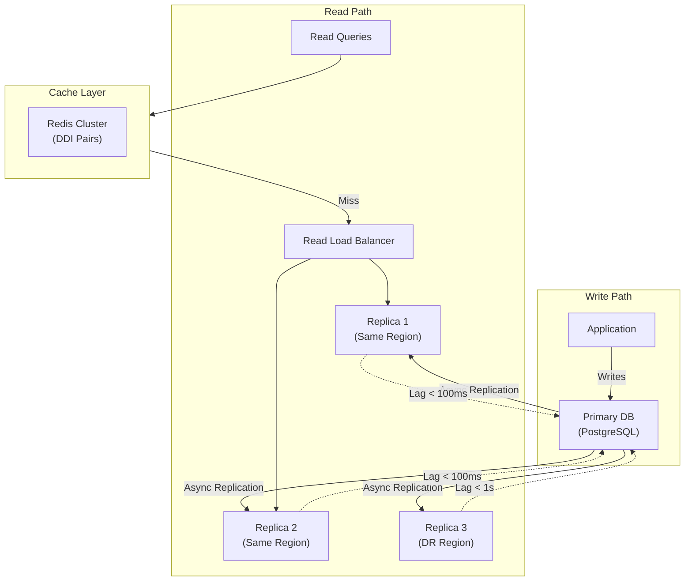
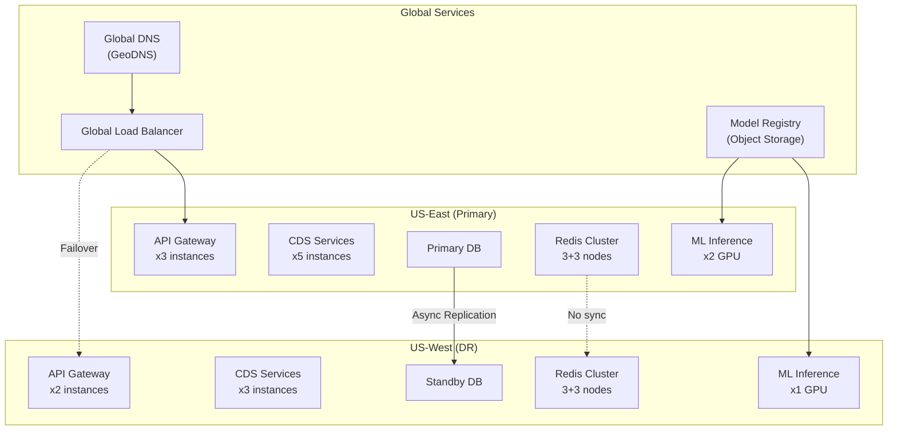
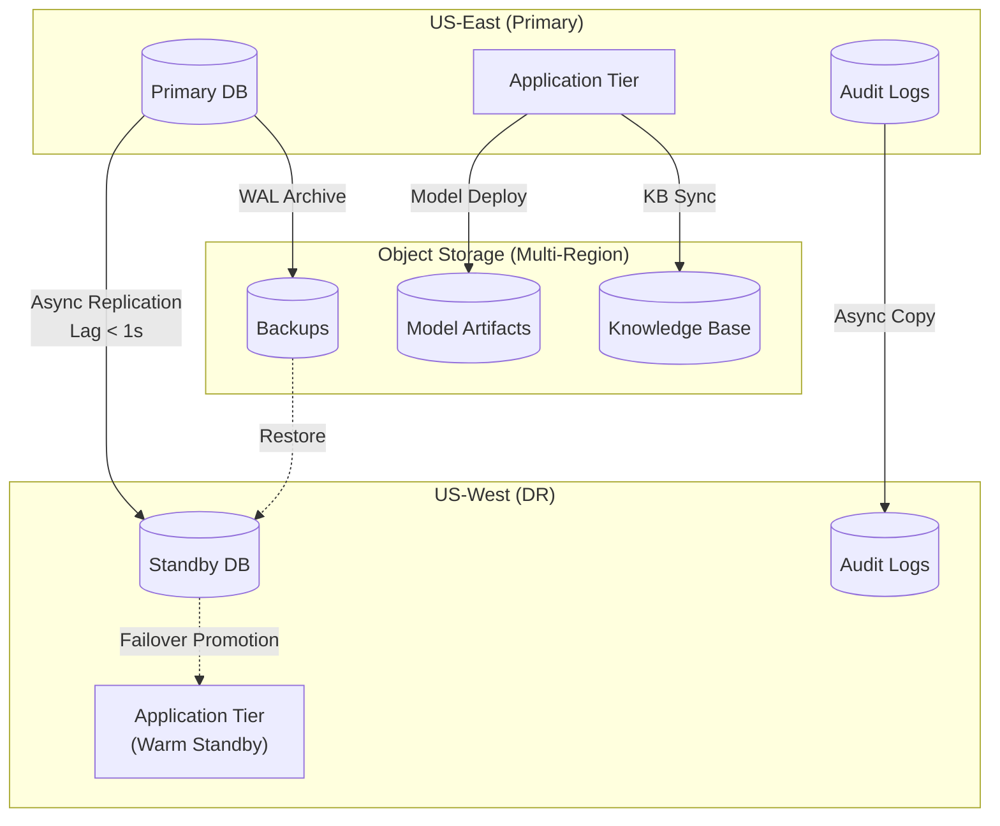

# Scalability & Reliability

## Scalability Strategy

### Horizontal vs Vertical Scaling Decisions

| Component | Scaling Type | Rationale | Limits |
|-----------|--------------|-----------|--------|
| **API Gateway** | Horizontal | Stateless, CPU-bound request routing | Network bandwidth |
| **Drug Interaction Service** | Horizontal | Stateless, I/O-bound (cache/KB) | Cache cluster size |
| **Diagnosis ML Inference** | Horizontal + Vertical | GPU-bound; scale out instances, scale up GPU memory | GPU availability, cost |
| **Risk Scoring Service** | Horizontal | CPU-bound mathematical models | None practical |
| **Guideline Engine (CQL)** | Horizontal | CPU-bound rule evaluation | None practical |
| **Alert Manager** | Horizontal | Stateless coordination | None practical |
| **Cache Cluster** | Horizontal | Sharded by key hash | Memory cost |
| **Primary Database** | Vertical + Read Replicas | Write consistency required | Single writer limit |
| **Knowledge Graph** | Vertical + Read Replicas | Complex traversals benefit from memory | Write infrequent |
| **Audit Log Store** | Horizontal (append-only) | Write-optimized, partitioned by time | Storage cost |

### Auto-Scaling Configuration

```yaml
# API Gateway Auto-Scaling
api_gateway:
  min_replicas: 3
  max_replicas: 50
  metrics:
    - type: Resource
      resource:
        name: cpu
        target:
          type: Utilization
          averageUtilization: 70
    - type: Pods
      pods:
        metric:
          name: http_requests_per_second
        target:
          type: AverageValue
          averageValue: 1000
  behavior:
    scaleUp:
      stabilizationWindowSeconds: 60
      policies:
        - type: Percent
          value: 100
          periodSeconds: 60
    scaleDown:
      stabilizationWindowSeconds: 300
      policies:
        - type: Percent
          value: 10
          periodSeconds: 60

# Drug Interaction Service Auto-Scaling
ddi_service:
  min_replicas: 5
  max_replicas: 100
  metrics:
    - type: Resource
      resource:
        name: cpu
        target:
          type: Utilization
          averageUtilization: 60
    - type: External
      external:
        metric:
          name: ddi_check_latency_p99
        target:
          type: Value
          value: 150m  # 150ms

# ML Inference Auto-Scaling (GPU)
ml_inference:
  min_replicas: 2
  max_replicas: 20
  metrics:
    - type: External
      external:
        metric:
          name: gpu_utilization
        target:
          type: AverageValue
          averageValue: 70
    - type: External
      external:
        metric:
          name: inference_queue_depth
        target:
          type: AverageValue
          averageValue: 100
  behavior:
    scaleUp:
      stabilizationWindowSeconds: 30  # Fast scale-up for GPU
      policies:
        - type: Pods
          value: 2
          periodSeconds: 30
    scaleDown:
      stabilizationWindowSeconds: 600  # Slow scale-down (GPU expensive to restart)
```

### Database Scaling Strategy



**Read Replica Routing:**
```
FUNCTION route_read_query(query, consistency_requirement):
    IF consistency_requirement == "strong":
        // Must read from primary for strong consistency
        RETURN primary_connection

    IF query.is_analytics:
        // Analytics can use any replica
        RETURN random(all_replicas)

    // Regular reads use regional replicas
    regional_replicas = get_replicas(current_region)
    healthy_replicas = filter(regional_replicas, lag < 100ms)

    IF healthy_replicas.empty:
        // Fall back to primary if replicas unhealthy
        RETURN primary_connection

    RETURN least_loaded(healthy_replicas)
```

### Caching Layers

```
┌─────────────────────────────────────────────────────────────────────────────┐
│                           CACHING ARCHITECTURE                               │
├─────────────────────────────────────────────────────────────────────────────┤
│                                                                             │
│  ┌───────────────────────────────────────────────────────────────────────┐ │
│  │  L1: APPLICATION CACHE (Per Instance)                                 │ │
│  │  ────────────────────────────────────────────────────────────────────│ │
│  │  Technology: In-memory (LRU eviction)                                │ │
│  │  Size: 100MB per instance                                            │ │
│  │  TTL: 5 minutes                                                      │ │
│  │  Contents:                                                           │ │
│  │    • Hot DDI pairs (top 10K by frequency) - 20MB                    │ │
│  │    • Active session tokens - 10MB                                    │ │
│  │    • Compiled CQL rules - 30MB                                       │ │
│  │    • Terminology lookups - 40MB                                      │ │
│  │  Hit Rate Target: 85%                                                │ │
│  └───────────────────────────────────────────────────────────────────────┘ │
│                                    │                                        │
│                                    ▼ Miss                                   │
│  ┌───────────────────────────────────────────────────────────────────────┐ │
│  │  L2: DISTRIBUTED CACHE (Redis Cluster)                                │ │
│  │  ────────────────────────────────────────────────────────────────────│ │
│  │  Technology: Redis Cluster (6 nodes, 3 primary + 3 replica)          │ │
│  │  Size: 30GB total (5GB per node)                                     │ │
│  │  TTL: 1 hour (DDI), 5 min (consent), 15 min (features)              │ │
│  │  Contents:                                                           │ │
│  │    • All DDI pairs (500K) - 1GB                                      │ │
│  │    • Patient consent decisions - 500MB                               │ │
│  │    • Recent risk scores - 200MB                                      │ │
│  │    • ML feature vectors - 1GB                                        │ │
│  │    • Session data - 500MB                                            │ │
│  │  Hit Rate Target: 99% (of L1 misses)                                 │ │
│  │  Partitioning: Consistent hashing by key                             │ │
│  └───────────────────────────────────────────────────────────────────────┘ │
│                                    │                                        │
│                                    ▼ Miss                                   │
│  ┌───────────────────────────────────────────────────────────────────────┐ │
│  │  L3: READ REPLICAS (Database)                                         │ │
│  │  ────────────────────────────────────────────────────────────────────│ │
│  │  Technology: PostgreSQL read replicas                                │ │
│  │  Replicas: 2 per region                                              │ │
│  │  Lag Target: < 100ms                                                 │ │
│  │  Use: Cache miss fallback, complex queries, analytics               │ │
│  └───────────────────────────────────────────────────────────────────────┘ │
│                                                                             │
└─────────────────────────────────────────────────────────────────────────────┘
```

### Hot Spot Mitigation

**Problem:** Certain drugs (e.g., Warfarin, Metformin) appear in 30%+ of interactions

**Solution:** Hot key distribution with replicated hot data

```
STRATEGY: Replicate hot keys across all cache nodes

1. IDENTIFY HOT KEYS:
   // Batch job runs hourly
   FUNCTION identify_hot_keys():
       access_counts = cache.GET_ACCESS_STATS()
       hot_threshold = access_counts.p99  // Top 1%
       hot_keys = filter(access_counts, count > hot_threshold)
       RETURN hot_keys

2. REPLICATE HOT KEYS:
   FUNCTION replicate_hot_key(key):
       value = cache.GET(key)
       FOR node IN cache.ALL_NODES:
           // Store with special prefix
           node.SET(f"hot:{key}", value, EX=300)

3. READ WITH HOT KEY AWARENESS:
   FUNCTION get_ddi(pair_key):
       // First check local hot key cache
       hot_value = local_cache.GET(f"hot:{pair_key}")
       IF hot_value:
           RETURN hot_value

       // Then regular distributed lookup
       RETURN cache.GET(pair_key)

4. WARFARIN-SPECIFIC OPTIMIZATION:
   // Warfarin interactions are pre-loaded to all nodes
   ON_STARTUP:
       warfarin_rxcui = "855332"
       warfarin_pairs = kb.GET_ALL_INTERACTIONS(warfarin_rxcui)
       FOR pair IN warfarin_pairs:
           cache.MSET({
               f"hot:ddi:{pair.key}": pair.data
           })
```

---

## Reliability & Fault Tolerance

### Single Points of Failure (SPOF) Identification

| Component | SPOF Risk | Mitigation |
|-----------|-----------|------------|
| **API Gateway** | Low | Multiple instances behind load balancer |
| **Primary Database** | Medium | Automated failover to standby |
| **Cache Cluster** | Low | Redis Cluster with automatic failover |
| **Knowledge Graph** | Medium | Read replicas; fall back to relational |
| **Model Registry** | Low | Object storage with versioning |
| **External Drug DBs** | High | Local copy with daily sync |
| **Consent Service** | Medium | Cache + fail-secure default |
| **Certificate Authority** | Medium | Multiple CAs; certificate pinning |

### Redundancy Strategy



### Failover Mechanisms

**Database Failover:**
```
AUTOMATED FAILOVER PROCEDURE:

1. DETECTION:
   - Health check every 5 seconds
   - 3 consecutive failures = primary unhealthy

2. PROMOTION:
   IF primary_unhealthy AND standby_lag < 10_seconds:
       // Promote standby
       standby.PROMOTE_TO_PRIMARY()
       dns.UPDATE_CNAME(primary_endpoint, standby_address)
       alert("Database failover completed", severity=HIGH)

   ELSE IF standby_lag >= 10_seconds:
       // Data loss risk - human decision
       alert("Primary down, standby has lag", severity=CRITICAL)
       page_oncall("Database failover requires approval")

3. APPLICATION NOTIFICATION:
   // Publish failover event
   kafka.PUBLISH("infrastructure-events", {
       "type": "database_failover",
       "old_primary": primary_address,
       "new_primary": standby_address,
       "timestamp": NOW()
   })

4. CONNECTION POOL REFRESH:
   // Applications subscribe to event
   ON_EVENT("database_failover"):
       connection_pool.DRAIN()
       connection_pool.RECONNECT(new_primary)
```

**Regional Failover:**
```
REGIONAL FAILOVER PROCEDURE:

1. DETECTION:
   - Regional health score < 50% for 2 minutes
   - Health score = (available_services / total_services) * 100

2. TRAFFIC SHIFT:
   // Gradual shift to DR region
   FOR percent IN [10, 25, 50, 75, 100]:
       global_lb.SET_WEIGHT(primary_region, 100 - percent)
       global_lb.SET_WEIGHT(dr_region, percent)
       WAIT 30_seconds
       IF dr_region.error_rate > 5%:
           ROLLBACK()
           ALERT("DR region cannot handle traffic")
           BREAK

3. DNS UPDATE:
   // Update GeoDNS records
   dns.UPDATE_RECORD(service_endpoint, dr_region_ip, TTL=60)

4. CACHE WARMING:
   // DR cache may be cold
   async WARM_CACHE(dr_region, hot_keys)
```

### Circuit Breaker Patterns

```
CIRCUIT BREAKER CONFIGURATION:

# Knowledge Graph Circuit Breaker
knowledge_graph:
  failure_threshold: 5        # failures before open
  success_threshold: 3        # successes before close
  timeout: 30_seconds         # time in open state
  half_open_requests: 3       # test requests in half-open

  fallback:
    action: "use_relational_cache"
    degradation_level: "partial"

# External Drug Database Circuit Breaker
external_drug_db:
  failure_threshold: 3
  success_threshold: 2
  timeout: 60_seconds

  fallback:
    action: "use_local_copy"
    max_age: 24_hours
    alert_if_older: true

# ML Inference Circuit Breaker
ml_inference:
  failure_threshold: 10
  success_threshold: 5
  timeout: 120_seconds

  fallback:
    action: "use_rule_based_fallback"
    degradation_level: "significant"
    alert: true
```

**Implementation:**
```
CLASS CircuitBreaker:
    states = ["CLOSED", "OPEN", "HALF_OPEN"]

    FUNCTION call(operation):
        IF state == "OPEN":
            IF time_since_opened > timeout:
                state = "HALF_OPEN"
            ELSE:
                RETURN fallback()

        TRY:
            result = operation()
            on_success()
            RETURN result
        CATCH exception:
            on_failure()
            RETURN fallback()

    FUNCTION on_failure():
        failure_count++
        IF failure_count >= failure_threshold:
            state = "OPEN"
            opened_at = NOW()
            emit_metric("circuit_breaker_opened", service=self.name)

    FUNCTION on_success():
        IF state == "HALF_OPEN":
            success_count++
            IF success_count >= success_threshold:
                state = "CLOSED"
                failure_count = 0
                emit_metric("circuit_breaker_closed", service=self.name)
        ELSE:
            failure_count = 0  # Reset on success
```

### Retry Strategies

| Operation | Retry Strategy | Max Retries | Backoff |
|-----------|---------------|-------------|---------|
| DDI Cache Lookup | Immediate retry to different node | 2 | None |
| Knowledge Base Query | Exponential backoff | 3 | 100ms, 200ms, 400ms |
| ML Inference | Exponential with jitter | 2 | 500ms ± 100ms |
| Consent Service | Immediate retry | 1 | None (fail-secure) |
| Audit Log Write | Exponential backoff | 5 | 100ms → 1.6s |
| External Drug DB Sync | Exponential backoff | 10 | 1min → 8hrs |

```
FUNCTION retry_with_backoff(operation, config):
    retries = 0
    last_exception = None

    WHILE retries < config.max_retries:
        TRY:
            result = operation()
            RETURN result
        CATCH RetryableException as e:
            last_exception = e
            retries++

            IF retries < config.max_retries:
                delay = calculate_backoff(retries, config)
                SLEEP(delay)
                LOG.warn(f"Retry {retries}/{config.max_retries} after {delay}ms")

    // All retries exhausted
    LOG.error(f"Operation failed after {config.max_retries} retries")
    RAISE last_exception

FUNCTION calculate_backoff(retry_count, config):
    base_delay = config.base_delay * (2 ** retry_count)
    max_delay = config.max_delay

    IF config.add_jitter:
        jitter = random(-0.1, 0.1) * base_delay
        base_delay += jitter

    RETURN min(base_delay, max_delay)
```

### Graceful Degradation Levels

```
┌─────────────────────────────────────────────────────────────────────────────┐
│                        GRACEFUL DEGRADATION LEVELS                           │
├─────────────────────────────────────────────────────────────────────────────┤
│                                                                             │
│  LEVEL 0: FULL FUNCTIONALITY                                                │
│  ────────────────────────────────────────────────────────────────────────   │
│  • All AI models active                                                     │
│  • Real-time knowledge graph queries                                        │
│  • Full explainability with SHAP values                                     │
│  • All guideline engines running                                            │
│                                                                             │
│  LEVEL 1: AI DEGRADED                                                       │
│  Trigger: ML inference circuit breaker open                                 │
│  ────────────────────────────────────────────────────────────────────────   │
│  • Diagnosis suggestions: DISABLED (show "AI unavailable")                  │
│  • Risk scoring: Use cached scores or simplified formulas                   │
│  • DDI: Fall back to rule-based (knowledge base only)                       │
│  • Explainability: Show rules triggered, not SHAP values                    │
│  User Impact: Reduced precision, no novel interaction detection             │
│                                                                             │
│  LEVEL 2: KNOWLEDGE GRAPH DEGRADED                                          │
│  Trigger: Graph DB circuit breaker open                                     │
│  ────────────────────────────────────────────────────────────────────────   │
│  • Graph queries: DISABLED                                                  │
│  • DDI: Direct pair lookup only (relational + cache)                        │
│  • No metabolic pathway inference                                           │
│  • No transporter interaction inference                                     │
│  User Impact: May miss inferred interactions (rare combinations)            │
│                                                                             │
│  LEVEL 3: CACHE DEGRADED                                                    │
│  Trigger: Redis cluster partially unavailable                               │
│  ────────────────────────────────────────────────────────────────────────   │
│  • Use L1 (in-memory) cache only                                            │
│  • Direct queries to read replicas                                          │
│  • Increased latency (200ms → 500ms typical)                                │
│  • Consent: Query service directly (slower)                                 │
│  User Impact: Slower responses, may hit rate limits                         │
│                                                                             │
│  LEVEL 4: DATABASE DEGRADED                                                 │
│  Trigger: Primary and replicas unavailable                                  │
│  ────────────────────────────────────────────────────────────────────────   │
│  • Read from cache only (stale data acceptable)                             │
│  • Writes queued to Kafka (replay on recovery)                              │
│  • New patients: Cannot process (no data)                                   │
│  • Existing patients: Cache-only DDI checks                                 │
│  User Impact: No new data, potentially stale alerts                         │
│                                                                             │
│  LEVEL 5: REGIONAL FAILOVER                                                 │
│  Trigger: Primary region health < 50%                                       │
│  ────────────────────────────────────────────────────────────────────────   │
│  • Traffic shifted to DR region                                             │
│  • Slightly higher latency (cross-region)                                   │
│  • DR caches may be cold (warming in progress)                              │
│  • Full functionality restored within 5-10 minutes                          │
│  User Impact: Brief slowdown during transition                              │
│                                                                             │
│  LEVEL 6: COMPLETE OUTAGE                                                   │
│  Trigger: Both regions unavailable                                          │
│  ────────────────────────────────────────────────────────────────────────   │
│  • Static page: "CDS temporarily unavailable"                               │
│  • EHR fallback: Use embedded drug reference                                │
│  • Manual review: Pharmacist review for all orders                          │
│  User Impact: No automated CDS, manual processes activated                  │
│                                                                             │
└─────────────────────────────────────────────────────────────────────────────┘
```

### Bulkhead Pattern

```
BULKHEAD CONFIGURATION:

# Separate thread pools/connection pools per service

bulkheads:
  ddi_service:
    max_concurrent: 100
    max_wait: 50ms
    fallback: "return_empty_with_warning"

  ml_inference:
    max_concurrent: 20  # GPU-bound, limited
    max_wait: 500ms
    fallback: "use_rule_based"

  knowledge_graph:
    max_concurrent: 50
    max_wait: 100ms
    fallback: "use_relational_cache"

  consent_service:
    max_concurrent: 200
    max_wait: 30ms
    fallback: "deny_access"  # Fail-secure

  audit_service:
    max_concurrent: 500
    max_wait: 100ms
    fallback: "queue_for_retry"  # Never lose audit events

IMPLEMENTATION:

CLASS Bulkhead:
    FUNCTION __init__(name, max_concurrent, max_wait, fallback):
        self.semaphore = Semaphore(max_concurrent)
        self.max_wait = max_wait
        self.fallback = fallback
        self.name = name

    FUNCTION execute(operation):
        acquired = self.semaphore.acquire(timeout=self.max_wait)

        IF NOT acquired:
            emit_metric("bulkhead_rejected", bulkhead=self.name)
            RETURN self.fallback()

        TRY:
            result = operation()
            RETURN result
        FINALLY:
            self.semaphore.release()
```

---

## Disaster Recovery

### Recovery Objectives

| Metric | Target | Measurement |
|--------|--------|-------------|
| **RTO (Recovery Time Objective)** | 15 minutes | Time to restore service |
| **RPO (Recovery Point Objective)** | 0 for alerts, 5 min for analytics | Maximum data loss |
| **MTTR (Mean Time to Recover)** | < 30 minutes | Average recovery time |
| **Failover Time** | < 2 minutes | Time to switch to DR |

### Backup Strategy

```
BACKUP SCHEDULE:

1. PRIMARY DATABASE:
   - Continuous: WAL archiving to object storage (RPO = 0)
   - Hourly: Incremental backup
   - Daily: Full backup with verification
   - Weekly: Cross-region copy
   - Retention: 30 days hot, 1 year cold

2. KNOWLEDGE BASE:
   - On change: Version snapshot
   - Daily: Full export to object storage
   - Retention: All versions (append-only)

3. MODEL ARTIFACTS:
   - On deployment: Immutable copy to object storage
   - Retention: Indefinite (regulatory requirement)

4. AUDIT LOGS:
   - Continuous: Stream to immutable storage
   - Daily: Integrity verification (hash chain)
   - Retention: 6 years (HIPAA), 10 years (MDR)

5. CONFIGURATION:
   - On change: Git commit + object storage
   - Retention: Full history
```

### Multi-Region Considerations



### DR Runbook

```
DISASTER RECOVERY PROCEDURE:

SCENARIO: Primary Region Complete Failure

1. DETECTION (0-2 minutes):
   - Automated health checks detect region failure
   - Alert: "Primary region US-East unavailable"
   - PagerDuty escalation to on-call

2. DECISION (2-5 minutes):
   - On-call verifies failure is not transient
   - Checks DR region health
   - Checks replication lag (must be < 10 seconds)
   - Decision: PROCEED with failover or WAIT

3. TRAFFIC SHIFT (5-7 minutes):
   - Run: `./scripts/failover.sh --region=us-west --confirm`
   - Script actions:
     a. Disable writes to primary region
     b. Wait for replication to catch up (max 30s)
     c. Promote DR database to primary
     d. Update global load balancer weights
     e. Update DNS records (60s TTL)

4. VALIDATION (7-12 minutes):
   - Verify DR services responding
   - Run smoke tests: DDI check, diagnosis, risk score
   - Verify audit logging active
   - Check cache warming progress

5. COMMUNICATION (12-15 minutes):
   - Update status page
   - Notify customer success team
   - Log incident in tracking system

6. MONITORING (Ongoing):
   - Watch error rates
   - Monitor latency (may be higher)
   - Track cache hit rates (warming)

7. ROOT CAUSE ANALYSIS (Post-incident):
   - Determine primary region failure cause
   - Document timeline
   - Plan failback procedure
```

---

## Capacity Planning

### Growth Projections

| Year | Organizations | Daily Requests | Peak QPS | Compute Nodes | Storage |
|------|---------------|----------------|----------|---------------|---------|
| Year 1 | 500 | 21M | 750 | 20 | 10 TB |
| Year 2 | 1,000 | 42M | 1,500 | 40 | 25 TB |
| Year 3 | 2,000 | 84M | 3,000 | 80 | 55 TB |
| Year 5 | 5,000 | 210M | 7,500 | 200 | 150 TB |

### Load Testing Strategy

```
LOAD TESTING FRAMEWORK:

1. BASELINE TEST:
   - Duration: 1 hour
   - Load: Current production traffic (replayed)
   - Metrics: Latency, error rate, resource utilization
   - Frequency: Weekly

2. STRESS TEST:
   - Duration: 30 minutes
   - Load: 2x current production
   - Goal: Find breaking point
   - Frequency: Monthly

3. SPIKE TEST:
   - Duration: 15 minutes
   - Load: 10x current production (sudden spike)
   - Goal: Test auto-scaling response
   - Frequency: Quarterly

4. SOAK TEST:
   - Duration: 24 hours
   - Load: 1.5x current production
   - Goal: Memory leaks, connection pool exhaustion
   - Frequency: Before major releases

TEST SCENARIOS:

scenario_ddi_heavy:
  - 70% DDI checks
  - 20% Risk scores
  - 10% Diagnosis

scenario_polypharmacy:
  - Patients with 10+ medications
  - Complex interaction graphs
  - Worst-case DDI detection

scenario_ai_intensive:
  - 50% Diagnosis suggestions
  - Tests GPU scaling
  - SHAP computation load

scenario_regional_failover:
  - Simulate primary region failure
  - Measure failover time
  - Validate data consistency
```
