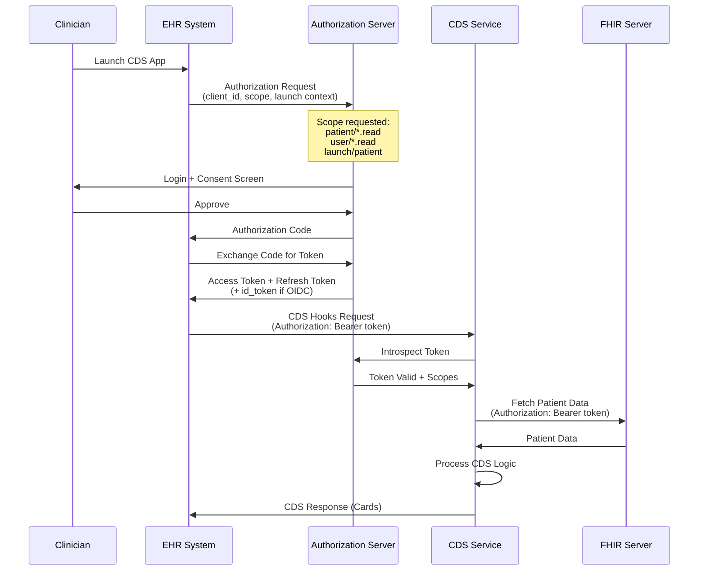

# Security & Compliance

## Regulatory Compliance Framework

### FDA Software as a Medical Device (SaMD)

#### Classification Analysis

| CDS Function | FDA Classification | Rationale | Pathway |
|--------------|-------------------|-----------|---------|
| **Drug Interaction Alerts** | Class II (Moderate Risk) | Supports treatment decisions; clinician interprets | 510(k) or De Novo |
| **Diagnosis Suggestions** | Class II (Moderate Risk) | Suggests conditions for clinician review | 510(k) or De Novo |
| **Risk Scoring** | Class II (Low-Moderate) | Calculates risk; clinician decides action | 510(k) |
| **Guideline Recommendations** | Non-Device (exempt) | Displays established guidelines | Exempt under Cures Act |

#### 21st Century Cures Act CDS Exemption Analysis

```
CDS EXEMPTION CRITERIA (Section 3060):

To qualify as non-device CDS, ALL four criteria must be met:

1. ☐ NOT intended to acquire, process, or analyze medical images,
     signals from IVD, or patterns from signals

2. ☐ Intended for displaying, analyzing, or printing medical information

3. ☐ Intended to support or provide recommendations to HCP about
     prevention, diagnosis, or treatment

4. ☐ Enables HCP to independently review the basis for recommendations

ANALYSIS FOR THIS SYSTEM:

Drug Interaction Alerts:
  Criterion 1: ✓ Does not process images/signals
  Criterion 2: ✓ Displays interaction information
  Criterion 3: ✓ Supports treatment decisions
  Criterion 4: ✓ Shows evidence and mechanism
  RESULT: Could qualify IF clinician can review basis
  RECOMMENDATION: Treat as device (conservative) due to AI component

Diagnosis Suggestions:
  Criterion 1: ✓ Does not process images (symptom-based)
  Criterion 2: ✓ Displays diagnostic possibilities
  Criterion 3: ✓ Supports diagnosis
  Criterion 4: ✗ AI model basis may not be fully reviewable
  RESULT: Does NOT qualify - ML model is "black box"
  RECOMMENDATION: Treat as Class II device

Risk Scoring (PREVENT, QRISK):
  Criterion 1: ✓ Does not process images
  Criterion 2: ✓ Displays risk calculation
  Criterion 3: ✓ Supports prevention decisions
  Criterion 4: ✓ Shows input parameters and formula
  RESULT: Qualifies for exemption (established algorithms)
  RECOMMENDATION: Document exemption; no FDA submission required
```

#### Good Machine Learning Practice (GMLP) Implementation

```
FDA GMLP PRINCIPLES MAPPING:

1. Multi-disciplinary Expertise
   Implementation:
   - ML team includes clinicians, biostatisticians, UX designers
   - Clinical advisory board reviews model changes
   - Regulatory affairs involved in design decisions

2. Good Software Engineering Practices
   Implementation:
   - Version control for all code and models
   - Automated testing pipeline
   - Code review requirements
   - Documentation standards

3. Clinical Study Participants Represent Intended Population
   Implementation:
   - Training data demographics documented
   - Bias analysis across age, sex, ethnicity
   - Validation on diverse patient cohorts

4. Training Data Independence from Test Data
   Implementation:
   - Strict data splits (train/validation/test)
   - Temporal holdout (no future data leakage)
   - External validation datasets

5. Reference Datasets Based on Best Available Methods
   Implementation:
   - Gold standard labels from physician consensus
   - Published drug interaction databases (DrugBank, FDB)
   - Validated risk calculators (PREVENT, QRISK)

6. Model Design Tailored to Data and Intended Use
   Implementation:
   - Model architecture documented and justified
   - Feature engineering clinically interpretable
   - Ensemble methods for robustness

7. Focus on Human-AI Team Performance
   Implementation:
   - Alert display designed with clinician input
   - Override workflow captures feedback
   - Human-in-the-loop for critical decisions

8. Testing Demonstrates Device Performance
   Implementation:
   - Sensitivity/specificity targets per alert type
   - Subgroup analysis for fairness
   - Real-world validation studies

9. Users Provided Clear Information
   Implementation:
   - Labeling includes limitations
   - Training materials for clinicians
   - Help documentation within UI

10. Deployed Models Monitored
    Implementation:
    - Continuous accuracy monitoring
    - Drift detection
    - Adverse event reporting workflow
```

#### Predetermined Change Control Plan (PCCP)

```
PCCP DOCUMENT STRUCTURE:

1. MODIFICATION PROTOCOL:

   Allowed Changes (Pre-Authorized):
   ┌─────────────────────────────────────────────────────────────────┐
   │ Change Type              │ Scope              │ Validation     │
   ├─────────────────────────────────────────────────────────────────┤
   │ Model retraining         │ Same architecture  │ Automated test │
   │ Feature weight update    │ ≤10% change        │ Regression test│
   │ Threshold adjustment     │ Within 5% of spec  │ Clinical review│
   │ Knowledge base update    │ New DDI pairs      │ Source verify  │
   │ Calibration update       │ Confidence scores  │ Calibration QA │
   └─────────────────────────────────────────────────────────────────┘

   Changes Requiring FDA Notification:
   - New model architecture
   - New intended use (e.g., new disease area)
   - Performance degrades below specification
   - Expansion to new patient population

2. PERFORMANCE SPECIFICATIONS:

   Drug Interaction Detection:
   - Sensitivity (Recall): ≥95% for critical interactions
   - Specificity: ≥85% overall
   - Alert precision: ≥70% for critical tier

   Diagnosis Suggestions:
   - Top-5 accuracy: ≥80%
   - Sensitivity for serious conditions: ≥90%
   - Calibration error: ≤5% ECE

3. MONITORING AND TRIGGERS:

   Performance Monitoring (Continuous):
   - Daily accuracy calculation on random sample
   - Weekly subgroup analysis
   - Monthly bias audit

   Trigger for Review:
   - Accuracy drops >2% from baseline for 3 consecutive days
   - Subgroup disparity >10%
   - Adverse event reported potentially related to CDS

4. CHANGE MANAGEMENT PROCESS:

   Pre-Authorized Change:
   1. Submit change request with justification
   2. Automated validation tests pass
   3. Clinical lead approval
   4. Staged rollout (5% → 25% → 100%)
   5. Post-deployment monitoring (7 days)
   6. Documentation update

   Non-Pre-Authorized Change:
   1. Submit FDA change notification
   2. Prepare clinical evidence
   3. Await FDA feedback
   4. Implement per FDA guidance
```

### EU Medical Device Regulation (MDR) + AI Act

#### Dual Compliance Framework

```
MDR + AI ACT COMPLIANCE MATRIX:

┌─────────────────────────────────────────────────────────────────────────────┐
│                    DUAL REGULATORY REQUIREMENTS                              │
├─────────────────────────────────────────────────────────────────────────────┤
│                                                                             │
│  MDR 2017/745 REQUIREMENTS:                                                 │
│  ─────────────────────────────────────────────────────────────────────────  │
│  • Class IIa medical device (decision support software)                     │
│  • CE marking required                                                      │
│  • Clinical evaluation with literature review                               │
│  • Post-market surveillance plan                                            │
│  • Unique Device Identification (UDI)                                       │
│  • Quality Management System (ISO 13485)                                    │
│  • Risk management (ISO 14971)                                              │
│  • Notified Body assessment                                                 │
│                                                                             │
│  AI ACT REQUIREMENTS (High-Risk AI System):                                 │
│  ─────────────────────────────────────────────────────────────────────────  │
│  • Risk management system (Article 9)                                       │
│  • Data governance (Article 10)                                             │
│  • Technical documentation (Article 11)                                     │
│  • Record-keeping (Article 12)                                              │
│  • Transparency (Article 13)                                                │
│  • Human oversight (Article 14)                                             │
│  • Accuracy, robustness, cybersecurity (Article 15)                        │
│  • Conformity assessment (Article 43)                                       │
│                                                                             │
│  COMBINED REQUIREMENTS (MDCG 2025-6 Guidance):                              │
│  ─────────────────────────────────────────────────────────────────────────  │
│  • Single Notified Body for combined assessment                             │
│  • MDR clinical investigation recognized as AI Act real-world testing       │
│  • Gap analysis between MDR and AI Act requirements                         │
│  • Harmonized technical file                                                │
│                                                                             │
└─────────────────────────────────────────────────────────────────────────────┘
```

#### AI Act Article-by-Article Compliance

| Article | Requirement | Implementation |
|---------|-------------|----------------|
| **Art. 9** | Risk Management | ISO 14971 risk file + AI-specific hazard analysis |
| **Art. 10** | Data Governance | Training data provenance, bias analysis, quality criteria |
| **Art. 11** | Technical Documentation | Algorithm description, training methodology, validation results |
| **Art. 12** | Record-Keeping | Automated logging of all predictions, inputs, outputs |
| **Art. 13** | Transparency | Clear AI labeling, user instructions, limitations disclosure |
| **Art. 14** | Human Oversight | Override capability, alert review workflow, human-in-loop |
| **Art. 15** | Accuracy & Robustness | Performance metrics, adversarial testing, cybersecurity |

### HIPAA Compliance

```
HIPAA SECURITY RULE IMPLEMENTATION:

Administrative Safeguards (§164.308):
┌─────────────────────────────────────────────────────────────────┐
│ Requirement                  │ Implementation                   │
├─────────────────────────────────────────────────────────────────┤
│ Security Officer             │ Designated CISO with CDS scope  │
│ Risk Analysis                │ Annual + on material change      │
│ Workforce Training           │ Mandatory PHI handling training  │
│ Access Management            │ RBAC + minimum necessary         │
│ Incident Response            │ 24/7 monitoring + IR team        │
│ Contingency Planning         │ DR plan with annual testing      │
└─────────────────────────────────────────────────────────────────┘

Physical Safeguards (§164.310):
┌─────────────────────────────────────────────────────────────────┐
│ Requirement                  │ Implementation                   │
├─────────────────────────────────────────────────────────────────┤
│ Facility Access              │ Cloud provider SOC2 + BAA        │
│ Workstation Use              │ Endpoint protection policies     │
│ Device & Media Controls      │ Encrypted storage, secure delete │
└─────────────────────────────────────────────────────────────────┘

Technical Safeguards (§164.312):
┌─────────────────────────────────────────────────────────────────┐
│ Requirement                  │ Implementation                   │
├─────────────────────────────────────────────────────────────────┤
│ Access Control               │ SMART on FHIR OAuth 2.0          │
│ Audit Controls               │ Immutable audit log (6yr retain) │
│ Integrity Controls           │ Hash chain verification          │
│ Transmission Security        │ TLS 1.3, mTLS for internal       │
│ Encryption                   │ AES-256 at rest, TLS in transit  │
└─────────────────────────────────────────────────────────────────┘

Breach Notification (§164.400-414):
- Detection: Automated PII access monitoring
- Assessment: 48-hour breach determination
- Notification: 60-day individual notification, HHS report
- Documentation: Breach log with remediation actions
```

### GDPR Compliance

```
GDPR REQUIREMENTS FOR AI CDS:

Legal Basis (Article 6):
- Processing PHI: Article 6(1)(c) legal obligation + Article 9(2)(h) healthcare
- Patient consent for optional features (e.g., research)

Data Subject Rights Implementation:
┌─────────────────────────────────────────────────────────────────┐
│ Right                        │ Implementation                   │
├─────────────────────────────────────────────────────────────────┤
│ Access (Art. 15)             │ Patient portal data export       │
│ Rectification (Art. 16)      │ Provider correction workflow     │
│ Erasure (Art. 17)            │ Anonymization (not delete - legal│
│                              │ retention requirements)          │
│ Portability (Art. 20)        │ FHIR export in standard format   │
│ Objection (Art. 21)          │ Opt-out of AI processing         │
│ Automated Decision (Art. 22) │ Human review available           │
└─────────────────────────────────────────────────────────────────┘

Article 22 - Automated Decision Making:
- CDS provides recommendations, not automated decisions
- Clinician always makes final decision
- Patient can request human review of AI suggestions
- Explainability (SHAP) provides meaningful information

Data Protection Impact Assessment (DPIA):
- Required for AI processing of health data
- Identifies risks and mitigations
- Reviewed annually and on significant changes
- Available to supervisory authority on request
```

---

## Authentication & Authorization

### SMART on FHIR Implementation



### Scope Definitions

| Scope | Access Level | Required For |
|-------|--------------|--------------|
| `patient/MedicationRequest.read` | Read patient's medications | DDI checking |
| `patient/Condition.read` | Read patient's conditions | Contraindication checking |
| `patient/AllergyIntolerance.read` | Read patient's allergies | Allergy alerts |
| `patient/Observation.read` | Read vitals and labs | Diagnosis, Risk scoring |
| `patient/Patient.read` | Read demographics | Risk calculations |
| `user/Practitioner.read` | Read clinician info | Alert personalization |
| `launch/patient` | Patient context from launch | Required for patient-level CDS |
| `launch/encounter` | Encounter context | Session tracking |

### Role-Based Access Control (RBAC)

```
ROLE DEFINITIONS:

┌─────────────────────────────────────────────────────────────────────────────┐
│ Role                │ Permissions                                           │
├─────────────────────────────────────────────────────────────────────────────┤
│ PRESCRIBER          │ • View DDI alerts for own patients                   │
│ (Physician, NP, PA) │ • Override alerts with justification                 │
│                     │ • View diagnosis suggestions                          │
│                     │ • View risk scores                                    │
│                     │ • Cannot modify alert thresholds                      │
├─────────────────────────────────────────────────────────────────────────────┤
│ PHARMACIST          │ • View all DDI alerts (no patient filter)            │
│                     │ • Review override requests                            │
│                     │ • Approve/reject critical overrides                   │
│                     │ • Cannot make diagnosis suggestions                   │
├─────────────────────────────────────────────────────────────────────────────┤
│ NURSE               │ • View alerts for assigned patients                  │
│                     │ • Cannot override (read-only)                         │
│                     │ • View risk scores                                    │
├─────────────────────────────────────────────────────────────────────────────┤
│ CDS_ADMIN           │ • Configure alert thresholds                         │
│                     │ • Manage knowledge base updates                       │
│                     │ • View system metrics                                 │
│                     │ • Cannot view patient data                            │
├─────────────────────────────────────────────────────────────────────────────┤
│ COMPLIANCE_OFFICER  │ • View audit logs                                    │
│                     │ • Generate compliance reports                         │
│                     │ • Access breach investigation tools                   │
│                     │ • Cannot modify any clinical data                     │
├─────────────────────────────────────────────────────────────────────────────┤
│ ML_ENGINEER         │ • Deploy model updates (staged)                      │
│                     │ • View model performance metrics                      │
│                     │ • Access training pipeline                            │
│                     │ • Cannot view patient data (anonymized only)          │
└─────────────────────────────────────────────────────────────────────────────┘
```

---

## Data Security

### Encryption at Rest

```
ENCRYPTION ARCHITECTURE:

┌─────────────────────────────────────────────────────────────────────────────┐
│                         ENCRYPTION AT REST                                   │
├─────────────────────────────────────────────────────────────────────────────┤
│                                                                             │
│  DATABASE ENCRYPTION:                                                        │
│  ─────────────────────────────────────────────────────────────────────────  │
│  • Algorithm: AES-256-GCM                                                   │
│  • Key Management: Cloud KMS (HSM-backed)                                   │
│  • Key Rotation: Automatic every 90 days                                    │
│  • Column-level encryption for PHI fields:                                  │
│    - patient_id (encrypted, searchable via HMAC)                           │
│    - mrn (encrypted)                                                        │
│    - date_of_birth (encrypted)                                              │
│    - clinical_notes (encrypted)                                             │
│                                                                             │
│  OBJECT STORAGE ENCRYPTION:                                                  │
│  ─────────────────────────────────────────────────────────────────────────  │
│  • Server-side encryption: AES-256                                          │
│  • Customer-managed keys for audit logs                                     │
│  • Bucket policies enforce encryption                                       │
│                                                                             │
│  CACHE ENCRYPTION:                                                           │
│  ─────────────────────────────────────────────────────────────────────────  │
│  • Redis: TLS for data in transit to cache                                  │
│  • Sensitive values encrypted before caching                                │
│  • Keys never contain PHI (use hashed identifiers)                          │
│                                                                             │
│  MODEL ARTIFACT ENCRYPTION:                                                  │
│  ─────────────────────────────────────────────────────────────────────────  │
│  • Model files encrypted at rest                                            │
│  • Decrypted only in secure inference environment                           │
│  • Prevents model extraction attacks                                        │
│                                                                             │
└─────────────────────────────────────────────────────────────────────────────┘
```

### Encryption in Transit

```
TLS CONFIGURATION:

External Traffic:
- Protocol: TLS 1.3 only
- Cipher suites: TLS_AES_256_GCM_SHA384, TLS_CHACHA20_POLY1305_SHA256
- Certificate: EV certificate from trusted CA
- HSTS: Enabled with 1-year max-age
- Certificate pinning: Recommended for mobile apps

Internal Traffic (Service-to-Service):
- Protocol: mTLS (mutual TLS)
- Certificate management: Service mesh (automatic rotation)
- Identity verification: SPIFFE/SPIRE
- Encryption: TLS 1.3

Database Connections:
- TLS required for all connections
- Certificate verification: Full chain validation
- Connection string: sslmode=verify-full
```

### PII/PHI Handling

```
DATA CLASSIFICATION:

┌─────────────────────────────────────────────────────────────────┐
│ Classification │ Examples                  │ Handling           │
├─────────────────────────────────────────────────────────────────┤
│ PHI-High       │ Patient name, MRN,        │ Encrypted, access  │
│                │ SSN, full DOB             │ logged, minimize   │
├─────────────────────────────────────────────────────────────────┤
│ PHI-Medium     │ Diagnosis codes, meds,    │ Encrypted at rest, │
│                │ lab values                │ access controlled  │
├─────────────────────────────────────────────────────────────────┤
│ PHI-Low        │ Age range, sex,           │ Access controlled, │
│                │ general location          │ may be aggregated  │
├─────────────────────────────────────────────────────────────────┤
│ Non-PHI        │ Drug interaction data,    │ Standard security  │
│                │ clinical guidelines       │ controls           │
└─────────────────────────────────────────────────────────────────┘

DATA MINIMIZATION:

1. CDS Processing:
   - Request only minimum required FHIR resources
   - Use prefetch to limit data transfer
   - Do not persist patient data longer than session

2. Logging:
   - Never log PHI in application logs
   - Use pseudonymized patient IDs in logs
   - Audit logs store encrypted PHI separately

3. Analytics:
   - Aggregate data before analysis
   - K-anonymity (k≥5) for patient-level analysis
   - Differential privacy for model training
```

---

## Threat Model

### Top Attack Vectors

```
┌─────────────────────────────────────────────────────────────────────────────┐
│                           THREAT MODEL                                       │
├─────────────────────────────────────────────────────────────────────────────┤
│                                                                             │
│  1. DATA POISONING OF KNOWLEDGE BASE                                         │
│  ─────────────────────────────────────────────────────────────────────────  │
│  Threat: Attacker manipulates drug interaction data to suppress alerts      │
│  Impact: CRITICAL - missed interactions could cause patient harm            │
│  Mitigations:                                                               │
│    • Signed knowledge base updates (cryptographic verification)             │
│    • Multi-source validation (require 2+ sources for critical DDI)          │
│    • Anomaly detection on KB changes                                        │
│    • Human review of all critical interaction modifications                 │
│    • Immutable audit trail of all KB changes                                │
│                                                                             │
│  2. ADVERSARIAL INPUTS TO ML MODELS                                          │
│  ─────────────────────────────────────────────────────────────────────────  │
│  Threat: Crafted inputs cause model to produce incorrect predictions        │
│  Impact: HIGH - wrong diagnosis or missed risk                              │
│  Mitigations:                                                               │
│    • Input validation and sanitization                                      │
│    • Adversarial training during model development                          │
│    • Confidence thresholds (flag low-confidence predictions)                │
│    • Ensemble models for robustness                                         │
│    • Human-in-the-loop for edge cases                                       │
│                                                                             │
│  3. ALERT SUPPRESSION ATTACK                                                 │
│  ─────────────────────────────────────────────────────────────────────────  │
│  Threat: Attacker manipulates system to hide critical alerts                │
│  Impact: CRITICAL - life-threatening interactions not shown                 │
│  Mitigations:                                                               │
│    • Alert generation is separate from alert display                        │
│    • Audit log captures all generated alerts (even if suppressed)           │
│    • Suppression rules require clinical approval                            │
│    • Alerting on unusual suppression patterns                               │
│    • Critical alerts cannot be suppressed by configuration                  │
│                                                                             │
│  4. MODEL INVERSION / EXTRACTION                                             │
│  ─────────────────────────────────────────────────────────────────────────  │
│  Threat: Attacker reconstructs training data or steals model                │
│  Impact: MEDIUM - patient privacy breach, IP theft                          │
│  Mitigations:                                                               │
│    • Rate limiting on API calls                                             │
│    • Differential privacy in training                                       │
│    • Model watermarking                                                     │
│    • Encrypted model serving                                                │
│    • Access logging and anomaly detection                                   │
│                                                                             │
│  5. PRIVILEGE ESCALATION VIA SMART TOKENS                                    │
│  ─────────────────────────────────────────────────────────────────────────  │
│  Threat: Stolen/forged token grants unauthorized data access                │
│  Impact: HIGH - unauthorized access to patient data                         │
│  Mitigations:                                                               │
│    • Short-lived access tokens (1 hour)                                     │
│    • Token binding to client certificate                                    │
│    • Scope enforcement at API gateway                                       │
│    • Token revocation on suspicious activity                                │
│    • MFA for sensitive operations                                           │
│                                                                             │
└─────────────────────────────────────────────────────────────────────────────┘
```

### DDoS Protection

```
DDOS MITIGATION LAYERS:

Layer 1: Edge Protection (CDN/WAF)
- Geographic rate limiting
- IP reputation filtering
- Challenge-response for suspicious IPs
- Anycast distribution

Layer 2: API Gateway
- Per-tenant rate limiting (token bucket)
- Request size limits (1MB max)
- Connection limits per IP
- Slow request detection (slowloris)

Layer 3: Application
- Circuit breakers prevent cascade
- Graceful degradation
- Priority queuing (critical alerts first)
- Bulkheads isolate tenants

RATE LIMITS:

┌─────────────────────────────────────────────────────────────────┐
│ Endpoint                 │ Rate Limit            │ Burst       │
├─────────────────────────────────────────────────────────────────┤
│ /cds-services/*          │ 100 req/sec/tenant    │ 200         │
│ /fhir/RiskAssessment     │ 50 req/sec/tenant     │ 100         │
│ /admin/*                 │ 10 req/sec/user       │ 20          │
│ Discovery endpoint       │ 10 req/min/IP         │ 20          │
└─────────────────────────────────────────────────────────────────┘
```

---

## AI-Specific Security Requirements

### Explainability Documentation

```
EXPLAINABILITY REQUIREMENTS:

Per-Alert Explainability:
- Every AI-generated alert includes:
  • Model version that produced it
  • Input features used (anonymized in logs)
  • Confidence score with calibration status
  • Top contributing factors (SHAP values)
  • Link to model documentation

Per-Model Explainability:
- Model card includes:
  • Intended use and limitations
  • Training data demographics
  • Performance metrics by subgroup
  • Known failure modes
  • Bias analysis results

Documentation Storage:
- Model cards in version control
- Alert explanations in audit log
- Regulatory submission package
```

### Bias Monitoring

```
BIAS MONITORING FRAMEWORK:

Monitored Demographics:
- Age groups: 0-18, 19-40, 41-65, 65+
- Sex: Male, Female
- Ethnicity: White, Black, Hispanic, Asian, Other
- Insurance: Private, Medicare, Medicaid, Uninsured

Metrics Tracked:
- True Positive Rate (Sensitivity) per group
- False Positive Rate per group
- Positive Predictive Value per group
- Alert override rate per group

Thresholds:
- TPR disparity > 10%: Flag for review
- FPR disparity > 15%: Flag for review
- Sample size < 100: Insufficient data warning

Reporting:
- Weekly automated bias report
- Monthly ML governance review
- Quarterly regulatory update

Remediation:
- Resampling training data
- Feature adjustment
- Model retraining with fairness constraints
```

### Model Versioning and Rollback

```
MODEL LIFECYCLE:

States:
- TRAINING: Model in development
- VALIDATING: Performance testing
- STAGED: Ready for production, shadow mode
- PRODUCTION: Serving live traffic
- DEPRECATED: Scheduled for removal
- ROLLED_BACK: Removed due to issue

Versioning:
- Semantic versioning: MAJOR.MINOR.PATCH
- MAJOR: Architecture change (requires FDA notification)
- MINOR: Retrained model (PCCP pre-authorized)
- PATCH: Threshold/calibration update

Rollback Procedure:
1. Detect performance degradation
2. Automated alert to ML team
3. One-click rollback to previous version
4. Traffic shift in < 5 minutes
5. Post-mortem and root cause analysis

Rollback Triggers (Automatic):
- Accuracy drops >5% for 1 hour
- Error rate >1% for 10 minutes
- Latency >2x baseline for 5 minutes

Rollback Triggers (Manual):
- Adverse event reported
- Bias detected
- Regulatory concern
```

### Human-in-the-Loop Requirements

```
HUMAN OVERSIGHT REQUIREMENTS:

1. OVERRIDE CAPABILITY:
   - All AI suggestions can be overridden by clinician
   - Override workflow captures reasoning
   - No AI decision is final without human action

2. CRITICAL ALERT REVIEW:
   - Critical (life-threatening) alerts require physician confirmation
   - Cannot be auto-suppressed or auto-dismissed
   - Pharmacy review for critical DDI overrides

3. MODEL GOVERNANCE:
   - Clinical advisory board reviews model changes
   - Ethics review for new AI capabilities
   - Regulatory review before deployment

4. CONTINUOUS MONITORING:
   - Human review of flagged predictions
   - Random sample audit of AI outputs
   - Patient safety committee oversight

5. FEEDBACK LOOP:
   - Clinician feedback captured on every interaction
   - Feedback used for model improvement
   - Clinicians informed how feedback is used
```

---

## Compliance Monitoring

### Audit Requirements

```
AUDIT LOG REQUIREMENTS:

Events Logged:
- All CDS requests (anonymized patient ID)
- All alerts generated
- All alerts displayed
- All overrides with justification
- All data access (FHIR queries)
- All authentication events
- All configuration changes
- All model deployments

Log Format:
{
  "timestamp": "ISO8601",
  "event_type": "alert_override",
  "actor": {
    "id": "hashed_user_id",
    "role": "physician",
    "organization": "org_id"
  },
  "patient": {
    "id": "encrypted_patient_id",
    "encounter": "encounter_id"
  },
  "alert": {
    "id": "alert_uuid",
    "type": "ddi",
    "severity": "critical"
  },
  "action": {
    "type": "override",
    "reason_code": "benefit_outweighs_risk",
    "justification": "encrypted_text"
  },
  "hash": {
    "previous": "abc123...",
    "current": "def456..."
  }
}

Retention:
- HIPAA: 6 years
- MDR: 10 years (after device no longer placed on market)
- GDPR: As long as processing continues + 1 year
- Practical: 10 years with archival after 1 year
```

### Compliance Dashboard Metrics

| Metric | Target | Alert Threshold |
|--------|--------|-----------------|
| Audit log completeness | 100% | Any gap |
| Consent verification success | 99.99% | < 99.9% |
| Encryption compliance | 100% | Any plaintext PHI |
| Access logging coverage | 100% | Any unlogged access |
| Override documentation rate | 100% | < 99% |
| Model version tracking | 100% | Any untracked prediction |
| Data residency compliance | 100% | Any cross-border violation |
| Breach detection time | < 24 hours | > 48 hours |
