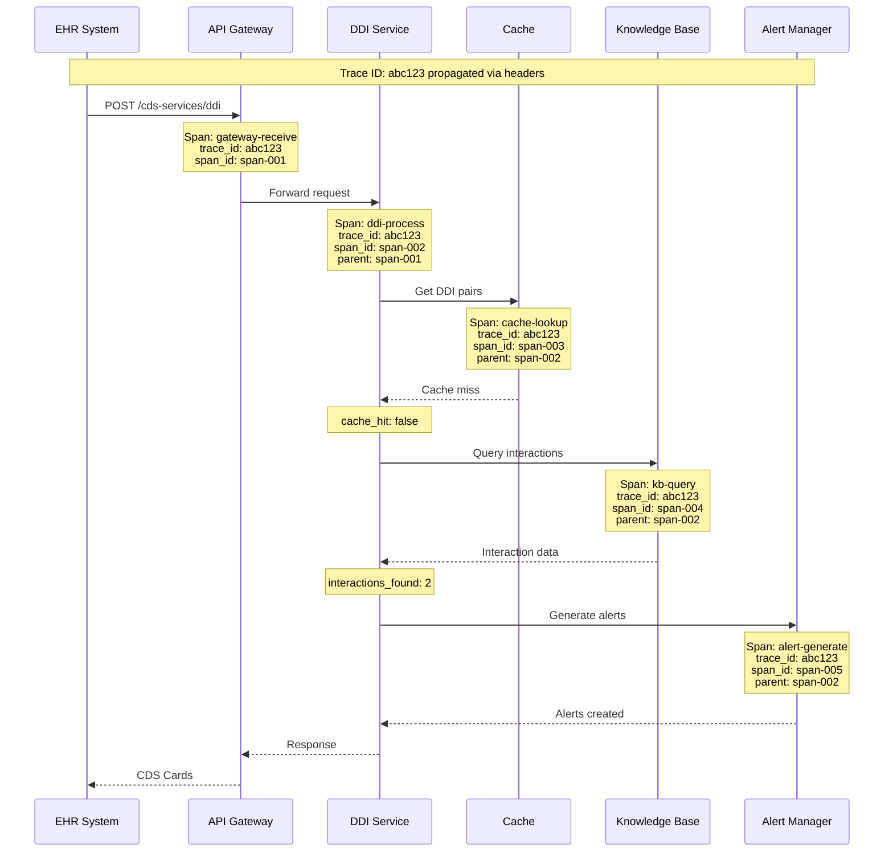

# Observability

## Metrics Framework

### RED Metrics (Request-Oriented)

| Service | Rate | Errors | Duration (p50/p95/p99) |
|---------|------|--------|------------------------|
| **API Gateway** | CDS requests/sec | 4xx, 5xx rate | 50ms / 120ms / 200ms |
| **DDI Service** | DDI checks/sec | Detection failures | 30ms / 80ms / 150ms |
| **Diagnosis Engine** | Suggestions/sec | Inference failures | 500ms / 1.2s / 2s |
| **Risk Scoring** | Calculations/sec | Model errors | 100ms / 250ms / 400ms |
| **Guideline Engine** | Rule evaluations/sec | CQL errors | 50ms / 100ms / 200ms |
| **Alert Manager** | Alerts generated/sec | Delivery failures | 20ms / 50ms / 100ms |

### USE Metrics (Resource-Oriented)

| Resource | Utilization | Saturation | Errors |
|----------|-------------|------------|--------|
| **CPU** | % usage per service | Throttling events | OOM kills |
| **Memory** | % heap/buffer usage | GC pauses > 100ms | OOM events |
| **GPU** | % utilization | Queue depth | CUDA errors |
| **Network** | Bandwidth utilization | Packet drops | Connection errors |
| **Disk I/O** | Read/write throughput | I/O wait time | Disk errors |
| **Cache** | Hit ratio, memory % | Eviction rate | Connection failures |
| **Database** | Connection pool usage | Query queue depth | Lock timeouts |

### CDS-Specific Metrics

```
CLINICAL DECISION SUPPORT METRICS:

┌─────────────────────────────────────────────────────────────────────────────┐
│                        ALERT GENERATION METRICS                              │
├─────────────────────────────────────────────────────────────────────────────┤
│                                                                             │
│  cds_alerts_generated_total                                                 │
│    Labels: alert_type (ddi|diagnosis|guideline|risk)                        │
│            severity (critical|high|moderate|low)                            │
│            tenant_id                                                        │
│                                                                             │
│  cds_alerts_delivered_total                                                 │
│    Labels: alert_type, severity, delivery_mode (interruptive|passive|info) │
│                                                                             │
│  cds_alerts_delivery_latency_seconds                                        │
│    Labels: alert_type, severity                                             │
│    Buckets: 0.01, 0.025, 0.05, 0.1, 0.25, 0.5, 1.0                         │
│                                                                             │
└─────────────────────────────────────────────────────────────────────────────┘

┌─────────────────────────────────────────────────────────────────────────────┐
│                        OVERRIDE METRICS                                      │
├─────────────────────────────────────────────────────────────────────────────┤
│                                                                             │
│  cds_alert_overrides_total                                                  │
│    Labels: alert_type, severity, reason_code, clinician_role               │
│                                                                             │
│  cds_override_rate                                                          │
│    Calculation: overrides / (overrides + acknowledged)                      │
│    Labels: alert_type, severity                                             │
│    Target: <30% for critical, <50% for high                                │
│                                                                             │
│  cds_override_with_adverse_outcome_total                                    │
│    Labels: alert_type, severity                                             │
│    Alert: Any increment triggers investigation                              │
│                                                                             │
└─────────────────────────────────────────────────────────────────────────────┘

┌─────────────────────────────────────────────────────────────────────────────┐
│                        AI MODEL METRICS                                      │
├─────────────────────────────────────────────────────────────────────────────┤
│                                                                             │
│  cds_model_inference_total                                                  │
│    Labels: model_name, model_version                                        │
│                                                                             │
│  cds_model_inference_latency_seconds                                        │
│    Labels: model_name                                                       │
│    Buckets: 0.05, 0.1, 0.25, 0.5, 1.0, 2.0, 5.0                            │
│                                                                             │
│  cds_model_confidence_score                                                 │
│    Labels: model_name, prediction_type                                      │
│    Type: Histogram                                                          │
│    Buckets: 0.5, 0.6, 0.7, 0.8, 0.9, 0.95, 0.99                            │
│                                                                             │
│  cds_model_accuracy_daily                                                   │
│    Labels: model_name, metric_type (sensitivity|specificity|ppv)           │
│    Calculation: Daily batch job against confirmed outcomes                  │
│                                                                             │
│  cds_model_drift_score                                                      │
│    Labels: model_name, feature_name                                         │
│    Calculation: KL divergence from training distribution                    │
│    Alert: >0.1 triggers review                                              │
│                                                                             │
└─────────────────────────────────────────────────────────────────────────────┘

┌─────────────────────────────────────────────────────────────────────────────┐
│                        DRUG INTERACTION METRICS                              │
├─────────────────────────────────────────────────────────────────────────────┤
│                                                                             │
│  cds_ddi_checks_total                                                       │
│    Labels: check_type (single_pair|multi_drug|condition)                   │
│                                                                             │
│  cds_ddi_interactions_detected_total                                        │
│    Labels: severity, interaction_type (direct|inferred|class)              │
│                                                                             │
│  cds_ddi_cache_hit_ratio                                                    │
│    Labels: cache_layer (l1|l2)                                              │
│    Target: L1 > 85%, L2 > 99%                                               │
│                                                                             │
│  cds_ddi_knowledge_base_age_seconds                                         │
│    Calculation: NOW() - last_kb_sync_timestamp                              │
│    Alert: >24 hours                                                         │
│                                                                             │
└─────────────────────────────────────────────────────────────────────────────┘

┌─────────────────────────────────────────────────────────────────────────────┐
│                        ALERT FATIGUE METRICS                                 │
├─────────────────────────────────────────────────────────────────────────────┤
│                                                                             │
│  cds_alerts_suppressed_total                                                │
│    Labels: suppression_reason (duplicate|similar|recent_override)          │
│                                                                             │
│  cds_alert_fatigue_index                                                    │
│    Calculation: (overrides + dismissals) / total_alerts                    │
│    Labels: clinician_specialty                                              │
│    Target: <0.5                                                             │
│                                                                             │
│  cds_alerts_per_encounter                                                   │
│    Type: Histogram                                                          │
│    Target: p50 < 3, p95 < 10                                               │
│                                                                             │
└─────────────────────────────────────────────────────────────────────────────┘
```

### Dashboard Design

```
EXECUTIVE DASHBOARD:
┌─────────────────────────────────────────────────────────────────────────────┐
│  CDS Platform Health                                    Last 24 Hours       │
├─────────────────────────────────────────────────────────────────────────────┤
│                                                                             │
│  ┌──────────────┐  ┌──────────────┐  ┌──────────────┐  ┌──────────────┐   │
│  │  Availability │  │  Latency p99 │  │  Error Rate  │  │  Alert Rate  │   │
│  │    99.97%    │  │    145ms     │  │    0.02%     │  │   12.3/min   │   │
│  │    ▲ 0.01%   │  │    ▼ 12ms    │  │    ▼ 0.01%  │  │    ▲ 1.2     │   │
│  └──────────────┘  └──────────────┘  └──────────────┘  └──────────────┘   │
│                                                                             │
│  Alerts by Severity (24h)              Override Rate by Severity            │
│  ┌────────────────────────────────┐   ┌────────────────────────────────┐  │
│  │ Critical ████░░░░░░ 2.1K      │   │ Critical █████░░░░░ 18%        │  │
│  │ High     ████████░░ 8.5K      │   │ High     ███████░░░ 35%        │  │
│  │ Moderate █████████░ 15.2K     │   │ Moderate █████████░ 52%        │  │
│  │ Low      ██████████ 45.3K     │   │ Low      █████████░ 61%        │  │
│  └────────────────────────────────┘   └────────────────────────────────┘  │
│                                                                             │
│  DDI Detection Trend                   Model Accuracy Trend                 │
│  ┌────────────────────────────────┐   ┌────────────────────────────────┐  │
│  │     ╭───╮     ╭───╮           │   │ ──────────────────────────     │  │
│  │    ╱    ╲   ╱    ╲  ╭───     │   │                     Diagnosis  │  │
│  │   ╱      ╲ ╱      ╲╱         │   │ ─ ─ ─ ─ ─ ─ ─ ─ ─ ─ ─ DDI     │  │
│  │  ╱        ╲                   │   │ · · · · · · · · · · · · Risk  │  │
│  └────────────────────────────────┘   └────────────────────────────────┘  │
│                                                                             │
└─────────────────────────────────────────────────────────────────────────────┘

OPERATIONAL DASHBOARD:
┌─────────────────────────────────────────────────────────────────────────────┐
│  Service Health Matrix                                  Real-time           │
├─────────────────────────────────────────────────────────────────────────────┤
│                                                                             │
│  Service          │ Status │ QPS  │ Latency │ Error% │ Instances │ CPU%   │
│  ─────────────────┼────────┼──────┼─────────┼────────┼───────────┼────────│
│  API Gateway      │   ✓    │ 245  │  42ms   │  0.01% │   5/5     │  45%   │
│  DDI Service      │   ✓    │ 180  │  65ms   │  0.02% │  10/10    │  52%   │
│  Diagnosis Engine │   ✓    │  35  │ 890ms   │  0.05% │   4/4     │  78%   │
│  Risk Scoring     │   ✓    │  18  │ 120ms   │  0.00% │   3/3     │  28%   │
│  Guideline Engine │   ✓    │  24  │  55ms   │  0.01% │   3/3     │  35%   │
│  Alert Manager    │   ✓    │  62  │  28ms   │  0.00% │   5/5     │  22%   │
│  Cache Cluster    │   ✓    │ 1.2K │   2ms   │  0.00% │   6/6     │  15%   │
│  Primary DB       │   ✓    │  95  │  12ms   │  0.00% │   1/1     │  38%   │
│                                                                             │
│  Circuit Breakers: All Closed                                               │
│  Knowledge Base: Updated 2h ago | Version: 2025.01.15                       │
│  Model Version: diagnosis-v2.3.1 | risk-v1.8.0                              │
│                                                                             │
└─────────────────────────────────────────────────────────────────────────────┘
```

---

## Logging

### Structured Logging Format

```json
{
  "timestamp": "2025-01-23T10:30:45.123Z",
  "level": "INFO",
  "service": "ddi-service",
  "instance": "ddi-service-7f8d9-abc12",
  "trace_id": "abc123def456",
  "span_id": "789ghi",
  "parent_span_id": "456jkl",

  "event": "ddi_check_completed",
  "duration_ms": 45,

  "context": {
    "tenant_id": "tenant-123",
    "encounter_id": "enc-456",
    "patient_id_hash": "sha256:abc...",
    "clinician_id_hash": "sha256:def..."
  },

  "request": {
    "medication_count": 5,
    "check_type": "full_med_list"
  },

  "result": {
    "interactions_found": 2,
    "max_severity": "high",
    "cache_hit": true,
    "cache_layer": "l2"
  },

  "metadata": {
    "model_version": "n/a",
    "kb_version": "2025.01.15"
  }
}
```

### Log Levels Strategy

| Level | Use Case | Examples | Retention |
|-------|----------|----------|-----------|
| **ERROR** | Failures requiring attention | Unhandled exceptions, circuit breaker open, data corruption | 90 days hot, 1 year archive |
| **WARN** | Potential issues | High latency, retry succeeded, cache miss, threshold approached | 30 days hot, 90 days archive |
| **INFO** | Normal operations | Request completed, alert generated, model inference | 7 days hot, 30 days archive |
| **DEBUG** | Troubleshooting | Feature values, cache keys, query plans | 24 hours (disabled in prod) |
| **TRACE** | Deep debugging | Raw payloads, step-by-step flow | Development only |

### PHI Redaction

```
PHI REDACTION RULES:

1. AUTOMATIC REDACTION:
   Fields redacted before logging:
   - patient_name → "[REDACTED]"
   - mrn → "[REDACTED]"
   - ssn → "[REDACTED]"
   - date_of_birth → "[REDACTED]"
   - address → "[REDACTED]"
   - phone → "[REDACTED]"
   - email → "[REDACTED]"

2. PSEUDONYMIZATION:
   Fields hashed for correlation:
   - patient_id → sha256(patient_id + daily_salt)
   - clinician_id → sha256(clinician_id + daily_salt)
   - encounter_id → preserved (no PHI)

3. MEDICATION/DIAGNOSIS CODES:
   - RxCUI codes: Logged (not PHI)
   - ICD-10 codes: Logged (not PHI)
   - Free-text clinical notes: "[CLINICAL_NOTE_REDACTED]"

4. AUDIT LOG EXCEPTION:
   - Audit logs may contain encrypted PHI
   - Separate storage with stricter access control
   - Decryption requires compliance officer approval

IMPLEMENTATION:

FUNCTION redact_log_entry(entry):
    FOR EACH field IN PHI_FIELDS:
        IF entry.contains(field):
            entry[field] = "[REDACTED]"

    FOR EACH field IN PSEUDONYM_FIELDS:
        IF entry.contains(field):
            entry[field] = sha256(entry[field] + get_daily_salt())

    RETURN entry
```

---

## Distributed Tracing

### Trace Propagation Strategy



### Key Spans to Instrument

| Span Name | Service | Key Attributes |
|-----------|---------|----------------|
| `gateway.receive` | API Gateway | tenant_id, hook_type, auth_method |
| `auth.validate` | Auth Service | token_type, scopes, valid |
| `consent.verify` | Consent Service | patient_id, purpose, decision, cache_hit |
| `ddi.check` | DDI Service | med_count, interactions_found, max_severity |
| `ddi.cache_lookup` | DDI Service | cache_layer, hit, key_count |
| `ddi.kb_query` | DDI Service | query_type, result_count, duration_ms |
| `diagnosis.inference` | Diagnosis Engine | model_version, feature_count, top_confidence |
| `diagnosis.explain` | XAI Service | method (shap/lime), feature_count |
| `risk.calculate` | Risk Service | risk_type, model_version, score |
| `guideline.evaluate` | Guideline Engine | guideline_id, rules_evaluated, matches |
| `alert.generate` | Alert Manager | alert_type, severity, display_mode |
| `alert.deliver` | Alert Manager | delivery_status, latency_ms |
| `audit.log` | Audit Service | event_type, success |

### Trace Sampling Strategy

```
SAMPLING CONFIGURATION:

1. HEAD-BASED SAMPLING (Decision at trace start):
   - Default rate: 10% of all requests
   - High-value traces: 100%
     * Errors (any span with error=true)
     * High latency (>500ms)
     * Critical alerts
     * Override events

2. TAIL-BASED SAMPLING (Decision after trace completes):
   - Collect all spans initially
   - Keep if:
     * Any span has error
     * Total duration > p99
     * Contains critical alert
   - Drop if:
     * Simple cache-hit flow
     * Normal latency
     * No alerts generated

3. ATTRIBUTE-BASED SAMPLING:
   - Always sample:
     * tenant_id IN high_value_tenants
     * clinician_id IN monitored_users
     * alert_severity = 'critical'
   - Reduced sampling (1%):
     * Healthcheck requests
     * Discovery endpoint

IMPLEMENTATION:

sampler:
  type: "parent_based"
  root:
    type: "trace_id_ratio"
    ratio: 0.1
  remote_parent_sampled: "always_on"
  remote_parent_not_sampled: "always_off"

  override_rules:
    - match:
        span_name: "alert.generate"
        attributes:
          severity: "critical"
      sample: always_on

    - match:
        span_name: "*.error"
      sample: always_on
```

---

## Alerting

### Critical Alerts (Page-Worthy)

| Alert | Condition | Response Time | Escalation |
|-------|-----------|---------------|------------|
| **Service Down** | Any core service unavailable >2 min | 5 min | Primary → Secondary → Manager |
| **Error Rate Spike** | Error rate >1% for 5 min | 5 min | Primary on-call |
| **Critical Alert Delivery Failure** | Any critical alert not delivered | Immediate | Primary + Clinical lead |
| **Database Failover** | Primary DB promoted | Immediate | Primary + DBA |
| **Model Accuracy Drop** | Accuracy <90% (daily) | 4 hours | ML team + Clinical |
| **Breach Detected** | PHI access anomaly | Immediate | Security + Compliance + Legal |
| **Circuit Breaker Open** | Any circuit breaker open >5 min | 5 min | Primary on-call |

### Warning Alerts

| Alert | Condition | Response Time | Action |
|-------|-----------|---------------|--------|
| **High Latency** | p99 >300ms for 10 min | 30 min | Investigate, scale if needed |
| **Cache Hit Ratio Low** | L2 hit ratio <95% | 1 hour | Check KB sync, warm cache |
| **Override Rate Spike** | Override rate >50% for severity | 4 hours | Review alert thresholds |
| **Model Drift Detected** | Drift score >0.1 | 24 hours | Evaluate retraining |
| **KB Update Stale** | No update >48 hours | 24 hours | Check sync pipeline |
| **Disk Space Low** | <20% free | 4 hours | Archive old data, expand |
| **Certificate Expiring** | <30 days to expiry | 7 days | Renew certificate |

### Alert Configuration

```yaml
# Prometheus Alertmanager Rules

groups:
  - name: cds-critical
    rules:
      - alert: CDSServiceDown
        expr: up{job=~"cds-.*"} == 0
        for: 2m
        labels:
          severity: critical
          team: cds-platform
        annotations:
          summary: "CDS service {{ $labels.job }} is down"
          runbook: "https://runbooks.example.com/cds-service-down"

      - alert: CriticalAlertDeliveryFailure
        expr: rate(cds_alerts_delivery_failures_total{severity="critical"}[5m]) > 0
        for: 1m
        labels:
          severity: critical
          team: cds-platform
        annotations:
          summary: "Critical CDS alerts failing to deliver"
          runbook: "https://runbooks.example.com/alert-delivery-failure"

      - alert: ErrorRateHigh
        expr: |
          sum(rate(http_requests_total{status=~"5..", job=~"cds-.*"}[5m]))
          /
          sum(rate(http_requests_total{job=~"cds-.*"}[5m])) > 0.01
        for: 5m
        labels:
          severity: critical
          team: cds-platform
        annotations:
          summary: "CDS error rate above 1%"

  - name: cds-warning
    rules:
      - alert: HighLatency
        expr: histogram_quantile(0.99, rate(http_request_duration_seconds_bucket{job=~"cds-.*"}[5m])) > 0.3
        for: 10m
        labels:
          severity: warning
          team: cds-platform
        annotations:
          summary: "CDS p99 latency above 300ms"

      - alert: CacheHitRatioLow
        expr: cds_ddi_cache_hit_ratio{cache_layer="l2"} < 0.95
        for: 15m
        labels:
          severity: warning
          team: cds-platform
        annotations:
          summary: "DDI cache hit ratio below 95%"

      - alert: ModelDriftDetected
        expr: cds_model_drift_score > 0.1
        for: 1h
        labels:
          severity: warning
          team: ml-engineering
        annotations:
          summary: "Model drift detected for {{ $labels.model_name }}"
```

### Runbook References

| Alert | Runbook |
|-------|---------|
| Service Down | Check pod status, review logs, restart if needed, check dependencies |
| Error Rate High | Check error logs, identify error type, check recent deployments, rollback if needed |
| Alert Delivery Failure | Check alert manager health, verify EHR connectivity, check rate limits |
| Database Failover | Verify new primary, check replication lag, update connection strings |
| Model Accuracy Drop | Review recent predictions, check input data quality, consider rollback |
| Circuit Breaker Open | Identify failing dependency, check dependency health, wait or bypass |
| Cache Hit Ratio Low | Check KB sync status, verify cache cluster health, warm cache |

---

## Compliance Dashboards

### Audit Compliance Dashboard

```
AUDIT COMPLIANCE DASHBOARD:
┌─────────────────────────────────────────────────────────────────────────────┐
│  Compliance Status                                      Current Period      │
├─────────────────────────────────────────────────────────────────────────────┤
│                                                                             │
│  Audit Log Metrics                                                          │
│  ┌──────────────────┐  ┌──────────────────┐  ┌──────────────────┐         │
│  │ Completeness     │  │ Integrity        │  │ Retention        │         │
│  │    100.00%       │  │    100.00%       │  │    Compliant     │         │
│  │    ✓ Passing     │  │    ✓ Verified    │  │    6yr policy    │         │
│  └──────────────────┘  └──────────────────┘  └──────────────────┘         │
│                                                                             │
│  Access Control Metrics                                                     │
│  ┌────────────────────────────────────────────────────────────────────┐   │
│  │ Metric                              │ Value    │ Target  │ Status  │   │
│  ├────────────────────────────────────────────────────────────────────┤   │
│  │ Consent verification success rate   │ 99.98%   │ 99.9%   │   ✓     │   │
│  │ Unauthorized access attempts        │ 0        │ 0       │   ✓     │   │
│  │ Break-the-glass events              │ 3        │ N/A     │   ⚠     │   │
│  │ Access logged coverage              │ 100%     │ 100%    │   ✓     │   │
│  └────────────────────────────────────────────────────────────────────┘   │
│                                                                             │
│  Override Documentation                                                     │
│  ┌────────────────────────────────────────────────────────────────────┐   │
│  │ Override Type            │ Count   │ Documented │ Rate    │        │   │
│  ├────────────────────────────────────────────────────────────────────┤   │
│  │ Critical DDI override    │ 127     │ 127        │ 100%    │   ✓    │   │
│  │ High DDI override        │ 892     │ 890        │ 99.8%   │   ✓    │   │
│  │ Diagnosis rejection      │ 234     │ 234        │ 100%    │   ✓    │   │
│  └────────────────────────────────────────────────────────────────────┘   │
│                                                                             │
└─────────────────────────────────────────────────────────────────────────────┘
```

### Model Governance Dashboard

```
MODEL GOVERNANCE DASHBOARD:
┌─────────────────────────────────────────────────────────────────────────────┐
│  AI Model Compliance                                    PCCP Status         │
├─────────────────────────────────────────────────────────────────────────────┤
│                                                                             │
│  Model Inventory                                                            │
│  ┌────────────────────────────────────────────────────────────────────┐   │
│  │ Model               │ Version │ Status     │ Last Validated │ PCCP │   │
│  ├────────────────────────────────────────────────────────────────────┤   │
│  │ DDI Detection       │ v1.4.2  │ Production │ 2025-01-20     │  ✓   │   │
│  │ Diagnosis Suggest   │ v2.3.1  │ Production │ 2025-01-18     │  ✓   │   │
│  │ CV Risk (PREVENT)   │ v1.8.0  │ Production │ 2025-01-15     │  ✓   │   │
│  │ Diabetes Risk       │ v1.2.0  │ Production │ 2025-01-10     │  ✓   │   │
│  │ Diagnosis v2.4.0    │ v2.4.0  │ Staged     │ Testing        │  -   │   │
│  └────────────────────────────────────────────────────────────────────┘   │
│                                                                             │
│  Performance vs. Specification                                              │
│  ┌────────────────────────────────────────────────────────────────────┐   │
│  │ Model            │ Metric      │ Spec   │ Actual │ Status │       │   │
│  ├────────────────────────────────────────────────────────────────────┤   │
│  │ DDI Detection    │ Sensitivity │ ≥95%   │ 96.2%  │   ✓    │       │   │
│  │ DDI Detection    │ Specificity │ ≥85%   │ 88.5%  │   ✓    │       │   │
│  │ Diagnosis        │ Top-5 Acc   │ ≥80%   │ 83.1%  │   ✓    │       │   │
│  │ Diagnosis        │ Calibration │ ≤5%ECE │ 3.2%   │   ✓    │       │   │
│  │ CV Risk          │ C-Statistic │ ≥0.75  │ 0.79   │   ✓    │       │   │
│  └────────────────────────────────────────────────────────────────────┘   │
│                                                                             │
│  Bias Monitoring (Last 7 Days)                                              │
│  ┌────────────────────────────────────────────────────────────────────┐   │
│  │ Demographic       │ Diagnosis TPR │ Disparity │ Status  │          │   │
│  ├────────────────────────────────────────────────────────────────────┤   │
│  │ Age 0-40 vs 65+   │ 84% vs 81%   │ 3%        │   ✓     │          │   │
│  │ Male vs Female    │ 82% vs 83%   │ 1%        │   ✓     │          │   │
│  │ White vs Black    │ 83% vs 80%   │ 3%        │   ✓     │          │   │
│  │ White vs Hispanic │ 83% vs 82%   │ 1%        │   ✓     │          │   │
│  └────────────────────────────────────────────────────────────────────┘   │
│                                                                             │
│  Change Log (Last 30 Days)                                                  │
│  ┌────────────────────────────────────────────────────────────────────┐   │
│  │ Date       │ Model          │ Change Type    │ Approved By │        │   │
│  ├────────────────────────────────────────────────────────────────────┤   │
│  │ 2025-01-18 │ Diagnosis v2.3 │ Calibration    │ Dr. Smith   │        │   │
│  │ 2025-01-15 │ CV Risk v1.8   │ Threshold Adj  │ Dr. Jones   │        │   │
│  │ 2025-01-10 │ Diabetes v1.2  │ Retrain        │ ML Gov Board│        │   │
│  └────────────────────────────────────────────────────────────────────┘   │
│                                                                             │
└─────────────────────────────────────────────────────────────────────────────┘
```
