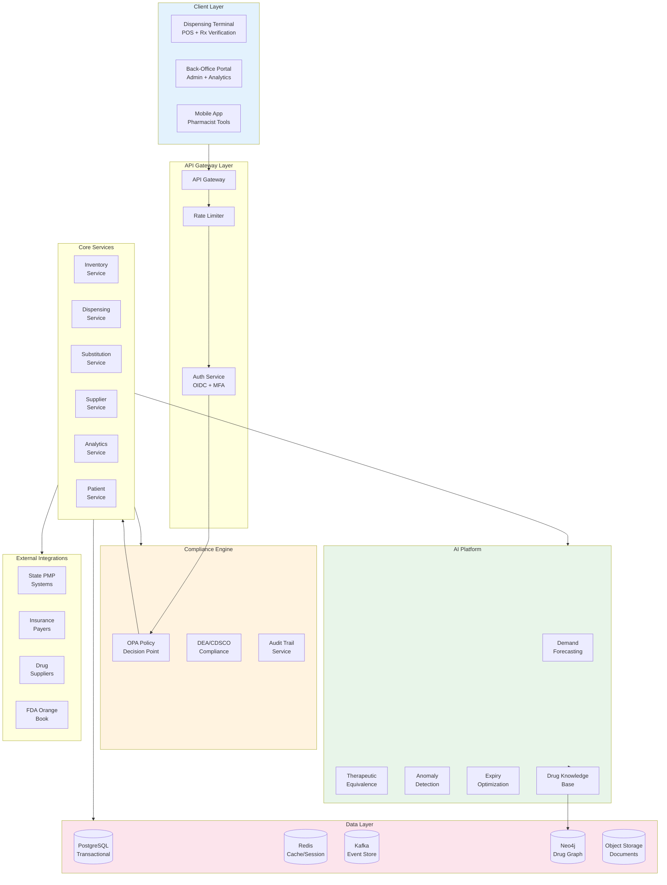

# Compliance First AI Native Pharmacy Operating System - System Design

[Back to System Design Index](../README.md)

---

## System Overview

A **Compliance First AI Native Pharmacy Operating System** is a cloud SaaS platform designed to manage end-to-end pharmacy operations while maintaining strict regulatory compliance across multiple jurisdictions. The system combines traditional pharmacy management (inventory, dispensing, billing) with AI-native capabilities (medication substitution, demand forecasting, anomaly detection) and a compliance-first architecture that enforces DEA, CDSCO, HIPAA, and state pharmacy board regulations at every transaction.

The defining architectural challenges include: (1) **multi-jurisdiction compliance enforcement** using policy engines that adapt to DEA (US), CDSCO (India), and 50+ state pharmacy board rules, (2) **AI-powered medication substitution** leveraging FDA Orange Book therapeutic equivalence codes and formulary optimization, (3) **CRDT-based inventory management** enabling conflict-free multi-terminal operations with FEFO (First Expiry First Out) batch tracking, (4) **controlled substance tracking** with real-time PMP (Prescription Monitoring Program) integration and DEA ARCOS reporting, and (5) **predictive inventory optimization** reducing waste through demand forecasting and expiry prediction.

Real-world implementations like CVS Caremark's Enterprise Pharmacy System, Walgreens' Proprietary PMS, and Apollo Pharmacy's Digital Platform demonstrate the complexity of pharmacy operations at scale, while this design extends these patterns with AI-native intelligence and compliance-first architecture.

---

## Key Characteristics

| Characteristic | Value | Implication |
|----------------|-------|-------------|
| **Traffic Pattern** | Write-heavy (dispensing, inventory updates) | Event sourcing, CRDT sync |
| **Consistency Model** | Strong for controlled substances, eventual for analytics | Hybrid consistency strategy |
| **Availability Target** | 99.99% for dispensing, 99.9% for AI features | Multi-region, graceful degradation |
| **Latency Target** | <500ms dispensing, <2s substitution lookup | Edge caching, pre-computed suggestions |
| **Compliance Mode** | Real-time policy enforcement | OPA-based decision engine |
| **AI Processing** | Cloud-native with self-hosted models (HIPAA) | No patient data to external APIs |
| **Offline Capability** | 24+ hours with controlled substance limits | CRDT sync, local policy cache |

---

## Complexity Rating

| Aspect | Rating | Reason |
|--------|--------|--------|
| **Overall** | Very High | Multi-jurisdiction compliance + AI + inventory + pharmacy domain |
| **Compliance Engine** | Very High | DEA, CDSCO, HIPAA, 50+ state boards with real-time enforcement |
| **Medication Substitution** | High | Orange Book integration, formulary matching, safety checks |
| **Inventory Management** | High | CRDT sync, batch tracking, FEFO, expiry optimization |
| **Controlled Substances** | High | PMP integration, ARCOS reporting, diversion detection |
| **Demand Forecasting** | Medium | Time-series ML with seasonality |

---

## Quick Navigation

| Document | Description |
|----------|-------------|
| [01 - Requirements & Estimations](./01-requirements-and-estimations.md) | Functional/Non-functional requirements, capacity for 10K pharmacy chain |
| [02 - High-Level Design](./02-high-level-design.md) | Architecture, data flows, key decisions |
| [03 - Low-Level Design](./03-low-level-design.md) | Data model, CRDT schemas, drug graph, APIs, algorithms |
| [04 - Deep Dive & Bottlenecks](./04-deep-dive-and-bottlenecks.md) | Controlled substances, substitution engine, expiry management |
| [05 - Scalability & Reliability](./05-scalability-and-reliability.md) | Scaling strategy, disaster recovery |
| [06 - Security & Compliance](./06-security-and-compliance.md) | DEA, CDSCO, HIPAA compliance, OPA policies, threat model |
| [07 - Observability](./07-observability.md) | Metrics, logging, alerting, dashboards |
| [08 - Interview Guide](./08-interview-guide.md) | 45-min pacing, trap questions, trade-offs |

---

## Core Pharmacy Modules (AI-Native)

| Module | Core Functions | AI Enhancement |
|--------|---------------|----------------|
| **Inventory Management** | Stock levels, batch tracking, expiry monitoring, reorder points, SKU management | Demand forecasting, expiry optimization, auto-reorder suggestions |
| **Dispensing/POS** | Prescription fulfillment, OTC sales, billing, tax compliance, payment processing | Fraud detection, patient verification, real-time DDI alerts |
| **Medication Substitution** | Generic alternatives, therapeutic equivalence, DAW override | Orange Book matching, formulary optimization, cost savings calculation |
| **Supplier Management** | Purchase orders, vendor performance, payment tracking, returns | Supplier recommendation, price prediction, lead time optimization |
| **Sales Analytics** | Top sellers, slow movers, margin analysis, ABC classification | Trend prediction, markdown optimization, category insights |
| **Regulatory Compliance** | Drug licenses, Schedule H/H1/X tracking, DEA reporting, PMP | Compliance scoring, predictive violation alerts, audit preparation |

---

## Architecture Overview



---

## Key Design Decisions

| Decision | Choice | Rationale |
|----------|--------|-----------|
| **Compliance Engine** | OPA (Open Policy Agent) | Declarative policies, auditable, version-controlled |
| **Inventory Sync** | CRDT (PN-Counter) | Conflict-free merge across terminals without coordination |
| **Drug Knowledge Base** | Neo4j Graph + RxNorm | Fast therapeutic equivalence traversal, DDI detection |
| **AI Model Hosting** | Self-hosted (HIPAA) | Patient data cannot leave tenant boundary |
| **Expiry Tracking** | Batch-level FEFO | Precise waste reduction, regulatory requirement |
| **Controlled Substance Log** | Append-only with hash chain | Immutable audit trail, tamper detection |
| **POS Offline** | SQLite + CRDT sync | Rural pharmacies, connectivity resilience |

---

## Pharmacy Operating System vs Generic POS

| Aspect | Generic POS | Pharmacy Operating System |
|--------|-------------|---------------------------|
| **Regulatory Burden** | Sales tax, PCI-DSS | DEA, CDSCO, HIPAA, State boards, PMP |
| **Inventory Complexity** | Simple SKU tracking | Batch, lot, expiry, temperature, controlled schedules |
| **Transaction Flow** | Scan → Pay | Rx Intake → Verification → DDI Check → Insurance → Fill → Counseling |
| **Substitution** | N/A | Therapeutic equivalence, formulary, DAW codes |
| **Customer Data** | Basic profile | Protected health information (PHI) |
| **Audit Requirements** | Financial only | Clinical, controlled substance, access logs |
| **AI Opportunities** | Fraud detection | Substitution, DDI, adherence, demand, diversion |

---

## When to Use This Design

**Use This Design When:**
- Building a pharmacy management system for retail or hospital pharmacy
- Multi-jurisdiction compliance is required (US states, India, etc.)
- AI features are core requirements (substitution, forecasting)
- Controlled substance dispensing is in scope
- Multi-terminal or multi-location operation
- Insurance claim adjudication is needed

**Do NOT Use When:**
- Simple OTC retail without prescription handling
- Single jurisdiction with minimal compliance burden
- No controlled substance handling
- Basic inventory without batch/expiry tracking
- No insurance or patient data

---

## Real-World Implementations

| Platform | Scale | Notable Features |
|----------|-------|-----------------|
| **CVS Caremark** | 9,900+ pharmacies | Integrated PBM, specialty pharmacy, MinuteClinic |
| **Walgreens** | 8,900+ pharmacies | Digital Rx, drive-thru, telehealth integration |
| **Apollo Pharmacy** | 5,600+ pharmacies (India) | CDSCO compliance, multi-city inventory |
| **McKesson EnterpriseRx** | SaaS for independents | Cloud-first, PMP integration |
| **PioneerRx** | Independent pharmacies | Workflow optimization, DIR fee management |
| **Liberty Software** | Hospital outpatient | 340B compliance, specialty dispensing |

---

## Technology Stack (Reference)

| Layer | Technology Options | Selection Criteria |
|-------|-------------------|-------------------|
| **API Gateway** | Kong, AWS API Gateway | Rate limiting, authentication |
| **Policy Engine** | OPA, Cedar | Declarative compliance policies |
| **Transactional DB** | PostgreSQL, CockroachDB | ACID, multi-region |
| **Graph DB** | Neo4j, Amazon Neptune | Drug knowledge graph |
| **Cache** | Redis, Memcached | Session, formulary cache |
| **Event Store** | Kafka, Pulsar | Audit events, CDC |
| **Object Storage** | S3, GCS | Documents, reports |
| **AI/ML** | TensorFlow, PyTorch | Self-hosted for HIPAA |
| **Terminal OS** | Windows, Linux | POS integration |

---

## Quick Reference Card

```
┌─────────────────────────────────────────────────────────────────┐
│   COMPLIANCE FIRST AI NATIVE PHARMACY OS - QUICK REFERENCE      │
├─────────────────────────────────────────────────────────────────┤
│                                                                 │
│  SCALE TARGETS               KEY PATTERNS                      │
│  ─────────────               ────────────                      │
│  • 10K pharmacies            • Compliance-first (OPA)          │
│  • 1M prescriptions/day      • CRDT inventory sync             │
│  • 100M drug SKUs            • Orange Book substitution        │
│  • 500 txn/day/pharmacy      • FEFO batch management           │
│  • <500ms dispensing         • Event sourcing audit            │
│                                                                 │
├─────────────────────────────────────────────────────────────────┤
│                                                                 │
│  AI FEATURES                 COMPLIANCE FRAMEWORKS             │
│  ───────────                 ────────────────────               │
│  • Medication substitution   • DEA (US) - Schedule II-V        │
│  • Demand forecasting        • CDSCO (India) - H/H1/X          │
│  • Expiry optimization       • HIPAA - PHI protection          │
│  • Anomaly/diversion detect  • State Pharmacy Boards           │
│  • DDI alert enhancement     • PMP Integration                 │
│                                                                 │
├─────────────────────────────────────────────────────────────────┤
│                                                                 │
│  CRITICAL INTEGRATIONS       DATA CONSISTENCY                  │
│  ─────────────────────       ────────────────                  │
│  • State PMP systems         • Strong: Controlled substances   │
│  • FDA Orange Book           • Strong: Financial transactions  │
│  • Insurance payers (NCPDP)  • Eventual: Inventory counts      │
│  • Drug wholesalers          • Eventual: Analytics             │
│  • RxNorm/DrugBank           • CRDT: Multi-terminal sync       │
│                                                                 │
├─────────────────────────────────────────────────────────────────┤
│                                                                 │
│  INTERVIEW KEYWORDS                                             │
│  ─────────────────                                              │
│  Orange Book, Therapeutic Equivalence, TE Codes, CRDT,         │
│  FEFO, PMP, ARCOS, Schedule H1, NCPDP, DAW Codes,              │
│  DEA CSOS, Formulary Tier, Prior Authorization,                │
│  Demand Forecasting, Diversion Detection, HIPAA PHI            │
│                                                                 │
└─────────────────────────────────────────────────────────────────┘
```

---

## Interview Readiness Checklist

| Topic | Must Know | Deep Dive |
|-------|-----------|-----------|
| Compliance | DEA schedules, HIPAA basics | OPA policies, PMP integration |
| Substitution | Orange Book TE codes | Formulary optimization, DAW |
| Inventory | Batch tracking, FEFO | CRDT implementation, sync |
| Controlled Substances | Schedule types, logging | ARCOS, diversion ML |
| AI Features | Demand forecasting concept | Time-series models, ensemble |
| Security | PHI encryption, MFA | Field-level encryption, HSM |
| Scaling | Sharding by pharmacy | Multi-region, offline mode |

---

## Related Systems

- [Distributed LRU Cache](../1.4-distributed-lru-cache/00-index.md) - Formulary and drug cache patterns
- [AI Native Offline First POS](../2.22-ai-native-offline-first-pos/00-index.md) - CRDT inventory, offline sync
- [Compliance First AI Native EMR/EHR/PHR](../2.23-compliance-first-ai-native-emr-ehr-phr/00-index.md) - Healthcare compliance patterns
- [AI-Powered Clinical Decision Support](../2.24-ai-powered-clinical-decision-support/00-index.md) - Drug knowledge graph, DDI detection
- [Compliance-First AI-Native Payroll Engine](../2.20-compliance-first-ai-native-payroll-engine/00-index.md) - Multi-jurisdiction compliance engine

---

## References

- FDA Orange Book - Approved Drug Products with Therapeutic Equivalence Evaluations
- DEA Diversion Control - Pharmacist's Manual
- NCPDP Standards - Telecommunication Standard and SCRIPT
- CDSCO - Drugs and Cosmetics Rules, 1945
- RxNorm - National Library of Medicine Drug Nomenclature
- DrugBank - Comprehensive Drug Database
- CVS Health Engineering Blog - Pharmacy Technology at Scale
- NABP - National Association of Boards of Pharmacy Standards
