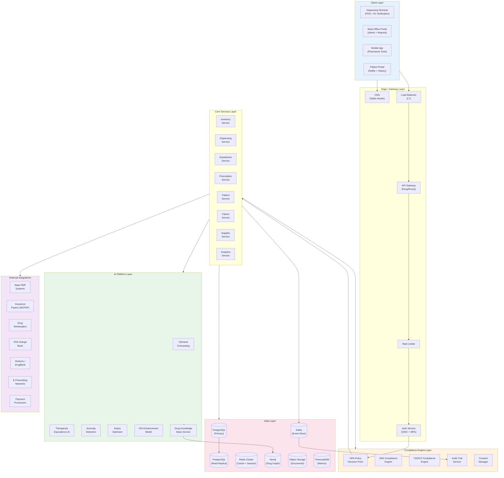
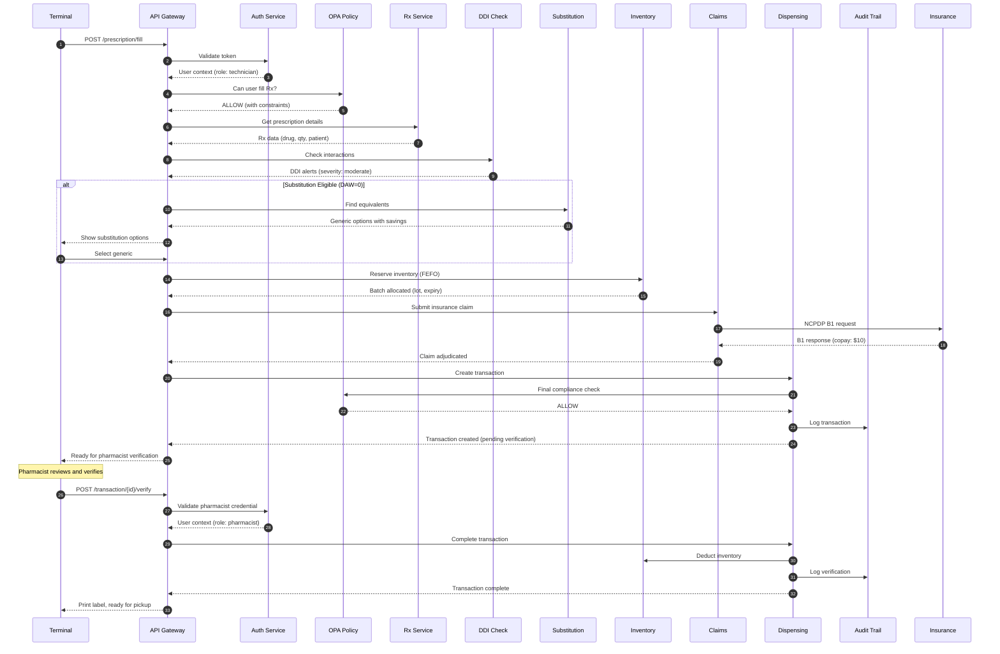
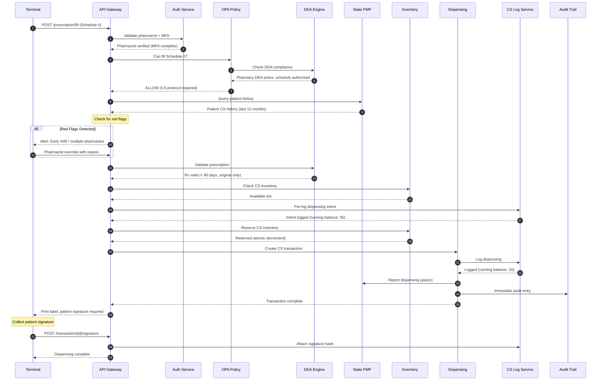
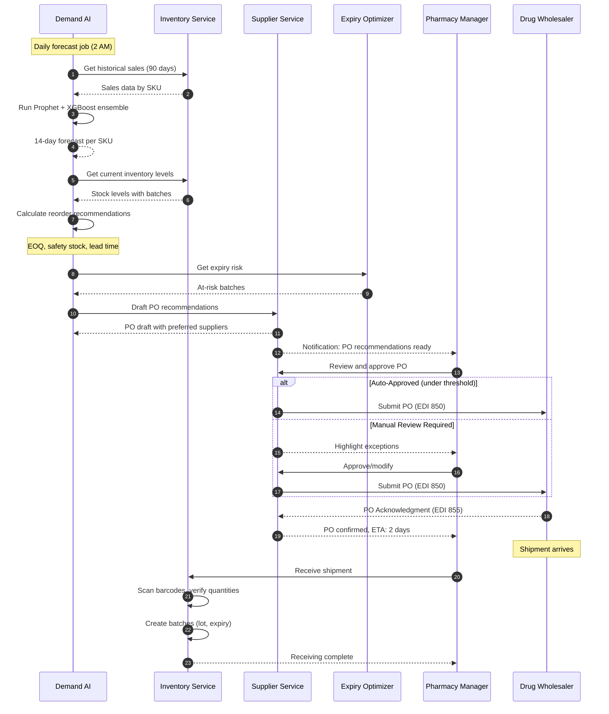
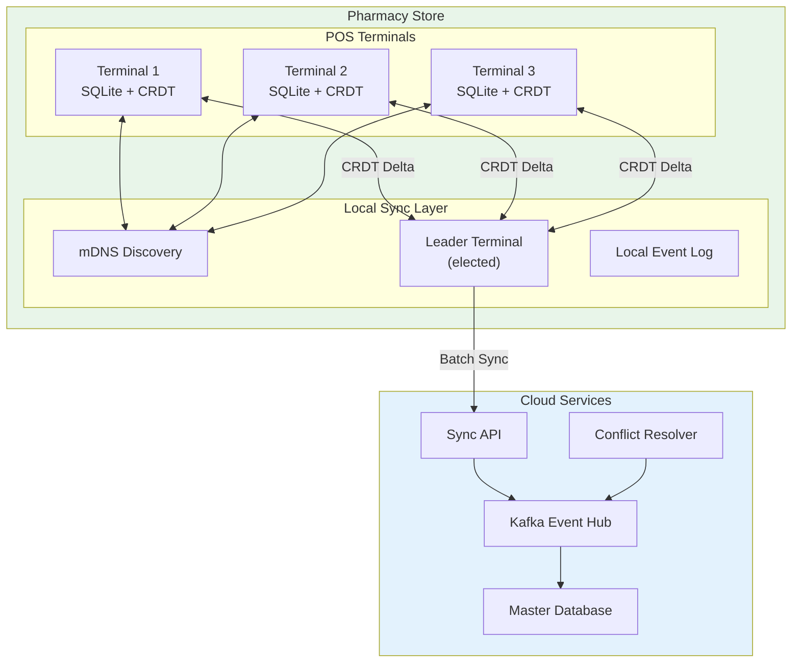
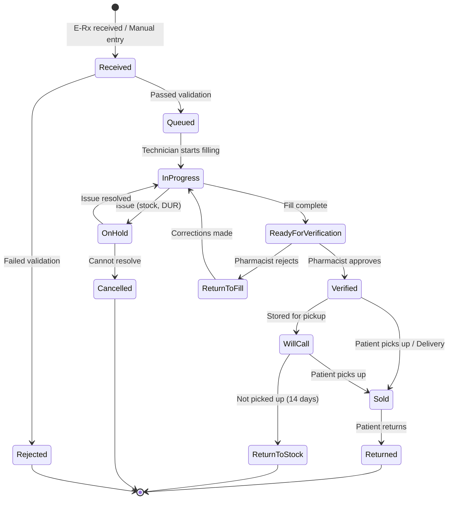
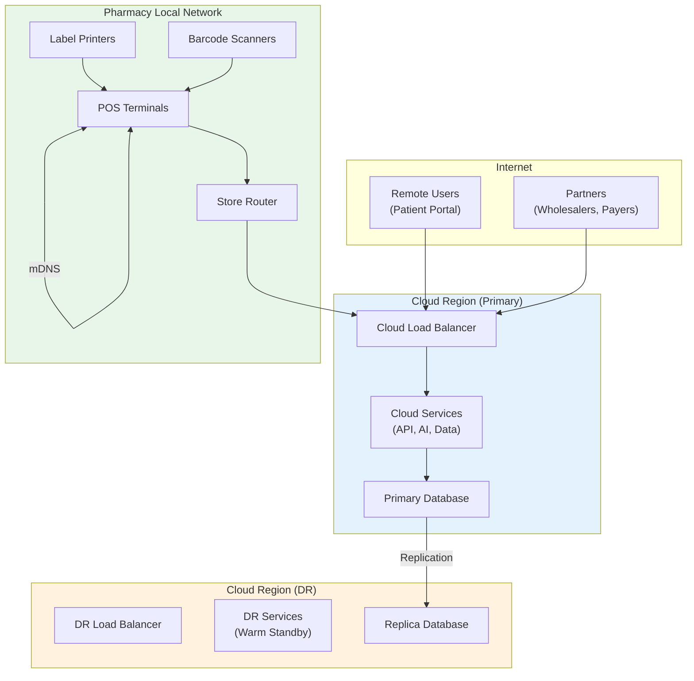

# High-Level Design

[Back to Index](./00-index.md)

---

## System Architecture Diagram

---

## Component Overview

### Client Layer

| Component | Technology | Purpose |
|-----------|------------|---------|
| **Dispensing Terminal** | Electron/React, SQLite | Primary POS with offline capability, Rx verification |
| **Back-Office Portal** | React SPA | Admin, reporting, inventory management |
| **Mobile App** | React Native | Pharmacist on-the-go, alerts, approvals |
| **Patient Portal** | React SPA | Refill requests, prescription history, billing |

### Edge / Gateway Layer

| Component | Technology | Purpose |
|-----------|------------|---------|
| **CDN** | CloudFront/Fastly | Static assets, reduced latency |
| **Load Balancer** | ALB/HAProxy | L7 routing, SSL termination |
| **API Gateway** | Kong/Envoy | Routing, rate limiting, request transformation |
| **Auth Service** | Keycloak/Auth0 | OIDC, SAML, MFA for controlled substances |

### Compliance Engine Layer

| Component | Technology | Purpose |
|-----------|------------|---------|
| **OPA Policy Decision Point** | Open Policy Agent | Real-time policy evaluation |
| **DEA Compliance Engine** | Custom + OPA | Schedule verification, ARCOS preparation |
| **CDSCO Compliance Engine** | Custom + OPA | Schedule H/H1/X rules |
| **Audit Trail Service** | Kafka + PostgreSQL | Immutable event log |
| **Consent Manager** | Custom | Patient consent tracking (HIPAA) |

### Core Services Layer

| Service | Responsibility | Key APIs |
|---------|---------------|----------|
| **Inventory Service** | Stock levels, batches, expiry, FEFO | `GET/POST /inventory`, `POST /receive`, `POST /adjust` |
| **Dispensing Service** | Transaction processing, POS | `POST /dispense`, `POST /return`, `GET /transaction` |
| **Substitution Service** | Generic alternatives, cost savings | `GET /equivalents`, `POST /substitute` |
| **Prescription Service** | Rx management, refills | `POST /prescription`, `POST /refill`, `GET /patient/rx` |
| **Patient Service** | Patient profiles, allergies | `GET/POST /patient`, `GET /patient/medications` |
| **Claims Service** | Insurance adjudication | `POST /claim`, `GET /claim/status`, `POST /reversal` |
| **Supplier Service** | POs, vendor management | `POST /po`, `GET /vendors`, `POST /receive` |
| **Analytics Service** | Reports, dashboards | `GET /reports`, `GET /kpis`, `GET /trends` |

### AI Platform Layer

| Component | Model Type | Purpose |
|-----------|-----------|---------|
| **Demand Forecasting** | Prophet + XGBoost | Predict drug demand, reorder points |
| **Therapeutic Equivalence AI** | Ranking model | Score and rank substitution options |
| **Anomaly Detection** | Isolation Forest + Rules | Detect diversion, fraud |
| **Expiry Optimizer** | Regression + Rules | Predict waste, suggest actions |
| **DDI Enhancement** | NLP + Graph | Enhance DDI alerts with clinical context |
| **Drug Knowledge Base** | Graph Service | Query drug relationships |

### Data Layer

| Store | Technology | Data Type |
|-------|------------|-----------|
| **Primary DB** | PostgreSQL | Transactional data |
| **Read Replica** | PostgreSQL | Analytics queries |
| **Cache** | Redis Cluster | Session, formulary, drug catalog |
| **Event Store** | Kafka | Audit events, CDC |
| **Drug Graph** | Neo4j | Drug relationships, DDI |
| **Documents** | S3 | Prescriptions, reports, audit exports |
| **Metrics** | TimescaleDB | Operational metrics |

---

## Data Flow Diagrams

### 1. Prescription Fulfillment Flow

### 2. Controlled Substance Dispensing Flow

### 3. Inventory Replenishment Flow

---

## Key Architectural Decisions

| Decision | Choice | Alternatives Considered | Rationale |
|----------|--------|-------------------------|-----------|
| **Compliance Enforcement** | OPA (Open Policy Agent) | Custom rules engine, Drools | Declarative, auditable, language-agnostic |
| **Inventory Consistency** | CRDT (PN-Counter) for multi-terminal | Event sourcing only, Last-write-wins | Conflict-free merge, offline support |
| **Drug Knowledge Store** | Neo4j Graph DB | Relational with joins, Document DB | Fast graph traversal for DDI and equivalence |
| **AI Model Hosting** | Self-hosted (HIPAA requirement) | Cloud ML APIs | Patient data cannot leave tenant |
| **Event Backbone** | Kafka | RabbitMQ, Redis Streams | Durability, replay for audit |
| **Caching Strategy** | Redis Cluster | Memcached, In-process | Distributed, persistence option |
| **POS Offline Storage** | SQLite + CRDT | IndexedDB, LocalStorage | Mature, ACID, good CRDT library support |

---

## Architecture Pattern Checklist

| Pattern | Decision | Justification |
|---------|----------|---------------|
| **Sync vs Async** | Sync for dispensing, Async for analytics/reporting | Transaction latency critical |
| **Event-driven vs Request-response** | Hybrid - sync for transactions, events for audit/sync | Best of both worlds |
| **Push vs Pull** | Push for alerts, Pull for reports | Real-time alerts, on-demand reports |
| **Stateless vs Stateful** | Stateless services, stateful terminals | Horizontal scaling, offline capability |
| **Read-heavy vs Write-heavy** | Write-heavy (transactions), read-heavy (drug catalog) | Separate read/write paths |
| **Real-time vs Batch** | Real-time dispensing, batch for forecasting/ARCOS | Different latency requirements |
| **Edge vs Origin** | Edge for POS (offline), origin for compliance | Resilience + compliance |

---

## Multi-Terminal Sync Architecture

### Sync Modes

| Mode | Trigger | Data Synced | Conflict Strategy |
|------|---------|-------------|-------------------|
| **Immediate** | Transaction complete | Transaction, inventory delta | CRDT merge |
| **Periodic** | Every 5 minutes | All pending deltas | CRDT merge |
| **On-Reconnect** | Network restored | Full delta since last sync | CRDT merge + AI resolution |
| **Batch** | End of day | Analytics aggregates | Last-write-wins |

---

## State Machine: Prescription Lifecycle

---

## Failure Modes and Handling

| Failure Mode | Detection | Impact | Handling |
|--------------|-----------|--------|----------|
| **Cloud Unreachable** | Health check timeout | No sync, limited insurance | Offline mode, queue transactions |
| **PMP API Down** | HTTP 503, timeout | Cannot check CS history | Proceed with enhanced review, retry async |
| **Insurance Payer Down** | NCPDP timeout | Cannot adjudicate | Cash price fallback, retry queue |
| **Database Primary Down** | Connection refused | Write failure | Failover to replica (promotion) |
| **Leader Terminal Down** | Heartbeat miss | Local sync disrupted | Re-election via Raft |
| **OPA Policy Engine Down** | gRPC timeout | Compliance check fails | Fail-closed (deny), alert |
| **Redis Cache Down** | Connection refused | Increased DB load | Bypass cache, direct DB |
| **Kafka Down** | Producer timeout | Audit events delayed | Local queue, replay on recovery |

---

## Network Topology

---

## Security Zones

| Zone | Components | Trust Level | Controls |
|------|------------|-------------|----------|
| **Public** | CDN, Patient Portal | Untrusted | WAF, DDoS protection |
| **DMZ** | API Gateway, Load Balancer | Semi-trusted | Rate limiting, authentication |
| **Application** | Core Services, AI | Trusted | mTLS, RBAC |
| **Data** | Databases, Cache | Highly Trusted | Encryption, network isolation |
| **Compliance** | OPA, Audit, CS Log | Highly Trusted | Immutable logs, HSM |
| **Pharmacy LAN** | Terminals, Printers | Trusted (local) | VPN, local firewall |

---

## Technology Stack Summary

| Layer | Primary | Alternative | Selection Criteria |
|-------|---------|-------------|-------------------|
| **Load Balancer** | ALB | HAProxy | Managed vs self-hosted |
| **API Gateway** | Kong | Envoy, AWS API Gateway | Plugin ecosystem, OIDC support |
| **Auth** | Keycloak | Auth0, Okta | Self-hosted for HIPAA |
| **Policy Engine** | OPA | Cedar, Custom | Community, Rego language |
| **Primary DB** | PostgreSQL | CockroachDB | Maturity, extensions |
| **Graph DB** | Neo4j | Amazon Neptune | Cypher support, AuraDB |
| **Cache** | Redis Cluster | Memcached | Persistence, data structures |
| **Message Queue** | Kafka | Pulsar, RabbitMQ | Durability, replay |
| **Object Storage** | S3 | GCS, Azure Blob | Cost, integration |
| **ML Framework** | PyTorch | TensorFlow | Model flexibility |
| **Metrics** | TimescaleDB | InfluxDB, Prometheus | SQL queries, scale |
