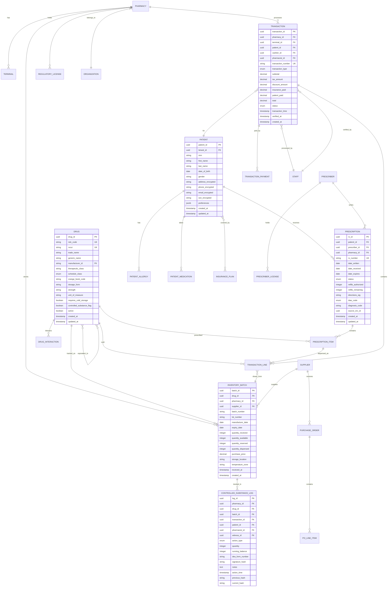

# Low-Level Design

[Back to Index](./00-index.md)

---

## Data Model

### Entity Relationship Diagram



---

## Detailed Schema Design

### Core Tables

```sql
-- Drug master table
CREATE TABLE drug (
    drug_id UUID PRIMARY KEY DEFAULT gen_random_uuid(),
    ndc_code VARCHAR(11) UNIQUE NOT NULL,
    rxcui VARCHAR(20) UNIQUE,
    trade_name VARCHAR(255) NOT NULL,
    generic_name VARCHAR(255) NOT NULL,
    manufacturer_id UUID REFERENCES manufacturer(manufacturer_id),
    therapeutic_class VARCHAR(100),
    schedule_class VARCHAR(10) CHECK (schedule_class IN (
        'OTC', 'Rx', 'C-V', 'C-IV', 'C-III', 'C-II', 'H', 'H1', 'X'
    )),
    orange_book_code VARCHAR(5),
    dosage_form VARCHAR(50),
    strength VARCHAR(50),
    unit_of_measure VARCHAR(20),
    package_size INTEGER,
    requires_cold_storage BOOLEAN DEFAULT FALSE,
    controlled_substance_flag BOOLEAN DEFAULT FALSE,
    dea_class VARCHAR(5),
    active BOOLEAN DEFAULT TRUE,
    created_at TIMESTAMPTZ DEFAULT NOW(),
    updated_at TIMESTAMPTZ DEFAULT NOW()
);

CREATE INDEX idx_drug_ndc ON drug(ndc_code);
CREATE INDEX idx_drug_rxcui ON drug(rxcui);
CREATE INDEX idx_drug_generic ON drug(generic_name);
CREATE INDEX idx_drug_schedule ON drug(schedule_class) WHERE controlled_substance_flag = TRUE;

-- Inventory batch with CRDT support
CREATE TABLE inventory_batch (
    batch_id UUID PRIMARY KEY DEFAULT gen_random_uuid(),
    drug_id UUID NOT NULL REFERENCES drug(drug_id),
    pharmacy_id UUID NOT NULL REFERENCES pharmacy(pharmacy_id),
    supplier_id UUID REFERENCES supplier(supplier_id),
    batch_number VARCHAR(50) NOT NULL,
    lot_number VARCHAR(50),
    manufacture_date DATE,
    expiry_date DATE NOT NULL,
    quantity_received INTEGER NOT NULL,
    -- CRDT counters for conflict-free sync
    quantity_add JSONB DEFAULT '{}',  -- {terminal_id: count}
    quantity_sub JSONB DEFAULT '{}',  -- {terminal_id: count}
    quantity_reserved INTEGER DEFAULT 0,
    purchase_price DECIMAL(10, 4) NOT NULL,
    selling_price DECIMAL(10, 4),
    storage_location VARCHAR(50),
    temperature_zone VARCHAR(20),
    received_at TIMESTAMPTZ NOT NULL,
    last_sync_at TIMESTAMPTZ DEFAULT NOW(),
    created_at TIMESTAMPTZ DEFAULT NOW(),

    UNIQUE(pharmacy_id, drug_id, batch_number)
);

CREATE INDEX idx_batch_pharmacy_drug ON inventory_batch(pharmacy_id, drug_id);
CREATE INDEX idx_batch_expiry ON inventory_batch(expiry_date);
CREATE INDEX idx_batch_controlled ON inventory_batch(drug_id)
    WHERE drug_id IN (SELECT drug_id FROM drug WHERE controlled_substance_flag = TRUE);

-- Computed column for available quantity
CREATE OR REPLACE FUNCTION get_batch_available(batch inventory_batch)
RETURNS INTEGER AS $$
DECLARE
    total_add INTEGER := 0;
    total_sub INTEGER := 0;
BEGIN
    SELECT COALESCE(SUM((value)::integer), 0) INTO total_add
    FROM jsonb_each_text(batch.quantity_add);

    SELECT COALESCE(SUM((value)::integer), 0) INTO total_sub
    FROM jsonb_each_text(batch.quantity_sub);

    RETURN batch.quantity_received + total_add - total_sub - batch.quantity_reserved;
END;
$$ LANGUAGE plpgsql IMMUTABLE;

-- Prescription table
CREATE TABLE prescription (
    rx_id UUID PRIMARY KEY DEFAULT gen_random_uuid(),
    patient_id UUID NOT NULL REFERENCES patient(patient_id),
    prescriber_id UUID NOT NULL REFERENCES prescriber(prescriber_id),
    pharmacy_id UUID NOT NULL REFERENCES pharmacy(pharmacy_id),
    rx_number VARCHAR(20) NOT NULL,
    date_written DATE NOT NULL,
    date_received TIMESTAMPTZ DEFAULT NOW(),
    date_expires DATE NOT NULL,
    status VARCHAR(20) DEFAULT 'RECEIVED' CHECK (status IN (
        'RECEIVED', 'QUEUED', 'IN_PROGRESS', 'ON_HOLD',
        'READY_FOR_VERIFICATION', 'VERIFIED', 'WILL_CALL',
        'SOLD', 'RETURNED', 'CANCELLED', 'TRANSFERRED'
    )),
    refills_authorized INTEGER DEFAULT 0,
    refills_remaining INTEGER DEFAULT 0,
    directions_sig TEXT,
    daw_code CHAR(1) DEFAULT '0' CHECK (daw_code IN ('0','1','2','3','4','5','6','7','8','9')),
    diagnosis_code VARCHAR(20),
    source_erx_id UUID,
    transfer_from_pharmacy UUID,
    created_at TIMESTAMPTZ DEFAULT NOW(),
    updated_at TIMESTAMPTZ DEFAULT NOW(),

    UNIQUE(pharmacy_id, rx_number)
);

CREATE INDEX idx_rx_patient ON prescription(patient_id);
CREATE INDEX idx_rx_status ON prescription(pharmacy_id, status);
CREATE INDEX idx_rx_date ON prescription(pharmacy_id, date_received);

-- Controlled substance log (immutable, hash-chained)
CREATE TABLE controlled_substance_log (
    log_id UUID PRIMARY KEY DEFAULT gen_random_uuid(),
    pharmacy_id UUID NOT NULL REFERENCES pharmacy(pharmacy_id),
    drug_id UUID NOT NULL REFERENCES drug(drug_id),
    batch_id UUID NOT NULL REFERENCES inventory_batch(batch_id),
    transaction_id UUID REFERENCES transaction(transaction_id),
    rx_id UUID REFERENCES prescription(rx_id),
    patient_id UUID REFERENCES patient(patient_id),
    pharmacist_id UUID NOT NULL REFERENCES staff(staff_id),
    witness_id UUID REFERENCES staff(staff_id),
    action_type VARCHAR(20) NOT NULL CHECK (action_type IN (
        'RECEIPT', 'DISPENSE', 'RETURN', 'DESTRUCTION',
        'TRANSFER_OUT', 'TRANSFER_IN', 'ADJUSTMENT', 'INVENTORY'
    )),
    quantity INTEGER NOT NULL,
    running_balance INTEGER NOT NULL,
    dea_form_number VARCHAR(20),
    signature_hash VARCHAR(64),
    notes TEXT,
    action_time TIMESTAMPTZ NOT NULL DEFAULT NOW(),
    previous_hash VARCHAR(64),
    current_hash VARCHAR(64) NOT NULL,
    created_at TIMESTAMPTZ DEFAULT NOW()
);

-- Prevent updates/deletes on CS log
CREATE RULE cs_log_no_update AS ON UPDATE TO controlled_substance_log DO INSTEAD NOTHING;
CREATE RULE cs_log_no_delete AS ON DELETE TO controlled_substance_log DO INSTEAD NOTHING;

CREATE INDEX idx_cs_log_pharmacy_drug ON controlled_substance_log(pharmacy_id, drug_id);
CREATE INDEX idx_cs_log_time ON controlled_substance_log(pharmacy_id, action_time);
CREATE INDEX idx_cs_log_patient ON controlled_substance_log(patient_id);
```

---

## CRDT Schema for Inventory

### PN-Counter Implementation

The inventory system uses **PN-Counters** (Positive-Negative Counters) for conflict-free replication across terminals.

```
STRUCTURE: PN-Counter

State:
  P: Map<TerminalId, Integer>  -- Positive operations (receipts, returns)
  N: Map<TerminalId, Integer>  -- Negative operations (dispenses, adjustments)

Operations:
  increment(terminal_id, amount):
    P[terminal_id] += amount

  decrement(terminal_id, amount):
    N[terminal_id] += amount

  value():
    return sum(P.values()) - sum(N.values())

  merge(other):
    for each key in union(P.keys(), other.P.keys()):
      P[key] = max(P[key], other.P[key])
    for each key in union(N.keys(), other.N.keys()):
      N[key] = max(N[key], other.N[key])
```

### Example: Multi-Terminal Inventory Update

```
Initial State (Batch #12345, Metformin 500mg):
  quantity_received: 100
  quantity_add: {}
  quantity_sub: {}
  Available: 100

Terminal T1 dispenses 30:
  quantity_sub: {"T1": 30}
  Available: 100 - 30 = 70

Terminal T2 dispenses 20 (concurrently):
  quantity_sub: {"T2": 20}
  Available: 100 - 20 = 80 (local view)

After CRDT Merge:
  quantity_sub: {"T1": 30, "T2": 20}
  Available: 100 - 30 - 20 = 50 (correct global state)

Terminal T3 receives return of 5:
  quantity_add: {"T3": 5}
  Available: 100 + 5 - 30 - 20 = 55
```

### CRDT Sync Protocol

```
ALGORITHM: InventoryCRDTSync

FUNCTION sync_to_leader(terminal_id, local_state):
    delta = calculate_delta(local_state, last_sync_state)

    SEND to leader:
        terminal_id
        delta.batches[]  // Only changed batches
        vector_clock

    RECEIVE from leader:
        merged_state
        new_vector_clock

    local_state = merge(local_state, merged_state)
    last_sync_state = local_state
    vector_clock = new_vector_clock

FUNCTION leader_merge(terminal_deltas[]):
    global_state = current_state

    FOR EACH delta IN terminal_deltas:
        FOR EACH batch IN delta.batches:
            global_state.batches[batch.id] = crdt_merge(
                global_state.batches[batch.id],
                batch
            )

    broadcast_to_terminals(global_state)
    queue_for_cloud_sync(global_state)
```

---

## Drug Knowledge Graph Schema (Neo4j)

### Node Types

```cypher
// Drug node
CREATE CONSTRAINT drug_rxcui IF NOT EXISTS
FOR (d:Drug) REQUIRE d.rxcui IS UNIQUE;

CREATE (d:Drug {
    rxcui: "860975",
    ndc: "00904-6346-61",
    name: "Metformin 500mg Tablet",
    generic_name: "metformin hydrochloride",
    brand_name: "Glucophage",
    dosage_form: "ORAL TABLET",
    strength: "500 MG",
    schedule_class: "Rx",
    active: true
})

// Ingredient node
CREATE (i:Ingredient {
    rxcui: "6809",
    name: "metformin",
    unii: "9100L32L2N"
})

// Therapeutic Class node
CREATE (tc:TherapeuticClass {
    code: "A10BA02",
    name: "Biguanides",
    description: "Blood glucose lowering drugs"
})

// Orange Book Product node
CREATE (ob:OrangeBookProduct {
    application_number: "ANDA040738",
    te_code: "AB",
    reference_listed_drug: "NDA020357",
    approval_date: date("1995-03-01")
})

// Manufacturer node
CREATE (m:Manufacturer {
    name: "Major Pharmaceuticals",
    dea_number: "RM0359572"
})
```

### Relationship Types

```cypher
// Drug contains ingredient
MATCH (d:Drug {rxcui: "860975"}), (i:Ingredient {rxcui: "6809"})
CREATE (d)-[:CONTAINS {
    strength: "500",
    unit: "MG",
    active: true
}]->(i)

// Drug belongs to therapeutic class
MATCH (d:Drug {rxcui: "860975"}), (tc:TherapeuticClass {code: "A10BA02"})
CREATE (d)-[:BELONGS_TO]->(tc)

// Drug has Orange Book entry
MATCH (d:Drug {rxcui: "860975"}), (ob:OrangeBookProduct {application_number: "ANDA040738"})
CREATE (d)-[:HAS_ORANGE_BOOK]->(ob)

// Therapeutic equivalence relationship
MATCH (d1:Drug {rxcui: "860975"}), (d2:Drug {rxcui: "861007"})
CREATE (d1)-[:THERAPEUTICALLY_EQUIVALENT {
    te_code: "AB",
    source: "FDA_ORANGE_BOOK"
}]->(d2)

// Drug-Drug Interaction
MATCH (d1:Drug), (d2:Drug)
WHERE d1.rxcui = "860975" AND d2.rxcui = "4815"  // Metformin and Iodinated contrast
CREATE (d1)-[:INTERACTS_WITH {
    severity: "MAJOR",
    mechanism: "Increased risk of lactic acidosis",
    clinical_effect: "Metformin accumulation with renal impairment from contrast",
    management: "Withhold metformin for 48 hours after contrast procedure",
    evidence_level: 2,
    source: "DRUGBANK"
}]->(d2)
```

### Graph Queries

```cypher
// Find all therapeutic equivalents for a drug
MATCH (d1:Drug {ndc: $ndc})-[:HAS_ORANGE_BOOK]->(ob1:OrangeBookProduct)
MATCH (ob2:OrangeBookProduct)-[:REFERENCE]->(ob1)
MATCH (d2:Drug)-[:HAS_ORANGE_BOOK]->(ob2)
WHERE ob2.te_code STARTS WITH 'A'
RETURN d2.ndc, d2.name, d2.generic_name, ob2.te_code
ORDER BY ob2.te_code

// Find all DDIs for a patient's medication list
MATCH (d1:Drug)-[i:INTERACTS_WITH]->(d2:Drug)
WHERE d1.rxcui IN $patient_drug_rxcuis
AND d2.rxcui IN $patient_drug_rxcuis
AND d1.rxcui < d2.rxcui  // Avoid duplicates
RETURN d1.name, d2.name, i.severity, i.mechanism, i.management
ORDER BY
    CASE i.severity
        WHEN 'CRITICAL' THEN 1
        WHEN 'MAJOR' THEN 2
        WHEN 'MODERATE' THEN 3
        ELSE 4
    END

// Find drugs in same therapeutic class for substitution
MATCH (d1:Drug {rxcui: $rxcui})-[:BELONGS_TO]->(tc:TherapeuticClass)
MATCH (d2:Drug)-[:BELONGS_TO]->(tc)
WHERE d2.rxcui <> d1.rxcui AND d2.active = true
OPTIONAL MATCH (d1)-[te:THERAPEUTICALLY_EQUIVALENT]->(d2)
RETURN d2.ndc, d2.name, d2.generic_name, te.te_code
ORDER BY te.te_code NULLS LAST
LIMIT 10
```

---

## API Design

### Dispensing API

```yaml
openapi: 3.0.3
info:
  title: Pharmacy Dispensing API
  version: 1.0.0

paths:
  /v1/dispensing/transactions:
    post:
      summary: Create a new dispensing transaction
      operationId: createTransaction
      tags: [Dispensing]
      security:
        - BearerAuth: []
        - ApiKey: []
      requestBody:
        required: true
        content:
          application/json:
            schema:
              $ref: '#/components/schemas/CreateTransactionRequest'
      responses:
        '201':
          description: Transaction created
          content:
            application/json:
              schema:
                $ref: '#/components/schemas/Transaction'
        '400':
          description: Validation error
        '403':
          description: Compliance policy violation
          content:
            application/json:
              schema:
                $ref: '#/components/schemas/ComplianceViolation'

  /v1/dispensing/transactions/{transactionId}/verify:
    post:
      summary: Pharmacist verification of transaction
      operationId: verifyTransaction
      tags: [Dispensing]
      security:
        - BearerAuth: []
        - MFA: []
      parameters:
        - name: transactionId
          in: path
          required: true
          schema:
            type: string
            format: uuid
      requestBody:
        content:
          application/json:
            schema:
              $ref: '#/components/schemas/VerifyRequest'
      responses:
        '200':
          description: Transaction verified
        '403':
          description: Not authorized (pharmacist required)

components:
  schemas:
    CreateTransactionRequest:
      type: object
      required:
        - pharmacyId
        - terminalId
        - transactionType
        - lineItems
      properties:
        pharmacyId:
          type: string
          format: uuid
        terminalId:
          type: string
          format: uuid
        patientId:
          type: string
          format: uuid
        transactionType:
          type: string
          enum: [RX_FILL, OTC_SALE, RETURN, REFILL]
        lineItems:
          type: array
          items:
            $ref: '#/components/schemas/LineItem'
        paymentMethods:
          type: array
          items:
            $ref: '#/components/schemas/PaymentMethod'
        overrides:
          type: array
          items:
            $ref: '#/components/schemas/Override'

    LineItem:
      type: object
      required:
        - drugId
        - quantity
      properties:
        drugId:
          type: string
          format: uuid
        rxId:
          type: string
          format: uuid
          description: Required for Rx fills
        quantity:
          type: integer
          minimum: 1
        substitutionRequested:
          type: boolean
          default: false
        originalDrugId:
          type: string
          format: uuid
          description: Original drug if substitution applied

    ComplianceViolation:
      type: object
      properties:
        violationCode:
          type: string
        regulation:
          type: string
          enum: [DEA, CDSCO, HIPAA, STATE_BOARD]
        message:
          type: string
        canOverride:
          type: boolean
        overrideRequires:
          type: string
          enum: [PHARMACIST, MANAGER, NONE]
```

### Substitution API

```yaml
paths:
  /v1/substitution/equivalents:
    get:
      summary: Find therapeutic equivalents for a drug
      operationId: findEquivalents
      tags: [Substitution]
      parameters:
        - name: drugId
          in: query
          required: true
          schema:
            type: string
            format: uuid
        - name: pharmacyId
          in: query
          required: true
          schema:
            type: string
            format: uuid
        - name: patientId
          in: query
          schema:
            type: string
            format: uuid
          description: For patient-specific safety checks
        - name: insurancePlanId
          in: query
          schema:
            type: string
          description: For formulary-based ranking
        - name: quantityNeeded
          in: query
          schema:
            type: integer
          description: Filter by availability
      responses:
        '200':
          description: List of equivalent drugs
          content:
            application/json:
              schema:
                $ref: '#/components/schemas/EquivalentsResponse'

components:
  schemas:
    EquivalentsResponse:
      type: object
      properties:
        originalDrug:
          $ref: '#/components/schemas/DrugSummary'
        equivalents:
          type: array
          items:
            $ref: '#/components/schemas/EquivalentDrug'
        canSubstitute:
          type: boolean
        dawCode:
          type: string
          description: Dispense As Written code from Rx

    EquivalentDrug:
      type: object
      properties:
        drug:
          $ref: '#/components/schemas/DrugSummary'
        teCode:
          type: string
          description: FDA Orange Book TE code
        stockStatus:
          type: string
          enum: [IN_STOCK, LOW_STOCK, OUT_OF_STOCK]
        quantityAvailable:
          type: integer
        earliestExpiry:
          type: string
          format: date
        unitPrice:
          type: number
          format: decimal
        savingsAmount:
          type: number
          format: decimal
        savingsPercent:
          type: number
          format: decimal
        formularyTier:
          type: integer
          minimum: 1
          maximum: 5
        patientCopay:
          type: number
          format: decimal
        safetyAlerts:
          type: array
          items:
            $ref: '#/components/schemas/SafetyAlert'
        rank:
          type: integer
          description: AI-ranked position
```

### Inventory API

```yaml
paths:
  /v1/inventory/batches:
    post:
      summary: Receive new inventory batch
      operationId: receiveBatch
      tags: [Inventory]
      requestBody:
        content:
          application/json:
            schema:
              $ref: '#/components/schemas/ReceiveBatchRequest'
      responses:
        '201':
          description: Batch received

  /v1/inventory/batches/{batchId}/adjust:
    post:
      summary: Adjust batch quantity
      operationId: adjustBatch
      tags: [Inventory]
      parameters:
        - name: batchId
          in: path
          required: true
          schema:
            type: string
            format: uuid
      requestBody:
        content:
          application/json:
            schema:
              $ref: '#/components/schemas/AdjustBatchRequest'
      responses:
        '200':
          description: Adjustment recorded

  /v1/inventory/sync:
    post:
      summary: CRDT sync from terminal
      operationId: syncInventory
      tags: [Inventory]
      requestBody:
        content:
          application/json:
            schema:
              $ref: '#/components/schemas/CRDTSyncRequest'
      responses:
        '200':
          description: Merged state returned
          content:
            application/json:
              schema:
                $ref: '#/components/schemas/CRDTSyncResponse'

components:
  schemas:
    ReceiveBatchRequest:
      type: object
      required:
        - pharmacyId
        - drugId
        - supplierId
        - poId
        - batchNumber
        - quantity
        - expiryDate
        - purchasePrice
      properties:
        pharmacyId:
          type: string
          format: uuid
        drugId:
          type: string
          format: uuid
        supplierId:
          type: string
          format: uuid
        poId:
          type: string
          format: uuid
        batchNumber:
          type: string
        lotNumber:
          type: string
        quantity:
          type: integer
        expiryDate:
          type: string
          format: date
        purchasePrice:
          type: number
          format: decimal
        storageLocation:
          type: string

    CRDTSyncRequest:
      type: object
      required:
        - terminalId
        - pharmacyId
        - vectorClock
        - deltas
      properties:
        terminalId:
          type: string
          format: uuid
        pharmacyId:
          type: string
          format: uuid
        vectorClock:
          type: object
          additionalProperties:
            type: integer
        deltas:
          type: array
          items:
            $ref: '#/components/schemas/BatchDelta'

    BatchDelta:
      type: object
      properties:
        batchId:
          type: string
          format: uuid
        quantityAddDelta:
          type: integer
        quantitySubDelta:
          type: integer
        lastOperationTime:
          type: string
          format: date-time
```

---

## Core Algorithms

### 1. Therapeutic Equivalence Matching

```
ALGORITHM: FindTherapeuticEquivalents

INPUT:
  prescribed_drug: Drug with NDC/RxCUI
  patient_id: For safety checks (optional)
  pharmacy_id: For stock availability
  insurance_plan_id: For formulary (optional)
  quantity_needed: Minimum stock required

OUTPUT:
  ranked_alternatives: List of substitution options

FUNCTION find_equivalents(prescribed_drug, context):

    // Step 1: Normalize drug identifier to RxCUI
    rxcui = normalize_to_rxcui(prescribed_drug.ndc)
    IF rxcui IS NULL:
        RETURN empty_list  // Cannot find equivalents

    // Step 2: Query Orange Book for therapeutic equivalents
    // TE codes starting with 'A' are substitutable
    equivalents = graph_query("""
        MATCH (d1:Drug {rxcui: $rxcui})-[:HAS_ORANGE_BOOK]->(ob1)
        OPTIONAL MATCH (d2:Drug)-[:THERAPEUTICALLY_EQUIVALENT]->(d1)
        WHERE d2.active = true
        RETURN d2, d2.orange_book_code AS te_code
        UNION
        MATCH (d1:Drug {rxcui: $rxcui})-[:BELONGS_TO]->(tc)
        MATCH (d2:Drug)-[:BELONGS_TO]->(tc)
        MATCH (d2)-[:HAS_ORANGE_BOOK]->(ob2)
        WHERE ob2.te_code STARTS WITH 'A'
        AND d2.active = true AND d2.rxcui <> $rxcui
        RETURN d2, ob2.te_code AS te_code
    """, rxcui=rxcui)

    // Step 3: Filter by patient safety
    IF patient_id:
        patient_allergies = get_patient_allergies(patient_id)
        patient_meds = get_patient_medications(patient_id)

        safe_equivalents = []
        FOR EACH equiv IN equivalents:
            // Check allergies
            ingredients = get_drug_ingredients(equiv.drug_id)
            IF any(i IN patient_allergies FOR i IN ingredients):
                CONTINUE  // Skip this drug

            // Check drug interactions
            ddis = check_interactions(equiv.drug_id, patient_meds)
            critical_ddis = filter(ddi.severity == 'CRITICAL', ddis)
            IF critical_ddis:
                CONTINUE  // Skip this drug

            equiv.moderate_ddis = filter(ddi.severity == 'MODERATE', ddis)
            safe_equivalents.append(equiv)

        equivalents = safe_equivalents

    // Step 4: Filter by availability
    FOR EACH equiv IN equivalents:
        stock = get_pharmacy_stock(pharmacy_id, equiv.drug_id)
        equiv.quantity_available = stock.total_available
        equiv.earliest_expiry = stock.earliest_expiry
        equiv.batches = stock.batches

    equivalents = filter(e.quantity_available >= quantity_needed, equivalents)

    // Step 5: Apply formulary preferences
    IF insurance_plan_id:
        formulary = get_formulary(insurance_plan_id)
        FOR EACH equiv IN equivalents:
            tier = formulary.get_tier(equiv.drug_id)
            copay = formulary.get_copay(equiv.drug_id, quantity_needed)
            equiv.formulary_tier = tier
            equiv.patient_copay = copay

    // Step 6: Calculate cost savings
    original_price = get_drug_price(prescribed_drug.drug_id) * quantity_needed
    FOR EACH equiv IN equivalents:
        equiv_price = get_drug_price(equiv.drug_id) * quantity_needed
        equiv.savings_amount = original_price - equiv_price
        equiv.savings_percent = (equiv.savings_amount / original_price) * 100

    // Step 7: AI-powered ranking
    features = extract_features(equivalents, context)
    scores = substitution_ranker_model.predict(features)

    FOR i, equiv IN enumerate(equivalents):
        equiv.rank_score = scores[i]

    // Sort by rank score (combines TE code, savings, formulary, freshness)
    equivalents.sort(key=lambda e: e.rank_score, reverse=True)

    RETURN equivalents[:10]  // Top 10

FUNCTION extract_features(equivalents, context):
    features = []
    FOR EACH equiv IN equivalents:
        f = {
            'te_code_score': te_code_to_score(equiv.te_code),  // AA=1.0, AB=0.9, ...
            'savings_percent': equiv.savings_percent / 100,
            'formulary_tier_score': (6 - equiv.formulary_tier) / 5 if equiv.formulary_tier else 0.5,
            'days_to_expiry': (equiv.earliest_expiry - today).days / 365,
            'ddi_count': len(equiv.moderate_ddis) if equiv.moderate_ddis else 0,
            'stock_ratio': equiv.quantity_available / context.quantity_needed
        }
        features.append(f)
    RETURN features
```

### 2. Demand Forecasting

```
ALGORITHM: DemandForecast

INPUT:
  drug_id: Drug to forecast
  pharmacy_id: Location context
  horizon_days: Forecast period (default: 14)

OUTPUT:
  daily_forecast: Predicted demand per day
  reorder_recommendation: Quantity and timing

FUNCTION forecast_demand(drug_id, pharmacy_id, horizon_days):

    // Step 1: Load historical data (2 years)
    history = query("""
        SELECT date_trunc('day', transaction_time) AS date,
               SUM(quantity) AS daily_demand
        FROM transaction_line tl
        JOIN transaction t ON tl.transaction_id = t.transaction_id
        WHERE tl.drug_id = $drug_id
        AND t.pharmacy_id = $pharmacy_id
        AND t.transaction_time > NOW() - INTERVAL '2 years'
        GROUP BY 1
        ORDER BY 1
    """, drug_id=drug_id, pharmacy_id=pharmacy_id)

    // Fill missing days with 0
    history = fill_missing_dates(history, default=0)

    // Step 2: Feature engineering
    df = DataFrame(history)
    df['day_of_week'] = df['date'].dt.dayofweek
    df['month'] = df['date'].dt.month
    df['is_monday'] = (df['day_of_week'] == 0).astype(int)  // Refill spike
    df['flu_season'] = ((df['month'] >= 10) | (df['month'] <= 2)).astype(int)

    // Add holiday indicators
    df['is_holiday'] = df['date'].apply(is_holiday)

    // Step 3: Train Prophet model
    prophet_df = df[['date', 'daily_demand']].rename(columns={'date': 'ds', 'daily_demand': 'y'})

    prophet_model = Prophet(
        yearly_seasonality=True,
        weekly_seasonality=True,
        daily_seasonality=False
    )
    prophet_model.add_country_holidays(country_name='US')
    prophet_model.fit(prophet_df)

    // Step 4: Train XGBoost for residuals
    features = ['day_of_week', 'month', 'is_monday', 'flu_season', 'is_holiday']
    prophet_predictions = prophet_model.predict(prophet_df)
    df['prophet_pred'] = prophet_predictions['yhat']
    df['residual'] = df['daily_demand'] - df['prophet_pred']

    xgb_model = XGBRegressor(n_estimators=100, max_depth=5)
    xgb_model.fit(df[features], df['residual'])

    // Step 5: Generate future dates
    future_dates = generate_future_dates(horizon_days)
    future_df = create_features(future_dates)

    // Step 6: Ensemble prediction
    prophet_future = prophet_model.predict(future_df[['ds']])
    xgb_future = xgb_model.predict(future_df[features])

    forecast = prophet_future['yhat'] + xgb_future
    forecast_lower = prophet_future['yhat_lower'] + xgb_future
    forecast_upper = prophet_future['yhat_upper'] + xgb_future

    // Ensure non-negative
    forecast = max(0, forecast)

    // Step 7: Calculate reorder recommendation
    avg_daily = forecast.mean()
    forecast_std = forecast.std()

    lead_time = get_supplier_lead_time(drug_id, pharmacy_id)  // days
    service_level = 0.95
    z_score = 1.65  // For 95%

    safety_stock = z_score * forecast_std * sqrt(lead_time)
    reorder_point = (avg_daily * lead_time) + safety_stock

    // EOQ calculation
    annual_demand = avg_daily * 365
    order_cost = get_order_cost(drug_id)  // Fixed cost per order
    holding_cost_rate = 0.25  // 25% of unit cost per year
    unit_cost = get_drug_cost(drug_id)
    holding_cost = unit_cost * holding_cost_rate

    eoq = sqrt((2 * annual_demand * order_cost) / holding_cost)
    eoq = round(eoq / 10) * 10  // Round to nearest 10

    // Current stock check
    current_stock = get_current_inventory(drug_id, pharmacy_id)
    days_of_stock = current_stock / avg_daily if avg_daily > 0 else 999
    days_until_reorder = max(0, (current_stock - reorder_point) / avg_daily)

    RETURN {
        'daily_forecast': forecast,
        'forecast_lower': forecast_lower,
        'forecast_upper': forecast_upper,
        'average_daily_demand': avg_daily,
        'reorder_point': reorder_point,
        'safety_stock': safety_stock,
        'recommended_order_qty': eoq,
        'current_stock': current_stock,
        'days_of_stock': days_of_stock,
        'days_until_reorder': days_until_reorder,
        'urgency': 'HIGH' if days_of_stock < lead_time else
                   'MEDIUM' if days_of_stock < lead_time * 2 else 'LOW'
    }
```

### 3. Controlled Substance Anomaly Detection

```
ALGORITHM: ControlledSubstanceAnomalyDetection

INPUT:
  transaction: Pending CS transaction
  patient_id: Patient requesting
  prescriber_id: Prescribing physician
  pharmacy_id: Dispensing pharmacy

OUTPUT:
  risk_assessment: Score and flags

FUNCTION detect_anomalies(transaction, context):

    risk_score = 0.0
    flags = []

    // Step 1: Rule-based checks

    // Early refill detection
    IF transaction.is_refill:
        last_fill = get_last_fill(transaction.rx_id)
        days_supply = last_fill.days_supply
        expected_empty = last_fill.fill_date + days_supply
        days_early = (expected_empty - transaction.date).days

        IF days_early > 14:
            flags.append({
                'type': 'VERY_EARLY_REFILL',
                'severity': 'HIGH',
                'days_early': days_early,
                'message': f'Refill {days_early} days before expected'
            })
            risk_score += 0.4
        ELSE IF days_early > 7:
            flags.append({
                'type': 'EARLY_REFILL',
                'severity': 'MEDIUM',
                'days_early': days_early
            })
            risk_score += 0.2

    // Quantity anomaly
    typical_qty = get_typical_quantity(transaction.drug_id, context.diagnosis)
    IF transaction.quantity > typical_qty * 2:
        flags.append({
            'type': 'HIGH_QUANTITY',
            'severity': 'HIGH',
            'quantity': transaction.quantity,
            'typical': typical_qty
        })
        risk_score += 0.3
    ELSE IF transaction.quantity > typical_qty * 1.5:
        flags.append({
            'type': 'ELEVATED_QUANTITY',
            'severity': 'MEDIUM'
        })
        risk_score += 0.15

    // Step 2: PMP cross-reference (if available)
    pmp_data = query_pmp(patient_id, state=transaction.state)

    IF pmp_data:
        // Multiple pharmacies
        IF pmp_data.unique_pharmacies_90days > 3:
            flags.append({
                'type': 'MULTIPLE_PHARMACIES',
                'severity': 'HIGH',
                'count': pmp_data.unique_pharmacies_90days
            })
            risk_score += 0.35

        // Multiple prescribers
        IF pmp_data.unique_prescribers_90days > 3:
            flags.append({
                'type': 'MULTIPLE_PRESCRIBERS',
                'severity': 'HIGH',
                'count': pmp_data.unique_prescribers_90days
            })
            risk_score += 0.35

        // Overlapping prescriptions
        IF pmp_data.has_overlapping_rx:
            flags.append({
                'type': 'OVERLAPPING_PRESCRIPTIONS',
                'severity': 'HIGH'
            })
            risk_score += 0.4

    // Step 3: Prescriber pattern analysis
    prescriber_stats = get_prescriber_stats(prescriber_id, days=90)

    IF prescriber_stats.controlled_percent > 0.7:
        flags.append({
            'type': 'HIGH_CONTROLLED_PRESCRIBER',
            'severity': 'MEDIUM',
            'percent': prescriber_stats.controlled_percent
        })
        risk_score += 0.2

    // Step 4: Geographic anomaly
    patient_address = get_patient_address(patient_id)
    pharmacy_address = get_pharmacy_address(pharmacy_id)
    distance_miles = calculate_distance(patient_address, pharmacy_address)

    IF distance_miles > 50:
        flags.append({
            'type': 'GEOGRAPHIC_ANOMALY',
            'severity': 'MEDIUM',
            'distance': distance_miles
        })
        risk_score += 0.15

    // Step 5: ML-based anomaly score
    features = extract_ml_features(transaction, context, pmp_data, prescriber_stats)
    isolation_forest = load_model('cs_isolation_forest')
    ml_anomaly_score = isolation_forest.decision_function([features])[0]

    // Normalize to 0-1 (higher = more anomalous)
    ml_score_normalized = 1 / (1 + exp(ml_anomaly_score))

    // Combine scores (weighted)
    combined_score = 0.6 * risk_score + 0.4 * ml_score_normalized
    combined_score = min(1.0, combined_score)

    // Step 6: Determine action
    IF combined_score > 0.8:
        recommendation = 'DENY'
        requires_review = True
    ELSE IF combined_score > 0.5:
        recommendation = 'PHARMACIST_REVIEW'
        requires_review = True
    ELSE IF combined_score > 0.3:
        recommendation = 'PROCEED_WITH_CAUTION'
        requires_review = False
    ELSE:
        recommendation = 'PROCEED'
        requires_review = False

    RETURN {
        'risk_score': combined_score,
        'risk_level': score_to_level(combined_score),
        'flags': flags,
        'recommendation': recommendation,
        'requires_pharmacist_review': requires_review,
        'pmp_data_available': pmp_data IS NOT NULL
    }
```

### 4. Expiry Optimization

```
ALGORITHM: ExpiryOptimization

INPUT:
  pharmacy_id: Pharmacy to analyze
  lookahead_days: Analysis window (default: 90)

OUTPUT:
  expiry_risk_report: At-risk inventory
  recommended_actions: Optimization suggestions

FUNCTION analyze_expiry_risk(pharmacy_id, lookahead_days):

    // Step 1: Get batches expiring within window
    expiring_batches = query("""
        SELECT b.*, d.name, d.therapeutic_class, d.schedule_class,
               get_batch_available(b) AS available_qty
        FROM inventory_batch b
        JOIN drug d ON b.drug_id = d.drug_id
        WHERE b.pharmacy_id = $pharmacy_id
        AND b.expiry_date BETWEEN NOW() AND NOW() + $lookahead DAYS
        AND get_batch_available(b) > 0
        ORDER BY b.expiry_date
    """, pharmacy_id=pharmacy_id, lookahead=lookahead_days)

    risk_report = []
    total_at_risk_value = 0

    FOR EACH batch IN expiring_batches:
        days_to_expiry = (batch.expiry_date - today).days

        // Forecast demand for this drug until expiry
        forecast = forecast_demand(batch.drug_id, pharmacy_id, days_to_expiry)
        expected_demand = sum(forecast.daily_forecast)

        // Calculate waste probability
        surplus = batch.available_qty - expected_demand
        IF surplus > 0:
            waste_probability = surplus / batch.available_qty
        ELSE:
            waste_probability = 0

        waste_value = max(0, surplus) * batch.purchase_price
        total_at_risk_value += waste_value

        // Generate recommendations
        recommendations = []

        IF waste_probability > 0.7:
            // High risk - aggressive action needed

            // Option 1: Transfer to high-demand location
            high_demand_pharmacies = find_pharmacies_with_demand(
                batch.drug_id,
                min_demand=surplus,
                exclude=pharmacy_id
            )
            IF high_demand_pharmacies:
                recommendations.append({
                    'action': 'TRANSFER',
                    'priority': 'HIGH',
                    'target_pharmacies': high_demand_pharmacies[:3],
                    'suggested_quantity': surplus,
                    'potential_recovery': waste_value * 0.9
                })

            // Option 2: Return to supplier (if eligible)
            return_policy = get_supplier_return_policy(batch.supplier_id, batch.drug_id)
            IF return_policy.eligible AND days_to_expiry >= return_policy.min_days:
                recommendations.append({
                    'action': 'RETURN_TO_SUPPLIER',
                    'priority': 'HIGH',
                    'deadline': batch.expiry_date - return_policy.min_days,
                    'credit_percent': return_policy.credit_percent,
                    'potential_recovery': waste_value * (return_policy.credit_percent / 100)
                })

            // Option 3: Markdown pricing
            IF batch.schedule_class IN ['OTC', 'Rx']:
                optimal_markdown = calculate_optimal_markdown(
                    batch,
                    forecast,
                    days_to_expiry
                )
                recommendations.append({
                    'action': 'MARKDOWN',
                    'priority': 'MEDIUM',
                    'suggested_discount_percent': optimal_markdown.discount,
                    'expected_units_sold': optimal_markdown.additional_demand,
                    'net_revenue_impact': optimal_markdown.net_impact
                })

        ELSE IF waste_probability > 0.3:
            // Moderate risk - monitor and prepare
            recommendations.append({
                'action': 'MONITOR',
                'priority': 'LOW',
                'review_date': today + 14,
                'note': 'Re-evaluate in 2 weeks'
            })

            // Suggest FEFO enforcement
            IF NOT batch.fefo_compliant:
                recommendations.append({
                    'action': 'PRIORITIZE_PICKING',
                    'priority': 'MEDIUM',
                    'message': 'Ensure this batch is picked first'
                })

        // Controlled substances have different rules
        IF batch.schedule_class IN ['C-II', 'C-III', 'C-IV', 'C-V', 'H1', 'X']:
            recommendations = filter(
                r.action NOT IN ['MARKDOWN'],  // Cannot markdown CS
                recommendations
            )
            IF waste_probability > 0.5:
                recommendations.append({
                    'action': 'DOCUMENT_DESTRUCTION',
                    'priority': 'HIGH',
                    'message': 'Prepare DEA Form 41 for destruction',
                    'requires_witness': True
                })

        risk_report.append({
            'batch': batch,
            'days_to_expiry': days_to_expiry,
            'expected_demand': expected_demand,
            'surplus_quantity': max(0, surplus),
            'waste_probability': waste_probability,
            'potential_loss': waste_value,
            'recommendations': sorted(recommendations, key=lambda r: priority_order(r.priority))
        })

    // Aggregate recommendations
    aggregated = aggregate_recommendations(risk_report)

    RETURN {
        'pharmacy_id': pharmacy_id,
        'analysis_date': today,
        'lookahead_days': lookahead_days,
        'expiring_batches': len(risk_report),
        'high_risk_batches': count(r.waste_probability > 0.7 for r in risk_report),
        'total_at_risk_value': total_at_risk_value,
        'batch_details': risk_report,
        'aggregated_actions': aggregated
    }
```

---

## Indexing Strategy

### Primary Indexes

| Table | Index | Columns | Purpose |
|-------|-------|---------|---------|
| `drug` | `idx_drug_ndc` | `ndc_code` | NDC lookup |
| `drug` | `idx_drug_rxcui` | `rxcui` | RxNorm lookup |
| `drug` | `idx_drug_generic` | `generic_name` | Name search |
| `inventory_batch` | `idx_batch_pharmacy_drug` | `pharmacy_id, drug_id` | Stock lookup |
| `inventory_batch` | `idx_batch_expiry` | `expiry_date` | Expiry queries |
| `prescription` | `idx_rx_patient` | `patient_id` | Patient Rx history |
| `prescription` | `idx_rx_pharmacy_status` | `pharmacy_id, status` | Queue management |
| `transaction` | `idx_txn_pharmacy_time` | `pharmacy_id, transaction_time` | Reporting |
| `controlled_substance_log` | `idx_cs_pharmacy_drug` | `pharmacy_id, drug_id` | CS reconciliation |

### Partial Indexes

```sql
-- Controlled substances only
CREATE INDEX idx_batch_controlled ON inventory_batch(drug_id)
WHERE drug_id IN (SELECT drug_id FROM drug WHERE controlled_substance_flag = TRUE);

-- Active prescriptions only
CREATE INDEX idx_rx_active ON prescription(pharmacy_id, patient_id)
WHERE status NOT IN ('SOLD', 'CANCELLED', 'TRANSFERRED', 'RETURNED');

-- Pending transactions
CREATE INDEX idx_txn_pending ON transaction(pharmacy_id, status)
WHERE status IN ('PENDING', 'READY_FOR_VERIFICATION');
```

### Composite Indexes for Common Queries

```sql
-- For dispensing flow: find patient's active prescriptions
CREATE INDEX idx_rx_patient_active_status
ON prescription(patient_id, status, date_expires)
WHERE status NOT IN ('SOLD', 'CANCELLED');

-- For inventory: FEFO picking
CREATE INDEX idx_batch_fefo
ON inventory_batch(pharmacy_id, drug_id, expiry_date)
WHERE quantity_available > 0;

-- For analytics: sales by drug and time
CREATE INDEX idx_txn_line_drug_time
ON transaction_line(drug_id, transaction_time);
```

---

## Database Partitioning

### Transaction Partitioning

```sql
-- Partition transactions by month
CREATE TABLE transaction (
    transaction_id UUID NOT NULL,
    pharmacy_id UUID NOT NULL,
    transaction_time TIMESTAMPTZ NOT NULL,
    -- ... other columns
) PARTITION BY RANGE (transaction_time);

CREATE TABLE transaction_y2024m01 PARTITION OF transaction
    FOR VALUES FROM ('2024-01-01') TO ('2024-02-01');

CREATE TABLE transaction_y2024m02 PARTITION OF transaction
    FOR VALUES FROM ('2024-02-01') TO ('2024-03-01');
-- etc.
```

### Audit Log Partitioning

```sql
-- Partition audit logs by quarter (longer retention)
CREATE TABLE audit_log (
    log_id UUID NOT NULL,
    event_time TIMESTAMPTZ NOT NULL,
    -- ... other columns
) PARTITION BY RANGE (event_time);

CREATE TABLE audit_log_y2024q1 PARTITION OF audit_log
    FOR VALUES FROM ('2024-01-01') TO ('2024-04-01');
```

---

## Data Retention Policies

| Data Type | Hot Storage | Warm Storage | Cold Storage | Archive |
|-----------|-------------|--------------|--------------|---------|
| Transactions | 90 days | 1 year | 3 years | 7 years |
| Controlled Substance Logs | 2 years | 5 years | 7 years | Permanent |
| Patient Records | Active + 2 years | N/A | 7 years | 10 years |
| Inventory Batches | While in stock | 1 year after depleted | 3 years | N/A |
| Audit Logs | 30 days | 1 year | 6 years | 7 years |
| Analytics Aggregates | 1 year | 3 years | 7 years | N/A |
