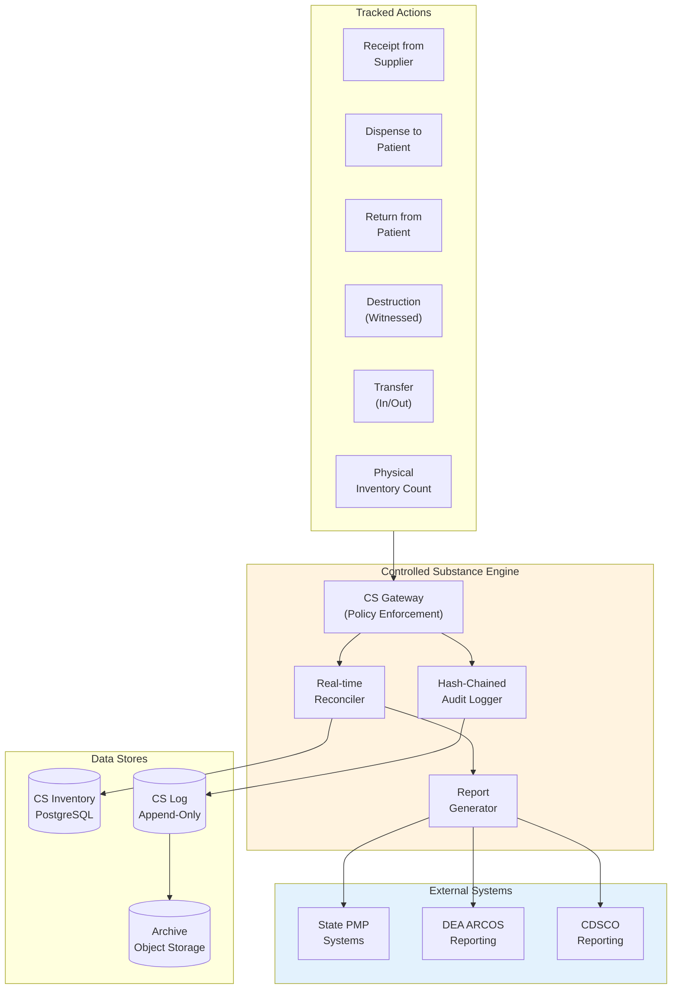
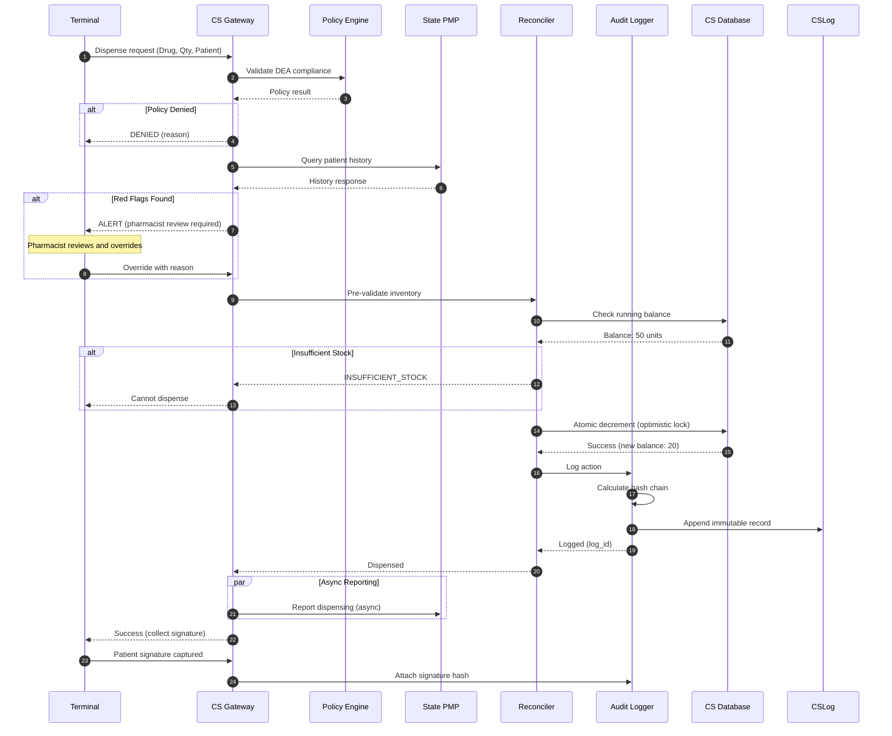
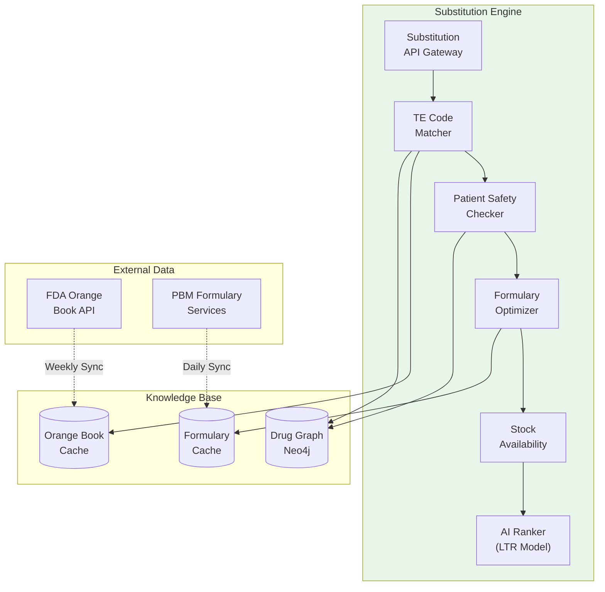
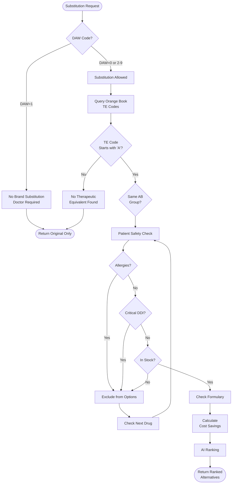
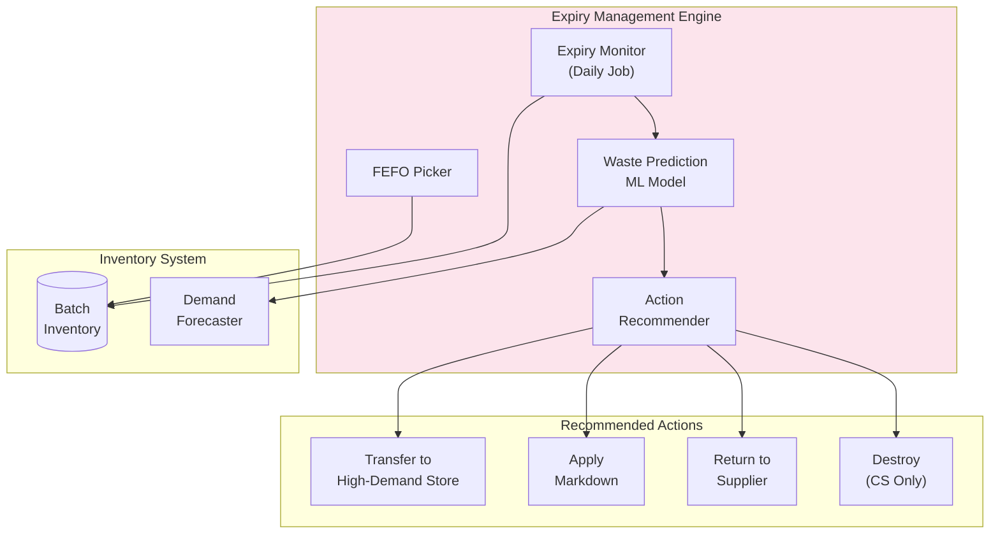

# Deep Dive and Bottlenecks

[Back to Index](./00-index.md)

---

## Critical Component 1: Controlled Substance Tracking Engine

### Overview

The Controlled Substance Tracking Engine maintains a perpetual inventory of Schedule II-V (DEA) and Schedule H/H1/X (CDSCO) drugs with real-time reconciliation, tamper-evident logging, and regulatory reporting capabilities.

### Architecture



### Internal Workflow: Dispensing a Controlled Substance



### Hash-Chained Audit Log

The controlled substance log uses a hash chain for tamper detection:

```
LOG ENTRY STRUCTURE:

{
    "log_id": "uuid",
    "pharmacy_id": "uuid",
    "drug_id": "uuid",
    "batch_id": "uuid",
    "action_type": "DISPENSE",
    "quantity": 30,
    "running_balance": 20,
    "pharmacist_id": "uuid",
    "patient_id": "uuid",
    "rx_id": "uuid",
    "action_time": "2024-01-15T14:30:00Z",
    "previous_hash": "a1b2c3d4e5f6...",  // Hash of previous entry
    "current_hash": "f6e5d4c3b2a1..."    // SHA-256(all fields + previous_hash)
}

HASH CALCULATION:
current_hash = SHA256(
    log_id +
    pharmacy_id +
    drug_id +
    batch_id +
    action_type +
    quantity +
    running_balance +
    pharmacist_id +
    action_time +
    previous_hash
)
```

### Reconciliation Process

```
ALGORITHM: DailyReconciliation

FUNCTION reconcile_controlled_substances(pharmacy_id, date):

    // Get all CS drugs in pharmacy
    cs_drugs = query("""
        SELECT DISTINCT drug_id FROM inventory_batch
        WHERE pharmacy_id = $pharmacy_id
        AND drug_id IN (SELECT drug_id FROM drug WHERE controlled_substance_flag = TRUE)
        AND quantity_available > 0
    """)

    discrepancies = []

    FOR EACH drug IN cs_drugs:
        // Calculate expected balance from log
        log_balance = query("""
            SELECT running_balance
            FROM controlled_substance_log
            WHERE pharmacy_id = $pharmacy_id
            AND drug_id = $drug_id
            ORDER BY action_time DESC
            LIMIT 1
        """)

        // Calculate actual from inventory
        actual_balance = query("""
            SELECT SUM(get_batch_available(b)) AS total
            FROM inventory_batch b
            WHERE pharmacy_id = $pharmacy_id
            AND drug_id = $drug_id
        """)

        IF log_balance != actual_balance:
            discrepancy = {
                'drug_id': drug.drug_id,
                'expected': log_balance,
                'actual': actual_balance,
                'variance': actual_balance - log_balance,
                'severity': classify_severity(drug, abs(actual_balance - log_balance))
            }
            discrepancies.append(discrepancy)

            // Create alert
            create_alert(pharmacy_id, 'CS_DISCREPANCY', discrepancy)

            // Log discrepancy for audit
            log_discrepancy(pharmacy_id, drug.drug_id, discrepancy)

    IF discrepancies:
        // Require pharmacist resolution within 24 hours
        create_resolution_task(pharmacy_id, discrepancies)

    RETURN {
        'date': date,
        'drugs_checked': len(cs_drugs),
        'discrepancies': discrepancies,
        'status': 'CLEAN' if not discrepancies else 'DISCREPANCIES_FOUND'
    }
```

### DEA ARCOS Reporting

```
ALGORITHM: GenerateARCOSReport

// ARCOS (Automation of Reports and Consolidated Orders System)
// DEA requires annual reporting of Schedule II acquisitions and dispositions

FUNCTION generate_arcos_report(pharmacy_id, reporting_year):

    // Query all Schedule II activity for the year
    activities = query("""
        SELECT
            d.dea_drug_code,
            d.ndc_code,
            csl.action_type,
            SUM(csl.quantity) AS total_quantity,
            d.unit_of_measure
        FROM controlled_substance_log csl
        JOIN drug d ON csl.drug_id = d.drug_id
        WHERE csl.pharmacy_id = $pharmacy_id
        AND EXTRACT(YEAR FROM csl.action_time) = $reporting_year
        AND d.schedule_class = 'C-II'
        GROUP BY d.dea_drug_code, d.ndc_code, csl.action_type, d.unit_of_measure
    """)

    report = {
        'pharmacy_dea_number': get_pharmacy_dea(pharmacy_id),
        'reporting_period': {
            'start': f'{reporting_year}-01-01',
            'end': f'{reporting_year}-12-31'
        },
        'transactions': []
    }

    FOR EACH activity IN activities:
        arcos_record = {
            'ndc': activity.ndc_code,
            'dea_drug_code': activity.dea_drug_code,
            'transaction_code': map_action_to_arcos_code(activity.action_type),
            'quantity': activity.total_quantity,
            'unit': activity.unit_of_measure
        }
        report['transactions'].append(arcos_record)

    // Validate completeness
    opening_balance = get_opening_balance(pharmacy_id, reporting_year)
    closing_balance = get_closing_balance(pharmacy_id, reporting_year)

    receipts = sum(t.quantity for t in report.transactions if t.transaction_code == 'RECEIPT')
    distributions = sum(t.quantity for t in report.transactions if t.transaction_code == 'DISTRIBUTION')

    expected_closing = opening_balance + receipts - distributions

    IF expected_closing != closing_balance:
        report['validation_error'] = {
            'expected': expected_closing,
            'actual': closing_balance,
            'variance': closing_balance - expected_closing
        }

    RETURN report
```

### Failure Modes and Handling

| Failure Mode | Detection | Impact | Recovery |
|--------------|-----------|--------|----------|
| Database unavailable | Connection timeout | Cannot dispense CS | Fail-closed, queue offline if allowed |
| Hash chain broken | Integrity check | Audit trail compromised | Alert, investigate, restore from backup |
| Running balance mismatch | Reconciliation | Regulatory violation | Immediate investigation, Form 106 if theft |
| PMP API timeout | HTTP timeout | Cannot check history | Proceed with manual verification, retry async |
| Duplicate dispense attempt | Idempotency check | Potential double-dispense | Block, alert pharmacist |

---

## Critical Component 2: Medication Substitution Engine

### Overview

The Medication Substitution Engine recommends generic alternatives based on FDA Orange Book therapeutic equivalence codes, patient safety, formulary coverage, and inventory availability.

### Architecture



### Orange Book TE Code Hierarchy

```
THERAPEUTIC EQUIVALENCE CODES:

A-Rated (Substitutable):
├── AA: No bioequivalence issues
├── AB: Meets bioequivalence requirements
│   ├── AB1, AB2, AB3: Products that are bioequivalent to each other
│   │   (AB1 can substitute AB1, but not AB2)
├── AN: Aerosol products
├── AO: Injectable oils
├── AP: Injectable aqueous
└── AT: Topicals

B-Rated (NOT Substitutable):
├── BC: Extended-release dosage forms
├── BD: Active ingredients in specific dosage forms
├── BE: Delayed-release formulations
├── BN: Extended-release products (not bioequivalent)
├── BP: Active ingredients with potential bioequivalence issues
├── BR: Suppository dosage forms
├── BS: Products requiring in-vivo bioequivalence studies
├── BT: Topical products with potential issues
└── BX: Insufficient data
```

### Substitution Decision Flow



### Learning-to-Rank Model for Substitution

```
ALGORITHM: SubstitutionRanking

MODEL: Gradient Boosted Trees (XGBoost LambdaMART)

TRAINING DATA:
  - Historical substitution acceptances by pharmacists
  - Patient outcomes (adherence, adverse events)
  - Cost savings realized

FEATURES:
  1. te_code_score: AA=1.0, AB=0.95, AN=0.9, ...
  2. savings_percent: (brand_price - generic_price) / brand_price
  3. formulary_tier_normalized: (5 - tier) / 4
  4. stock_freshness: days_until_expiry / 365
  5. ddi_risk_score: 0-1 based on interaction count/severity
  6. historical_acceptance_rate: pharmacy-specific acceptance rate
  7. manufacturer_reliability: supplier defect rate
  8. patient_preference_match: 0/1 if patient has history with this generic

INFERENCE:
  FOR EACH candidate drug:
      features = extract_features(candidate, context)
      score = model.predict(features)
      candidate.rank_score = score

  SORT candidates BY rank_score DESC
  RETURN top_n(candidates, 5)

RETRAINING:
  - Weekly batch retraining
  - Online learning for pharmacist feedback
  - A/B testing for model improvements
```

### Failure Modes and Handling

| Failure Mode | Detection | Impact | Recovery |
|--------------|-----------|--------|----------|
| Neo4j unavailable | Connection timeout | No TE lookups | Use cached Orange Book data |
| Orange Book stale | Age > 7 days | Outdated equivalences | Warn user, proceed with cache |
| Formulary API timeout | HTTP timeout | No copay info | Show alternatives without copay |
| Ranking model failure | Inference error | Poor ranking | Fall back to rule-based ranking |
| No equivalents found | Empty result | No options | Return original drug only |

---

## Critical Component 3: Expiry Management System (FEFO)

### Overview

The Expiry Management System ensures First Expiry First Out (FEFO) picking, predicts waste risk, and recommends optimization actions like transfers, markdowns, and returns.

### Architecture



### FEFO Picking Algorithm

```
ALGORITHM: FEFOPick

// Ensure we always dispense from the batch expiring soonest

FUNCTION pick_batch(pharmacy_id, drug_id, quantity_needed):

    // Get all available batches sorted by expiry (FEFO)
    batches = query("""
        SELECT batch_id, expiry_date, get_batch_available(b) AS available
        FROM inventory_batch b
        WHERE pharmacy_id = $pharmacy_id
        AND drug_id = $drug_id
        AND get_batch_available(b) > 0
        AND expiry_date > NOW()  -- Not expired
        ORDER BY expiry_date ASC  -- First Expiry First
    """)

    IF batches IS EMPTY:
        RAISE InsufficientStockError(drug_id, quantity_needed)

    picks = []
    remaining = quantity_needed

    FOR EACH batch IN batches:
        IF remaining <= 0:
            BREAK

        // Check if batch is too close to expiry for dispensing
        days_to_expiry = (batch.expiry_date - today).days
        IF days_to_expiry < get_min_days_to_expiry(drug_id):
            // Skip this batch, it's too close to expiry
            log_warning(f"Skipping batch {batch.batch_id}: expires in {days_to_expiry} days")
            CONTINUE

        pick_qty = min(batch.available, remaining)
        picks.append({
            'batch_id': batch.batch_id,
            'quantity': pick_qty,
            'expiry_date': batch.expiry_date
        })
        remaining -= pick_qty

    IF remaining > 0:
        // Partial fill possible
        RAISE PartialStockError(drug_id, quantity_needed, quantity_needed - remaining)

    RETURN picks

FUNCTION get_min_days_to_expiry(drug_id):
    drug = get_drug(drug_id)

    // Minimum days to expiry for dispensing varies by drug type
    IF drug.schedule_class IN ['C-II', 'C-III', 'C-IV', 'C-V']:
        RETURN 30  // Controlled substances need more buffer
    ELSE IF drug.requires_cold_storage:
        RETURN 14  // Cold chain products
    ELSE:
        RETURN 7   // Standard
```

### Waste Prediction Model

```
ALGORITHM: WastePrediction

MODEL: Gradient Boosted Regression (XGBoost)

FEATURES:
  - days_to_expiry: Days until batch expires
  - historical_daily_demand: Average daily demand for this drug
  - demand_trend: Increasing/decreasing/stable
  - current_stock_ratio: current_qty / avg_30_day_demand
  - seasonality_factor: Expected demand multiplier for season
  - nearby_store_demand: Demand at nearby locations (transfer potential)
  - supplier_return_eligible: Binary (can we return this?)
  - price_elasticity: Historical response to markdowns

TARGET:
  - waste_probability: 0-1 probability of units being wasted

TRAINING:
  - Historical data: batches that expired with remaining qty
  - Labeled: actual_waste / initial_qty

FUNCTION predict_waste(batch):
    features = extract_features(batch)

    // Demand forecast integration
    forecast = demand_forecaster.predict(
        batch.drug_id,
        batch.pharmacy_id,
        batch.days_to_expiry
    )

    features['expected_demand'] = sum(forecast)
    features['demand_std'] = std(forecast)
    features['surplus_ratio'] = (batch.available - features['expected_demand']) / batch.available

    waste_prob = model.predict(features)

    // Confidence interval
    waste_lower, waste_upper = model.predict_with_uncertainty(features)

    RETURN {
        'waste_probability': waste_prob,
        'confidence_interval': (waste_lower, waste_upper),
        'expected_waste_units': max(0, batch.available - features['expected_demand']),
        'expected_waste_value': expected_waste_units * batch.purchase_price
    }
```

### Action Recommendation Logic

```
ALGORITHM: RecommendExpiryActions

FUNCTION recommend_actions(batch, waste_prediction):

    actions = []
    drug = get_drug(batch.drug_id)

    // High waste probability triggers aggressive actions
    IF waste_prediction.waste_probability > 0.7:

        // Action 1: Transfer to high-demand location
        high_demand_stores = find_stores_with_demand(
            batch.drug_id,
            min_demand=waste_prediction.expected_waste_units,
            max_distance_miles=100
        )

        IF high_demand_stores:
            best_store = max(high_demand_stores, key=lambda s: s.demand)
            actions.append({
                'action': 'TRANSFER',
                'priority': 1,
                'target_pharmacy': best_store.pharmacy_id,
                'quantity': waste_prediction.expected_waste_units,
                'expected_recovery_percent': 100,  // Full value recovery
                'deadline': batch.expiry_date - 14  // Need 2 weeks to transfer
            })

        // Action 2: Return to supplier
        return_policy = get_supplier_return_policy(batch.supplier_id, batch.drug_id)

        IF return_policy.eligible:
            min_days_for_return = return_policy.min_days_before_expiry
            IF batch.days_to_expiry >= min_days_for_return:
                actions.append({
                    'action': 'RETURN_TO_SUPPLIER',
                    'priority': 2,
                    'quantity': waste_prediction.expected_waste_units,
                    'credit_percent': return_policy.credit_percent,
                    'expected_recovery_percent': return_policy.credit_percent,
                    'deadline': batch.expiry_date - min_days_for_return
                })

        // Action 3: Markdown (not for controlled substances)
        IF drug.schedule_class IN ['OTC', 'Rx'] AND NOT drug.controlled_substance_flag:
            optimal_markdown = calculate_optimal_markdown(batch, waste_prediction)
            actions.append({
                'action': 'MARKDOWN',
                'priority': 3,
                'discount_percent': optimal_markdown.discount,
                'expected_additional_units_sold': optimal_markdown.additional_demand,
                'expected_recovery_percent': optimal_markdown.recovery_percent,
                'start_date': today,
                'end_date': batch.expiry_date - 7
            })

    // Medium waste probability: monitor + prepare
    ELSE IF waste_prediction.waste_probability > 0.3:
        actions.append({
            'action': 'PRIORITIZE_FEFO',
            'priority': 1,
            'message': 'Ensure this batch is picked first'
        })
        actions.append({
            'action': 'MONITOR',
            'priority': 2,
            'review_date': today + 14,
            'message': 'Re-evaluate in 2 weeks'
        })

    // Controlled substances: destruction is the only option for unsalable inventory
    IF drug.controlled_substance_flag AND batch.days_to_expiry < 30:
        actions.append({
            'action': 'SCHEDULE_DESTRUCTION',
            'priority': 0,  // Highest priority
            'message': 'Contact DEA reverse distributor',
            'form_required': 'DEA Form 41',
            'witness_required': True
        })

    RETURN sorted(actions, key=lambda a: a['priority'])
```

---

## Bottleneck Analysis

### Bottleneck 1: Drug Graph Query Latency

**Problem**: Neo4j graph traversals for therapeutic equivalence and DDI checks can be slow for complex queries.

**Symptoms**:
- Substitution API p99 > 2s
- DDI check adds >500ms to dispensing flow

**Root Cause**:
- Deep graph traversals (3+ hops)
- Large result sets for some therapeutic classes
- Cold cache on Neo4j restarts

**Mitigation Strategies**:

1. **Materialize Common Paths**:
```cypher
// Pre-compute and cache common equivalence lookups
CREATE INDEX therapeutic_equivalence_idx FOR (d:Drug) ON (d.rxcui)

// Create materialized view table
CREATE TABLE drug_equivalence_cache (
    drug_rxcui VARCHAR(20),
    equivalent_rxcui VARCHAR(20),
    te_code VARCHAR(5),
    cached_at TIMESTAMPTZ,
    PRIMARY KEY (drug_rxcui, equivalent_rxcui)
);

// Refresh nightly
REFRESH drug_equivalence_cache FROM neo4j_query;
```

2. **Redis Caching Layer**:
```
Cache Strategy:
- Key: te:{rxcui}
- Value: List of equivalent drug objects
- TTL: 24 hours
- Invalidation: On Orange Book update

Hit Rate Target: 95%
```

3. **Query Optimization**:
```cypher
// Before: Multiple queries
MATCH (d1:Drug {rxcui: $rxcui})-[:INTERACTS_WITH]->(d2:Drug)
WHERE d2.rxcui IN $patient_drugs
RETURN d2

// After: Single optimized query with index hints
MATCH (d1:Drug {rxcui: $rxcui})
USING INDEX d1:Drug(rxcui)
MATCH (d1)-[i:INTERACTS_WITH]->(d2:Drug)
WHERE d2.rxcui IN $patient_drugs
RETURN d2.rxcui, d2.name, i.severity
```

### Bottleneck 2: State PMP API Rate Limits

**Problem**: State PMP (Prescription Monitoring Program) APIs have strict rate limits and can be slow.

**Symptoms**:
- PMP queries timing out (>5s)
- Rate limit errors (429) during peak hours
- Controlled substance dispensing backed up

**Mitigation Strategies**:

1. **Request Batching**:
```
// Instead of one request per transaction, batch by patient
Batch Window: 100ms
Max Batch Size: 10 patients

// Single batch request
POST /pmp/batch-query
{
    "patients": [
        {"patient_id": "...", "state": "CA"},
        {"patient_id": "...", "state": "CA"},
        ...
    ]
}
```

2. **Caching with Short TTL**:
```
Cache Strategy:
- Key: pmp:{patient_id}:{state}
- TTL: 15 minutes (compliance requirement)
- Invalidation: On new dispensing in our system

Rationale: Patient history unlikely to change in 15 min
```

3. **Async Pre-fetch**:
```
// When prescription is received (before fill)
ON prescription_received:
    IF drug.is_controlled:
        async_prefetch_pmp(patient_id, state)

// By the time pharmacist fills, data is cached
```

4. **Graceful Degradation**:
```
IF pmp_api.timeout OR pmp_api.rate_limited:
    // Don't block the transaction
    response.pmp_status = 'UNAVAILABLE'
    response.warning = 'PMP check could not be completed. Manual verification required.'

    // Require pharmacist acknowledgment
    response.requires_pharmacist_override = True

    // Retry in background
    queue_pmp_retry(transaction_id, patient_id)
```

### Bottleneck 3: Multi-Terminal Inventory Race Conditions

**Problem**: Multiple terminals dispensing from the same batch can cause overselling or negative inventory.

**Symptoms**:
- Negative inventory alerts
- Inventory discrepancies after reconciliation
- Customer complaints about out-of-stock items

**Root Cause**:
- Concurrent decrements without coordination
- Network delays in CRDT sync
- Split-brain during network partition

**Mitigation Strategies**:

1. **CRDT with Reservation**:
```
// Two-phase dispense: Reserve, then commit

FUNCTION dispense_with_reservation(batch_id, terminal_id, quantity):
    // Phase 1: Reserve
    reservation = create_reservation(batch_id, terminal_id, quantity, ttl=5min)

    IF NOT reservation.success:
        RETURN InsufficientStock()

    // Phase 2: Complete transaction
    TRY:
        transaction = complete_dispense(...)
        commit_reservation(reservation.id)
        RETURN transaction
    CATCH:
        cancel_reservation(reservation.id)
        RAISE
```

2. **Optimistic Locking with Retry**:
```sql
-- Use version column for optimistic locking
UPDATE inventory_batch
SET quantity_sub = jsonb_set(
    quantity_sub,
    ARRAY[$terminal_id],
    to_jsonb(COALESCE((quantity_sub->$terminal_id)::int, 0) + $quantity)
),
version = version + 1
WHERE batch_id = $batch_id
AND version = $expected_version
AND get_batch_available(inventory_batch) >= $quantity;

-- Retry with exponential backoff if affected_rows = 0
```

3. **Pessimistic Locking for Controlled Substances**:
```
// For CS, use pessimistic locking (safety > performance)

FUNCTION dispense_controlled_substance(batch_id, quantity):
    WITH lock AS (
        SELECT * FROM inventory_batch
        WHERE batch_id = $batch_id
        FOR UPDATE NOWAIT
    )
    UPDATE inventory_batch
    SET ...
    WHERE batch_id = $batch_id;

    // If NOWAIT fails (lock not available), retry in 100ms
```

4. **Negative Inventory Detection and Alert**:
```
// Post-sync reconciliation
FUNCTION detect_negative_inventory(pharmacy_id):
    negative_batches = query("""
        SELECT batch_id, drug_id, get_batch_available(b) AS available
        FROM inventory_batch b
        WHERE pharmacy_id = $pharmacy_id
        AND get_batch_available(b) < 0
    """)

    FOR EACH batch IN negative_batches:
        create_alert('NEGATIVE_INVENTORY', batch)
        // Immediate investigation required
        create_task('RESOLVE_INVENTORY_DISCREPANCY', batch)
```

---

## Concurrency Patterns Summary

| Component | Concurrency Model | Lock Type | Timeout | Retry Strategy |
|-----------|-------------------|-----------|---------|----------------|
| Controlled Substance Log | Append-only | N/A | N/A | Idempotent writes |
| General Inventory | CRDT + Reservation | Optimistic | 5s | Exponential backoff |
| CS Inventory | Pessimistic lock | Row lock | 1s | Limited retry, fail-closed |
| Transaction Creation | Optimistic | Version column | 3s | 3 retries |
| PMP Query | Async + Cache | N/A | 5s | Background retry |
| Insurance Claim | Sync with timeout | N/A | 10s | Queue for retry |
