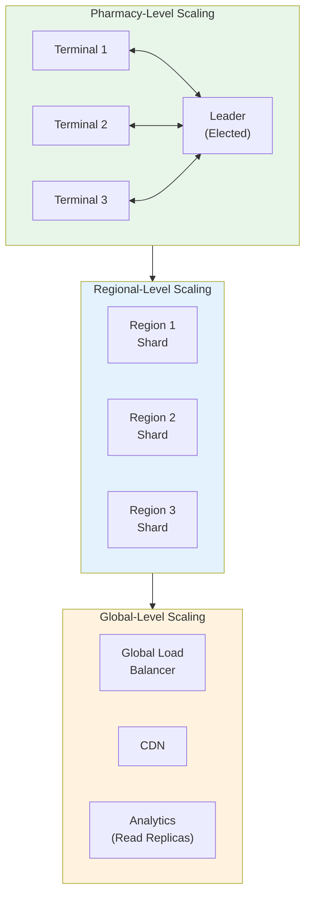
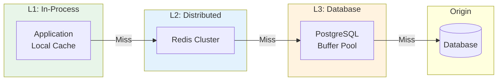
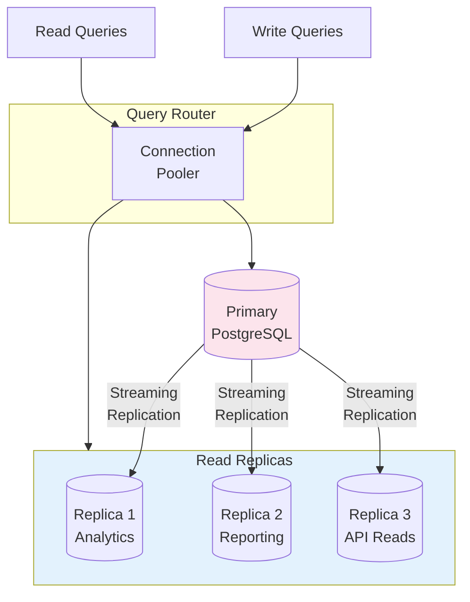
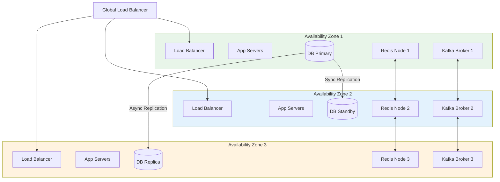
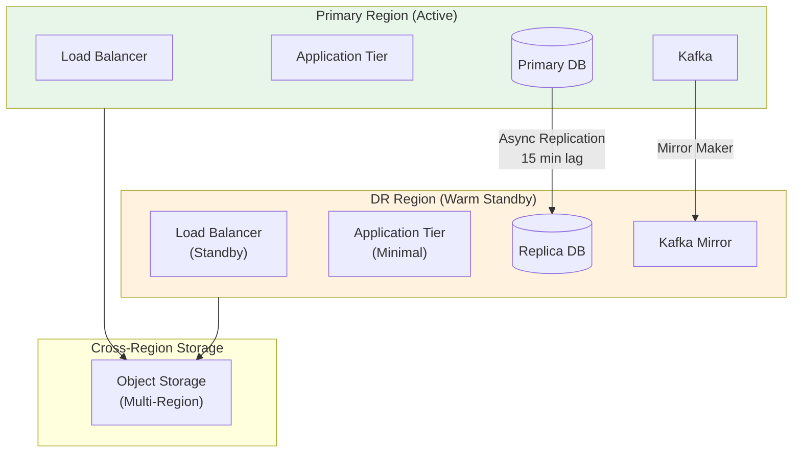

# Scalability and Reliability

[Back to Index](./00-index.md)

---

## Scalability Strategy

### Scale Dimensions

| Dimension | Current | Target (Year 1) | Target (Year 5) |
|-----------|---------|-----------------|-----------------|
| Pharmacies | 100 | 10,000 | 50,000 |
| Terminals per Pharmacy | 3 | 5 | 10 |
| Transactions per Day | 50K | 5M | 25M |
| SKUs per Pharmacy | 5,000 | 10,000 | 15,000 |
| Patients (Total) | 500K | 50M | 200M |
| Storage (Total) | 1 TB | 30 TB | 150 TB |

### Scaling Layers



---

## Horizontal Scaling Strategy

### Database Sharding

**Sharding Key**: `pharmacy_id`

**Rationale**:
- Most queries are pharmacy-scoped (inventory, transactions, prescriptions)
- Eliminates cross-shard queries for 95%+ of operations
- Natural tenant isolation for multi-tenant SaaS

```
SHARD DISTRIBUTION:

Shard 0: pharmacy_id hash % 16 == 0
Shard 1: pharmacy_id hash % 16 == 1
...
Shard 15: pharmacy_id hash % 16 == 15

// Initial: 4 shards
// Scale to 16 shards at 2,500 pharmacies per shard threshold
```

**Shard-Aware Routing**:
```
FUNCTION route_query(pharmacy_id, query):
    shard_id = hash(pharmacy_id) % num_shards
    connection = shard_connections[shard_id]
    RETURN connection.execute(query)
```

**Cross-Shard Queries** (Rare):
```
// For cross-pharmacy analytics (corporate dashboards)
// Use scatter-gather pattern

FUNCTION aggregate_sales(org_id, date_range):
    pharmacy_ids = get_pharmacies_for_org(org_id)
    shards = group_by_shard(pharmacy_ids)

    results = parallel_execute([
        (shard, aggregate_query(shard_pharmacy_ids))
        FOR shard, shard_pharmacy_ids IN shards
    ])

    RETURN merge_aggregates(results)
```

### Service Scaling

| Service | Scaling Type | Trigger | Min | Max |
|---------|--------------|---------|-----|-----|
| **API Gateway** | Horizontal (Auto) | CPU > 70%, RPS > 10K | 3 | 20 |
| **Dispensing Service** | Horizontal (Auto) | CPU > 60%, Latency p99 > 400ms | 5 | 50 |
| **Inventory Service** | Horizontal (Auto) | CPU > 60% | 3 | 30 |
| **Substitution Service** | Horizontal (Auto) | Latency p99 > 1.5s | 2 | 20 |
| **Claims Service** | Horizontal (Auto) | Queue depth > 1000 | 3 | 30 |
| **Analytics Service** | Horizontal (Scheduled) | Pre-scale for reporting windows | 2 | 15 |
| **AI Inference** | Horizontal (GPU) | GPU utilization > 80% | 2 | 10 |

### Auto-Scaling Configuration

```yaml
# Kubernetes HPA for Dispensing Service
apiVersion: autoscaling/v2
kind: HorizontalPodAutoscaler
metadata:
  name: dispensing-service-hpa
spec:
  scaleTargetRef:
    apiVersion: apps/v1
    kind: Deployment
    name: dispensing-service
  minReplicas: 5
  maxReplicas: 50
  metrics:
    - type: Resource
      resource:
        name: cpu
        target:
          type: Utilization
          averageUtilization: 60
    - type: Pods
      pods:
        metric:
          name: http_request_latency_p99
        target:
          type: AverageValue
          averageValue: 400m  # 400ms
  behavior:
    scaleUp:
      stabilizationWindowSeconds: 60
      policies:
        - type: Percent
          value: 100
          periodSeconds: 60
    scaleDown:
      stabilizationWindowSeconds: 300
      policies:
        - type: Percent
          value: 10
          periodSeconds: 60
```

---

## Caching Strategy

### Multi-Level Cache Architecture



### Cache Configuration

| Cache | Data | Size | TTL | Invalidation |
|-------|------|------|-----|--------------|
| **Drug Catalog (L2)** | Drug master data | 5 GB | 24 hours | On DB update |
| **Orange Book (L2)** | TE codes | 100 MB | 24 hours | Weekly refresh |
| **Formulary (L2)** | Payer formularies | 1 GB/payer | 1 hour | On payer update |
| **Patient (L1+L2)** | Active patients | 2 GB/pharmacy | 1 hour | On patient update |
| **Inventory (L1)** | Stock levels | 100 MB/pharmacy | 5 minutes | On transaction |
| **Session (L2)** | User sessions | 50 KB/session | 8 hours | On logout |

### Cache Warming

```
FUNCTION warm_cache_on_startup(pharmacy_id):
    // Critical data for pharmacy operations

    // 1. Drug catalog (entire catalog)
    drugs = fetch_all_drugs()
    cache.set_many(f"drug:{d.drug_id}" for d in drugs)

    // 2. Pharmacy's inventory
    batches = fetch_inventory(pharmacy_id)
    cache.set(f"inventory:{pharmacy_id}", batches)

    // 3. Active prescriptions (will-call, in-progress)
    active_rx = fetch_active_prescriptions(pharmacy_id)
    cache.set(f"active_rx:{pharmacy_id}", active_rx)

    // 4. Formulary for top 5 payers
    top_payers = get_top_payers(pharmacy_id)
    FOR payer IN top_payers:
        formulary = fetch_formulary(payer.id)
        cache.set(f"formulary:{payer.id}", formulary)

    // 5. Orange Book TE codes
    te_codes = fetch_orange_book()
    cache.set("orange_book", te_codes)
```

---

## Read Replica Strategy

### Replica Topology



### Read/Write Splitting

| Query Type | Route | Examples |
|------------|-------|----------|
| **Writes** | Primary | INSERT, UPDATE, DELETE |
| **Transactional Reads** | Primary | Read-after-write, CS logs |
| **Analytics Reads** | Replica 1 | Dashboard queries, reports |
| **Reporting** | Replica 2 | DEA reports, compliance exports |
| **API Reads** | Replica 3 | Patient lookup, drug search |

### Replication Lag Handling

```
MAX_ACCEPTABLE_LAG = 5 seconds

FUNCTION route_read_query(query, requires_consistency):
    IF requires_consistency:
        // Critical reads: CS balance, transaction status
        RETURN primary_connection

    // Check replica lag
    replica = select_replica()
    lag = check_replication_lag(replica)

    IF lag > MAX_ACCEPTABLE_LAG:
        // Fall back to primary
        log_warning(f"Replica lag {lag}s, routing to primary")
        RETURN primary_connection

    RETURN replica.connection
```

---

## Reliability and Fault Tolerance

### Single Points of Failure (SPOF) Analysis

| Component | SPOF Risk | Mitigation |
|-----------|-----------|------------|
| Database Primary | High | Multi-AZ deployment, automatic failover |
| Redis Cluster | Medium | Redis Sentinel, cross-AZ nodes |
| Kafka Cluster | Medium | Multi-broker, replication factor 3 |
| API Gateway | Low | Multiple instances, health checks |
| OPA Policy Engine | Medium | Sidecar deployment, cached policies |
| Neo4j Graph | Medium | Causal clustering, read replicas |
| PMP External API | High (external) | Caching, graceful degradation |

### Redundancy Architecture



### Failover Mechanisms

**Database Failover**:
```
FAILOVER TRIGGER:
- Primary health check fails for 30 seconds
- Replication lag > 60 seconds
- Manual trigger by operator

FAILOVER PROCESS:
1. Detect primary failure (health check)
2. Promote standby to primary (automatic)
3. Update DNS/connection strings
4. Redirect traffic to new primary
5. Alert operations team
6. Provision new standby

RTO: < 60 seconds (automatic)
RPO: 0 (synchronous replication to standby)
```

**Application Failover**:
```yaml
# Circuit Breaker Configuration
resilience4j:
  circuitbreaker:
    instances:
      pmp-api:
        slidingWindowSize: 10
        failureRateThreshold: 50
        waitDurationInOpenState: 30s
        permittedNumberOfCallsInHalfOpenState: 3
      insurance-api:
        slidingWindowSize: 20
        failureRateThreshold: 60
        waitDurationInOpenState: 60s
```

### Retry Strategies

| Operation | Retry Count | Backoff | Timeout |
|-----------|-------------|---------|---------|
| Database Write | 3 | Exponential (100ms base) | 5s |
| Database Read | 2 | Linear (50ms) | 3s |
| Cache Read/Write | 1 | None | 100ms |
| PMP API | 3 | Exponential (1s base) | 10s |
| Insurance Claim | 3 | Exponential (2s base) | 30s |
| Internal Service | 2 | Linear (100ms) | 5s |

```
FUNCTION retry_with_backoff(operation, max_retries, base_delay):
    FOR attempt IN range(max_retries):
        TRY:
            RETURN operation()
        CATCH RetryableError AS e:
            IF attempt == max_retries - 1:
                RAISE e

            delay = base_delay * (2 ** attempt)
            jitter = random(0, delay * 0.1)
            sleep(delay + jitter)

    RAISE MaxRetriesExceeded()
```

### Graceful Degradation

| Feature | Degraded Mode | Trigger |
|---------|---------------|---------|
| **Substitution Suggestions** | Show original drug only | Neo4j unavailable |
| **PMP Check** | Manual verification required | PMP API timeout |
| **Insurance Adjudication** | Cash price, queue for retry | Payer API down |
| **Demand Forecasting** | Use historical average | AI service unavailable |
| **Analytics Dashboard** | Show cached data | Analytics replica down |
| **Real-time Sync** | Queue locally, sync later | Cloud unreachable |

---

## Offline Capability

### 24+ Hour Offline Operation

The system supports extended offline operation at the pharmacy level.

**Offline-Capable Features**:
- OTC sales (full)
- Non-controlled Rx dispensing (with cached data)
- Inventory tracking (CRDT sync on reconnect)
- Patient lookup (cached recent patients)
- Drug information (cached catalog)

**Offline-Limited Features**:
- Controlled substance dispensing (limited, requires reconciliation)
- Insurance adjudication (cash only, queue for later)
- PMP checks (not available)
- New patient creation (limited)

**Offline Data Sync**:
```
TERMINAL LOCAL STORAGE:
├── SQLite Database
│   ├── transactions (pending sync)
│   ├── inventory_batches (CRDT state)
│   ├── patients (cached subset)
│   ├── drugs (full catalog)
│   └── prescriptions (pharmacy's active)
├── Queue
│   ├── pending_transactions
│   ├── pending_insurance_claims
│   └── pending_pmp_reports
└── State
    ├── vector_clock
    └── last_sync_timestamp

SYNC ON RECONNECT:
1. Compare vector clocks with cloud
2. Upload pending transactions (idempotent)
3. CRDT merge inventory changes
4. Download updates (new patients, Rx)
5. Process queued insurance claims
6. Submit queued PMP reports
```

---

## Disaster Recovery

### Recovery Objectives

| Scenario | RTO | RPO | Strategy |
|----------|-----|-----|----------|
| **Single AZ Failure** | 0 (automatic) | 0 | Multi-AZ deployment |
| **Database Failure** | 60 seconds | 0 | Automatic failover |
| **Region Failure** | 4 hours | 15 minutes | DR region activation |
| **Data Corruption** | 2 hours | 1 hour | Point-in-time recovery |
| **Complete Cloud Failure** | 8 hours | 24 hours | Multi-cloud DR |

### Backup Strategy

```
BACKUP SCHEDULE:

Continuous:
├── PostgreSQL WAL archiving (every 1 minute)
├── Kafka topic replication (real-time)
└── Redis RDB snapshots (every 5 minutes)

Hourly:
├── PostgreSQL logical backup (pg_dump)
└── Neo4j backup

Daily:
├── Full database snapshot
├── Object storage (S3) cross-region replication
└── Configuration backups

Weekly:
├── Full system backup
└── DR failover test (non-disruptive)

RETENTION:
├── WAL archives: 7 days
├── Hourly backups: 48 hours
├── Daily backups: 30 days
├── Weekly backups: 12 weeks
├── Monthly backups: 12 months
└── Yearly backups: 7 years (compliance)
```

### DR Region Configuration



### DR Activation Procedure

```
DR ACTIVATION RUNBOOK:

Pre-Conditions:
- Primary region unavailable for > 15 minutes
- Business decision to activate DR
- RPO breach acceptable

Steps:
1. DECLARE DR EVENT
   - Notify stakeholders
   - Begin timeline tracking

2. PROMOTE DR DATABASE
   - Stop replication from primary
   - Promote replica to primary
   - Verify data integrity (spot checks)

3. SCALE DR APPLICATION TIER
   - Increase replicas from standby (2) to active (20)
   - Warm caches (drug catalog, formulary)

4. UPDATE DNS
   - Point api.pharmacy.com to DR load balancer
   - TTL: 60 seconds (pre-configured for fast switch)

5. VERIFY FUNCTIONALITY
   - Health checks pass
   - Test transaction (sandbox pharmacy)
   - Verify external integrations (PMP, payers)

6. COMMUNICATE
   - Status page update
   - Customer notification
   - Internal all-hands

7. MONITOR
   - Watch for errors
   - Monitor performance
   - Track data sync queue

Estimated Time: 4 hours (with practice: 2 hours)
```

---

## Load Testing Results

### Benchmark Configuration

| Parameter | Value |
|-----------|-------|
| Test Duration | 1 hour |
| Pharmacies Simulated | 1,000 |
| Terminals per Pharmacy | 5 |
| Transactions per Terminal | 100/day (compressed) |
| Peak Multiplier | 3x (simulating rush hour) |

### Results Summary

| Metric | Target | Actual | Status |
|--------|--------|--------|--------|
| **Throughput** | 140 TPS | 180 TPS | PASS |
| **Dispensing Latency (p50)** | < 300ms | 180ms | PASS |
| **Dispensing Latency (p99)** | < 500ms | 420ms | PASS |
| **Substitution Latency (p99)** | < 2s | 1.4s | PASS |
| **Error Rate** | < 0.1% | 0.05% | PASS |
| **Database CPU** | < 70% | 55% | PASS |
| **Application CPU** | < 80% | 65% | PASS |
| **Memory Usage** | < 80% | 60% | PASS |

### Stress Test (Breaking Point)

| Metric | Value at Break |
|--------|----------------|
| **Max Throughput** | 350 TPS |
| **Break Point Latency** | p99 > 2s |
| **Bottleneck** | Database connections |
| **Recovery** | Auto-recovered in 45s |

### Recommendations from Load Testing

1. **Connection Pooling**: Increase max connections from 100 to 200
2. **Cache Warming**: Pre-warm drug catalog cache on deployment
3. **Query Optimization**: Add index for `inventory_batch(pharmacy_id, drug_id, expiry_date)`
4. **Async Processing**: Move PMP reporting to async queue

---

## Capacity Planning

### Growth Projections

| Year | Pharmacies | Daily Transactions | Storage | Compute |
|------|------------|-------------------|---------|---------|
| 1 | 1,000 | 500K | 5 TB | 20 vCPU |
| 2 | 5,000 | 2.5M | 15 TB | 80 vCPU |
| 3 | 10,000 | 5M | 30 TB | 150 vCPU |
| 5 | 25,000 | 12.5M | 75 TB | 350 vCPU |

### Scaling Triggers

| Metric | Threshold | Action |
|--------|-----------|--------|
| Database CPU | > 70% sustained | Add read replica or shard |
| Database Storage | > 80% | Expand storage or archive |
| App Server CPU | > 70% | Scale horizontally |
| Cache Hit Rate | < 90% | Increase cache size |
| Queue Depth | > 10,000 | Scale consumers |
| Replication Lag | > 10s | Investigate, consider more replicas |

### Cost Optimization

| Strategy | Savings | Trade-off |
|----------|---------|-----------|
| Reserved Instances | 40% | 1-year commitment |
| Spot Instances (batch jobs) | 70% | Possible interruption |
| Archive Old Data | 80% storage | Slower retrieval |
| Right-size Instances | 20% | Monitoring required |
| Off-peak Scaling | 30% | Reduced capacity nights |
