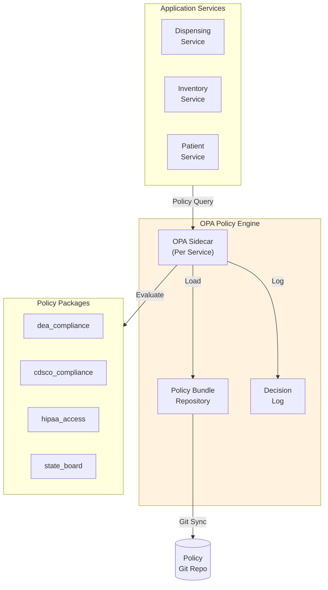
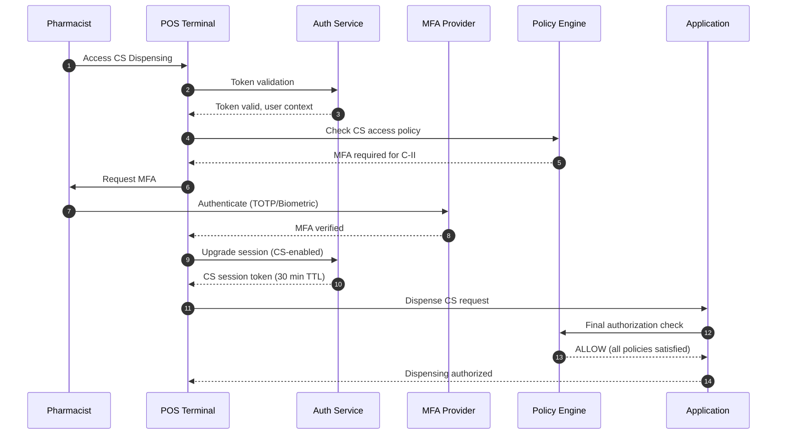
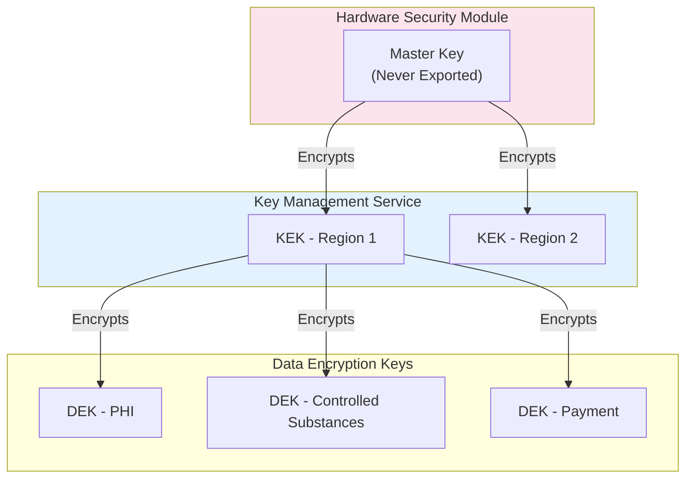
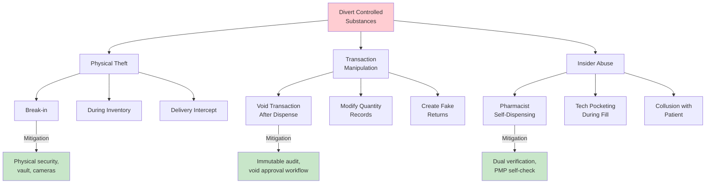

# Security and Compliance

[Back to Index](./00-index.md)

---

## Multi-Jurisdiction Compliance Framework

### Compliance Matrix

| Requirement | DEA (US) | State Boards (US) | CDSCO (India) | HIPAA | GDPR |
|-------------|----------|-------------------|---------------|-------|------|
| **Scope** | Controlled substances | All pharmacy operations | All drugs | Patient health info | Personal data (EU) |
| **License Required** | DEA Registration | State pharmacy license | Drug License (Form 20/21) | N/A | N/A |
| **Controlled Tracking** | Schedule I-V | Varies by state | Schedule H, H1, X | N/A | N/A |
| **Audit Retention** | 2 years minimum | 3-7 years | 3 years | 6 years | Based on purpose |
| **Reporting** | ARCOS (annual) | PMP (real-time/daily) | Monthly | Breach (72 hrs) | Breach (72 hrs) |
| **Encryption** | Not specified | Varies | Not specified | Required (PHI) | Required |
| **Access Control** | Pharmacist verification | Licensed personnel | Licensed personnel | Minimum necessary | Purpose limitation |
| **Patient Rights** | N/A | N/A | N/A | Access, amendment | Access, erasure, portability |
| **Penalties** | $500K+ fine, criminal | License revocation | License suspension | $1.5M/year | 4% global revenue |

### Jurisdiction Detection and Routing

```
ALGORITHM: JurisdictionRouter

FUNCTION determine_jurisdiction(pharmacy, patient, transaction):
    jurisdictions = []

    // Pharmacy location determines primary jurisdiction
    pharmacy_state = pharmacy.state
    pharmacy_country = pharmacy.country

    IF pharmacy_country == 'US':
        jurisdictions.append('DEA')
        jurisdictions.append(f'STATE_{pharmacy_state}')
        jurisdictions.append('HIPAA')

        IF transaction.involves_controlled_substance:
            jurisdictions.append('PMP')

    ELSE IF pharmacy_country == 'IN':
        jurisdictions.append('CDSCO')
        jurisdictions.append('DPCO')  // Drug Price Control
        jurisdictions.append('GST')

        IF transaction.drug.schedule IN ['H1', 'X']:
            jurisdictions.append(f'SCHEDULE_{transaction.drug.schedule}')

    ELSE IF patient.country IN EU_COUNTRIES:
        jurisdictions.append('GDPR')

    // Multi-state prescriptions (US)
    IF pharmacy_state != patient.state:
        jurisdictions.append(f'STATE_{patient.state}')

    RETURN jurisdictions
```

---

## OPA Policy Engine

### Architecture



### DEA Compliance Policy (Rego)

```rego
# Package: pharmacy.dea_compliance
package pharmacy.dea_compliance

import future.keywords.if
import future.keywords.in
import future.keywords.contains

default allow := false
default deny_reason := ""

# Main dispensing authorization
allow if {
    valid_pharmacy_dea
    valid_prescriber_dea
    valid_prescription
    not on_exclusion_list
    inventory_available
    pharmacist_verified
}

# Pharmacy DEA Registration
valid_pharmacy_dea if {
    reg := data.pharmacy.dea_registration
    reg.status == "ACTIVE"
    time.now_ns() < time.parse_rfc3339_ns(reg.expiration)
    input.drug.schedule in reg.authorized_schedules
}

deny_reason := "Pharmacy DEA registration expired or invalid" if {
    not valid_pharmacy_dea
}

# Prescriber DEA Validation
valid_prescriber_dea if {
    input.drug.schedule in ["C-II", "C-III", "C-IV", "C-V"]
    prescriber := data.prescribers[input.prescriber_id]
    prescriber.dea_status == "ACTIVE"
    input.drug.schedule in prescriber.dea_schedules
    input.pharmacy.state in prescriber.dea_states
}

valid_prescriber_dea if {
    not input.drug.schedule in ["C-II", "C-III", "C-IV", "C-V"]
}

deny_reason := "Prescriber DEA invalid for this drug schedule" if {
    input.drug.schedule in ["C-II", "C-III", "C-IV", "C-V"]
    not valid_prescriber_dea
}

# Prescription Validity
valid_prescription if {
    rx := input.prescription

    # Age limits by schedule
    rx_age_days := (time.now_ns() - time.parse_rfc3339_ns(rx.date_written)) / (24 * 60 * 60 * 1000000000)
    max_age := schedule_max_age[input.drug.schedule]
    rx_age_days <= max_age

    # Required fields
    rx.patient_name != ""
    rx.patient_address != ""
    rx.prescriber_signature != ""
    rx.quantity > 0

    # Refill limits
    rx.refills_requested <= schedule_max_refills[input.drug.schedule]

    # Schedule II: No refills allowed
    schedule_ii_refill_check
}

schedule_ii_refill_check if {
    input.drug.schedule != "C-II"
}

schedule_ii_refill_check if {
    input.drug.schedule == "C-II"
    input.prescription.refills_requested == 0
}

schedule_max_age := {
    "C-II": 90,
    "C-III": 180,
    "C-IV": 180,
    "C-V": 365,
    "Rx": 365,
    "OTC": 9999
}

schedule_max_refills := {
    "C-II": 0,
    "C-III": 5,
    "C-IV": 5,
    "C-V": 5,
    "Rx": 11,
    "OTC": 99
}

# DEA Exclusion List Check
on_exclusion_list if {
    data.dea_exclusion_list[input.patient_id]
}

on_exclusion_list if {
    data.dea_exclusion_list[input.prescriber_id]
}

deny_reason := "Patient or prescriber on DEA exclusion list" if {
    on_exclusion_list
}

# Inventory Check
inventory_available if {
    stock := data.inventory[input.drug.drug_id]
    stock.available >= input.quantity
}

deny_reason := "Insufficient controlled substance inventory" if {
    not inventory_available
}

# Pharmacist Verification Required
pharmacist_verified if {
    input.verified_by.role == "PHARMACIST"
    input.verified_by.license_status == "ACTIVE"
}

deny_reason := "Pharmacist verification required for controlled substances" if {
    input.drug.schedule in ["C-II", "C-III", "C-IV", "C-V"]
    not pharmacist_verified
}

# EPCS (Electronic Prescribing for Controlled Substances)
epcs_compliant if {
    input.prescription.source == "E-PRESCRIBE"
    input.prescription.epcs_signature_valid == true
    input.prescriber.identity_proofed == true
}

# Warning: EPCS not used for C-II
warnings contains warning if {
    input.drug.schedule == "C-II"
    input.prescription.source != "E-PRESCRIBE"
    warning := "Schedule II prescription not received via EPCS"
}
```

### CDSCO India Compliance Policy (Rego)

```rego
# Package: pharmacy.cdsco_compliance
package pharmacy.cdsco_compliance

import future.keywords.if
import future.keywords.in

default allow := false

# Schedule H1 Requirements
allow if {
    input.drug.schedule == "H1"
    h1_register_entry_created
    prescription_valid
    licensed_seller
}

h1_register_entry_created if {
    entry := input.h1_register_entry

    # Required fields per Schedule H1 rules
    entry.patient_name != ""
    entry.patient_address != ""
    entry.prescriber_name != ""
    entry.prescriber_registration_number != ""
    entry.drug_name != ""
    entry.quantity > 0
    entry.batch_number != ""
    entry.invoice_number != ""
    entry.date != ""
}

# Schedule X (Narcotics) Requirements
allow if {
    input.drug.schedule == "X"
    schedule_x_compliant
}

schedule_x_compliant if {
    # Original prescription required
    input.prescription.form_type == "NARCOTIC_PRESCRIPTION_FORM"

    # Quantity limits
    input.quantity <= data.schedule_x_limits[input.drug.drug_id]

    # Daily reporting required
    daily_report_submitted

    # Locked storage verification
    storage_verification_current
}

daily_report_submitted if {
    last_report := data.daily_reports[input.pharmacy_id]
    last_report.date == today()
}

storage_verification_current if {
    verification := data.storage_verifications[input.pharmacy_id]
    days_since := (time.now_ns() - time.parse_rfc3339_ns(verification.date)) / (24 * 60 * 60 * 1000000000)
    days_since <= 7  # Weekly verification required
}

# Drug License Validation
licensed_seller if {
    license := data.pharmacy.drug_license
    license.form_type in ["FORM_20", "FORM_21"]
    license.status == "ACTIVE"
    time.now_ns() < time.parse_rfc3339_ns(license.validity)
    input.drug.schedule in license.authorized_schedules
}

# Prescription Validity (India)
prescription_valid if {
    rx := input.prescription

    # Must be from registered medical practitioner
    prescriber := data.prescribers[input.prescriber_id]
    prescriber.registration_council != ""
    prescriber.registration_number != ""

    # Prescription not older than 6 months for general Rx
    rx_age_days := (time.now_ns() - time.parse_rfc3339_ns(rx.date_written)) / (24 * 60 * 60 * 1000000000)
    rx_age_days <= 180
}
```

### HIPAA Access Control Policy (Rego)

```rego
# Package: pharmacy.hipaa_access
package pharmacy.hipaa_access

import future.keywords.if
import future.keywords.in

default allow := false

# Minimum Necessary Rule
allow if {
    user_has_legitimate_purpose
    data_access_is_minimum_necessary
    audit_trail_created
}

user_has_legitimate_purpose if {
    # Treatment purpose
    input.purpose == "TREATMENT"
    input.user.role in ["PHARMACIST", "TECHNICIAN", "PHYSICIAN"]
}

user_has_legitimate_purpose if {
    # Payment purpose
    input.purpose == "PAYMENT"
    input.user.role in ["PHARMACIST", "BILLING_SPECIALIST"]
}

user_has_legitimate_purpose if {
    # Healthcare operations
    input.purpose == "OPERATIONS"
    input.user.role in ["PHARMACIST", "MANAGER", "COMPLIANCE_OFFICER"]
}

data_access_is_minimum_necessary if {
    # Define minimum fields by role
    allowed_fields := role_allowed_fields[input.user.role]
    every field in input.requested_fields {
        field in allowed_fields
    }
}

role_allowed_fields := {
    "TECHNICIAN": ["patient_name", "dob", "allergies", "medications", "prescription"],
    "PHARMACIST": ["patient_name", "dob", "ssn_last_4", "allergies", "medications", "prescription", "insurance", "clinical_notes"],
    "BILLING_SPECIALIST": ["patient_name", "dob", "insurance", "billing_address"],
    "MANAGER": ["patient_name", "dob", "prescription", "transaction_summary"],
    "COMPLIANCE_OFFICER": ["audit_logs", "anonymized_data"]
}

audit_trail_created if {
    # Verify audit entry will be created
    input.audit_enabled == true
}

# Break-the-Glass Access
allow if {
    input.emergency_access == true
    input.user.role == "PHARMACIST"
    input.justification != ""
    # This will trigger enhanced logging and review
}

# Patient Authorization
allow if {
    input.purpose == "DISCLOSURE"
    patient_authorization_valid
}

patient_authorization_valid if {
    auth := data.patient_authorizations[input.patient_id]
    auth.status == "ACTIVE"
    time.now_ns() < time.parse_rfc3339_ns(auth.expiration)
    input.recipient in auth.authorized_recipients
    input.data_type in auth.authorized_data_types
}
```

---

## Authentication Architecture

### Multi-Factor Authentication Matrix

| User Role | Primary Auth | MFA Required | MFA Method | Session Duration |
|-----------|--------------|--------------|------------|------------------|
| **Pharmacist** | OIDC (SSO) | Always | TOTP, FIDO2 | 8 hours |
| **Technician** | OIDC (SSO) | For CS access | PIN, TOTP | 8 hours |
| **Manager** | OIDC (SSO) | Always | TOTP, FIDO2 | 4 hours |
| **Patient (Portal)** | Email/Password | Sensitive actions | SMS, Email | 30 minutes |
| **API (Service)** | mTLS + API Key | N/A | N/A | Per-request |

### Controlled Substance Access Flow



### Identity Proofing (EPCS)

For DEA EPCS compliance, prescribers must be identity-proofed:

```
IDENTITY PROOFING PROCESS:

Level: NIST IAL-2 (In-Person or Remote)

Steps:
1. Government ID verification (driver's license, passport)
2. Knowledge-based verification (credit bureau questions)
3. Live video verification (optional)
4. DEA number validation against DEA database
5. State license validation against medical board

Storage:
- Proofing evidence encrypted and stored
- Proofing status linked to prescriber record
- Re-proofing required every 3 years

Audit:
- All proofing attempts logged
- Successful proofings reported to DEA
```

---

## Data Encryption

### Encryption Tiers

| Tier | Data Classification | At Rest | In Transit | Field-Level |
|------|---------------------|---------|------------|-------------|
| **Tier 1** | Highly Sensitive | AES-256 | TLS 1.3 | AES-256-GCM |
| **Tier 2** | Sensitive | AES-256 | TLS 1.3 | No |
| **Tier 3** | Internal | AES-256 | TLS 1.2+ | No |
| **Tier 4** | Public | No | TLS 1.2+ | No |

### Data Classification

| Tier | Data Types |
|------|------------|
| **Tier 1** | Patient SSN, DEA numbers, controlled substance logs, payment card data |
| **Tier 2** | Patient name, DOB, address, prescriptions, medications, insurance info |
| **Tier 3** | Inventory levels, pricing, supplier info, sales analytics |
| **Tier 4** | Drug catalog (non-pricing), pharmacy locations, operating hours |

### Key Management



### Field-Level Encryption Example

```
DATABASE SCHEMA (Encrypted Fields):

patient (
    patient_id UUID,
    first_name VARCHAR(100),           -- Tier 2 (TDE)
    last_name VARCHAR(100),            -- Tier 2 (TDE)
    ssn_encrypted BYTEA,               -- Tier 1 (Field-level AES-256-GCM)
    ssn_hash VARCHAR(64),              -- For lookup (SHA-256)
    dob DATE,                          -- Tier 2 (TDE)
    address_encrypted BYTEA,           -- Tier 1 (Field-level)
    phone_encrypted BYTEA,             -- Tier 1 (Field-level)
    email_encrypted BYTEA              -- Tier 1 (Field-level)
)

ENCRYPTION FUNCTION:
    ciphertext = AES-256-GCM(
        key = DEK_PHI,
        plaintext = field_value,
        aad = patient_id + field_name,  // Additional authenticated data
        iv = random_96_bits
    )
    stored_value = iv || ciphertext || auth_tag
```

---

## Threat Model (STRIDE Analysis)

### Threat Categories

| Threat | Asset | Attack Vector | Impact | Mitigation |
|--------|-------|---------------|--------|------------|
| **Spoofing** | User identity | Stolen credentials | Unauthorized CS access | MFA, session management |
| **Tampering** | CS log | Database manipulation | Audit trail corruption | Hash chain, immutable storage |
| **Repudiation** | Transactions | Deny dispensing | Compliance violation | Digital signatures, audit logs |
| **Information Disclosure** | PHI | SQL injection, data breach | HIPAA violation | Encryption, WAF, parameterized queries |
| **Denial of Service** | Dispensing system | DDoS, resource exhaustion | Unable to fill prescriptions | Rate limiting, redundancy |
| **Elevation of Privilege** | Admin access | Exploited vulnerability | Full system compromise | RBAC, least privilege, patching |

### Pharmacy-Specific Threats

| Threat | Description | Mitigation |
|--------|-------------|------------|
| **Drug Diversion** | Employee stealing controlled substances | Perpetual inventory, anomaly detection, dual verification |
| **Prescription Fraud** | Forged or altered prescriptions | E-prescribing verification, EPCS, PMP check |
| **Insurance Fraud** | Billing for non-dispensed drugs | Transaction reconciliation, audit trails |
| **Patient Data Theft** | PHI sold on black market | Encryption, access controls, DLP |
| **Formulary Gaming** | Manipulating substitution for kickbacks | Audit substitution patterns, random reviews |

### Attack Tree: Controlled Substance Diversion



---

## Controlled Substance Security

### Physical Security Requirements

| Requirement | DEA | Implementation |
|-------------|-----|----------------|
| Schedule II Storage | Locked cabinet or vault | Safe with electronic lock, access logging |
| Access Control | Limited to authorized personnel | Badge + biometric access |
| Video Surveillance | Required in most states | 24/7 recording, 90-day retention |
| Inventory Records | Perpetual inventory | Real-time tracking system |

### Dual Verification for Destruction

```
DESTRUCTION WORKFLOW:

Participants:
- Pharmacist (Primary)
- Witness (Another Pharmacist or Technician)

Steps:
1. Pharmacist initiates destruction request
   - Drug, quantity, batch, reason

2. System generates DEA Form 41

3. Witness authenticates (MFA required)

4. Both physically verify quantity

5. Destruction performed (observed)

6. Both sign electronically
   - Signatures hash-linked to form

7. Form submitted to DEA (if required)

8. Inventory updated atomically

9. Audit log entry created
   - Includes both signatures
   - Video timestamp reference
```

### Biometric Verification for Schedule II

```
BIOMETRIC FLOW:

Trigger: Any Schedule II dispensing

Steps:
1. Pharmacist fills prescription
2. System prompts: "Schedule II - Biometric Required"
3. Pharmacist scans fingerprint/face
4. Biometric matched against enrolled template
5. If match: Transaction authorized
6. If no match: Deny, alert manager
7. Audit: Biometric event logged (template hash, not biometric data)
```

---

## Audit and Compliance Reporting

### Audit Log Schema

```json
{
    "event_id": "uuid",
    "timestamp": "ISO8601",
    "event_type": "DISPENSE|ACCESS|MODIFY|DELETE",
    "resource": {
        "type": "prescription|patient|inventory|cs_log",
        "id": "uuid"
    },
    "actor": {
        "user_id": "uuid",
        "role": "PHARMACIST|TECHNICIAN|MANAGER",
        "terminal_id": "uuid",
        "ip_address": "string"
    },
    "action": {
        "operation": "READ|CREATE|UPDATE|DELETE|DISPENSE|VERIFY",
        "before_state": {},
        "after_state": {},
        "reason": "string"
    },
    "compliance": {
        "regulations": ["DEA", "HIPAA", "STATE_CA"],
        "policy_version": "v2.3.1",
        "decision": "ALLOW|DENY",
        "warnings": []
    },
    "integrity": {
        "previous_hash": "sha256",
        "current_hash": "sha256"
    }
}
```

### Compliance Reports

| Report | Frequency | Regulation | Content |
|--------|-----------|------------|---------|
| **ARCOS** | Annual | DEA | Schedule II acquisition and distribution |
| **PMP Dispensing** | Real-time/Daily | State | All CS dispensing to state database |
| **Biennial Inventory** | Every 2 years | DEA | Complete CS physical inventory |
| **Schedule H1 Register** | On-demand | CDSCO | All H1 drug sales |
| **HIPAA Audit** | Annual | HIPAA | Access logs, breach report |
| **State Board** | Varies | State | License compliance, inspections |

### Breach Response Plan

```
BREACH RESPONSE TIMELINE:

Hour 0: Detection
- Automated alert from security monitoring
- Initial assessment by security team

Hour 1-4: Containment
- Isolate affected systems
- Preserve evidence
- Engage incident response team

Hour 4-24: Investigation
- Determine scope of breach
- Identify affected individuals
- Assess regulatory impact

Hour 24-48: Notification Preparation
- Draft notifications (patients, regulators)
- Legal review
- Executive briefing

Hour 48-72: Regulatory Notification
- HHS (HIPAA): Within 60 days for >500 individuals
- State AG: Per state requirements (24-72 hours)
- DEA: Immediately for CS theft (Form 106)
- CDSCO: Within 15 days

Day 3-60: Patient Notification
- Individual notification to affected patients
- Credit monitoring offer
- Helpline setup

Ongoing: Remediation
- Root cause analysis
- Control improvements
- Documentation for regulators
```

---

## Security Operations

### Security Monitoring

| Monitor | Tool | Alert Threshold |
|---------|------|-----------------|
| Authentication Failures | SIEM | 5 failures in 5 min |
| Privilege Escalation | SIEM | Any attempt |
| CS Access After Hours | Custom | Any CS access outside 6am-10pm |
| Large Data Export | DLP | >1000 records |
| SQL Injection Attempts | WAF | Any pattern match |
| API Rate Limit Exceeded | API Gateway | >100% of limit |

### Vulnerability Management

| Activity | Frequency | Scope |
|----------|-----------|-------|
| Automated Scanning | Daily | All external endpoints |
| Container Scanning | On build | All container images |
| Dependency Scanning | Weekly | All dependencies |
| Penetration Testing | Annual | Full application |
| Red Team Exercise | Annual | Including social engineering |
| Compliance Scan | Monthly | CIS benchmarks, HIPAA |

### Security Incident Severity

| Severity | Definition | Response Time | Escalation |
|----------|------------|---------------|------------|
| **P1 (Critical)** | Active breach, CS theft, PHI exposure | 15 min | CISO, Legal, Exec |
| **P2 (High)** | Attempted breach, vulnerability exploited | 1 hour | Security Lead |
| **P3 (Medium)** | Policy violation, suspicious activity | 4 hours | Security Team |
| **P4 (Low)** | Minor compliance finding, low-risk vulnerability | 24 hours | Security Analyst |
