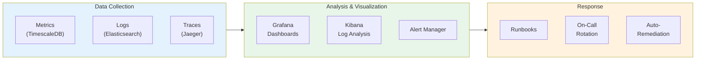
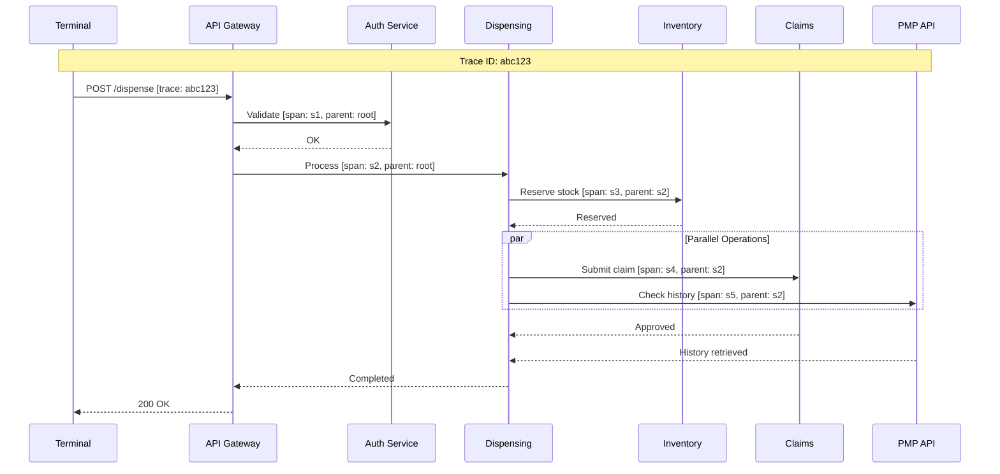

# Observability

[Back to Index](./00-index.md)

---

## Observability Strategy

### Three Pillars



---

## Metrics (RED/USE Method)

### Service Metrics (RED)

| Service | Rate | Errors | Duration |
|---------|------|--------|----------|
| **Dispensing API** | Transactions/sec | 4xx, 5xx responses | p50, p95, p99 latency |
| **Inventory API** | Queries/sec | Stock errors, sync failures | Query latency |
| **Substitution API** | Lookups/sec | No results, timeouts | Lookup latency |
| **Claims API** | Claims/sec | Rejections, timeouts | Adjudication time |
| **PMP API** | Queries/sec | Timeouts, rate limits | Response time |

### Resource Metrics (USE)

| Resource | Utilization | Saturation | Errors |
|----------|-------------|------------|--------|
| **Database CPU** | % CPU used | Connection queue depth | Query timeouts |
| **Database Storage** | % disk used | IOPS wait time | Write failures |
| **Cache Memory** | % memory used | Eviction rate | Connection errors |
| **Kafka** | % partition capacity | Consumer lag | Replication errors |
| **AI Inference** | GPU utilization | Inference queue depth | Model errors |

### Business Metrics

| Metric | Description | Target | Alert Threshold |
|--------|-------------|--------|-----------------|
| **Rx Fill Rate** | Prescriptions filled / received | > 95% | < 90% |
| **CS Reconciliation** | Daily CS balance accuracy | 100% | Any discrepancy |
| **Insurance Approval Rate** | Claims approved / submitted | > 95% | < 90% |
| **Substitution Acceptance** | Generics accepted / offered | > 60% | < 40% |
| **Avg Dispensing Time** | Time from Rx to pickup | < 15 min | > 30 min |
| **Inventory Turnover** | Annual inventory turns | > 12 | < 8 |
| **Expiry Waste Rate** | Expired value / total value | < 1% | > 2% |

---

## Key Metrics Definitions

### Dispensing Metrics

```yaml
# Prometheus metric definitions

# Transaction rate
pharmacy_transactions_total:
  type: counter
  labels: [pharmacy_id, transaction_type, status]
  description: Total number of dispensing transactions

# Transaction latency
pharmacy_transaction_duration_seconds:
  type: histogram
  labels: [pharmacy_id, transaction_type]
  buckets: [0.1, 0.25, 0.5, 1, 2.5, 5, 10]
  description: Transaction processing duration

# Active transactions
pharmacy_transactions_in_progress:
  type: gauge
  labels: [pharmacy_id]
  description: Number of transactions currently being processed

# Controlled substance dispensing
pharmacy_controlled_substance_dispensed_total:
  type: counter
  labels: [pharmacy_id, schedule, drug_id]
  description: Total controlled substance units dispensed
```

### Inventory Metrics

```yaml
# Stock level gauge
pharmacy_inventory_quantity:
  type: gauge
  labels: [pharmacy_id, drug_id, batch_id]
  description: Current inventory quantity by batch

# Expiry tracking
pharmacy_inventory_days_to_expiry:
  type: gauge
  labels: [pharmacy_id, drug_id, batch_id]
  description: Days until batch expiry

# Sync lag
pharmacy_inventory_sync_lag_seconds:
  type: gauge
  labels: [pharmacy_id, terminal_id]
  description: Seconds since last successful sync

# Stockout events
pharmacy_stockout_events_total:
  type: counter
  labels: [pharmacy_id, drug_id]
  description: Number of stockout events
```

### Compliance Metrics

```yaml
# Policy violations
pharmacy_policy_violations_total:
  type: counter
  labels: [pharmacy_id, policy_type, severity]
  description: Number of compliance policy violations

# Audit log entries
pharmacy_audit_entries_total:
  type: counter
  labels: [pharmacy_id, event_type, resource_type]
  description: Number of audit log entries created

# CS reconciliation status
pharmacy_cs_reconciliation_status:
  type: gauge
  labels: [pharmacy_id, drug_id]
  values: [0=discrepancy, 1=reconciled]
  description: Controlled substance reconciliation status

# License expiry
pharmacy_license_days_to_expiry:
  type: gauge
  labels: [pharmacy_id, license_type]
  description: Days until license expiry
```

### AI Model Metrics

```yaml
# Inference latency
pharmacy_ai_inference_duration_seconds:
  type: histogram
  labels: [model_name, pharmacy_id]
  buckets: [0.05, 0.1, 0.25, 0.5, 1, 2]
  description: AI model inference duration

# Model accuracy (offline calculated)
pharmacy_ai_model_accuracy:
  type: gauge
  labels: [model_name, metric_type]
  description: Model performance metrics (MAPE, NDCG, etc.)

# Prediction vs actual (for demand forecasting)
pharmacy_demand_forecast_error:
  type: histogram
  labels: [pharmacy_id, drug_id]
  buckets: [-50, -20, -10, -5, 0, 5, 10, 20, 50]
  description: Forecast error percentage (actual - predicted)
```

---

## Logging Strategy

### Log Levels

| Level | Use Case | Example |
|-------|----------|---------|
| **ERROR** | Failures requiring attention | Database connection failure, payment declined |
| **WARN** | Degraded operation | Cache miss, retry triggered, slow query |
| **INFO** | Business events | Transaction completed, prescription filled |
| **DEBUG** | Troubleshooting details | Query parameters, intermediate results |
| **TRACE** | Very detailed debugging | Full request/response bodies |

### Structured Log Format

```json
{
    "timestamp": "2024-01-15T14:30:00.123Z",
    "level": "INFO",
    "service": "dispensing-service",
    "version": "2.3.1",
    "environment": "production",
    "trace_id": "abc123def456",
    "span_id": "789ghi",
    "pharmacy_id": "uuid-pharmacy",
    "user_id": "uuid-user",
    "event": "transaction_completed",
    "transaction_id": "uuid-txn",
    "transaction_type": "RX_FILL",
    "duration_ms": 342,
    "items_count": 2,
    "total_amount": 45.99,
    "metadata": {
        "rx_id": "uuid-rx",
        "drug_count": 1,
        "controlled": false
    }
}
```

### Log Retention

| Log Type | Hot Storage | Warm Storage | Cold Storage |
|----------|-------------|--------------|--------------|
| Application Logs | 7 days | 30 days | 1 year |
| Access Logs | 30 days | 90 days | 1 year |
| Audit Logs | 90 days | 1 year | 7 years |
| CS Transaction Logs | 1 year | 3 years | 7 years |
| Security Logs | 90 days | 1 year | 3 years |

### Sensitive Data Handling

```
LOG MASKING RULES:

Patient Name: "John Doe" → "J*** D**"
SSN: "123-45-6789" → "***-**-6789"
Date of Birth: "1985-03-15" → "1985-**-**"
Address: "123 Main St" → "[REDACTED]"
Phone: "555-123-4567" → "555-***-****"
Email: "john@example.com" → "j***@example.com"
Credit Card: "4111111111111111" → "************1111"
DEA Number: "AB1234567" → "AB*****67"

NEVER LOG:
- Full SSN
- Full credit card numbers
- Passwords or tokens
- Biometric data
- Encryption keys
```

---

## Distributed Tracing

### Trace Propagation



### Key Spans to Instrument

| Span Name | Parent | Tags |
|-----------|--------|------|
| `http.request` | root | method, path, status |
| `auth.validate` | http.request | user_id, role |
| `policy.evaluate` | auth.validate | policy_name, decision |
| `db.query` | (varies) | query_type, table, duration |
| `cache.get/set` | (varies) | key_pattern, hit/miss |
| `external.pmp` | dispensing.process | state, response_time |
| `external.insurance` | dispensing.process | payer, claim_id |
| `ai.inference` | (varies) | model_name, duration |

### Trace Sampling Strategy

| Condition | Sampling Rate |
|-----------|---------------|
| Error responses | 100% |
| Slow requests (> p99) | 100% |
| Controlled substance transactions | 100% |
| Normal transactions | 10% |
| Health checks | 0% |

---

## Alerting

### Alert Hierarchy

| Priority | Definition | Response Time | Notification |
|----------|------------|---------------|--------------|
| **P1 (Critical)** | Service down, data loss risk, compliance breach | 5 min | Page on-call, Slack, email |
| **P2 (High)** | Degraded service, high error rate | 15 min | Page on-call, Slack |
| **P3 (Medium)** | Performance issue, single component failure | 1 hour | Slack, email |
| **P4 (Low)** | Minor issue, informational | 24 hours | Email, ticket |

### Alert Definitions

#### P1 Alerts (Critical)

```yaml
# Controlled Substance Discrepancy
- alert: CSDiscrepancyDetected
  expr: pharmacy_cs_reconciliation_status == 0
  for: 0m
  labels:
    severity: critical
    compliance: DEA
  annotations:
    summary: "Controlled substance discrepancy at {{ $labels.pharmacy_id }}"
    description: "Drug {{ $labels.drug_id }} has inventory discrepancy. Immediate investigation required."
    runbook: "https://runbooks/cs-discrepancy"

# Dispensing Service Down
- alert: DispensingServiceDown
  expr: up{job="dispensing-service"} == 0
  for: 1m
  labels:
    severity: critical
  annotations:
    summary: "Dispensing service is down"
    runbook: "https://runbooks/dispensing-down"

# Database Primary Down
- alert: DatabasePrimaryDown
  expr: pg_up{role="primary"} == 0
  for: 30s
  labels:
    severity: critical
  annotations:
    summary: "PostgreSQL primary is down"
    runbook: "https://runbooks/db-failover"
```

#### P2 Alerts (High)

```yaml
# High Error Rate
- alert: HighErrorRate
  expr: |
    sum(rate(http_requests_total{status=~"5.."}[5m])) /
    sum(rate(http_requests_total[5m])) > 0.05
  for: 5m
  labels:
    severity: high
  annotations:
    summary: "Error rate above 5% for {{ $labels.service }}"
    runbook: "https://runbooks/high-error-rate"

# PMP API Unavailable
- alert: PMPAPIUnavailable
  expr: probe_success{job="pmp-api"} == 0
  for: 5m
  labels:
    severity: high
    compliance: STATE
  annotations:
    summary: "PMP API for {{ $labels.state }} is unavailable"
    description: "Controlled substance dispensing will require manual verification"
    runbook: "https://runbooks/pmp-unavailable"

# License Expiring Soon
- alert: LicenseExpiringSoon
  expr: pharmacy_license_days_to_expiry < 30
  for: 0m
  labels:
    severity: high
    compliance: STATE
  annotations:
    summary: "{{ $labels.license_type }} license expiring in {{ $value }} days"
    runbook: "https://runbooks/license-renewal"
```

#### P3 Alerts (Medium)

```yaml
# Inventory Sync Lag
- alert: InventorySyncLag
  expr: pharmacy_inventory_sync_lag_seconds > 300
  for: 10m
  labels:
    severity: medium
  annotations:
    summary: "Inventory sync lag > 5 minutes for {{ $labels.pharmacy_id }}"

# High Cache Miss Rate
- alert: HighCacheMissRate
  expr: |
    rate(cache_misses_total[5m]) /
    (rate(cache_hits_total[5m]) + rate(cache_misses_total[5m])) > 0.2
  for: 10m
  labels:
    severity: medium
  annotations:
    summary: "Cache miss rate above 20%"

# AI Model Drift
- alert: AIModelDrift
  expr: pharmacy_ai_model_accuracy{metric_type="mape"} > 0.20
  for: 1h
  labels:
    severity: medium
  annotations:
    summary: "Demand forecasting MAPE above 20%"
```

#### P4 Alerts (Low)

```yaml
# Approaching Storage Limit
- alert: StorageApproachingLimit
  expr: (pg_database_size_bytes / pg_database_size_limit_bytes) > 0.8
  for: 1h
  labels:
    severity: low
  annotations:
    summary: "Database storage above 80%"

# Expiring Inventory
- alert: HighExpiryRisk
  expr: count(pharmacy_inventory_days_to_expiry < 30) > 100
  for: 1d
  labels:
    severity: low
  annotations:
    summary: "{{ $value }} batches expiring within 30 days"
```

---

## Dashboards

### Pharmacy Operations Dashboard

```
┌─────────────────────────────────────────────────────────────────┐
│                    PHARMACY OPERATIONS                          │
│                    Pharmacy: ABC Pharmacy (ID: 12345)           │
├──────────────────────┬──────────────────────────────────────────┤
│  TODAY'S SUMMARY     │  TRANSACTION RATE (Last 24h)             │
│  ─────────────────   │  ────────────────────────────────────    │
│  Transactions: 487   │  [Graph: Transactions per hour]          │
│  Rx Filled: 312      │                                          │
│  Avg Wait: 12 min    │  Peak: 45/hr at 10:00 AM                │
│  Revenue: $24,532    │                                          │
├──────────────────────┼──────────────────────────────────────────┤
│  INVENTORY STATUS    │  TOP ALERTS                              │
│  ─────────────────   │  ──────────────                          │
│  Stock Items: 9,847  │  ⚠ 3 items low stock                     │
│  Low Stock: 23       │  ⚠ 12 batches expiring in 30 days       │
│  Out of Stock: 5     │  ✓ CS reconciliation: OK                 │
│  Expiring (30d): 12  │  ✓ Sync status: Current                  │
├──────────────────────┴──────────────────────────────────────────┤
│  PRESCRIPTION QUEUE                                              │
│  ─────────────────────────────────────────────────────────────  │
│  Received: 15 │ In Progress: 8 │ Ready: 23 │ Will Call: 45     │
│                                                                  │
│  [Table: Active prescriptions with status, wait time, alerts]   │
├─────────────────────────────────────────────────────────────────┤
│  INSURANCE CLAIMS                                                │
│  ─────────────────────────────────────────────────────────────  │
│  Submitted: 245 │ Approved: 232 (95%) │ Rejected: 13 │ Pending: 5│
│                                                                  │
│  Top Rejection Reasons: Prior Auth (5), Refill Too Soon (4)     │
└─────────────────────────────────────────────────────────────────┘
```

### Compliance Dashboard

```
┌─────────────────────────────────────────────────────────────────┐
│                    COMPLIANCE DASHBOARD                         │
│                    Region: West Coast (50 pharmacies)           │
├──────────────────────┬──────────────────────────────────────────┤
│  COMPLIANCE SCORE    │  LICENSE STATUS                          │
│  ─────────────────   │  ──────────────                          │
│                      │                                          │
│      [Gauge]         │  DEA: 50/50 Active                       │
│        94%           │  State: 50/50 Active                     │
│                      │  Staff: 234/240 Current                  │
│  Target: 95%         │  ⚠ 6 staff licenses expiring in 60 days │
├──────────────────────┼──────────────────────────────────────────┤
│  CS TRACKING         │  AUDIT READINESS                         │
│  ─────────────────   │  ──────────────                          │
│  Pharmacies: 50      │  Last DEA Audit: 2023-06-15              │
│  Reconciled: 48      │  Last State Audit: 2023-09-22            │
│  Discrepancies: 2    │                                          │
│  ⚠ Action needed     │  Documents Ready: 98%                    │
│                      │  ARCOS Report: Pending (due 2024-01-31)  │
├──────────────────────┴──────────────────────────────────────────┤
│  POLICY VIOLATIONS (Last 30 days)                               │
│  ─────────────────────────────────────────────────────────────  │
│  [Chart: Violations by type and severity]                       │
│                                                                  │
│  Total: 23 │ Critical: 0 │ High: 2 │ Medium: 8 │ Low: 13        │
│                                                                  │
│  Top Issues: Early refill override (8), Missing signature (5)   │
├─────────────────────────────────────────────────────────────────┤
│  PMP INTEGRATION STATUS                                          │
│  ─────────────────────────────────────────────────────────────  │
│  CA: ✓ Connected │ NV: ✓ Connected │ AZ: ⚠ Degraded            │
│  OR: ✓ Connected │ WA: ✓ Connected │                            │
└─────────────────────────────────────────────────────────────────┘
```

### AI/ML Monitoring Dashboard

```
┌─────────────────────────────────────────────────────────────────┐
│                    AI/ML MONITORING                             │
├──────────────────────┬──────────────────────────────────────────┤
│  MODEL HEALTH        │  INFERENCE LATENCY                       │
│  ─────────────────   │  ──────────────────                      │
│  Demand Forecast: ✓  │  [Histogram: p50, p95, p99]              │
│  Substitution AI: ✓  │                                          │
│  Anomaly Detect: ✓   │  Demand: p50=120ms, p99=450ms           │
│  Expiry Predict: ✓   │  Substitution: p50=180ms, p99=890ms     │
├──────────────────────┼──────────────────────────────────────────┤
│  MODEL ACCURACY      │  DRIFT DETECTION                         │
│  ─────────────────   │  ──────────────                          │
│                      │                                          │
│  Demand MAPE: 12.3%  │  [Chart: Accuracy over time]             │
│  Target: <15%  ✓     │                                          │
│                      │  Feature drift: None detected            │
│  Substitution NDCG:  │  Concept drift: Minor (retraining       │
│  0.82 Target: >0.8 ✓ │                 scheduled)               │
├──────────────────────┴──────────────────────────────────────────┤
│  INFERENCE VOLUME                                                │
│  ─────────────────────────────────────────────────────────────  │
│  [Graph: Inference requests per model per hour]                 │
│                                                                  │
│  Today: Demand=45K, Substitution=23K, Anomaly=15K               │
├─────────────────────────────────────────────────────────────────┤
│  GPU UTILIZATION                                                 │
│  ─────────────────────────────────────────────────────────────  │
│  GPU 0: [████████░░] 78%  │  GPU 1: [██████░░░░] 62%           │
│                                                                  │
│  Memory: 14.2 GB / 24 GB  │  Queue Depth: 12                    │
└─────────────────────────────────────────────────────────────────┘
```

---

## Health Checks

### Endpoint Definitions

```yaml
# Liveness Probe (Is the process running?)
/health/live:
  checks:
    - process_running
  timeout: 1s
  failure_threshold: 3

# Readiness Probe (Can it accept traffic?)
/health/ready:
  checks:
    - database_connection
    - cache_connection
    - required_services_available
  timeout: 5s
  failure_threshold: 3

# Deep Health Check (Detailed status)
/health/deep:
  checks:
    - database_connection
    - database_replica_lag
    - cache_connection
    - kafka_connection
    - neo4j_connection
    - external_api_status
    - model_loaded
  timeout: 30s
  include_details: true
```

### Health Check Response

```json
{
    "status": "healthy",
    "version": "2.3.1",
    "uptime_seconds": 86400,
    "checks": {
        "database": {
            "status": "healthy",
            "latency_ms": 2,
            "connection_pool": {
                "active": 15,
                "idle": 85,
                "max": 100
            }
        },
        "cache": {
            "status": "healthy",
            "latency_ms": 1,
            "hit_rate": 0.94
        },
        "kafka": {
            "status": "healthy",
            "consumer_lag": 120
        },
        "neo4j": {
            "status": "healthy",
            "latency_ms": 5
        },
        "pmp_api": {
            "status": "degraded",
            "message": "CA PMP experiencing high latency",
            "latency_ms": 3500
        },
        "ai_models": {
            "status": "healthy",
            "models_loaded": ["demand_forecast_v2", "substitution_ranker_v3"]
        }
    }
}
```

---

## Runbook References

| Alert | Runbook | Owner |
|-------|---------|-------|
| CSDiscrepancyDetected | [CS Discrepancy Investigation](https://runbooks/cs-discrepancy) | Compliance Team |
| DispensingServiceDown | [Service Recovery](https://runbooks/dispensing-down) | Platform Team |
| DatabasePrimaryDown | [DB Failover Procedure](https://runbooks/db-failover) | DBA Team |
| PMPAPIUnavailable | [PMP Fallback](https://runbooks/pmp-unavailable) | Integrations Team |
| HighErrorRate | [Error Rate Triage](https://runbooks/high-error-rate) | On-Call Engineer |
| AIModelDrift | [Model Retraining](https://runbooks/model-drift) | ML Team |
| LicenseExpiringSoon | [License Renewal](https://runbooks/license-renewal) | Operations Team |

---

## On-Call Rotation

### Rotation Schedule

| Team | Coverage | Escalation |
|------|----------|------------|
| **Platform On-Call** | 24/7 | Primary for P1/P2 |
| **Compliance On-Call** | Business hours + P1 | CS discrepancies, audits |
| **DBA On-Call** | 24/7 | Database issues |
| **Security On-Call** | 24/7 | Security incidents |

### Escalation Matrix

```
P1 Alert Triggered
    │
    ├─→ [0 min] Page Primary On-Call
    │
    ├─→ [5 min] No ACK? Page Secondary On-Call
    │
    ├─→ [10 min] No ACK? Page Team Lead
    │
    ├─→ [15 min] Still no ACK? Page Engineering Manager
    │
    └─→ [20 min] Auto-escalate to Incident Commander

Compliance-Related P1
    │
    ├─→ [0 min] Page Platform + Compliance On-Call
    │
    └─→ [5 min] Notify Chief Compliance Officer
```
