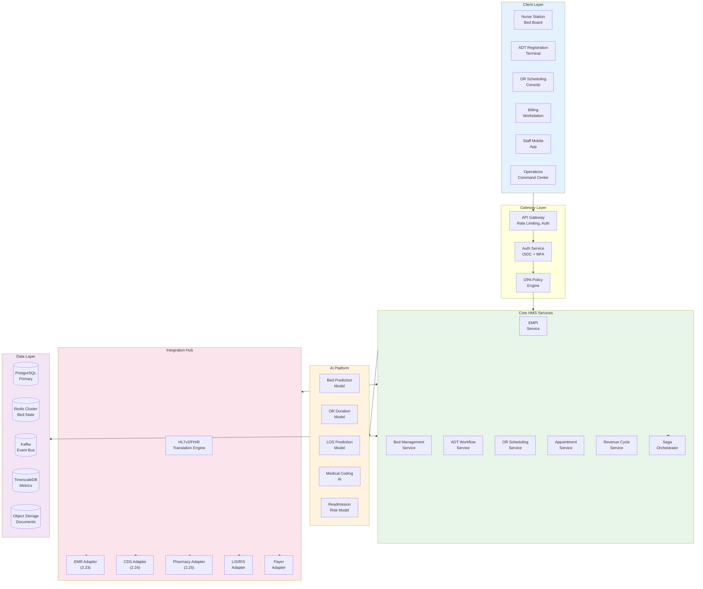

# High-Level Design

[Back to Index](./00-index.md)

---

## System Architecture



---

## Component Overview

### Gateway Layer

| Component | Responsibility | Technology |
|-----------|---------------|------------|
| **API Gateway** | Request routing, rate limiting, TLS termination | Kong / AWS API Gateway |
| **Auth Service** | Authentication (OIDC), MFA enforcement, session management | Keycloak / Auth0 |
| **OPA Policy Engine** | Authorization decisions, compliance policy enforcement | Open Policy Agent |

### Core HMS Services

| Service | Responsibility | Key Operations |
|---------|---------------|----------------|
| **EMPI Service** | Patient identity management | Search, match, create, merge, link |
| **Bed Management Service** | Real-time bed state, AI-assisted assignment | Query availability, assign, transfer, release |
| **ADT Workflow Service** | Admission/discharge/transfer orchestration | Initiate, coordinate, complete workflows |
| **OR Scheduling Service** | Operating theater scheduling and optimization | Schedule cases, manage blocks, track utilization |
| **Appointment Service** | Outpatient scheduling | Book, reschedule, cancel, waitlist |
| **Revenue Cycle Service** | Billing, claims, denials | Capture charges, generate claims, manage AR |
| **Saga Orchestrator** | Multi-step workflow coordination | Start saga, handle compensation, track state |

### AI Platform

| Model | Purpose | Input | Output | Accuracy |
|-------|---------|-------|--------|----------|
| **Bed Prediction** | Forecast bed demand | Historical census, scheduled admissions, ED census | 24/48/72h occupancy forecast | MAPE <10% |
| **OR Duration** | Predict case duration | Procedure, surgeon, patient factors | Estimated minutes | MAE <15 min |
| **LOS Prediction** | Predict length of stay | Diagnosis, comorbidities, admission source | Expected days | AUC 0.85-0.90 |
| **Medical Coding** | Suggest ICD-10, CPT codes | Clinical documentation | Code candidates with confidence | 80% acceptance |
| **Readmission Risk** | 30-day readmission score | Patient history, discharge factors | Risk score 0-1 | AUC 0.75-0.80 |

### Integration Hub

| Adapter | External System | Protocol | Direction |
|---------|----------------|----------|-----------|
| **EMR Adapter** | EMR/EHR (2.23) | FHIR R4, CDS Hooks | Bidirectional |
| **CDS Adapter** | Clinical Decision Support (2.24) | CDS Hooks | Inbound (alerts) |
| **Pharmacy Adapter** | Pharmacy OS (2.25) | FHIR R4 | Bidirectional |
| **LIS/RIS Adapter** | Laboratory/Radiology | HL7v2 ORM/ORU | Bidirectional |
| **Payer Adapter** | Insurance companies | X12 837/835, FHIR Claim | Outbound |

---

## Data Flow Diagrams

### 1. Patient Admission Flow (ADT Saga)


### 2. Bed Management Flow with AI


### 3. OR Scheduling Flow with ML


### 4. Discharge Flow with Revenue Cycle


---

## Key Architectural Decisions

| Decision | Choice | Alternatives Considered | Rationale |
|----------|--------|------------------------|-----------|
| **EMPI Algorithm** | Probabilistic (Fellegi-Sunter) + ML | Deterministic only, Exact match | Handles dirty data, typos, name variations |
| **Bed State Store** | Redis (hot) + PostgreSQL (durable) | PostgreSQL only, Redis only | Sub-10ms queries + ACID durability |
| **Workflow Pattern** | Orchestrated Saga | Choreography, 2PC, None | Complex multi-step ADT with compensation |
| **AI Model Hosting** | Self-hosted (on-premise/VPC) | Cloud AI APIs | HIPAA compliance, PHI stays internal |
| **Event Backbone** | Apache Kafka | RabbitMQ, AWS SQS | Durability, replay, high throughput |
| **Integration Protocol** | FHIR R4 (primary) + HL7v2 (legacy) | FHIR only, Custom APIs | Industry standard + backward compatibility |
| **Authorization** | OPA (Open Policy Agent) | Custom RBAC, Casbin | Declarative, auditable, complex rules |
| **Consistency** | Strong for ops, Eventual for analytics | Eventual everywhere | Safety-critical bed assignments |

---

## Architecture Pattern Checklist

- [x] **Sync vs Async**: Sync for bed assignment, Async for notifications and analytics
- [x] **Event-driven vs Request-response**: Event-driven for cross-system integration
- [x] **Push vs Pull**: Push for ADT events, Pull for queries
- [x] **Stateless vs Stateful**: Stateless services, stateful orchestrator
- [x] **Read-heavy vs Write-heavy**: Read-heavy for beds (Redis), Write-heavy for ADT (Kafka)
- [x] **Real-time vs Batch**: Real-time for ops, Batch for AI model training
- [x] **Edge vs Origin**: Origin processing (hospital network)

---

## Integration Architecture

### FHIR R4 Resource Mapping

| HMS Concept | FHIR Resource | Key Elements |
|-------------|---------------|--------------|
| Patient Identity | Patient | identifier (MRN, SSN), name, birthDate, address |
| Hospital Visit | Encounter | status, class, period, location, participant |
| Bed | Location | identifier, type, physicalType, partOf |
| OR Case | Procedure | code, status, subject, encounter, performer |
| Appointment | Appointment | status, serviceType, participant, start, end |
| Bill | Claim | type, patient, provider, diagnosis, procedure, total |
| Charge | ChargeItem | code, subject, context, occurrenceDateTime |

### HL7v2 Message Types Supported

| Message | Trigger | Use Case |
|---------|---------|----------|
| ADT^A01 | Admit | Patient admission |
| ADT^A02 | Transfer | Intra-hospital transfer |
| ADT^A03 | Discharge | Patient discharge |
| ADT^A04 | Register | Outpatient registration |
| ADT^A08 | Update | Patient info update |
| ORM^O01 | Order | Service/procedure order |
| ORU^R01 | Result | Lab/rad result |
| DFT^P03 | Charge | Financial charge |

### IHE Profile Implementation

| Profile | Function | HMS Role |
|---------|----------|----------|
| **PIX** (Patient Identifier Cross-reference) | Patient ID resolution | Provider (EMPI is PIX source) |
| **PDQ** (Patient Demographics Query) | Patient search | Provider |
| **PAM** (Patient Administration Management) | ADT events | Provider + Consumer |
| **XDS** (Cross-Enterprise Document Sharing) | Document exchange | Consumer |

---

## Saga Pattern: ADT Workflow

### Admission Saga Steps

```
SAGA: PatientAdmission

STEPS:
  1. EMPI Resolution
     - Action: Create/link patient identity
     - Compensation: Mark identity as pending

  2. Insurance Verification
     - Action: Verify coverage with payer
     - Compensation: None (idempotent query)

  3. Bed Assignment
     - Action: Lock and assign bed
     - Compensation: Release bed

  4. Encounter Creation
     - Action: Create encounter in ADT
     - Compensation: Cancel encounter

  5. Billing Account Setup
     - Action: Initialize billing account
     - Compensation: Close billing account

  6. Notification
     - Action: Publish ADT^A01 to Kafka
     - Compensation: Publish ADT^A11 (Cancel Admit)

STATE MACHINE:
  STARTED → EMPI_COMPLETE → INSURANCE_VERIFIED → BED_ASSIGNED
  → ENCOUNTER_CREATED → BILLING_SETUP → COMPLETED

FAILURE HANDLING:
  - If step N fails, execute compensations for steps N-1 to 1 in reverse
  - Log all compensation actions for audit
  - Notify operations team for manual intervention if compensation fails
```

### Saga State Storage

```sql
CREATE TABLE saga_instance (
    saga_id UUID PRIMARY KEY,
    saga_type VARCHAR(50) NOT NULL,  -- 'ADMISSION', 'DISCHARGE', 'TRANSFER'
    patient_empi UUID NOT NULL,
    current_step VARCHAR(50),
    status VARCHAR(20) DEFAULT 'RUNNING',
    payload JSONB NOT NULL,
    created_at TIMESTAMPTZ DEFAULT NOW(),
    updated_at TIMESTAMPTZ DEFAULT NOW(),
    completed_at TIMESTAMPTZ
);

CREATE TABLE saga_step_log (
    log_id UUID PRIMARY KEY,
    saga_id UUID REFERENCES saga_instance(saga_id),
    step_name VARCHAR(50),
    action_type VARCHAR(20),  -- 'EXECUTE', 'COMPENSATE'
    status VARCHAR(20),       -- 'SUCCESS', 'FAILED'
    input_data JSONB,
    output_data JSONB,
    error_message TEXT,
    executed_at TIMESTAMPTZ DEFAULT NOW()
);
```

---

## Caching Strategy

| Data | Cache Location | TTL | Invalidation |
|------|---------------|-----|--------------|
| Bed availability | Redis | Real-time (no TTL) | Event-driven update |
| Patient demographics | Redis | 5 minutes | On EMPI update |
| OR schedule (daily) | Redis | 1 hour | On schedule change |
| Insurance eligibility | Redis | 24 hours | Daily refresh |
| AI predictions | Redis | 15 minutes | Time-based expiry |
| Reference data (units, rooms) | Redis | 24 hours | Admin update |

---

## Multi-Tenant Considerations

### Tenant Isolation Model

```
Option: Database-per-Hospital (Recommended for Healthcare)

Rationale:
- Maximum data isolation (HIPAA compliance)
- Per-hospital backup/restore
- Per-hospital audit trails
- Regulatory requirement in some jurisdictions

Implementation:
- Separate PostgreSQL database per hospital
- Shared Redis cluster with key prefixing (hospital_id:bed:*)
- Shared Kafka cluster with topic prefixing (hospital_id.adt.events)
- Shared AI models (no PHI in model weights)
```

### Cross-Hospital EMPI Federation


---

## Deployment Architecture


