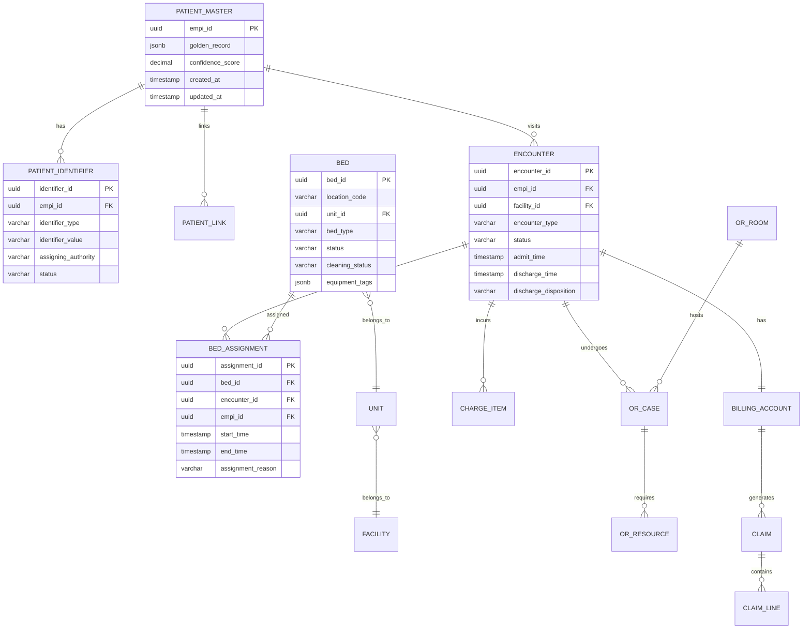

# Low-Level Design

[Back to Index](./00-index.md)

---

## Data Model Overview

### Entity Relationship Diagram



---

## Enterprise Master Patient Index (EMPI)

### Data Model

```sql
-- Core patient identity table
CREATE TABLE patient_master (
    empi_id UUID PRIMARY KEY DEFAULT gen_random_uuid(),
    golden_record JSONB NOT NULL,
    -- golden_record schema:
    -- {
    --   "name": {"family": "Smith", "given": ["John", "Robert"]},
    --   "birthDate": "1980-05-15",
    --   "gender": "male",
    --   "address": [{"city": "Boston", "state": "MA", "postalCode": "02101"}],
    --   "telecom": [{"system": "phone", "value": "617-555-1234"}],
    --   "ssn_hash": "sha256:...",  -- Hashed for security
    --   "deceased": false
    -- }
    confidence_score DECIMAL(5,4) DEFAULT 1.0,
    status VARCHAR(20) DEFAULT 'active',  -- active, merged, inactive
    merged_into UUID REFERENCES patient_master(empi_id),
    created_at TIMESTAMPTZ DEFAULT NOW(),
    updated_at TIMESTAMPTZ DEFAULT NOW(),
    created_by VARCHAR(100),
    CONSTRAINT valid_status CHECK (status IN ('active', 'merged', 'inactive'))
);

-- Patient identifiers (MRN, SSN, DL, Insurance ID, etc.)
CREATE TABLE patient_identifier (
    identifier_id UUID PRIMARY KEY DEFAULT gen_random_uuid(),
    empi_id UUID NOT NULL REFERENCES patient_master(empi_id),
    identifier_type VARCHAR(50) NOT NULL,
    -- Types: MRN, SSN, DL, INSURANCE, PASSPORT, NATIONAL_ID
    identifier_value VARCHAR(100) NOT NULL,
    assigning_authority VARCHAR(100),  -- Hospital code, state, etc.
    status VARCHAR(20) DEFAULT 'active',
    effective_start TIMESTAMPTZ DEFAULT NOW(),
    effective_end TIMESTAMPTZ,
    created_at TIMESTAMPTZ DEFAULT NOW(),
    UNIQUE (identifier_type, identifier_value, assigning_authority)
);

CREATE INDEX idx_identifier_lookup ON patient_identifier(identifier_type, identifier_value);
CREATE INDEX idx_identifier_empi ON patient_identifier(empi_id);

-- Patient links (for probable matches requiring review)
CREATE TABLE patient_link (
    link_id UUID PRIMARY KEY DEFAULT gen_random_uuid(),
    source_empi UUID NOT NULL REFERENCES patient_master(empi_id),
    target_empi UUID NOT NULL REFERENCES patient_master(empi_id),
    link_type VARCHAR(20) NOT NULL,
    -- Types: certain, probable, possible, different, seealso
    link_weight DECIMAL(5,4),
    human_reviewed BOOLEAN DEFAULT FALSE,
    reviewed_by VARCHAR(100),
    reviewed_at TIMESTAMPTZ,
    created_at TIMESTAMPTZ DEFAULT NOW(),
    CONSTRAINT different_patients CHECK (source_empi != target_empi)
);

CREATE INDEX idx_link_source ON patient_link(source_empi);
CREATE INDEX idx_link_target ON patient_link(target_empi);

-- Match audit log (for compliance)
CREATE TABLE patient_match_audit (
    audit_id UUID PRIMARY KEY DEFAULT gen_random_uuid(),
    search_demographics JSONB NOT NULL,
    candidates_evaluated INTEGER,
    best_match_empi UUID,
    best_match_score DECIMAL(5,4),
    decision VARCHAR(20),  -- MATCH_CERTAIN, MATCH_PROBABLE, NEW_PATIENT
    processing_time_ms INTEGER,
    created_at TIMESTAMPTZ DEFAULT NOW(),
    created_by VARCHAR(100)
);
```

### EMPI Probabilistic Matching Algorithm

```
ALGORITHM: FellegiSunterPatientMatching

CONFIGURATION:
  CERTAIN_THRESHOLD = 15.0
  PROBABLE_THRESHOLD = 10.0
  POSSIBLE_THRESHOLD = 5.0

FIELD_WEIGHTS:
  | Field | Match Weight (m) | Non-Match Weight (u) | Notes |
  |-------|------------------|----------------------|-------|
  | SSN (exact) | +15.0 | -10.0 | Highest discriminator |
  | DOB (exact) | +8.0 | -5.0 | Strong identifier |
  | DOB (year only) | +2.0 | -1.0 | Partial match |
  | Last Name (exact) | +5.0 | -3.0 | Common field |
  | Last Name (Jaro-Winkler > 0.92) | +3.0 | -2.0 | Fuzzy match |
  | Last Name (Soundex match) | +1.5 | -1.0 | Phonetic match |
  | First Name (exact) | +4.0 | -2.0 | |
  | First Name (Jaro-Winkler > 0.90) | +2.0 | -1.0 | |
  | First Name (nickname match) | +2.5 | -0.5 | Robert=Bob, William=Bill |
  | Gender (match) | +0.5 | -1.0 | Low weight, often missing |
  | Address Street (exact) | +3.0 | -1.0 | |
  | Address Zip (exact) | +2.0 | -0.5 | |
  | Phone (last 4 exact) | +4.0 | -2.0 | Good discriminator |
  | Phone (full exact) | +6.0 | -3.0 | |
  | Email (exact) | +5.0 | -2.0 | |

BLOCKING_STRATEGIES (to reduce comparison space):
  Strategy 1: Soundex(last_name) + first_initial + birth_year
  Strategy 2: Phone_last_4 + birth_month + birth_day
  Strategy 3: Zip_code + first_3_chars(last_name) + gender
  Strategy 4: DOB + first_initial + last_initial

FUNCTION match_patient(input_demographics):
    """
    Match incoming demographics against existing patients.
    Returns: (empi_id, match_type, confidence_score) or (new_empi_id, 'NEW', 1.0)
    """

    -- Step 1: Apply blocking to get candidate set
    candidates = []
    FOR strategy IN BLOCKING_STRATEGIES:
        block_key = generate_block_key(input_demographics, strategy)
        candidates += query_patients_by_block(block_key)

    candidates = deduplicate(candidates)

    IF candidates.empty:
        RETURN (create_new_patient(input_demographics), 'NEW', 1.0)

    -- Step 2: Score each candidate
    scored_matches = []
    FOR candidate IN candidates:
        score = 0.0

        -- SSN comparison
        IF input_demographics.ssn AND candidate.ssn:
            IF input_demographics.ssn == candidate.ssn:
                score += 15.0
            ELSE:
                score -= 10.0

        -- Date of birth comparison
        IF input_demographics.dob AND candidate.dob:
            IF input_demographics.dob == candidate.dob:
                score += 8.0
            ELIF input_demographics.dob.year == candidate.dob.year:
                score += 2.0
            ELSE:
                score -= 5.0

        -- Last name comparison
        IF input_demographics.last_name AND candidate.last_name:
            IF exact_match(input_demographics.last_name, candidate.last_name):
                score += 5.0
            ELIF jaro_winkler(input_demographics.last_name, candidate.last_name) > 0.92:
                score += 3.0
            ELIF soundex(input_demographics.last_name) == soundex(candidate.last_name):
                score += 1.5
            ELSE:
                score -= 3.0

        -- First name comparison (with nickname expansion)
        IF input_demographics.first_name AND candidate.first_name:
            IF exact_match(input_demographics.first_name, candidate.first_name):
                score += 4.0
            ELIF is_nickname_match(input_demographics.first_name, candidate.first_name):
                score += 2.5
            ELIF jaro_winkler(input_demographics.first_name, candidate.first_name) > 0.90:
                score += 2.0
            ELSE:
                score -= 2.0

        -- Additional fields (phone, address, email)
        score += compare_phone(input_demographics.phone, candidate.phone)
        score += compare_address(input_demographics.address, candidate.address)
        score += compare_email(input_demographics.email, candidate.email)

        scored_matches.append((candidate.empi_id, score))

    -- Step 3: Determine match type
    best_match = max(scored_matches, key=lambda x: x[1])
    empi_id, score = best_match

    IF score >= CERTAIN_THRESHOLD:
        -- Auto-match with high confidence
        log_match_audit(input_demographics, empi_id, score, 'MATCH_CERTAIN')
        RETURN (empi_id, 'CERTAIN', min(score / 20.0, 1.0))

    ELIF score >= PROBABLE_THRESHOLD:
        -- Queue for human review
        create_review_task(input_demographics, empi_id, score)
        log_match_audit(input_demographics, empi_id, score, 'MATCH_PROBABLE')
        RETURN (empi_id, 'PROBABLE', score / 20.0)

    ELIF score >= POSSIBLE_THRESHOLD:
        -- Create new but link as possible match
        new_empi = create_new_patient(input_demographics)
        create_patient_link(new_empi, empi_id, 'possible', score)
        log_match_audit(input_demographics, new_empi, score, 'NEW_WITH_LINK')
        RETURN (new_empi, 'NEW_WITH_LINK', 1.0)

    ELSE:
        -- No match, create new patient
        new_empi = create_new_patient(input_demographics)
        log_match_audit(input_demographics, new_empi, score, 'NEW_PATIENT')
        RETURN (new_empi, 'NEW', 1.0)

FUNCTION jaro_winkler(s1, s2):
    """Jaro-Winkler string similarity (0 to 1)"""
    -- Standard implementation
    RETURN similarity_score

FUNCTION is_nickname_match(name1, name2):
    """Check if names are known nicknames"""
    NICKNAMES = {
        'robert': ['bob', 'rob', 'bobby'],
        'william': ['bill', 'will', 'billy'],
        'james': ['jim', 'jimmy', 'jamie'],
        'elizabeth': ['liz', 'beth', 'betty', 'eliza'],
        -- ... comprehensive nickname dictionary
    }
    normalized1 = normalize(name1)
    normalized2 = normalize(name2)
    RETURN normalized1 IN NICKNAMES.get(normalized2, []) OR
           normalized2 IN NICKNAMES.get(normalized1, [])
```

---

## Bed Management Data Model

```sql
-- Hospital facility hierarchy
CREATE TABLE facility (
    facility_id UUID PRIMARY KEY DEFAULT gen_random_uuid(),
    facility_code VARCHAR(20) UNIQUE NOT NULL,
    facility_name VARCHAR(200) NOT NULL,
    facility_type VARCHAR(50),  -- HOSPITAL, CLINIC, URGENT_CARE
    address JSONB,
    status VARCHAR(20) DEFAULT 'active',
    created_at TIMESTAMPTZ DEFAULT NOW()
);

-- Hospital units/departments
CREATE TABLE unit (
    unit_id UUID PRIMARY KEY DEFAULT gen_random_uuid(),
    facility_id UUID NOT NULL REFERENCES facility(facility_id),
    unit_code VARCHAR(20) NOT NULL,
    unit_name VARCHAR(100) NOT NULL,
    unit_type VARCHAR(50) NOT NULL,
    -- Types: ICU, CCU, MED_SURG, PEDS, MATERNITY, ED, PACU, OR, TELEMETRY
    floor_number INTEGER,
    total_beds INTEGER,
    status VARCHAR(20) DEFAULT 'active',
    UNIQUE (facility_id, unit_code)
);

-- Individual beds
CREATE TABLE bed (
    bed_id UUID PRIMARY KEY DEFAULT gen_random_uuid(),
    unit_id UUID NOT NULL REFERENCES unit(unit_id),
    location_code VARCHAR(20) NOT NULL,  -- e.g., "3A-101"
    bed_type VARCHAR(30) NOT NULL,
    -- Types: STANDARD, ICU, ISOLATION, BARIATRIC, PEDIATRIC, BASSINET
    room_number VARCHAR(10),
    status VARCHAR(20) DEFAULT 'available',
    -- Status: available, occupied, blocked, maintenance
    cleaning_status VARCHAR(20) DEFAULT 'clean',
    -- Status: clean, dirty, cleaning_in_progress
    equipment_tags JSONB DEFAULT '[]',
    -- e.g., ["monitor", "ventilator", "telemetry", "isolation_negative_pressure"]
    fhir_location_id VARCHAR(100),
    created_at TIMESTAMPTZ DEFAULT NOW(),
    updated_at TIMESTAMPTZ DEFAULT NOW(),
    UNIQUE (unit_id, location_code)
);

CREATE INDEX idx_bed_unit_status ON bed(unit_id, status, cleaning_status);

-- Bed assignments with temporal exclusion constraint
CREATE TABLE bed_assignment (
    assignment_id UUID PRIMARY KEY DEFAULT gen_random_uuid(),
    bed_id UUID NOT NULL REFERENCES bed(bed_id),
    encounter_id UUID NOT NULL,
    empi_id UUID NOT NULL,
    start_time TIMESTAMPTZ NOT NULL,
    end_time TIMESTAMPTZ,  -- NULL means current assignment
    assignment_reason VARCHAR(50),
    -- Reasons: ADMISSION, TRANSFER_IN, LEVEL_OF_CARE, PATIENT_REQUEST
    assigned_by VARCHAR(100),
    released_by VARCHAR(100),
    created_at TIMESTAMPTZ DEFAULT NOW(),

    -- CRITICAL: Prevent double-booking at database level
    EXCLUDE USING gist (
        bed_id WITH =,
        tstzrange(start_time, COALESCE(end_time, 'infinity'::timestamptz)) WITH &&
    )
);

CREATE INDEX idx_assignment_bed ON bed_assignment(bed_id, start_time DESC);
CREATE INDEX idx_assignment_encounter ON bed_assignment(encounter_id);
CREATE INDEX idx_assignment_patient ON bed_assignment(empi_id);
```

### Bed Assignment Algorithm with AI

```
ALGORITHM: AIAssistedBedAssignment

INPUT:
  - patient: {empi_id, encounter_id, acuity_level, diagnoses[], isolation_required, equipment_needs[]}
  - preferred_unit: unit_id (optional)
  - assignment_reason: string

OUTPUT:
  - assigned_bed: bed_id
  - ai_recommendation_score: float

FUNCTION find_and_assign_bed(patient, preferred_unit, assignment_reason):

    -- Step 1: Get available beds matching basic criteria
    query = """
        SELECT b.bed_id, b.location_code, b.bed_type, b.equipment_tags, u.unit_type
        FROM bed b
        JOIN unit u ON b.unit_id = u.unit_id
        WHERE b.status = 'available'
          AND b.cleaning_status = 'clean'
          AND ($1 IS NULL OR b.unit_id = $1)
          AND NOT EXISTS (
              SELECT 1 FROM bed_assignment ba
              WHERE ba.bed_id = b.bed_id AND ba.end_time IS NULL
          )
    """
    available_beds = execute(query, [preferred_unit])

    IF available_beds.empty:
        -- Check AI prediction for soon-available beds
        predicted = ai_predict_availability(preferred_unit, horizon_hours=4)
        IF predicted.empty:
            RAISE BedNotAvailableException("No beds available")
        RETURN schedule_pending_assignment(patient, predicted[0])

    -- Step 2: Filter by patient requirements
    filtered_beds = []
    FOR bed IN available_beds:
        -- Check isolation requirements
        IF patient.isolation_required:
            IF 'isolation' NOT IN bed.bed_type AND 'isolation' NOT IN bed.equipment_tags:
                CONTINUE

        -- Check equipment requirements
        IF NOT all(eq IN bed.equipment_tags FOR eq IN patient.equipment_needs):
            CONTINUE

        -- Check acuity/unit type match
        IF patient.acuity_level == 'CRITICAL' AND bed.unit_type NOT IN ['ICU', 'CCU']:
            CONTINUE

        filtered_beds.append(bed)

    IF filtered_beds.empty:
        RAISE BedNotAvailableException("No beds match patient requirements")

    -- Step 3: Score beds using AI model
    scored_beds = []
    FOR bed IN filtered_beds:
        features = extract_bed_features(bed, patient)
        ai_score = ai_model.predict_optimal_placement(features)

        -- Additional rule-based scoring
        rule_score = 0.0
        rule_score += proximity_score(bed, nurses_station)  -- 0.0-0.2
        rule_score += equipment_match_score(bed, patient)   -- 0.0-0.3
        rule_score += predicted_los_fit(bed, patient)       -- 0.0-0.2
        rule_score += cohort_score(bed, patient.diagnoses)  -- 0.0-0.3

        total_score = (ai_score * 0.6) + (rule_score * 0.4)
        scored_beds.append((bed, total_score))

    -- Step 4: Select best bed and attempt assignment
    scored_beds.sort(key=lambda x: x[1], reverse=True)

    FOR bed, score IN scored_beds:
        TRY:
            -- Attempt to insert assignment (exclusion constraint will prevent conflicts)
            INSERT INTO bed_assignment (
                bed_id, encounter_id, empi_id, start_time, assignment_reason, assigned_by
            ) VALUES (
                bed.bed_id, patient.encounter_id, patient.empi_id, NOW(),
                assignment_reason, current_user()
            )

            -- Update bed status
            UPDATE bed SET status = 'occupied', updated_at = NOW()
            WHERE bed_id = bed.bed_id

            -- Update Redis cache
            redis.set(f"bed:{bed.bed_id}", {"status": "occupied", "patient": patient.empi_id})

            -- Publish event
            kafka.publish("bed.assigned", {
                "bed_id": bed.bed_id,
                "encounter_id": patient.encounter_id,
                "empi_id": patient.empi_id,
                "timestamp": NOW()
            })

            RETURN (bed.bed_id, score)

        CATCH ExclusionConstraintViolation:
            -- Bed was assigned by another process, try next candidate
            CONTINUE

    RAISE BedNotAvailableException("All candidate beds were assigned concurrently")

FUNCTION extract_bed_features(bed, patient):
    """Extract features for AI model"""
    RETURN {
        "bed_type_encoding": one_hot_encode(bed.bed_type),
        "unit_type_encoding": one_hot_encode(bed.unit_type),
        "floor_number": bed.floor_number,
        "distance_from_nurses_station": calculate_distance(bed, nurses_station),
        "current_unit_occupancy": get_unit_occupancy(bed.unit_id),
        "patient_acuity": patient.acuity_level,
        "patient_age": get_patient_age(patient.empi_id),
        "patient_diagnosis_encoding": encode_diagnoses(patient.diagnoses),
        "time_of_day": get_hour_of_day(),
        "day_of_week": get_day_of_week(),
        "equipment_match_ratio": len(set(patient.equipment_needs) & set(bed.equipment_tags)) /
                                  max(len(patient.equipment_needs), 1)
    }
```

---

## OR Scheduling Data Model

```sql
-- Operating rooms
CREATE TABLE or_room (
    room_id UUID PRIMARY KEY DEFAULT gen_random_uuid(),
    facility_id UUID NOT NULL REFERENCES facility(facility_id),
    room_code VARCHAR(20) NOT NULL,
    room_name VARCHAR(100),
    room_type VARCHAR(50) NOT NULL,
    -- Types: GENERAL, CARDIAC, NEURO, ORTHO, ROBOTIC, HYBRID, MINOR_PROCEDURE
    equipment JSONB DEFAULT '[]',
    status VARCHAR(20) DEFAULT 'active',
    UNIQUE (facility_id, room_code)
);

-- Block time allocations (recurring surgeon time slots)
CREATE TABLE or_block (
    block_id UUID PRIMARY KEY DEFAULT gen_random_uuid(),
    room_id UUID NOT NULL REFERENCES or_room(room_id),
    surgeon_id VARCHAR(100) NOT NULL,  -- Provider ID
    service_line VARCHAR(50),  -- Orthopedics, Cardiology, etc.
    day_of_week INTEGER NOT NULL,  -- 0=Sunday, 1=Monday, etc.
    start_time TIME NOT NULL,
    end_time TIME NOT NULL,
    effective_start DATE NOT NULL,
    effective_end DATE,
    status VARCHAR(20) DEFAULT 'active',
    CONSTRAINT valid_day CHECK (day_of_week BETWEEN 0 AND 6)
);

-- Scheduled OR cases
CREATE TABLE or_case (
    case_id UUID PRIMARY KEY DEFAULT gen_random_uuid(),
    encounter_id UUID NOT NULL,
    empi_id UUID NOT NULL,
    room_id UUID NOT NULL REFERENCES or_room(room_id),
    primary_surgeon_id VARCHAR(100) NOT NULL,
    procedure_codes JSONB NOT NULL,  -- CPT codes
    procedure_description TEXT,
    scheduled_start TIMESTAMPTZ NOT NULL,
    scheduled_end TIMESTAMPTZ NOT NULL,
    predicted_duration_minutes INTEGER,
    actual_start TIMESTAMPTZ,
    actual_end TIMESTAMPTZ,
    case_status VARCHAR(30) DEFAULT 'scheduled',
    -- Status: scheduled, in_progress, completed, cancelled, delayed
    asa_class INTEGER,  -- 1-6
    case_priority VARCHAR(20) DEFAULT 'elective',
    -- Priority: elective, urgent, emergent
    anesthesia_type VARCHAR(30),
    equipment_required JSONB DEFAULT '[]',
    notes TEXT,
    created_at TIMESTAMPTZ DEFAULT NOW(),
    updated_at TIMESTAMPTZ DEFAULT NOW(),

    -- Prevent overlapping cases in same room
    EXCLUDE USING gist (
        room_id WITH =,
        tstzrange(scheduled_start, scheduled_end) WITH &&
    ) WHERE (case_status NOT IN ('cancelled'))
);

CREATE INDEX idx_or_case_date ON or_case(DATE(scheduled_start), room_id);
CREATE INDEX idx_or_case_surgeon ON or_case(primary_surgeon_id, scheduled_start);

-- OR case resources (staff, equipment)
CREATE TABLE or_case_resource (
    resource_id UUID PRIMARY KEY DEFAULT gen_random_uuid(),
    case_id UUID NOT NULL REFERENCES or_case(case_id),
    resource_type VARCHAR(30) NOT NULL,
    -- Types: SURGEON, ANESTHESIOLOGIST, NURSE, TECH, EQUIPMENT
    resource_identifier VARCHAR(100) NOT NULL,
    role VARCHAR(50),  -- PRIMARY, ASSISTANT, CIRCULATING, etc.
    created_at TIMESTAMPTZ DEFAULT NOW()
);
```

### OR Case Duration Prediction Algorithm

```
ALGORITHM: ORCaseDurationPrediction

MODEL: GradientBoostingRegressor (XGBoost)
TARGET: actual_duration_minutes
TRAINING_DATA: Historical OR cases (last 2 years)

FEATURES:
  | Feature | Type | Description |
  |---------|------|-------------|
  | procedure_code_embedding | Vector | Learned embedding of CPT codes |
  | surgeon_id_embedding | Vector | Surgeon-specific patterns |
  | patient_age | Numeric | Age in years |
  | patient_bmi | Numeric | Body mass index |
  | asa_class | Categorical | ASA physical status (1-6) |
  | comorbidity_count | Numeric | Number of active comorbidities |
  | comorbidity_flags | Binary | Specific conditions (diabetes, CAD, etc.) |
  | case_sequence | Numeric | Position in daily schedule (1st, 2nd, etc.) |
  | time_of_day | Numeric | Hour of scheduled start |
  | day_of_week | Categorical | Monday-Friday |
  | emergency_flag | Binary | Emergent vs elective |
  | revision_surgery_flag | Binary | Redo procedure |
  | surgeon_historical_mean | Numeric | Surgeon's avg duration for this procedure |
  | surgeon_historical_std | Numeric | Surgeon's duration variability |
  | room_type_match | Binary | Room specialty matches procedure |

FUNCTION predict_case_duration(case_details):

    -- Extract features
    features = {}

    -- Procedure embedding (pre-trained)
    features['procedure_embedding'] = lookup_cpt_embedding(case_details.procedure_codes)

    -- Surgeon-specific features
    surgeon_stats = get_surgeon_statistics(
        surgeon_id=case_details.surgeon_id,
        procedure_codes=case_details.procedure_codes
    )
    features['surgeon_historical_mean'] = surgeon_stats.mean_duration
    features['surgeon_historical_std'] = surgeon_stats.std_duration
    features['surgeon_case_volume'] = surgeon_stats.case_count

    -- Patient features
    patient = get_patient(case_details.empi_id)
    features['patient_age'] = calculate_age(patient.birth_date)
    features['patient_bmi'] = get_latest_bmi(case_details.empi_id)
    features['asa_class'] = case_details.asa_class
    features['comorbidity_count'] = count_active_conditions(case_details.empi_id)
    features['comorbidity_flags'] = get_comorbidity_flags(case_details.empi_id)

    -- Contextual features
    features['case_sequence'] = get_case_sequence(
        case_details.room_id,
        case_details.scheduled_date
    )
    features['time_of_day'] = case_details.scheduled_start.hour
    features['day_of_week'] = case_details.scheduled_start.weekday()
    features['emergency_flag'] = case_details.priority == 'emergent'

    -- Make prediction
    predicted_duration = model.predict(features)

    -- Calculate confidence interval (using quantile regression or ensemble)
    lower_bound = model.predict_quantile(features, quantile=0.1)
    upper_bound = model.predict_quantile(features, quantile=0.9)

    RETURN {
        "predicted_minutes": round(predicted_duration),
        "lower_bound_minutes": round(lower_bound),
        "upper_bound_minutes": round(upper_bound),
        "confidence": calculate_prediction_confidence(features)
    }

FUNCTION get_surgeon_statistics(surgeon_id, procedure_codes):
    """Get historical performance for surgeon-procedure combination"""

    query = """
        SELECT
            AVG(EXTRACT(EPOCH FROM (actual_end - actual_start)) / 60) as mean_duration,
            STDDEV(EXTRACT(EPOCH FROM (actual_end - actual_start)) / 60) as std_duration,
            COUNT(*) as case_count
        FROM or_case
        WHERE primary_surgeon_id = $1
          AND procedure_codes && $2
          AND case_status = 'completed'
          AND actual_start IS NOT NULL
          AND actual_end IS NOT NULL
          AND scheduled_start > NOW() - INTERVAL '2 years'
    """

    result = execute(query, [surgeon_id, procedure_codes])

    IF result.case_count < 5:
        -- Insufficient data, use global statistics for procedure
        RETURN get_global_procedure_statistics(procedure_codes)

    RETURN result

MODEL_TRAINING:
  -- Retrain weekly with new data
  -- Use rolling 2-year window
  -- Surgeon-specific fine-tuning for high-volume surgeons
  -- Monitor MAE and bias by procedure type
  -- Alert if MAE increases >10% from baseline
```

---

## Revenue Cycle Data Model

```sql
-- Billing accounts
CREATE TABLE billing_account (
    account_id UUID PRIMARY KEY DEFAULT gen_random_uuid(),
    encounter_id UUID NOT NULL UNIQUE,
    empi_id UUID NOT NULL,
    primary_insurance_id VARCHAR(100),
    secondary_insurance_id VARCHAR(100),
    guarantor_info JSONB,
    account_status VARCHAR(20) DEFAULT 'active',
    -- Status: active, pending_discharge, final_billed, closed
    total_charges DECIMAL(12,2) DEFAULT 0,
    total_payments DECIMAL(12,2) DEFAULT 0,
    total_adjustments DECIMAL(12,2) DEFAULT 0,
    balance_due DECIMAL(12,2) GENERATED ALWAYS AS
        (total_charges - total_payments - total_adjustments) STORED,
    created_at TIMESTAMPTZ DEFAULT NOW(),
    updated_at TIMESTAMPTZ DEFAULT NOW()
);

-- Individual charge items
CREATE TABLE charge_item (
    charge_id UUID PRIMARY KEY DEFAULT gen_random_uuid(),
    account_id UUID NOT NULL REFERENCES billing_account(account_id),
    service_date TIMESTAMPTZ NOT NULL,
    charge_code VARCHAR(20) NOT NULL,  -- CDM code
    cpt_code VARCHAR(10),
    quantity INTEGER DEFAULT 1,
    unit_price DECIMAL(10,2) NOT NULL,
    total_amount DECIMAL(12,2) NOT NULL,
    department_id VARCHAR(50),
    performing_provider_id VARCHAR(100),
    ordering_provider_id VARCHAR(100),
    charge_status VARCHAR(20) DEFAULT 'active',
    posted_at TIMESTAMPTZ DEFAULT NOW()
);

CREATE INDEX idx_charge_account ON charge_item(account_id);
CREATE INDEX idx_charge_date ON charge_item(service_date);

-- Medical coding assignments
CREATE TABLE coding_assignment (
    coding_id UUID PRIMARY KEY DEFAULT gen_random_uuid(),
    encounter_id UUID NOT NULL,
    code_type VARCHAR(20) NOT NULL,
    -- Types: ICD10_DX, ICD10_PCS, CPT, HCPCS, DRG
    code_value VARCHAR(20) NOT NULL,
    code_description TEXT,
    sequence_number INTEGER,  -- For diagnosis ranking (principal, secondary)
    poa_indicator VARCHAR(1),  -- Present on Admission (Y/N/U/W)
    ai_suggested BOOLEAN DEFAULT FALSE,
    ai_confidence DECIMAL(5,4),
    coder_reviewed BOOLEAN DEFAULT FALSE,
    coder_id VARCHAR(100),
    reviewed_at TIMESTAMPTZ,
    created_at TIMESTAMPTZ DEFAULT NOW()
);

CREATE INDEX idx_coding_encounter ON coding_assignment(encounter_id);

-- Claims
CREATE TABLE claim (
    claim_id UUID PRIMARY KEY DEFAULT gen_random_uuid(),
    account_id UUID NOT NULL REFERENCES billing_account(account_id),
    claim_number VARCHAR(50) UNIQUE,
    payer_id VARCHAR(100) NOT NULL,
    claim_type VARCHAR(20) NOT NULL,  -- INSTITUTIONAL, PROFESSIONAL
    claim_status VARCHAR(30) DEFAULT 'draft',
    -- Status: draft, submitted, accepted, rejected, denied, paid, appealed
    total_billed DECIMAL(12,2) NOT NULL,
    total_allowed DECIMAL(12,2),
    total_paid DECIMAL(12,2),
    patient_responsibility DECIMAL(12,2),
    drg_code VARCHAR(10),
    drg_weight DECIMAL(6,4),
    submission_date TIMESTAMPTZ,
    adjudication_date TIMESTAMPTZ,
    denial_codes JSONB,
    era_reference VARCHAR(100),  -- Electronic Remittance Advice
    created_at TIMESTAMPTZ DEFAULT NOW(),
    updated_at TIMESTAMPTZ DEFAULT NOW()
);

-- Claim line items
CREATE TABLE claim_line (
    line_id UUID PRIMARY KEY DEFAULT gen_random_uuid(),
    claim_id UUID NOT NULL REFERENCES claim(claim_id),
    line_number INTEGER NOT NULL,
    service_date_from DATE NOT NULL,
    service_date_to DATE,
    procedure_code VARCHAR(10) NOT NULL,
    modifier_codes VARCHAR(20)[],
    diagnosis_pointers INTEGER[],
    quantity DECIMAL(10,2) NOT NULL,
    billed_amount DECIMAL(10,2) NOT NULL,
    allowed_amount DECIMAL(10,2),
    paid_amount DECIMAL(10,2),
    denial_reason VARCHAR(100),
    UNIQUE (claim_id, line_number)
);
```

### AI-Assisted Medical Coding Algorithm

```
ALGORITHM: AIMedicalCodingAssistant

MODEL: BioBERT-based NER + Classification
INPUT: Clinical documentation (discharge summary, operative notes, H&P)
OUTPUT: Suggested codes with confidence scores

FUNCTION suggest_codes(encounter_id):

    -- Step 1: Retrieve clinical documentation
    documents = get_clinical_documents(encounter_id)
    -- Types: DISCHARGE_SUMMARY, OPERATIVE_NOTE, PROGRESS_NOTE, H_AND_P

    combined_text = ""
    FOR doc IN documents:
        combined_text += preprocess_clinical_text(doc.content)

    -- Step 2: Extract clinical entities using NER
    entities = biobert_ner.extract_entities(combined_text)
    -- Entity types: DIAGNOSIS, PROCEDURE, SYMPTOM, MEDICATION, LAB_VALUE

    -- Step 3: Map entities to candidate codes
    diagnosis_candidates = []
    procedure_candidates = []

    FOR entity IN entities WHERE entity.type == 'DIAGNOSIS':
        -- Lookup in ICD-10 code database
        candidates = icd10_search(entity.text, entity.context)
        FOR candidate IN candidates:
            diagnosis_candidates.append({
                "code": candidate.code,
                "description": candidate.description,
                "confidence": calculate_confidence(entity, candidate),
                "source_text": entity.text,
                "source_location": entity.position
            })

    FOR entity IN entities WHERE entity.type == 'PROCEDURE':
        -- Lookup in CPT/ICD-10-PCS database
        cpt_candidates = cpt_search(entity.text, entity.context)
        pcs_candidates = icd10pcs_search(entity.text, entity.context)
        procedure_candidates.extend(cpt_candidates + pcs_candidates)

    -- Step 4: Apply coding rules and constraints
    validated_diagnoses = apply_diagnosis_rules(diagnosis_candidates)
    validated_procedures = apply_procedure_rules(procedure_candidates)

    -- Step 5: Rank principal diagnosis
    ranked_diagnoses = rank_principal_diagnosis(validated_diagnoses, documents)

    -- Step 6: Calculate DRG
    drg_suggestion = calculate_drg(
        principal_dx=ranked_diagnoses[0],
        secondary_dx=ranked_diagnoses[1:],
        procedures=validated_procedures,
        patient_age=get_patient_age(encounter_id),
        discharge_status=get_discharge_status(encounter_id)
    )

    -- Step 7: Check NCCI edits and compliance
    compliance_warnings = check_ncci_edits(validated_procedures)
    compliance_warnings += check_lcd_ncd(validated_diagnoses, validated_procedures)

    RETURN {
        "diagnoses": ranked_diagnoses,
        "procedures": validated_procedures,
        "drg": drg_suggestion,
        "compliance_warnings": compliance_warnings,
        "requires_human_review": any(c.confidence < 0.8 FOR c IN ranked_diagnoses + validated_procedures)
    }

FUNCTION apply_diagnosis_rules(candidates):
    """Apply coding guidelines and business rules"""

    validated = []
    FOR candidate IN candidates:
        -- Rule: Cannot code symptoms if definitive diagnosis present
        IF candidate.is_symptom AND definitive_diagnosis_present(candidates):
            CONTINUE

        -- Rule: Check code validity for encounter type
        IF NOT code_valid_for_setting(candidate.code, encounter_type):
            CONTINUE

        -- Rule: Gender-specific code validation
        IF candidate.is_gender_specific AND NOT matches_patient_gender(candidate, patient):
            CONTINUE

        -- Rule: Age-specific code validation
        IF candidate.has_age_restriction AND NOT within_age_range(candidate, patient):
            CONTINUE

        validated.append(candidate)

    RETURN deduplicate_and_rank(validated)

FUNCTION check_ncci_edits(procedures):
    """Check National Correct Coding Initiative edits"""

    warnings = []
    FOR i, proc1 IN enumerate(procedures):
        FOR proc2 IN procedures[i+1:]:
            -- Check column 1/column 2 edits
            edit = ncci_lookup(proc1.code, proc2.code)
            IF edit:
                IF edit.modifier_allowed:
                    warnings.append({
                        "type": "NCCI_MODIFIER_REQUIRED",
                        "codes": [proc1.code, proc2.code],
                        "message": f"Modifier required to report both codes"
                    })
                ELSE:
                    warnings.append({
                        "type": "NCCI_BUNDLED",
                        "codes": [proc1.code, proc2.code],
                        "message": f"Code {proc2.code} is bundled with {proc1.code}"
                    })

    RETURN warnings
```

---

## API Specifications

### EMPI API

```yaml
openapi: 3.0.3
info:
  title: HMS EMPI API
  version: 1.0.0

paths:
  /api/v1/patients/search:
    post:
      summary: Search for patient with probabilistic matching
      requestBody:
        content:
          application/json:
            schema:
              type: object
              properties:
                family_name:
                  type: string
                given_name:
                  type: string
                birth_date:
                  type: string
                  format: date
                ssn_last_four:
                  type: string
                phone:
                  type: string
                address:
                  type: object
              required:
                - family_name
                - birth_date
      responses:
        '200':
          content:
            application/json:
              schema:
                type: object
                properties:
                  matches:
                    type: array
                    items:
                      type: object
                      properties:
                        empi_id:
                          type: string
                          format: uuid
                        confidence:
                          type: number
                        match_type:
                          type: string
                          enum: [CERTAIN, PROBABLE, POSSIBLE]
                        demographics:
                          $ref: '#/components/schemas/PatientDemographics'

  /api/v1/patients/{empi_id}:
    get:
      summary: Get patient by EMPI ID
      parameters:
        - name: empi_id
          in: path
          required: true
          schema:
            type: string
            format: uuid
      responses:
        '200':
          content:
            application/json:
              schema:
                $ref: '#/components/schemas/Patient'

  /api/v1/patients/{empi_id}/merge:
    post:
      summary: Merge duplicate patients
      parameters:
        - name: empi_id
          in: path
          required: true
          schema:
            type: string
            format: uuid
      requestBody:
        content:
          application/json:
            schema:
              type: object
              properties:
                merge_into_empi_id:
                  type: string
                  format: uuid
                merge_reason:
                  type: string
              required:
                - merge_into_empi_id
                - merge_reason
```

### Bed Management API

```yaml
paths:
  /api/v1/beds/availability:
    get:
      summary: Query available beds
      parameters:
        - name: unit_id
          in: query
          schema:
            type: string
            format: uuid
        - name: bed_type
          in: query
          schema:
            type: string
        - name: equipment_required
          in: query
          schema:
            type: array
            items:
              type: string
      responses:
        '200':
          content:
            application/json:
              schema:
                type: object
                properties:
                  available_beds:
                    type: array
                    items:
                      $ref: '#/components/schemas/BedWithAIScore'
                  predicted_availability:
                    type: array
                    items:
                      $ref: '#/components/schemas/PredictedBed'

  /api/v1/beds/{bed_id}/assign:
    post:
      summary: Assign patient to bed
      parameters:
        - name: bed_id
          in: path
          required: true
          schema:
            type: string
            format: uuid
      requestBody:
        content:
          application/json:
            schema:
              type: object
              properties:
                encounter_id:
                  type: string
                  format: uuid
                empi_id:
                  type: string
                  format: uuid
                assignment_reason:
                  type: string
              required:
                - encounter_id
                - empi_id
      responses:
        '200':
          content:
            application/json:
              schema:
                $ref: '#/components/schemas/BedAssignment'
        '409':
          description: Bed already assigned (conflict)
```

### ADT API

```yaml
paths:
  /api/v1/adt/admit:
    post:
      summary: Initiate patient admission saga
      requestBody:
        content:
          application/json:
            schema:
              type: object
              properties:
                empi_id:
                  type: string
                  format: uuid
                admission_type:
                  type: string
                  enum: [EMERGENCY, URGENT, ELECTIVE, NEWBORN]
                admitting_diagnosis:
                  type: string
                preferred_unit:
                  type: string
                  format: uuid
                expected_los_days:
                  type: integer
      responses:
        '202':
          description: Admission saga initiated
          content:
            application/json:
              schema:
                type: object
                properties:
                  saga_id:
                    type: string
                    format: uuid
                  status:
                    type: string
                  encounter_id:
                    type: string
                    format: uuid

  /api/v1/adt/discharge:
    post:
      summary: Initiate patient discharge saga
      requestBody:
        content:
          application/json:
            schema:
              type: object
              properties:
                encounter_id:
                  type: string
                  format: uuid
                discharge_disposition:
                  type: string
                  enum: [HOME, SNF, REHAB, LTAC, AMA, EXPIRED, TRANSFER]
```
