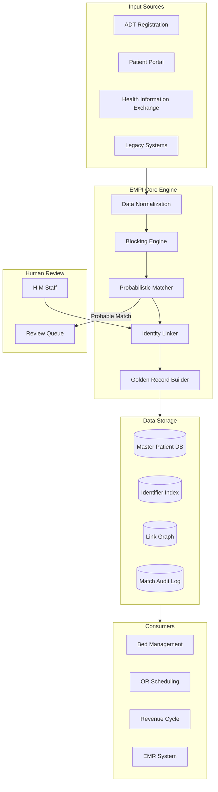
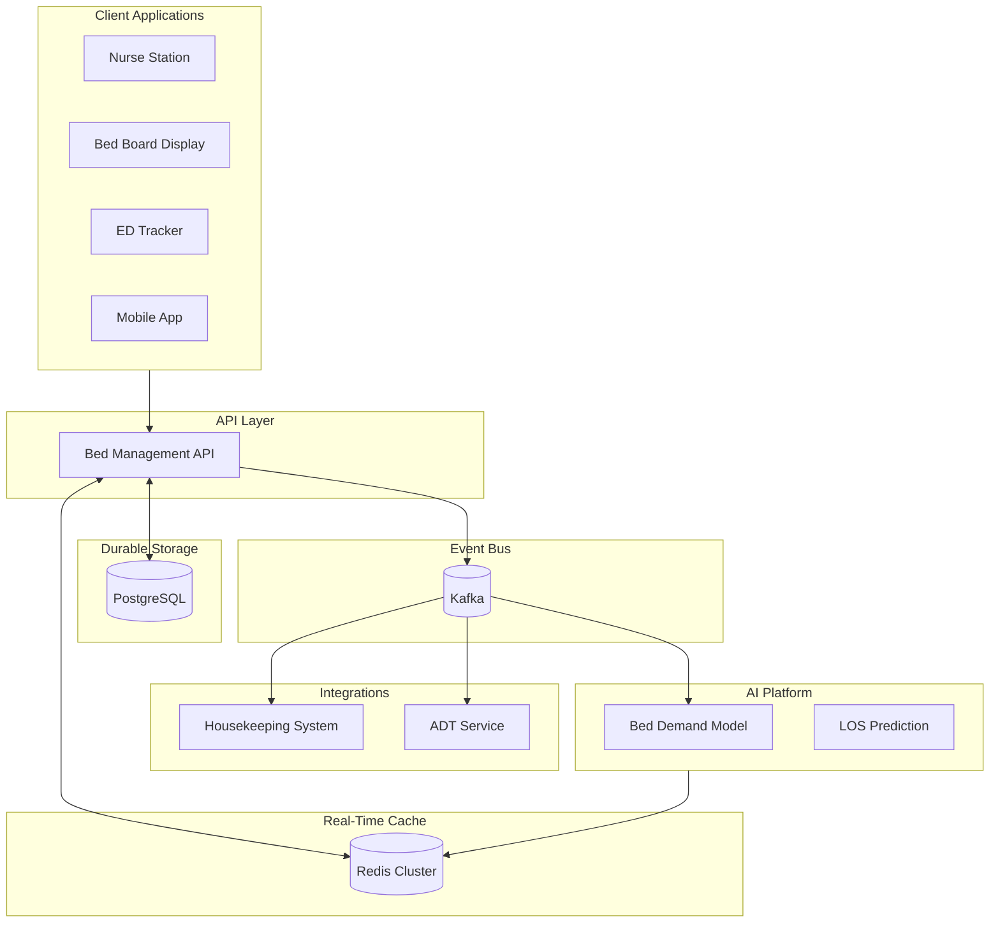
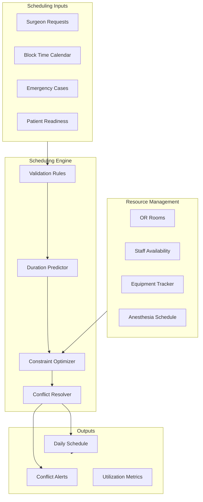
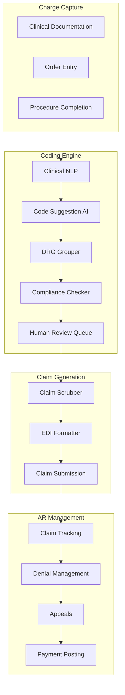

# Deep Dive and Bottlenecks

[Back to Index](./00-index.md)

---

## Deep Dive 1: Enterprise Master Patient Index (EMPI)

### Why EMPI is Critical

The Enterprise Master Patient Index is the **single source of truth for patient identity** across all hospital systems. Without a robust EMPI:

- **Safety Risk**: Wrong patient receives treatment, medication, or blood transfusion
- **Duplicate Records**: 5-10% duplicate rate is typical in healthcare
- **Financial Impact**: $1.5M+ annually in claim denials due to identity issues
- **Care Fragmentation**: Patient history split across multiple records
- **Compliance Risk**: Unable to fulfill patient data requests (HIPAA, GDPR)

### EMPI Architecture



### Probabilistic Matching Deep Dive

**The Fellegi-Sunter Model** calculates a match weight for each field:

```
Weight = log2(m / u) for matches
Weight = log2((1-m) / (1-u)) for non-matches

Where:
  m = probability of agreement given records are a match
  u = probability of agreement given records are NOT a match (by chance)
```

**Example Calculation:**

```
Patient A: John Smith, DOB 1980-05-15, SSN xxx-xx-1234, Phone 617-555-1234
Patient B: Jon Smith, DOB 1980-05-15, SSN xxx-xx-1234, Phone 617-555-9999

Field Comparisons:
┌─────────────┬─────────────┬────────────┬────────┐
│ Field       │ Comparison  │ Result     │ Weight │
├─────────────┼─────────────┼────────────┼────────┤
│ SSN         │ 1234 = 1234 │ Exact      │ +15.0  │
│ DOB         │ Same        │ Exact      │ +8.0   │
│ Last Name   │ Smith=Smith │ Exact      │ +5.0   │
│ First Name  │ John vs Jon │ J-W: 0.96  │ +2.0   │
│ Phone       │ Differ      │ Mismatch   │ -2.0   │
└─────────────┴─────────────┴────────────┴────────┘

Total Score: 15.0 + 8.0 + 5.0 + 2.0 - 2.0 = 28.0
Threshold: CERTAIN (>15) → Auto-match
```

### EMPI Failure Modes and Mitigations

| Failure Mode | Impact | Probability | Mitigation |
|--------------|--------|-------------|------------|
| **False Positive (Wrong Merge)** | Patient A gets Patient B's meds | CRITICAL | Require human review for probable matches; stricter thresholds |
| **False Negative (Missed Match)** | Duplicate record created | Medium | Periodic batch re-matching; alert on high-similarity pairs |
| **Service Unavailable** | No new registrations | High | Cache recently matched patients; allow manual MRN assignment |
| **Data Corruption** | Wrong golden record | CRITICAL | Audit log everything; point-in-time recovery |
| **Blocking Key Miss** | Match not found | Medium | Multiple blocking strategies; periodic full re-scan |

### EMPI Performance Optimization

**Challenge**: Comparing every new patient against millions of existing records is O(n).

**Solution: Blocking Strategies**

```
BLOCKING reduces comparison space from millions to hundreds:

Strategy 1: Soundex(last_name) + first_initial + birth_year
  - "Smith, John, 1980" → "S530-J-1980"
  - Reduces candidates from 2M to ~500

Strategy 2: Phone_last_4 + birth_month_day
  - "1234-0515" → matches only patients with same phone suffix and DOB
  - Reduces to ~50 candidates

Strategy 3: Zip + first_3(last) + gender
  - "02101-SMI-M"
  - Geographic + name clustering

Multiple strategies are applied and candidates are merged (union).
```

**Performance Targets:**

| Operation | Target | Achieved Via |
|-----------|--------|--------------|
| Patient search | <100ms (p99) | Blocking + indexed queries |
| Patient match (cached) | <30ms | Redis cache of recent matches |
| Patient match (new) | <500ms | Parallel blocking strategy execution |
| Batch re-matching | 100K patients/hour | Background job, partitioned by block key |

---

## Deep Dive 2: Real-Time Bed Management with AI Prediction

### Why Real-Time Bed Management is Critical

- **ED Boarding**: Patients waiting 4-6 hours in ED for inpatient beds
- **Patient Safety**: Delayed admission increases mortality risk
- **Staff Efficiency**: Nurses spend 30 min/day on bed status calls
- **Financial Impact**: Lost revenue from rejected transfers and diversions
- **Compliance**: EMTALA requires timely admission from ED

### Bed State Architecture



### Real-Time State Management

**Redis Data Structure:**

```
KEY: bed:{facility_id}:{unit_id}:{bed_id}
VALUE: {
    "status": "occupied",           // available, occupied, blocked, maintenance
    "cleaning_status": "clean",     // clean, dirty, cleaning_in_progress
    "patient_empi": "uuid-123",
    "encounter_id": "uuid-456",
    "assignment_time": "2024-01-15T08:30:00Z",
    "expected_discharge": "2024-01-17T10:00:00Z",
    "last_updated": "2024-01-15T08:30:00Z"
}
TTL: None (persistent)

KEY: unit:{facility_id}:{unit_id}:summary
VALUE: {
    "total_beds": 40,
    "available": 8,
    "occupied": 28,
    "blocked": 2,
    "cleaning": 2,
    "predicted_available_4h": 12,
    "predicted_available_8h": 15
}
TTL: 60 seconds (refreshed by background job)
```

### Bed Prediction Model Details

**Model Architecture: XGBoost + Prophet Ensemble**

```
INPUT FEATURES:
┌────────────────────────────┬───────────────────────────────────────┐
│ Feature Category           │ Specific Features                     │
├────────────────────────────┼───────────────────────────────────────┤
│ Historical Occupancy       │ Same hour yesterday, last week        │
│                            │ 7-day moving average                  │
│                            │ 30-day moving average                 │
├────────────────────────────┼───────────────────────────────────────┤
│ Scheduled Admissions       │ OR cases scheduled (next 24h)         │
│                            │ Elective admissions scheduled         │
│                            │ Transfers scheduled                   │
├────────────────────────────┼───────────────────────────────────────┤
│ ED Census                  │ Current ED census                     │
│                            │ ED acuity distribution (ESI 1-5)      │
│                            │ ED admission rate (rolling 4h)        │
├────────────────────────────┼───────────────────────────────────────┤
│ Predicted Discharges       │ LOS model predictions                 │
│                            │ Discharge orders pending              │
│                            │ Morning discharge rate                │
├────────────────────────────┼───────────────────────────────────────┤
│ External Factors           │ Day of week, time of day              │
│                            │ Month (seasonality)                   │
│                            │ Holiday flag                          │
│                            │ Weather (flu correlation)             │
└────────────────────────────┴───────────────────────────────────────┘

OUTPUT:
  - Predicted bed count available at T+4h, T+8h, T+24h, T+72h
  - Confidence interval (10th, 50th, 90th percentile)
  - Risk score for capacity crisis

MODEL TRAINING:
  - Training data: 2 years of historical census
  - Retraining frequency: Weekly
  - Validation: Rolling 30-day holdout
  - Metrics: MAPE (target <10% for 24h horizon)
```

### Concurrency and Double-Booking Prevention

**Problem**: Two nurses simultaneously try to assign same bed to different patients.

**Solution: PostgreSQL Exclusion Constraint + Optimistic Concurrency**

```sql
-- The exclusion constraint prevents overlapping assignments
EXCLUDE USING gist (
    bed_id WITH =,
    tstzrange(start_time, COALESCE(end_time, 'infinity'::timestamptz)) WITH &&
)
```

**Assignment Flow with Conflict Resolution:**

```
FUNCTION assign_bed_with_retry(bed_id, encounter_id, empi_id, max_retries=3):

    FOR attempt IN range(max_retries):
        TRY:
            -- Start transaction
            BEGIN

            -- Check current Redis state (fast check)
            redis_state = redis.get(f"bed:{bed_id}")
            IF redis_state.status != 'available':
                RAISE BedNotAvailableError("Bed is not available")

            -- Attempt database insert (authoritative check)
            INSERT INTO bed_assignment (
                bed_id, encounter_id, empi_id, start_time
            ) VALUES (
                bed_id, encounter_id, empi_id, NOW()
            )

            -- Update bed status
            UPDATE bed SET status = 'occupied' WHERE bed_id = bed_id

            COMMIT

            -- Update Redis (best effort, will be reconciled if fails)
            redis.set(f"bed:{bed_id}", {
                "status": "occupied",
                "patient_empi": empi_id,
                "encounter_id": encounter_id
            })

            -- Publish event
            kafka.publish("bed.assigned", {...})

            RETURN SUCCESS

        CATCH ExclusionConstraintViolation:
            ROLLBACK
            -- Bed was assigned by another process
            IF attempt < max_retries - 1:
                sleep(random(10, 50) ms)  -- Jittered backoff
                CONTINUE
            ELSE:
                RAISE BedConflictError("Bed assigned by another user")

        CATCH Exception as e:
            ROLLBACK
            RAISE e
```

### Bed Management Failure Modes

| Failure | Impact | Detection | Mitigation |
|---------|--------|-----------|------------|
| **Redis unavailable** | Slow bed queries | Health check | Fallback to PostgreSQL direct query |
| **Redis-PG inconsistency** | Phantom available beds | Periodic reconciliation job | PostgreSQL is source of truth |
| **Kafka unavailable** | Notifications delayed | Producer timeout | Local queue, retry on recovery |
| **AI model stale** | Predictions inaccurate | Drift monitoring | Rule-based fallback |
| **Double-booking attempt** | Second assignment fails | Exclusion constraint | Retry with next-best bed |

---

## Deep Dive 3: OR Scheduling Optimization

### Why OR Scheduling is Critical

- **Cost**: OR time costs $50-100/minute
- **Utilization**: Average OR utilization is only 65-70%
- **First Case Delays**: 20-30% of first cases start late
- **Turnover Waste**: Average 30-45 minutes between cases (target: 15-20)
- **Cancellations**: 5-10% of cases cancelled day-of

### OR Scheduling Architecture



### Case Duration Prediction Model

**Model Performance by Case Type:**

| Case Type | MAE (minutes) | % Within 15 min | Notes |
|-----------|---------------|-----------------|-------|
| General Surgery | 12 | 78% | Most predictable |
| Orthopedics | 18 | 65% | Varies by surgeon |
| Cardiac | 25 | 55% | Complex, high variance |
| Neurosurgery | 30 | 50% | Case complexity varies |
| Emergency | 35 | 45% | Inherently unpredictable |

**Feature Importance (from model):**

```
1. Surgeon historical mean for procedure (35%)
2. Procedure code (CPT) (25%)
3. Patient BMI (10%)
4. Patient age (8%)
5. ASA class (7%)
6. Number of procedures (5%)
7. Case sequence (first vs. add-on) (5%)
8. Time of day (3%)
9. Day of week (2%)
```

### Scheduling Constraint Optimization

**Constraint Satisfaction Problem:**

```
CONSTRAINTS:

Hard Constraints (must be satisfied):
  1. One case per OR at a time (no overlap)
  2. Surgeon cannot be in two ORs simultaneously
  3. Anesthesiologist cannot be in two ORs simultaneously
  4. Equipment must be available (e.g., robot, microscope)
  5. Case fits within block time or approved overtime
  6. Patient pre-op requirements complete

Soft Constraints (optimize):
  1. Minimize turnover time between cases
  2. First case starts on time (highest priority)
  3. Surgeon preference for case order
  4. Minimize overtime (penalize cases extending past 5 PM)
  5. Balance utilization across ORs
  6. Group similar cases (reduce setup time)

OBJECTIVE FUNCTION:
  Maximize: Σ(case_value) - Σ(penalty_overtime) - Σ(penalty_delay)
  Subject to: All hard constraints satisfied
```

**Optimization Algorithm: Constraint Programming with CP-SAT**

```
ALGORITHM: ORScheduleOptimization

INPUT:
  - cases: List of cases to schedule
  - blocks: Surgeon block time allocations
  - rooms: Available OR rooms
  - date: Scheduling date

OUTPUT:
  - schedule: Assigned (case, room, start_time) tuples

FUNCTION optimize_daily_schedule(cases, blocks, rooms, date):

    model = ConstraintModel()

    -- Decision variables
    FOR each case IN cases:
        case.room_var = model.NewIntVar(0, len(rooms) - 1)
        case.start_var = model.NewIntVar(0, MAX_MINUTES_IN_DAY)
        case.end_var = model.NewIntVar(0, MAX_MINUTES_IN_DAY)

        -- Duration constraint
        predicted_duration = predict_duration(case)
        model.Add(case.end_var == case.start_var + predicted_duration)

    -- Hard constraint: No overlapping cases in same room
    FOR room_idx IN range(len(rooms)):
        room_intervals = []
        FOR case IN cases:
            interval = model.NewOptionalIntervalVar(
                case.start_var,
                predicted_duration,
                case.end_var,
                model.NewBoolVar(f"case_{case.id}_in_room_{room_idx}")
            )
            room_intervals.append(interval)
        model.AddNoOverlap(room_intervals)

    -- Hard constraint: Surgeon cannot overlap
    FOR surgeon_id IN unique_surgeons(cases):
        surgeon_cases = [c FOR c IN cases IF c.surgeon_id == surgeon_id]
        intervals = [c.interval_var FOR c IN surgeon_cases]
        model.AddNoOverlap(intervals)

    -- Soft constraint: First case on time
    FOR room_idx, room IN enumerate(rooms):
        first_case = get_first_case_in_room(cases, room_idx)
        IF first_case:
            block_start = get_block_start(blocks, room, date)
            delay = model.NewIntVar(0, 60)  -- Max 60 min delay
            model.Add(delay >= first_case.start_var - block_start)
            model.Minimize(delay * FIRST_CASE_DELAY_PENALTY)

    -- Soft constraint: Minimize overtime
    FOR case IN cases:
        overtime = model.NewIntVar(0, 180)  -- Max 3 hours overtime
        model.Add(overtime >= case.end_var - END_OF_DAY_MINUTES)
        model.Minimize(overtime * OVERTIME_PENALTY)

    -- Solve
    solver = CpSolver()
    solver.parameters.max_time_in_seconds = 300  -- 5 minute limit
    status = solver.Solve(model)

    IF status == OPTIMAL or status == FEASIBLE:
        schedule = extract_schedule(solver, cases, rooms)
        RETURN schedule
    ELSE:
        RAISE SchedulingInfeasibleError("Cannot schedule all cases")
```

### OR Scheduling Failure Modes

| Failure | Impact | Mitigation |
|---------|--------|------------|
| **Duration underestimate** | Case runs over, delays subsequent cases | Buffer time, real-time re-optimization |
| **Emergency case arrives** | Bumps elective cases | Reserved emergency OR time (20%) |
| **Staff no-show** | Case cancellation | Float pool, cross-training |
| **Equipment failure** | Case delay or cancellation | Redundant equipment, backup rooms |
| **Patient not ready** | Delay first case | Pre-op checklist automation |

---

## Deep Dive 4: Revenue Cycle with AI-Assisted Coding

### Why Revenue Cycle is Critical

- **Revenue Leakage**: 1-3% of revenue left on table due to coding errors
- **Denial Rate**: 10-15% of claims initially denied
- **Days in AR**: Average 40-50 days to payment
- **Coder Shortage**: Industry-wide shortage of certified coders
- **Compliance Risk**: Upcoding can trigger fraud investigations

### Revenue Cycle Architecture



### AI Coding Model Architecture

```
MODEL: Clinical Documentation → ICD-10/CPT Codes

ARCHITECTURE:
┌─────────────────────────────────────────────────────────────────┐
│                    Clinical Documentation                        │
│  (Discharge Summary, Op Notes, Progress Notes, H&P)             │
└─────────────────────────────────────────────────────────────────┘
                              │
                              ▼
┌─────────────────────────────────────────────────────────────────┐
│                    Text Preprocessing                            │
│  • Section segmentation (HPI, Assessment, Plan)                  │
│  • Medical abbreviation expansion                                │
│  • Negation detection (NegEx algorithm)                          │
└─────────────────────────────────────────────────────────────────┘
                              │
                              ▼
┌─────────────────────────────────────────────────────────────────┐
│                    BioBERT NER                                   │
│  • Extract entities: DIAGNOSIS, PROCEDURE, SYMPTOM               │
│  • Relation extraction: diagnosis → procedure mapping            │
│  • Temporal reasoning: present vs. historical conditions         │
└─────────────────────────────────────────────────────────────────┘
                              │
                              ▼
┌─────────────────────────────────────────────────────────────────┐
│                    Code Candidate Generation                     │
│  • ICD-10-CM lookup (diagnoses)                                  │
│  • ICD-10-PCS lookup (inpatient procedures)                      │
│  • CPT lookup (professional services)                            │
│  • HCPCS lookup (supplies, DME)                                  │
└─────────────────────────────────────────────────────────────────┘
                              │
                              ▼
┌─────────────────────────────────────────────────────────────────┐
│                    Ranking & Validation                          │
│  • Confidence scoring (NLP confidence × code specificity)        │
│  • Principal diagnosis ranking                                   │
│  • Coding guideline validation                                   │
│  • Gender/age appropriateness check                              │
└─────────────────────────────────────────────────────────────────┘
                              │
                              ▼
┌─────────────────────────────────────────────────────────────────┐
│                    Compliance Check                              │
│  • NCCI edit checking (bundling)                                 │
│  • LCD/NCD medical necessity                                     │
│  • Query alerts (documentation gaps)                             │
└─────────────────────────────────────────────────────────────────┘
                              │
                              ▼
┌─────────────────────────────────────────────────────────────────┐
│                    Output                                        │
│  • Suggested codes with confidence                               │
│  • DRG assignment and weight                                     │
│  • Compliance warnings                                           │
│  • Documentation improvement queries                             │
└─────────────────────────────────────────────────────────────────┘
```

### Human-in-the-Loop Workflow

```
WORKFLOW: AI-Assisted Coding

1. Discharge triggers coding job
2. AI processes clinical documentation (30-60 seconds)
3. AI generates suggestions:
   - High confidence (>0.85): Auto-populate, highlight for review
   - Medium confidence (0.6-0.85): Suggest with alternatives
   - Low confidence (<0.6): Flag for manual coding

4. Coder reviews AI suggestions:
   - Accept: Code added to encounter
   - Modify: Coder selects alternative
   - Reject: Coder enters manual code
   - Query: Send documentation query to physician

5. Feedback loop:
   - Coder decisions logged for model retraining
   - Weekly model performance review
   - Monthly retrain with new labeled data

METRICS:
  - AI suggestion acceptance rate: Target >80%
  - Time savings: Target 40% reduction in coding time
  - Accuracy (vs. external audit): Target >95%
  - Query rate: Target <5% of encounters
```

---

## Bottleneck Analysis

### Bottleneck 1: EMPI Matching at Scale

**Problem**: With 2M+ patients, probabilistic matching can be slow.

**Analysis**:
- Without blocking: O(n) comparisons per search = 2M comparisons
- With blocking: O(b) comparisons where b = blocking partition size ≈ 500
- Reduction: 4000x fewer comparisons

**Mitigation**:
1. **Blocking strategies**: Multiple orthogonal blocking keys
2. **Index optimization**: B-tree indexes on blocking keys
3. **Caching**: Cache recent matches in Redis (5-minute TTL)
4. **Batch processing**: Background job for periodic re-matching

### Bottleneck 2: Real-Time Bed State Consistency

**Problem**: Redis and PostgreSQL can get out of sync.

**Analysis**:
- Redis is updated after PostgreSQL (eventual consistency)
- Network partition could leave Redis stale
- Race condition window: ~10-50ms

**Mitigation**:
1. **PostgreSQL is authoritative**: Always validate assignment in PostgreSQL
2. **Background reconciliation**: Every 5 minutes, reconcile Redis from PostgreSQL
3. **Event-driven updates**: Kafka events trigger Redis updates
4. **Health monitoring**: Alert if Redis-PostgreSQL divergence detected

### Bottleneck 3: Integration Hub Throughput

**Problem**: 300K HL7/FHIR messages per day through integration engine.

**Analysis**:
- Peak rate: ~30 messages/second
- Each message requires: Parse → Transform → Route → Acknowledge
- Processing time: ~50ms per message
- Single-threaded bottleneck

**Mitigation**:
1. **Horizontal scaling**: Multiple Mirth Connect channels in parallel
2. **Message prioritization**: ADT messages higher priority than results
3. **Batching**: Aggregate low-priority messages
4. **Dead letter queue**: Isolate failures to prevent blocking

### Bottleneck 4: AI Model Inference Latency

**Problem**: Real-time AI predictions add latency to operations.

**Analysis**:
- Bed prediction: ~100ms per inference
- OR duration: ~200ms per inference
- Coding AI: ~2s per document (large model)

**Mitigation**:
1. **Pre-computation**: Pre-compute bed predictions every 15 minutes
2. **Model optimization**: Quantized models for faster inference
3. **Caching**: Cache predictions with short TTL
4. **Async processing**: Coding AI runs asynchronously post-discharge
5. **Graceful degradation**: Rule-based fallback if AI times out
