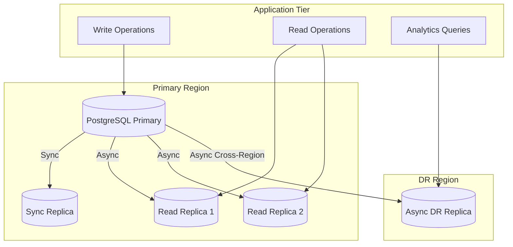
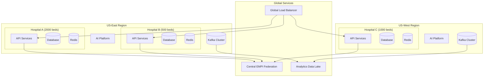

# Scalability and Reliability

[Back to Index](./00-index.md)

---

## Scalability Strategy

### Horizontal Scaling by Service

| Service | Scaling Dimension | Strategy | Bottleneck |
|---------|-------------------|----------|------------|
| **API Gateway** | Request volume | Stateless, auto-scale on CPU | Network throughput |
| **EMPI Service** | Match computation | Read replicas, cache | Database connections |
| **Bed Management** | Query volume | Redis cluster, read replicas | Redis memory |
| **ADT Service** | Event throughput | Kafka partitions | Saga state storage |
| **OR Scheduling** | Optimization compute | Queue-based batch | CPU for optimization |
| **Revenue Cycle** | Claim processing | Worker pool scaling | Database writes |
| **AI Inference** | Prediction volume | GPU auto-scaling | GPU availability |
| **Integration Hub** | Message volume | Channel parallelization | HL7 parsing CPU |

### Service Scaling Configurations

```yaml
# Kubernetes HPA Configuration Example
apiVersion: autoscaling/v2
kind: HorizontalPodAutoscaler
metadata:
  name: bed-management-hpa
spec:
  scaleTargetRef:
    apiVersion: apps/v1
    kind: Deployment
    name: bed-management
  minReplicas: 3
  maxReplicas: 10
  metrics:
    - type: Resource
      resource:
        name: cpu
        target:
          type: Utilization
          averageUtilization: 70
    - type: External
      external:
        metric:
          name: redis_connected_clients
        target:
          type: AverageValue
          averageValue: 100
  behavior:
    scaleUp:
      stabilizationWindowSeconds: 60
      policies:
        - type: Pods
          value: 2
          periodSeconds: 60
    scaleDown:
      stabilizationWindowSeconds: 300
      policies:
        - type: Percent
          value: 25
          periodSeconds: 120
```

---

## Database Scaling

### PostgreSQL Scaling Strategy



### Sharding Strategy (Multi-Hospital)

**Approach: Database-per-Hospital (Vertical Sharding)**

```
Rationale:
- Maximum data isolation (compliance requirement)
- Per-hospital backup/restore
- Per-hospital disaster recovery
- No cross-hospital query requirement

Implementation:
┌─────────────────────────────────────────────────────────────────┐
│                     Connection Router                            │
│  tenant_id → database_url mapping                               │
└─────────────────────────────────────────────────────────────────┘
                              │
        ┌─────────────────────┼─────────────────────┐
        │                     │                     │
        ▼                     ▼                     ▼
┌───────────────┐     ┌───────────────┐     ┌───────────────┐
│ Hospital A DB │     │ Hospital B DB │     │ Hospital C DB │
│  PostgreSQL   │     │  PostgreSQL   │     │  PostgreSQL   │
└───────────────┘     └───────────────┘     └───────────────┘

Connection String Resolution:
  hospital_a → postgresql://host-a:5432/hms_hospital_a
  hospital_b → postgresql://host-b:5432/hms_hospital_b
  hospital_c → postgresql://host-c:5432/hms_hospital_c
```

### Redis Scaling

**Redis Cluster Configuration:**

```
CLUSTER TOPOLOGY:
  - 6 nodes: 3 primary + 3 replica
  - Hash slots: 16384 distributed across 3 primaries
  - Cross-datacenter: Async replication to DR

KEY DISTRIBUTION:
  - bed:{facility}:{unit}:{bed} → Shard by facility
  - unit:{facility}:{unit}:summary → Shard by facility
  - empi:cache:{empi_id} → Shard by empi_id

MEMORY ALLOCATION:
  - Bed state: ~100 bytes × 2000 beds = 200 KB per hospital
  - EMPI cache: ~1 KB × 100K patients = 100 MB
  - Session data: ~5 KB × 2000 concurrent users = 10 MB
  - Total per hospital: ~150 MB
  - Cluster total (100 hospitals): ~15 GB
```

### Kafka Scaling

**Kafka Topic Partitioning:**

| Topic | Partitions | Retention | Key Strategy |
|-------|------------|-----------|--------------|
| `hms.adt.events` | 12 | 7 days | encounter_id |
| `hms.bed.events` | 6 | 24 hours | bed_id |
| `hms.or.events` | 6 | 7 days | case_id |
| `hms.billing.events` | 12 | 30 days | account_id |
| `hms.audit.events` | 24 | 1 year | timestamp (round-robin) |
| `hms.integration.hl7` | 12 | 48 hours | message_control_id |

---

## Multi-Hospital Architecture

### Network Topology



### Data Residency by Region

| Region | Hospitals | Data Location | Compliance | Replication |
|--------|-----------|---------------|------------|-------------|
| US-East | 50 | us-east-1 | HIPAA | us-west-2 (DR) |
| US-West | 30 | us-west-2 | HIPAA | us-east-1 (DR) |
| EU | 15 | eu-west-1 | GDPR | eu-central-1 (DR) |
| India | 10 | ap-south-1 | ABDM, DPDP | ap-southeast-1 (DR) |
| UK | 5 | eu-west-2 | NHS, UK GDPR | eu-west-1 (DR) |

---

## Fault Tolerance

### Service-Level Resilience

| Component | Failure Mode | Detection | Mitigation | Recovery Time |
|-----------|--------------|-----------|------------|---------------|
| **API Gateway** | Instance crash | Health check (5s) | Auto-restart, LB failover | <10s |
| **EMPI Service** | Service unavailable | Circuit breaker | Cache fallback, manual MRN | <30s |
| **Bed Management** | Redis unavailable | Health check | PostgreSQL fallback | <60s |
| **ADT Service** | Saga failure | Saga timeout | Compensation rollback | <5min |
| **Integration Hub** | Channel crash | Message timeout | Retry queue, DLQ | <30s |
| **AI Inference** | GPU failure | Health check | Rule-based fallback | <10s |

### Circuit Breaker Configuration

```yaml
# Resilience4j Circuit Breaker Configuration
resilience4j:
  circuitbreaker:
    instances:
      empi-service:
        registerHealthIndicator: true
        slidingWindowSize: 100
        minimumNumberOfCalls: 10
        permittedNumberOfCallsInHalfOpenState: 5
        waitDurationInOpenState: 30s
        failureRateThreshold: 50
        slowCallRateThreshold: 80
        slowCallDurationThreshold: 2s

      bed-redis:
        slidingWindowSize: 50
        failureRateThreshold: 30
        waitDurationInOpenState: 10s
        # Faster recovery for Redis

      ai-inference:
        slidingWindowSize: 20
        failureRateThreshold: 60
        waitDurationInOpenState: 60s
        # Longer wait for AI service recovery
```

### Retry Strategy

```python
# Exponential Backoff with Jitter
def retry_with_backoff(operation, max_retries=3, base_delay_ms=100):
    for attempt in range(max_retries):
        try:
            return operation()
        except RetryableException:
            if attempt == max_retries - 1:
                raise

            delay = base_delay_ms * (2 ** attempt)
            jitter = random.uniform(0, delay * 0.1)
            sleep_ms(delay + jitter)

# Service-specific retry policies
RETRY_POLICIES = {
    "empi_lookup": {"max_retries": 3, "base_delay_ms": 100},
    "bed_assignment": {"max_retries": 5, "base_delay_ms": 50},
    "kafka_publish": {"max_retries": 10, "base_delay_ms": 200},
    "integration_send": {"max_retries": 3, "base_delay_ms": 500},
}
```

### Graceful Degradation

| Feature | Full Functionality | Degraded Mode | Fallback Trigger |
|---------|-------------------|---------------|------------------|
| **Bed Prediction** | AI-powered 24-72h forecast | Historical average | AI service timeout |
| **OR Duration** | ML prediction with confidence | Surgeon average + 20% buffer | Model unavailable |
| **EMPI Matching** | Probabilistic matching | Exact match only | High latency (>1s) |
| **AI Coding** | Full code suggestions | Top 10 frequent codes | Document too long |
| **Real-time Dashboards** | Live updates (5s) | Cached data (5min) | WebSocket failure |

---

## Disaster Recovery

### RPO/RTO Targets

| Data Category | RPO | RTO | Strategy |
|---------------|-----|-----|----------|
| **ADT/Patient Location** | 1 minute | 15 minutes | Sync replication |
| **Bed Assignments** | 1 minute | 15 minutes | Sync replication |
| **Clinical Orders** | 1 minute | 15 minutes | Sync replication |
| **Financial/Billing** | 5 minutes | 1 hour | Async replication |
| **Audit Logs** | 0 (sync) | 15 minutes | Sync to immutable storage |
| **AI Models** | 24 hours | 4 hours | Daily snapshot |
| **Analytics Data** | 1 hour | 4 hours | CDC replication |

### Disaster Recovery Tiers

```
TIER 1: Critical (ADT, Bed Management)
  - Active-passive with hot standby
  - Automatic failover (DNS-based)
  - RTO: 15 minutes
  - Data: Synchronous replication

TIER 2: Important (OR Scheduling, Billing)
  - Active-passive with warm standby
  - Manual failover with runbook
  - RTO: 1 hour
  - Data: Asynchronous replication (5 min lag)

TIER 3: Operational (Reports, AI Features)
  - Cold standby or rebuild
  - Manual recovery from backup
  - RTO: 4 hours
  - Data: Daily backups
```

### Failover Procedure

```
RUNBOOK: Regional Failover (us-east-1 → us-west-2)

PRE-REQUISITES:
  □ DR region infrastructure verified (weekly test)
  □ Database replication lag < 1 minute
  □ DNS TTL reduced to 60 seconds (done proactively)

FAILOVER STEPS:

1. DETECTION (0-5 min)
   □ Automated health checks detect primary region failure
   □ On-call pager alert triggered
   □ Incident commander joins bridge

2. DECISION (5-10 min)
   □ Confirm primary region is unrecoverable (not transient)
   □ Approve failover (requires 2 approvals: IC + Engineering Lead)

3. DATABASE FAILOVER (10-15 min)
   □ Promote DR replica to primary
   □ Verify data consistency (run sanity checks)
   □ Update connection strings in secrets manager

4. APPLICATION FAILOVER (15-20 min)
   □ Scale up DR region services
   □ Verify service health
   □ Run smoke tests (EMPI lookup, bed query, ADT)

5. DNS CUTOVER (20-25 min)
   □ Update Route53 health check to point to DR
   □ Monitor DNS propagation
   □ Verify traffic flowing to DR

6. VALIDATION (25-35 min)
   □ Confirm all critical services operational
   □ Verify no data loss (compare sequence numbers)
   □ Notify stakeholders

7. POST-FAILOVER
   □ Monitor for issues
   □ Plan failback when primary recovers
   □ Conduct post-incident review

ROLLBACK:
  If DR region has issues, revert DNS to primary (if recovered)
  or escalate to extended outage procedures
```

### Backup Strategy

| Data | Backup Type | Frequency | Retention | Location |
|------|-------------|-----------|-----------|----------|
| PostgreSQL | Full snapshot | Daily | 30 days | Cross-region S3 |
| PostgreSQL | WAL archiving | Continuous | 7 days | Cross-region S3 |
| Redis | RDB snapshot | Hourly | 24 hours | Local + S3 |
| Kafka | Topic backup | Daily | 7 days | S3 |
| Documents | Incremental | Daily | 7 years | S3 Glacier |
| AI Models | Model artifacts | On deploy | 10 versions | S3 |

---

## Load Testing Results

### Baseline Performance (2000-bed Hospital)

| Scenario | Target | Achieved | Notes |
|----------|--------|----------|-------|
| Bed query (p99) | <100ms | 45ms | Redis cached |
| Bed assignment (p99) | <500ms | 280ms | PostgreSQL + Redis |
| EMPI lookup (p99) | <150ms | 95ms | With blocking |
| ADT event (p99) | <500ms | 320ms | Full saga |
| Peak concurrent users | 2000 | 2500 | Before degradation |
| Sustained QPS | 100 | 150 | Mixed workload |

### Stress Test Results

```
TEST: 10x Normal Load (Simulated Mass Casualty Event)

Scenario:
  - 200 simultaneous ED admissions (normally 20/hour)
  - All requiring bed assignment
  - OR schedule disruption

Results:
  - Bed query latency: p99 increased from 45ms to 180ms
  - Bed assignment: Some failures (5%) due to contention
  - EMPI: Handled load with increased cache hit rate
  - Saga completion: 95% within SLA

Observations:
  - Redis became bottleneck (CPU 90%)
  - Scaled Redis cluster to 9 nodes
  - After scaling: All metrics within SLA

Recommendations:
  - Pre-provision additional Redis capacity for surge
  - Implement priority queuing for ED vs. elective
```

### Chaos Engineering Tests

| Test | Frequency | Result | Action Required |
|------|-----------|--------|-----------------|
| Kill random API pod | Weekly | Passed (auto-recovery 8s) | None |
| Redis primary failover | Monthly | Passed (failover 15s) | None |
| PostgreSQL failover | Monthly | Passed (failover 45s) | None |
| Network partition (API ↔ DB) | Quarterly | Partial failure | Improve circuit breaker |
| Full region outage simulation | Semi-annual | Passed (RTO 22 min) | Document lessons |

---

## Capacity Planning

### Growth Projections

| Metric | Current | Year 1 | Year 3 | Year 5 |
|--------|---------|--------|--------|--------|
| Hospitals | 10 | 25 | 75 | 150 |
| Total Beds | 10,000 | 25,000 | 75,000 | 150,000 |
| Daily ADT Events | 5,000 | 12,500 | 37,500 | 75,000 |
| Concurrent Users | 5,000 | 12,500 | 37,500 | 75,000 |
| Storage (TB) | 5 | 15 | 50 | 120 |
| Monthly Cost | $50K | $120K | $350K | $700K |

### Scaling Triggers

| Metric | Warning | Critical | Auto-Scale Action |
|--------|---------|----------|-------------------|
| API CPU | 60% | 80% | Add 2 pods |
| Redis Memory | 70% | 85% | Scale cluster |
| PostgreSQL Connections | 70% | 90% | Add read replica |
| Kafka Consumer Lag | 1000 msgs | 5000 msgs | Add consumers |
| AI Inference Queue | 10s wait | 30s wait | Add GPU node |
