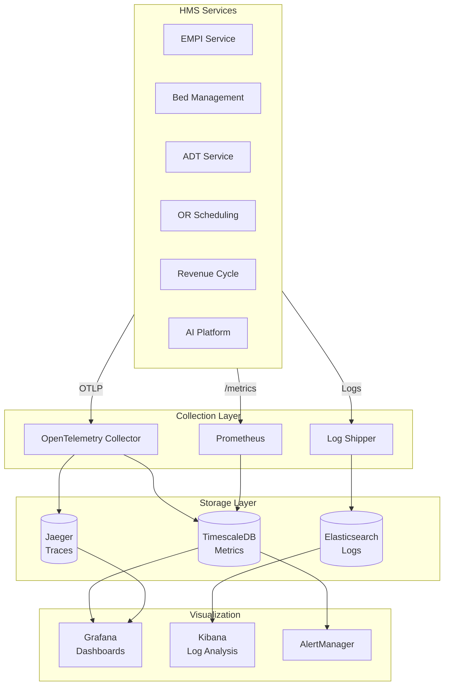

# Observability

[Back to Index](./00-index.md)

---

## Observability Strategy

### Three Pillars Implementation



---

## Metrics Strategy (USE/RED)

### Infrastructure Metrics (USE)

| Resource | Utilization | Saturation | Errors |
|----------|-------------|------------|--------|
| **CPU** | `cpu_usage_percent` | `cpu_throttled_seconds` | N/A |
| **Memory** | `memory_used_bytes` | `memory_swap_used` | `oom_kills_total` |
| **Disk** | `disk_used_percent` | `disk_io_wait_seconds` | `disk_errors_total` |
| **Network** | `network_bytes_total` | `tcp_retransmits` | `network_errors_total` |
| **PostgreSQL** | `pg_connections_used` | `pg_deadlocks_total` | `pg_errors_total` |
| **Redis** | `redis_memory_used` | `redis_blocked_clients` | `redis_rejected_connections` |

### Service Metrics (RED)

| Service | Rate | Errors | Duration |
|---------|------|--------|----------|
| **EMPI API** | `empi_requests_total` | `empi_errors_total` | `empi_duration_seconds` |
| **Bed Management** | `bed_requests_total` | `bed_errors_total` | `bed_duration_seconds` |
| **ADT Service** | `adt_events_total` | `adt_errors_total` | `adt_saga_duration_seconds` |
| **OR Scheduling** | `or_requests_total` | `or_errors_total` | `or_duration_seconds` |
| **Revenue Cycle** | `rcm_requests_total` | `rcm_errors_total` | `rcm_duration_seconds` |

### HMS-Specific Business Metrics

```prometheus
# Bed Management Metrics
bed_occupancy_rate{facility, unit, bed_type}
bed_available_count{facility, unit}
bed_assignment_duration_seconds{facility, unit}
bed_turnover_time_seconds{facility, unit}
ed_boarding_patients{facility}
ed_boarding_hours_total{facility}
bed_cleaning_queue_depth{facility, unit}

# AI Prediction Metrics
ai_bed_prediction_mape{horizon, facility}
ai_bed_prediction_requests_total{facility}
ai_bed_prediction_duration_seconds{facility}
ai_prediction_cache_hit_ratio{model}

# EMPI Metrics
empi_match_requests_total{result}  # result: certain, probable, possible, new
empi_match_confidence_histogram
empi_duplicate_rate{facility}
empi_review_queue_depth

# OR Scheduling Metrics
or_utilization_rate{facility, room}
or_case_duration_variance_minutes{procedure_type, surgeon}
or_turnover_time_minutes{facility, room}
or_first_case_on_time_rate{facility}
or_cases_scheduled_total{facility, status}
or_ai_duration_prediction_mae{facility}

# ADT Workflow Metrics
adt_admissions_total{facility, type}
adt_discharges_total{facility, disposition}
adt_transfers_total{facility}
adt_saga_completion_rate{saga_type}
adt_saga_compensation_total{saga_type}
adt_average_los_days{facility, unit}

# Revenue Cycle Metrics
rcm_charges_captured_total{facility, department}
rcm_charges_amount_total{facility, department}
rcm_claims_submitted_total{facility, payer}
rcm_claims_denied_total{facility, payer, reason}
rcm_denial_rate{facility, payer}
rcm_days_in_ar{facility, payer}
rcm_ai_coding_acceptance_rate{facility}
rcm_coding_queue_depth{facility}

# Integration Metrics
integration_messages_total{direction, protocol, source}
integration_errors_total{direction, protocol, error_type}
integration_latency_seconds{direction, protocol}
integration_queue_depth{source}
```

---

## Dashboard Design

### Operations Command Center

```
┌─────────────────────────────────────────────────────────────────────────────┐
│                    HMS OPERATIONS COMMAND CENTER                             │
│                    Hospital: Memorial General | Date: 2024-01-15             │
├─────────────────────────────────────────────────────────────────────────────┤
│                                                                             │
│  REAL-TIME BED STATUS                                           ALERTS (3)  │
│  ┌───────────────┬───────────────┬───────────────┬───────────────┐ ┌─────┐ │
│  │  ICU (20)     │  Med/Surg (100)│  Telemetry(40)│  ED Holding   │ │ !!! │ │
│  │  ████████░░   │  ████████████░ │  ████████████ │  ████░░░░░░   │ │     │ │
│  │  Occ: 80%     │  Occ: 85%      │  Occ: 95%     │  Boarding: 12 │ │ ICU │ │
│  │  Avail: 4     │  Avail: 15     │  Avail: 2     │  Avg: 4.2h    │ │>90% │ │
│  │  Predicted:   │  Predicted:    │  Predicted:   │               │ │     │ │
│  │  +2 in 4h     │  +8 in 4h      │  +3 in 4h     │               │ └─────┘ │
│  └───────────────┴───────────────┴───────────────┴───────────────┘         │
│                                                                             │
├─────────────────────────────────────────────────────────────────────────────┤
│                                                                             │
│  OR UTILIZATION TODAY                            FIRST CASE ON-TIME: 78%    │
│  ┌─────────────────────────────────────────────────────────────────────┐   │
│  │ OR-1  ████████░░ 80%   OR-5  ██████░░░░ 60%   OR-9   ████████░░ 80% │   │
│  │ OR-2  ██████████ 95%   OR-6  ████████░░ 78%   OR-10  ██████░░░░ 55% │   │
│  │ OR-3  ████████░░ 82%   OR-7  ████░░░░░░ 40%   OR-11  ████████░░ 75% │   │
│  │ OR-4  ████████░░ 88%   OR-8  ██████████ 92%   OR-12  ██████████ 90% │   │
│  └─────────────────────────────────────────────────────────────────────┘   │
│  Cases Complete: 45/60 | Avg Turnover: 28 min | Cancellations: 2           │
│                                                                             │
├─────────────────────────────────────────────────────────────────────────────┤
│                                                                             │
│  ADT TODAY                          │  REVENUE CYCLE                        │
│  ┌────────────────────────────────┐ │ ┌────────────────────────────────┐   │
│  │ Admissions:      45 (+12%)     │ │ │ Charges Captured: $1.2M        │   │
│  │ Discharges:      38 (-5%)      │ │ │ Claims Submitted:  142         │   │
│  │ Transfers:       23            │ │ │ Denial Rate:       8.2%        │   │
│  │ Current Census:  1,842         │ │ │ Days in AR:        42          │   │
│  │ Avg LOS:         5.2 days      │ │ │ AI Coding Accept:  84%         │   │
│  └────────────────────────────────┘ │ └────────────────────────────────┘   │
│                                                                             │
├─────────────────────────────────────────────────────────────────────────────┤
│                                                                             │
│  SYSTEM HEALTH                                                              │
│  ┌────────────────────────────────────────────────────────────────────┐    │
│  │ API Gateway:  ● UP  p99: 45ms   │ EMPI:        ● UP  p99: 95ms     │    │
│  │ Bed Service:  ● UP  p99: 28ms   │ Integration: ● UP  lag: 2s      │    │
│  │ ADT Service:  ● UP  p99: 320ms  │ AI Platform: ● UP  p99: 180ms   │    │
│  │ Redis:        ● UP  mem: 45%    │ PostgreSQL:  ● UP  conn: 120    │    │
│  └────────────────────────────────────────────────────────────────────┘    │
│                                                                             │
└─────────────────────────────────────────────────────────────────────────────┘
```

### AI Model Performance Dashboard

```
┌─────────────────────────────────────────────────────────────────────────────┐
│                    AI MODEL PERFORMANCE DASHBOARD                            │
├─────────────────────────────────────────────────────────────────────────────┤
│                                                                             │
│  BED DEMAND PREDICTION                          TREND (7 DAYS)              │
│  ┌────────────────────────────────────────┐    ┌─────────────────────┐     │
│  │ Horizon   MAPE    Bias    Coverage     │    │      MAPE %         │     │
│  │ ─────────────────────────────────────  │    │   15┤    ╭──╮       │     │
│  │ 4 hours   6.2%    +0.3    94%          │    │   10┤──╮─╯  ╰─╮──╮  │     │
│  │ 8 hours   8.1%    +0.8    91%          │    │    5┤  ╰─────╯  ╰──│     │
│  │ 24 hours  9.8%    +1.2    88%          │    │    0┼──────────────│     │
│  │ 72 hours  14.2%   +2.1    82%          │    │      M  T  W  T  F │     │
│  └────────────────────────────────────────┘    └─────────────────────┘     │
│                                                                             │
│  OR CASE DURATION PREDICTION                                                │
│  ┌────────────────────────────────────────────────────────────────────┐    │
│  │ Procedure Type      Cases   MAE (min)   % Within 15 min            │    │
│  │ ─────────────────────────────────────────────────────────────────  │    │
│  │ General Surgery      234      12.3          78%                    │    │
│  │ Orthopedics          189      17.8          65%                    │    │
│  │ Cardiac              98       24.5          55%                    │    │
│  │ Neurosurgery         45       29.2          50%                    │    │
│  │ Emergency            67       34.1          45%                    │    │
│  └────────────────────────────────────────────────────────────────────┘    │
│                                                                             │
│  AI CODING ASSISTANT                                                        │
│  ┌────────────────────────────────────────────────────────────────────┐    │
│  │ Metric                          Today    7-Day Avg    Target       │    │
│  │ ─────────────────────────────────────────────────────────────────  │    │
│  │ Suggestion Acceptance Rate      84%       82%          80%         │    │
│  │ Code Accuracy (vs. audit)       96%       95%          95%         │    │
│  │ Processing Time (p99)           1.8s      2.1s         3s          │    │
│  │ Documents Processed             342       328          -           │    │
│  │ Manual Coding Required          16%       18%          <20%        │    │
│  └────────────────────────────────────────────────────────────────────┘    │
│                                                                             │
│  MODEL DRIFT DETECTION                                                      │
│  ┌────────────────────────────────────────────────────────────────────┐    │
│  │ Model                  Status    Drift Score    Last Retrain       │    │
│  │ ─────────────────────────────────────────────────────────────────  │    │
│  │ Bed Prediction         ● OK      0.12           3 days ago         │    │
│  │ OR Duration            ● OK      0.08           5 days ago         │    │
│  │ LOS Prediction         ⚠ WARN    0.28           12 days ago        │    │
│  │ Coding AI              ● OK      0.15           7 days ago         │    │
│  └────────────────────────────────────────────────────────────────────┘    │
│                                                                             │
└─────────────────────────────────────────────────────────────────────────────┘
```

---

## Logging Strategy

### Structured Log Format

```json
{
  "timestamp": "2024-01-15T08:30:45.123Z",
  "level": "INFO",
  "service": "bed-management",
  "version": "1.2.3",
  "trace_id": "abc123def456",
  "span_id": "789ghi",
  "request_id": "req-uuid-123",
  "facility_id": "hospital-a",
  "user_id": "nurse-jane-doe",
  "action": "bed_assignment",
  "resource": {
    "type": "bed",
    "id": "3A-101"
  },
  "patient_empi": "[REDACTED]",
  "outcome": "success",
  "duration_ms": 125,
  "message": "Bed assigned successfully",
  "metadata": {
    "unit": "3A",
    "assignment_reason": "admission",
    "ai_recommendation_used": true
  }
}
```

### PHI Handling in Logs

```python
# Log redaction configuration
REDACT_FIELDS = [
    "patient_empi",
    "ssn",
    "mrn",
    "date_of_birth",
    "address",
    "phone",
    "email",
    "insurance_id"
]

def redact_phi(log_entry):
    for field in REDACT_FIELDS:
        if field in log_entry:
            log_entry[field] = "[REDACTED]"
        if "metadata" in log_entry and field in log_entry["metadata"]:
            log_entry["metadata"][field] = "[REDACTED]"
    return log_entry

# Separate PHI audit log (encrypted, restricted access)
def log_phi_access(user_id, patient_empi, action, resource):
    audit_log.write({
        "timestamp": now(),
        "user_id": user_id,
        "patient_empi": patient_empi,  # Encrypted at rest
        "action": action,
        "resource": resource,
        "ip_address": get_client_ip(),
        "session_id": get_session_id()
    })
```

### Log Levels and Usage

| Level | When to Use | Retention | Alerting |
|-------|-------------|-----------|----------|
| **ERROR** | Unhandled exceptions, failed operations | 90 days | Immediate |
| **WARN** | Degraded operations, retries, near-limits | 30 days | Threshold |
| **INFO** | Business events, state changes | 14 days | None |
| **DEBUG** | Detailed flow, variable values | 7 days | None |
| **TRACE** | Very detailed debugging | 1 day | None |

---

## Distributed Tracing

### Trace Propagation

```
Client Request → API Gateway → Bed Service → Redis
                     ↓              ↓
                   Auth          PostgreSQL
                     ↓              ↓
                   OPA           Kafka (async)

Trace Context Headers (W3C Trace Context):
  traceparent: 00-{trace_id}-{span_id}-{flags}
  tracestate: hms=facility:hospital-a,user:nurse-123

Example Trace:
┌─────────────────────────────────────────────────────────────────────────┐
│ Trace ID: abc123def456ghi789                                            │
│ Duration: 285ms                                                          │
├─────────────────────────────────────────────────────────────────────────┤
│                                                                         │
│ ├─ api-gateway (45ms)                                                   │
│ │  ├─ auth-service (15ms)                                               │
│ │  │  └─ opa-policy-check (5ms)                                         │
│ │  └─ route-to-service (2ms)                                            │
│ │                                                                       │
│ ├─ bed-management (180ms)                                               │
│ │  ├─ redis-get-availability (8ms)                                      │
│ │  ├─ ai-prediction (45ms)                                              │
│ │  ├─ postgres-insert-assignment (85ms)                                 │
│ │  │  └─ exclusion-constraint-check (40ms)                              │
│ │  ├─ redis-update-state (12ms)                                         │
│ │  └─ kafka-publish (async, not in critical path)                       │
│ │                                                                       │
│ └─ response (5ms)                                                       │
│                                                                         │
└─────────────────────────────────────────────────────────────────────────┘
```

### Critical Spans to Instrument

| Service | Span Name | Attributes |
|---------|-----------|------------|
| **API Gateway** | `http.request` | method, path, status, user_id |
| **Auth** | `auth.verify_token` | token_type, user_role |
| **OPA** | `opa.policy_decision` | policy_name, decision, duration |
| **EMPI** | `empi.match_patient` | match_type, confidence, candidates |
| **Bed Mgmt** | `bed.assign` | bed_id, unit, ai_recommended |
| **Bed Mgmt** | `redis.get_availability` | unit, hit/miss |
| **ADT** | `saga.step` | saga_type, step_name, status |
| **OR** | `or.predict_duration` | procedure_type, model_version |
| **Integration** | `hl7.process_message` | message_type, source, destination |
| **AI** | `ai.inference` | model_name, batch_size, duration |

---

## Alerting Strategy

### Critical Alerts (Page-Worthy)

```yaml
groups:
  - name: hms_critical
    rules:
      - alert: BedServiceDown
        expr: up{job="bed-management"} == 0
        for: 1m
        labels:
          severity: critical
          team: operations
        annotations:
          summary: "Bed Management service is down"
          runbook: "https://runbooks.hms.internal/bed-service-down"

      - alert: HighEDBoardingTime
        expr: histogram_quantile(0.9, ed_boarding_hours_bucket) > 4
        for: 30m
        labels:
          severity: critical
          team: nursing-admin
        annotations:
          summary: "ED boarding time exceeds 4 hours (p90)"
          impact: "Patient safety risk, EMTALA compliance"

      - alert: BedDoubleBookingAttempt
        expr: increase(bed_assignment_conflict_total[5m]) > 0
        labels:
          severity: critical
          team: engineering
        annotations:
          summary: "Bed double-booking attempt detected"
          description: "Exclusion constraint prevented duplicate assignment"

      - alert: DatabaseConnectionExhausted
        expr: pg_connections_used / pg_connections_max > 0.9
        for: 5m
        labels:
          severity: critical
          team: dba
        annotations:
          summary: "PostgreSQL connection pool near exhaustion"

      - alert: EMPIServiceHighLatency
        expr: histogram_quantile(0.99, empi_duration_seconds_bucket) > 1
        for: 5m
        labels:
          severity: critical
          team: engineering
        annotations:
          summary: "EMPI service p99 latency exceeds 1s"
```

### Warning Alerts

```yaml
  - name: hms_warnings
    rules:
      - alert: BedOccupancyHigh
        expr: bed_occupancy_rate > 0.90
        for: 1h
        labels:
          severity: warning
          team: nursing-admin
        annotations:
          summary: "Unit {{ $labels.unit }} occupancy above 90%"

      - alert: ORFirstCaseDelays
        expr: or_first_case_on_time_rate < 0.7
        for: 1d
        labels:
          severity: warning
          team: or-admin
        annotations:
          summary: "First case on-time rate below 70%"

      - alert: AIModelDrift
        expr: ai_model_drift_score > 0.25
        for: 24h
        labels:
          severity: warning
          team: ml-ops
        annotations:
          summary: "Model {{ $labels.model }} showing drift"

      - alert: IntegrationQueueBacklog
        expr: integration_queue_depth > 1000
        for: 15m
        labels:
          severity: warning
          team: integration
        annotations:
          summary: "Integration queue backlog growing"

      - alert: DenialRateHigh
        expr: rcm_denial_rate > 0.15
        for: 1d
        labels:
          severity: warning
          team: billing
        annotations:
          summary: "Claim denial rate above 15%"
```

### Alert Routing

```yaml
# AlertManager Configuration
route:
  receiver: 'default'
  group_by: ['alertname', 'facility']
  group_wait: 30s
  group_interval: 5m
  repeat_interval: 4h
  routes:
    - match:
        severity: critical
      receiver: 'pagerduty-critical'
      continue: true
    - match:
        team: nursing-admin
      receiver: 'nursing-slack'
    - match:
        team: engineering
      receiver: 'engineering-slack'
    - match:
        team: billing
      receiver: 'billing-email'

receivers:
  - name: 'pagerduty-critical'
    pagerduty_configs:
      - service_key: '<pagerduty-key>'
        severity: critical

  - name: 'nursing-slack'
    slack_configs:
      - channel: '#hms-nursing-alerts'
        send_resolved: true

  - name: 'engineering-slack'
    slack_configs:
      - channel: '#hms-engineering'
        send_resolved: true
```

---

## Compliance and Audit Dashboards

### PHI Access Monitoring

```
┌─────────────────────────────────────────────────────────────────────────────┐
│                    PHI ACCESS MONITORING DASHBOARD                          │
├─────────────────────────────────────────────────────────────────────────────┤
│                                                                             │
│  ACCESS SUMMARY (Last 24 Hours)                                             │
│  ┌────────────────────────────────────────────────────────────────────┐    │
│  │ Total PHI Accesses:        15,234                                  │    │
│  │ Unique Users:              1,245                                   │    │
│  │ Unique Patients Accessed:  8,432                                   │    │
│  │ Average Accesses/User:     12.2                                    │    │
│  └────────────────────────────────────────────────────────────────────┘    │
│                                                                             │
│  ACCESS BY ROLE                    ACCESS BY HOUR                           │
│  ┌────────────────────────────┐   ┌────────────────────────────────┐       │
│  │ Physician:     4,521 (30%) │   │    ▂                           │       │
│  │ Nurse:         7,823 (51%) │   │   ▄█▄                          │       │
│  │ Billing:       1,432 (9%)  │   │  ▆███▆                         │       │
│  │ Registration:  1,123 (7%)  │   │ ████████▄   ▂▄▆▆▄▂             │       │
│  │ Other:           335 (2%)  │   │ ██████████████████████         │       │
│  └────────────────────────────┘   │  0  4  8  12 16 20 24         │       │
│                                   └────────────────────────────────┘       │
│                                                                             │
│  ANOMALIES & ALERTS                                                         │
│  ┌────────────────────────────────────────────────────────────────────┐    │
│  │ ⚠ Break-the-glass events: 3 (requires review)                      │    │
│  │   - Dr. Smith at 02:15 AM - Emergency access                       │    │
│  │   - Nurse Jones at 03:42 AM - Patient transfer                     │    │
│  │   - Dr. Chen at 14:30 PM - Consult request                         │    │
│  │                                                                    │    │
│  │ ⚠ Unusual access patterns: 2 (flagged for review)                  │    │
│  │   - User X accessed 150 records (normal: 20) - UNDER REVIEW        │    │
│  │   - User Y accessed VIP patient outside care team - PENDING        │    │
│  └────────────────────────────────────────────────────────────────────┘    │
│                                                                             │
│  FAILED ACCESS ATTEMPTS                                                     │
│  ┌────────────────────────────────────────────────────────────────────┐    │
│  │ Authorization Denied:     47                                       │    │
│  │ Authentication Failed:    23                                       │    │
│  │ Session Expired:          89                                       │    │
│  │ Rate Limited:             12                                       │    │
│  └────────────────────────────────────────────────────────────────────┘    │
│                                                                             │
└─────────────────────────────────────────────────────────────────────────────┘
```

### Accreditation Readiness Dashboard

```
┌─────────────────────────────────────────────────────────────────────────────┐
│                    ACCREDITATION READINESS                                   │
│                    Standards: HIPAA | NABH | JCAHO                           │
├─────────────────────────────────────────────────────────────────────────────┤
│                                                                             │
│  OVERALL COMPLIANCE SCORE: 96% ████████████████████░░                       │
│                                                                             │
│  BY FRAMEWORK                                                               │
│  ┌────────────────────────────────────────────────────────────────────┐    │
│  │ HIPAA (USA)     98% █████████████████████░   2 findings open       │    │
│  │ NABH (India)    95% ███████████████████░░░   5 findings open       │    │
│  │ JCAHO (USA)     94% ██████████████████░░░░   6 findings open       │    │
│  └────────────────────────────────────────────────────────────────────┘    │
│                                                                             │
│  CONTROL STATUS                                                             │
│  ┌────────────────────────────────────────────────────────────────────┐    │
│  │ Control Area               Implemented   Tested   Issues           │    │
│  │ ───────────────────────────────────────────────────────────────── │    │
│  │ Access Control             ✓ 100%        ✓ 100%   0               │    │
│  │ Audit Logging              ✓ 100%        ✓ 100%   0               │    │
│  │ Encryption                 ✓ 100%        ✓ 100%   0               │    │
│  │ Patient Identification     ✓ 100%        ✓ 98%    2               │    │
│  │ Incident Response          ✓ 100%        ✓ 95%    1               │    │
│  │ Business Continuity        ✓ 100%        ✓ 90%    3               │    │
│  │ Vendor Management          ✓ 95%         ✓ 85%    5               │    │
│  │ Training                   ✓ 92%         ✓ 92%    2               │    │
│  └────────────────────────────────────────────────────────────────────┘    │
│                                                                             │
│  RECENT AUDIT FINDINGS                                                      │
│  ┌────────────────────────────────────────────────────────────────────┐    │
│  │ Finding                        Severity   Status      Due Date     │    │
│  │ ───────────────────────────────────────────────────────────────── │    │
│  │ DR test documentation gap      Medium     In Progress  Jan 30      │    │
│  │ Vendor BAA renewal pending     Low        In Progress  Feb 15      │    │
│  │ Access review backlog          Low        In Progress  Jan 25      │    │
│  └────────────────────────────────────────────────────────────────────┘    │
│                                                                             │
└─────────────────────────────────────────────────────────────────────────────┘
```

---

## SLO Tracking

### SLO Dashboard

```
┌─────────────────────────────────────────────────────────────────────────────┐
│                    SERVICE LEVEL OBJECTIVES                                  │
│                    Period: January 2024 | Budget Remaining: 18 days          │
├─────────────────────────────────────────────────────────────────────────────┤
│                                                                             │
│  AVAILABILITY SLOs                                                          │
│  ┌────────────────────────────────────────────────────────────────────┐    │
│  │ Service            SLO       Current    Budget Used   Status       │    │
│  │ ───────────────────────────────────────────────────────────────── │    │
│  │ ADT API            99.99%    99.995%    10%           ● OK        │    │
│  │ Bed Management     99.99%    99.98%     45%           ⚠ WARNING   │    │
│  │ EMPI API           99.95%    99.97%     25%           ● OK        │    │
│  │ OR Scheduling      99.95%    99.96%     30%           ● OK        │    │
│  │ Revenue Cycle      99.9%     99.95%     15%           ● OK        │    │
│  └────────────────────────────────────────────────────────────────────┘    │
│                                                                             │
│  LATENCY SLOs (p99)                                                         │
│  ┌────────────────────────────────────────────────────────────────────┐    │
│  │ Service            SLO       Current    Trend         Status       │    │
│  │ ───────────────────────────────────────────────────────────────── │    │
│  │ Bed Query          100ms     45ms       ↓ improving   ● OK        │    │
│  │ ADT Processing     500ms     320ms      → stable      ● OK        │    │
│  │ EMPI Lookup        150ms     95ms       ↓ improving   ● OK        │    │
│  │ OR Schedule        1000ms    750ms      ↑ degrading   ⚠ WARNING   │    │
│  └────────────────────────────────────────────────────────────────────┘    │
│                                                                             │
│  ERROR BUDGET BURN RATE                                                     │
│  ┌────────────────────────────────────────────────────────────────────┐    │
│  │                                                                    │    │
│  │ Bed Management (99.99% SLO)                                        │    │
│  │   Budget: 4.3 min/month | Used: 1.9 min | Remaining: 2.4 min      │    │
│  │   █████████████████████████░░░░░░░░░░░░░░░░░░ 45%                 │    │
│  │   Burn rate: 1.5x (acceptable < 2x)                                │    │
│  │                                                                    │    │
│  └────────────────────────────────────────────────────────────────────┘    │
│                                                                             │
└─────────────────────────────────────────────────────────────────────────────┘
```
