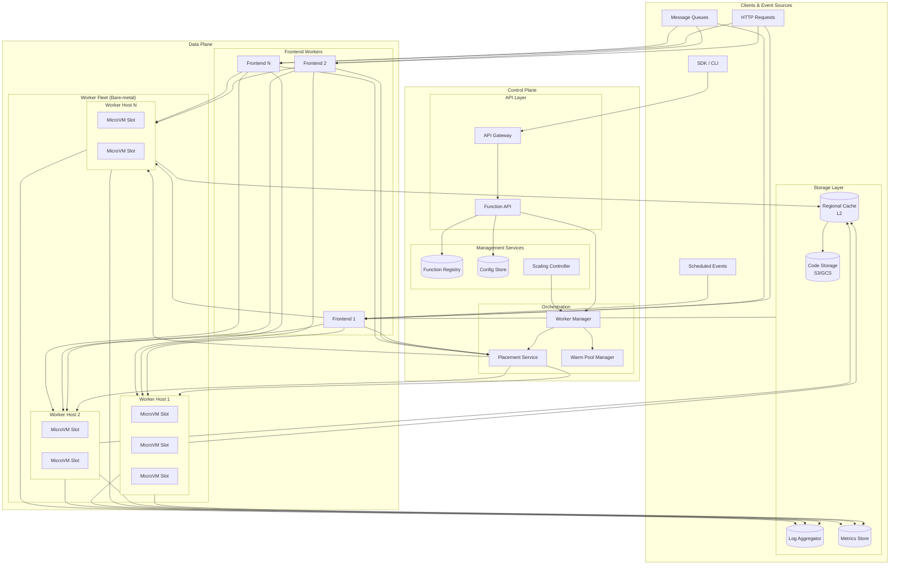
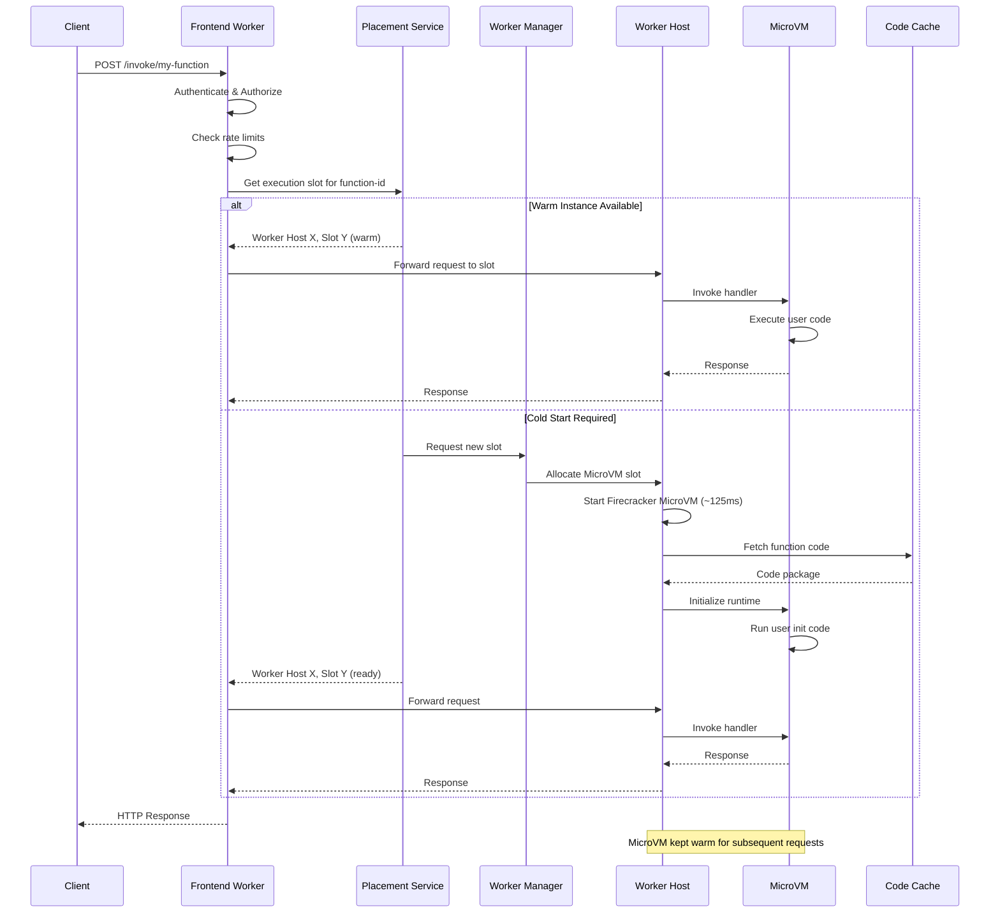
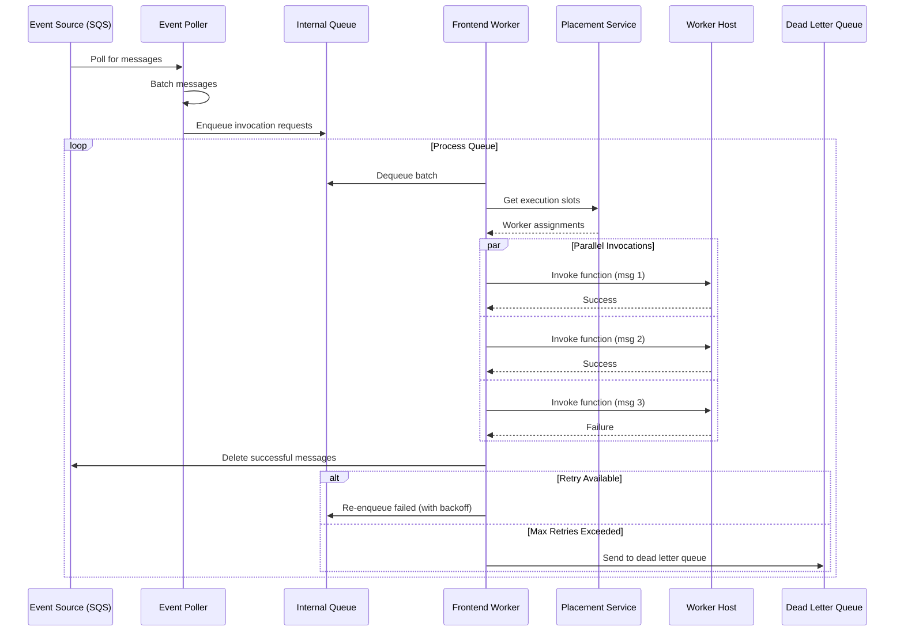
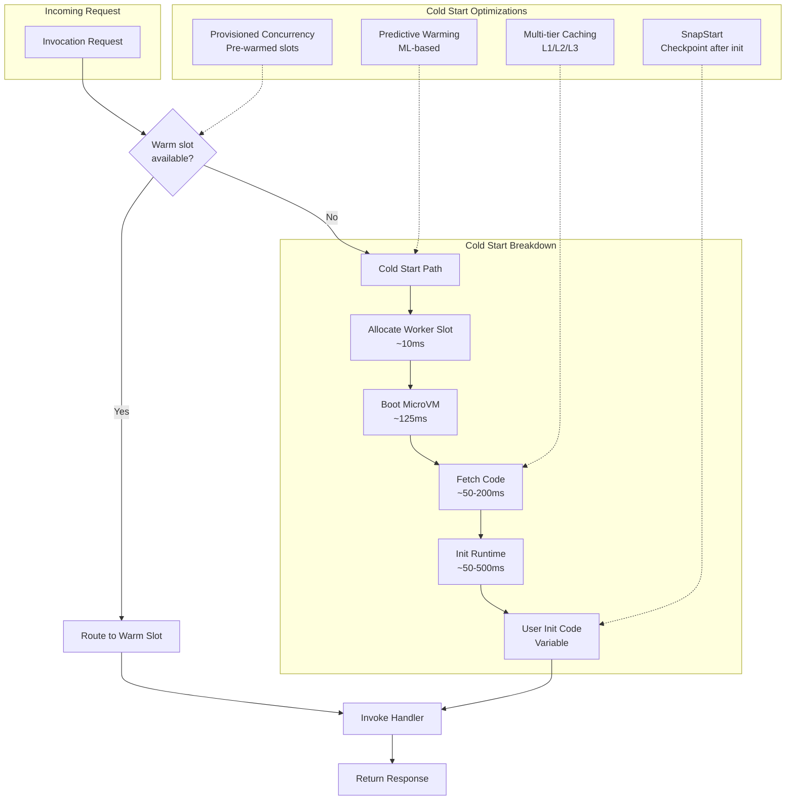
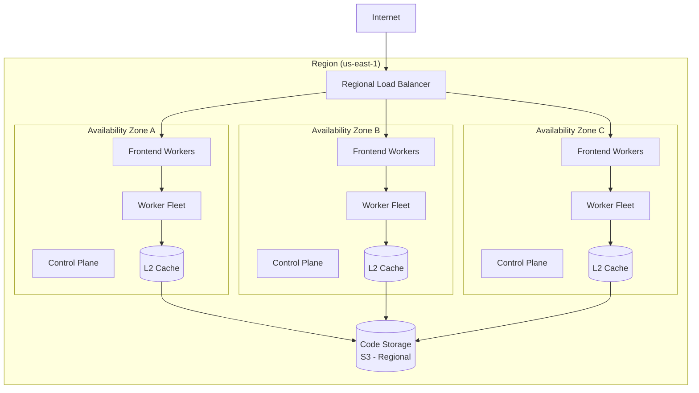
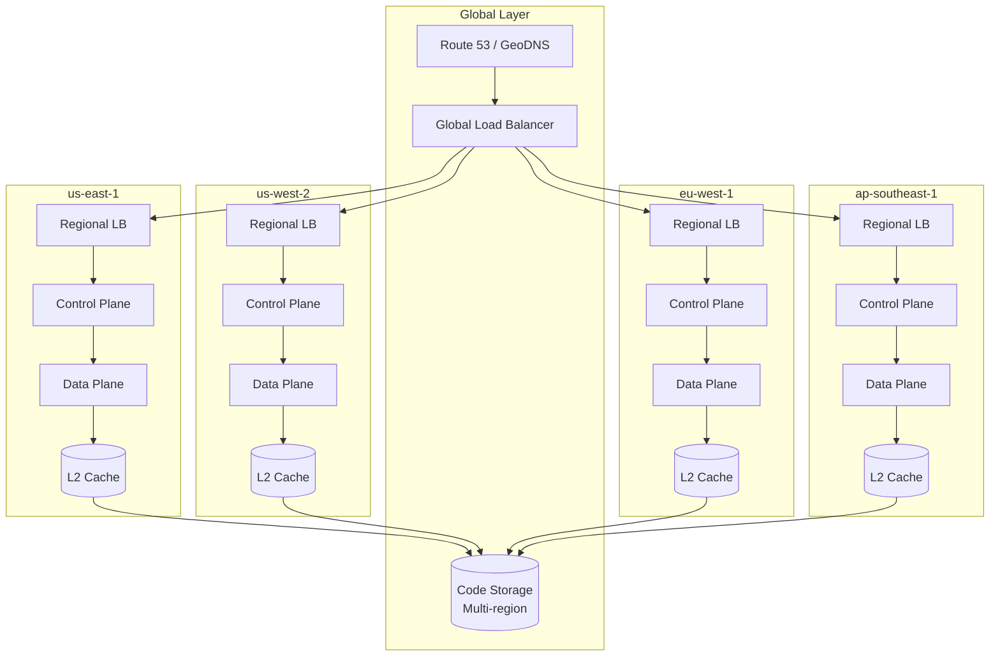

# High-Level Design

[← Back to Index](./00-index.md)

---

## System Architecture

### Control Plane vs Data Plane Overview



### Component Responsibilities

| Component | Layer | Responsibility |
|-----------|-------|---------------|
| **API Gateway** | Control | External API endpoint, authentication, request routing |
| **Function API** | Control | CRUD operations for functions, versions, configurations |
| **Function Registry** | Control | Persistent storage of function metadata and versions |
| **Scaling Controller** | Control | Monitor demand signals, make scaling decisions |
| **Worker Manager** | Control | Coordinate execution environment lifecycle across fleet |
| **Placement Service** | Control | Select optimal worker for each invocation |
| **Warm Pool Manager** | Control | Maintain pre-initialized execution environments |
| **Frontend Workers** | Data | Route invocations, handle sync/async, apply throttling |
| **Worker Fleet** | Data | Execute functions in isolated MicroVM/container sandboxes |
| **Code Storage** | Storage | Durable storage for function packages (multi-region) |
| **Regional Cache (L2)** | Storage | Shared cache for frequently-used function code |
| **Log Aggregator** | Storage | Collect and index function execution logs |

---

## Data Flow

### Synchronous Invocation (HTTP Request)



### Asynchronous Invocation (Queue-based)



### Cold Start vs Warm Start Paths



---

## Key Architectural Decisions

### 1. MicroVM vs Container vs V8 Isolate

| Approach | Security | Cold Start | Languages | Memory | Verdict |
|----------|----------|------------|-----------|--------|---------|
| **MicroVM (Firecracker)** | Strongest (hardware) | ~125ms | Any | ~5 MB overhead | **AWS Lambda** |
| **gVisor** | Strong (syscall filter) | ~50-100ms | Any | Lower than VM | Google Cloud Run |
| **Container** | Moderate (namespace) | ~200-500ms | Any | Variable | OpenFaaS, older platforms |
| **V8 Isolate** | Good (process isolation) | <5ms | JS/WASM | ~1/10th Node.js | **Cloudflare Workers** |

**Rationale:** MicroVMs provide the strongest multi-tenant isolation with acceptable cold start for most workloads. V8 Isolates excel at edge with near-zero cold start but limited to JavaScript/WASM.

### 2. Centralized vs Distributed Placement

| Approach | Pros | Cons | Verdict |
|----------|------|------|---------|
| **Centralized placement** | Global view, optimal decisions, simpler | Scale limits, latency | Hybrid (regional) |
| **Distributed placement** | Lower latency, fault isolated | Suboptimal placement, coordination | Regional cells |

**Rationale:** Use regional placement services that have full view within a region. Cross-region is handled at higher level (GeoDNS, global load balancer).

### 3. Pull vs Push for Event Sources

| Approach | Pros | Cons | Verdict |
|----------|------|------|---------|
| **Pull (polling)** | Backpressure control, batch efficiency | Latency, polling overhead | **Queue sources** |
| **Push (webhook)** | Low latency, simple | No backpressure, need buffering | **HTTP triggers** |

**Rationale:** Queues use pull model for controlled consumption and batching. HTTP uses push for immediate response requirement.

### 4. Warm Pool Strategy

| Strategy | Pros | Cons | Use Case |
|----------|------|------|----------|
| **No warm pool** | Lowest cost | High cold start rate | Infrequent functions |
| **Per-function warm pool** | Best latency | Memory cost | High-traffic functions |
| **Shared warm pool** | Balanced cost/latency | Runtime mismatch possible | Medium traffic |
| **Provisioned concurrency** | Guaranteed warm | Continuous cost | Latency-critical |

**Rationale:** Layered approach - provisioned for latency-critical, per-function warm pools for steady traffic, shared pools for long tail.

### 5. Code Caching Strategy

| Tier | Location | Capacity | Latency | Hit Rate Target |
|------|----------|----------|---------|-----------------|
| **L1** | Worker local | 50 GB | <1ms | 80% (recent) |
| **L2** | Regional shared | 20 TB | <10ms | 95% |
| **L3** | Object storage | Unlimited | 50-200ms | 100% |

**Rationale:** Multi-tier caching minimizes code download latency. L1 for hot functions, L2 for regional popularity, L3 as durable origin.

---

## Architecture Pattern Checklist

- [x] **Sync vs Async:** Both - sync for HTTP, async for queue/event processing
- [x] **Event-driven vs Request-response:** Event-driven internally; request-response for sync invocations
- [x] **Push vs Pull:** Push for HTTP triggers; Pull for queue-based event sources
- [x] **Stateless vs Stateful:** Stateless functions; state externalized to databases/cache
- [x] **Read-heavy vs Write-heavy:** Mixed - heavy writes (logs, metrics); heavy reads (code fetch)
- [x] **Real-time vs Batch:** Real-time invocations; batch for event source polling
- [x] **Leader election:** For scaling controller, placement service coordination

---

## Deployment Topologies

### Single Region



### Multi-Region (Active-Active)



---

## Integration Points

### Event Source Integrations

```
┌─────────────────────────────────────────────────────────────┐
│                     Event Sources                            │
├──────────┬──────────┬──────────┬──────────┬────────────────┤
│   HTTP   │  Queue   │ Storage  │  Stream  │   Scheduled    │
│ (API GW) │  (SQS)   │  (S3)    │ (Kinesis)│    (Cron)      │
└────┬─────┴────┬─────┴────┬─────┴────┬─────┴───────┬────────┘
     │          │          │          │             │
     ▼          ▼          ▼          ▼             ▼
┌─────────────────────────────────────────────────────────────┐
│                   Event Router / Poller                      │
│   - Source-specific adapters                                │
│   - Batching and filtering                                  │
│   - Retry and error handling                                │
└────────────────────────┬────────────────────────────────────┘
                         │
                         ▼
                ┌────────────────┐
                │ Frontend Worker │
                └────────────────┘
```

### Execution Environment Interface

```
Function Invocation → Worker Host → Sandbox Manager
                                          │
                         ┌────────────────┼────────────────┐
                         │                │                │
                         ▼                ▼                ▼
                   Firecracker        gVisor          Container
                    MicroVM         Sandbox           Runtime
                         │                │                │
                         └────────────────┼────────────────┘
                                          │
                                          ▼
                                    ┌──────────┐
                                    │  User    │
                                    │ Function │
                                    │   Code   │
                                    └──────────┘
```

### Observability Integration

```
┌─────────────────────────────────────────────────────────────┐
│                     Function Execution                       │
└──────┬────────────────────┬────────────────────┬────────────┘
       │                    │                    │
       ▼                    ▼                    ▼
  ┌─────────┐         ┌──────────┐        ┌───────────┐
  │  Logs   │         │ Metrics  │        │  Traces   │
  │ stdout  │         │ Duration │        │ Context   │
  │ stderr  │         │ Memory   │        │ Propagate │
  │ custom  │         │ Errors   │        │           │
  └────┬────┘         └────┬─────┘        └─────┬─────┘
       │                   │                    │
       ▼                   ▼                    ▼
  ┌─────────────────────────────────────────────────────────┐
  │              Observability Pipeline                      │
  │  ┌──────────┐    ┌────────────┐    ┌───────────────┐   │
  │  │CloudWatch│    │ Prometheus │    │ X-Ray/Jaeger  │   │
  │  │  Logs    │    │  /Datadog  │    │               │   │
  │  └──────────┘    └────────────┘    └───────────────┘   │
  └─────────────────────────────────────────────────────────┘
```

---

## Failure Modes

| Failure | Impact | Mitigation |
|---------|--------|------------|
| **Frontend worker down** | Partial invocation failures | Multiple frontends behind LB, health checks |
| **Worker host down** | Functions on that host fail | Reschedule to other hosts, warm pool redistribution |
| **Placement service down** | No new cold starts possible | Leader election, fallback to local decisions |
| **Code cache miss** | Slower cold start | Multi-tier caching, prefetching |
| **Control plane unavailable** | No deployments, no scaling changes | Existing functions continue (static stability) |
| **Event source disconnection** | Events not processed | Retry with backoff, DLQ |
| **MicroVM crash** | Single invocation fails | Container restart, new slot allocation |
| **Network partition** | Regional isolation | Multi-AZ within region, cross-region fallback |

**Static Stability:** Data plane continues executing existing functions even if control plane is unavailable. Warm instances serve requests, but no new cold starts or configuration changes until recovery.
