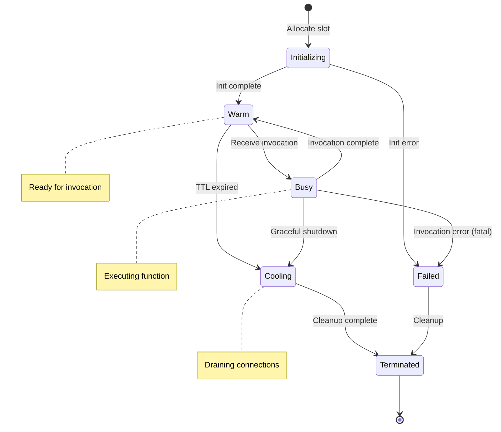
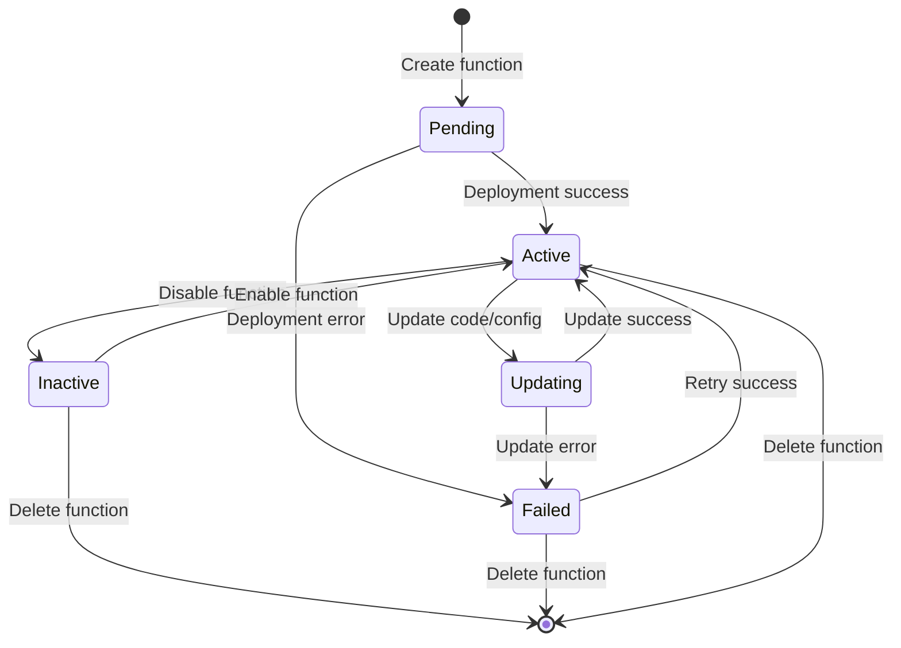

# Low-Level Design

[← Back to Index](./00-index.md)

---

## Data Model

### Core Entities

```
┌─────────────────────────────────────────────────────────────────────────┐
│                           Function                                       │
├─────────────────────────────────────────────────────────────────────────┤
│ function_id: UUID (PK)                                                  │
│ account_id: UUID (FK)                                                   │
│ name: STRING (unique per account)                                       │
│ description: STRING                                                     │
│ runtime: ENUM (nodejs20, python312, go122, java21, dotnet8, custom)    │
│ handler: STRING (e.g., "index.handler")                                │
│ role_arn: STRING (execution IAM role)                                  │
│ created_at: TIMESTAMP                                                   │
│ updated_at: TIMESTAMP                                                   │
│ state: ENUM (ACTIVE, INACTIVE, PENDING, FAILED)                        │
│ code_size_bytes: BIGINT                                                 │
│ last_modified: TIMESTAMP                                                │
└─────────────────────────────────────────────────────────────────────────┘
                                    │
                                    │ 1:N
                                    ▼
┌─────────────────────────────────────────────────────────────────────────┐
│                        FunctionVersion                                   │
├─────────────────────────────────────────────────────────────────────────┤
│ version_id: UUID (PK)                                                   │
│ function_id: UUID (FK)                                                  │
│ version_number: INTEGER (auto-increment per function)                   │
│ code_sha256: STRING (content hash)                                      │
│ code_location: STRING (S3 path)                                         │
│ runtime: ENUM                                                           │
│ handler: STRING                                                         │
│ created_at: TIMESTAMP                                                   │
│ state: ENUM (ACTIVE, DEPRECATED)                                        │
└─────────────────────────────────────────────────────────────────────────┘
                                    │
                                    │ 1:1
                                    ▼
┌─────────────────────────────────────────────────────────────────────────┐
│                     FunctionConfiguration                                │
├─────────────────────────────────────────────────────────────────────────┤
│ config_id: UUID (PK)                                                    │
│ function_id: UUID (FK)                                                  │
│ version_id: UUID (FK, nullable for $LATEST)                            │
│ memory_mb: INTEGER (128-10240)                                          │
│ timeout_seconds: INTEGER (1-900)                                        │
│ ephemeral_storage_mb: INTEGER (512-10240)                              │
│ environment_variables: JSON                                             │
│ vpc_config: JSON (subnet_ids, security_group_ids)                      │
│ reserved_concurrency: INTEGER (nullable)                                │
│ provisioned_concurrency: INTEGER (nullable)                             │
│ layers: ARRAY<STRING> (layer ARNs)                                      │
│ dead_letter_queue: STRING (ARN)                                         │
│ tracing_mode: ENUM (ACTIVE, PASSTHROUGH)                               │
└─────────────────────────────────────────────────────────────────────────┘
```

### Execution Environment Entities

```
┌─────────────────────────────────────────────────────────────────────────┐
│                        WorkerHost                                        │
├─────────────────────────────────────────────────────────────────────────┤
│ host_id: UUID (PK)                                                      │
│ availability_zone: STRING                                               │
│ instance_type: STRING                                                   │
│ total_memory_mb: BIGINT                                                 │
│ available_memory_mb: BIGINT                                             │
│ total_slots: INTEGER                                                    │
│ available_slots: INTEGER                                                │
│ state: ENUM (ACTIVE, DRAINING, MAINTENANCE)                            │
│ last_heartbeat: TIMESTAMP                                               │
│ ip_address: STRING                                                      │
│ agent_version: STRING                                                   │
└─────────────────────────────────────────────────────────────────────────┘
                                    │
                                    │ 1:N
                                    ▼
┌─────────────────────────────────────────────────────────────────────────┐
│                      ExecutionSlot                                       │
├─────────────────────────────────────────────────────────────────────────┤
│ slot_id: UUID (PK)                                                      │
│ host_id: UUID (FK)                                                      │
│ function_id: UUID (FK)                                                  │
│ version_id: UUID (FK)                                                   │
│ state: ENUM (INITIALIZING, WARM, BUSY, COOLING, TERMINATED)            │
│ memory_mb: INTEGER                                                      │
│ created_at: TIMESTAMP                                                   │
│ last_used_at: TIMESTAMP                                                 │
│ invocation_count: INTEGER                                               │
│ microvm_id: STRING                                                      │
│ ip_address: STRING (internal)                                           │
└─────────────────────────────────────────────────────────────────────────┘
```

### Invocation Tracking

```
┌─────────────────────────────────────────────────────────────────────────┐
│                        Invocation                                        │
├─────────────────────────────────────────────────────────────────────────┤
│ request_id: UUID (PK)                                                   │
│ function_id: UUID (FK)                                                  │
│ version_id: UUID (FK)                                                   │
│ account_id: UUID (FK)                                                   │
│ trigger_type: ENUM (HTTP, SQS, S3, SCHEDULED, SDK)                     │
│ start_time: TIMESTAMP                                                   │
│ end_time: TIMESTAMP                                                     │
│ duration_ms: INTEGER                                                    │
│ billed_duration_ms: INTEGER                                             │
│ memory_used_mb: INTEGER                                                 │
│ init_duration_ms: INTEGER (cold start only)                            │
│ status: ENUM (SUCCESS, ERROR, TIMEOUT, THROTTLED)                      │
│ error_type: STRING (nullable)                                           │
│ cold_start: BOOLEAN                                                     │
│ slot_id: UUID (FK)                                                      │
│ trace_id: STRING                                                        │
└─────────────────────────────────────────────────────────────────────────┘
```

### Event Source Mapping

```
┌─────────────────────────────────────────────────────────────────────────┐
│                     EventSourceMapping                                   │
├─────────────────────────────────────────────────────────────────────────┤
│ mapping_id: UUID (PK)                                                   │
│ function_id: UUID (FK)                                                  │
│ event_source_arn: STRING                                                │
│ source_type: ENUM (SQS, KINESIS, DYNAMODB, KAFKA, S3)                  │
│ batch_size: INTEGER                                                     │
│ batch_window_seconds: INTEGER                                           │
│ starting_position: ENUM (TRIM_HORIZON, LATEST, AT_TIMESTAMP)           │
│ enabled: BOOLEAN                                                        │
│ state: ENUM (CREATING, ENABLING, ENABLED, DISABLING, DISABLED)         │
│ parallelization_factor: INTEGER                                         │
│ filter_criteria: JSON                                                   │
│ last_processing_result: STRING                                          │
└─────────────────────────────────────────────────────────────────────────┘
```

---

## API Design

### Function Management APIs

#### Create Function

```
PUT /functions/{function-name}

Request:
{
  "runtime": "nodejs20.x",
  "handler": "index.handler",
  "role": "arn:aws:iam::123456789012:role/lambda-role",
  "code": {
    "s3_bucket": "my-bucket",
    "s3_key": "function.zip",
    "s3_object_version": "abc123"
  },
  "description": "My function description",
  "memory_size": 512,
  "timeout": 30,
  "environment": {
    "variables": {
      "DB_HOST": "database.example.com"
    }
  },
  "vpc_config": {
    "subnet_ids": ["subnet-abc123"],
    "security_group_ids": ["sg-xyz789"]
  }
}

Response: 201 Created
{
  "function_name": "my-function",
  "function_arn": "arn:aws:lambda:us-east-1:123456789012:function:my-function",
  "runtime": "nodejs20.x",
  "handler": "index.handler",
  "code_size": 1024000,
  "code_sha256": "abc123...",
  "version": "$LATEST",
  "state": "Active",
  "last_modified": "2024-01-15T10:30:00Z"
}
```

#### Update Function Code

```
PUT /functions/{function-name}/code

Request:
{
  "s3_bucket": "my-bucket",
  "s3_key": "function-v2.zip",
  "publish": true  // Creates new version
}

Response: 200 OK
{
  "function_name": "my-function",
  "version": "2",
  "code_sha256": "def456...",
  "code_size": 1048576
}
```

#### Publish Version

```
POST /functions/{function-name}/versions

Request:
{
  "description": "Production release v2.1"
}

Response: 201 Created
{
  "version": "3",
  "function_arn": "arn:aws:lambda:...:function:my-function:3"
}
```

### Invocation APIs

#### Synchronous Invoke

```
POST /functions/{function-name}/invocations
X-Invocation-Type: RequestResponse
X-Log-Type: Tail

Request Body: (function payload)
{
  "key1": "value1",
  "key2": "value2"
}

Response: 200 OK
X-Request-Id: abc-123-def
X-Function-Error: (present if error)
X-Log-Result: (base64 last 4KB of logs if X-Log-Type: Tail)

Response Body: (function return value)
{
  "statusCode": 200,
  "body": "Hello, World!"
}
```

#### Asynchronous Invoke

```
POST /functions/{function-name}/invocations
X-Invocation-Type: Event

Request Body: (function payload)

Response: 202 Accepted
X-Request-Id: abc-123-def
```

### Concurrency Management APIs

#### Set Reserved Concurrency

```
PUT /functions/{function-name}/concurrency

Request:
{
  "reserved_concurrent_executions": 100
}

Response: 200 OK
{
  "reserved_concurrent_executions": 100
}
```

#### Configure Provisioned Concurrency

```
PUT /functions/{function-name}/provisioned-concurrency

Request:
{
  "qualifier": "prod",  // Alias or version
  "provisioned_concurrent_executions": 50
}

Response: 202 Accepted
{
  "requested": 50,
  "available": 0,
  "allocated": 0,
  "status": "IN_PROGRESS"
}
```

### Event Source Mapping APIs

#### Create Event Source Mapping

```
POST /event-source-mappings

Request:
{
  "function_name": "my-function",
  "event_source_arn": "arn:aws:sqs:us-east-1:123456789012:my-queue",
  "batch_size": 10,
  "maximum_batching_window_in_seconds": 5,
  "enabled": true
}

Response: 201 Created
{
  "uuid": "mapping-abc123",
  "function_arn": "arn:aws:lambda:...",
  "event_source_arn": "arn:aws:sqs:...",
  "state": "Creating"
}
```

---

## Core Algorithms

### Invocation Routing Algorithm

```
FUNCTION route_invocation(request):
    function_id = request.function_id
    qualifier = request.qualifier  // version, alias, or $LATEST

    // 1. Resolve qualifier to specific version
    IF qualifier == "$LATEST":
        version = get_latest_version(function_id)
    ELSE IF is_alias(qualifier):
        version = resolve_alias(function_id, qualifier)
    ELSE:
        version = qualifier

    // 2. Check concurrency limits
    current_concurrency = get_concurrent_executions(function_id)
    reserved = get_reserved_concurrency(function_id)
    account_limit = get_account_concurrency_limit()

    IF reserved IS NOT NULL AND current_concurrency >= reserved:
        RETURN throttle_response("ReservedConcurrencyExceeded")

    IF current_concurrency >= account_limit:
        RETURN throttle_response("AccountConcurrencyExceeded")

    // 3. Find or create execution slot
    slot = find_warm_slot(function_id, version)

    IF slot IS NULL:
        // Cold start path
        slot = create_execution_slot(function_id, version)
        IF slot IS NULL:
            RETURN throttle_response("NoCapacityAvailable")

    // 4. Route request to slot
    increment_concurrency(function_id)

    TRY:
        response = invoke_slot(slot, request.payload, request.timeout)
        record_invocation_success(request, slot)
        RETURN response
    CATCH timeout_error:
        record_invocation_timeout(request, slot)
        RETURN timeout_response()
    CATCH error:
        record_invocation_error(request, slot, error)
        RETURN error_response(error)
    FINALLY:
        decrement_concurrency(function_id)
        mark_slot_available(slot)
```

### Placement Algorithm

```
FUNCTION select_placement(function_id, version, memory_required):
    config = get_function_config(function_id, version)

    // 1. Get candidate workers
    candidates = get_active_workers()

    // 2. Filter by hard constraints
    feasible = []
    FOR worker IN candidates:
        IF worker.available_memory >= memory_required
           AND worker.available_slots > 0
           AND worker.state == ACTIVE:
            feasible.append(worker)

    IF len(feasible) == 0:
        RETURN NULL  // Trigger capacity expansion

    // 3. Score remaining workers
    scores = {}
    FOR worker IN feasible:
        score = 0

        // Locality score: prefer workers with cached code
        IF has_cached_code(worker, function_id, version):
            score += 100

        // Warm slot score: prefer workers with warm slots for this function
        warm_slots = count_warm_slots(worker, function_id, version)
        score += warm_slots * 50

        // Load balance score: prefer less loaded workers
        utilization = worker.used_memory / worker.total_memory
        score += (1 - utilization) * 30

        // Spread score: avoid hotspots
        function_concentration = count_slots_for_function(worker, function_id)
        score -= function_concentration * 10

        // AZ balance: prefer spreading across AZs
        IF is_underrepresented_az(worker.availability_zone, function_id):
            score += 20

        scores[worker] = score

    // 4. Select highest scoring worker
    selected = max(scores, key=lambda w: scores[w])

    // 5. Reserve capacity
    reserve_slot(selected, function_id, version, memory_required)

    RETURN selected
```

### Cold Start Initialization Sequence

```
FUNCTION initialize_execution_slot(worker, function_id, version):
    config = get_function_config(function_id, version)

    start_time = now()

    // 1. Allocate MicroVM slot on worker
    slot = allocate_microvm_slot(worker, config.memory_mb)
    slot.state = INITIALIZING

    // 2. Start MicroVM (Firecracker)
    microvm_config = {
        memory_mb: config.memory_mb,
        vcpu_count: calculate_vcpu(config.memory_mb),
        kernel: get_kernel_for_runtime(config.runtime),
        rootfs: get_rootfs_for_runtime(config.runtime)
    }

    microvm = start_firecracker(worker, microvm_config)
    slot.microvm_id = microvm.id

    boot_duration = now() - start_time  // ~125ms

    // 3. Fetch function code (multi-tier cache)
    code_start = now()
    code_package = fetch_code_with_cache(function_id, version, worker)
    code_duration = now() - code_start  // ~50-200ms

    // 4. Initialize runtime
    runtime_start = now()
    runtime_init(microvm, config.runtime, config.handler)
    runtime_duration = now() - runtime_start  // ~50-500ms

    // 5. Inject environment and configuration
    inject_environment(microvm, config.environment_variables)
    inject_aws_credentials(microvm, get_temp_credentials(config.role_arn))

    // 6. Run user initialization code
    init_start = now()
    user_init_result = run_user_init(microvm, code_package)
    init_duration = now() - init_start  // Variable

    IF user_init_result.error:
        terminate_slot(slot)
        RETURN error("InitializationFailed", user_init_result.error)

    // 7. Mark slot as warm
    slot.state = WARM
    slot.created_at = now()
    total_init_time = now() - start_time

    record_cold_start_metrics(function_id, {
        boot: boot_duration,
        code_fetch: code_duration,
        runtime: runtime_duration,
        user_init: init_duration,
        total: total_init_time
    })

    RETURN slot

FUNCTION fetch_code_with_cache(function_id, version, worker):
    code_hash = get_code_hash(function_id, version)

    // L1: Check worker local cache
    IF worker_cache_contains(worker, code_hash):
        record_cache_hit("L1")
        RETURN worker_cache_get(worker, code_hash)

    // L2: Check regional shared cache
    IF regional_cache_contains(code_hash):
        record_cache_hit("L2")
        code = regional_cache_get(code_hash)
        worker_cache_put(worker, code_hash, code)
        RETURN code

    // L3: Fetch from origin (S3)
    record_cache_miss()
    code_location = get_code_location(function_id, version)
    code = download_from_s3(code_location)

    // Populate caches
    regional_cache_put(code_hash, code)
    worker_cache_put(worker, code_hash, code)

    RETURN code
```

### Warm Pool Management Algorithm

```
FUNCTION manage_warm_pool():
    // Run periodically (e.g., every 10 seconds)

    FOR EACH function IN get_active_functions():
        config = get_warm_pool_config(function.id)

        IF config.provisioned_concurrency > 0:
            maintain_provisioned_concurrency(function, config)
        ELSE:
            maintain_dynamic_warm_pool(function)

FUNCTION maintain_provisioned_concurrency(function, config):
    target = config.provisioned_concurrency
    current_warm = count_warm_slots(function.id)
    current_busy = count_busy_slots(function.id)
    total = current_warm + current_busy

    IF total < target:
        // Need to provision more slots
        deficit = target - total
        FOR i IN range(deficit):
            worker = select_placement(function.id, function.version, function.memory)
            IF worker:
                spawn_async(initialize_execution_slot, worker, function.id, function.version)

    ELSE IF current_warm > target - current_busy:
        // Too many warm slots (traffic decreased)
        excess = current_warm - (target - current_busy)
        slots_to_terminate = select_oldest_warm_slots(function.id, excess)
        FOR slot IN slots_to_terminate:
            graceful_terminate(slot)

FUNCTION maintain_dynamic_warm_pool(function):
    // Predictive warming based on historical patterns
    predicted_demand = predict_demand(function.id, lookahead=5_minutes)
    current_warm = count_warm_slots(function.id)
    current_busy = count_busy_slots(function.id)

    // Target: enough warm slots for predicted demand + buffer
    buffer_factor = 1.2
    target_warm = max(0, (predicted_demand * buffer_factor) - current_busy)

    IF current_warm < target_warm:
        // Pre-warm additional slots
        to_warm = min(target_warm - current_warm, MAX_PREDICTIVE_WARM)
        FOR i IN range(to_warm):
            worker = select_placement(function.id, function.version, function.memory)
            IF worker:
                spawn_async(initialize_execution_slot, worker, function.id, function.version)

    // Expire idle warm slots (keep-alive timeout)
    FOR slot IN get_warm_slots(function.id):
        idle_time = now() - slot.last_used_at
        IF idle_time > WARM_SLOT_TTL:
            terminate_slot(slot)
```

### Scaling Decision Algorithm

```
FUNCTION scaling_controller_loop():
    // Run continuously

    WHILE true:
        FOR EACH function IN get_functions_with_activity():
            make_scaling_decision(function)

        check_account_limits()
        sleep(SCALING_INTERVAL)  // e.g., 1 second

FUNCTION make_scaling_decision(function):
    metrics = get_recent_metrics(function.id, window=60_seconds)

    current_concurrency = metrics.current_concurrent_executions
    avg_concurrency = metrics.avg_concurrent_executions
    peak_concurrency = metrics.peak_concurrent_executions
    throttle_count = metrics.throttle_count
    cold_start_rate = metrics.cold_starts / metrics.total_invocations

    warm_slots = count_warm_slots(function.id)
    busy_slots = count_busy_slots(function.id)

    // Scale up if throttling or high cold start rate
    IF throttle_count > 0 OR cold_start_rate > COLD_START_THRESHOLD:
        scale_up_target = calculate_scale_up(function, metrics)
        provision_additional_slots(function, scale_up_target)

    // Scale down if over-provisioned
    IF warm_slots > 0 AND avg_concurrency < (busy_slots + warm_slots) * 0.5:
        scale_down_target = calculate_scale_down(function, metrics)
        terminate_excess_slots(function, scale_down_target)

FUNCTION calculate_scale_up(function, metrics):
    // Burst scaling: rapid scale-up for sudden traffic
    IF metrics.throttle_count > 0:
        immediate_need = metrics.peak_concurrent_executions * 1.5
        RETURN min(immediate_need, BURST_LIMIT)

    // Gradual scaling based on growth trend
    growth_rate = calculate_growth_rate(metrics)
    projected_demand = metrics.avg_concurrent_executions * (1 + growth_rate)

    RETURN projected_demand

FUNCTION handle_burst_scaling(function, burst_request_count):
    // Handle sudden traffic spike

    // Check burst capacity
    available_burst = get_available_burst_capacity(function.account_id)

    IF burst_request_count > available_burst:
        // Throttle excess requests
        throttle_count = burst_request_count - available_burst
        record_throttles(function.id, throttle_count)
        burst_request_count = available_burst

    // Rapid parallel cold starts (up to burst limit)
    parallel_starts = min(burst_request_count, BURST_CONCURRENCY_LIMIT)

    FOR i IN range(parallel_starts):
        spawn_async(initialize_execution_slot, function.id)

    // Apply sustained scaling rate for remainder
    remaining = burst_request_count - parallel_starts
    IF remaining > 0:
        queue_for_gradual_scaling(function, remaining)
```

---

## State Machine Diagrams

### Execution Slot Lifecycle



### Function Deployment Lifecycle



---

## Database Schema

### PostgreSQL Schema (Control Plane)

```sql
-- Functions table
CREATE TABLE functions (
    function_id UUID PRIMARY KEY DEFAULT gen_random_uuid(),
    account_id UUID NOT NULL,
    name VARCHAR(64) NOT NULL,
    description TEXT,
    runtime VARCHAR(32) NOT NULL,
    handler VARCHAR(128) NOT NULL,
    role_arn VARCHAR(256) NOT NULL,
    state VARCHAR(16) NOT NULL DEFAULT 'PENDING',
    created_at TIMESTAMP WITH TIME ZONE DEFAULT NOW(),
    updated_at TIMESTAMP WITH TIME ZONE DEFAULT NOW(),
    UNIQUE(account_id, name)
);

CREATE INDEX idx_functions_account ON functions(account_id);
CREATE INDEX idx_functions_state ON functions(state);

-- Function versions
CREATE TABLE function_versions (
    version_id UUID PRIMARY KEY DEFAULT gen_random_uuid(),
    function_id UUID NOT NULL REFERENCES functions(function_id),
    version_number INTEGER NOT NULL,
    code_sha256 VARCHAR(64) NOT NULL,
    code_location VARCHAR(512) NOT NULL,
    code_size_bytes BIGINT NOT NULL,
    runtime VARCHAR(32) NOT NULL,
    handler VARCHAR(128) NOT NULL,
    state VARCHAR(16) NOT NULL DEFAULT 'ACTIVE',
    created_at TIMESTAMP WITH TIME ZONE DEFAULT NOW(),
    UNIQUE(function_id, version_number)
);

CREATE INDEX idx_versions_function ON function_versions(function_id);

-- Function configurations
CREATE TABLE function_configs (
    config_id UUID PRIMARY KEY DEFAULT gen_random_uuid(),
    function_id UUID NOT NULL REFERENCES functions(function_id),
    version_id UUID REFERENCES function_versions(version_id),
    memory_mb INTEGER NOT NULL DEFAULT 128,
    timeout_seconds INTEGER NOT NULL DEFAULT 3,
    ephemeral_storage_mb INTEGER NOT NULL DEFAULT 512,
    environment_variables JSONB DEFAULT '{}',
    vpc_config JSONB,
    reserved_concurrency INTEGER,
    provisioned_concurrency INTEGER,
    layers TEXT[],
    dead_letter_queue VARCHAR(256),
    tracing_mode VARCHAR(16) DEFAULT 'PASSTHROUGH',
    updated_at TIMESTAMP WITH TIME ZONE DEFAULT NOW()
);

-- Event source mappings
CREATE TABLE event_source_mappings (
    mapping_id UUID PRIMARY KEY DEFAULT gen_random_uuid(),
    function_id UUID NOT NULL REFERENCES functions(function_id),
    event_source_arn VARCHAR(256) NOT NULL,
    source_type VARCHAR(32) NOT NULL,
    batch_size INTEGER DEFAULT 10,
    batch_window_seconds INTEGER DEFAULT 0,
    starting_position VARCHAR(32),
    enabled BOOLEAN DEFAULT true,
    state VARCHAR(16) DEFAULT 'CREATING',
    parallelization_factor INTEGER DEFAULT 1,
    filter_criteria JSONB,
    created_at TIMESTAMP WITH TIME ZONE DEFAULT NOW(),
    updated_at TIMESTAMP WITH TIME ZONE DEFAULT NOW()
);
```

### Redis Schema (Data Plane State)

```
# Warm slot tracking (per function per region)
HSET warm_slots:{function_id} {slot_id} {worker_host_id}:{memory_mb}:{last_used_ts}

# Concurrency counters (atomic operations)
INCR concurrency:{function_id}
DECR concurrency:{function_id}
GET concurrency:{function_id}

# Account-level concurrency
INCR account_concurrency:{account_id}
DECR account_concurrency:{account_id}

# Worker host state
HSET worker:{host_id} available_memory {value}
HSET worker:{host_id} available_slots {value}
HSET worker:{host_id} state {value}

# Code cache metadata
HSET code_cache:{code_hash} size {bytes}
HSET code_cache:{code_hash} last_accessed {timestamp}
ZADD code_cache_lru {timestamp} {code_hash}

# Rate limiting
INCR throttle:{function_id}:{minute}
EXPIRE throttle:{function_id}:{minute} 120
```
