# Deep Dive & Bottleneck Analysis

[← Back to Index](./00-index.md)

---

## Critical Component Deep Dives

### Deep Dive 1: Cold Start Optimization

#### Why This Is Critical

Cold starts are the defining challenge of serverless architecture. When a function has no warm execution environment available, the platform must:
1. Allocate compute resources
2. Boot the execution sandbox
3. Download and extract function code
4. Initialize the language runtime
5. Execute user initialization code

This process can take 100ms to 10+ seconds depending on runtime, package size, and VPC configuration. For latency-sensitive applications, cold starts can violate SLAs and degrade user experience.

**Real-world Impact:**
- API endpoints: Users perceive latency > 300ms as "slow"
- Payment processing: Cold start during checkout causes abandonment
- Real-time processing: Event processing delays can cascade

#### Cold Start Breakdown

```mermaid
gantt
    title Cold Start Timeline (Node.js Example)
    dateFormat X
    axisFormat %L ms

    section Infrastructure
    Slot Allocation       :a1, 0, 10
    MicroVM Boot         :a2, after a1, 125

    section Code Loading
    Code Download (cached)  :b1, after a2, 30
    Code Extraction        :b2, after b1, 20

    section Runtime
    Node.js Init         :c1, after b2, 50
    Module Loading       :c2, after c1, 30

    section User Code
    Global Scope Execution :d1, after c2, 50
    Handler Ready         :milestone, m1, after d1, 0
```



**Typical Cold Start Components:**

| Component | Duration | Variability | Optimization Potential |
|-----------|----------|-------------|----------------------|
| Slot allocation | 5-20ms | Low | Pre-allocated pools |
| MicroVM boot (Firecracker) | 100-150ms | Low | Snapshot restore |
| Code download | 10-500ms | High (size, cache) | Multi-tier caching |
| Runtime initialization | 50-500ms | Medium (runtime) | Lightweight runtimes |
| User init code | 0-10,000ms | Very high | Lazy loading |
| VPC ENI attachment | 500-2000ms | High | VPC optimization |

#### Optimization Strategies

**1. Provisioned Concurrency**

```
CONCEPT: Pre-initialize N execution environments that stay warm continuously

TRADE-OFF:
- Cost: Pay for provisioned slots even when idle
- Latency: Guaranteed sub-10ms for provisioned traffic
- Use case: Latency-sensitive, predictable traffic

IMPLEMENTATION:
- Maintain dedicated warm pool per function/version
- Health checks to ensure slots are ready
- Automatic replacement of unhealthy slots
- Billed per GB-hour provisioned (not invocations)
```

**2. SnapStart (Checkpoint/Restore)**

```
CONCEPT: Snapshot MicroVM state after initialization, restore instead of cold boot

PROCESS:
1. Cold start function once during deployment
2. Run through user init code (imports, connections)
3. Capture memory snapshot (Firecracker snapshot)
4. On invocation, restore from snapshot (~100ms vs 500ms+)

CONSTRAINTS:
- State must be restorable (uniqueness, connections)
- Need hooks for re-initialization (restore hooks)
- Snapshot storage overhead
- Currently Java-focused (SnapStart)

PSEUDOCODE:
FUNCTION create_snapshot(function_id, version):
    slot = cold_start_function(function_id, version)
    execute_until_handler_registration(slot)

    // Checkpoint at this point
    snapshot = capture_microvm_snapshot(slot)
    store_snapshot(function_id, version, snapshot)

FUNCTION restore_from_snapshot(function_id, version, worker):
    snapshot = fetch_snapshot(function_id, version)
    slot = restore_microvm_from_snapshot(worker, snapshot)

    // Run restore hooks
    trigger_restore_hooks(slot)

    RETURN slot  // Ready in ~100ms instead of 1-5s
```

**3. Multi-Tier Code Caching**

```
L1 CACHE (Worker Local):
- Location: Local SSD on each worker host
- Capacity: 50-100 GB per worker
- Latency: <1ms
- Eviction: LRU based on access time
- Hit rate target: 80%+

L2 CACHE (Regional Shared):
- Location: Distributed cache cluster (memcached/redis)
- Capacity: 10-50 TB per region
- Latency: 1-10ms
- Eviction: LRU with popularity weighting
- Hit rate target: 95%+

L3 ORIGIN (Object Storage):
- Location: S3/GCS with cross-region replication
- Capacity: Unlimited
- Latency: 50-200ms
- Always available (100% hit rate)
```

**4. Predictive Warming**

```
CONCEPT: Use ML to predict demand and pre-warm slots

SIGNALS:
- Historical invocation patterns (time of day, day of week)
- Upstream event correlation (API calls → function calls)
- Scheduled events
- Recent traffic trends

ALGORITHM:
FUNCTION predictive_warming_loop():
    FOR EACH function IN active_functions:
        features = extract_features(function)
        predicted_demand = ml_model.predict(features, horizon=5_minutes)

        current_capacity = count_warm_slots(function) + count_busy_slots(function)
        gap = predicted_demand - current_capacity

        IF gap > WARMING_THRESHOLD:
            slots_to_warm = min(gap * CONFIDENCE_FACTOR, MAX_PREDICTIVE_WARM)
            schedule_pre_warming(function, slots_to_warm)
```

**5. Lightweight Runtime Optimization**

| Approach | Description | Cold Start Impact |
|----------|-------------|-------------------|
| Minimal base image | Remove unused packages | -50-200ms |
| Static compilation (Go) | No runtime initialization | -100-300ms |
| GraalVM native (Java) | AOT compilation | -1-3 seconds |
| Lazy module loading | Import on first use | Variable |
| Connection pooling | Reuse DB connections across invocations | Reduces re-init |

#### Cold Start Trade-offs Summary

```
Cost ←―――――――――――――――――――――――→ Latency
  ↑                                ↑
On-demand only              Provisioned concurrency
$0 baseline                 $$$ continuous cost
Variable cold starts        Guaranteed warm
(Development/low traffic)   (Production/latency-critical)

Code Size ←――――――――――――――――→ Functionality
    ↑                            ↑
Minimal package              Full dependencies
Fast download                Slow download
Limited features             All features
(Lambda layers for shared)   (Container images)
```

---

### Deep Dive 2: Execution Sandbox (Firecracker MicroVM)

#### Why This Is Critical

Multi-tenant serverless platforms run untrusted code from thousands of different customers on shared infrastructure. The execution sandbox must:
1. Prevent tenant code from accessing other tenants' data
2. Prevent tenant code from affecting host system
3. Prevent resource exhaustion attacks
4. Minimize overhead to keep costs low

Traditional containers (Docker) provide namespace isolation but share the kernel, creating potential attack surface. MicroVMs provide hardware-level isolation with VM benefits while maintaining container-like density.

#### Firecracker Architecture

```
┌─────────────────────────────────────────────────────────────────┐
│                      Worker Host (Bare Metal)                    │
│  ┌─────────────────────────────────────────────────────────────┐│
│  │                         Host Kernel (Linux)                  ││
│  │                              │                               ││
│  │                         ┌────┴────┐                         ││
│  │                         │   KVM   │                         ││
│  │                         └────┬────┘                         ││
│  └─────────────────────────────┼────────────────────────────────┘│
│                                │                                  │
│  ┌──────────────┬──────────────┼──────────────┬──────────────┐  │
│  │              │              │              │              │  │
│  │  MicroVM 1   │  MicroVM 2   │  MicroVM 3   │  MicroVM N   │  │
│  │ ┌──────────┐ │ ┌──────────┐ │ ┌──────────┐ │ ┌──────────┐ │  │
│  │ │ Guest    │ │ │ Guest    │ │ │ Guest    │ │ │ Guest    │ │  │
│  │ │ Kernel   │ │ │ Kernel   │ │ │ Kernel   │ │ │ Kernel   │ │  │
│  │ ├──────────┤ │ ├──────────┤ │ ├──────────┤ │ ├──────────┤ │  │
│  │ │ Runtime  │ │ │ Runtime  │ │ │ Runtime  │ │ │ Runtime  │ │  │
│  │ │ (Node.js)│ │ │ (Python) │ │ │ (Go)     │ │ │ (Java)   │ │  │
│  │ ├──────────┤ │ ├──────────┤ │ ├──────────┤ │ ├──────────┤ │  │
│  │ │ Function │ │ │ Function │ │ │ Function │ │ │ Function │ │  │
│  │ │   Code   │ │ │   Code   │ │ │   Code   │ │ │   Code   │ │  │
│  │ └──────────┘ │ └──────────┘ │ └──────────┘ │ └──────────┘ │  │
│  │   128 MB     │   256 MB     │   512 MB     │   1024 MB    │  │
│  └──────────────┴──────────────┴──────────────┴──────────────┘  │
│                                                                  │
│  ┌─────────────────────────────────────────────────────────────┐│
│  │                    Firecracker VMM Process                   ││
│  │  - Minimal device model (virtio-net, virtio-block)          ││
│  │  - <5 MiB memory overhead per VM                            ││
│  │  - Rate limiters for I/O and network                        ││
│  │  - API for VM lifecycle management                          ││
│  └─────────────────────────────────────────────────────────────┘│
│                                                                  │
│  ┌─────────────────────────────────────────────────────────────┐│
│  │                        Jailer                                ││
│  │  - chroot for Firecracker process                           ││
│  │  - seccomp filters (limited syscalls)                       ││
│  │  - cgroups for resource limits                              ││
│  │  - Namespace isolation                                      ││
│  └─────────────────────────────────────────────────────────────┘│
└──────────────────────────────────────────────────────────────────┘
```

#### Isolation Layers

**Layer 1: Hardware Virtualization (KVM)**
```
- Each MicroVM has its own virtual CPU, memory, devices
- Guest cannot access host memory (hardware MMU)
- Guest cannot access other VM memory
- CPU vulnerabilities (Spectre) mitigated via microcode + isolation
```

**Layer 2: Minimal Virtual Machine Monitor (VMM)**
```
- Firecracker is purpose-built for serverless (~50K lines of Rust)
- Minimal attack surface (no legacy device emulation)
- Only virtio-net, virtio-block, serial console, keyboard
- No graphics, USB, or other unnecessary devices
```

**Layer 3: Jailer (Defense in Depth)**
```
- chroot: Firecracker process sees limited filesystem
- seccomp: Only ~25 allowed syscalls (vs ~300+ in kernel)
- cgroups: CPU, memory, I/O limits enforced
- namespaces: Network, PID, mount isolation

SECCOMP ALLOWLIST (subset):
- read, write, close, fstat
- mmap, mprotect, munmap
- ioctl (KVM-specific subset)
- futex, nanosleep
- exit_group
```

**Layer 4: Network Isolation**
```
- Each MicroVM gets dedicated TAP device
- Firewall rules prevent VM-to-VM communication
- Outbound traffic through NAT gateway
- No direct internet access without explicit config
```

#### Performance Characteristics

| Metric | Firecracker | Traditional VM | Container |
|--------|-------------|----------------|-----------|
| Boot time | ~125ms | 3-30 seconds | ~200-500ms |
| Memory overhead | <5 MiB | 100+ MiB | ~10-50 MiB |
| Density (128MB VMs) | 1000+/host | ~50-100/host | ~500/host |
| Isolation strength | Strong (hardware) | Strong (hardware) | Medium (kernel) |
| Syscall overhead | ~2-5% | Similar | Minimal |

#### Security Considerations

**Attack Surface Minimization:**
```
TRADITIONAL VM: QEMU has ~1.4M lines of code, extensive device emulation
FIRECRACKER: ~50K lines of Rust, minimal device model

Reduced code = Reduced vulnerabilities
```

**Container Escape Protection:**
```
Even if guest kernel is compromised:
- Cannot access host kernel (hardware boundary)
- Cannot access host filesystem (chroot)
- Cannot make arbitrary syscalls (seccomp)
- Cannot exceed resource allocation (cgroups)
```

---

### Deep Dive 3: Placement and Scheduling

#### Why This Is Critical

Placement decisions directly impact:
- **Cold start probability**: Place on hosts with cached code
- **Locality**: Co-locate related functions for lower network latency
- **Resource efficiency**: Bin-pack to reduce wasted capacity
- **Availability**: Spread across failure domains
- **Cost**: Maximize utilization of provisioned infrastructure

#### Placement Algorithm Deep Dive

```
FUNCTION advanced_placement(function_id, version, memory_required):
    // 1. Build candidate set
    all_workers = get_healthy_workers()

    // 2. Apply hard constraints (filters)
    candidates = []
    FOR worker IN all_workers:
        IF passes_hard_constraints(worker, memory_required):
            candidates.append(worker)

    IF len(candidates) == 0:
        trigger_capacity_expansion()
        RETURN wait_for_capacity()

    // 3. Score candidates (multi-factor)
    scores = []
    FOR worker IN candidates:
        score = compute_placement_score(worker, function_id, version, memory_required)
        scores.append((worker, score))

    // 4. Select with weighted randomization (avoid thundering herd)
    selected = weighted_random_select(scores)

    // 5. Optimistic reservation
    IF NOT try_reserve(selected, function_id, memory_required):
        // Retry with next best candidate
        RETURN advanced_placement(function_id, version, memory_required)

    RETURN selected

FUNCTION passes_hard_constraints(worker, memory_required):
    // Must have sufficient memory
    IF worker.available_memory < memory_required:
        RETURN false

    // Must have available slot
    IF worker.available_slots <= 0:
        RETURN false

    // Must be in active state
    IF worker.state != ACTIVE:
        RETURN false

    // Must be healthy (recent heartbeat)
    IF now() - worker.last_heartbeat > HEARTBEAT_TIMEOUT:
        RETURN false

    RETURN true

FUNCTION compute_placement_score(worker, function_id, version, memory_required):
    score = 0.0
    weights = get_placement_weights()  // Configurable per function/account

    // Factor 1: Code locality (highest weight)
    // Prefer workers that already have the code cached
    IF has_code_in_l1_cache(worker, function_id, version):
        score += weights.code_locality * 1.0
    ELIF has_code_in_l2_cache_nearby(worker):
        score += weights.code_locality * 0.5

    // Factor 2: Warm slot availability
    // Prefer workers with existing warm slots for this function
    warm_count = count_warm_slots_on_worker(worker, function_id, version)
    IF warm_count > 0:
        score += weights.warm_slots * min(warm_count / 3.0, 1.0)

    // Factor 3: Load balancing
    // Prefer workers with more available resources
    utilization = 1.0 - (worker.available_memory / worker.total_memory)
    score += weights.load_balance * (1.0 - utilization)

    // Factor 4: Spreading
    // Avoid concentration of single function on one worker
    function_concentration = count_slots_for_function(worker, function_id) / worker.total_slots
    score -= weights.spreading * function_concentration

    // Factor 5: AZ distribution
    // Prefer underrepresented AZs for availability
    az_distribution = get_az_distribution(function_id)
    IF az_distribution[worker.az] < average(az_distribution.values()):
        score += weights.az_balance * 0.5

    // Factor 6: Bin packing (for cost optimization)
    // Slight preference for fuller workers (consolidation)
    IF utilization > 0.6:
        score += weights.bin_packing * 0.2

    RETURN score
```

#### ML-Based Placement (Advanced)

```
CONCEPT: Use machine learning to optimize placement decisions

FEATURES:
- Historical cold start times for this function
- Worker load patterns over time
- Network topology (same rack, same AZ)
- Time of day / day of week patterns
- Function invocation patterns

MODEL:
- Input: (function_id, candidate_workers, current_state)
- Output: Probability of low-latency execution for each worker
- Training: Historical invocation data with actual latencies

IMPLEMENTATION:
FUNCTION ml_enhanced_placement(function_id, version, memory_required):
    candidates = get_filtered_candidates(memory_required)

    // Generate features for each candidate
    feature_matrix = []
    FOR worker IN candidates:
        features = extract_features(function_id, worker)
        feature_matrix.append(features)

    // Get model predictions
    latency_predictions = ml_model.predict(feature_matrix)

    // Combine with rule-based scoring
    final_scores = []
    FOR i, worker IN enumerate(candidates):
        rule_score = compute_placement_score(worker, function_id, version, memory_required)
        ml_score = 1.0 / (1.0 + latency_predictions[i])  // Lower latency = higher score

        combined = ML_WEIGHT * ml_score + (1 - ML_WEIGHT) * rule_score
        final_scores.append((worker, combined))

    RETURN weighted_random_select(final_scores)
```

---

## Bottleneck Analysis

### Bottleneck 1: Burst Scaling Limits

**Problem:** Sudden traffic spikes exceed the rate at which new execution environments can be created.

**Symptoms:**
- Throttling (429 errors) during traffic spikes
- Cold start queuing
- SLA violations for latency

**Root Causes:**
- MicroVM boot time (~125ms minimum)
- Code download for new functions
- API server rate limits for slot allocation
- Worker capacity exhaustion

**Mitigations:**

| Strategy | Effectiveness | Cost | Implementation |
|----------|--------------|------|----------------|
| Provisioned concurrency | High | High | Pre-warm dedicated slots |
| Burst capacity pools | Medium | Medium | Reserve capacity for bursts |
| Faster cold starts | Medium | Low | SnapStart, lighter runtimes |
| Traffic shaping | Low | Low | Rate limit with queue spillover |

```
BURST SCALING BEHAVIOR:

Initial burst: 500-3000 concurrent (region dependent)
Sustained scaling: +500 instances/minute after burst

EXAMPLE:
- Function at 0 concurrent
- 10,000 requests arrive simultaneously
- First 1000 served (burst capacity)
- 9000 requests queued or throttled
- +500/minute until demand met
- Total time to 10K capacity: ~18 minutes
```

### Bottleneck 2: Code Package Download Latency

**Problem:** Large function packages or cache misses cause slow cold starts.

**Symptoms:**
- Cold start times 500ms-5s (vs 200ms target)
- High variance in cold start latency
- Degraded performance for new deployments

**Root Causes:**
- Package size (10MB+ common with dependencies)
- Cache miss rate
- Network bandwidth to storage
- Decompression time

**Mitigations:**

| Strategy | Impact | Effort |
|----------|--------|--------|
| Multi-tier caching (L1/L2/L3) | High | Medium |
| Dependency layers (shared) | High | Low |
| Code minification/tree-shaking | Medium | Medium |
| Lazy loading | Medium | Low (code change) |
| Pre-warming on deploy | Medium | Low |

### Bottleneck 3: VPC Cold Start Penalty

**Problem:** Functions needing VPC access (private databases) have significantly longer cold starts due to ENI attachment.

**Symptoms:**
- Cold starts 1-10 seconds (vs <500ms without VPC)
- Unpredictable delays
- Timeouts during scaling

**Root Causes:**
- ENI (Elastic Network Interface) creation: 1-3 seconds
- Security group rule application
- Route table configuration
- IP address allocation from subnet

**Mitigations:**

| Strategy | Impact | Trade-off |
|----------|--------|-----------|
| Hyperplane (AWS) | High | Platform-level optimization |
| Provisioned concurrency | High | Continuous cost |
| VPC endpoint caching | Medium | Complexity |
| Larger subnets | Low | IP planning |

```
VPC COLD START BREAKDOWN:

Without VPC:
[MicroVM: 125ms][Code: 50ms][Runtime: 100ms] = ~275ms

With VPC (traditional):
[MicroVM: 125ms][ENI: 2000ms][Code: 50ms][Runtime: 100ms] = ~2275ms

With VPC (Hyperplane optimization):
[MicroVM: 125ms][Hyperplane: 100ms][Code: 50ms][Runtime: 100ms] = ~375ms
```

### Bottleneck 4: Worker Fleet Capacity

**Problem:** Insufficient worker hosts to handle peak demand.

**Symptoms:**
- Widespread throttling
- All functions affected
- Scaling controller overwhelmed

**Root Causes:**
- Under-provisioned infrastructure
- Unexpected traffic patterns
- Cascading failures
- AZ outage

**Mitigations:**

| Strategy | Effectiveness | Lead Time |
|----------|--------------|-----------|
| Capacity planning | Preventive | Days-weeks |
| Auto-scaling worker fleet | Reactive | Minutes |
| Multi-region overflow | Reactive | Seconds |
| Reserved capacity | Preventive | Immediate |

### Bottleneck 5: Event Source Throughput

**Problem:** Event source polling can't keep up with event production rate.

**Symptoms:**
- Event processing lag
- Queue depth growing
- Processing delays

**Root Causes:**
- Polling frequency limits
- Batch size constraints
- Function processing time
- Concurrency limits

**Mitigations:**

```
SCALING EVENT PROCESSING:

parallelization_factor = min(
    event_rate / (batch_size * invocations_per_second),
    MAX_PARALLELIZATION  // typically 10
)

EXAMPLE:
- Event rate: 10,000/second
- Batch size: 10
- Function processing: 100ms
- Invocations/second per poller: 10

parallelization_factor = 10,000 / (10 * 10) = 100
Capped at MAX_PARALLELIZATION = 10 pollers
Actual throughput: 10 * 10 * 10 = 1000/second

MITIGATION: Enable reserved concurrency, increase batch size,
optimize function performance
```

---

## Performance Tuning Recommendations

### Function-Level Optimizations

| Area | Recommendation | Impact |
|------|---------------|--------|
| Memory | Start at 256MB, tune based on duration | -30-50% cost |
| Package size | Use layers, remove unused deps | -100-500ms cold start |
| Initialization | Move to handler (lazy), use connection pooling | -200-2000ms cold start |
| Runtime | Use compiled languages for latency-critical | -50-200ms overhead |

### Platform-Level Optimizations

| Area | Recommendation | Impact |
|------|---------------|--------|
| Provisioned concurrency | For p99 < 100ms requirement | Eliminates cold starts |
| Reserved concurrency | Prevent noisy neighbor throttling | Predictable capacity |
| VPC | Avoid unless necessary; use VPC endpoints | -1-5s cold start |
| Layers | Share common dependencies | Reduce package size |
