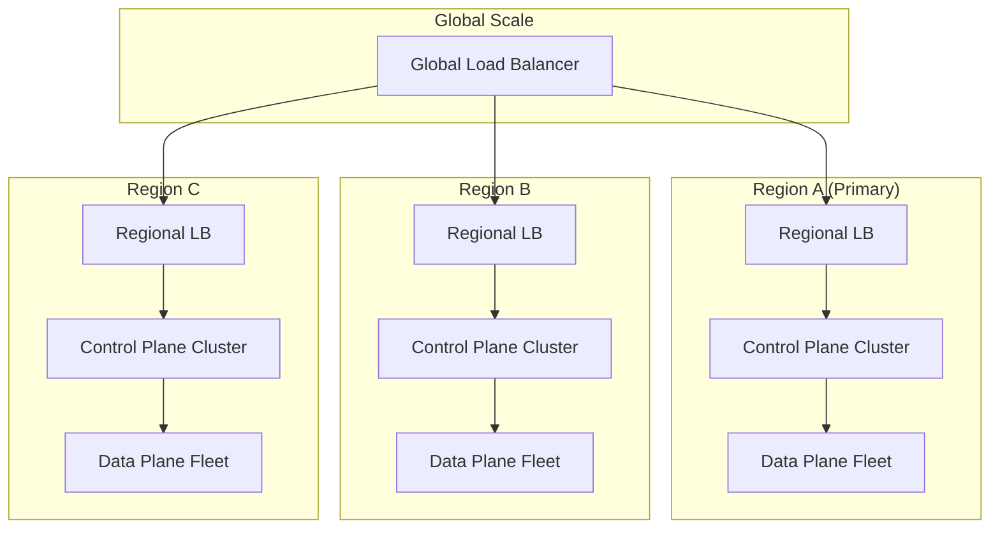
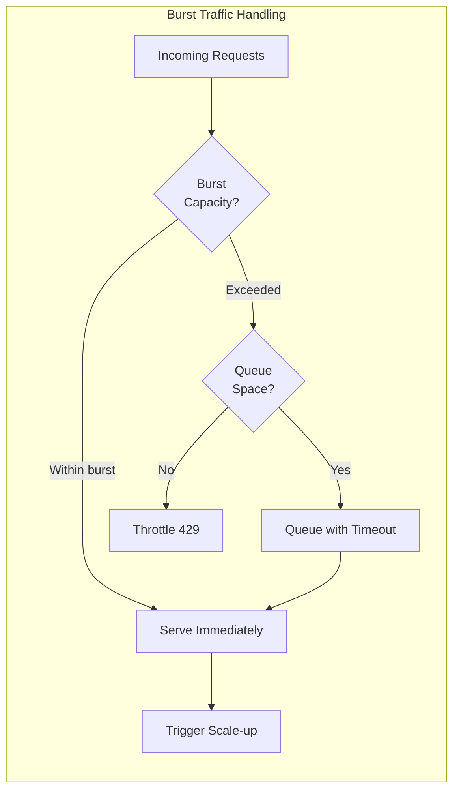
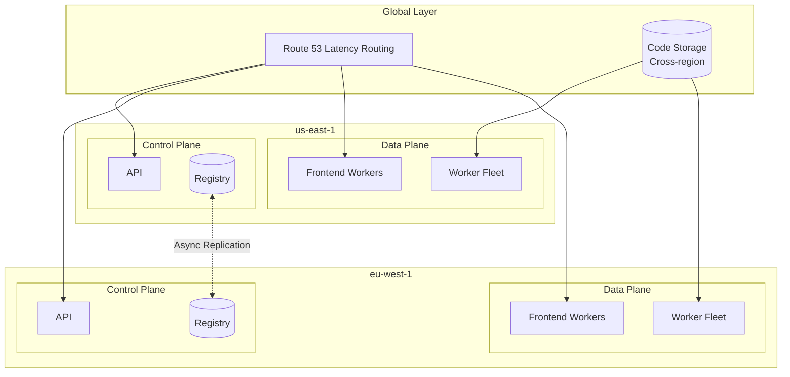

# Scalability & Reliability

[← Back to Index](./00-index.md)

---

## Scalability

### Horizontal Scaling Strategy



#### Control Plane Scaling

| Component | Scaling Strategy | Bottleneck | Mitigation |
|-----------|-----------------|------------|------------|
| **API Gateway** | Horizontal (add nodes) | Request rate | Auto-scaling group, rate limiting |
| **Function Registry** | Sharded database | Storage, QPS | Partition by account/function |
| **Scaling Controller** | Leader-elected | Decision throughput | Regional controllers |
| **Worker Manager** | Sharded by function | Slot coordination | Hierarchical management |
| **Placement Service** | Partitioned by AZ | Placement decisions | Local placement with global fallback |

**Control Plane Scaling Thresholds:**

```
API Gateway:
- Scale at: 80% CPU or 10,000 QPS
- Min: 3 nodes per AZ
- Max: 100 nodes per region

Function Registry:
- Scale at: 80% storage or 5,000 QPS per shard
- Sharding key: account_id + function_name hash
- Target: <1000 functions per shard

Worker Manager:
- Scale at: 10,000 slots per manager
- Sharding: Consistent hash of function_id
- Failover: Standby manager per shard
```

#### Data Plane Scaling

**Worker Fleet Auto-Scaling:**

```
SCALING ALGORITHM:

// Inputs
current_workers = count_active_workers()
current_utilization = avg_worker_utilization()
pending_requests = count_queued_requests()
throttled_rate = get_throttle_rate()

// Scale-up triggers
IF current_utilization > 0.7:
    scale_up(current_workers * 0.2)  // Add 20%

IF pending_requests > QUEUE_THRESHOLD:
    scale_up(pending_requests / AVG_SLOTS_PER_WORKER)

IF throttled_rate > 0:
    scale_up(throttled_rate * THROTTLE_MULTIPLIER)

// Scale-down triggers (conservative)
IF current_utilization < 0.3 AND time_since_scale_up > COOLDOWN:
    scale_down(current_workers * 0.1)  // Remove 10%

// Constraints
new_count = clamp(new_count, MIN_WORKERS, MAX_WORKERS)
```

**Burst Scaling Mechanism:**



| Scaling Tier | Rate | Duration | Purpose |
|--------------|------|----------|---------|
| **Burst** | 500-3,000/s | Instant | Handle sudden spikes |
| **Sustained** | +500/minute | Until demand met | Gradual scale-up |
| **Emergency** | 2x burst | Triggered manually | Incident response |

### Concurrency Management

**Per-Function Concurrency:**

```
┌─────────────────────────────────────────────────────────────┐
│                    Account Concurrency Pool                  │
│                     (e.g., 10,000 limit)                    │
├─────────────────────────────────────────────────────────────┤
│                                                             │
│  ┌─────────────┐  ┌─────────────┐  ┌─────────────────────┐ │
│  │ Function A  │  │ Function B  │  │   Unreserved Pool   │ │
│  │ Reserved:   │  │ Reserved:   │  │                     │ │
│  │    500      │  │    200      │  │   10,000 - 700 =    │ │
│  │             │  │             │  │      9,300          │ │
│  └─────────────┘  └─────────────┘  └─────────────────────┘ │
│                                                             │
│  Function A guaranteed 500 concurrent                       │
│  Function B guaranteed 200 concurrent                       │
│  All functions share remaining 9,300                        │
│                                                             │
└─────────────────────────────────────────────────────────────┘
```

**Provisioned vs Reserved vs On-Demand:**

| Type | Purpose | Billing | Cold Start |
|------|---------|---------|------------|
| **On-Demand** | Default capacity | Per-invocation | Possible |
| **Reserved** | Guaranteed capacity | Per-invocation | Possible |
| **Provisioned** | Pre-warmed capacity | Per-hour + invocation | Never |

### Regional and Multi-Region Deployment

**Single Region Architecture:**

- 3 Availability Zones minimum
- Control plane replicated across AZs
- Worker fleet distributed across AZs
- Regional storage with AZ replication

**Multi-Region Architecture:**



**Data Replication Strategy:**

| Data Type | Replication | Consistency | Strategy |
|-----------|-------------|-------------|----------|
| Function code | Cross-region | Eventual | S3 CRR |
| Function metadata | Cross-region | Eventual (minutes) | Async replication |
| Invocation state | Regional only | Strong | Not replicated |
| Metrics/logs | Regional only | Eventual | Regional aggregation |

---

## Reliability

### Fault Tolerance Mechanisms

**Component Redundancy:**

| Component | Redundancy Level | Failure Handling |
|-----------|------------------|------------------|
| API Gateway | N+2 per AZ | Load balancer failover |
| Function Registry | 3-5 node cluster | Raft consensus |
| Worker Manager | Active-standby per shard | Leader election |
| Placement Service | Active-active | Stateless, any can serve |
| Worker Host | N/A (stateless) | Reschedule to healthy host |
| Code Storage | 11 9s durability | S3/GCS built-in |

**Failure Domain Isolation:**

```
┌─────────────────────────────────────────────────────────────┐
│                         Region                               │
├─────────────────────────────────────────────────────────────┤
│                                                             │
│  ┌─────────────────┐  ┌─────────────────┐  ┌─────────────┐ │
│  │      AZ-A       │  │      AZ-B       │  │    AZ-C     │ │
│  │                 │  │                 │  │             │ │
│  │ ┌─────────────┐ │  │ ┌─────────────┐ │  │┌───────────┐│ │
│  │ │ Control     │ │  │ │ Control     │ │  ││ Control   ││ │
│  │ │ Plane       │ │  │ │ Plane       │ │  ││ Plane     ││ │
│  │ │ (follower)  │ │  │ │ (leader)    │ │  ││(follower) ││ │
│  │ └─────────────┘ │  │ └─────────────┘ │  │└───────────┘│ │
│  │                 │  │                 │  │             │ │
│  │ ┌─────────────┐ │  │ ┌─────────────┐ │  │┌───────────┐│ │
│  │ │ Worker      │ │  │ │ Worker      │ │  ││ Worker    ││ │
│  │ │ Fleet       │ │  │ │ Fleet       │ │  ││ Fleet     ││ │
│  │ │ (1000 hosts)│ │  │ │ (1000 hosts)│ │  ││(1000)     ││ │
│  │ └─────────────┘ │  │ └─────────────┘ │  │└───────────┘│ │
│  └─────────────────┘  └─────────────────┘  └─────────────┘ │
│                                                             │
│  AZ failure: Lose 33% capacity, 66% continues operating     │
│                                                             │
└─────────────────────────────────────────────────────────────┘
```

### Health Checking

**Worker Host Health:**

```
HEALTH CHECK PROTOCOL:

// Agent heartbeat (every 5 seconds)
FUNCTION worker_heartbeat_loop():
    WHILE running:
        status = {
            host_id: self.host_id,
            available_memory: get_available_memory(),
            available_slots: get_available_slots(),
            slot_states: get_slot_summary(),
            cpu_load: get_cpu_load(),
            network_health: check_network(),
            timestamp: now()
        }

        send_heartbeat(worker_manager, status)
        sleep(5_seconds)

// Worker Manager monitoring
FUNCTION monitor_workers():
    FOR worker IN registered_workers:
        IF now() - worker.last_heartbeat > 15_seconds:
            mark_worker_unhealthy(worker)
            trigger_slot_redistribution(worker)

        IF now() - worker.last_heartbeat > 60_seconds:
            mark_worker_dead(worker)
            remove_worker(worker)
```

**Execution Slot Health:**

```
SLOT HEALTH STATES:
- HEALTHY: Responding to probes, within limits
- DEGRADED: High latency or resource pressure
- UNHEALTHY: Not responding or erroring
- DEAD: No response, needs replacement

HEALTH CHECK FLOW:
1. Periodic liveness probe (HTTP GET /_health)
2. Check memory usage < limit
3. Check response latency < threshold
4. Check error rate < threshold

ACTIONS:
- DEGRADED: Reduce routing weight
- UNHEALTHY: Stop routing, attempt recovery
- DEAD: Terminate, replace with new slot
```

### Circuit Breaker Patterns

**Function-Level Circuit Breaker:**

```
CIRCUIT BREAKER STATES:
- CLOSED: Normal operation
- OPEN: Failing fast, no invocations
- HALF-OPEN: Testing recovery

FUNCTION invoke_with_circuit_breaker(function_id, request):
    breaker = get_circuit_breaker(function_id)

    IF breaker.state == OPEN:
        IF now() - breaker.opened_at > OPEN_DURATION:
            breaker.state = HALF_OPEN
        ELSE:
            RETURN fail_fast("CircuitOpen")

    TRY:
        response = invoke_function(function_id, request)
        breaker.record_success()

        IF breaker.state == HALF_OPEN:
            breaker.state = CLOSED

        RETURN response

    CATCH error:
        breaker.record_failure()

        IF breaker.failure_rate > THRESHOLD:
            breaker.state = OPEN
            breaker.opened_at = now()

        RAISE error

PARAMETERS:
- Failure threshold: 50% over 10 requests
- Open duration: 30 seconds
- Half-open test requests: 3
```

**Downstream Service Circuit Breaker:**

```
CONCEPT: Protect functions from cascading failures

DOWNSTREAM SERVICES:
- Databases
- External APIs
- Message queues
- Other microservices

IMPLEMENTATION:
- Circuit breaker per (function, downstream) pair
- Shared circuit state across instances
- Automatic fallback or fail-fast
```

### Graceful Degradation

**Degradation Hierarchy:**

```
LEVEL 0: Normal Operation
- All features available
- Full capacity

LEVEL 1: Increased Latency
- Accept cold starts
- Disable non-critical features
- Extend timeouts

LEVEL 2: Reduced Functionality
- Reject new deployments
- Serve from warm slots only
- Queue async invocations

LEVEL 3: Emergency Mode
- Serve provisioned concurrency only
- Reject on-demand invocations
- Alert operations team
```

**Overload Protection:**

```
FUNCTION handle_request_with_overload_protection(request):
    // Check system health
    load = get_system_load()

    IF load > CRITICAL_THRESHOLD:
        // Shed load aggressively
        IF NOT request.has_priority:
            RETURN throttle_response("SystemOverloaded")

    IF load > WARNING_THRESHOLD:
        // Apply backpressure
        add_delay(calculate_backpressure_delay(load))

    // Check function-specific limits
    IF NOT check_rate_limits(request.function_id):
        RETURN throttle_response("RateLimitExceeded")

    // Process request
    RETURN process_request(request)
```

---

## Disaster Recovery

### Recovery Objectives

| Metric | Target | Justification |
|--------|--------|---------------|
| **RTO** (Recovery Time Objective) | < 5 minutes | Platform should recover quickly |
| **RPO** (Recovery Point Objective) | 0 (zero data loss) | Function code and config must not be lost |
| **Regional Failover** | < 15 minutes | For full region outage |

### Backup Strategy

**What to Backup:**

| Data | Backup Frequency | Retention | Storage |
|------|-----------------|-----------|---------|
| Function code | On deploy (versioned) | Indefinite | S3 with versioning |
| Function metadata | Continuous (CDC) | 30 days point-in-time | Cross-region DB replica |
| Event source mappings | Continuous | 30 days | Same as metadata |
| Account configurations | Daily | 90 days | Encrypted backup |
| Platform configuration | On change | Indefinite | Git + encrypted backup |

**Backup Verification:**

```
DAILY BACKUP VERIFICATION:
1. Restore random function to test environment
2. Verify code hash matches original
3. Verify configuration matches original
4. Execute test invocation
5. Alert if any step fails
```

### Failover Scenarios

**Scenario 1: Single AZ Failure**

```
IMPACT: ~33% capacity loss
DETECTION: Health check failures, AZ-level monitoring
RESPONSE:
1. Automatic: Load balancer removes unhealthy targets
2. Automatic: Warm slots on other AZs absorb traffic
3. Automatic: Scale up in healthy AZs
4. Manual: None required

RTO: < 1 minute
RPO: 0 (no data loss)
```

**Scenario 2: Control Plane Failure**

```
IMPACT: No new deployments, no scaling changes
DATA PLANE: Continues operating (static stability)
DETECTION: Control plane health checks, API errors
RESPONSE:
1. Automatic: Leader election for stateful components
2. Automatic: Failover to standby
3. Manual: Investigate root cause

RTO: < 5 minutes
RPO: 0 (state replicated)
```

**Scenario 3: Full Region Failure**

```
IMPACT: All functions in region unavailable
DETECTION: Region-level health checks, customer reports
RESPONSE:
1. Automatic: DNS failover to secondary region (if configured)
2. Manual: Trigger cross-region recovery runbook
3. Manual: Validate function deployments in secondary region
4. Manual: Update event source mappings

RTO: < 15 minutes (with preparation)
RPO: Minutes (async replication delay)
```

### Cross-Region Recovery Procedure

```
RUNBOOK: REGION FAILOVER

PRE-REQUISITES:
- Cross-region code replication enabled
- Metadata replicated to DR region
- DNS failover configured

STEPS:
1. DETECT
   - Confirm region failure (not transient)
   - Notify stakeholders

2. ACTIVATE DR REGION
   - Enable write traffic to DR control plane
   - Scale up DR worker fleet

3. UPDATE ROUTING
   - Update DNS to point to DR region
   - Update event source endpoints

4. VALIDATE
   - Test critical function invocations
   - Verify event processing
   - Monitor error rates

5. COMMUNICATE
   - Update status page
   - Notify affected customers

6. POST-RECOVERY
   - Analyze failure root cause
   - Plan primary region recovery
   - Update runbook if needed
```

---

## Capacity Planning

### Forecasting Model

```
CAPACITY PLANNING INPUTS:
- Historical invocation trends
- Customer growth projections
- Seasonal patterns (Black Friday, etc.)
- New feature launches
- Known large customer onboarding

FORECASTING:
predicted_capacity =
    historical_baseline *
    growth_rate^(months_ahead) *
    seasonal_factor *
    safety_margin

EXAMPLE:
- Current peak: 1M concurrent
- Monthly growth: 5%
- 6 months ahead
- Seasonal factor: 1.5x (holiday)
- Safety margin: 1.3x

predicted = 1M * 1.05^6 * 1.5 * 1.3 = 2.6M concurrent
```

### Capacity Buffers

| Scenario | Buffer | Purpose |
|----------|--------|---------|
| Normal operation | 30% | Handle traffic variance |
| Peak seasons | 50% | Holiday traffic spikes |
| AZ failure | 50% | Absorb failed AZ traffic |
| Burst handling | Dedicated pool | Sudden traffic spikes |

### Resource Allocation Model

```
WORKER FLEET SIZING:

Given:
- Peak concurrent invocations: C
- Average memory per invocation: M
- Worker memory available: W
- Target utilization: U (e.g., 0.7)
- AZ count: A

Workers per AZ = ceil(C * M / (W * U * A))

EXAMPLE:
- C = 1,000,000 concurrent
- M = 512 MB average
- W = 64,000 MB per worker
- U = 0.7
- A = 3 AZs

Workers per AZ = ceil(1M * 512 / (64000 * 0.7 * 3))
               = ceil(512,000,000 / 134,400)
               = 3,810 workers per AZ

Total = 11,430 workers
```
