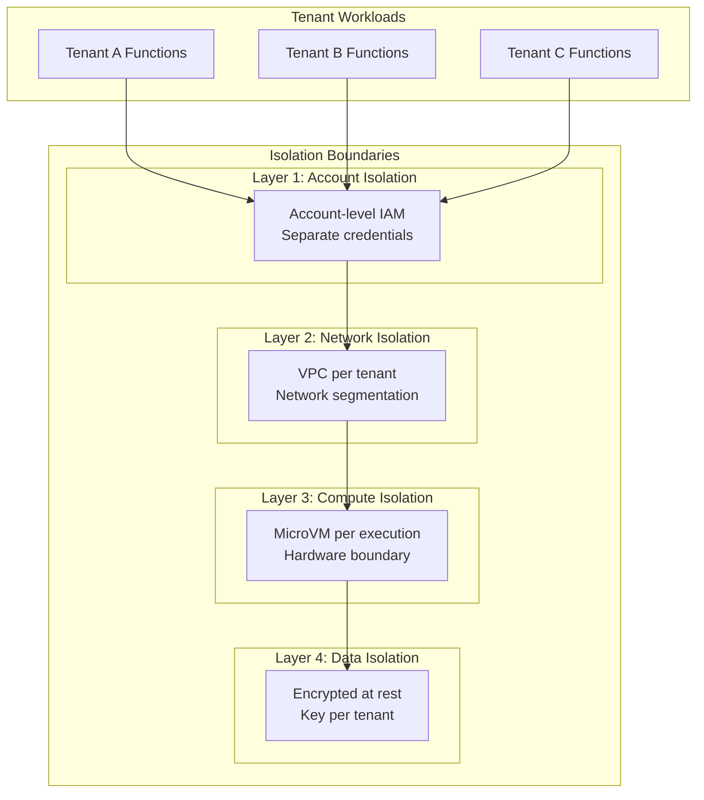
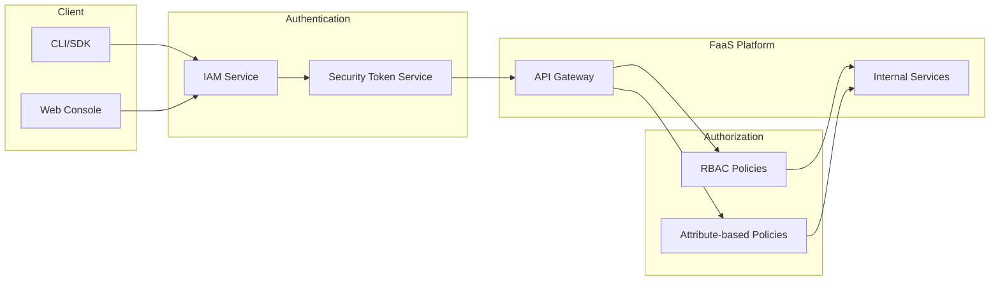

# Security & Compliance

[← Back to Index](./00-index.md)

---

## Isolation Model

### Multi-Tenant Isolation Architecture



### Execution Isolation Layers

**Layer 1: MicroVM Isolation (Primary)**

```
┌─────────────────────────────────────────────────────────────────┐
│                        Host Kernel                               │
├─────────────────────────────────────────────────────────────────┤
│                           KVM                                    │
├─────────────────────────────────────────────────────────────────┤
│                                                                  │
│  ┌──────────────────┐    ┌──────────────────┐                   │
│  │    MicroVM A     │    │    MicroVM B     │                   │
│  │   (Tenant 1)     │    │   (Tenant 2)     │                   │
│  │                  │    │                  │                   │
│  │  ┌────────────┐  │    │  ┌────────────┐  │                   │
│  │  │Guest Kernel│  │    │  │Guest Kernel│  │                   │
│  │  └────────────┘  │    │  └────────────┘  │                   │
│  │  ┌────────────┐  │    │  ┌────────────┐  │                   │
│  │  │ Function   │  │    │  │ Function   │  │                   │
│  │  │   Code     │  │    │  │   Code     │  │                   │
│  │  └────────────┘  │    │  └────────────┘  │                   │
│  └──────────────────┘    └──────────────────┘                   │
│                                                                  │
│  ISOLATION GUARANTEES:                                           │
│  - Separate virtual CPUs (vCPU)                                 │
│  - Separate memory address space (MMU)                          │
│  - Separate virtual devices                                     │
│  - No shared state between VMs                                  │
│                                                                  │
└─────────────────────────────────────────────────────────────────┘
```

**Layer 2: Jailer Sandbox (Defense in Depth)**

```
JAILER SECURITY CONTROLS:

1. CHROOT JAIL
   - Firecracker process sees only /jail directory
   - Cannot access host filesystem
   - Read-only root filesystem

2. SECCOMP FILTERS
   Allowed syscalls (~25):
   - read, write, close, fstat
   - mmap, mprotect, munmap
   - ioctl (KVM subset only)
   - futex, nanosleep, clock_gettime
   - exit_group

   Blocked:
   - execve (no new processes)
   - socket (no new network connections)
   - mount (no filesystem changes)
   - ptrace (no debugging)

3. CGROUPS
   - Memory: Hard limit (no OOM of host)
   - CPU: Fair share scheduling
   - I/O: Rate limiting
   - PIDs: Process count limit

4. NAMESPACES
   - PID: Isolated process tree
   - Network: Dedicated network namespace
   - Mount: Isolated filesystem view
   - User: Non-root in container
```

**Layer 3: Network Isolation**

```
┌─────────────────────────────────────────────────────────────────┐
│                        Worker Host                               │
│                                                                  │
│  ┌──────────────────┐    ┌──────────────────┐                   │
│  │    MicroVM A     │    │    MicroVM B     │                   │
│  │    ┌───────┐     │    │    ┌───────┐     │                   │
│  │    │ eth0  │     │    │    │ eth0  │     │                   │
│  │    └───┬───┘     │    │    └───┬───┘     │                   │
│  └────────┼─────────┘    └────────┼─────────┘                   │
│           │                       │                              │
│      ┌────┴────┐             ┌────┴────┐                        │
│      │  tap0   │             │  tap1   │                        │
│      └────┬────┘             └────┬────┘                        │
│           │                       │                              │
│      ┌────┴───────────────────────┴────┐                        │
│      │         Bridge / IPTables        │                        │
│      │  - No VM-to-VM communication    │                        │
│      │  - Outbound via NAT gateway     │                        │
│      │  - Ingress from frontend only   │                        │
│      └─────────────────────────────────┘                        │
│                                                                  │
└─────────────────────────────────────────────────────────────────┘

FIREWALL RULES (per MicroVM):
- ALLOW: Ingress from frontend worker (invocation)
- ALLOW: Egress to configured VPC endpoints
- ALLOW: Egress to internet (if not in VPC)
- DENY: All VM-to-VM traffic
- DENY: Access to host metadata service (169.254.169.254)
- DENY: Access to host control plane
```

### Resource Limits Enforcement

| Resource | Limit | Enforcement |
|----------|-------|-------------|
| **Memory** | 128 MB - 10 GB (configurable) | cgroups hard limit |
| **CPU** | Proportional to memory | CPU shares + burst |
| **Execution time** | 1s - 15 min | Timer + SIGKILL |
| **Disk I/O** | Rate limited | cgroups I/O throttling |
| **Network** | Rate limited | TC qdisc |
| **File descriptors** | 1024 per function | ulimit |
| **Processes/threads** | 1024 per function | cgroups PIDs |

---

## Authentication & Authorization

### Control Plane Authentication



**IAM Policy Model:**

```json
{
  "Version": "2024-01-01",
  "Statement": [
    {
      "Effect": "Allow",
      "Action": [
        "lambda:CreateFunction",
        "lambda:UpdateFunctionCode",
        "lambda:InvokeFunction"
      ],
      "Resource": "arn:aws:lambda:*:123456789012:function:my-app-*",
      "Condition": {
        "StringEquals": {
          "aws:PrincipalTag/team": "backend"
        }
      }
    },
    {
      "Effect": "Deny",
      "Action": "lambda:DeleteFunction",
      "Resource": "*",
      "Condition": {
        "StringEquals": {
          "aws:ResourceTag/environment": "production"
        }
      }
    }
  ]
}
```

### Function Execution Role

```
EXECUTION ROLE FLOW:

1. Function configured with execution role ARN
2. On invocation, platform assumes role via STS
3. Temporary credentials injected into MicroVM
4. Function uses credentials to access AWS services
5. Credentials auto-rotated (typically 1 hour)

LEAST PRIVILEGE EXAMPLE:
{
  "Version": "2024-01-01",
  "Statement": [
    {
      "Effect": "Allow",
      "Action": [
        "dynamodb:GetItem",
        "dynamodb:PutItem"
      ],
      "Resource": "arn:aws:dynamodb:*:*:table/my-table"
    },
    {
      "Effect": "Allow",
      "Action": [
        "s3:GetObject"
      ],
      "Resource": "arn:aws:s3:::my-bucket/config/*"
    }
  ]
}
```

### Event Source Authentication

| Event Source | Authentication Method | Authorization |
|--------------|----------------------|---------------|
| **API Gateway** | API Key, IAM, Cognito | Resource policy + IAM |
| **SQS/SNS** | IAM role assumption | Queue/topic policy |
| **S3** | IAM role assumption | Bucket policy |
| **DynamoDB Streams** | IAM role assumption | Table policy |
| **Scheduled (Cron)** | Platform-managed | Function policy |

---

## Threat Model

### Attack Surface Analysis

```
┌─────────────────────────────────────────────────────────────────┐
│                    ATTACK SURFACE MAP                            │
├─────────────────────────────────────────────────────────────────┤
│                                                                  │
│  EXTERNAL THREATS                                               │
│  ┌──────────────────────────────────────────────────────────┐  │
│  │ 1. Malicious invocation payload                          │  │
│  │ 2. Code injection via dependencies                       │  │
│  │ 3. Credential theft from environment                     │  │
│  │ 4. DDoS via invocation flooding                         │  │
│  └──────────────────────────────────────────────────────────┘  │
│                                                                  │
│  TENANT-TO-TENANT THREATS                                       │
│  ┌──────────────────────────────────────────────────────────┐  │
│  │ 5. MicroVM escape (container/VM breakout)               │  │
│  │ 6. Side-channel attacks (Spectre, timing)               │  │
│  │ 7. Resource exhaustion (noisy neighbor)                 │  │
│  │ 8. Shared cache poisoning                               │  │
│  └──────────────────────────────────────────────────────────┘  │
│                                                                  │
│  INSIDER THREATS                                                │
│  ┌──────────────────────────────────────────────────────────┐  │
│  │ 9. Platform operator accessing customer data            │  │
│  │ 10. Supply chain attacks on runtime images              │  │
│  │ 11. Backdoors in platform code                          │  │
│  └──────────────────────────────────────────────────────────┘  │
│                                                                  │
└─────────────────────────────────────────────────────────────────┘
```

### Threat Mitigation Matrix

| Threat | Severity | Mitigation | Detection |
|--------|----------|------------|-----------|
| **MicroVM escape** | Critical | Firecracker + Jailer + KVM | Anomaly detection, audit logs |
| **Credential theft** | High | Short-lived tokens, no persistent creds | Credential usage monitoring |
| **Code injection** | High | Code signing, dependency scanning | Static analysis, runtime monitoring |
| **Side-channel** | Medium | Core isolation, microcode updates | Performance anomaly detection |
| **Noisy neighbor** | Medium | Resource limits, fair scheduling | Resource usage monitoring |
| **DDoS** | Medium | Rate limiting, burst limits | Traffic analysis |
| **Insider threat** | High | Access controls, audit logging | Access pattern analysis |

### Security Controls by Layer

**Application Layer:**
```
- Input validation in function code
- Output encoding
- Secure coding practices
- Dependency vulnerability scanning
- Code review requirements
```

**Platform Layer:**
```
- Rate limiting (per-function, per-account)
- Payload size limits (6 MB sync, 256 KB async)
- Execution timeout enforcement
- Concurrency limits
- VPC isolation options
```

**Infrastructure Layer:**
```
- MicroVM isolation
- Network segmentation
- Encrypted storage
- Key management (KMS)
- Regular patching
```

---

## Data Protection

### Encryption

**At Rest:**

| Data Type | Encryption | Key Management |
|-----------|------------|----------------|
| Function code | AES-256-GCM | KMS (customer or AWS managed) |
| Environment variables | AES-256-GCM | KMS (customer key optional) |
| Logs | AES-256 | CloudWatch managed |
| Metrics | AES-256 | Platform managed |

**In Transit:**

| Connection | Protocol | Certificate |
|------------|----------|-------------|
| API calls | TLS 1.2+ | Platform CA |
| Invocations | TLS 1.2+ | Platform CA |
| Inter-service | mTLS | Internal CA |
| To customer VPC | TLS or VPC endpoint | Varies |

### Secrets Management

```
SECRETS HANDLING:

1. ENVIRONMENT VARIABLES (Basic)
   - Encrypted at rest with KMS
   - Decrypted at function start
   - Available as env vars
   - Visible in console (masked)

2. SECRETS MANAGER INTEGRATION (Recommended)
   - Secrets stored in dedicated service
   - Retrieved at runtime via SDK
   - Automatic rotation support
   - Audit logging of access

3. PARAMETER STORE
   - Hierarchical secret storage
   - Version history
   - IAM-controlled access

BEST PRACTICES:
- Never hardcode secrets in function code
- Use IAM roles, not access keys
- Rotate secrets regularly
- Use VPC endpoints for secrets access
- Monitor secret access patterns
```

### Data Residency

```
DATA RESIDENCY CONTROLS:

1. FUNCTION CODE
   - Stored in customer-selected region
   - Cross-region replication optional
   - Customer controls replication config

2. EXECUTION
   - Functions execute in deployed region only
   - No automatic cross-region execution
   - Multi-region requires explicit deployment

3. LOGS AND METRICS
   - Stored in function's region
   - Customer can configure export
   - Retention configurable

4. TEMPORARY DATA
   - /tmp storage: In-region, ephemeral
   - Cleared between invocations
   - Not persisted or replicated
```

---

## Compliance

### Compliance Certifications

| Standard | Coverage | Key Controls |
|----------|----------|--------------|
| **SOC 2 Type II** | Full platform | Access control, encryption, monitoring |
| **PCI DSS** | Payment functions | Network isolation, encryption, logging |
| **HIPAA** | Healthcare workloads | BAA required, encryption, access control |
| **FedRAMP** | Government workloads | Authorization boundary, continuous monitoring |
| **ISO 27001** | Full platform | ISMS, risk management |
| **GDPR** | EU data handling | Data residency, right to erasure |

### Audit Logging

**What's Logged:**

```
CONTROL PLANE EVENTS:
- Function create/update/delete
- Configuration changes
- IAM policy changes
- Concurrency changes
- Event source mapping changes
- Alias/version management

DATA PLANE EVENTS:
- Invocation start/end
- Throttle events
- Error events
- Cold start events

LOG FORMAT (CloudTrail style):
{
  "eventTime": "2024-01-15T10:30:00Z",
  "eventSource": "lambda.amazonaws.com",
  "eventName": "Invoke",
  "userIdentity": {
    "type": "IAMUser",
    "principalId": "AIDAEXAMPLE",
    "arn": "arn:aws:iam::123456789012:user/alice"
  },
  "requestParameters": {
    "functionName": "my-function",
    "qualifier": "prod"
  },
  "responseElements": {
    "statusCode": 200
  },
  "sourceIPAddress": "192.0.2.1",
  "requestId": "abc123-def456"
}
```

**Log Retention:**

| Log Type | Default Retention | Configurable |
|----------|-------------------|--------------|
| Control plane audit | 90 days | Up to 7 years |
| Function logs | Never expires | Yes (1 day - 10 years) |
| Metrics | 15 months | No |
| Invocation records | 6 hours | No |

### Security Best Practices Checklist

**Function Development:**
- [ ] Use least privilege execution roles
- [ ] Validate all input data
- [ ] Scan dependencies for vulnerabilities
- [ ] Don't log sensitive data
- [ ] Use parameterized queries
- [ ] Enable X-Ray tracing

**Deployment:**
- [ ] Use infrastructure as code
- [ ] Implement code signing
- [ ] Review IAM policies
- [ ] Enable VPC if accessing private resources
- [ ] Set appropriate timeouts and memory
- [ ] Configure dead letter queues

**Operations:**
- [ ] Monitor function errors and throttles
- [ ] Set up alerts for anomalies
- [ ] Regularly review access logs
- [ ] Rotate credentials periodically
- [ ] Keep runtimes updated
- [ ] Test disaster recovery

---

## Vulnerability Management

### Runtime Security

```
RUNTIME VULNERABILITY MANAGEMENT:

1. BASE IMAGE UPDATES
   - Platform maintains runtime images
   - Security patches applied regularly
   - Customers notified of deprecations
   - Automatic migration for minor updates

2. CUSTOMER CODE SCANNING
   - Optional: Integrate with CI/CD scanning
   - Platform: Malware scanning on upload
   - Runtime: Behavioral analysis (anomaly detection)

3. DEPENDENCY MANAGEMENT
   - Layers for shared dependencies
   - Customer responsibility for function deps
   - Integration with vulnerability databases
```

### Incident Response

```
SECURITY INCIDENT RESPONSE:

SEVERITY LEVELS:
- P1: Active exploitation, data breach
- P2: Vulnerability with exploit available
- P3: Vulnerability, no known exploit
- P4: Hardening opportunity

RESPONSE TIMELINE:
- P1: Immediate containment, 4-hour resolution target
- P2: 24-hour mitigation
- P3: Next maintenance window
- P4: Roadmap item

CUSTOMER NOTIFICATION:
- P1: Immediate notification
- P2: Within 24 hours
- P3: Security bulletin
- P4: Release notes
```
