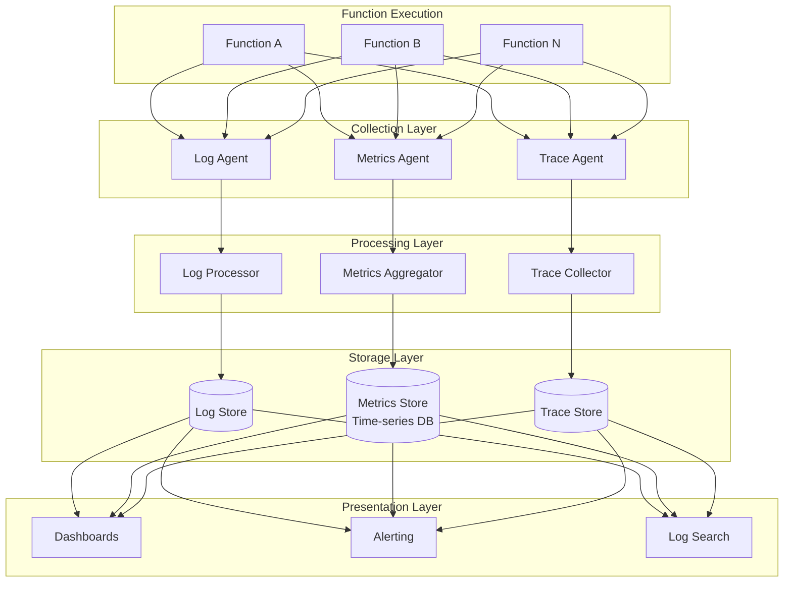
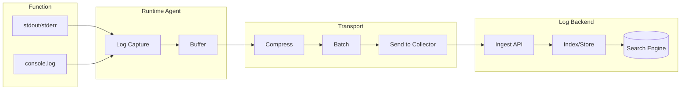

# Observability

[← Back to Index](./00-index.md)

---

## Observability Architecture



---

## Metrics

### Platform Metrics

**Invocation Metrics:**

| Metric | Type | Dimensions | Description |
|--------|------|------------|-------------|
| `invocations` | Counter | function, version, trigger | Total invocation count |
| `errors` | Counter | function, version, error_type | Error count by type |
| `throttles` | Counter | function, reason | Throttled invocation count |
| `duration` | Histogram | function, version | Execution duration (ms) |
| `billed_duration` | Counter | function | Total billed milliseconds |
| `concurrent_executions` | Gauge | function | Current concurrent count |
| `cold_starts` | Counter | function, version | Cold start count |
| `init_duration` | Histogram | function, version, runtime | Init time for cold starts |

**Resource Metrics:**

| Metric | Type | Dimensions | Description |
|--------|------|------------|-------------|
| `memory_used` | Histogram | function | Memory usage (MB) |
| `memory_size` | Gauge | function | Configured memory (MB) |
| `tmp_storage_used` | Histogram | function | /tmp usage (MB) |
| `provisioned_concurrent` | Gauge | function | Provisioned slots |
| `spillover_invocations` | Counter | function | Invocations exceeding provisioned |

### Infrastructure Metrics

**Worker Fleet:**

| Metric | Type | Dimensions | Description |
|--------|------|------------|-------------|
| `worker_count` | Gauge | az, state | Workers by AZ and state |
| `worker_utilization` | Gauge | az | Memory utilization percentage |
| `slot_count` | Gauge | az, state | Slots by state |
| `slot_allocation_time` | Histogram | az | Time to allocate new slot |

**Control Plane:**

| Metric | Type | Dimensions | Description |
|--------|------|------------|-------------|
| `api_requests` | Counter | endpoint, status | API request count |
| `api_latency` | Histogram | endpoint | API response time |
| `placement_decisions` | Counter | result | Placement outcomes |
| `scaling_events` | Counter | function, direction | Scale up/down events |

### Metric Collection Implementation

```
METRIC COLLECTION FLOW:

1. FUNCTION EXECUTION
   - Platform injects metrics agent
   - Agent collects: duration, memory, cold_start
   - Sends to local aggregator on host

2. HOST AGGREGATION
   - Aggregate metrics per function per minute
   - Reduce cardinality (p50, p99, max, count)
   - Forward to regional collector

3. REGIONAL AGGREGATION
   - Combine from all hosts
   - Apply retention policies
   - Store in time-series database

4. QUERY PATH
   - Dashboards query aggregated data
   - Support for drilling down
   - Export to external systems

PSEUDOCODE:
FUNCTION collect_invocation_metrics(invocation):
    metrics = {
        "function_id": invocation.function_id,
        "version": invocation.version,
        "timestamp": invocation.start_time,
        "duration_ms": invocation.end_time - invocation.start_time,
        "billed_duration_ms": round_up_to_nearest_ms(duration, 1),
        "memory_used_mb": invocation.max_memory_used,
        "memory_size_mb": invocation.memory_configured,
        "cold_start": invocation.is_cold_start,
        "init_duration_ms": invocation.init_duration IF cold_start ELSE NULL,
        "status": "success" IF invocation.success ELSE "error",
        "error_type": invocation.error_type,
        "trigger_type": invocation.trigger_type
    }

    emit_to_aggregator(metrics)
```

### Key Dashboards

**Function Health Dashboard:**

```
┌─────────────────────────────────────────────────────────────────┐
│                    FUNCTION: order-processor                     │
├─────────────────────────────────────────────────────────────────┤
│                                                                  │
│  INVOCATIONS (last 24h)           ERRORS (last 24h)             │
│  ┌────────────────────┐           ┌────────────────────┐        │
│  │    1.2M total      │           │    1,234 (0.1%)    │        │
│  │    ▅▆▇█▆▅▄▃▂▁▂▃   │           │    ▁▁▁▂▅▁▁▁▁▁▁▁   │        │
│  └────────────────────┘           └────────────────────┘        │
│                                                                  │
│  DURATION (p99)                   COLD STARTS                   │
│  ┌────────────────────┐           ┌────────────────────┐        │
│  │    245ms           │           │    0.5%             │        │
│  │    ▃▃▃▃▃▄▅▆▅▄▃▃   │           │    ▂▁▁▁▁▁▁▁▁▁▁▂   │        │
│  └────────────────────┘           └────────────────────┘        │
│                                                                  │
│  CONCURRENT EXECUTIONS            THROTTLES                     │
│  ┌────────────────────┐           ┌────────────────────┐        │
│  │    Peak: 847       │           │    0 (last 24h)    │        │
│  │    ▂▃▄▆█▇▅▃▂▁▁▂   │           │    ▁▁▁▁▁▁▁▁▁▁▁▁   │        │
│  └────────────────────┘           └────────────────────┘        │
│                                                                  │
└─────────────────────────────────────────────────────────────────┘
```

**Platform Health Dashboard:**

```
┌─────────────────────────────────────────────────────────────────┐
│                 PLATFORM HEALTH - us-east-1                      │
├─────────────────────────────────────────────────────────────────┤
│                                                                  │
│  TOTAL INVOCATIONS      ERROR RATE         THROTTLE RATE        │
│  ┌──────────────┐      ┌──────────────┐   ┌──────────────┐     │
│  │  45.2M/min   │      │    0.02%     │   │   0.001%     │     │
│  │  ↑ 12%       │      │  ● Normal    │   │  ● Normal    │     │
│  └──────────────┘      └──────────────┘   └──────────────┘     │
│                                                                  │
│  WORKER FLEET                                                   │
│  ┌────────────────────────────────────────────────────────┐    │
│  │  AZ-A: 3,200 workers (68% util)  ████████████░░░░░░   │    │
│  │  AZ-B: 3,100 workers (72% util)  █████████████░░░░░   │    │
│  │  AZ-C: 3,150 workers (70% util)  ████████████░░░░░░   │    │
│  └────────────────────────────────────────────────────────┘    │
│                                                                  │
│  COLD START LATENCY (p99)          API LATENCY (p99)           │
│  ┌────────────────────┐            ┌────────────────────┐      │
│  │    Node.js: 185ms  │            │    GET: 45ms       │      │
│  │    Python: 320ms   │            │    POST: 120ms     │      │
│  │    Java: 2.1s      │            │    PUT: 95ms       │      │
│  └────────────────────┘            └────────────────────┘      │
│                                                                  │
└─────────────────────────────────────────────────────────────────┘
```

---

## Logging

### Log Structure

**Function Log Format:**

```json
{
  "timestamp": "2024-01-15T10:30:00.123Z",
  "request_id": "abc123-def456-ghi789",
  "level": "INFO",
  "message": "Processing order",
  "function_name": "order-processor",
  "function_version": "15",
  "log_group": "/aws/lambda/order-processor",
  "log_stream": "2024/01/15/[$LATEST]abc123",
  "memory_size_mb": 512,
  "context": {
    "order_id": "ORD-12345",
    "customer_id": "CUST-67890"
  }
}
```

**Platform Log Format (Invocation Records):**

```json
{
  "type": "platform.start",
  "timestamp": "2024-01-15T10:30:00.000Z",
  "request_id": "abc123-def456-ghi789",
  "version": "15",
  "tracing": {
    "type": "X-Amzn-Trace-Id",
    "value": "Root=1-abc123;Parent=def456;Sampled=1"
  }
}

{
  "type": "platform.report",
  "timestamp": "2024-01-15T10:30:00.245Z",
  "request_id": "abc123-def456-ghi789",
  "metrics": {
    "duration_ms": 234.56,
    "billed_duration_ms": 235,
    "memory_size_mb": 512,
    "max_memory_used_mb": 128,
    "init_duration_ms": null
  }
}
```

### Log Collection Pipeline



**Log Retention Configuration:**

| Retention | Use Case | Cost |
|-----------|----------|------|
| 1 day | Development/debugging | Lowest |
| 7 days | Standard operations | Low |
| 30 days | Compliance minimum | Medium |
| 90 days | Extended debugging | Higher |
| 1 year | Audit requirements | High |
| 10 years | Legal/regulatory | Highest |

### Log Insights Queries

**Find slow invocations:**
```
fields @timestamp, @requestId, @duration
| filter @type = "REPORT"
| filter @duration > 1000
| sort @duration desc
| limit 100
```

**Cold start analysis:**
```
fields @timestamp, @requestId, @duration, @initDuration
| filter @type = "REPORT"
| filter ispresent(@initDuration)
| stats count() as coldStarts,
        avg(@initDuration) as avgInit,
        max(@initDuration) as maxInit
  by bin(1h)
```

**Error pattern detection:**
```
fields @timestamp, @message
| filter @message like /Error|Exception|Failed/
| stats count() as errorCount by @message
| sort errorCount desc
| limit 20
```

---

## Distributed Tracing

### Trace Context Propagation

```mermaid
sequenceDiagram
    participant Client as Client
    participant APIGW as API Gateway
    participant Lambda as Lambda
    participant DDB as DynamoDB
    participant S3 as S3

    Client->>APIGW: Request
    Note over APIGW: Generate Trace ID<br/>Root=1-abc123

    APIGW->>Lambda: Invoke<br/>X-Amzn-Trace-Id: Root=1-abc123;Parent=seg1
    Note over Lambda: Create segment<br/>Parent=seg1, ID=seg2

    Lambda->>DDB: GetItem<br/>X-Amzn-Trace-Id: Root=1-abc123;Parent=seg2
    Note over DDB: Create subsegment

    Lambda->>S3: PutObject<br/>X-Amzn-Trace-Id: Root=1-abc123;Parent=seg2
    Note over S3: Create subsegment

    S3-->>Lambda: Response
    DDB-->>Lambda: Response
    Lambda-->>APIGW: Response
    APIGW-->>Client: Response
```

### Trace Structure

```json
{
  "trace_id": "1-abc123-def456789012345678901234",
  "name": "order-processor",
  "start_time": 1705312200.000,
  "end_time": 1705312200.245,
  "http": {
    "request": {
      "method": "POST",
      "url": "https://api.example.com/orders"
    },
    "response": {
      "status": 200
    }
  },
  "aws": {
    "function_arn": "arn:aws:lambda:us-east-1:123456789012:function:order-processor",
    "request_id": "abc123-def456"
  },
  "subsegments": [
    {
      "name": "DynamoDB",
      "start_time": 1705312200.050,
      "end_time": 1705312200.100,
      "aws": {
        "operation": "GetItem",
        "table_name": "orders"
      }
    },
    {
      "name": "S3",
      "start_time": 1705312200.110,
      "end_time": 1705312200.200,
      "aws": {
        "operation": "PutObject",
        "bucket_name": "order-receipts"
      }
    }
  ]
}
```

### Tracing Configuration

**Tracing Modes:**

| Mode | Behavior | Use Case |
|------|----------|----------|
| **PassThrough** | Propagate incoming trace, don't record | Cost optimization |
| **Active** | Record all invocations | Full visibility |
| **Sampling** | Record subset (e.g., 5%) | Balance cost/visibility |

**Sampling Rules:**
```
DEFAULT:
- Sample 5% of all requests
- Always sample errors
- Always sample slow requests (>p95 duration)

CUSTOM:
- Sample 100% for function "payment-processor"
- Sample 1% for function "health-check"
- Sample based on customer tier
```

---

## Alerting

### Alert Categories

**Critical Alerts (Page immediately):**

| Alert | Condition | Response |
|-------|-----------|----------|
| High Error Rate | >5% errors for 5 minutes | Investigate, potential rollback |
| Complete Failure | 100% errors for 1 minute | Immediate investigation |
| Throttling Spike | >1% throttles for 5 minutes | Scale up, check limits |
| Latency Degradation | p99 >3x baseline for 10 minutes | Investigate cold starts, dependencies |

**Warning Alerts (Notify on-call):**

| Alert | Condition | Response |
|-------|-----------|----------|
| Elevated Errors | >1% errors for 15 minutes | Review logs, monitor |
| Cold Start Increase | >10% cold starts for 30 minutes | Consider provisioned concurrency |
| Memory Pressure | >90% memory usage | Increase memory config |
| Approaching Limits | >80% of concurrency limit | Plan capacity increase |

**Informational Alerts (Ticket/async):**

| Alert | Condition | Response |
|-------|-----------|----------|
| Cost Spike | >50% increase from baseline | Review usage, optimize |
| Deprecated Runtime | Runtime approaching EOL | Plan migration |
| Configuration Drift | Unexpected config changes | Audit, revert if needed |

### Alert Implementation

```
ALERT DEFINITION EXAMPLE:

alert: HighErrorRate
expr: |
  sum(rate(lambda_errors_total{function="order-processor"}[5m])) /
  sum(rate(lambda_invocations_total{function="order-processor"}[5m])) > 0.05
for: 5m
labels:
  severity: critical
  team: backend
annotations:
  summary: "High error rate on {{ $labels.function }}"
  description: "Error rate is {{ $value | humanizePercentage }} over last 5 minutes"
  runbook_url: "https://wiki.example.com/runbooks/lambda-high-errors"

ESCALATION POLICY:
1. 0-5 min: Slack notification to #alerts-backend
2. 5-15 min: PagerDuty to on-call engineer
3. 15-30 min: Escalate to team lead
4. 30+ min: Escalate to engineering manager
```

### Alert Response Runbooks

**High Error Rate Runbook:**

```
RUNBOOK: Lambda High Error Rate

SYMPTOMS:
- Error rate >5% for function
- Customer reports of failures
- Downstream service errors

DIAGNOSIS STEPS:
1. Check recent deployments
   - Was there a code change in last hour?
   - Was there a config change?

2. Review error logs
   - Filter by request_id for sample errors
   - Identify error pattern (code bug vs dependency)

3. Check downstream dependencies
   - Database connectivity
   - External API availability
   - Queue/stream health

4. Check resource constraints
   - Memory usage near limit?
   - Timeout issues?

REMEDIATION:
- If code bug: Rollback to previous version
- If dependency: Implement circuit breaker, retry
- If resource: Increase memory/timeout
- If unknown: Scale out + detailed investigation

COMMUNICATION:
- Update status page if customer-facing
- Notify stakeholders via Slack
- Create incident ticket for post-mortem
```

---

## Operational Tooling

### CLI Tools

```bash
# View recent invocations
faas logs --function order-processor --since 1h

# Get function metrics
faas metrics --function order-processor --period 5m

# Invoke function for testing
faas invoke --function order-processor --payload '{"test": true}'

# Get trace for specific request
faas trace --request-id abc123-def456

# List active executions
faas executions --function order-processor --status running
```

### Debugging Tools

**Live Tail Logs:**
```
Stream logs in real-time for debugging:
- Filter by function, version, request_id
- Highlight errors
- Cross-reference with traces
```

**Memory Profiling:**
```
Capture memory snapshots to identify leaks:
- Baseline memory at cold start
- Memory growth over invocations
- Heap dump on OOM
```

**Code Profiling:**
```
Profile function execution:
- CPU time by function
- I/O wait time
- Network latency breakdown
```

### Cost Analysis

**Cost Attribution:**
```
COST BREAKDOWN:

Per-function costs:
┌─────────────────────────────────────────────────────────┐
│ Function              │ Invocations │ Duration │ Cost   │
├───────────────────────┼─────────────┼──────────┼────────┤
│ order-processor       │ 10M         │ 500 GB-s │ $8.34  │
│ notification-sender   │ 5M          │ 100 GB-s │ $1.67  │
│ report-generator      │ 1K          │ 2000 GB-s│ $33.34 │
└───────────────────────────────────────────────────────────┘

Optimization opportunities:
- report-generator: High duration, consider memory tuning
- notification-sender: Consider batching
```

**Cost Alerts:**
```
Alert when:
- Function cost exceeds budget threshold
- Cost growth rate abnormal (>50% week-over-week)
- Provisioned concurrency under-utilized (<50%)
```
