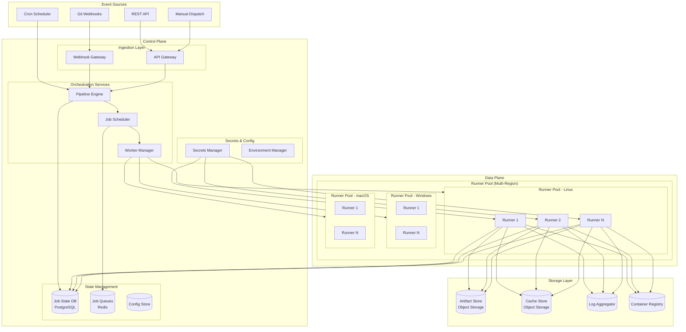
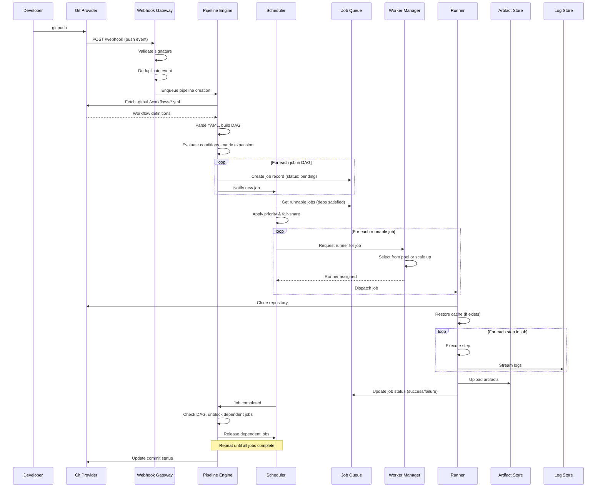
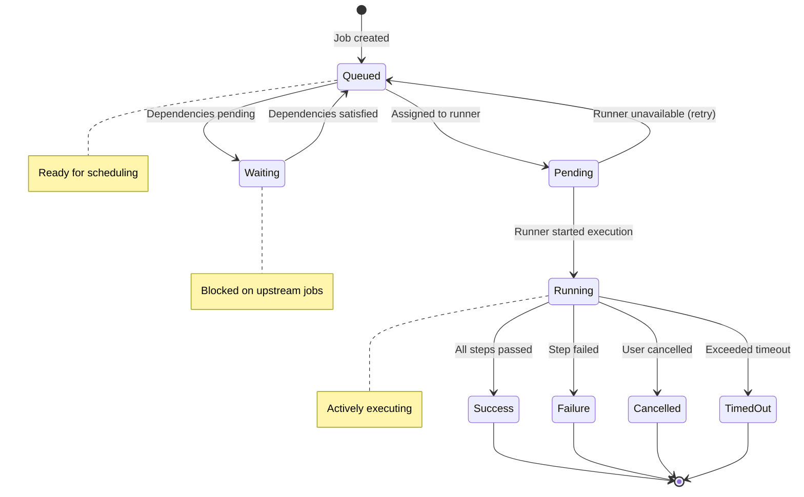
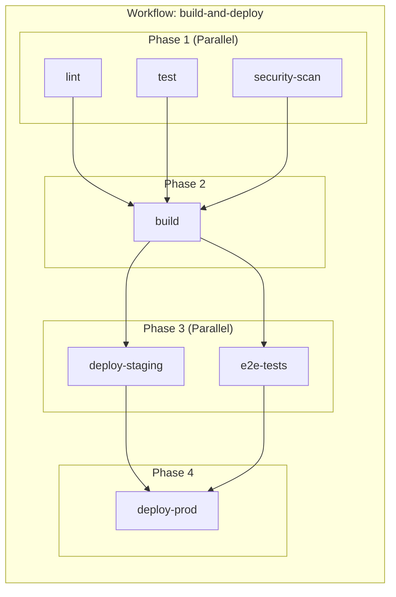
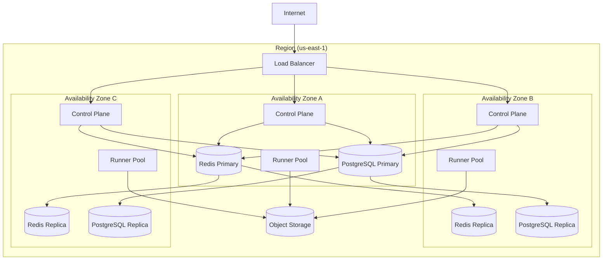
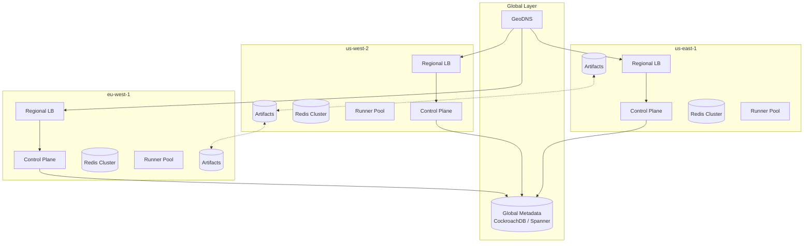

# High-Level Design

[← Back to Index](./00-index.md)

---

## System Architecture

### Control Plane vs Data Plane Overview



### Component Responsibilities

| Component | Layer | Responsibility |
|-----------|-------|---------------|
| **Webhook Gateway** | Control | Receive and validate Git events, deduplicate, rate limit |
| **API Gateway** | Control | External API endpoint, authentication, request routing |
| **Pipeline Engine** | Control | Parse workflow YAML, build DAG, create job records |
| **Job Scheduler** | Control | Queue management, priority scheduling, job-to-runner assignment |
| **Worker Manager** | Control | Runner lifecycle, health monitoring, autoscaling decisions |
| **Secrets Manager** | Control | Secure secret storage, OIDC token generation, access control |
| **Runner Pool** | Data | Execute jobs in isolated containers, report status |
| **Artifact Store** | Storage | Durable storage for build artifacts, cross-job sharing |
| **Cache Store** | Storage | Dependency and build caching, LRU eviction |
| **Log Aggregator** | Storage | Real-time log ingestion, streaming, retention |

---

## Data Flow

### Pipeline Execution Flow (Push Event to Completion)



### Job Lifecycle State Machine



### DAG Execution Pattern



---

## Key Architectural Decisions

### 1. Scheduler Architecture: Centralized vs Distributed

| Approach | Pros | Cons | Verdict |
|----------|------|------|---------|
| **Centralized scheduler** | Global view, fair-share easy, simpler | Scale limits, single point of failure | **Chosen (with HA)** |
| **Distributed schedulers** | No bottleneck, region-local | Complex fair-share, coordination overhead | For extreme scale |

**Rationale:** A centralized scheduler with multiple replicas (leader election) provides global visibility for fair-share scheduling across organizations. At 10K jobs/second decision rate, a single scheduler cluster is sufficient. Distributed scheduling adds complexity without benefit until reaching 100K+ concurrent jobs.

### 2. Runner Isolation: Container vs MicroVM vs VM

| Approach | Startup | Security | Cost | Verdict |
|----------|---------|----------|------|---------|
| **Container** | ~1s | Shared kernel | Low | **Private/trusted runners** |
| **MicroVM (Firecracker)** | ~125ms | Separate kernel | Medium | **Public/untrusted runners** |
| **Full VM** | 30-60s | Strongest | High | Legacy, special cases |

**Rationale:**
- Public runners (untrusted code) use microVMs for hardware-level isolation, preventing kernel exploits from affecting other tenants
- Self-hosted runners in trusted environments can use containers for faster startup and lower overhead
- Full VMs reserved for macOS (required by Apple) and specialized compliance needs

### 3. Job Queue: Redis vs Kafka vs PostgreSQL

| Approach | Pros | Cons | Verdict |
|----------|------|------|---------|
| **Redis (Sorted Sets)** | Fast, priority natural, atomic ops | Single-node limits, persistence concerns | **Primary queue** |
| **PostgreSQL** | Durable, ACID, complex queries | Higher latency, polling overhead | **Job state store** |
| **Kafka** | High throughput, replay | Complex for priority, overkill | Not needed |

**Rationale:** Use Redis sorted sets for job queues (score = priority × timestamp) with PostgreSQL as durable job state store. Redis handles real-time scheduling decisions; PostgreSQL provides durability and complex queries for job history.

### 4. Artifact Storage Strategy

| Approach | Pros | Cons | Verdict |
|----------|------|------|---------|
| **Object storage (S3/GCS)** | Unlimited scale, durability | Higher latency | **All artifacts** |
| **Database BLOBs** | Lower latency, transactional | Size limits, DB load | Small metadata only |
| **Dedicated artifact service** | Optimized for patterns | Operational overhead | Abstraction layer |

**Rationale:** Store all artifacts in object storage with content-addressable paths (SHA-256). An artifact service provides deduplication, access control, and streaming upload/download. Object storage handles scale; service handles logic.

### 5. Cache Strategy

| Tier | Location | Capacity | Latency | Purpose |
|------|----------|----------|---------|---------|
| **L1** | Runner local | 50 GB | <1ms | Hot layers, frequent deps |
| **L2** | Regional shared | 10 TB | <10ms | Cross-runner sharing |
| **L3** | Object storage | Unlimited | 50-200ms | Cold cache, persistence |

**Rationale:** Multi-tier caching minimizes build time. L1 for immediate reuse on same runner, L2 for regional sharing (most effective tier), L3 for durability and cross-region.

---

## Architecture Pattern Checklist

- [x] **Sync vs Async:** Both - sync for status APIs, async for job execution
- [x] **Event-driven vs Request-response:** Event-driven (webhooks trigger pipelines)
- [x] **Push vs Pull:** Push from Git; pull model for runner job claims
- [x] **Stateless vs Stateful:** Stateless runners; state in artifact store
- [x] **Read-heavy vs Write-heavy:** Write-heavy (logs, artifacts); read for status
- [x] **Real-time vs Batch:** Real-time job execution; batch for metrics
- [x] **Leader election:** For scheduler, pipeline engine HA

---

## Deployment Topologies

### Single Region (Multi-AZ)



### Multi-Region (Active-Active)



---

## Integration Points

### External Integrations

```
┌─────────────────────────────────────────────────────────────────┐
│                     Event Sources                                │
├──────────┬──────────┬──────────┬──────────┬────────────────────┤
│  GitHub  │  GitLab  │ Bitbucket│ External │     Scheduled      │
│ Webhooks │ Webhooks │ Webhooks │ Webhooks │      (Cron)        │
└────┬─────┴────┬─────┴────┬─────┴────┬─────┴───────┬────────────┘
     │          │          │          │             │
     ▼          ▼          ▼          ▼             ▼
┌─────────────────────────────────────────────────────────────────┐
│                   Webhook Gateway                                │
│   - Signature validation (HMAC)                                 │
│   - Rate limiting & deduplication                               │
│   - Event normalization                                         │
└────────────────────────────┬────────────────────────────────────┘
                             │
                             ▼
                    ┌────────────────┐
                    │ Pipeline Engine │
                    └────────────────┘
```

### Cloud Provider Integrations

```
┌─────────────────────────────────────────────────────────────────┐
│                     CI/CD Platform                               │
└──────┬────────────────────┬────────────────────┬────────────────┘
       │                    │                    │
       ▼                    ▼                    ▼
  ┌─────────┐         ┌──────────┐        ┌───────────┐
  │   AWS   │         │  Azure   │        │   GCP     │
  │ ─────── │         │ ──────── │        │ ───────── │
  │ OIDC    │         │ OIDC     │        │ OIDC      │
  │ S3      │         │ Blob     │        │ GCS       │
  │ ECR     │         │ ACR      │        │ GCR       │
  │ EKS     │         │ AKS      │        │ GKE       │
  └─────────┘         └──────────┘        └───────────┘
```

### Runner Communication Protocol

```
┌────────────────┐                    ┌─────────────────┐
│   Scheduler    │                    │     Runner      │
└───────┬────────┘                    └────────┬────────┘
        │                                      │
        │  1. Register (capabilities, labels)  │
        │<─────────────────────────────────────│
        │                                      │
        │  2. Claim job (long-poll / gRPC)     │
        │<─────────────────────────────────────│
        │                                      │
        │  3. Dispatch job (specs, secrets)    │
        │─────────────────────────────────────>│
        │                                      │
        │  4. Heartbeat (status, progress)     │
        │<─────────────────────────────────────│
        │           ... (periodic) ...         │
        │                                      │
        │  5. Complete (status, outputs)       │
        │<─────────────────────────────────────│
        │                                      │
        │  6. Release runner                   │
        │─────────────────────────────────────>│
```

---

## Failure Modes

| Failure | Impact | Mitigation |
|---------|--------|------------|
| **Webhook gateway down** | New pipelines not triggered | Multiple replicas behind LB, queue durably |
| **Pipeline engine down** | No new job creation | Leader election, pending events processed on recovery |
| **Scheduler down** | No new job assignments | Leader election, running jobs continue |
| **Redis down** | Queue operations fail | Redis Cluster, Sentinel failover |
| **PostgreSQL down** | No state persistence | Replicas, automatic failover |
| **Runner crash** | Single job fails | Automatic requeue, heartbeat timeout detection |
| **Artifact store unavailable** | Jobs fail on upload/download | Multi-AZ storage, retry with backoff |
| **Network partition** | Regional isolation | Jobs continue in isolated region, cross-region sync on recovery |

**Static Stability:** Running jobs continue execution even if control plane is unavailable. Runners maintain job state locally and sync status on recovery. New jobs queue durably and execute when scheduler recovers.
