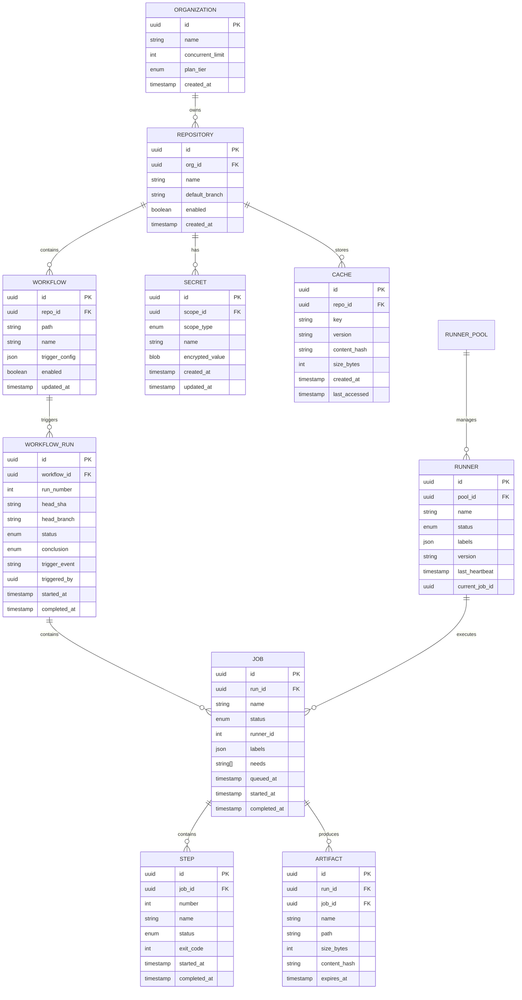
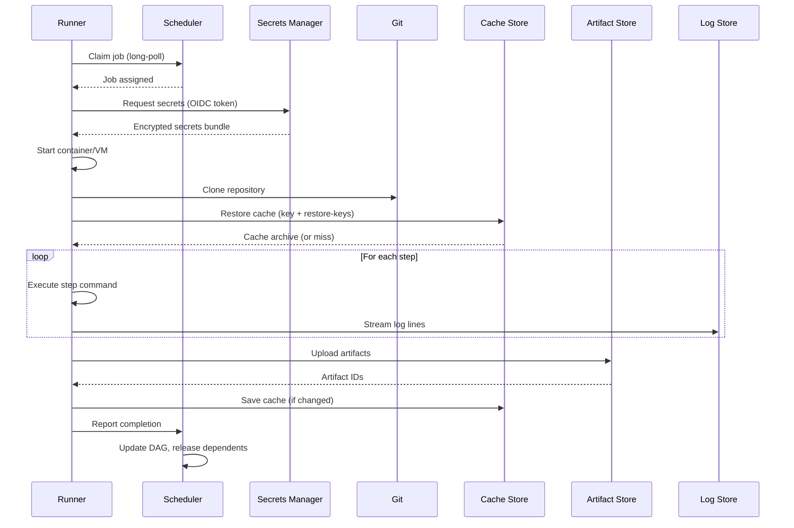

# Low-Level Design

[← Back to Index](./00-index.md)

---

## Data Model

### Entity Relationship Diagram



### PostgreSQL Schema

```sql
-- Organizations table
CREATE TABLE organizations (
    id UUID PRIMARY KEY DEFAULT gen_random_uuid(),
    name VARCHAR(255) NOT NULL UNIQUE,
    concurrent_job_limit INT DEFAULT 20,
    plan_tier VARCHAR(50) DEFAULT 'free',
    created_at TIMESTAMP WITH TIME ZONE DEFAULT NOW(),
    updated_at TIMESTAMP WITH TIME ZONE DEFAULT NOW()
);

-- Repositories table
CREATE TABLE repositories (
    id UUID PRIMARY KEY DEFAULT gen_random_uuid(),
    org_id UUID NOT NULL REFERENCES organizations(id),
    name VARCHAR(255) NOT NULL,
    full_name VARCHAR(512) NOT NULL UNIQUE,
    default_branch VARCHAR(255) DEFAULT 'main',
    enabled BOOLEAN DEFAULT true,
    created_at TIMESTAMP WITH TIME ZONE DEFAULT NOW(),
    UNIQUE(org_id, name)
);

-- Workflow runs table (partitioned by created_at for efficient cleanup)
CREATE TABLE workflow_runs (
    id UUID PRIMARY KEY DEFAULT gen_random_uuid(),
    repo_id UUID NOT NULL REFERENCES repositories(id),
    workflow_path VARCHAR(512) NOT NULL,
    run_number BIGINT NOT NULL,
    head_sha VARCHAR(40) NOT NULL,
    head_branch VARCHAR(255),
    status VARCHAR(50) NOT NULL DEFAULT 'queued',
    conclusion VARCHAR(50),
    trigger_event VARCHAR(50) NOT NULL,
    triggered_by UUID,
    event_payload JSONB,
    created_at TIMESTAMP WITH TIME ZONE DEFAULT NOW(),
    started_at TIMESTAMP WITH TIME ZONE,
    completed_at TIMESTAMP WITH TIME ZONE,
    UNIQUE(repo_id, run_number)
) PARTITION BY RANGE (created_at);

-- Jobs table
CREATE TABLE jobs (
    id UUID PRIMARY KEY DEFAULT gen_random_uuid(),
    run_id UUID NOT NULL REFERENCES workflow_runs(id) ON DELETE CASCADE,
    name VARCHAR(255) NOT NULL,
    status VARCHAR(50) NOT NULL DEFAULT 'queued',
    conclusion VARCHAR(50),
    runner_id UUID,
    runner_name VARCHAR(255),
    labels JSONB DEFAULT '[]',
    needs VARCHAR(255)[] DEFAULT '{}',
    matrix JSONB,
    outputs JSONB DEFAULT '{}',
    queued_at TIMESTAMP WITH TIME ZONE DEFAULT NOW(),
    started_at TIMESTAMP WITH TIME ZONE,
    completed_at TIMESTAMP WITH TIME ZONE,
    UNIQUE(run_id, name)
);

-- Steps table
CREATE TABLE steps (
    id UUID PRIMARY KEY DEFAULT gen_random_uuid(),
    job_id UUID NOT NULL REFERENCES jobs(id) ON DELETE CASCADE,
    number INT NOT NULL,
    name VARCHAR(255) NOT NULL,
    status VARCHAR(50) NOT NULL DEFAULT 'pending',
    conclusion VARCHAR(50),
    exit_code INT,
    started_at TIMESTAMP WITH TIME ZONE,
    completed_at TIMESTAMP WITH TIME ZONE,
    UNIQUE(job_id, number)
);

-- Artifacts table
CREATE TABLE artifacts (
    id UUID PRIMARY KEY DEFAULT gen_random_uuid(),
    run_id UUID NOT NULL REFERENCES workflow_runs(id) ON DELETE CASCADE,
    job_id UUID REFERENCES jobs(id),
    name VARCHAR(255) NOT NULL,
    storage_path VARCHAR(1024) NOT NULL,
    content_hash VARCHAR(64) NOT NULL,
    size_bytes BIGINT NOT NULL,
    expires_at TIMESTAMP WITH TIME ZONE NOT NULL,
    created_at TIMESTAMP WITH TIME ZONE DEFAULT NOW(),
    UNIQUE(run_id, name)
);

-- Runners table
CREATE TABLE runners (
    id UUID PRIMARY KEY DEFAULT gen_random_uuid(),
    pool_id UUID NOT NULL,
    name VARCHAR(255) NOT NULL,
    status VARCHAR(50) NOT NULL DEFAULT 'offline',
    labels JSONB DEFAULT '[]',
    os VARCHAR(50) NOT NULL,
    architecture VARCHAR(50) NOT NULL,
    version VARCHAR(50),
    current_job_id UUID,
    last_heartbeat TIMESTAMP WITH TIME ZONE,
    created_at TIMESTAMP WITH TIME ZONE DEFAULT NOW()
);

-- Secrets table (encrypted at rest)
CREATE TABLE secrets (
    id UUID PRIMARY KEY DEFAULT gen_random_uuid(),
    scope_type VARCHAR(50) NOT NULL, -- 'org', 'repo', 'environment'
    scope_id UUID NOT NULL,
    name VARCHAR(255) NOT NULL,
    encrypted_value BYTEA NOT NULL,
    created_at TIMESTAMP WITH TIME ZONE DEFAULT NOW(),
    updated_at TIMESTAMP WITH TIME ZONE DEFAULT NOW(),
    UNIQUE(scope_type, scope_id, name)
);

-- Cache entries table
CREATE TABLE cache_entries (
    id UUID PRIMARY KEY DEFAULT gen_random_uuid(),
    repo_id UUID NOT NULL REFERENCES repositories(id),
    cache_key VARCHAR(512) NOT NULL,
    version VARCHAR(255) NOT NULL,
    storage_path VARCHAR(1024) NOT NULL,
    content_hash VARCHAR(64) NOT NULL,
    size_bytes BIGINT NOT NULL,
    created_at TIMESTAMP WITH TIME ZONE DEFAULT NOW(),
    last_accessed TIMESTAMP WITH TIME ZONE DEFAULT NOW(),
    UNIQUE(repo_id, cache_key, version)
);

-- Indexes for common queries
CREATE INDEX idx_workflow_runs_repo_status ON workflow_runs(repo_id, status);
CREATE INDEX idx_workflow_runs_created_at ON workflow_runs(created_at DESC);
CREATE INDEX idx_jobs_run_id_status ON jobs(run_id, status);
CREATE INDEX idx_jobs_status_queued ON jobs(status, queued_at) WHERE status = 'queued';
CREATE INDEX idx_runners_status ON runners(status, last_heartbeat);
CREATE INDEX idx_cache_repo_key ON cache_entries(repo_id, cache_key);
CREATE INDEX idx_artifacts_hash ON artifacts(content_hash);
```

---

## Redis Data Structures

### Job Queues (Sorted Sets)

```
# Priority queues per label set (score = priority weight + timestamp for FIFO within priority)
# Key: queue:{label_hash}
# Score: (priority_weight * 1e12) + queued_timestamp_ms
# Member: job_id

ZADD queue:ubuntu-latest 1000000001642345678901 "job_uuid_1"
ZADD queue:ubuntu-latest 2000000001642345678902 "job_uuid_2"  # Higher priority
ZADD queue:windows-latest 1000000001642345678903 "job_uuid_3"

# Pop highest priority job for a runner
ZPOPMAX queue:ubuntu-latest

# Get queue depth
ZCARD queue:ubuntu-latest
```

### Organization Fair-Share State

```
# Track running jobs per organization
# Key: org_running:{org_id}
# Value: count

INCR org_running:org_uuid_1
DECR org_running:org_uuid_1
GET org_running:org_uuid_1

# Organization weight/quota
# Key: org_quota:{org_id}
HSET org_quota:org_uuid_1 limit 100 weight 1.0 running 45
```

### Worker Registration

```
# Runner heartbeat and state
# Key: runner:{runner_id}
# Fields: status, labels, current_job, last_heartbeat

HSET runner:runner_uuid_1 \
    status "busy" \
    labels '["ubuntu-latest", "self-hosted"]' \
    current_job "job_uuid_1" \
    last_heartbeat "1642345678"

# Expiring heartbeat key (TTL for stale detection)
SETEX runner_heartbeat:runner_uuid_1 30 "alive"

# Runner pool set
SADD runners:pool_1 runner_uuid_1 runner_uuid_2 runner_uuid_3
```

### Distributed Locks

```
# Job claim lock (prevents double assignment)
# Key: lock:job:{job_id}
# Value: runner_id
# TTL: 60 seconds (auto-release on crash)

SET lock:job:job_uuid_1 runner_uuid_1 NX EX 60

# Pipeline run lock (prevent duplicate triggers)
SET lock:pipeline:repo_uuid:sha:event runner_uuid NX EX 300
```

### DAG Execution State

```
# Track job dependencies completion
# Key: dag:{run_id}:{job_name}:deps_remaining
# Value: count of unfinished dependencies

SET dag:run_uuid:build:deps_remaining 3
DECR dag:run_uuid:build:deps_remaining

# When deps_remaining reaches 0, job becomes runnable
```

---

## API Design

### Webhook API (Inbound Events)

```
POST /webhooks/github
Content-Type: application/json
X-GitHub-Event: push
X-GitHub-Delivery: {delivery_id}
X-Hub-Signature-256: sha256={signature}

Request Body:
{
  "ref": "refs/heads/main",
  "before": "abc123",
  "after": "def456",
  "repository": {
    "id": 12345,
    "full_name": "org/repo",
    "default_branch": "main"
  },
  "pusher": {
    "name": "username",
    "email": "user@example.com"
  },
  "commits": [...]
}

Response:
202 Accepted
{
  "message": "Event queued for processing",
  "delivery_id": "{delivery_id}"
}
```

### Workflow Runs API

```
# List workflow runs
GET /repos/{owner}/{repo}/actions/runs
Query: status=in_progress&branch=main&per_page=30&page=1

Response:
{
  "total_count": 150,
  "workflow_runs": [
    {
      "id": "run_uuid_1",
      "name": "CI",
      "run_number": 42,
      "status": "in_progress",
      "conclusion": null,
      "head_branch": "main",
      "head_sha": "abc123",
      "created_at": "2024-01-15T10:30:00Z",
      "jobs_url": "/repos/org/repo/actions/runs/run_uuid_1/jobs"
    }
  ]
}

# Trigger workflow manually
POST /repos/{owner}/{repo}/actions/workflows/{workflow_id}/dispatches
{
  "ref": "main",
  "inputs": {
    "environment": "staging",
    "debug": "true"
  }
}

Response: 204 No Content
```

### Job Claim API (Runner → Scheduler)

```
# Long-poll for job assignment
POST /actions/runners/{runner_id}/jobs/claim
X-Runner-Token: {jwt_token}
X-Runner-Labels: ["ubuntu-latest", "self-hosted"]

Request Body:
{
  "runner_id": "runner_uuid_1",
  "labels": ["ubuntu-latest", "self-hosted"],
  "capabilities": {
    "os": "linux",
    "arch": "x64",
    "tools": ["docker", "node", "python"]
  }
}

Response (when job available):
200 OK
{
  "job_id": "job_uuid_1",
  "run_id": "run_uuid_1",
  "repo": "org/repo",
  "workflow": "ci.yml",
  "job_name": "build",
  "steps": [...],
  "secrets": {
    "encrypted_data": "...",
    "key_id": "key_uuid"
  },
  "services": [...],
  "timeout_minutes": 60
}

Response (no job, keep polling):
204 No Content
```

### Log Streaming API (WebSocket)

```
# WebSocket connection for live logs
WS /repos/{owner}/{repo}/actions/runs/{run_id}/jobs/{job_id}/logs/live

# Server sends log lines as they arrive
{
  "type": "log_line",
  "step": 3,
  "line_number": 145,
  "timestamp": "2024-01-15T10:35:22.123Z",
  "content": "Installing dependencies..."
}

# Step status updates
{
  "type": "step_status",
  "step": 3,
  "status": "completed",
  "conclusion": "success",
  "duration_ms": 45230
}

# Job completion
{
  "type": "job_complete",
  "conclusion": "success",
  "duration_ms": 180500
}
```

### Artifact API

```
# Upload artifact (multipart for large files)
POST /repos/{owner}/{repo}/actions/runs/{run_id}/artifacts
Content-Type: multipart/form-data

Form Data:
  name: "build-output"
  file: <binary data>

Response:
201 Created
{
  "id": "artifact_uuid_1",
  "name": "build-output",
  "size_bytes": 52428800,
  "content_hash": "sha256:abc123...",
  "expires_at": "2024-02-15T10:30:00Z",
  "download_url": "/repos/org/repo/actions/artifacts/artifact_uuid_1/download"
}

# Download artifact
GET /repos/{owner}/{repo}/actions/artifacts/{artifact_id}/download

Response:
302 Found
Location: https://storage.example.com/artifacts/sha256_abc123?token=...
```

---

## Core Algorithms

### DAG Execution Engine

```python
class DAGExecutor:
    """
    Execute jobs in dependency order with maximum parallelism.
    Time Complexity: O(V + E) for topological sort
    Space Complexity: O(V) for tracking state
    """

    def __init__(self, workflow_run):
        self.run_id = workflow_run.id
        self.jobs = {}  # job_name -> Job
        self.graph = {}  # job_name -> [dependent_job_names]
        self.in_degree = {}  # job_name -> number of unfinished dependencies
        self.status = {}  # job_name -> status

    def build_dag(self, workflow_definition):
        """Parse workflow YAML and build dependency graph."""
        for job_name, job_def in workflow_definition['jobs'].items():
            self.jobs[job_name] = Job(job_name, job_def)
            self.graph[job_name] = []
            self.in_degree[job_name] = 0
            self.status[job_name] = 'pending'

        # Build edges from 'needs' declarations
        for job_name, job_def in workflow_definition['jobs'].items():
            needs = job_def.get('needs', [])
            if isinstance(needs, str):
                needs = [needs]

            for dependency in needs:
                self.graph[dependency].append(job_name)
                self.in_degree[job_name] += 1

    def get_runnable_jobs(self):
        """Return jobs with all dependencies satisfied."""
        runnable = []
        for job_name, degree in self.in_degree.items():
            if degree == 0 and self.status[job_name] == 'pending':
                runnable.append(job_name)
        return runnable

    def mark_job_started(self, job_name):
        """Mark job as running."""
        self.status[job_name] = 'running'

    def mark_job_completed(self, job_name, conclusion):
        """
        Mark job complete and update dependent jobs.
        Returns newly runnable jobs.
        """
        self.status[job_name] = conclusion  # 'success' or 'failure'
        newly_runnable = []

        if conclusion == 'success':
            # Decrement in-degree of dependent jobs
            for dependent in self.graph[job_name]:
                self.in_degree[dependent] -= 1
                if self.in_degree[dependent] == 0:
                    newly_runnable.append(dependent)
        else:
            # Failure: mark all downstream as skipped
            self._propagate_failure(job_name)

        return newly_runnable

    def _propagate_failure(self, failed_job):
        """Mark all downstream jobs as skipped due to upstream failure."""
        visited = set()
        queue = [failed_job]

        while queue:
            current = queue.pop(0)
            for dependent in self.graph[current]:
                if dependent not in visited:
                    visited.add(dependent)
                    self.status[dependent] = 'skipped'
                    queue.append(dependent)

    def is_complete(self):
        """Check if all jobs have finished."""
        terminal_states = {'success', 'failure', 'skipped', 'cancelled'}
        return all(s in terminal_states for s in self.status.values())

    def get_overall_conclusion(self):
        """Determine workflow conclusion based on job results."""
        if any(s == 'failure' for s in self.status.values()):
            return 'failure'
        if any(s == 'cancelled' for s in self.status.values()):
            return 'cancelled'
        if all(s in {'success', 'skipped'} for s in self.status.values()):
            return 'success'
        return 'in_progress'
```

### Priority Fair-Share Scheduler

```python
class FairShareScheduler:
    """
    DRF-inspired scheduler balancing priority with organizational fairness.

    Key Concepts:
    - Priority classes: urgent (3x), high (2x), normal (1x), low (0.5x)
    - Fair-share: Organizations get capacity proportional to their quota
    - Starvation prevention: Jobs waiting too long get priority boost

    Time Complexity: O(log n) for job selection (priority queue)
    Space Complexity: O(orgs + jobs) for state tracking
    """

    PRIORITY_WEIGHTS = {
        'urgent': 3.0,    # Production deployments
        'high': 2.0,      # Main branch builds
        'normal': 1.0,    # Pull request builds
        'low': 0.5        # Scheduled/cron jobs
    }

    STARVATION_BOOST_INTERVAL_SEC = 60  # Boost priority every 60s waiting

    def __init__(self, redis_client, pg_client):
        self.redis = redis_client
        self.pg = pg_client

    def calculate_effective_priority(self, job):
        """
        Calculate job's effective priority considering:
        1. Base priority class weight
        2. Organization's current fair-share position
        3. Starvation prevention boost
        """
        # Base priority from job's priority class
        base_weight = self.PRIORITY_WEIGHTS.get(job.priority, 1.0)

        # Fair-share adjustment
        org_running = self.get_org_running_jobs(job.org_id)
        org_quota = self.get_org_quota(job.org_id)
        share_ratio = org_running / max(org_quota, 1)

        # Penalize orgs using more than their share
        # Range: 0.5 (at 2x quota) to 1.5 (at 0 usage)
        fair_share_modifier = max(0.5, 1.5 - share_ratio)

        # Starvation prevention: boost priority for long-waiting jobs
        wait_time_sec = time.time() - job.queued_at.timestamp()
        starvation_boost = wait_time_sec // self.STARVATION_BOOST_INTERVAL_SEC
        starvation_modifier = 1.0 + (starvation_boost * 0.1)  # +10% per minute

        effective_priority = base_weight * fair_share_modifier * starvation_modifier
        return effective_priority

    def enqueue_job(self, job):
        """Add job to appropriate queue with priority score."""
        priority = self.calculate_effective_priority(job)
        queue_key = self._get_queue_key(job.labels)

        # Score: higher priority = higher score (ZPOPMAX gets highest)
        # Use priority * 1e12 + timestamp for stable ordering within priority
        score = priority * 1e12 + job.queued_at.timestamp()

        self.redis.zadd(queue_key, {job.id: score})

    def select_next_job(self, runner):
        """
        Select best job for a runner from its compatible queues.
        Returns job_id or None if no jobs available.
        """
        compatible_queues = self._get_compatible_queues(runner.labels)

        best_job = None
        best_score = -1

        # Check each compatible queue for highest priority job
        for queue_key in compatible_queues:
            result = self.redis.zrange(queue_key, -1, -1, withscores=True)
            if result:
                job_id, score = result[0]
                if score > best_score:
                    best_job = job_id
                    best_score = score
                    best_queue = queue_key

        if best_job:
            # Atomically claim the job
            claimed = self._claim_job(best_job, best_queue, runner.id)
            if claimed:
                return best_job

        return None

    def _claim_job(self, job_id, queue_key, runner_id):
        """Atomically claim job using Redis transaction."""
        lock_key = f"lock:job:{job_id}"

        # Try to acquire lock
        acquired = self.redis.set(lock_key, runner_id, nx=True, ex=60)
        if not acquired:
            return False

        # Remove from queue
        removed = self.redis.zrem(queue_key, job_id)
        if removed == 0:
            self.redis.delete(lock_key)
            return False

        # Update job state
        self.pg.execute("""
            UPDATE jobs
            SET status = 'in_progress', runner_id = %s, started_at = NOW()
            WHERE id = %s AND status = 'queued'
        """, (runner_id, job_id))

        # Increment org running count
        org_id = self._get_job_org(job_id)
        self.redis.incr(f"org_running:{org_id}")

        return True

    def _get_queue_key(self, labels):
        """Generate queue key from sorted labels."""
        sorted_labels = sorted(labels)
        label_hash = hashlib.md5(','.join(sorted_labels).encode()).hexdigest()[:8]
        return f"queue:{label_hash}"

    def _get_compatible_queues(self, runner_labels):
        """Get all queues this runner can serve."""
        # Runner with labels [ubuntu-latest, self-hosted, gpu]
        # can serve jobs requiring any subset of those labels
        # Implementation: enumerate all subsets (for small label sets)
        # or use label matching logic
        return self._enumerate_queue_subsets(runner_labels)
```

### Content-Addressable Artifact Storage

```python
class ArtifactStore:
    """
    Content-addressable storage with deduplication.

    Key Features:
    - SHA-256 content hashing for deduplication
    - Multipart upload for large files
    - Signed URLs for secure download

    Time Complexity: O(n) for hashing (n = file size)
    Space Complexity: O(1) additional (streaming)
    """

    CHUNK_SIZE = 64 * 1024 * 1024  # 64 MB chunks

    def __init__(self, object_storage, metadata_db):
        self.storage = object_storage
        self.db = metadata_db

    def upload_artifact(self, run_id, job_id, name, file_stream):
        """
        Upload artifact with content-addressable deduplication.
        Returns artifact metadata.
        """
        # Calculate content hash while uploading
        hasher = hashlib.sha256()
        chunks = []
        total_size = 0

        # Stream to temporary location while hashing
        temp_path = f"temp/{run_id}/{uuid.uuid4()}"

        for chunk in self._read_chunks(file_stream):
            hasher.update(chunk)
            chunks.append(chunk)
            total_size += len(chunk)

        content_hash = hasher.hexdigest()
        final_path = f"artifacts/{content_hash[:2]}/{content_hash}"

        # Check if content already exists (deduplication)
        if not self.storage.exists(final_path):
            # Upload to final location
            self.storage.upload(final_path, b''.join(chunks))

        # Create artifact record (may point to existing content)
        artifact = self.db.execute("""
            INSERT INTO artifacts (run_id, job_id, name, storage_path,
                                   content_hash, size_bytes, expires_at)
            VALUES (%s, %s, %s, %s, %s, %s, NOW() + INTERVAL '90 days')
            ON CONFLICT (run_id, name)
            DO UPDATE SET storage_path = EXCLUDED.storage_path,
                          content_hash = EXCLUDED.content_hash,
                          size_bytes = EXCLUDED.size_bytes
            RETURNING *
        """, (run_id, job_id, name, final_path, content_hash, total_size))

        return artifact

    def download_artifact(self, artifact_id, requester):
        """Generate signed download URL."""
        artifact = self.db.get_artifact(artifact_id)

        # Check access permissions
        if not self._can_access(artifact, requester):
            raise PermissionDenied()

        # Generate time-limited signed URL
        signed_url = self.storage.generate_signed_url(
            artifact.storage_path,
            expiration_seconds=3600,
            method='GET'
        )

        return signed_url

    def cleanup_expired(self):
        """
        Remove expired artifacts.
        Only delete content if no other artifacts reference it.
        """
        expired = self.db.execute("""
            DELETE FROM artifacts
            WHERE expires_at < NOW()
            RETURNING content_hash, storage_path
        """)

        for content_hash, storage_path in expired:
            # Check if any other artifacts use this content
            references = self.db.execute("""
                SELECT COUNT(*) FROM artifacts
                WHERE content_hash = %s
            """, (content_hash,))[0][0]

            if references == 0:
                self.storage.delete(storage_path)

    def _read_chunks(self, stream):
        """Read stream in chunks."""
        while True:
            chunk = stream.read(self.CHUNK_SIZE)
            if not chunk:
                break
            yield chunk
```

### Cache Key Generation

```python
class CacheKeyGenerator:
    """
    Generate deterministic cache keys for build caching.

    Key Components:
    - Lockfile hash (package-lock.json, requirements.txt, etc.)
    - Build configuration hash
    - Platform identifier (os, arch)
    - Optional prefix from user

    Time Complexity: O(n) where n = total file size
    Space Complexity: O(1) for streaming hash
    """

    def generate_key(self, key_spec, context):
        """
        Generate cache key from specification.

        key_spec example:
        {
            "prefix": "npm-cache",
            "files": ["package-lock.json", "**/package-lock.json"],
            "env": ["NODE_VERSION"]
        }
        """
        components = []

        # 1. User prefix
        if key_spec.get('prefix'):
            components.append(key_spec['prefix'])

        # 2. Platform identifier
        components.append(f"{context.os}-{context.arch}")

        # 3. Hash of specified files
        file_hash = self._hash_files(key_spec.get('files', []), context)
        components.append(file_hash[:16])

        # 4. Environment variable values
        for env_var in key_spec.get('env', []):
            value = context.env.get(env_var, '')
            components.append(f"{env_var}={value}")

        return '-'.join(components)

    def _hash_files(self, patterns, context):
        """Hash contents of files matching patterns."""
        hasher = hashlib.sha256()
        matched_files = []

        for pattern in patterns:
            matched = glob.glob(pattern, recursive=True)
            matched_files.extend(matched)

        # Sort for deterministic ordering
        matched_files.sort()

        for filepath in matched_files:
            # Include filename in hash (detect renames)
            hasher.update(filepath.encode())
            with open(filepath, 'rb') as f:
                for chunk in iter(lambda: f.read(8192), b''):
                    hasher.update(chunk)

        return hasher.hexdigest()

    def generate_restore_keys(self, key_spec, context):
        """
        Generate fallback keys for partial cache matches.
        Less specific keys allow using older compatible caches.
        """
        restore_keys = []

        # Full key (exact match)
        full_key = self.generate_key(key_spec, context)
        restore_keys.append(full_key)

        # Prefix + platform (ignores file hash changes)
        prefix = key_spec.get('prefix', 'cache')
        platform = f"{context.os}-{context.arch}"
        restore_keys.append(f"{prefix}-{platform}-")

        # Prefix only (any platform)
        restore_keys.append(f"{prefix}-")

        return restore_keys
```

---

## Sequence Diagrams

### Complete Job Execution Flow


