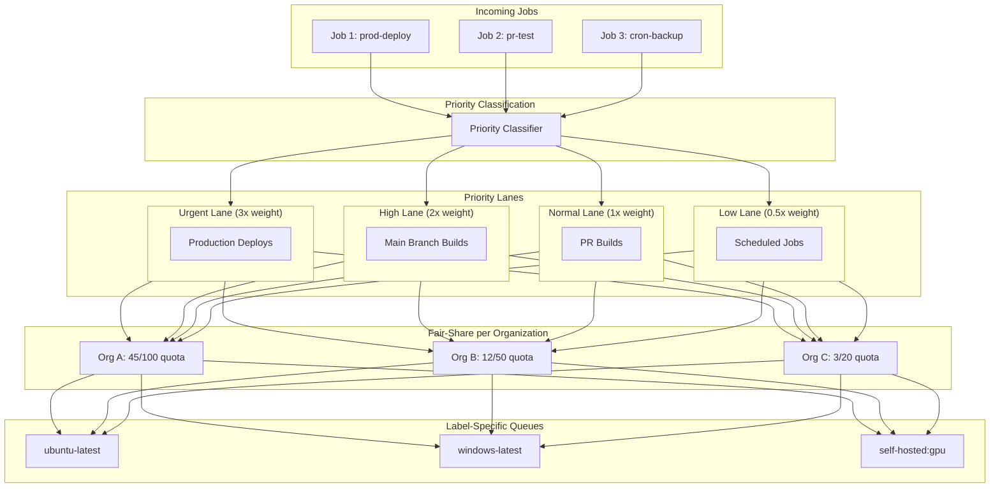
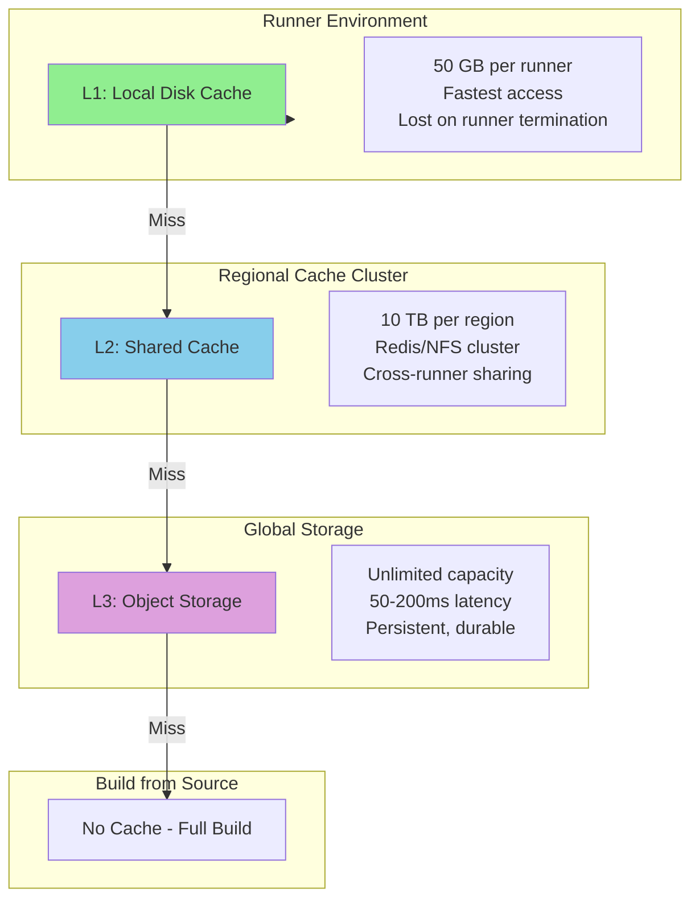
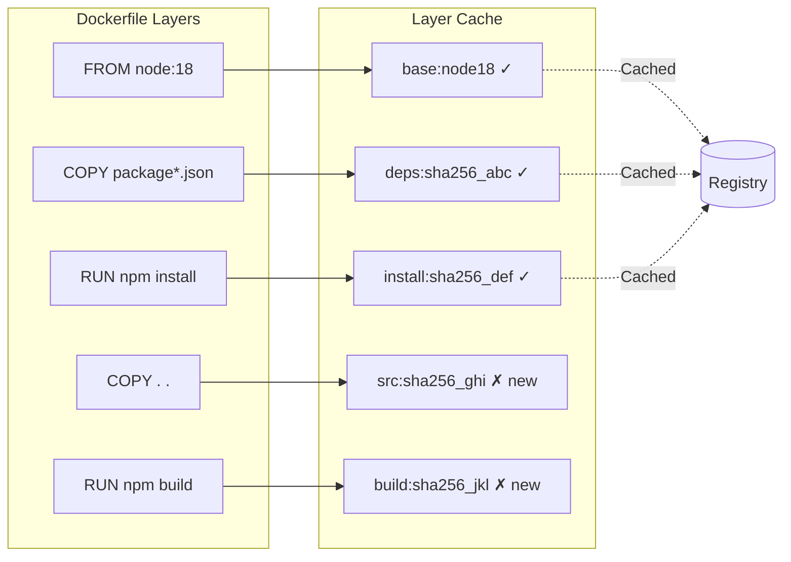
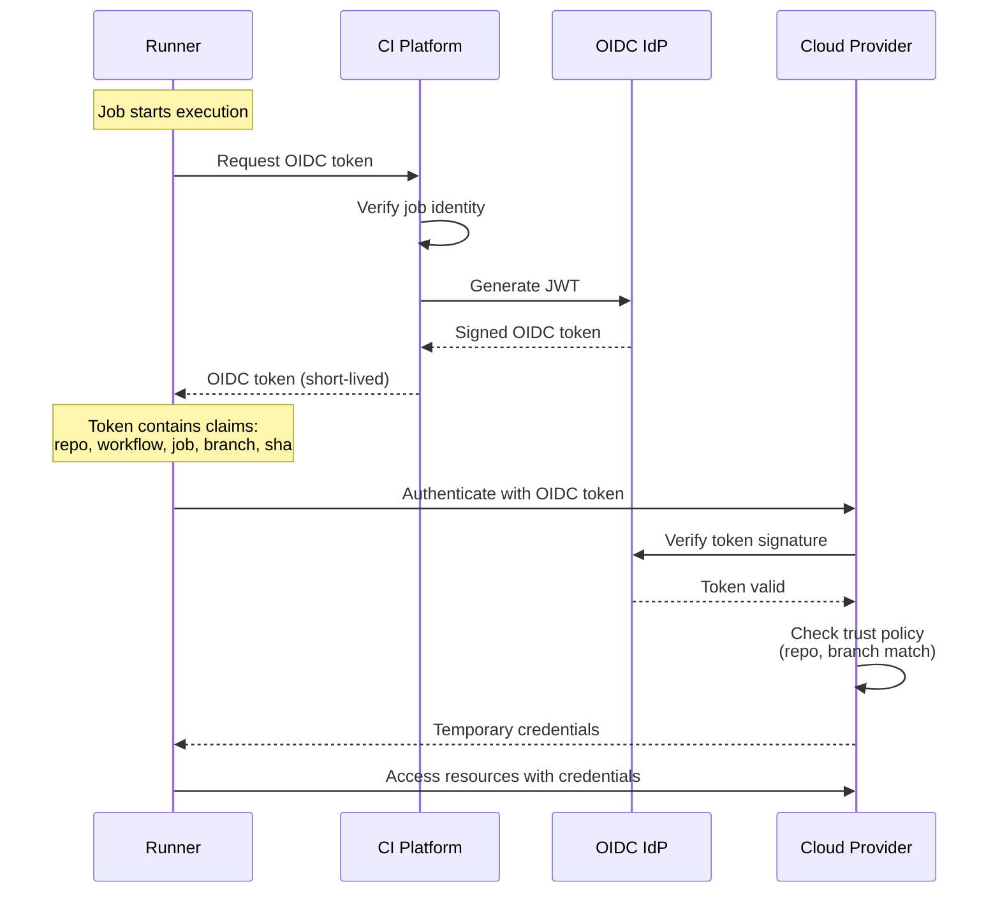
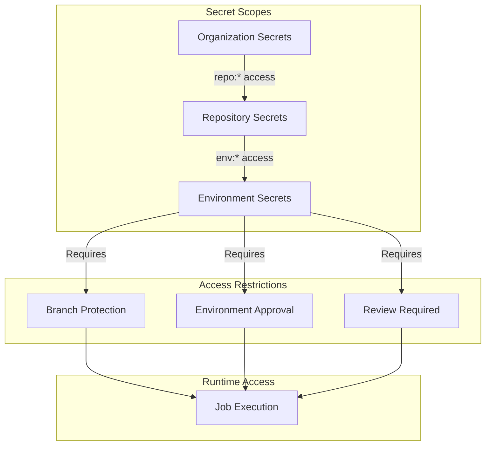

# Deep Dive & Bottlenecks

[← Back to Index](./00-index.md)

---

## Deep Dive 1: Job Scheduling at Scale

### The Scheduling Challenge

At 100K+ concurrent jobs with bursty traffic patterns, the scheduler must:
- Process 10K+ job decisions per second at peak
- Balance priority (urgent deployments) with fairness (prevent starvation)
- Handle heterogeneous runner labels (ubuntu-latest, windows, self-hosted, gpu)
- React quickly to runner availability changes

### Multi-Level Queue Architecture



### Fair-Share Algorithm

The scheduler implements a Dominant Resource Fairness (DRF) inspired algorithm:

```python
def calculate_org_priority_modifier(org_id):
    """
    Calculate priority modifier based on organization's resource usage.

    Returns value between 0.5 (penalized) and 1.5 (boosted):
    - Orgs using 0% of quota get 1.5x priority
    - Orgs using 100% of quota get 1.0x priority
    - Orgs using 200%+ of quota get 0.5x priority
    """
    running_jobs = get_running_jobs(org_id)
    quota = get_org_quota(org_id)

    if quota == 0:
        return 0.5  # No quota = minimum priority

    usage_ratio = running_jobs / quota

    if usage_ratio <= 0:
        return 1.5
    elif usage_ratio >= 2.0:
        return 0.5
    else:
        # Linear interpolation: 1.5 at 0%, 0.5 at 200%
        return 1.5 - (usage_ratio * 0.5)

def select_next_job(available_runners):
    """
    Select highest effective priority job matching available runners.
    """
    best_job = None
    best_score = -1

    for runner in available_runners:
        compatible_queues = get_queues_for_labels(runner.labels)

        for queue in compatible_queues:
            job = peek_highest_priority(queue)
            if job:
                effective_score = calculate_effective_score(job)
                if effective_score > best_score:
                    best_job = job
                    best_score = effective_score
                    best_runner = runner

    if best_job:
        claim_job(best_job, best_runner)

    return best_job, best_runner
```

### Queue Sharding Strategy

To avoid single-queue bottlenecks:

```
Label Hash Sharding:
- Jobs with labels ["ubuntu-latest"] → queue:hash("ubuntu-latest") → queue:a3f2
- Jobs with labels ["ubuntu-latest", "self-hosted"] → queue:hash("self-hosted,ubuntu-latest") → queue:7b91

Partition Strategy:
- 256 queue shards
- Consistent hashing on sorted label string
- Each scheduler instance handles subset of shards
- Leader election per shard for exactly-once assignment
```

---

## Deep Dive 2: Build Caching Architecture

### Cache Hierarchy



### Cache Key Strategy

```yaml
# Example workflow cache configuration
- name: Cache node modules
  uses: actions/cache@v3
  with:
    path: ~/.npm
    key: ${{ runner.os }}-node-${{ hashFiles('**/package-lock.json') }}
    restore-keys: |
      ${{ runner.os }}-node-
      ${{ runner.os }}-
```

**Key Generation Algorithm:**

```python
def generate_cache_key(spec, context):
    """
    Build deterministic cache key from specification.

    Components (in order):
    1. Explicit prefix (user-defined)
    2. Platform (os-arch)
    3. File content hash (lockfiles)
    4. Environment variables (if specified)
    """
    components = []

    # Prefix provides namespace
    components.append(spec.prefix or "cache")

    # Platform ensures binary compatibility
    components.append(f"{context.os}-{context.arch}")

    # Content hash captures dependency versions
    if spec.hash_files:
        file_hash = hash_files(spec.hash_files)
        components.append(file_hash[:16])

    return "-".join(components)

def hash_files(patterns):
    """SHA-256 of matched file contents."""
    hasher = hashlib.sha256()

    files = []
    for pattern in patterns:
        files.extend(glob.glob(pattern, recursive=True))

    for f in sorted(files):  # Deterministic order
        hasher.update(f.encode())  # Include path
        hasher.update(open(f, 'rb').read())

    return hasher.hexdigest()
```

### Cache Invalidation Patterns

| Scenario | Invalidation Trigger | Strategy |
|----------|---------------------|----------|
| Lockfile change | File hash differs | New key, old cache unused |
| Major version bump | User updates prefix | New namespace |
| Cache corruption | Checksum mismatch on restore | Delete and rebuild |
| TTL expiration | Time-based (7-30 days) | LRU eviction |
| Manual purge | User API call | Delete all matching keys |

### Docker Layer Caching



**Optimization techniques:**
1. **Inline cache** - Push cache metadata to registry with image
2. **Cache-from** - Pull cache layers from previous builds
3. **BuildKit cache mounts** - Persistent package manager caches

---

## Deep Dive 3: Secrets Management

### OIDC-Based Authentication Flow



### Token Claims Structure

```json
{
  "iss": "https://token.actions.example.com",
  "sub": "repo:org/repo:ref:refs/heads/main",
  "aud": "https://example.com",
  "exp": 1642345678,
  "iat": 1642342078,

  "repository": "org/repo",
  "repository_owner": "org",
  "workflow": "deploy.yml",
  "job_workflow_ref": "org/repo/.github/workflows/deploy.yml@refs/heads/main",
  "ref": "refs/heads/main",
  "sha": "abc123def456",
  "actor": "username",
  "event_name": "push",
  "environment": "production",
  "runner_environment": "github-hosted"
}
```

### Secret Scoping and Restrictions



### Secret Injection Security

```python
class SecretInjector:
    """
    Securely inject secrets into job execution environment.
    """

    def prepare_secrets(self, job, job_token):
        """
        Prepare encrypted secrets bundle for runner.
        """
        # 1. Resolve applicable secrets based on scope
        secrets = self.resolve_secrets(job)

        # 2. Check environment protection rules
        if job.environment:
            self.check_environment_rules(job)

        # 3. Filter secrets based on branch/tag restrictions
        filtered = self.filter_by_restrictions(secrets, job)

        # 4. Encrypt bundle with job-specific key
        encrypted = self.encrypt_bundle(filtered, job_token)

        # 5. Generate OIDC token if configured
        oidc_token = self.generate_oidc_token(job)

        return {
            'encrypted_secrets': encrypted,
            'oidc_token': oidc_token,
            'key_id': job_token.key_id
        }

    def mask_in_logs(self, log_line, secrets):
        """
        Replace secret values with *** in log output.
        """
        masked = log_line
        for secret in secrets:
            # Mask the value
            masked = masked.replace(secret.value, '***')
            # Also mask common encodings
            masked = masked.replace(base64.b64encode(secret.value), '***')
            masked = masked.replace(urllib.parse.quote(secret.value), '***')
        return masked
```

---

## Bottleneck Analysis

### Bottleneck 1: Queue Contention at Scale

**Problem:** Single Redis instance becomes bottleneck at 50K+ operations/second.

**Symptoms:**
- High latency on ZADD/ZPOPMAX operations
- Redis CPU saturation
- Job pickup latency increases

**Solutions:**

```
1. Redis Cluster with Queue Sharding
   - Shard queues by label hash
   - Each shard handles subset of label combinations
   - Horizontal scaling: add shards as load increases

2. Local Scheduler Caches
   - Scheduler caches available runners locally
   - Reduces Redis reads for runner state
   - Eventual consistency acceptable (heartbeat interval)

3. Batch Operations
   - Batch multiple job enqueues in pipeline
   - Reduce round-trips to Redis
   - Trade latency for throughput

Implementation:
┌─────────────┐     ┌─────────────┐     ┌─────────────┐
│ Scheduler 1 │     │ Scheduler 2 │     │ Scheduler 3 │
└──────┬──────┘     └──────┬──────┘     └──────┬──────┘
       │                   │                   │
       ▼                   ▼                   ▼
┌──────────────────────────────────────────────────────┐
│                  Redis Cluster                        │
│ ┌─────────┐ ┌─────────┐ ┌─────────┐ ┌─────────┐     │
│ │ Shard 1 │ │ Shard 2 │ │ Shard 3 │ │ Shard N │     │
│ │ a-f     │ │ g-m     │ │ n-s     │ │ t-z     │     │
│ └─────────┘ └─────────┘ └─────────┘ └─────────┘     │
└──────────────────────────────────────────────────────┘
```

### Bottleneck 2: Artifact Upload Throughput

**Problem:** End of parallel jobs causes artifact upload storm.

**Symptoms:**
- Object storage rate limiting
- Upload failures, retries
- Pipeline completion delays

**Solutions:**

```
1. Multipart Upload with Parallelism
   - Split large artifacts into chunks
   - Upload chunks in parallel (10-50 concurrent)
   - Assemble on completion

2. Pre-signed URL Offloading
   - Generate signed URLs from control plane
   - Runners upload directly to storage
   - Reduces control plane bandwidth

3. Regional Upload Endpoints
   - Route to nearest storage region
   - CDN for download acceleration
   - Cross-region replication async

4. Rate Limiting with Backoff
   - Per-org upload rate limits
   - Exponential backoff on 429
   - Priority for smaller artifacts

Upload Pipeline:
┌────────┐    ┌─────────────┐    ┌────────────────┐
│ Runner │───>│ Get Signed  │───>│ Direct Upload  │
│        │    │ URL from    │    │ to Object      │
│        │    │ Control     │    │ Storage        │
└────────┘    │ Plane       │    └────────────────┘
              └─────────────┘           │
                                        ▼
                               ┌────────────────┐
                               │ Confirm Upload │
                               │ to Control     │
                               │ Plane          │
                               └────────────────┘
```

### Bottleneck 3: Log Aggregation Throughput

**Problem:** 10M+ log lines/second from concurrent jobs.

**Symptoms:**
- Log delivery latency > 5s
- Dropped log lines
- Log service saturation

**Solutions:**

```
1. Local Buffering with Batch Flush
   - Buffer logs in runner memory
   - Flush every 100 lines or 1 second
   - Reduce API call overhead

2. Dedicated Log Ingestion Pipeline
   - Separate from control plane
   - Kafka/Kinesis for high throughput
   - Consumers write to log storage

3. Log Compression
   - Gzip compression at runner
   - 5-10x reduction in bandwidth
   - Decompress on read

4. Tiered Log Storage
   - Hot: Elasticsearch (7 days)
   - Warm: Object storage (30 days)
   - Cold: Compressed archive (90 days)

Architecture:
┌──────────┐    ┌──────────────┐    ┌─────────────┐
│ Runners  │───>│ Log Ingestion│───>│ Kafka       │
│ (batch)  │    │ Gateway      │    │ Partitioned │
└──────────┘    └──────────────┘    │ by job_id   │
                                    └──────┬──────┘
                                           │
                    ┌──────────────────────┼───────────────────────┐
                    ▼                      ▼                       ▼
            ┌──────────────┐      ┌──────────────┐       ┌──────────────┐
            │ Elasticsearch│      │ Live Stream  │       │ Object       │
            │ (Search)     │      │ (WebSocket)  │       │ Storage      │
            └──────────────┘      └──────────────┘       └──────────────┘
```

### Bottleneck 4: Runner Startup Latency

**Problem:** Cold runner startup adds 30-60s to job execution.

**Symptoms:**
- High p99 job pickup latency
- Poor utilization during ramp-up
- User complaints about slow starts

**Solutions:**

```
1. Warm Pool Maintenance
   - Keep percentage of runners warm
   - Pre-boot during low-traffic periods
   - Predictive scaling based on patterns

2. MicroVM Snapshot Restore
   - Firecracker snapshot after base init
   - Restore in ~125ms vs 30s boot
   - Pre-cached base images

3. Container Pre-pulling
   - Pull common images during idle
   - Layer cache across runners
   - Parallel image pulls

4. Runner Affinity
   - Route similar jobs to same runner
   - Maximize cache reuse
   - Reduce setup time

Warm Pool Strategy:
Time       ──────────────────────────────────────>
Load:      ▁▁▂▂▃▄▅▆▇█▇▆▅▄▃▂▂▁▁▁▁▁▁▂▃▄▅▆█
Warm Pool: ▂▂▂▂▃▃▄▅▆▇▇▆▅▄▃▃▂▂▂▂▂▂▃▃▄▅▆▇

- Scale warm pool ahead of expected load
- Use historical patterns (day of week, hour)
- Monitor queue depth for reactive scaling
```

---

## Race Conditions & Edge Cases

### Race Condition 1: Duplicate Job Execution

**Scenario:** Network partition causes scheduler to assign same job twice.

```python
# Problem: Two runners claim same job
Runner A: ZPOPMAX queue:ubuntu → job_123
Runner B: ZPOPMAX queue:ubuntu → job_123 (before A's removal propagates)

# Solution: Distributed lock with atomic claim
def claim_job(job_id, runner_id):
    # Atomic lock acquisition
    lock_key = f"job_lock:{job_id}"
    acquired = redis.set(lock_key, runner_id, nx=True, ex=300)

    if not acquired:
        return None  # Another runner claimed it

    # Verify job still in queue and remove
    removed = redis.zrem(f"queue:{job.labels_hash}", job_id)
    if removed == 0:
        redis.delete(lock_key)
        return None  # Job was already claimed

    # Update database state
    db.update_job_status(job_id, 'running', runner_id)

    return job_id
```

### Race Condition 2: DAG Dependency Resolution

**Scenario:** Two jobs complete simultaneously, both try to unblock same dependent.

```python
# Problem: Both jobs decrement dependency counter
Job A completes: deps_remaining[C] = 2 - 1 = 1
Job B completes: deps_remaining[C] = 2 - 1 = 1  # Wrong! Should be 0

# Solution: Atomic decrement with Lua script
DECR_AND_CHECK = """
local remaining = redis.call('DECR', KEYS[1])
if remaining == 0 then
    redis.call('LPUSH', KEYS[2], ARGV[1])  -- Add to runnable queue
    return 1
end
return 0
"""

def on_job_complete(job_id, run_id):
    for dependent in get_dependents(job_id):
        key = f"dag:{run_id}:{dependent}:deps"
        queue = f"runnable:{run_id}"
        result = redis.eval(DECR_AND_CHECK, [key, queue], [dependent])
        if result == 1:
            notify_scheduler(dependent)
```

### Edge Case: Circular Dependency Detection

```python
def validate_workflow(workflow_def):
    """Detect cycles in job dependencies."""
    jobs = workflow_def['jobs']
    graph = {name: job.get('needs', []) for name, job in jobs.items()}

    visited = set()
    rec_stack = set()

    def has_cycle(node):
        visited.add(node)
        rec_stack.add(node)

        for neighbor in graph.get(node, []):
            if neighbor not in visited:
                if has_cycle(neighbor):
                    return True
            elif neighbor in rec_stack:
                return True

        rec_stack.remove(node)
        return False

    for job_name in jobs:
        if job_name not in visited:
            if has_cycle(job_name):
                raise ValidationError(f"Circular dependency detected involving {job_name}")
```

### Edge Case: Runner Crash Mid-Job

```python
def detect_stale_jobs():
    """
    Find jobs where runner stopped heartbeating.
    Requeue for execution on different runner.
    """
    stale_threshold = timedelta(minutes=5)

    stale_jobs = db.query("""
        SELECT j.id, j.runner_id
        FROM jobs j
        JOIN runners r ON j.runner_id = r.id
        WHERE j.status = 'running'
        AND r.last_heartbeat < NOW() - INTERVAL '5 minutes'
    """)

    for job in stale_jobs:
        # Mark runner as offline
        db.update_runner_status(job.runner_id, 'offline')

        # Requeue job (idempotent)
        requeue_job(job.id, reason='runner_timeout')

def requeue_job(job_id, reason):
    """Requeue job for retry on different runner."""
    job = db.get_job(job_id)

    if job.retry_count >= MAX_RETRIES:
        db.update_job_status(job_id, 'failed', conclusion='runner_failure')
        return

    db.execute("""
        UPDATE jobs
        SET status = 'queued',
            runner_id = NULL,
            retry_count = retry_count + 1,
            queued_at = NOW()
        WHERE id = %s
    """, (job_id,))

    # Re-add to queue
    scheduler.enqueue_job(job)
```
