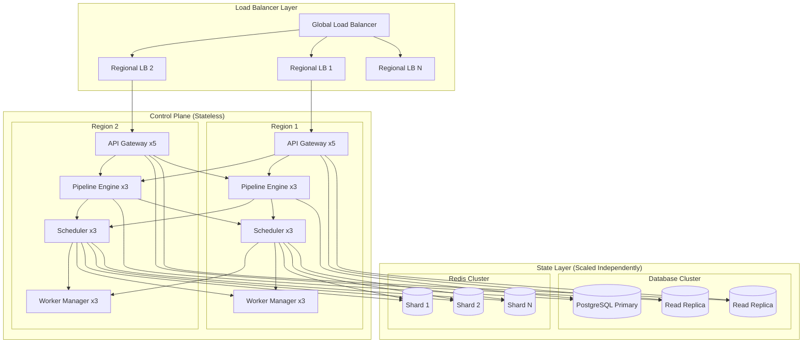
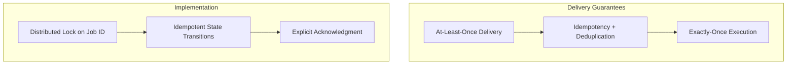
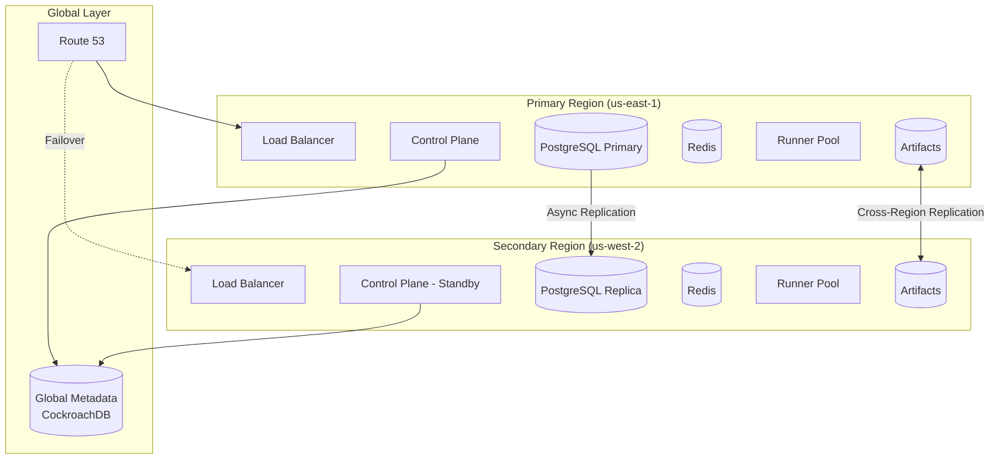

# Scalability & Reliability

[← Back to Index](./00-index.md)

---

## Horizontal Scaling Strategies

### Control Plane Scaling



### Scaling Dimensions

| Component | Scaling Trigger | Scaling Strategy |
|-----------|-----------------|------------------|
| **API Gateway** | Requests/sec > threshold | Horizontal pods, auto-scale on CPU/requests |
| **Pipeline Engine** | Pipeline creation queue depth | Horizontal, partition by repo hash |
| **Scheduler** | Job queue depth, latency | Leader-per-shard, add shards |
| **Worker Manager** | Runner count, heartbeat volume | Horizontal, consistent hashing |
| **PostgreSQL** | Read load, write latency | Read replicas, connection pooling |
| **Redis** | Memory usage, ops/sec | Cluster sharding, add nodes |
| **Object Storage** | Bandwidth, request rate | Managed service auto-scales |

### Worker Pool Autoscaling

```python
class WorkerAutoscaler:
    """
    Autoscale runner pool based on queue depth and historical patterns.

    Strategy:
    - Target: Clear queue within 5 minutes
    - Min pool: 10% of peak (warm capacity)
    - Max pool: Account limits
    - Scale-up: Aggressive (1 minute)
    - Scale-down: Conservative (10 minutes)
    """

    TARGET_CLEAR_TIME_SEC = 300  # 5 minutes
    SCALE_UP_INTERVAL = 60      # 1 minute
    SCALE_DOWN_INTERVAL = 600   # 10 minutes

    def calculate_desired_capacity(self, label_set):
        """Determine target runner count for a label set."""

        # Current queue depth
        queue_depth = self.get_queue_depth(label_set)

        # Average job duration for this label set
        avg_duration = self.get_avg_duration(label_set)

        # Jobs that can complete in target time
        jobs_per_runner = self.TARGET_CLEAR_TIME_SEC / max(avg_duration, 60)

        # Runners needed to clear queue
        runners_for_queue = math.ceil(queue_depth / jobs_per_runner)

        # Add currently running jobs (can't reduce below)
        running = self.get_running_count(label_set)

        # Historical pattern adjustment
        time_of_day_multiplier = self.get_time_pattern(label_set)

        # Calculate target
        target = max(
            runners_for_queue + running,
            int(self.get_peak_capacity(label_set) * 0.1),  # Min warm
        )

        target = min(target, self.get_max_capacity(label_set))  # Cap

        return int(target * time_of_day_multiplier)

    def scale_decision(self, label_set):
        """Make scaling decision with hysteresis."""
        current = self.get_current_capacity(label_set)
        desired = self.calculate_desired_capacity(label_set)

        if desired > current:
            # Scale up immediately
            return ScaleAction(
                direction='up',
                count=desired - current,
                urgency='immediate'
            )
        elif desired < current * 0.7:  # 30% buffer before scale-down
            # Scale down conservatively
            return ScaleAction(
                direction='down',
                count=current - desired,
                urgency='delayed'  # Wait SCALE_DOWN_INTERVAL
            )

        return ScaleAction(direction='none')
```

---

## Reliability Patterns

### Exactly-Once Job Execution



**Implementation:**

```python
def execute_job_exactly_once(job_id, runner_id):
    """
    Ensure job executes exactly once across failures.
    """
    lock_key = f"job_execution:{job_id}"

    # 1. Acquire distributed lock
    lock = redis.lock(lock_key, timeout=job.timeout_seconds)
    if not lock.acquire(blocking=False):
        logger.info(f"Job {job_id} already being executed")
        return

    try:
        # 2. Check idempotency - already completed?
        job = db.get_job(job_id)
        if job.status in ['success', 'failure', 'cancelled']:
            logger.info(f"Job {job_id} already in terminal state")
            return

        # 3. Mark as running (idempotent update)
        db.execute("""
            UPDATE jobs
            SET status = 'running', runner_id = %s, started_at = NOW()
            WHERE id = %s AND status IN ('queued', 'pending')
        """, (runner_id, job_id))

        # 4. Execute job
        result = execute_job_steps(job)

        # 5. Mark complete (terminal state)
        db.execute("""
            UPDATE jobs
            SET status = %s, conclusion = %s, completed_at = NOW()
            WHERE id = %s AND status = 'running'
        """, (result.status, result.conclusion, job_id))

    finally:
        lock.release()
```

### Heartbeat-Based Health Monitoring

```python
class RunnerHealthMonitor:
    """
    Monitor runner health via heartbeats.
    Detect failures and trigger recovery.
    """

    HEARTBEAT_INTERVAL = 10      # seconds
    HEARTBEAT_TIMEOUT = 30       # seconds
    ZOMBIE_THRESHOLD = 60        # seconds

    def process_heartbeat(self, runner_id, heartbeat):
        """Update runner state from heartbeat."""
        redis.hset(f"runner:{runner_id}", mapping={
            'status': heartbeat.status,
            'current_job': heartbeat.job_id,
            'last_heartbeat': time.time(),
            'progress': heartbeat.progress
        })

        # Extend job lock if executing
        if heartbeat.job_id:
            redis.expire(f"job_execution:{heartbeat.job_id}",
                        heartbeat.expected_remaining + 60)

    def detect_failed_runners(self):
        """Find runners that stopped heartbeating."""
        now = time.time()
        failed = []

        for runner_id in redis.smembers("active_runners"):
            last_hb = redis.hget(f"runner:{runner_id}", 'last_heartbeat')

            if now - float(last_hb) > self.HEARTBEAT_TIMEOUT:
                failed.append(runner_id)

        return failed

    def recover_from_runner_failure(self, runner_id):
        """Handle runner failure - requeue jobs."""
        runner = redis.hgetall(f"runner:{runner_id}")

        # Mark runner offline
        redis.hset(f"runner:{runner_id}", 'status', 'offline')
        redis.srem("active_runners", runner_id)

        # Requeue any active job
        if runner.get('current_job'):
            requeue_job(
                runner['current_job'],
                reason='runner_failure',
                preserve_logs=True
            )

        # Trigger replacement runner
        autoscaler.request_replacement(runner_id)
```

### Failure Recovery Scenarios

| Failure | Detection | Recovery | RTO |
|---------|-----------|----------|-----|
| **Runner crash** | Heartbeat timeout (30s) | Requeue job, spawn replacement | 1-2 min |
| **Scheduler crash** | Leader health check | Failover to standby | 10-30s |
| **PostgreSQL primary** | Connection failure | Promote replica | 30-60s |
| **Redis shard** | Cluster health | Sentinel failover | 10-30s |
| **Region failure** | Cross-region probe | DNS failover | 1-5 min |
| **Object storage** | Request failures | Retry + fallback region | Automatic |

### Job Retry Strategy

```python
class JobRetryPolicy:
    """
    Configure retry behavior for failed jobs.
    """

    def __init__(self):
        self.max_retries = 3
        self.retry_delay_base = 60  # seconds
        self.retry_delay_max = 600  # 10 minutes
        self.retryable_failures = {
            'runner_failure',
            'timeout',
            'infrastructure_error',
            'rate_limited'
        }

    def should_retry(self, job, failure_reason):
        """Determine if job should be retried."""
        if failure_reason not in self.retryable_failures:
            return False

        if job.retry_count >= self.max_retries:
            return False

        return True

    def get_retry_delay(self, job):
        """Calculate delay before retry (exponential backoff)."""
        delay = self.retry_delay_base * (2 ** job.retry_count)
        delay = min(delay, self.retry_delay_max)
        # Add jitter to prevent thundering herd
        delay += random.uniform(0, delay * 0.1)
        return delay

    def retry_job(self, job, failure_reason):
        """Schedule job for retry."""
        if not self.should_retry(job, failure_reason):
            return False

        delay = self.get_retry_delay(job)

        db.execute("""
            UPDATE jobs
            SET status = 'queued',
                retry_count = retry_count + 1,
                queued_at = NOW() + INTERVAL '%s seconds',
                last_failure_reason = %s
            WHERE id = %s
        """, (delay, failure_reason, job.id))

        # Schedule delayed queue insertion
        scheduler.schedule_enqueue(job.id, delay)

        return True
```

---

## Disaster Recovery

### Multi-Region Architecture



### RPO/RTO Targets

| Component | RPO | RTO | Strategy |
|-----------|-----|-----|----------|
| **Job state** | 0 (no loss) | 5 min | Synchronous to global DB |
| **Artifacts** | 0 (no loss) | 1 hour | Cross-region replication |
| **Logs** | 5 min | 1 hour | Async replication |
| **Cache** | N/A (reconstructible) | On-demand | Cache miss triggers rebuild |
| **Runners** | N/A (stateless) | 5 min | Auto-scale in target region |

### Regional Failover Procedure

```python
class RegionalFailover:
    """
    Orchestrate failover to secondary region.
    """

    def initiate_failover(self, from_region, to_region, reason):
        """
        Failover procedure:
        1. Stop accepting new work in primary
        2. Drain running jobs (or requeue)
        3. Promote secondary database
        4. Update DNS
        5. Verify secondary operational
        """
        logger.critical(f"Initiating failover: {from_region} -> {to_region}")

        # 1. Mark primary as draining
        self.set_region_status(from_region, 'draining')

        # 2. Stop accepting new jobs
        self.disable_webhook_ingestion(from_region)

        # 3. Wait for in-flight jobs or requeue
        draining_jobs = self.get_running_jobs(from_region)
        if reason == 'planned':
            self.wait_for_drain(draining_jobs, timeout=300)
        else:
            self.requeue_all(draining_jobs)

        # 4. Promote database in secondary
        self.promote_database_replica(to_region)

        # 5. Update DNS to point to secondary
        self.update_dns_failover(to_region)

        # 6. Enable secondary control plane
        self.set_region_status(to_region, 'active')

        # 7. Scale up runners in secondary
        self.trigger_runner_scale_up(to_region)

        # 8. Verify health
        self.verify_region_health(to_region)

        logger.info(f"Failover complete to {to_region}")
```

### Backup Strategy

| Data | Backup Frequency | Retention | Storage |
|------|------------------|-----------|---------|
| PostgreSQL | Continuous (WAL) | 30 days | Cross-region S3 |
| PostgreSQL snapshots | Daily | 7 days | Cross-region S3 |
| Redis (RDB) | Hourly | 24 hours | Regional S3 |
| Artifacts | Real-time replication | Per policy | Cross-region |
| Secrets (encrypted) | Daily | 90 days | Vault backup |
| Audit logs | Real-time | 1 year | WORM storage |

---

## Capacity Planning

### Growth Projections

```
Current: 500M jobs/day
Year 1: 750M jobs/day (+50%)
Year 2: 1.1B jobs/day (+50%)
Year 3: 1.6B jobs/day (+50%)

Capacity planning rule:
- Provision for 2x current peak
- Plan infrastructure 6 months ahead
- Auto-scaling handles 50% burst
```

### Resource Scaling Matrix

| Scale Point | Scheduler | Workers | PostgreSQL | Redis | Object Storage |
|-------------|-----------|---------|------------|-------|----------------|
| 100K jobs/day | 3 nodes | 1,000 | 1 primary | 3 nodes | 10 TB |
| 1M jobs/day | 5 nodes | 10,000 | 1P + 2R | 6 nodes | 100 TB |
| 10M jobs/day | 10 nodes | 50,000 | 1P + 4R | 12 nodes | 1 PB |
| 100M jobs/day | 20 nodes | 100,000 | 1P + 8R | 24 nodes | 10 PB |
| 500M jobs/day | 50 nodes | 250,000 | Sharded | 50+ nodes | 50 PB |

### Load Testing Strategy

```python
class LoadTestScenarios:
    """
    Standard load test scenarios for capacity validation.
    """

    scenarios = [
        {
            'name': 'steady_state',
            'description': 'Typical production load',
            'jobs_per_second': 5000,
            'duration_minutes': 60,
            'job_duration_avg': 300  # 5 minutes
        },
        {
            'name': 'morning_spike',
            'description': 'Business day start burst',
            'jobs_per_second': 15000,  # 3x steady
            'ramp_up_seconds': 300,
            'duration_minutes': 30
        },
        {
            'name': 'release_storm',
            'description': 'Major release triggers all repos',
            'jobs_per_second': 50000,  # 10x steady
            'duration_minutes': 15,
            'concurrency_spike': True
        },
        {
            'name': 'region_failover',
            'description': 'All traffic to single region',
            'jobs_per_second': 10000,
            'duration_minutes': 60,
            'single_region': True
        }
    ]

    def validate_capacity(self, scenario):
        """Run scenario and validate SLOs."""
        results = self.run_load_test(scenario)

        assertions = [
            results.p99_pickup_latency < 30,  # seconds
            results.success_rate > 0.999,
            results.scheduler_cpu < 80,  # percent
            results.db_connections < 80   # percent of max
        ]

        return all(assertions)
```

---

## Static Stability

### Design Principles

**Static stability** ensures the data plane continues operating even when the control plane is unavailable.

```
Control Plane Down:
✗ Cannot create new pipelines from webhooks
✗ Cannot deploy new workflow definitions
✗ Cannot modify configurations
✗ Cannot view real-time logs in UI

✓ Running jobs continue to completion
✓ Runners maintain job state locally
✓ Artifacts upload directly to storage
✓ Logs buffer locally, flush on recovery
✓ Queued jobs wait (don't disappear)
```

### Runner Autonomy

```python
class AutonomousRunner:
    """
    Runner operates independently during control plane outage.
    """

    def execute_with_autonomy(self, job):
        """
        Execute job with local state management.
        Sync to control plane when available.
        """
        local_state = LocalJobState(job.id)

        try:
            for step in job.steps:
                # Execute locally
                result = self.run_step(step)

                # Store result locally
                local_state.record_step(step.number, result)

                # Attempt to report (non-blocking)
                self.try_report_progress(job.id, step, result)

            # Complete job locally
            local_state.mark_complete(conclusion='success')

        except Exception as e:
            local_state.mark_complete(conclusion='failure', error=str(e))

        finally:
            # Upload artifacts directly to storage
            self.upload_artifacts_direct(job.id, local_state)

            # Sync state when control plane recovers
            self.queue_state_sync(local_state)

    def queue_state_sync(self, local_state):
        """Queue state for sync when control plane recovers."""
        self.pending_syncs.append(local_state)

        # Background thread attempts sync
        if self.control_plane_available():
            self.sync_pending_states()
```

### Graceful Degradation Levels

| Level | Trigger | Behavior |
|-------|---------|----------|
| **Normal** | All systems healthy | Full functionality |
| **Degraded** | Scheduler latency high | Reduce new job acceptance rate |
| **Partial Outage** | Control plane unreachable | Runners continue, no new jobs |
| **Major Outage** | Storage unavailable | Runners pause, preserve local state |
| **Recovery** | Systems returning | Gradual job acceptance, state sync |
