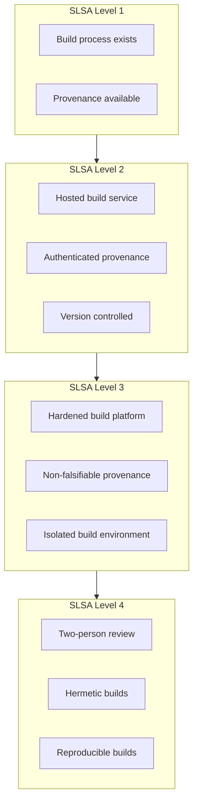
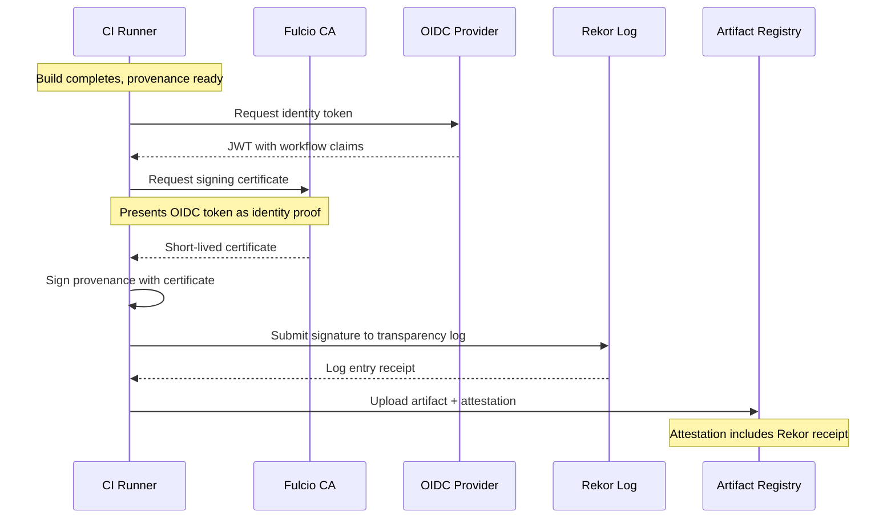
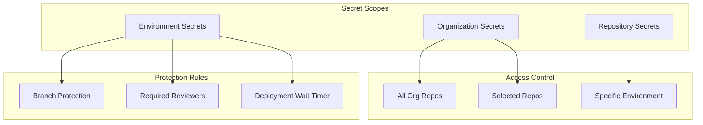
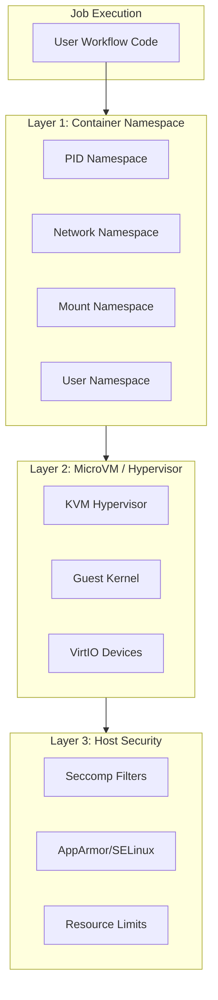

# Security & Compliance

[← Back to Index](./00-index.md)

---

## SLSA Framework Compliance

### Supply-chain Levels for Software Artifacts (SLSA)

SLSA provides a security framework for ensuring artifact integrity throughout the build process.



### Implementation by Level

| SLSA Level | Requirement | CI/CD Implementation |
|------------|-------------|---------------------|
| **Level 1** | Documentation | Workflow YAML checked into repo |
| | Provenance | Generate build metadata JSON |
| **Level 2** | Hosted | Managed runners (not local) |
| | Signed | Sigstore signing of provenance |
| | Source ID | Git commit SHA in provenance |
| **Level 3** | Hardened | Ephemeral runners, no persistence |
| | Isolated | Container/MicroVM per job |
| | Non-falsifiable | Platform-signed attestations |
| **Level 4** | Two-person | Required reviews before merge |
| | Hermetic | No network during build (optional) |
| | Reproducible | Locked dependencies, deterministic |

---

## Build Provenance

### Provenance Generation

```python
class ProvenanceGenerator:
    """
    Generate SLSA-compliant build provenance attestations.
    """

    def generate_provenance(self, job, artifacts):
        """
        Create in-toto provenance statement.

        Format follows SLSA Provenance v1.0 specification.
        """
        provenance = {
            "_type": "https://in-toto.io/Statement/v1",
            "subject": [
                {
                    "name": artifact.name,
                    "digest": {"sha256": artifact.content_hash}
                }
                for artifact in artifacts
            ],
            "predicateType": "https://slsa.dev/provenance/v1",
            "predicate": {
                "buildDefinition": {
                    "buildType": "https://actions.github.io/buildtypes/workflow/v1",
                    "externalParameters": {
                        "workflow": {
                            "ref": job.workflow_ref,
                            "repository": job.repository,
                            "path": job.workflow_path
                        },
                        "inputs": job.inputs
                    },
                    "internalParameters": {
                        "github": {
                            "event_name": job.event_name,
                            "repository_id": job.repo_id,
                            "repository_owner_id": job.owner_id
                        }
                    },
                    "resolvedDependencies": [
                        {
                            "uri": f"git+{job.repo_url}@{job.head_ref}",
                            "digest": {"gitCommit": job.head_sha}
                        }
                    ]
                },
                "runDetails": {
                    "builder": {
                        "id": "https://github.com/actions/runner",
                        "version": job.runner_version
                    },
                    "metadata": {
                        "invocationId": job.run_url,
                        "startedOn": job.started_at.isoformat(),
                        "finishedOn": job.completed_at.isoformat()
                    }
                }
            }
        }

        return provenance
```

### Sigstore Integration



### Attestation Storage

```python
class AttestationStore:
    """
    Store and verify build attestations.
    """

    def store_attestation(self, artifact_id, provenance, signature):
        """
        Store signed attestation linked to artifact.
        """
        attestation = {
            'artifact_id': artifact_id,
            'provenance': provenance,
            'signature': {
                'type': 'cosign',
                'sig': signature.value,
                'cert': signature.certificate,
                'rekor_log_entry': signature.rekor_entry
            },
            'created_at': datetime.utcnow()
        }

        db.attestations.insert(attestation)

    def verify_attestation(self, artifact_id, policy):
        """
        Verify artifact attestation against policy.
        """
        attestation = db.attestations.find_one({'artifact_id': artifact_id})

        if not attestation:
            raise VerificationError("No attestation found")

        # Verify signature
        if not self.verify_signature(attestation):
            raise VerificationError("Invalid signature")

        # Verify Rekor inclusion
        if not self.verify_rekor_inclusion(attestation):
            raise VerificationError("Not in transparency log")

        # Verify policy requirements
        provenance = attestation['provenance']

        if policy.require_reviewed:
            if not self.check_review_requirement(provenance):
                raise PolicyViolation("Missing required review")

        if policy.allowed_builders:
            if provenance['predicate']['runDetails']['builder']['id'] \
               not in policy.allowed_builders:
                raise PolicyViolation("Untrusted builder")

        return True
```

---

## Secrets Security

### Secret Hierarchy



### OIDC Token Claims

```json
{
  "iss": "https://token.actions.example.com",
  "sub": "repo:org/repo:environment:production",
  "aud": "https://cloud-provider.example.com",
  "ref": "refs/heads/main",
  "sha": "abc123def456",
  "repository": "org/repo",
  "repository_owner": "org",
  "repository_owner_id": "12345",
  "run_id": "1234567890",
  "run_number": "42",
  "run_attempt": "1",
  "actor": "developer",
  "actor_id": "67890",
  "workflow": "deploy.yml",
  "head_ref": "",
  "base_ref": "",
  "event_name": "push",
  "ref_type": "branch",
  "environment": "production",
  "job_workflow_ref": "org/repo/.github/workflows/deploy.yml@refs/heads/main",
  "runner_environment": "github-hosted"
}
```

### Cloud Provider Trust Policy

```json
{
  "Version": "2012-10-17",
  "Statement": [
    {
      "Effect": "Allow",
      "Principal": {
        "Federated": "arn:aws:iam::123456789:oidc-provider/token.actions.example.com"
      },
      "Action": "sts:AssumeRoleWithWebIdentity",
      "Condition": {
        "StringEquals": {
          "token.actions.example.com:aud": "sts.amazonaws.com"
        },
        "StringLike": {
          "token.actions.example.com:sub": "repo:org/repo:environment:production"
        }
      }
    }
  ]
}
```

### Secret Rotation

```python
class SecretRotator:
    """
    Automated secret rotation for CI/CD secrets.
    """

    def rotate_secret(self, secret_id, new_value):
        """
        Rotate secret with zero-downtime.
        """
        secret = db.secrets.get(secret_id)

        # 1. Encrypt new value
        encrypted_new = self.encrypt(new_value)

        # 2. Store as pending (both values valid)
        db.secrets.update(secret_id, {
            'encrypted_value': encrypted_new,
            'previous_value': secret.encrypted_value,
            'rotation_state': 'dual_active',
            'rotated_at': datetime.utcnow()
        })

        # 3. Wait for in-flight jobs to complete
        time.sleep(self.ROTATION_GRACE_PERIOD)

        # 4. Remove old value
        db.secrets.update(secret_id, {
            'previous_value': None,
            'rotation_state': 'complete'
        })

        # 5. Audit log
        audit.log('secret_rotated', {
            'secret_id': secret_id,
            'rotated_by': self.current_user
        })

    def check_rotation_due(self):
        """Find secrets due for rotation."""
        threshold = datetime.utcnow() - timedelta(days=90)

        return db.secrets.find({
            'rotation_state': 'complete',
            'rotated_at': {'$lt': threshold}
        })
```

---

## Runner Isolation

### Three-Layer Isolation Model



### Firecracker MicroVM Configuration

```python
class FirecrackerRunner:
    """
    Configure and launch Firecracker MicroVM for job isolation.
    """

    def create_microvm(self, job):
        """
        Create isolated MicroVM for job execution.
        """
        config = {
            "boot-source": {
                "kernel_image_path": "/var/lib/firecracker/vmlinux",
                "boot_args": "console=ttyS0 reboot=k panic=1 pci=off"
            },
            "drives": [{
                "drive_id": "rootfs",
                "path_on_host": self.prepare_rootfs(job),
                "is_root_device": True,
                "is_read_only": False
            }],
            "machine-config": {
                "vcpu_count": job.cpu_cores,
                "mem_size_mib": job.memory_mb,
                "smt": False  # Disable hyperthreading (Spectre mitigation)
            },
            "network-interfaces": [{
                "iface_id": "eth0",
                "guest_mac": self.generate_mac(),
                "host_dev_name": self.create_tap_device(job)
            }]
        }

        # Security constraints
        jailer_config = {
            "uid": 65534,  # nobody
            "gid": 65534,
            "chroot_base_dir": "/srv/jailer",
            "netns": f"/var/run/netns/{job.id}",
            "cgroup": f"/sys/fs/cgroup/firecracker/{job.id}",
            "seccomp_level": 2  # Advanced filtering
        }

        return self.launch_jailed_vm(config, jailer_config)
```

### Network Isolation

```python
class NetworkIsolation:
    """
    Configure network isolation for runner environments.
    """

    def setup_job_network(self, job):
        """
        Create isolated network namespace with controlled egress.
        """
        namespace = f"job-{job.id}"

        # Create network namespace
        subprocess.run(["ip", "netns", "add", namespace])

        # Create veth pair
        veth_host = f"veth-{job.id[:8]}-h"
        veth_guest = f"veth-{job.id[:8]}-g"

        subprocess.run([
            "ip", "link", "add", veth_host, "type", "veth",
            "peer", "name", veth_guest
        ])

        # Move guest end to namespace
        subprocess.run([
            "ip", "link", "set", veth_guest, "netns", namespace
        ])

        # Apply network policy
        if job.allow_network:
            self.apply_egress_rules(job, veth_host)
        else:
            self.block_all_egress(veth_host)

        return namespace

    def apply_egress_rules(self, job, interface):
        """
        Apply iptables rules for allowed egress.
        """
        # Allow DNS
        subprocess.run([
            "iptables", "-A", "FORWARD", "-i", interface,
            "-p", "udp", "--dport", "53", "-j", "ACCEPT"
        ])

        # Allow HTTPS to package registries
        for registry in ALLOWED_REGISTRIES:
            subprocess.run([
                "iptables", "-A", "FORWARD", "-i", interface,
                "-d", registry, "-p", "tcp", "--dport", "443",
                "-j", "ACCEPT"
            ])

        # Allow artifact storage
        subprocess.run([
            "iptables", "-A", "FORWARD", "-i", interface,
            "-d", ARTIFACT_STORAGE_CIDR, "-j", "ACCEPT"
        ])

        # Drop everything else
        subprocess.run([
            "iptables", "-A", "FORWARD", "-i", interface,
            "-j", "DROP"
        ])
```

---

## Audit Logging

### Audit Event Categories

| Category | Events | Retention |
|----------|--------|-----------|
| **Authentication** | Login, logout, token generation | 1 year |
| **Authorization** | Permission grants, denials | 1 year |
| **Job Execution** | Start, complete, fail, cancel | 90 days |
| **Secret Access** | Read, write, rotate | 1 year |
| **Configuration** | Workflow changes, settings updates | 1 year |
| **Admin Actions** | User management, org settings | 1 year |

### Audit Log Schema

```python
class AuditLog:
    """
    Structured audit logging for compliance.
    """

    def log_event(self, event_type, details, actor=None):
        """
        Record audit event with immutable timestamp.
        """
        event = {
            'id': uuid.uuid4(),
            'timestamp': datetime.utcnow().isoformat(),
            'event_type': event_type,
            'actor': actor or self.get_current_actor(),
            'actor_id': actor.id if actor else None,
            'actor_ip': self.get_client_ip(),
            'resource_type': details.get('resource_type'),
            'resource_id': details.get('resource_id'),
            'action': details.get('action'),
            'outcome': details.get('outcome', 'success'),
            'details': details,
            'correlation_id': self.get_correlation_id()
        }

        # Write to append-only storage
        self.write_to_audit_log(event)

        # Forward to SIEM if configured
        if self.siem_enabled:
            self.forward_to_siem(event)

        return event['id']

    def log_secret_access(self, secret_id, job_id, access_type):
        """Log access to secrets."""
        return self.log_event('secret_access', {
            'resource_type': 'secret',
            'resource_id': secret_id,
            'action': access_type,
            'job_id': job_id,
            'workflow': self.get_job_workflow(job_id),
            'repository': self.get_job_repo(job_id)
        })

    def log_job_execution(self, job, outcome):
        """Log job lifecycle events."""
        return self.log_event('job_execution', {
            'resource_type': 'job',
            'resource_id': job.id,
            'action': outcome,
            'repository': job.repository,
            'workflow': job.workflow,
            'run_id': job.run_id,
            'runner_id': job.runner_id,
            'duration_seconds': job.duration
        })
```

### WORM Storage for Audit Logs

```python
class WORMAuditStorage:
    """
    Write-Once-Read-Many storage for tamper-evident audit logs.
    """

    def __init__(self, storage_backend):
        self.storage = storage_backend

    def write_audit_batch(self, events):
        """
        Write batch of events with integrity protection.
        """
        # Calculate batch hash
        batch_content = json.dumps(events, sort_keys=True)
        batch_hash = hashlib.sha256(batch_content.encode()).hexdigest()

        # Chain to previous batch
        previous_hash = self.get_last_batch_hash()
        chain_hash = hashlib.sha256(
            f"{previous_hash}{batch_hash}".encode()
        ).hexdigest()

        # Store with WORM protection
        batch_record = {
            'batch_id': uuid.uuid4(),
            'events': events,
            'batch_hash': batch_hash,
            'previous_batch_hash': previous_hash,
            'chain_hash': chain_hash,
            'timestamp': datetime.utcnow().isoformat()
        }

        # S3 Object Lock or equivalent
        self.storage.put_object(
            key=f"audit/{batch_record['batch_id']}",
            body=json.dumps(batch_record),
            object_lock_mode='GOVERNANCE',
            object_lock_retain_until=datetime.utcnow() + timedelta(days=365)
        )

        return batch_record['batch_id']
```

---

## Compliance Requirements

### Compliance Matrix

| Framework | Requirement | Implementation |
|-----------|-------------|----------------|
| **SOC 2 Type II** | Access controls | RBAC, MFA, audit logs |
| | Encryption | TLS 1.3, AES-256 at rest |
| | Monitoring | Continuous monitoring, alerting |
| **HIPAA** | Data encryption | Customer-managed keys option |
| | Audit trail | Comprehensive audit logging |
| | Access controls | Environment restrictions |
| **PCI-DSS** | Network segmentation | Isolated build environments |
| | Key management | HSM-backed secrets |
| | Logging | 1-year retention |
| **FedRAMP** | Data residency | Regional execution |
| | Encryption | FIPS 140-2 validated |
| | Continuous monitoring | Real-time security monitoring |

### Data Residency Controls

```python
class DataResidencyPolicy:
    """
    Enforce data residency requirements.
    """

    def validate_execution_region(self, job, org_policy):
        """
        Ensure job executes in allowed region.
        """
        allowed_regions = org_policy.get('allowed_regions', ['*'])

        if '*' in allowed_regions:
            return True

        job_region = self.get_runner_region(job.runner_id)

        if job_region not in allowed_regions:
            raise PolicyViolation(
                f"Job would execute in {job_region}, "
                f"but org policy restricts to {allowed_regions}"
            )

        return True

    def validate_artifact_storage(self, artifact, org_policy):
        """
        Ensure artifacts stored in allowed regions.
        """
        storage_region = self.get_storage_region(artifact.storage_path)
        allowed = org_policy.get('artifact_storage_regions', ['*'])

        if '*' not in allowed and storage_region not in allowed:
            raise PolicyViolation(
                f"Artifact storage in {storage_region} violates policy"
            )

        return True
```
