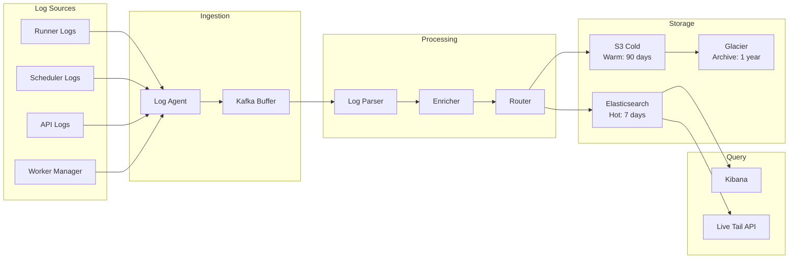
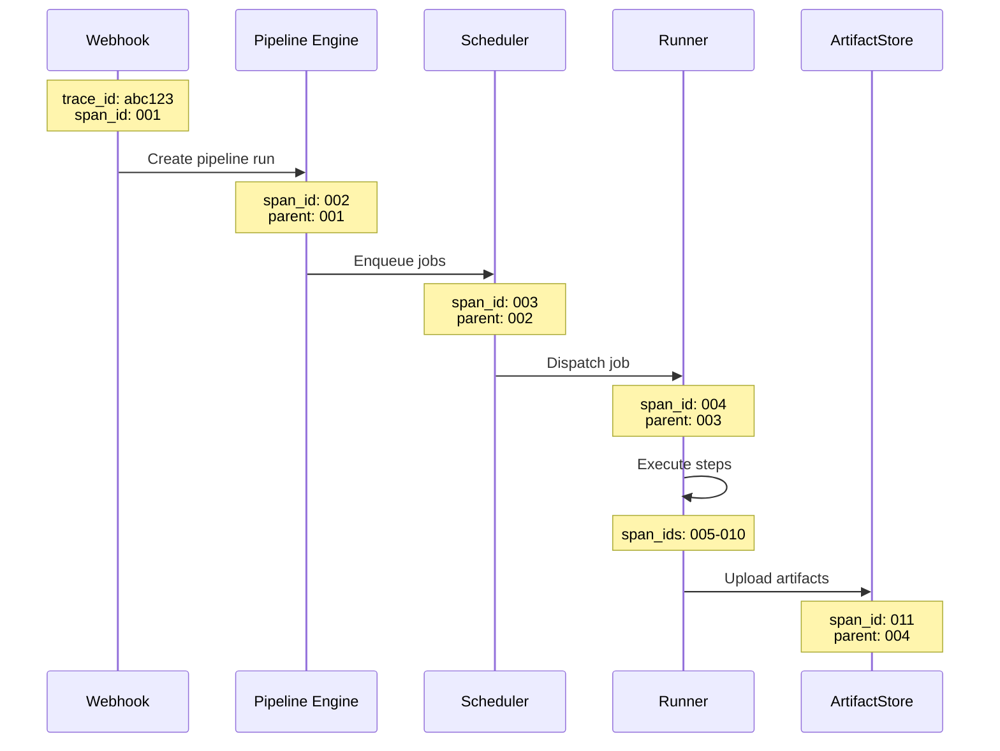

# Observability

[← Back to Index](./00-index.md)

---

## Metrics

### Key Performance Indicators

| Metric | Type | Description | Labels |
|--------|------|-------------|--------|
| `pipeline_runs_total` | Counter | Total pipeline runs | status, trigger, repo |
| `pipeline_run_duration_seconds` | Histogram | Pipeline end-to-end time | status, repo |
| `jobs_total` | Counter | Total jobs executed | status, conclusion, labels |
| `job_queue_wait_seconds` | Histogram | Time from queued to running | priority, labels |
| `job_duration_seconds` | Histogram | Job execution time | status, labels |
| `concurrent_jobs` | Gauge | Currently running jobs | region, labels |
| `runners_active` | Gauge | Active runner count | pool, status |
| `cache_hit_ratio` | Gauge | Cache effectiveness | cache_type |
| `artifact_upload_bytes` | Counter | Artifact storage volume | repo |
| `webhook_latency_seconds` | Histogram | Webhook processing time | event_type |

### Prometheus Metrics Implementation

```python
from prometheus_client import Counter, Histogram, Gauge, Summary

# Pipeline metrics
pipeline_runs_total = Counter(
    'cicd_pipeline_runs_total',
    'Total number of pipeline runs',
    ['status', 'trigger_event', 'repository']
)

pipeline_duration = Histogram(
    'cicd_pipeline_run_duration_seconds',
    'Pipeline execution duration',
    ['status', 'repository'],
    buckets=[30, 60, 120, 300, 600, 1200, 1800, 3600, 7200]
)

# Job metrics
jobs_total = Counter(
    'cicd_jobs_total',
    'Total number of jobs',
    ['status', 'conclusion', 'runner_labels']
)

job_queue_wait = Histogram(
    'cicd_job_queue_wait_seconds',
    'Time jobs spend waiting in queue',
    ['priority', 'runner_labels'],
    buckets=[1, 5, 10, 30, 60, 120, 300, 600]
)

job_duration = Histogram(
    'cicd_job_duration_seconds',
    'Job execution duration',
    ['status', 'runner_labels'],
    buckets=[10, 30, 60, 120, 300, 600, 1200, 1800, 3600]
)

concurrent_jobs = Gauge(
    'cicd_concurrent_jobs',
    'Number of currently running jobs',
    ['region', 'runner_labels']
)

# Runner metrics
runners_total = Gauge(
    'cicd_runners_total',
    'Total runners in pool',
    ['pool_id', 'status', 'os']
)

runner_utilization = Gauge(
    'cicd_runner_utilization_ratio',
    'Runner pool utilization',
    ['pool_id']
)

# Cache metrics
cache_operations = Counter(
    'cicd_cache_operations_total',
    'Cache operations',
    ['operation', 'result', 'cache_type']
)

cache_hit_ratio = Gauge(
    'cicd_cache_hit_ratio',
    'Cache hit ratio (rolling)',
    ['cache_type', 'repository']
)

# Queue metrics
queue_depth = Gauge(
    'cicd_job_queue_depth',
    'Number of jobs waiting in queue',
    ['priority', 'runner_labels']
)

scheduler_decisions_total = Counter(
    'cicd_scheduler_decisions_total',
    'Scheduling decisions made',
    ['decision_type']
)

scheduler_decision_latency = Histogram(
    'cicd_scheduler_decision_latency_seconds',
    'Time to make scheduling decision',
    buckets=[0.001, 0.005, 0.01, 0.025, 0.05, 0.1, 0.25, 0.5, 1]
)
```

### Business Metrics

```python
# Developer experience metrics
build_feedback_time = Histogram(
    'cicd_build_feedback_time_seconds',
    'Time from push to first status check',
    ['repository', 'branch_type'],
    buckets=[30, 60, 120, 300, 600, 1200]
)

pipeline_success_rate = Gauge(
    'cicd_pipeline_success_rate',
    'Rolling success rate (24h)',
    ['repository', 'workflow']
)

flaky_test_rate = Gauge(
    'cicd_flaky_test_rate',
    'Rate of non-deterministic test failures',
    ['repository', 'test_suite']
)

# Cost metrics
runner_compute_minutes = Counter(
    'cicd_runner_compute_minutes_total',
    'Billable compute minutes consumed',
    ['organization', 'runner_type', 'os']
)

cache_storage_bytes = Gauge(
    'cicd_cache_storage_bytes',
    'Cache storage utilization',
    ['repository']
)
```

---

## Dashboard Layouts

### Operations Dashboard

```
┌──────────────────────────────────────────────────────────────────────┐
│                     CI/CD Platform Operations                         │
├──────────────────────────────────────────────────────────────────────┤
│                                                                       │
│  ┌─────────────────┐  ┌─────────────────┐  ┌─────────────────┐       │
│  │  Active Jobs    │  │  Queue Depth    │  │  Runners Online │       │
│  │    12,847       │  │     2,341       │  │     8,234       │       │
│  │   ▲ +12%        │  │    ▼ -8%        │  │    ▲ +5%        │       │
│  └─────────────────┘  └─────────────────┘  └─────────────────┘       │
│                                                                       │
├──────────────────────────────────────────────────────────────────────┤
│  Job Success Rate (24h)                     Queue Wait Time (p99)    │
│  ┌────────────────────────────────────┐   ┌────────────────────────┐ │
│  │ ████████████████████████░░░ 98.2%  │   │                        │ │
│  │                                    │   │   ╭──────╮             │ │
│  │  ● Success  ○ Failed  ○ Cancelled  │   │  ╱      ╲    12s      │ │
│  └────────────────────────────────────┘   │ ╱        ╲            │ │
│                                           └────────────────────────┘ │
├──────────────────────────────────────────────────────────────────────┤
│  Job Throughput (jobs/min)                Concurrent Jobs by Label   │
│  ┌────────────────────────────────────┐   ┌────────────────────────┐ │
│  │                                    │   │ ubuntu-latest  ████ 5K │ │
│  │    ╭──╮    ╭───╮                   │   │ windows-latest ██   2K │ │
│  │  ╭─╯  ╰────╯   ╰──╮                │   │ macos-latest   █   800 │ │
│  │ ─╯                ╰─               │   │ self-hosted    ███  3K │ │
│  └────────────────────────────────────┘   └────────────────────────┘ │
├──────────────────────────────────────────────────────────────────────┤
│  Runner Pool Status                       Cache Performance          │
│  ┌────────────────────────────────────┐   ┌────────────────────────┐ │
│  │ Pool A  ████████░░ 80% (4000/5000) │   │ Hit Rate: 85.3%        │ │
│  │ Pool B  ██████░░░░ 60% (1800/3000) │   │ Saved Time: 2.3h avg   │ │
│  │ Pool C  ███████░░░ 70% (700/1000)  │   │ Storage: 12.4 TB       │ │
│  └────────────────────────────────────┘   └────────────────────────┘ │
└──────────────────────────────────────────────────────────────────────┘
```

### Developer Experience Dashboard

```
┌──────────────────────────────────────────────────────────────────────┐
│                    Developer Experience Metrics                       │
├──────────────────────────────────────────────────────────────────────┤
│                                                                       │
│  ┌─────────────────┐  ┌─────────────────┐  ┌─────────────────┐       │
│  │ Avg Feedback    │  │ Success Rate    │  │ Cache Savings   │       │
│  │     2m 34s      │  │    96.8%        │  │    47% faster   │       │
│  │   ▼ -15s        │  │   ▲ +0.3%       │  │    ▲ +5%        │       │
│  └─────────────────┘  └─────────────────┘  └─────────────────┘       │
│                                                                       │
├──────────────────────────────────────────────────────────────────────┤
│  Pipeline Duration Distribution              Top Slow Pipelines       │
│  ┌────────────────────────────────────┐   ┌────────────────────────┐ │
│  │      ▄                             │   │ org/repo-a   15m 32s   │ │
│  │    ▄███▄                           │   │ org/repo-b   12m 18s   │ │
│  │  ▄██████▄                          │   │ org/repo-c   11m 45s   │ │
│  │ ▄████████▄▄▄                       │   │ org/repo-d   10m 22s   │ │
│  │ 1m   5m   15m   30m   1h           │   │ org/repo-e    9m 51s   │ │
│  └────────────────────────────────────┘   └────────────────────────┘ │
├──────────────────────────────────────────────────────────────────────┤
│  Flaky Tests Detected                     Build Insights              │
│  ┌────────────────────────────────────┐   ┌────────────────────────┐ │
│  │ test_payment_flow     8 failures   │   │ ● 15% builds use cache │ │
│  │ test_auth_redirect    5 failures   │   │ ● 3m avg time saved    │ │
│  │ test_api_timeout      4 failures   │   │ ● 23 workflows today   │ │
│  │ test_db_connection    3 failures   │   │ ● 142 unique committers│ │
│  └────────────────────────────────────┘   └────────────────────────┘ │
└──────────────────────────────────────────────────────────────────────┘
```

---

## Logging

### Log Schema

```json
{
  "timestamp": "2024-01-15T10:35:22.123Z",
  "level": "INFO",
  "service": "job-scheduler",
  "trace_id": "abc123def456",
  "span_id": "789xyz",
  "message": "Job assigned to runner",
  "context": {
    "job_id": "job_uuid_1",
    "run_id": "run_uuid_1",
    "repository": "org/repo",
    "workflow": "ci.yml",
    "runner_id": "runner_uuid_1",
    "queue_wait_ms": 2340,
    "priority": "normal"
  }
}
```

### Log Categories

| Category | Log Level | Retention | Example |
|----------|-----------|-----------|---------|
| **Job Execution** | INFO | 30 days | Job started, completed, failed |
| **Scheduler Events** | INFO | 14 days | Job assigned, runner selected |
| **Runner Lifecycle** | INFO | 14 days | Register, heartbeat, disconnect |
| **Security Events** | WARN/ERROR | 1 year | Auth failures, policy violations |
| **System Errors** | ERROR | 90 days | Exceptions, service failures |
| **Debug Traces** | DEBUG | 24 hours | Detailed execution flow |

### Structured Logging Implementation

```python
import structlog

logger = structlog.get_logger()

class JobLogger:
    """
    Structured logging for job execution.
    """

    def __init__(self, job):
        self.job = job
        self.log = logger.bind(
            job_id=job.id,
            run_id=job.run_id,
            repository=job.repository,
            workflow=job.workflow
        )

    def job_started(self, runner_id):
        self.log.info(
            "job_started",
            runner_id=runner_id,
            queue_wait_ms=self._queue_wait_ms(),
            priority=self.job.priority
        )

    def step_completed(self, step_number, conclusion, duration_ms):
        self.log.info(
            "step_completed",
            step_number=step_number,
            step_name=self.job.steps[step_number].name,
            conclusion=conclusion,
            duration_ms=duration_ms
        )

    def job_completed(self, conclusion):
        self.log.info(
            "job_completed",
            conclusion=conclusion,
            total_duration_ms=self._total_duration_ms(),
            steps_executed=len(self.job.steps),
            cache_hit=self.job.cache_restored
        )

    def error(self, error_type, message, **context):
        self.log.error(
            error_type,
            message=message,
            **context
        )
```

### Log Aggregation Pipeline



---

## Distributed Tracing

### Trace Context Propagation



### Trace Instrumentation

```python
from opentelemetry import trace
from opentelemetry.trace.propagation import set_span_in_context

tracer = trace.get_tracer("cicd-platform")

class TracedJobExecutor:
    """
    Instrumented job execution with distributed tracing.
    """

    def execute_job(self, job, trace_context):
        """Execute job with trace propagation."""

        # Extract parent context from job metadata
        parent_context = self.extract_context(trace_context)

        with tracer.start_as_current_span(
            "job.execute",
            context=parent_context,
            kind=trace.SpanKind.CONSUMER,
            attributes={
                "job.id": job.id,
                "job.name": job.name,
                "repository": job.repository,
                "workflow": job.workflow
            }
        ) as span:
            try:
                # Clone repository
                with tracer.start_span("job.clone") as clone_span:
                    self.clone_repository(job)
                    clone_span.set_attribute("clone.duration_ms",
                                            self.clone_duration)

                # Restore cache
                with tracer.start_span("job.cache_restore") as cache_span:
                    hit = self.restore_cache(job)
                    cache_span.set_attribute("cache.hit", hit)

                # Execute steps
                for i, step in enumerate(job.steps):
                    with tracer.start_span(
                        f"step.{step.name}",
                        attributes={"step.number": i}
                    ) as step_span:
                        result = self.execute_step(step)
                        step_span.set_attribute("step.conclusion",
                                               result.conclusion)
                        step_span.set_attribute("step.exit_code",
                                               result.exit_code)

                # Upload artifacts
                with tracer.start_span("job.artifacts") as art_span:
                    count = self.upload_artifacts(job)
                    art_span.set_attribute("artifacts.count", count)

                span.set_attribute("job.conclusion", "success")

            except Exception as e:
                span.record_exception(e)
                span.set_attribute("job.conclusion", "failure")
                raise
```

---

## Alerting

### Alert Definitions

| Alert | Severity | Condition | Action |
|-------|----------|-----------|--------|
| **HighQueueDepth** | P2 | Queue > 10K for 5m | Scale runners, investigate |
| **LowSuccessRate** | P1 | Success < 95% for 15m | Page on-call, investigate |
| **RunnerPoolLow** | P1 | Available < 20% | Trigger emergency scale |
| **SchedulerLag** | P2 | Decision latency > 100ms | Investigate scheduler |
| **ArtifactUploadErrors** | P2 | Error rate > 1% | Check storage health |
| **HighLogLatency** | P3 | Log delivery > 10s | Scale log pipeline |
| **CacheMissSpike** | P3 | Miss rate > 50% | Check cache cluster |
| **RunnerHeartbeatMissing** | P2 | No heartbeat 2m | Check runner health |

### Prometheus Alert Rules

```yaml
groups:
  - name: cicd-platform
    interval: 30s
    rules:
      # Queue depth alert
      - alert: HighJobQueueDepth
        expr: sum(cicd_job_queue_depth) > 10000
        for: 5m
        labels:
          severity: warning
        annotations:
          summary: "High job queue depth"
          description: "Queue depth is {{ $value }}, exceeding 10K threshold"
          runbook: "https://runbooks.example.com/cicd/high-queue"

      # Success rate alert
      - alert: LowPipelineSuccessRate
        expr: |
          (
            sum(rate(cicd_pipeline_runs_total{status="success"}[15m]))
            /
            sum(rate(cicd_pipeline_runs_total[15m]))
          ) < 0.95
        for: 5m
        labels:
          severity: critical
        annotations:
          summary: "Pipeline success rate below 95%"
          description: "Current success rate: {{ $value | humanizePercentage }}"
          runbook: "https://runbooks.example.com/cicd/low-success"

      # Runner pool alert
      - alert: RunnerPoolCapacityLow
        expr: |
          (
            sum(cicd_runners_total{status="idle"})
            /
            sum(cicd_runners_total)
          ) < 0.2
        for: 2m
        labels:
          severity: critical
        annotations:
          summary: "Runner pool capacity critically low"
          description: "Only {{ $value | humanizePercentage }} runners idle"
          runbook: "https://runbooks.example.com/cicd/runner-capacity"

      # Scheduler performance
      - alert: SchedulerHighLatency
        expr: |
          histogram_quantile(0.99,
            rate(cicd_scheduler_decision_latency_seconds_bucket[5m])
          ) > 0.1
        for: 5m
        labels:
          severity: warning
        annotations:
          summary: "Scheduler decision latency high"
          description: "p99 latency is {{ $value }}s"

      # Job pickup latency
      - alert: HighJobPickupLatency
        expr: |
          histogram_quantile(0.99,
            rate(cicd_job_queue_wait_seconds_bucket[5m])
          ) > 60
        for: 5m
        labels:
          severity: warning
        annotations:
          summary: "Jobs waiting too long in queue"
          description: "p99 queue wait is {{ $value }}s"
```

### PagerDuty Integration

```python
class AlertManager:
    """
    Alert management with PagerDuty integration.
    """

    SEVERITY_MAPPING = {
        'critical': 'critical',
        'warning': 'warning',
        'info': 'info'
    }

    def trigger_alert(self, alert):
        """Send alert to PagerDuty."""
        event = {
            "routing_key": self.pagerduty_key,
            "event_action": "trigger",
            "dedup_key": f"{alert.name}-{alert.labels_hash()}",
            "payload": {
                "summary": alert.annotations['summary'],
                "source": alert.labels.get('instance', 'cicd-platform'),
                "severity": self.SEVERITY_MAPPING[alert.labels['severity']],
                "custom_details": {
                    "description": alert.annotations['description'],
                    "runbook_url": alert.annotations.get('runbook'),
                    "dashboard_url": self.get_dashboard_url(alert),
                    "labels": alert.labels
                }
            }
        }

        requests.post(
            "https://events.pagerduty.com/v2/enqueue",
            json=event
        )

    def resolve_alert(self, alert):
        """Resolve PagerDuty incident."""
        event = {
            "routing_key": self.pagerduty_key,
            "event_action": "resolve",
            "dedup_key": f"{alert.name}-{alert.labels_hash()}"
        }

        requests.post(
            "https://events.pagerduty.com/v2/enqueue",
            json=event
        )
```

---

## Health Checks

### Component Health Endpoints

```python
class HealthCheck:
    """
    Comprehensive health check implementation.
    """

    def check_all(self):
        """Run all health checks."""
        results = {
            'status': 'healthy',
            'timestamp': datetime.utcnow().isoformat(),
            'checks': {}
        }

        checks = [
            ('database', self.check_database),
            ('redis', self.check_redis),
            ('scheduler', self.check_scheduler),
            ('runners', self.check_runner_pool),
            ('storage', self.check_object_storage),
        ]

        for name, check_fn in checks:
            try:
                result = check_fn()
                results['checks'][name] = result
                if result['status'] != 'healthy':
                    results['status'] = 'degraded'
            except Exception as e:
                results['checks'][name] = {
                    'status': 'unhealthy',
                    'error': str(e)
                }
                results['status'] = 'unhealthy'

        return results

    def check_database(self):
        """Check PostgreSQL connectivity and performance."""
        start = time.time()
        db.execute("SELECT 1")
        latency = time.time() - start

        replication_lag = db.execute("""
            SELECT EXTRACT(EPOCH FROM (NOW() - pg_last_xact_replay_timestamp()))
        """)[0][0]

        return {
            'status': 'healthy' if latency < 0.1 else 'degraded',
            'latency_ms': latency * 1000,
            'replication_lag_seconds': replication_lag
        }

    def check_runner_pool(self):
        """Check runner pool health."""
        total = redis.scard("runners:all")
        healthy = redis.scard("runners:healthy")
        stale_count = self.count_stale_runners()

        health_ratio = healthy / max(total, 1)

        return {
            'status': 'healthy' if health_ratio > 0.8 else 'degraded',
            'total_runners': total,
            'healthy_runners': healthy,
            'stale_runners': stale_count,
            'health_ratio': health_ratio
        }
```

### Kubernetes Probes

```yaml
apiVersion: v1
kind: Pod
spec:
  containers:
    - name: scheduler
      livenessProbe:
        httpGet:
          path: /healthz
          port: 8080
        initialDelaySeconds: 10
        periodSeconds: 10
        failureThreshold: 3

      readinessProbe:
        httpGet:
          path: /ready
          port: 8080
        initialDelaySeconds: 5
        periodSeconds: 5

      startupProbe:
        httpGet:
          path: /healthz
          port: 8080
        failureThreshold: 30
        periodSeconds: 10
```
