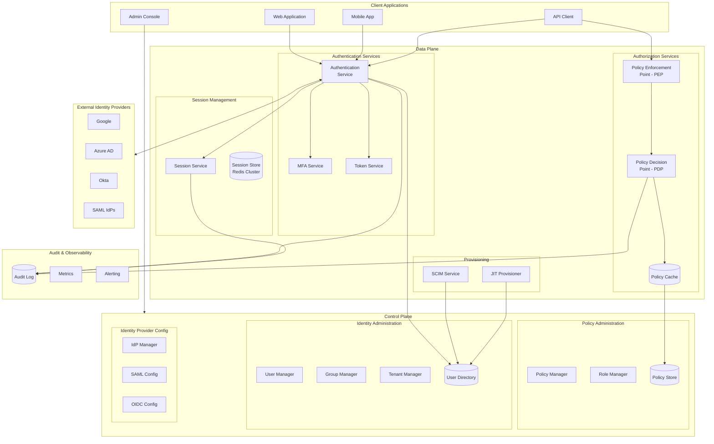
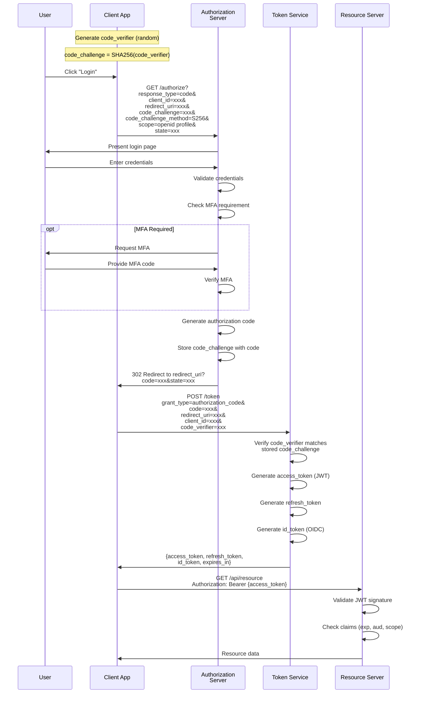
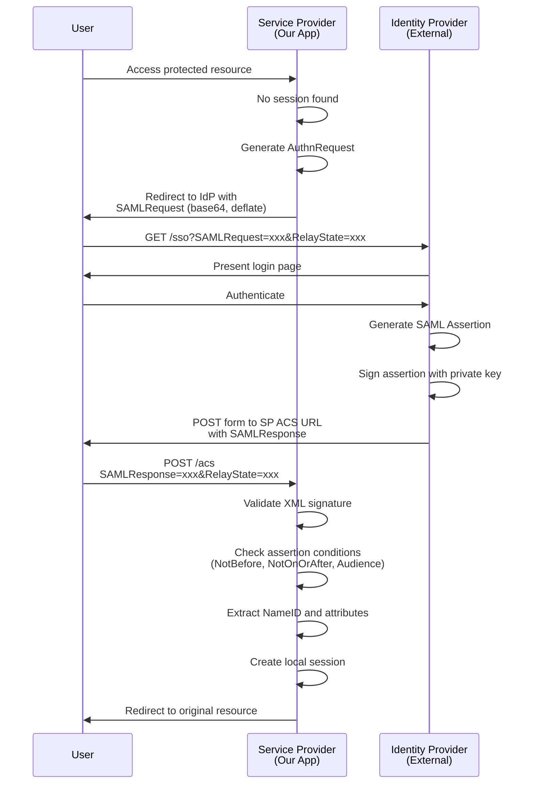
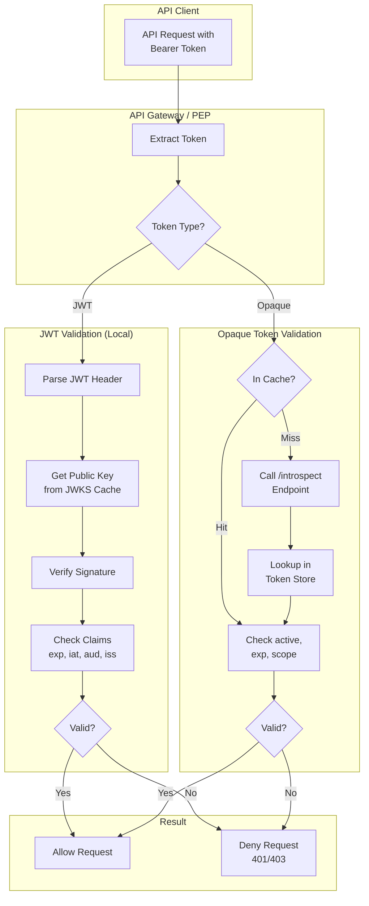
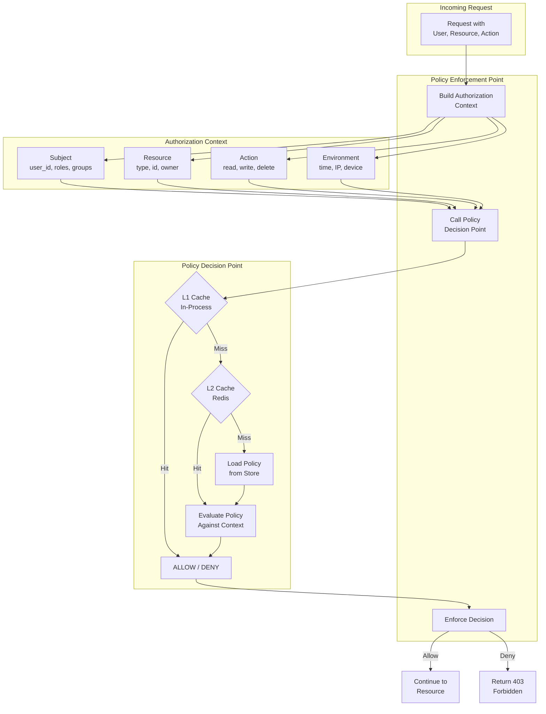
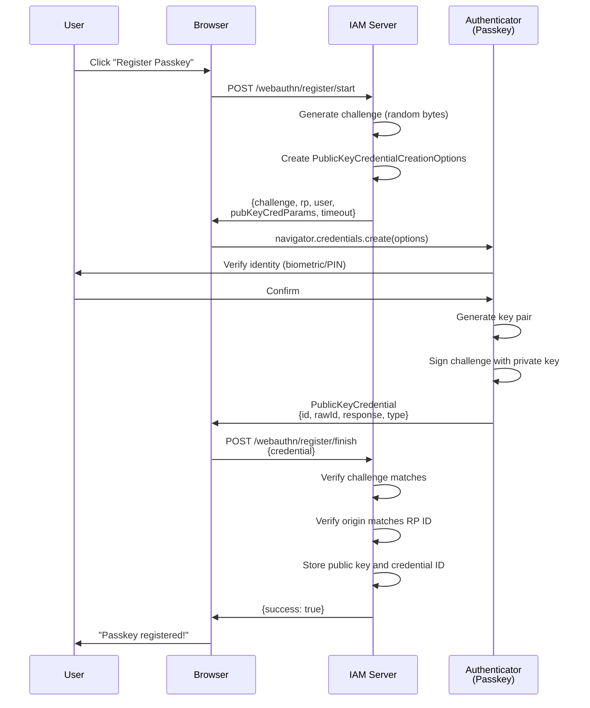
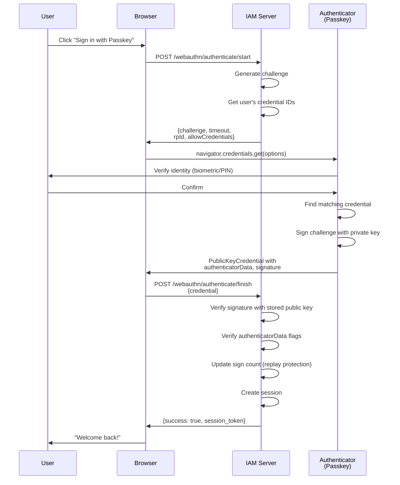
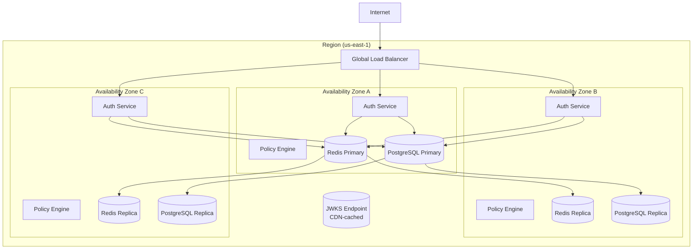
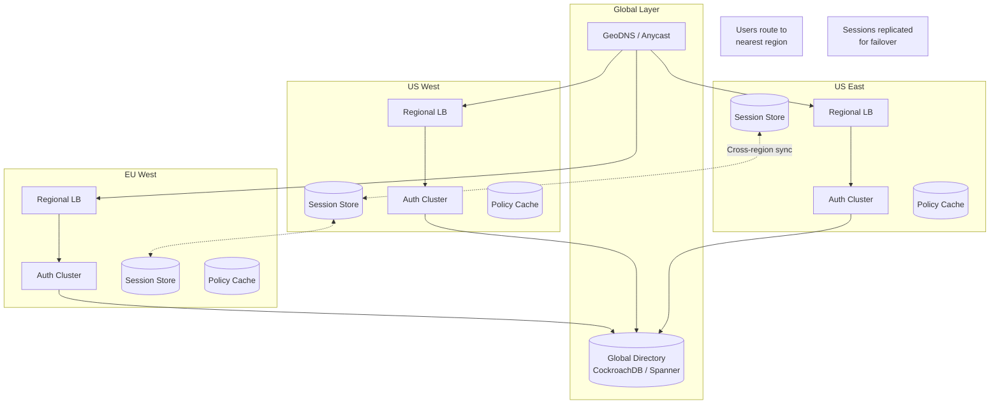

# High-Level Design

[← Back to Index](./00-index.md)

---

## System Architecture

### Control Plane vs Data Plane Overview



### Component Responsibilities

| Component | Layer | Responsibility |
|-----------|-------|---------------|
| **Authentication Service** | Data | Handle login flows, protocol translation (OAuth2, OIDC, SAML) |
| **MFA Service** | Data | Multi-factor verification (WebAuthn, TOTP, SMS) |
| **Token Service** | Data | Generate, sign, and validate tokens (JWT, opaque) |
| **Session Service** | Data | Manage session lifecycle, distributed session state |
| **Policy Enforcement Point (PEP)** | Data | Intercept requests, call PDP, enforce decisions |
| **Policy Decision Point (PDP)** | Data | Evaluate policies against request context |
| **Policy Manager** | Control | CRUD operations on policies, versioning |
| **User Manager** | Control | User lifecycle, attribute management |
| **Tenant Manager** | Control | Multi-tenant configuration, isolation |
| **SCIM Service** | Data | User provisioning, sync with external directories |

---

## Data Flow

### OAuth 2.0 Authorization Code Flow with PKCE



### SAML 2.0 SP-Initiated SSO Flow



### Token Validation Flow (Warm Path)



### Policy Evaluation Flow



---

## Key Architectural Decisions

### 1. Token Strategy: JWT vs Opaque

| Aspect | JWT (External APIs) | Opaque (Internal Services) |
|--------|---------------------|---------------------------|
| **Validation** | Local (no network) | Requires introspection |
| **Revocation** | Delayed (until expiry) | Immediate |
| **Size** | Larger (contains claims) | Small (reference only) |
| **Stateless** | Yes | No |
| **Best For** | Public APIs, microservices | Admin sessions, sensitive ops |

**Decision:** Use **JWT for external API access** (stateless validation at edge) and **opaque tokens for internal/admin sessions** (instant revocation capability).

**Rationale:** External APIs need to validate millions of requests per second without hitting a central service. Internal admin operations require immediate revocation when sessions are compromised.

### 2. Session Storage: Stateless vs Stateful

| Approach | Pros | Cons | Verdict |
|----------|------|------|---------|
| **Fully Stateless (JWT only)** | No session store | Cannot revoke, no rich metadata | Not for high-security |
| **Stateful (Redis)** | Instant revocation, rich state | Session store required | **Chosen** |
| **Hybrid (JWT + Session ID)** | Stateless validation + revocation | Complexity | Alternative |

**Decision:** **Stateful sessions in Redis** with JWT access tokens for API calls.

**Rationale:** Sessions store rich metadata (device info, location, activity), support instant revocation, and enable features like "sign out all devices." JWT access tokens (short-lived) reduce session store load for API validation.

### 3. Policy Engine Architecture

| Approach | Pros | Cons | Verdict |
|----------|------|------|---------|
| **Centralized OPA** | Single source of truth | Network latency | **Complex policies** |
| **Sidecar/Embedded** | Low latency | Policy sync complexity | **High-volume paths** |
| **Hybrid** | Best of both | Operational complexity | **Chosen** |

**Decision:** **Hybrid approach** - embedded policy cache for hot paths, centralized OPA for complex decisions.

**Rationale:** Simple RBAC checks (is user in role X?) can be evaluated locally with cached data. Complex ABAC/ReBAC policies (can user X access document Y given relationships?) route to centralized OPA for consistency.

### 4. Authorization Model Selection

| Model | Complexity | Best For | Examples |
|-------|------------|----------|----------|
| **RBAC** | Low | Clear hierarchies | Admin/User/Viewer roles |
| **ABAC** | Medium | Dynamic rules | Time-based access, location |
| **ReBAC** | High | Relationship-driven | Document sharing, org hierarchy |

**Decision:** Support **all three models** with RBAC as default, ABAC for policies, ReBAC for fine-grained sharing.

**Rationale:** Different use cases need different models. Start simple (RBAC), add policies (ABAC) as needed, enable ReBAC for collaborative features.

### 5. Multi-Tenant Isolation

| Approach | Isolation | Complexity | Cost |
|----------|-----------|------------|------|
| **Shared database, row-level** | Medium | Low | Low |
| **Schema per tenant** | High | Medium | Medium |
| **Database per tenant** | Highest | High | High |

**Decision:** **Row-level isolation** with `tenant_id` + **separate encryption keys per tenant**.

**Rationale:** Row-level provides sufficient isolation for most cases while keeping operational complexity low. Per-tenant encryption keys add a security layer - a compromised key only affects one tenant.

---

## Authentication Protocol Flows

### WebAuthn Registration (Passkey Creation)



### WebAuthn Authentication (Passkey Login)



---

## Deployment Topologies

### Single Region (Multi-AZ)



### Multi-Region Active-Active



---

## Integration Points

### External Identity Provider Integration

```
┌─────────────────────────────────────────────────────────────────┐
│                     IAM System                                   │
│                                                                  │
│  ┌──────────────────────────────────────────────────────────┐   │
│  │              Federation Hub                               │   │
│  │                                                          │   │
│  │  ┌─────────┐  ┌─────────┐  ┌─────────┐  ┌─────────┐    │   │
│  │  │  OIDC   │  │  SAML   │  │  LDAP   │  │ Social  │    │   │
│  │  │ Adapter │  │ Adapter │  │ Adapter │  │ Adapter │    │   │
│  │  └────┬────┘  └────┬────┘  └────┬────┘  └────┬────┘    │   │
│  └───────┼───────────┼───────────┼───────────┼────────────┘   │
│          │           │           │           │                 │
└──────────┼───────────┼───────────┼───────────┼─────────────────┘
           │           │           │           │
           ▼           ▼           ▼           ▼
    ┌──────────┐ ┌──────────┐ ┌──────────┐ ┌──────────┐
    │  Azure   │ │  Okta    │ │ Active   │ │  Google  │
    │   AD     │ │  SAML    │ │ Directory│ │   OAuth  │
    └──────────┘ └──────────┘ └──────────┘ └──────────┘
```

### Service Integration Pattern

```
┌─────────────────────────────────────────────────────────────────┐
│                     Application Services                         │
├─────────────────────────────────────────────────────────────────┤
│                                                                  │
│   ┌─────────┐    ┌─────────┐    ┌─────────┐    ┌─────────┐     │
│   │  User   │    │ Order   │    │ Payment │    │ Content │     │
│   │ Service │    │ Service │    │ Service │    │ Service │     │
│   └────┬────┘    └────┬────┘    └────┬────┘    └────┬────┘     │
│        │              │              │              │            │
│        └──────────────┴──────────────┴──────────────┘            │
│                              │                                   │
│                              ▼                                   │
│                    ┌──────────────────┐                         │
│                    │   API Gateway    │                         │
│                    │   (PEP Role)     │                         │
│                    └────────┬─────────┘                         │
│                             │                                    │
│                             ▼                                    │
│  ┌──────────────────────────────────────────────────────────┐   │
│  │                    IAM System                             │   │
│  │  ┌────────────┐  ┌────────────┐  ┌────────────┐         │   │
│  │  │   Token    │  │   Policy   │  │   User     │         │   │
│  │  │ Validation │  │   Engine   │  │ Directory  │         │   │
│  │  └────────────┘  └────────────┘  └────────────┘         │   │
│  └──────────────────────────────────────────────────────────┘   │
│                                                                  │
└─────────────────────────────────────────────────────────────────┘
```

---

## Failure Modes

| Failure | Impact | Mitigation |
|---------|--------|------------|
| **Auth service down** | Users cannot log in | Multi-AZ, multiple replicas |
| **Session store down** | Existing sessions lost | Redis Cluster with persistence |
| **Policy store down** | AuthZ decisions fail | Local policy cache, default deny |
| **Database down** | No user lookups | Read replicas, connection pooling |
| **MFA service down** | MFA verification fails | Graceful degradation (allow cached) |
| **External IdP down** | Federated login fails | Cached assertions, local fallback |
| **JWKS endpoint down** | JWT validation fails | CDN caching, local key cache |
| **Network partition** | Regional isolation | Cross-region session replication |

**Graceful Degradation Strategies:**

1. **Cached Policies** - Continue with last-known-good policy for brief outages
2. **Token Refresh** - Allow expired tokens brief grace period during outages
3. **Read Replicas** - Serve reads from replicas if primary down
4. **Circuit Breakers** - Fail fast on external IdP issues, offer local auth

**Static Stability:** Authentication continues with cached data for up to 5 minutes during complete backend outage. New logins queue and retry; existing sessions remain valid.
