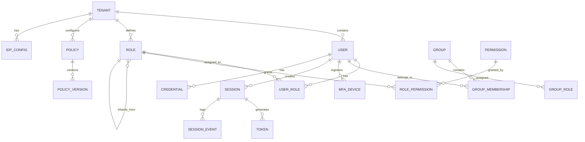

# Low-Level Design

[← Back to Index](./00-index.md)

---

## Data Model

### Core Entity Relationship Diagram



### User Schema

```
TABLE: users
├── id                  UUID PRIMARY KEY
├── tenant_id           UUID NOT NULL REFERENCES tenants(id)
├── external_id         VARCHAR(255)              -- IdP subject identifier
├── email               VARCHAR(255) NOT NULL
├── email_verified      BOOLEAN DEFAULT false
├── phone               VARCHAR(50)
├── phone_verified      BOOLEAN DEFAULT false
├── username            VARCHAR(255)
├── display_name        VARCHAR(255)
├── given_name          VARCHAR(100)
├── family_name         VARCHAR(100)
├── profile_picture_url VARCHAR(2048)
├── locale              VARCHAR(10) DEFAULT 'en'
├── timezone            VARCHAR(50)
├── status              ENUM('active', 'suspended', 'deactivated', 'pending')
├── password_hash       VARCHAR(255)              -- Argon2id hash
├── password_changed_at TIMESTAMP
├── mfa_enabled         BOOLEAN DEFAULT false
├── mfa_enforced        BOOLEAN DEFAULT false
├── last_login_at       TIMESTAMP
├── last_login_ip       INET
├── failed_login_count  INTEGER DEFAULT 0
├── locked_until        TIMESTAMP
├── metadata            JSONB                     -- Custom attributes
├── created_at          TIMESTAMP DEFAULT now()
├── updated_at          TIMESTAMP DEFAULT now()
├── deleted_at          TIMESTAMP                 -- Soft delete
└── INDEXES
    ├── idx_users_tenant_email UNIQUE (tenant_id, email) WHERE deleted_at IS NULL
    ├── idx_users_tenant_username UNIQUE (tenant_id, username) WHERE deleted_at IS NULL
    ├── idx_users_external_id (tenant_id, external_id)
    └── idx_users_status (tenant_id, status)
```

### Role and Permission Schema

```
TABLE: roles
├── id                  UUID PRIMARY KEY
├── tenant_id           UUID NOT NULL REFERENCES tenants(id)
├── name                VARCHAR(100) NOT NULL
├── display_name        VARCHAR(255)
├── description         TEXT
├── parent_role_id      UUID REFERENCES roles(id) -- Role inheritance
├── is_system_role      BOOLEAN DEFAULT false     -- Cannot delete
├── metadata            JSONB
├── created_at          TIMESTAMP DEFAULT now()
├── updated_at          TIMESTAMP DEFAULT now()
└── INDEXES
    ├── idx_roles_tenant_name UNIQUE (tenant_id, name)
    └── idx_roles_parent (parent_role_id)

TABLE: permissions
├── id                  UUID PRIMARY KEY
├── tenant_id           UUID NOT NULL REFERENCES tenants(id)
├── resource_type       VARCHAR(100) NOT NULL     -- e.g., 'document', 'user'
├── action              VARCHAR(50) NOT NULL      -- e.g., 'read', 'write', 'delete'
├── scope               VARCHAR(100)              -- e.g., 'own', 'team', 'all'
├── description         TEXT
├── created_at          TIMESTAMP DEFAULT now()
└── INDEXES
    └── idx_permissions_resource UNIQUE (tenant_id, resource_type, action, scope)

TABLE: role_permissions
├── role_id             UUID REFERENCES roles(id)
├── permission_id       UUID REFERENCES permissions(id)
├── conditions          JSONB                     -- ABAC conditions
├── granted_at          TIMESTAMP DEFAULT now()
├── granted_by          UUID REFERENCES users(id)
└── PRIMARY KEY (role_id, permission_id)

TABLE: user_roles
├── user_id             UUID REFERENCES users(id)
├── role_id             UUID REFERENCES roles(id)
├── scope_type          VARCHAR(50)               -- 'global', 'organization', 'project'
├── scope_id            UUID                      -- ID of org/project if scoped
├── expires_at          TIMESTAMP                 -- Time-limited assignments
├── assigned_at         TIMESTAMP DEFAULT now()
├── assigned_by         UUID REFERENCES users(id)
└── PRIMARY KEY (user_id, role_id, scope_type, COALESCE(scope_id, '00000000-0000-0000-0000-000000000000'))
```

### Policy Schema (for ABAC/ReBAC)

```
TABLE: policies
├── id                  UUID PRIMARY KEY
├── tenant_id           UUID NOT NULL REFERENCES tenants(id)
├── name                VARCHAR(255) NOT NULL
├── description         TEXT
├── policy_type         ENUM('abac', 'rebac', 'custom')
├── effect              ENUM('allow', 'deny')
├── priority            INTEGER DEFAULT 0         -- Higher = evaluated first
├── is_active           BOOLEAN DEFAULT true
├── current_version_id  UUID REFERENCES policy_versions(id)
├── created_at          TIMESTAMP DEFAULT now()
├── updated_at          TIMESTAMP DEFAULT now()
└── INDEXES
    ├── idx_policies_tenant_active (tenant_id, is_active, priority DESC)
    └── idx_policies_name UNIQUE (tenant_id, name)

TABLE: policy_versions
├── id                  UUID PRIMARY KEY
├── policy_id           UUID REFERENCES policies(id)
├── version             INTEGER NOT NULL
├── policy_document     JSONB NOT NULL            -- Policy in Rego/Cedar format
├── compiled_policy     BYTEA                     -- Pre-compiled for performance
├── created_at          TIMESTAMP DEFAULT now()
├── created_by          UUID REFERENCES users(id)
├── change_description  TEXT
└── INDEXES
    └── idx_policy_versions UNIQUE (policy_id, version)
```

### Relationship Tuples (ReBAC - Zanzibar-style)

```
TABLE: relationship_tuples
├── id                  UUID PRIMARY KEY
├── tenant_id           UUID NOT NULL
├── object_type         VARCHAR(100) NOT NULL     -- e.g., 'document'
├── object_id           VARCHAR(255) NOT NULL     -- e.g., 'doc_123'
├── relation            VARCHAR(100) NOT NULL     -- e.g., 'viewer', 'editor', 'owner'
├── subject_type        VARCHAR(100) NOT NULL     -- e.g., 'user', 'group'
├── subject_id          VARCHAR(255) NOT NULL     -- e.g., 'user_456'
├── subject_relation    VARCHAR(100)              -- For nested relations: 'group#member'
├── created_at          TIMESTAMP DEFAULT now()
├── created_by          UUID
└── INDEXES
    ├── idx_tuples_object (tenant_id, object_type, object_id, relation)
    ├── idx_tuples_subject (tenant_id, subject_type, subject_id)
    └── idx_tuples_unique UNIQUE (tenant_id, object_type, object_id, relation, subject_type, subject_id, COALESCE(subject_relation, ''))
```

### Session and Token Schema

```
TABLE: sessions (in Redis, shown as logical schema)
├── session_id          STRING PRIMARY KEY        -- Opaque identifier
├── tenant_id           UUID
├── user_id             UUID
├── created_at          TIMESTAMP
├── expires_at          TIMESTAMP
├── last_active_at      TIMESTAMP
├── ip_address          STRING
├── user_agent          STRING
├── device_fingerprint  STRING
├── mfa_verified        BOOLEAN
├── mfa_verified_at     TIMESTAMP
├── auth_method         STRING                    -- 'password', 'sso', 'passkey'
├── idp_session_id      STRING                    -- External IdP session
└── metadata            JSON

TABLE: refresh_tokens
├── id                  UUID PRIMARY KEY
├── token_hash          VARCHAR(64) NOT NULL      -- SHA-256 of token
├── family_id           UUID NOT NULL             -- For rotation tracking
├── tenant_id           UUID NOT NULL
├── user_id             UUID NOT NULL
├── session_id          UUID REFERENCES sessions
├── client_id           VARCHAR(255)
├── scopes              VARCHAR[] NOT NULL
├── issued_at           TIMESTAMP DEFAULT now()
├── expires_at          TIMESTAMP NOT NULL
├── used_at             TIMESTAMP                 -- Tracks usage for rotation
├── revoked_at          TIMESTAMP
├── revoked_reason      VARCHAR(50)
├── previous_token_id   UUID                      -- Chain for rotation
└── INDEXES
    ├── idx_refresh_tokens_hash UNIQUE (token_hash)
    ├── idx_refresh_tokens_family (family_id)
    └── idx_refresh_tokens_user (user_id, revoked_at)
```

### MFA Device Schema

```
TABLE: mfa_devices
├── id                  UUID PRIMARY KEY
├── user_id             UUID NOT NULL REFERENCES users(id)
├── device_type         ENUM('totp', 'webauthn', 'sms', 'email', 'recovery')
├── device_name         VARCHAR(255)
├── is_primary          BOOLEAN DEFAULT false
├── is_verified         BOOLEAN DEFAULT false
├──
├── -- TOTP-specific
├── totp_secret         VARCHAR(255) ENCRYPTED    -- Base32 encoded
├──
├── -- WebAuthn-specific
├── credential_id       BYTEA                     -- WebAuthn credential ID
├── public_key          BYTEA                     -- COSE public key
├── sign_count          INTEGER                   -- Replay protection
├── aaguid              UUID                      -- Authenticator model
├── transports          VARCHAR[]                 -- ['usb', 'nfc', 'ble', 'internal']
├── attestation_format  VARCHAR(50)
├──
├── -- SMS/Email-specific
├── contact_value       VARCHAR(255) ENCRYPTED
├──
├── -- Recovery codes
├── recovery_codes      VARCHAR[] ENCRYPTED       -- Hashed codes
├──
├── last_used_at        TIMESTAMP
├── created_at          TIMESTAMP DEFAULT now()
├── updated_at          TIMESTAMP DEFAULT now()
└── INDEXES
    ├── idx_mfa_user (user_id)
    └── idx_mfa_credential UNIQUE (credential_id) WHERE credential_id IS NOT NULL
```

---

## API Design

### OAuth 2.0 / OIDC Endpoints

```
# Authorization Endpoint
GET /oauth/authorize
    Query Parameters:
        response_type: "code" | "token" | "id_token"
        client_id: string (required)
        redirect_uri: string (required)
        scope: string (space-separated)
        state: string (required for CSRF)
        nonce: string (required for OIDC)
        code_challenge: string (PKCE)
        code_challenge_method: "S256" | "plain"
        prompt: "none" | "login" | "consent"
        login_hint: string
        acr_values: string
    Response:
        302 Redirect to redirect_uri with code or error

# Token Endpoint
POST /oauth/token
    Content-Type: application/x-www-form-urlencoded
    Body (authorization_code):
        grant_type: "authorization_code"
        code: string
        redirect_uri: string
        client_id: string
        client_secret: string (confidential clients)
        code_verifier: string (PKCE)
    Body (refresh_token):
        grant_type: "refresh_token"
        refresh_token: string
        scope: string (optional, reduce scope)
    Body (client_credentials):
        grant_type: "client_credentials"
        scope: string
    Response:
        {
            access_token: string,
            token_type: "Bearer",
            expires_in: number,
            refresh_token: string (optional),
            id_token: string (OIDC),
            scope: string
        }

# Token Introspection
POST /oauth/introspect
    Authorization: Basic {client_credentials}
    Body:
        token: string
        token_type_hint: "access_token" | "refresh_token"
    Response:
        {
            active: boolean,
            scope: string,
            client_id: string,
            username: string,
            token_type: string,
            exp: number,
            iat: number,
            sub: string,
            aud: string,
            iss: string
        }

# Token Revocation
POST /oauth/revoke
    Authorization: Basic {client_credentials}
    Body:
        token: string
        token_type_hint: "access_token" | "refresh_token"
    Response:
        200 OK (always, even if token invalid)

# OIDC UserInfo
GET /oauth/userinfo
    Authorization: Bearer {access_token}
    Response:
        {
            sub: string,
            name: string,
            given_name: string,
            family_name: string,
            email: string,
            email_verified: boolean,
            picture: string,
            ...custom_claims
        }

# JWKS Endpoint (public)
GET /.well-known/jwks.json
    Response:
        {
            keys: [
                {
                    kty: "RSA",
                    use: "sig",
                    alg: "RS256",
                    kid: string,
                    n: string (base64url),
                    e: string (base64url)
                }
            ]
        }

# OpenID Configuration (public)
GET /.well-known/openid-configuration
    Response:
        {
            issuer: string,
            authorization_endpoint: string,
            token_endpoint: string,
            userinfo_endpoint: string,
            jwks_uri: string,
            scopes_supported: string[],
            response_types_supported: string[],
            grant_types_supported: string[],
            ...
        }
```

### User Management API

```
# List Users
GET /api/v1/users
    Query Parameters:
        page: number
        per_page: number (max 100)
        filter: string (SCIM filter syntax)
        sort_by: string
        sort_order: "asc" | "desc"
    Response:
        {
            data: User[],
            pagination: {
                total: number,
                page: number,
                per_page: number,
                total_pages: number
            }
        }

# Create User
POST /api/v1/users
    Body:
        {
            email: string (required),
            username: string,
            password: string,
            given_name: string,
            family_name: string,
            phone: string,
            metadata: object,
            roles: string[],
            send_verification_email: boolean
        }
    Response:
        201 Created
        { id: string, ...user_data }

# Get User
GET /api/v1/users/{user_id}
    Response:
        { ...user_data, roles: Role[], groups: Group[] }

# Update User
PATCH /api/v1/users/{user_id}
    Body:
        { ...partial_user_data }
    Response:
        200 OK { ...updated_user }

# Delete User
DELETE /api/v1/users/{user_id}
    Response:
        204 No Content

# User Actions
POST /api/v1/users/{user_id}/actions/{action}
    Actions:
        - suspend
        - activate
        - reset-password
        - force-logout
        - resend-verification
    Response:
        200 OK
```

### Authorization (Policy) API

```
# Check Permission (PDP)
POST /api/v1/authorize/check
    Body:
        {
            subject: {
                type: "user" | "service",
                id: string,
                attributes: object
            },
            resource: {
                type: string,
                id: string,
                attributes: object
            },
            action: string,
            context: {
                ip_address: string,
                timestamp: string,
                ...
            }
        }
    Response:
        {
            allowed: boolean,
            decision_id: string,
            reasons: string[],
            evaluated_policies: string[]
        }

# Batch Check
POST /api/v1/authorize/batch-check
    Body:
        {
            checks: AuthorizationCheck[]
        }
    Response:
        {
            results: AuthorizationResult[]
        }

# List User Permissions (for UI)
GET /api/v1/users/{user_id}/permissions
    Query Parameters:
        resource_type: string (optional)
    Response:
        {
            permissions: [
                {
                    resource_type: string,
                    actions: string[],
                    scope: string
                }
            ]
        }

# Create Relationship Tuple (ReBAC)
POST /api/v1/relationships
    Body:
        {
            object: { type: string, id: string },
            relation: string,
            subject: { type: string, id: string, relation?: string }
        }
    Response:
        201 Created

# Delete Relationship
DELETE /api/v1/relationships
    Body:
        { ...same as create }
    Response:
        204 No Content
```

### SCIM 2.0 API

```
# SCIM User Endpoints
GET    /scim/v2/Users                    # List users
GET    /scim/v2/Users/{id}               # Get user
POST   /scim/v2/Users                    # Create user
PUT    /scim/v2/Users/{id}               # Replace user
PATCH  /scim/v2/Users/{id}               # Update user
DELETE /scim/v2/Users/{id}               # Delete user

# SCIM Group Endpoints
GET    /scim/v2/Groups                   # List groups
GET    /scim/v2/Groups/{id}              # Get group
POST   /scim/v2/Groups                   # Create group
PUT    /scim/v2/Groups/{id}              # Replace group
PATCH  /scim/v2/Groups/{id}              # Update group
DELETE /scim/v2/Groups/{id}              # Delete group

# SCIM Bulk Operations
POST   /scim/v2/Bulk
    Body:
        {
            schemas: ["urn:ietf:params:scim:api:messages:2.0:BulkRequest"],
            Operations: [
                {
                    method: "POST" | "PUT" | "PATCH" | "DELETE",
                    path: "/Users" | "/Users/{id}",
                    data: { ...user_data }
                }
            ]
        }

# SCIM Schema Discovery
GET    /scim/v2/Schemas
GET    /scim/v2/ServiceProviderConfig
GET    /scim/v2/ResourceTypes
```

---

## Core Algorithms

### Password Hashing with Argon2id

```
FUNCTION hash_password(password: String) -> String:
    // Argon2id parameters (OWASP recommendations)
    memory_cost = 19456      // 19 MiB
    time_cost = 2            // 2 iterations
    parallelism = 1          // 1 thread
    hash_length = 32         // 32 bytes output

    // Generate random salt
    salt = generate_random_bytes(16)

    // Compute Argon2id hash
    hash = argon2id(
        password = password.encode('utf-8'),
        salt = salt,
        memory_cost = memory_cost,
        time_cost = time_cost,
        parallelism = parallelism,
        hash_length = hash_length
    )

    // Return PHC string format
    RETURN "$argon2id$v=19$m={memory_cost},t={time_cost},p={parallelism}${base64(salt)}${base64(hash)}"

FUNCTION verify_password(password: String, hash_string: String) -> Boolean:
    // Parse PHC string
    params, salt, stored_hash = parse_phc_string(hash_string)

    // Recompute hash with same parameters
    computed_hash = argon2id(
        password = password.encode('utf-8'),
        salt = salt,
        memory_cost = params.memory_cost,
        time_cost = params.time_cost,
        parallelism = params.parallelism,
        hash_length = len(stored_hash)
    )

    // Constant-time comparison to prevent timing attacks
    RETURN constant_time_compare(computed_hash, stored_hash)
```

### JWT Token Generation and Validation

```
FUNCTION generate_access_token(user: User, client: Client, scopes: List[String]) -> String:
    // Get current signing key
    signing_key = key_manager.get_current_signing_key()

    now = current_timestamp()

    // Build JWT claims
    claims = {
        // Registered claims
        "iss": config.issuer,                    // e.g., "https://auth.example.com"
        "sub": user.id,                          // Subject (user ID)
        "aud": client.allowed_audiences,         // Audience(s)
        "exp": now + config.access_token_ttl,    // Expiration (e.g., 15 minutes)
        "iat": now,                              // Issued at
        "nbf": now,                              // Not before
        "jti": generate_uuid(),                  // JWT ID (for revocation)

        // Custom claims
        "client_id": client.id,
        "scope": join(scopes, " "),
        "tenant_id": user.tenant_id,

        // Optional user claims (if requested scopes include profile/email)
        IF "profile" IN scopes:
            "name": user.display_name,
            "given_name": user.given_name,
            "family_name": user.family_name
        IF "email" IN scopes:
            "email": user.email,
            "email_verified": user.email_verified
    }

    // Create JWT header
    header = {
        "alg": signing_key.algorithm,    // e.g., "RS256"
        "typ": "JWT",
        "kid": signing_key.key_id        // Key ID for JWKS lookup
    }

    // Sign and encode
    token = jwt_encode(header, claims, signing_key.private_key)

    RETURN token

FUNCTION validate_access_token(token: String, required_scopes: List[String]) -> TokenValidationResult:
    TRY:
        // Decode header without verification to get kid
        header = jwt_decode_header(token)

        // Get public key from cache or JWKS
        public_key = key_cache.get(header.kid)
        IF public_key IS NULL:
            public_key = fetch_from_jwks(config.jwks_uri, header.kid)
            key_cache.set(header.kid, public_key, ttl=3600)

        // Verify signature and decode claims
        claims = jwt_decode(token, public_key, algorithms=[header.alg])

        // Validate standard claims
        now = current_timestamp()

        IF claims.exp < now:
            RETURN ValidationResult(valid=false, error="token_expired")

        IF claims.nbf > now:
            RETURN ValidationResult(valid=false, error="token_not_yet_valid")

        IF claims.iss != config.issuer:
            RETURN ValidationResult(valid=false, error="invalid_issuer")

        // Validate audience (must include at least one expected audience)
        IF NOT any(aud IN config.expected_audiences FOR aud IN claims.aud):
            RETURN ValidationResult(valid=false, error="invalid_audience")

        // Check required scopes
        token_scopes = claims.scope.split(" ")
        IF NOT all(scope IN token_scopes FOR scope IN required_scopes):
            RETURN ValidationResult(valid=false, error="insufficient_scope")

        // Check revocation (optional, for high-security)
        IF config.check_revocation AND is_token_revoked(claims.jti):
            RETURN ValidationResult(valid=false, error="token_revoked")

        RETURN ValidationResult(
            valid=true,
            user_id=claims.sub,
            client_id=claims.client_id,
            scopes=token_scopes,
            tenant_id=claims.tenant_id
        )

    CATCH InvalidSignatureError:
        RETURN ValidationResult(valid=false, error="invalid_signature")
    CATCH DecodeError:
        RETURN ValidationResult(valid=false, error="malformed_token")
```

### Refresh Token Rotation with Reuse Detection

```
FUNCTION issue_refresh_token(user_id: String, client_id: String, scopes: List[String], family_id: String = NULL) -> RefreshToken:
    // Generate new family ID if not rotating
    IF family_id IS NULL:
        family_id = generate_uuid()

    // Generate token value
    token_value = generate_secure_random(32)  // 256 bits
    token_hash = sha256(token_value)

    // Create token record
    token = RefreshToken(
        id = generate_uuid(),
        token_hash = token_hash,
        family_id = family_id,
        user_id = user_id,
        client_id = client_id,
        scopes = scopes,
        issued_at = now(),
        expires_at = now() + config.refresh_token_ttl  // e.g., 30 days
    )

    // Store in database
    db.refresh_tokens.insert(token)

    // Return the actual token value (only time it's available)
    RETURN (token, base64url_encode(token_value))

FUNCTION rotate_refresh_token(old_token_value: String) -> (AccessToken, RefreshToken):
    old_token_hash = sha256(base64url_decode(old_token_value))

    // Look up token
    old_token = db.refresh_tokens.find_by_hash(old_token_hash)

    IF old_token IS NULL:
        THROW InvalidTokenError("Token not found")

    IF old_token.revoked_at IS NOT NULL:
        // Potential token reuse attack - revoke entire family
        revoke_token_family(old_token.family_id, reason="reuse_detected")
        log_security_event("refresh_token_reuse", {
            family_id: old_token.family_id,
            user_id: old_token.user_id
        })
        THROW SecurityError("Token reuse detected - all sessions revoked")

    IF old_token.expires_at < now():
        THROW InvalidTokenError("Token expired")

    IF old_token.used_at IS NOT NULL:
        // Token was already used - this is a reuse attempt
        revoke_token_family(old_token.family_id, reason="reuse_detected")
        THROW SecurityError("Token reuse detected")

    // Mark old token as used
    db.refresh_tokens.update(old_token.id, {
        used_at = now()
    })

    // Issue new refresh token in same family
    new_refresh_token, new_refresh_token_value = issue_refresh_token(
        user_id = old_token.user_id,
        client_id = old_token.client_id,
        scopes = old_token.scopes,
        family_id = old_token.family_id
    )

    // Update chain
    db.refresh_tokens.update(new_refresh_token.id, {
        previous_token_id = old_token.id
    })

    // Generate new access token
    user = db.users.find(old_token.user_id)
    client = db.clients.find(old_token.client_id)
    new_access_token = generate_access_token(user, client, old_token.scopes)

    RETURN (new_access_token, new_refresh_token_value)

FUNCTION revoke_token_family(family_id: String, reason: String):
    // Revoke all tokens in the family
    db.refresh_tokens.update_many(
        filter = { family_id = family_id, revoked_at = NULL },
        update = { revoked_at = now(), revoked_reason = reason }
    )

    // Optionally invalidate related sessions
    IF config.revoke_sessions_on_family_revocation:
        related_tokens = db.refresh_tokens.find({ family_id = family_id })
        session_ids = unique([t.session_id FOR t IN related_tokens])
        FOR session_id IN session_ids:
            session_store.delete(session_id)
```

### Policy Evaluation (ABAC/ReBAC)

```
FUNCTION evaluate_policy(request: AuthorizationRequest) -> AuthorizationDecision:
    // Build evaluation context
    context = {
        subject: {
            id: request.subject.id,
            type: request.subject.type,
            attributes: fetch_subject_attributes(request.subject),
            roles: fetch_subject_roles(request.subject),
            groups: fetch_subject_groups(request.subject)
        },
        resource: {
            id: request.resource.id,
            type: request.resource.type,
            attributes: fetch_resource_attributes(request.resource),
            owner: fetch_resource_owner(request.resource)
        },
        action: request.action,
        environment: {
            timestamp: now(),
            ip_address: request.context.ip_address,
            user_agent: request.context.user_agent,
            ...request.context
        }
    }

    // Check L1 cache (in-process)
    cache_key = compute_cache_key(context)
    cached_decision = l1_cache.get(cache_key)
    IF cached_decision IS NOT NULL:
        RETURN cached_decision

    // Check L2 cache (Redis)
    cached_decision = l2_cache.get(cache_key)
    IF cached_decision IS NOT NULL:
        l1_cache.set(cache_key, cached_decision, ttl=60)  // Promote to L1
        RETURN cached_decision

    // Load applicable policies
    policies = load_policies_for_resource(
        tenant_id = context.subject.tenant_id,
        resource_type = request.resource.type
    )

    // Sort by priority (higher first)
    policies = sort_by(policies, key=lambda p: -p.priority)

    decision = DENY  // Default deny
    matched_policies = []

    FOR policy IN policies:
        IF NOT policy.is_active:
            CONTINUE

        // Evaluate policy conditions
        match_result = evaluate_policy_conditions(policy, context)

        IF match_result.matches:
            matched_policies.append(policy.name)

            IF policy.effect == DENY:
                // Explicit deny takes precedence
                decision = DENY
                BREAK
            ELIF policy.effect == ALLOW:
                decision = ALLOW
                // Continue to check for explicit denies

    // For ReBAC, check relationship tuples
    IF decision == DENY AND has_rebac_policies(request.resource.type):
        rebac_allowed = check_relationship(
            object_type = request.resource.type,
            object_id = request.resource.id,
            relation = action_to_relation(request.action),
            subject_type = request.subject.type,
            subject_id = request.subject.id
        )
        IF rebac_allowed:
            decision = ALLOW
            matched_policies.append("rebac_relationship")

    result = AuthorizationDecision(
        allowed = (decision == ALLOW),
        decision_id = generate_uuid(),
        evaluated_policies = matched_policies,
        context_hash = cache_key
    )

    // Cache the decision
    l1_cache.set(cache_key, result, ttl=60)
    l2_cache.set(cache_key, result, ttl=300)

    // Audit log
    audit_log.record(
        event = "authorization_decision",
        decision = result,
        context = context
    )

    RETURN result

FUNCTION check_relationship(object_type: String, object_id: String, relation: String,
                           subject_type: String, subject_id: String) -> Boolean:
    // Direct relationship check
    direct = db.relationship_tuples.exists({
        object_type = object_type,
        object_id = object_id,
        relation = relation,
        subject_type = subject_type,
        subject_id = subject_id
    })

    IF direct:
        RETURN true

    // Check inherited relationships (e.g., editor implies viewer)
    inherited_relations = get_implied_relations(object_type, relation)
    FOR inherited_relation IN inherited_relations:
        IF check_relationship(object_type, object_id, inherited_relation,
                             subject_type, subject_id):
            RETURN true

    // Check group memberships
    IF subject_type == "user":
        groups = fetch_subject_groups(subject_id)
        FOR group IN groups:
            IF check_relationship(object_type, object_id, relation,
                                 "group", group.id):
                RETURN true

    // Check nested relations (e.g., parent folder's permissions)
    parent = get_parent_object(object_type, object_id)
    IF parent IS NOT NULL:
        parent_relation = get_parent_relation(object_type, relation)
        IF parent_relation IS NOT NULL:
            IF check_relationship(parent.type, parent.id, parent_relation,
                                 subject_type, subject_id):
                RETURN true

    RETURN false
```

### WebAuthn Authentication

```
FUNCTION webauthn_authentication_start(user_id: String) -> PublicKeyCredentialRequestOptions:
    user = db.users.find(user_id)

    // Get user's registered credentials
    credentials = db.mfa_devices.find({
        user_id = user_id,
        device_type = "webauthn",
        is_verified = true
    })

    IF credentials.is_empty():
        THROW NoCredentialsError("No WebAuthn credentials registered")

    // Generate challenge
    challenge = generate_secure_random(32)

    // Store challenge for verification
    challenge_store.set(
        key = "webauthn_challenge:" + user_id,
        value = challenge,
        ttl = 60  // 60 second timeout
    )

    options = PublicKeyCredentialRequestOptions(
        challenge = challenge,
        timeout = 60000,  // 60 seconds
        rpId = config.webauthn_rp_id,  // e.g., "example.com"
        userVerification = "preferred",  // or "required" for higher security
        allowCredentials = [
            PublicKeyCredentialDescriptor(
                type = "public-key",
                id = cred.credential_id,
                transports = cred.transports
            )
            FOR cred IN credentials
        ]
    )

    RETURN options

FUNCTION webauthn_authentication_finish(user_id: String, credential: PublicKeyCredential) -> Session:
    // Retrieve stored challenge
    expected_challenge = challenge_store.get("webauthn_challenge:" + user_id)
    IF expected_challenge IS NULL:
        THROW AuthenticationError("Challenge expired or not found")

    // Clear challenge (one-time use)
    challenge_store.delete("webauthn_challenge:" + user_id)

    // Find the credential
    device = db.mfa_devices.find_by_credential_id(credential.id)
    IF device IS NULL OR device.user_id != user_id:
        THROW AuthenticationError("Credential not found")

    // Parse authenticator response
    auth_data = parse_authenticator_data(credential.response.authenticatorData)
    client_data = parse_client_data_json(credential.response.clientDataJSON)

    // Verify origin
    IF client_data.origin != config.webauthn_origin:
        THROW AuthenticationError("Invalid origin")

    // Verify challenge
    IF client_data.challenge != base64url_encode(expected_challenge):
        THROW AuthenticationError("Challenge mismatch")

    // Verify RP ID hash
    expected_rp_id_hash = sha256(config.webauthn_rp_id)
    IF auth_data.rpIdHash != expected_rp_id_hash:
        THROW AuthenticationError("RP ID mismatch")

    // Verify user presence flag
    IF NOT auth_data.flags.userPresent:
        THROW AuthenticationError("User presence required")

    // Verify user verification if required
    IF config.require_user_verification AND NOT auth_data.flags.userVerified:
        THROW AuthenticationError("User verification required")

    // Verify signature
    signed_data = credential.response.authenticatorData + sha256(credential.response.clientDataJSON)
    signature_valid = verify_signature(
        public_key = device.public_key,
        signature = credential.response.signature,
        data = signed_data
    )

    IF NOT signature_valid:
        THROW AuthenticationError("Invalid signature")

    // Verify and update sign count (replay protection)
    IF auth_data.signCount <= device.sign_count AND device.sign_count != 0:
        // Possible cloned authenticator
        log_security_event("webauthn_sign_count_regression", {
            user_id: user_id,
            device_id: device.id,
            expected: device.sign_count,
            received: auth_data.signCount
        })
        // Decide: fail or warn based on policy
        IF config.strict_sign_count:
            THROW AuthenticationError("Sign count regression detected")

    // Update sign count
    db.mfa_devices.update(device.id, {
        sign_count = auth_data.signCount,
        last_used_at = now()
    })

    // Create session
    user = db.users.find(user_id)
    session = create_session(user, auth_method="passkey", mfa_verified=true)

    RETURN session
```

---

## Data Partitioning Strategy

### User Directory Partitioning

```
Strategy: Hash-based sharding by tenant_id

Rationale:
- Most queries are tenant-scoped
- Prevents tenant data from spreading across all shards
- Enables tenant-level isolation and data residency

Shard Key: tenant_id
Number of Shards: 256 (configurable)
Shard Assignment: shard_id = hash(tenant_id) % num_shards

Hot Tenant Handling:
- Large tenants get dedicated shards
- Automatic promotion when tenant exceeds threshold
- Separate connection pools for hot tenants
```

### Session Store Partitioning (Redis Cluster)

```
Strategy: Consistent hashing by session_id

Rationale:
- Sessions are accessed by session_id
- Even distribution across cluster nodes
- Automatic rebalancing on node add/remove

Key Format: "session:{tenant_id}:{session_id}"
Hash Slot: CRC16(session_id) % 16384

TTL Strategy:
- Sliding window TTL on access
- Background cleanup of expired sessions
- Separate partition for long-lived sessions
```

### Audit Log Partitioning

```
Strategy: Time-based partitioning with tenant prefix

Partition Scheme: audit_logs_{tenant_id}_{YYYY_MM}

Rationale:
- Queries are typically time-bounded
- Easy archival and deletion by partition
- Compliance with retention policies

Retention:
- Hot: 30 days (SSD)
- Warm: 1 year (HDD)
- Cold: 7 years (Object Storage)
```
