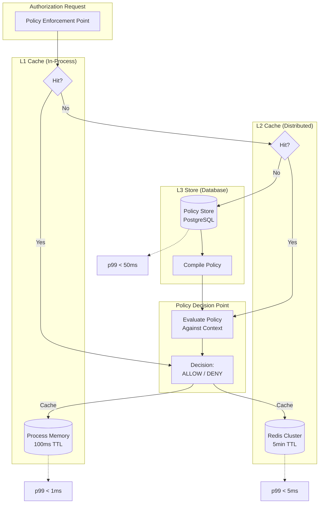
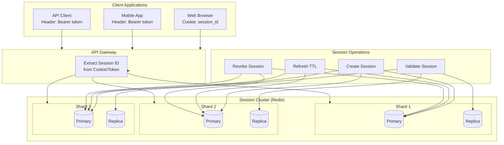
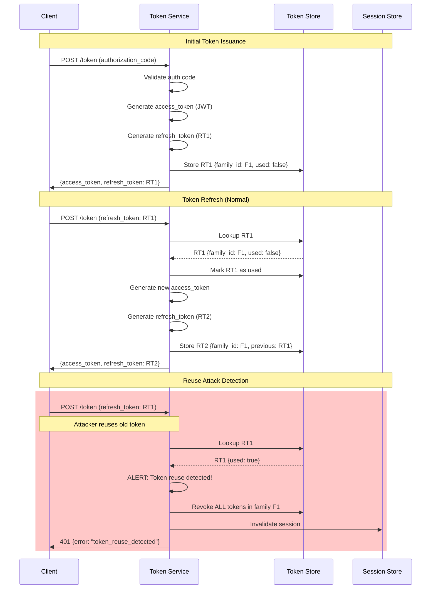
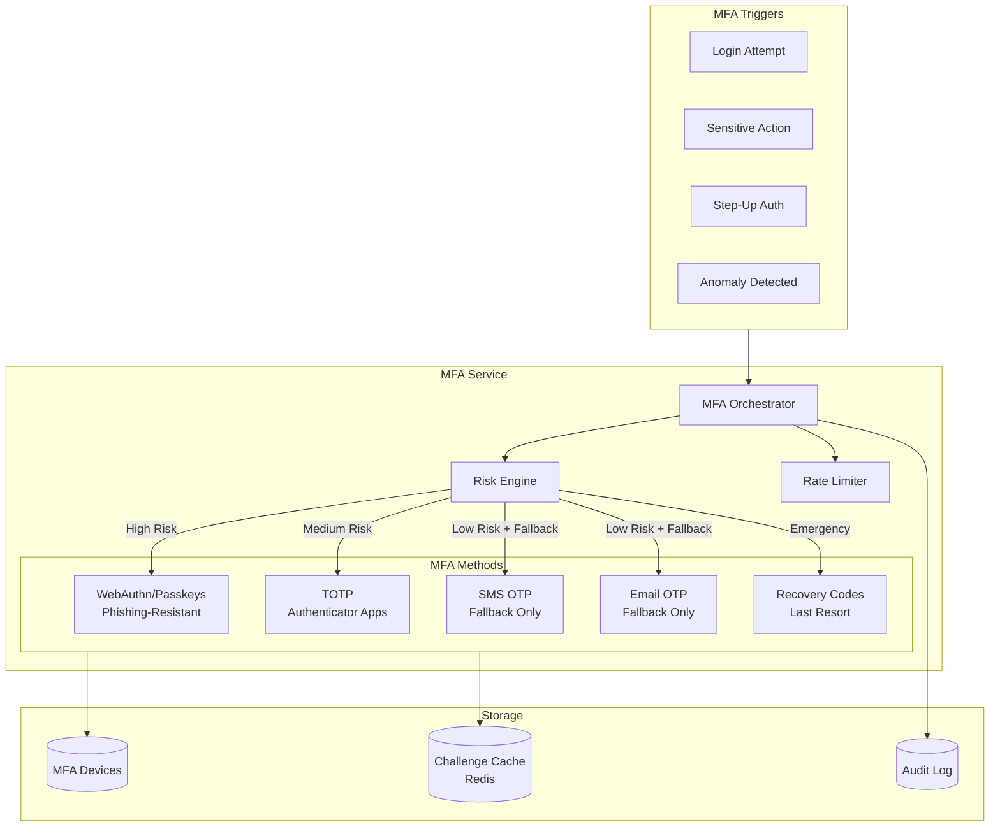

# Deep Dive & Bottlenecks

[← Back to Index](./00-index.md)

---

## Deep Dive 1: Policy Engine Architecture

### Multi-Tier Policy Caching



### Policy Compilation and Optimization

```
FUNCTION compile_policy(policy_document: JSON) -> CompiledPolicy:
    """
    Pre-compile policy for faster evaluation.
    """
    // Parse policy into AST
    ast = parse_policy_language(policy_document)

    // Optimize AST
    optimized_ast = optimize_policy_ast(ast)
        // - Constant folding
        // - Dead code elimination
        // - Common subexpression elimination

    // Generate evaluation function
    eval_function = generate_evaluator(optimized_ast)

    // Extract required attributes for context building
    required_attributes = extract_required_attributes(ast)

    // Compute policy fingerprint for cache invalidation
    fingerprint = sha256(serialize(optimized_ast))

    RETURN CompiledPolicy(
        original = policy_document,
        evaluator = eval_function,
        required_attributes = required_attributes,
        fingerprint = fingerprint,
        compiled_at = now()
    )

FUNCTION optimize_policy_ast(ast: PolicyAST) -> PolicyAST:
    """
    Apply optimizations to reduce evaluation time.
    """
    // 1. Constant folding - evaluate static conditions at compile time
    ast = fold_constants(ast)

    // 2. Short-circuit ordering - put likely-false conditions first
    ast = reorder_conditions(ast, strategy="fail_fast")

    // 3. Index suggestions - identify attributes that should be indexed
    ast = annotate_index_hints(ast)

    // 4. Flatten nested OR/AND for batch evaluation
    ast = flatten_logical_expressions(ast)

    RETURN ast
```

### Policy Versioning and Hot Reload

```
FUNCTION hot_reload_policies(tenant_id: String):
    """
    Reload policies without downtime.
    """
    // 1. Load new policy versions
    new_policies = load_policies_from_store(tenant_id)

    // 2. Compile all policies
    compiled = {}
    FOR policy IN new_policies:
        compiled[policy.id] = compile_policy(policy.document)

    // 3. Atomic swap in L1 cache
    policy_cache.atomic_swap(tenant_id, compiled)

    // 4. Invalidate L2 cache entries
    l2_cache.invalidate_pattern(f"policy:{tenant_id}:*")

    // 5. Publish invalidation event for other instances
    event_bus.publish("policy_invalidation", {
        tenant_id: tenant_id,
        version: max(p.version FOR p IN new_policies),
        invalidated_at: now()
    })

    log.info(f"Hot-reloaded {len(compiled)} policies for tenant {tenant_id}")

// Event handler on other instances
ON_EVENT "policy_invalidation":
    tenant_id = event.tenant_id
    l1_cache.invalidate(tenant_id)
    // L2 was already invalidated by primary
```

### Bottleneck Analysis: Policy Evaluation

| Bottleneck | Symptom | Cause | Solution |
|------------|---------|-------|----------|
| **Cold policy load** | First request slow (>100ms) | Policy not in cache | Warm cache on startup |
| **Complex ReBAC traversal** | Slow decisions for nested resources | Deep relationship graphs | Limit traversal depth, materialize common paths |
| **Attribute fetch latency** | Slow context building | Many attribute lookups | Batch fetch, denormalize hot attributes |
| **L2 cache thundering herd** | Spikes on cache miss | Many requests for same policy | Request coalescing, probabilistic early expiration |
| **Policy update propagation** | Stale decisions | Slow cache invalidation | Push-based invalidation, shorter TTLs |

---

## Deep Dive 2: Session Management

### Distributed Session Architecture



### Session Lifecycle Management

```
FUNCTION create_session(user: User, request: AuthRequest) -> Session:
    """
    Create a new authenticated session.
    """
    session_id = generate_secure_token(32)  // 256 bits

    session = Session(
        id = session_id,
        tenant_id = user.tenant_id,
        user_id = user.id,
        created_at = now(),
        expires_at = now() + config.session_duration,  // e.g., 24 hours
        last_active_at = now(),

        // Request context
        ip_address = request.ip_address,
        user_agent = request.user_agent,
        device_fingerprint = compute_fingerprint(request),
        geo_location = geoip_lookup(request.ip_address),

        // Auth context
        auth_method = request.auth_method,  // 'password', 'sso', 'passkey'
        mfa_verified = request.mfa_verified,
        mfa_verified_at = request.mfa_verified_at,
        idp_session_id = request.idp_session_id,  // For federated logout

        // Security
        csrf_token = generate_secure_token(16),
        security_stamp = user.security_stamp  // Invalidate on password change
    )

    // Store in Redis with TTL
    redis.setex(
        key = f"session:{session.id}",
        ttl = config.session_duration,
        value = serialize(session)
    )

    // Track user's active sessions
    redis.sadd(f"user_sessions:{user.id}", session.id)
    redis.expire(f"user_sessions:{user.id}", config.max_session_duration)

    // Audit log
    audit_log.record("session_created", {
        session_id: session.id,
        user_id: user.id,
        auth_method: session.auth_method
    })

    RETURN session

FUNCTION validate_session(session_id: String) -> SessionValidation:
    """
    Validate session and refresh if valid.
    """
    // Load session
    session_data = redis.get(f"session:{session_id}")

    IF session_data IS NULL:
        RETURN SessionValidation(valid=false, reason="session_not_found")

    session = deserialize(session_data)

    // Check expiration (defense in depth, Redis TTL should handle this)
    IF session.expires_at < now():
        RETURN SessionValidation(valid=false, reason="session_expired")

    // Check security stamp (invalidate on password/security change)
    user = user_cache.get(session.user_id)
    IF user IS NULL:
        user = db.users.find(session.user_id)
        user_cache.set(session.user_id, user, ttl=300)

    IF user.security_stamp != session.security_stamp:
        revoke_session(session_id, reason="security_stamp_changed")
        RETURN SessionValidation(valid=false, reason="session_invalidated")

    // Check user status
    IF user.status != "active":
        revoke_session(session_id, reason="user_inactive")
        RETURN SessionValidation(valid=false, reason="user_inactive")

    // Sliding window refresh
    IF config.use_sliding_sessions:
        time_since_last_active = now() - session.last_active_at

        IF time_since_last_active > config.session_refresh_threshold:
            // Refresh session
            session.last_active_at = now()
            session.expires_at = now() + config.session_duration

            redis.setex(
                key = f"session:{session_id}",
                ttl = remaining_seconds(session.expires_at),
                value = serialize(session)
            )

    RETURN SessionValidation(
        valid = true,
        session = session,
        user = user
    )

FUNCTION revoke_all_user_sessions(user_id: String, except_session_id: String = NULL):
    """
    Sign out user from all devices.
    """
    session_ids = redis.smembers(f"user_sessions:{user_id}")

    FOR session_id IN session_ids:
        IF session_id == except_session_id:
            CONTINUE  // Keep current session if specified

        revoke_session(session_id, reason="user_initiated_logout_all")

    // Update security stamp to invalidate any cached sessions
    db.users.update(user_id, {
        security_stamp = generate_uuid()
    })

    audit_log.record("all_sessions_revoked", {
        user_id: user_id,
        sessions_revoked: len(session_ids)
    })
```

### Session Anomaly Detection

```
FUNCTION detect_session_anomalies(session: Session, current_request: Request) -> List[Anomaly]:
    """
    Detect potential session hijacking or anomalies.
    """
    anomalies = []

    // 1. IP address change
    IF current_request.ip_address != session.ip_address:
        // Check if it's a reasonable change (same ASN, same geo)
        old_geo = session.geo_location
        new_geo = geoip_lookup(current_request.ip_address)

        IF old_geo.country != new_geo.country:
            anomalies.append(Anomaly(
                type = "impossible_travel",
                severity = "high",
                details = {
                    from_country: old_geo.country,
                    to_country: new_geo.country,
                    time_diff: now() - session.last_active_at
                }
            ))
        ELIF old_geo.city != new_geo.city:
            // Same country, different city - might be VPN or mobile
            anomalies.append(Anomaly(
                type = "location_change",
                severity = "medium",
                details = { from_city: old_geo.city, to_city: new_geo.city }
            ))

    // 2. User agent change
    IF current_request.user_agent != session.user_agent:
        old_ua = parse_user_agent(session.user_agent)
        new_ua = parse_user_agent(current_request.user_agent)

        IF old_ua.browser_family != new_ua.browser_family:
            anomalies.append(Anomaly(
                type = "browser_change",
                severity = "medium",
                details = { from: old_ua, to: new_ua }
            ))

    // 3. Concurrent session from different locations
    user_sessions = get_active_sessions(session.user_id)
    concurrent_suspicious = []

    FOR other_session IN user_sessions:
        IF other_session.id == session.id:
            CONTINUE

        IF is_suspicious_concurrency(session, other_session):
            concurrent_suspicious.append(other_session)

    IF concurrent_suspicious.is_not_empty():
        anomalies.append(Anomaly(
            type = "suspicious_concurrent_sessions",
            severity = "high",
            details = { sessions: concurrent_suspicious }
        ))

    // 4. Activity patterns
    IF is_unusual_activity_time(session.user_id, now()):
        anomalies.append(Anomaly(
            type = "unusual_time",
            severity = "low",
            details = { time: now(), user_typical_hours: get_typical_hours(session.user_id) }
        ))

    RETURN anomalies
```

### Bottleneck Analysis: Session Management

| Bottleneck | Symptom | Cause | Solution |
|------------|---------|-------|----------|
| **Session lookup latency** | Slow API responses | Redis network hop | Local session cache, read from replica |
| **Session store exhaustion** | OOM errors | Too many active sessions | Aggressive TTL, session limits per user |
| **Cross-region session sync** | Stale session data | Replication lag | Session affinity, async sync |
| **Thundering herd on login** | Redis spikes | Many users login simultaneously | Connection pooling, rate limiting |
| **Session serialization** | CPU spikes | Large session objects | Compress, reduce stored data |

---

## Deep Dive 3: Token Lifecycle

### Refresh Token Rotation Flow



### JWT Key Rotation

```
FUNCTION rotate_signing_keys():
    """
    Rotate JWT signing keys with zero-downtime.
    """
    // 1. Generate new key pair
    new_key = generate_rsa_key_pair(bits=2048)
    new_key_id = generate_uuid()

    // 2. Add to JWKS with "sig" use
    jwks = load_current_jwks()
    jwks.keys.append({
        kty: "RSA",
        use: "sig",
        alg: "RS256",
        kid: new_key_id,
        n: base64url_encode(new_key.public.n),
        e: base64url_encode(new_key.public.e),
        status: "active"
    })

    // 3. Mark old key as deprecated (still valid for verification)
    FOR key IN jwks.keys:
        IF key.kid != new_key_id AND key.status == "active":
            key.status = "deprecated"
            key.deprecated_at = now()

    // 4. Store new key in HSM/secure storage
    key_store.put(new_key_id, new_key.private, {
        algorithm: "RS256",
        created_at: now(),
        expires_at: now() + config.key_rotation_period
    })

    // 5. Update JWKS endpoint (CDN will cache)
    publish_jwks(jwks)

    // 6. Set new key as current signing key
    config.current_signing_key_id = new_key_id

    // 7. Schedule old key removal after max token lifetime
    schedule_task(
        at = now() + config.max_access_token_lifetime,
        task = "remove_deprecated_key",
        args = { old_key_ids: [k.kid FOR k IN jwks.keys IF k.status == "deprecated"] }
    )

    audit_log.record("key_rotated", {
        new_key_id: new_key_id,
        deprecated_keys: [k.kid FOR k IN jwks.keys IF k.status == "deprecated"]
    })

FUNCTION remove_deprecated_key(key_ids: List[String]):
    """
    Remove old keys after grace period.
    """
    jwks = load_current_jwks()
    jwks.keys = [k FOR k IN jwks.keys IF k.kid NOT IN key_ids]
    publish_jwks(jwks)

    FOR key_id IN key_ids:
        key_store.delete(key_id)
```

### Token Revocation Strategies

```
FUNCTION revoke_tokens_for_user(user_id: String, reason: String):
    """
    Revoke all tokens for a user.
    """
    // Strategy 1: Increment user's token generation
    db.users.update(user_id, {
        token_generation = token_generation + 1
    })
    // All tokens include generation; mismatched generation = invalid

    // Strategy 2: Add to revocation list (for JWTs)
    active_tokens = db.tokens.find({
        user_id: user_id,
        revoked_at: NULL,
        expires_at: { $gt: now() }
    })

    FOR token IN active_tokens:
        // Add JWT ID to revocation list
        revocation_cache.set(
            key = f"revoked_jwt:{token.jti}",
            value = true,
            ttl = remaining_seconds(token.expires_at)
        )

    // Strategy 3: Revoke refresh tokens in database
    db.refresh_tokens.update_many(
        filter = { user_id: user_id, revoked_at: NULL },
        update = { revoked_at: now(), revoked_reason: reason }
    )

    // Strategy 4: Clear sessions
    revoke_all_user_sessions(user_id)

    audit_log.record("all_tokens_revoked", {
        user_id: user_id,
        reason: reason,
        tokens_revoked: len(active_tokens)
    })
```

### Bottleneck Analysis: Token Management

| Bottleneck | Symptom | Cause | Solution |
|------------|---------|-------|----------|
| **JWT signature verification** | CPU spikes | RSA verification expensive | ECDSA (faster), cache verified tokens briefly |
| **JWKS fetch latency** | First request slow | Network call to JWKS | CDN caching, local JWKS cache |
| **Refresh token DB writes** | Database pressure | Write per rotation | Batch writes, async logging |
| **Revocation check latency** | Slow validation | Revocation list check | Bloom filter, sharded revocation cache |
| **Token introspection** | Network bottleneck | Every request calls introspection | Cache introspection results, use JWTs |

---

## Deep Dive 4: Multi-Factor Authentication (MFA)

### MFA Service Architecture



### TOTP Implementation

```
FUNCTION setup_totp(user_id: String) -> TOTPSetup:
    """
    Initialize TOTP for a user.
    """
    // Generate secret (160 bits as per RFC 6238)
    secret = generate_secure_random(20)
    secret_base32 = base32_encode(secret)

    // Create provisioning URI for QR code
    user = db.users.find(user_id)
    provisioning_uri = f"otpauth://totp/{config.issuer_name}:{user.email}?" +
                       f"secret={secret_base32}&" +
                       f"issuer={config.issuer_name}&" +
                       f"algorithm=SHA1&" +
                       f"digits=6&" +
                       f"period=30"

    // Store encrypted secret (pending verification)
    device_id = generate_uuid()
    db.mfa_devices.insert({
        id: device_id,
        user_id: user_id,
        device_type: "totp",
        device_name: "Authenticator App",
        totp_secret: encrypt(secret),
        is_verified: false,
        created_at: now()
    })

    RETURN TOTPSetup(
        device_id: device_id,
        secret: secret_base32,
        provisioning_uri: provisioning_uri,
        qr_code: generate_qr_code(provisioning_uri)
    )

FUNCTION verify_totp(device_id: String, code: String) -> Boolean:
    """
    Verify TOTP code with clock drift tolerance.
    """
    device = db.mfa_devices.find(device_id)
    secret = decrypt(device.totp_secret)

    // Check current window and ±1 window for clock drift
    current_counter = floor(now() / 30)

    FOR counter IN [current_counter - 1, current_counter, current_counter + 1]:
        expected_code = generate_totp(secret, counter)

        IF constant_time_compare(code, expected_code):
            // Prevent replay attacks within the window
            IF counter <= device.last_used_counter:
                log_security_event("totp_replay_attempt", {
                    device_id: device_id,
                    counter: counter
                })
                RETURN false

            // Update last used counter
            db.mfa_devices.update(device_id, {
                last_used_counter: counter,
                last_used_at: now()
            })

            RETURN true

    RETURN false

FUNCTION generate_totp(secret: Bytes, counter: Integer) -> String:
    """
    Generate TOTP code per RFC 6238.
    """
    // Counter as 8-byte big-endian
    counter_bytes = to_big_endian_bytes(counter, 8)

    // HMAC-SHA1
    hmac_result = hmac_sha1(secret, counter_bytes)

    // Dynamic truncation
    offset = hmac_result[19] & 0x0F
    code = ((hmac_result[offset] & 0x7F) << 24 |
            (hmac_result[offset + 1] & 0xFF) << 16 |
            (hmac_result[offset + 2] & 0xFF) << 8 |
            (hmac_result[offset + 3] & 0xFF))

    // 6-digit code
    RETURN format(code % 1000000, "06d")
```

### Risk-Based MFA Decision

```
FUNCTION determine_mfa_requirement(user: User, request: AuthRequest,
                                   session: Session = NULL) -> MFARequirement:
    """
    Determine if MFA is needed and which methods to offer.
    """
    risk_score = calculate_risk_score(user, request)

    // Check policy requirements
    policy = get_mfa_policy(user.tenant_id)

    // Always require MFA if enforced
    IF user.mfa_enforced OR policy.enforce_mfa:
        RETURN MFARequirement(
            required = true,
            reason = "policy_enforced",
            allowed_methods = get_user_mfa_methods(user)
        )

    // Risk-based decision
    IF risk_score >= policy.high_risk_threshold:
        RETURN MFARequirement(
            required = true,
            reason = "high_risk",
            risk_score = risk_score,
            allowed_methods = ["webauthn", "totp"]  // No SMS for high risk
        )

    IF risk_score >= policy.medium_risk_threshold:
        // Already has verified session? Step-up not needed for normal actions
        IF session IS NOT NULL AND session.mfa_verified:
            mfa_age = now() - session.mfa_verified_at
            IF mfa_age < policy.mfa_reauth_window:
                RETURN MFARequirement(required = false)

        RETURN MFARequirement(
            required = true,
            reason = "medium_risk",
            risk_score = risk_score,
            allowed_methods = get_user_mfa_methods(user)
        )

    RETURN MFARequirement(required = false)

FUNCTION calculate_risk_score(user: User, request: AuthRequest) -> Float:
    """
    Calculate authentication risk score (0-100).
    """
    score = 0.0

    // 1. Device recognition
    device_trust = check_device_trust(user, request.device_fingerprint)
    IF device_trust == "unknown":
        score += 20
    ELIF device_trust == "suspicious":
        score += 40

    // 2. Location analysis
    IF is_new_location(user, request.ip_address):
        score += 15
    IF is_impossible_travel(user, request.ip_address):
        score += 50

    // 3. Time analysis
    IF is_unusual_time(user, request.timestamp):
        score += 10

    // 4. Behavior analysis
    IF has_recent_failed_attempts(user):
        score += 25
    IF is_credential_stuffing_pattern(request):
        score += 40

    // 5. Request characteristics
    IF request.came_from_tor:
        score += 30
    IF request.has_known_bad_ip:
        score += 50

    // 6. Account age/activity
    IF user.account_age < timedelta(days=7):
        score += 10
    IF user.last_login > timedelta(days=90):
        score += 15

    RETURN min(100, score)
```

### Bottleneck Analysis: MFA

| Bottleneck | Symptom | Cause | Solution |
|------------|---------|-------|----------|
| **WebAuthn ceremony timeout** | Users fail auth | Network latency to authenticator | Increase timeout, retry UI |
| **SMS delivery delays** | Users can't complete | Carrier delays | Prefer TOTP/WebAuthn, show retry option |
| **TOTP clock drift** | Valid codes rejected | Client/server time difference | ±1 window tolerance, NTP sync |
| **Challenge storage** | Memory pressure | Too many pending challenges | Aggressive TTL (60s), rate limit |
| **Recovery code exhaustion** | Users locked out | All codes used | Alert before last code, easy regeneration |

---

## Cross-Cutting Bottlenecks

### Database Connection Exhaustion

```
Problem: Under load, database connections are exhausted

Root Cause:
- Each auth request holds connection for entire transaction
- Slow queries block connection pool

Solution:
1. Connection pooling (PgBouncer)
   - Transaction mode pooling
   - Max 100 connections per pool

2. Read replica routing
   - Read queries to replicas
   - Write queries to primary

3. Query optimization
   - Index on (tenant_id, email)
   - Prepared statements

4. Async processing
   - Move audit logging to async queue
   - Background session cleanup
```

### Cache Stampede Prevention

```
FUNCTION get_with_stampede_protection(cache_key: String, fetch_function: Function) -> Any:
    """
    Prevent cache stampede with probabilistic early expiration.
    """
    cached = cache.get(cache_key)

    IF cached IS NOT NULL:
        // Probabilistic early recomputation
        remaining_ttl = cache.ttl(cache_key)
        beta = 1.0  // Can tune this
        random_value = random()

        // XFetch algorithm: recompute early with probability
        IF remaining_ttl > 0:
            early_expiry_probability = exp(-remaining_ttl * beta / config.base_ttl)
            IF random_value < early_expiry_probability:
                // This request will refresh; others use stale
                GOTO fetch_fresh
            ELSE:
                RETURN cached.value

    fetch_fresh:
    // Use distributed lock to prevent stampede
    lock_key = f"lock:{cache_key}"
    acquired = cache.set(lock_key, 1, nx=true, ex=30)

    IF NOT acquired:
        // Another process is fetching; return stale or wait
        IF cached IS NOT NULL:
            RETURN cached.value
        ELSE:
            // Wait briefly for other process
            sleep(50)
            RETURN get_with_stampede_protection(cache_key, fetch_function)

    TRY:
        fresh_value = fetch_function()
        cache.set(cache_key, fresh_value, ex=config.cache_ttl)
        RETURN fresh_value
    FINALLY:
        cache.delete(lock_key)
```

### Global Rate Limiting

```
FUNCTION distributed_rate_limit(key: String, limit: Integer, window: Integer) -> Boolean:
    """
    Sliding window rate limiting across distributed instances.
    """
    current_window = floor(now() / window)
    previous_window = current_window - 1

    current_key = f"rate:{key}:{current_window}"
    previous_key = f"rate:{key}:{previous_window}"

    // Lua script for atomic operation
    SCRIPT = """
        local current = tonumber(redis.call('GET', KEYS[1]) or '0')
        local previous = tonumber(redis.call('GET', KEYS[2]) or '0')

        -- Weighted count based on window position
        local window_position = tonumber(ARGV[1])
        local weighted = previous * (1 - window_position) + current

        if weighted >= tonumber(ARGV[2]) then
            return 0  -- Rate limited
        end

        redis.call('INCR', KEYS[1])
        redis.call('EXPIRE', KEYS[1], ARGV[3])
        return 1  -- Allowed
    """

    window_position = (now() % window) / window
    result = redis.eval(SCRIPT, keys=[current_key, previous_key],
                        args=[window_position, limit, window * 2])

    RETURN result == 1
```
