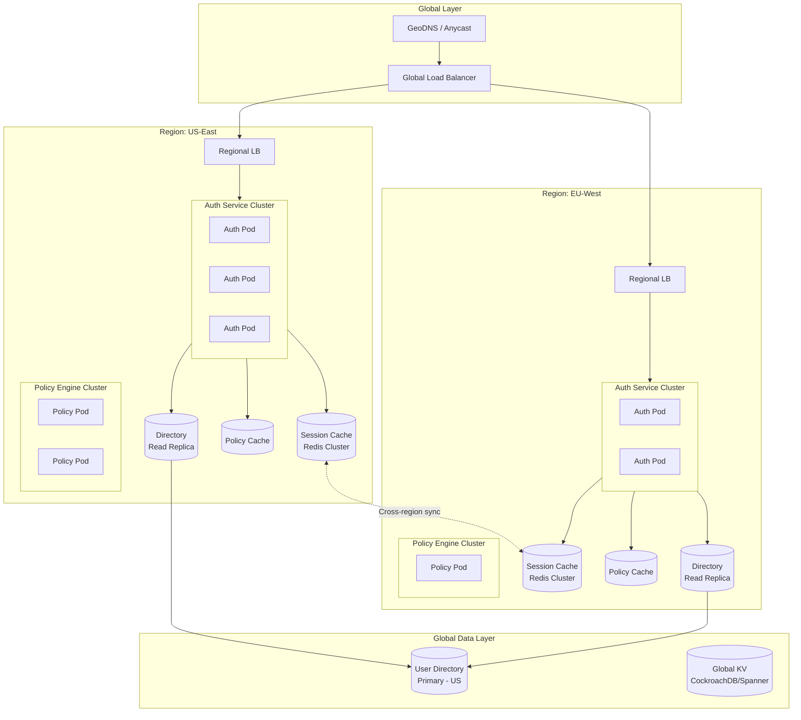
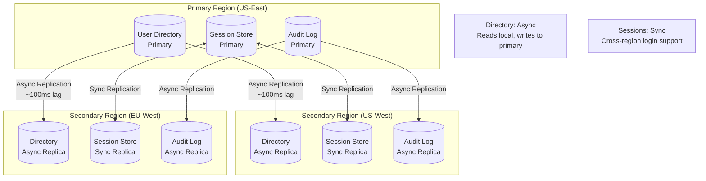
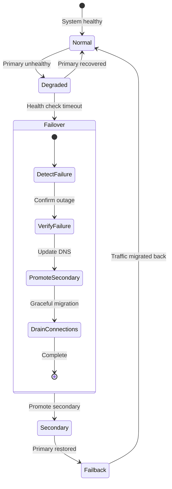

# Scalability & Reliability

[← Back to Index](./00-index.md)

---

## Scaling Strategies

### Horizontal Scaling Architecture



### Service-Level Scaling

| Service | Scaling Dimension | Strategy | Trigger |
|---------|------------------|----------|---------|
| **Auth Service** | Horizontal | Stateless pods, HPA | CPU > 70%, RPS |
| **Token Service** | Horizontal | Stateless, key cache | CPU > 60% |
| **Policy Engine** | Horizontal + Cache | Pods + larger cache | Latency p99 > 5ms |
| **Session Store** | Horizontal (Redis Cluster) | Add shards | Memory > 80% |
| **User Directory** | Vertical + Read Replicas | Larger primary, more replicas | Read latency > 10ms |
| **Audit Logger** | Horizontal | Kafka consumers | Lag > 10K messages |

### Auto-Scaling Configuration

```
# Authentication Service HPA
NAME: auth-service-hpa
MIN_REPLICAS: 10
MAX_REPLICAS: 500
METRICS:
  - type: Resource
    resource: cpu
    target: 70%
  - type: Pods
    pods:
      metric: requests_per_second
      target: 1000
SCALE_UP_STABILIZATION: 60s
SCALE_DOWN_STABILIZATION: 300s

# Policy Engine HPA
NAME: policy-engine-hpa
MIN_REPLICAS: 5
MAX_REPLICAS: 100
METRICS:
  - type: Resource
    resource: cpu
    target: 60%
  - type: External
    external:
      metric: policy_evaluation_latency_p99
      target: 5ms
```

---

## Multi-Region Architecture

### Data Replication Strategy



### Regional Routing Logic

```
FUNCTION route_request(request: Request) -> Region:
    """
    Determine which region should handle the request.
    """
    user_region = geoip_lookup(request.ip_address).region

    // Check if request requires primary (write operations)
    IF is_write_operation(request):
        IF request.requires_strong_consistency:
            RETURN get_primary_region()
        ELSE:
            // Write to local, replicate async
            RETURN get_nearest_region(user_region)

    // Read operations go to nearest region
    nearest = get_nearest_region(user_region)

    // Check region health
    IF is_region_healthy(nearest):
        RETURN nearest
    ELSE:
        // Failover to next nearest
        RETURN get_failover_region(nearest)

FUNCTION handle_cross_region_session(session_id: String, current_region: String):
    """
    Handle session access from a different region.
    """
    // Try local cache first
    session = local_session_cache.get(session_id)

    IF session IS NOT NULL:
        RETURN session

    // Check if session originated in different region
    session_home_region = extract_region_from_session_id(session_id)

    IF session_home_region != current_region:
        // Fetch from home region
        session = fetch_from_region(session_home_region, session_id)

        IF session IS NOT NULL:
            // Cache locally for subsequent requests
            local_session_cache.set(session_id, session, ttl=300)
            RETURN session

    RETURN NULL  // Session not found
```

### Cross-Region Session Synchronization

```
FUNCTION sync_session_cross_region(session: Session, target_regions: List[Region]):
    """
    Replicate session to other regions for seamless access.
    """
    // Serialize session for transport
    session_data = serialize(session)

    // Async replication to all regions
    FOR region IN target_regions:
        IF region == current_region():
            CONTINUE

        // Use dedicated cross-region channel
        replication_queue.publish(
            topic = f"session_sync_{region}",
            message = {
                session_id: session.id,
                data: session_data,
                version: session.version,
                timestamp: now()
            }
        )

// Consumer in each region
ON_MESSAGE "session_sync_{region}":
    message = parse_message()

    existing = local_session_cache.get(message.session_id)

    IF existing IS NULL OR existing.version < message.version:
        local_session_cache.set(
            message.session_id,
            deserialize(message.data),
            ttl = calculate_remaining_ttl(message)
        )
```

---

## Fault Tolerance

### Circuit Breaker Implementation

```
CLASS CircuitBreaker:
    STATE = ENUM(CLOSED, OPEN, HALF_OPEN)

    def __init__(self, failure_threshold=5, recovery_timeout=30, half_open_requests=3):
        self.state = CLOSED
        self.failure_count = 0
        self.success_count = 0
        self.last_failure_time = NULL
        self.failure_threshold = failure_threshold
        self.recovery_timeout = recovery_timeout
        self.half_open_requests = half_open_requests

    def call(self, operation):
        IF self.state == OPEN:
            IF now() - self.last_failure_time > self.recovery_timeout:
                self.state = HALF_OPEN
                self.success_count = 0
            ELSE:
                RAISE CircuitOpenError()

        TRY:
            result = operation()

            IF self.state == HALF_OPEN:
                self.success_count += 1
                IF self.success_count >= self.half_open_requests:
                    self.state = CLOSED
                    self.failure_count = 0

            RETURN result

        CATCH Exception as e:
            self.record_failure()
            RAISE e

    def record_failure(self):
        self.failure_count += 1
        self.last_failure_time = now()

        IF self.failure_count >= self.failure_threshold:
            self.state = OPEN
            log.warn(f"Circuit breaker opened after {self.failure_count} failures")

// Usage for external IdP calls
idp_circuit_breaker = CircuitBreaker(failure_threshold=3, recovery_timeout=60)

FUNCTION federated_login(idp: IdentityProvider, request: AuthRequest):
    TRY:
        RETURN idp_circuit_breaker.call(
            lambda: idp.authenticate(request)
        )
    CATCH CircuitOpenError:
        // Fallback: offer local auth or queue for retry
        RETURN FallbackResponse(
            message = "External identity provider temporarily unavailable",
            fallback_options = ["local_password", "retry_later"]
        )
```

### Graceful Degradation Strategies

```
FUNCTION authenticate_with_degradation(request: AuthRequest) -> AuthResult:
    """
    Authentication with graceful degradation on failures.
    """
    degradation_level = get_current_degradation_level()

    // Level 0: Normal operation
    IF degradation_level == 0:
        RETURN full_authentication(request)

    // Level 1: Skip non-essential features
    IF degradation_level == 1:
        result = authenticate_core(request)
        // Skip: device fingerprinting, behavioral analysis, detailed audit
        schedule_async("complete_auth_metadata", request, result)
        RETURN result

    // Level 2: Cached-only mode
    IF degradation_level == 2:
        // Try cache-based auth (recently authenticated users)
        cached_session = check_cached_credentials(request)
        IF cached_session IS NOT NULL:
            RETURN AuthResult(success=true, session=cached_session, degraded=true)

        // Allow if risk is low
        IF calculate_quick_risk(request) < 30:
            RETURN AuthResult(
                success=true,
                provisional=true,  // Will verify fully later
                requires_reauth=true
            )

        RETURN AuthResult(success=false, retry_after=60)

    // Level 3: Emergency mode - only critical operations
    IF degradation_level == 3:
        // Only allow pre-cached/remembered users
        IF is_remembered_device(request):
            RETURN AuthResult(success=true, emergency_mode=true)

        RETURN AuthResult(
            success=false,
            message="Service temporarily limited",
            retry_after=300
        )

FUNCTION determine_degradation_level() -> Integer:
    """
    Determine current system degradation level based on health.
    """
    health = {
        database: check_database_health(),
        cache: check_cache_health(),
        external_idp: check_idp_health(),
        policy_engine: check_policy_health()
    }

    critical_services = [health.database, health.cache]
    important_services = [health.policy_engine]

    IF any(NOT s.healthy FOR s IN critical_services):
        IF all(NOT s.healthy FOR s IN critical_services):
            RETURN 3  // Emergency
        RETURN 2  // Cached-only

    IF any(s.latency > s.threshold FOR s IN important_services):
        RETURN 1  // Skip non-essential

    RETURN 0  // Normal
```

### Bulkhead Pattern

```
CLASS BulkheadManager:
    """
    Isolate different types of requests to prevent cascade failures.
    """

    def __init__(self):
        self.pools = {
            "user_auth": ThreadPool(max_workers=100),
            "admin_auth": ThreadPool(max_workers=20),
            "token_validation": ThreadPool(max_workers=200),
            "scim_provisioning": ThreadPool(max_workers=30),
            "external_idp": ThreadPool(max_workers=50),
        }

        self.semaphores = {
            "db_connections": Semaphore(50),
            "redis_connections": Semaphore(100),
            "external_calls": Semaphore(30),
        }

    def execute(self, pool_name: String, operation: Function):
        pool = self.pools.get(pool_name)
        IF pool IS NULL:
            RAISE ValueError(f"Unknown pool: {pool_name}")

        IF pool.active_count >= pool.max_workers * 0.9:
            // Near capacity - reject to protect system
            RAISE BulkheadFullError(f"Pool {pool_name} at capacity")

        RETURN pool.submit(operation)

    def acquire_resource(self, resource: String, timeout: Integer = 5):
        semaphore = self.semaphores.get(resource)
        IF NOT semaphore.acquire(timeout=timeout):
            RAISE ResourceExhaustedError(f"Cannot acquire {resource}")
        RETURN ResourceGuard(semaphore)

// Usage
bulkhead = BulkheadManager()

FUNCTION handle_authentication(request):
    // Uses dedicated auth pool, won't be affected by SCIM overload
    RETURN bulkhead.execute("user_auth", lambda: authenticate(request))

FUNCTION handle_scim_sync(request):
    // Uses dedicated SCIM pool, won't affect user auth
    RETURN bulkhead.execute("scim_provisioning", lambda: scim_sync(request))
```

---

## Disaster Recovery

### RPO/RTO Targets

| Component | RPO (Data Loss) | RTO (Downtime) | Strategy |
|-----------|-----------------|----------------|----------|
| **User Directory** | 0 (synchronous) | < 5 minutes | Multi-region sync replication |
| **Sessions** | < 1 minute | < 1 minute | Redis Cluster with persistence |
| **Policies** | 0 (synchronous) | < 2 minutes | Git-based with sync deploy |
| **Audit Logs** | < 5 minutes | < 30 minutes | Async replication, archived |
| **MFA Devices** | 0 | < 5 minutes | Part of user directory |
| **Tokens** | N/A (regenerable) | < 1 minute | Stateless (JWT) or re-issue |

### Failover Procedure



### Automated Failover Logic

```
FUNCTION monitor_region_health(region: Region):
    """
    Continuous health monitoring for automated failover.
    """
    health_checks = [
        check_auth_service_health(region),
        check_database_health(region),
        check_cache_health(region),
        check_network_connectivity(region)
    ]

    // All checks must pass
    is_healthy = all(check.passed FOR check IN health_checks)
    latency = max(check.latency FOR check IN health_checks)

    RETURN RegionHealth(
        region = region,
        healthy = is_healthy,
        latency = latency,
        checks = health_checks,
        timestamp = now()
    )

FUNCTION initiate_failover(failed_region: Region, target_region: Region):
    """
    Execute region failover.
    """
    log.critical(f"Initiating failover from {failed_region} to {target_region}")

    // 1. Stop routing new traffic to failed region
    update_dns_routing(failed_region, weight=0)

    // 2. Wait for in-flight requests to complete
    wait_for_drain(failed_region, timeout=30)

    // 3. Promote read replica to primary (if database failover)
    IF needs_database_promotion(failed_region):
        promote_database_replica(target_region)

    // 4. Update session store routing
    update_session_routing(failed_region, target_region)

    // 5. Verify target region is handling traffic
    verify_traffic_flow(target_region)

    // 6. Send alerts
    alert_operations_team("failover_complete", {
        from_region: failed_region,
        to_region: target_region,
        timestamp: now()
    })

    // 7. Start monitoring for failback opportunity
    schedule_failback_evaluation(failed_region)

FUNCTION evaluate_failback(original_region: Region):
    """
    Check if original region is ready for failback.
    """
    // Region must be healthy for sustained period
    health_history = get_health_history(original_region, window=minutes(10))

    IF all(h.healthy FOR h IN health_history):
        IF len(health_history) >= 10:  // At least 10 healthy checks
            // Safe to consider failback
            initiate_failback(original_region)

FUNCTION initiate_failback(original_region: Region):
    """
    Gradually return traffic to recovered region.
    """
    // Canary: send 5% traffic
    update_dns_routing(original_region, weight=5)
    wait_and_verify(minutes(5))

    // Increase to 25%
    update_dns_routing(original_region, weight=25)
    wait_and_verify(minutes(5))

    // Increase to 50%
    update_dns_routing(original_region, weight=50)
    wait_and_verify(minutes(10))

    // Full traffic
    update_dns_routing(original_region, weight=100)
    log.info(f"Failback to {original_region} complete")
```

---

## Load Testing & Capacity Planning

### Load Test Scenarios

```
SCENARIO: Peak Authentication Load
    DESCRIPTION: Simulate morning login surge
    DURATION: 30 minutes
    USERS:
        - ramp_up: 0 -> 100,000 over 5 minutes
        - sustain: 100,000 for 20 minutes
        - ramp_down: 100,000 -> 0 over 5 minutes
    ACTIONS:
        - 70%: Password login
        - 20%: SSO login
        - 10%: Passkey login
    ASSERTIONS:
        - login_latency_p99 < 500ms
        - error_rate < 0.1%
        - cpu_utilization < 80%

SCENARIO: Token Validation Stress
    DESCRIPTION: Sustained high-volume token validation
    DURATION: 60 minutes
    REQUESTS_PER_SECOND: 500,000
    ACTIONS:
        - 95%: JWT validation (local)
        - 5%: Token introspection (network)
    ASSERTIONS:
        - jwt_validation_p99 < 1ms
        - introspection_p99 < 10ms
        - no_memory_leaks

SCENARIO: Policy Engine Under Load
    DESCRIPTION: Complex policy evaluations
    DURATION: 30 minutes
    REQUESTS_PER_SECOND: 100,000
    POLICY_COMPLEXITY:
        - 40%: Simple RBAC (2-3 role checks)
        - 40%: ABAC (5-10 attribute conditions)
        - 20%: ReBAC (graph traversal, 3-5 hops)
    ASSERTIONS:
        - evaluation_p99 < 10ms
        - cache_hit_rate > 90%

SCENARIO: Chaos Engineering
    DESCRIPTION: Test resilience during failures
    DURATION: 60 minutes
    FAILURES:
        - minute 10: Kill 30% of auth pods
        - minute 20: Database failover
        - minute 30: Network partition (region isolation)
        - minute 40: Cache cluster restart
        - minute 50: External IdP timeout
    ASSERTIONS:
        - no_data_loss
        - auto_recovery < 5 minutes
        - degradation_graceful
```

### Capacity Planning Formula

```
FUNCTION calculate_required_capacity(
    target_logins_per_day: Integer,
    target_validations_per_day: Integer,
    peak_multiplier: Float = 5.0,
    headroom: Float = 1.5
) -> CapacityPlan:
    """
    Calculate infrastructure requirements.
    """
    // Convert to per-second rates
    avg_logins_per_sec = target_logins_per_day / 86400
    peak_logins_per_sec = avg_logins_per_sec * peak_multiplier

    avg_validations_per_sec = target_validations_per_day / 86400
    peak_validations_per_sec = avg_validations_per_sec * peak_multiplier

    // Auth service sizing (1 pod handles ~500 logins/sec)
    auth_pods = ceil(peak_logins_per_sec / 500 * headroom)

    // Token validation sizing (1 pod handles ~10,000 validations/sec)
    validation_pods = ceil(peak_validations_per_sec / 10000 * headroom)

    // Policy engine sizing (1 pod handles ~5,000 evaluations/sec)
    policy_pods = ceil(peak_validations_per_sec / 5000 * headroom)

    // Session store sizing
    concurrent_sessions = target_logins_per_day * 0.2  // 20% DAU at any time
    session_memory_gb = concurrent_sessions * 1 / 1024 / 1024  // 1KB per session
    redis_nodes = ceil(session_memory_gb / 32 * 3)  // 32GB per node, 3x for replication

    // Database sizing
    total_users = target_logins_per_day * 10  // Assume 10% DAU
    db_storage_tb = total_users * 2 / 1024 / 1024 / 1024  // 2KB per user
    read_replicas = ceil(peak_logins_per_sec / 5000)  // 5000 reads/sec per replica

    RETURN CapacityPlan(
        auth_service_pods = auth_pods,
        token_service_pods = validation_pods,
        policy_engine_pods = policy_pods,
        redis_cluster_nodes = redis_nodes,
        redis_memory_per_node_gb = 32,
        database_storage_tb = db_storage_tb,
        database_read_replicas = read_replicas,

        estimated_monthly_cost = calculate_cost(...)
    )

// Example calculation
plan = calculate_required_capacity(
    target_logins_per_day = 500_000_000,      // 500M logins/day
    target_validations_per_day = 50_000_000_000  // 50B validations/day
)

// Result:
// auth_service_pods: ~90
// token_service_pods: ~45
// policy_engine_pods: ~90
// redis_cluster_nodes: ~30
// database_read_replicas: ~12
```

---

## Performance Optimization

### Hot Path Optimization

```
FUNCTION optimize_jwt_validation():
    """
    Optimizations for the hottest path: JWT validation.
    """
    optimizations = [
        // 1. JWKS key caching
        JWKSCache(
            refresh_interval = hours(1),
            stale_while_revalidate = true,
            preload_on_startup = true
        ),

        // 2. Signature verification pooling
        SignatureVerifierPool(
            algorithm = "RS256",
            pool_size = cpu_count() * 2,
            precomputed_public_keys = true
        ),

        // 3. Claims validation short-circuit
        ClaimsValidator(
            check_order = ["exp", "iat", "iss", "aud"],  // Fail fast
            skip_optional_on_failure = true
        ),

        // 4. Token structure caching
        TokenStructureCache(
            cache_parsed_headers = true,  // Same structure reused
            max_size = 1000
        ),

        // 5. Zero-copy parsing
        JWTParser(
            zero_copy = true,
            lazy_claims_parsing = true  // Only parse needed claims
        )
    ]

    RETURN TokenValidationPipeline(optimizations)

FUNCTION optimize_policy_evaluation():
    """
    Optimizations for policy evaluation path.
    """
    optimizations = [
        // 1. Policy pre-compilation
        PolicyCompiler(
            compile_on_change = true,
            bytecode_cache = true
        ),

        // 2. Attribute pre-fetching
        AttributePrefetcher(
            batch_fetch = true,
            parallel_sources = true
        ),

        // 3. Decision caching
        DecisionCache(
            l1_size = 10000,  // In-process
            l1_ttl = seconds(60),
            l2_enabled = true,  // Redis
            l2_ttl = seconds(300),
            cache_key_normalization = true
        ),

        // 4. Short-circuit evaluation
        ShortCircuitEvaluator(
            deny_first = true,  // Check deny rules before allow
            role_check_before_abac = true  // Simple checks first
        ),

        // 5. Incremental evaluation
        IncrementalEvaluator(
            reuse_partial_results = true,
            dependency_tracking = true
        )
    ]

    RETURN PolicyEvaluationPipeline(optimizations)
```

### Connection Pooling Strategy

```
CONNECTION_POOL_CONFIG:
    database:
        primary:
            min_connections: 20
            max_connections: 100
            max_idle_time: 300s
            connection_timeout: 5s
            statement_cache_size: 100
        replicas:
            min_connections: 10
            max_connections: 50
            # Replicas can have more aggressive recycling
            max_idle_time: 120s

    redis:
        cluster:
            min_connections_per_node: 10
            max_connections_per_node: 50
            connection_timeout: 1s
            socket_timeout: 500ms
            retry_on_timeout: true

    external_idp:
        # More conservative for external services
        max_connections: 20
        connection_timeout: 10s
        request_timeout: 30s
        retry_policy:
            max_retries: 2
            backoff: exponential
```
