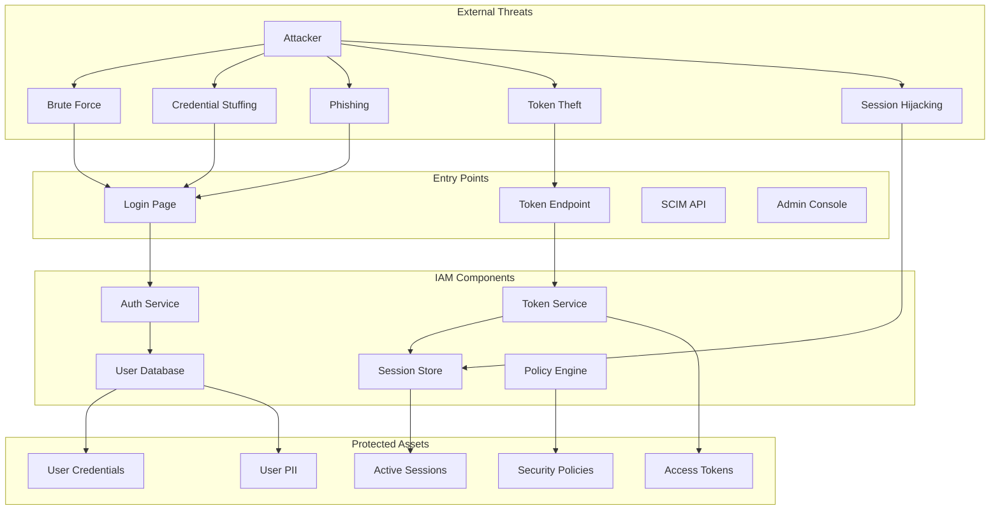
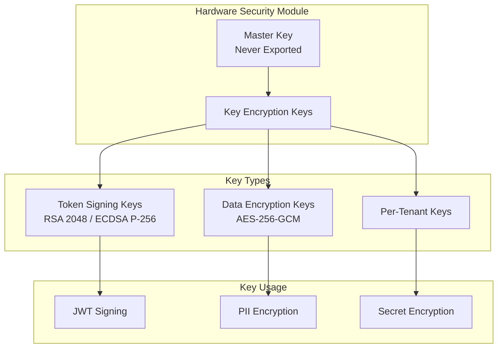

# Security & Compliance

[← Back to Index](./00-index.md)

---

## Threat Model

### Attack Surface Analysis



### Threat Categories and Mitigations

| Threat | Impact | Likelihood | Mitigation |
|--------|--------|------------|------------|
| **Brute Force** | Account takeover | High | Rate limiting, account lockout, CAPTCHA |
| **Credential Stuffing** | Mass account compromise | High | Breached password check, anomaly detection |
| **Phishing** | Credential theft | High | WebAuthn/Passkeys, security awareness |
| **Session Hijacking** | Unauthorized access | Medium | Secure cookies, session binding, anomaly detection |
| **Token Theft** | API access | Medium | Short-lived tokens, token binding, refresh rotation |
| **SQL Injection** | Data breach | Medium | Parameterized queries, WAF, input validation |
| **XSS** | Session theft | Medium | CSP, output encoding, HttpOnly cookies |
| **Privilege Escalation** | Unauthorized admin access | Low | Principle of least privilege, audit logging |
| **Insider Threat** | Data exfiltration | Low | Access controls, audit logging, separation of duties |

---

## Credential Security

### Password Security Implementation

```
CLASS PasswordSecurityManager:
    """
    Comprehensive password security implementation.
    """

    // Argon2id parameters (OWASP 2023 recommendations)
    ARGON2_MEMORY = 19456     // 19 MiB
    ARGON2_TIME = 2          // 2 iterations
    ARGON2_PARALLELISM = 1   // 1 lane

    // Password policy
    MIN_LENGTH = 12
    MAX_LENGTH = 128
    REQUIRE_COMPLEXITY = false  // Length > complexity per NIST
    CHECK_BREACHED = true

    def hash_password(self, password: String) -> String:
        """Hash password with Argon2id."""
        // Validate password meets policy
        self.validate_password_policy(password)

        // Generate 16-byte random salt
        salt = generate_secure_random(16)

        // Hash with Argon2id
        hash = argon2id_hash(
            password = password.encode("utf-8"),
            salt = salt,
            memory_cost = self.ARGON2_MEMORY,
            time_cost = self.ARGON2_TIME,
            parallelism = self.ARGON2_PARALLELISM,
            hash_length = 32
        )

        // Return PHC string format
        RETURN encode_phc_string("argon2id", hash, salt, {
            m: self.ARGON2_MEMORY,
            t: self.ARGON2_TIME,
            p: self.ARGON2_PARALLELISM
        })

    def verify_password(self, password: String, hash: String) -> VerificationResult:
        """Verify password with timing-safe comparison."""
        TRY:
            // Constant-time verification
            is_valid = argon2id_verify(password, hash)

            // Check if rehash needed (params changed)
            needs_rehash = self.needs_rehash(hash)

            RETURN VerificationResult(
                valid = is_valid,
                needs_rehash = needs_rehash
            )
        CATCH:
            // Always take same time on failure
            sleep(random(50, 100))  // 50-100ms
            RETURN VerificationResult(valid=false)

    def check_breached_password(self, password: String) -> Boolean:
        """Check if password appears in known breaches using k-anonymity."""
        // SHA-1 hash for HIBP API compatibility
        sha1_hash = sha1(password.encode("utf-8")).hexdigest().upper()
        prefix = sha1_hash[:5]
        suffix = sha1_hash[5:]

        // Query HIBP API with k-anonymity (only send prefix)
        response = hibp_api.get_range(prefix)

        // Check if our suffix appears in results
        FOR line IN response.split("\n"):
            hash_suffix, count = line.split(":")
            IF hash_suffix == suffix:
                RETURN true  // Password found in breach

        RETURN false

    def validate_password_policy(self, password: String):
        """Validate password meets security policy."""
        IF len(password) < self.MIN_LENGTH:
            RAISE PasswordPolicyError(f"Password must be at least {self.MIN_LENGTH} characters")

        IF len(password) > self.MAX_LENGTH:
            RAISE PasswordPolicyError(f"Password cannot exceed {self.MAX_LENGTH} characters")

        IF self.CHECK_BREACHED AND self.check_breached_password(password):
            RAISE PasswordPolicyError("This password has appeared in a data breach")

        // Check for common patterns
        IF is_common_password(password):
            RAISE PasswordPolicyError("This password is too common")

        IF contains_user_info(password, user):
            RAISE PasswordPolicyError("Password cannot contain personal information")
```

### Key Management



### Key Hierarchy and Rotation

```
KEY_HIERARCHY:
    Level 0 (Root):
        - Master Key (HSM-protected)
        - Never exported, never rotated (replaced only)
        - Used only to encrypt Level 1 keys

    Level 1 (Key Encryption Keys):
        - Regional KEKs (one per region)
        - Rotated annually
        - Encrypted by Master Key

    Level 2 (Data Keys):
        - Token Signing Keys (per-tenant optional)
          - Rotation: Every 90 days
          - Grace period: Previous key valid for 24 hours
        - Data Encryption Keys
          - Rotation: Every 365 days
          - Re-encryption: Lazy on access

KEY_ROTATION_PROCEDURE:
    1. Generate new key in HSM
    2. Add to active key set (new key is primary)
    3. Old key remains in active set (for validation)
    4. After grace period, move old key to archive
    5. After retention period, destroy old key

    // For signing keys (e.g., JWT)
    JWT_KEY_ROTATION:
        - New key becomes signing key immediately
        - Old key remains in JWKS for max_token_lifetime
        - Clients refresh JWKS automatically (cache headers)
```

---

## Authentication Security

### Brute Force Protection

```
CLASS BruteForceProtection:
    """
    Multi-layer brute force protection.
    """

    // Thresholds
    IP_RATE_LIMIT = 100 requests / minute
    ACCOUNT_LOCKOUT_THRESHOLD = 5 failures
    ACCOUNT_LOCKOUT_DURATION = 15 minutes
    GLOBAL_RATE_LIMIT = 10000 requests / second

    def check_request(self, request: AuthRequest) -> CheckResult:
        """Multi-layer rate limiting check."""

        // Layer 1: Global rate limit (DDoS protection)
        IF self.is_global_rate_exceeded():
            RETURN CheckResult(blocked=true, reason="global_rate_limit")

        // Layer 2: IP-based rate limit
        ip_rate = self.get_ip_rate(request.ip_address)
        IF ip_rate > self.IP_RATE_LIMIT:
            self.log_suspicious_ip(request.ip_address)
            RETURN CheckResult(blocked=true, reason="ip_rate_limit", retry_after=60)

        // Layer 3: Account lockout
        IF request.username:
            account_state = self.get_account_state(request.username)

            IF account_state.locked_until > now():
                remaining = account_state.locked_until - now()
                RETURN CheckResult(
                    blocked = true,
                    reason = "account_locked",
                    retry_after = remaining.seconds
                )

        // Layer 4: Credential stuffing detection
        IF self.is_credential_stuffing_pattern(request):
            self.trigger_captcha(request)
            RETURN CheckResult(requires_captcha=true)

        RETURN CheckResult(allowed=true)

    def record_failure(self, request: AuthRequest):
        """Record authentication failure."""
        // Increment IP failure counter
        self.increment_ip_failures(request.ip_address)

        // Increment account failure counter
        IF request.username:
            failures = self.increment_account_failures(request.username)

            IF failures >= self.ACCOUNT_LOCKOUT_THRESHOLD:
                self.lock_account(
                    request.username,
                    duration = self.ACCOUNT_LOCKOUT_DURATION,
                    reason = "too_many_failures"
                )

                // Alert on repeated lockouts
                IF self.get_lockout_count_today(request.username) >= 3:
                    self.alert_security_team("repeated_lockouts", {
                        username: request.username,
                        ip: request.ip_address
                    })

    def is_credential_stuffing_pattern(self, request: AuthRequest) -> Boolean:
        """Detect credential stuffing attacks."""
        patterns = [
            // Many different usernames from same IP
            self.unique_usernames_from_ip(request.ip_address, window=minutes(5)) > 10,

            // Same username from many IPs
            self.unique_ips_for_username(request.username, window=minutes(5)) > 5,

            // Known bad IP reputation
            self.is_known_bad_ip(request.ip_address),

            // Abnormal user agent patterns
            self.is_suspicious_user_agent(request.user_agent),

            // Timing patterns (too consistent = bot)
            self.has_bot_timing_pattern(request.ip_address)
        ]

        RETURN any(patterns)
```

### Phishing-Resistant Authentication (WebAuthn)

```
CLASS WebAuthnSecurityPolicy:
    """
    Security policies for WebAuthn implementation.
    """

    // Relying Party configuration
    RP_ID = "example.com"  // Must match origin
    RP_NAME = "Example Corp"
    ORIGIN = "https://example.com"

    // Attestation preferences
    ATTESTATION_PREFERENCE = "direct"  // Request attestation
    ATTESTATION_REQUIRED = false       // Don't reject without it

    // Authenticator requirements
    REQUIRE_RESIDENT_KEY = false       // Discoverable credentials optional
    USER_VERIFICATION = "preferred"    // Biometric/PIN when available

    // Security checks
    VERIFY_ORIGIN = true
    VERIFY_RP_ID = true
    CHECK_SIGN_COUNT = true
    TIMEOUT = 60000  // 60 seconds

    def verify_registration(self, credential: PublicKeyCredential,
                           challenge: Bytes, user: User) -> RegistrationResult:
        """Verify WebAuthn registration response."""

        // 1. Decode attestation object
        attestation = decode_attestation(credential.response.attestationObject)
        client_data = decode_client_data(credential.response.clientDataJSON)

        // 2. Verify origin
        IF client_data.origin != self.ORIGIN:
            RAISE SecurityError("Origin mismatch")

        // 3. Verify challenge
        IF client_data.challenge != base64url_encode(challenge):
            RAISE SecurityError("Challenge mismatch")

        // 4. Verify RP ID hash
        expected_rp_id_hash = sha256(self.RP_ID)
        IF attestation.authData.rpIdHash != expected_rp_id_hash:
            RAISE SecurityError("RP ID mismatch")

        // 5. Verify user present flag
        IF NOT attestation.authData.flags.UP:
            RAISE SecurityError("User presence required")

        // 6. Verify attestation (optional but recommended)
        IF self.ATTESTATION_PREFERENCE != "none":
            attestation_result = self.verify_attestation(
                attestation.fmt,
                attestation.attStmt,
                attestation.authData
            )

            IF attestation_result.trust_level == "self":
                log.warn("Self-attestation only - lower assurance")

        // 7. Extract and store credential
        credential_data = attestation.authData.attestedCredentialData
        public_key = decode_cose_key(credential_data.credentialPublicKey)

        RETURN RegistrationResult(
            credential_id = credential_data.credentialId,
            public_key = public_key,
            sign_count = attestation.authData.signCount,
            aaguid = credential_data.aaguid,
            attestation_type = attestation.fmt
        )
```

---

## Token Security

### Token Binding and Proof-of-Possession

```
CLASS DPoPTokenBinder:
    """
    Demonstrating Proof-of-Possession (DPoP) for token binding.
    """

    def create_dpop_proof(self, method: String, uri: String,
                         access_token: String = NULL) -> String:
        """Create DPoP proof JWT."""

        // Generate ephemeral key pair
        private_key, public_key = generate_ec_key_pair("P-256")

        // Build DPoP JWT
        header = {
            "typ": "dpop+jwt",
            "alg": "ES256",
            "jwk": public_key.to_jwk()  // Embed public key
        }

        payload = {
            "jti": generate_uuid(),      // Unique identifier
            "htm": method,               // HTTP method
            "htu": uri,                  // HTTP URI
            "iat": now(),
            "exp": now() + 60,           // Short-lived
        }

        // Include access token hash if binding to existing token
        IF access_token IS NOT NULL:
            payload["ath"] = base64url(sha256(access_token))

        RETURN jwt_sign(header, payload, private_key)

    def verify_dpop_proof(self, dpop_proof: String, method: String,
                         uri: String, access_token: String = NULL) -> Boolean:
        """Verify DPoP proof."""

        // Decode without verification first
        header = jwt_decode_header(dpop_proof)

        // Verify type
        IF header.typ != "dpop+jwt":
            RAISE DPoPError("Invalid type")

        // Extract public key from header
        public_key = jwk_to_key(header.jwk)

        // Verify signature
        payload = jwt_verify(dpop_proof, public_key)

        // Verify claims
        IF payload.htm != method:
            RAISE DPoPError("Method mismatch")

        IF payload.htu != uri:
            RAISE DPoPError("URI mismatch")

        IF payload.iat > now() OR payload.exp < now():
            RAISE DPoPError("Invalid timestamps")

        // Verify access token binding
        IF access_token IS NOT NULL:
            expected_ath = base64url(sha256(access_token))
            IF payload.ath != expected_ath:
                RAISE DPoPError("Access token binding mismatch")

        // Check for replay
        IF self.is_proof_replayed(payload.jti):
            RAISE DPoPError("Proof replay detected")

        self.mark_proof_used(payload.jti, ttl=300)

        RETURN true
```

### Token Revocation Strategies

```
CLASS TokenRevocationManager:
    """
    Multi-strategy token revocation.
    """

    def revoke_access_token(self, token: String, reason: String):
        """Revoke an access token (JWT)."""

        claims = decode_jwt_unverified(token)

        // Strategy 1: Add to revocation list (short TTL cache)
        remaining_ttl = claims.exp - now()
        IF remaining_ttl > 0:
            revocation_cache.set(
                key = f"revoked:jwt:{claims.jti}",
                value = { reason: reason, revoked_at: now() },
                ttl = remaining_ttl
            )

        // Strategy 2: Increment user's token generation
        IF reason IN ["password_change", "security_incident"]:
            db.users.update(claims.sub, {
                token_generation = token_generation + 1
            })

        audit_log.record("token_revoked", {
            token_id = claims.jti,
            user_id = claims.sub,
            reason = reason
        })

    def is_token_revoked(self, jti: String) -> Boolean:
        """Check if token is revoked."""
        RETURN revocation_cache.exists(f"revoked:jwt:{jti}")

    def revoke_all_tokens(self, user_id: String, reason: String):
        """Revoke all tokens for a user."""

        // Increment token generation (invalidates all JWTs)
        db.users.update(user_id, {
            token_generation = token_generation + 1,
            security_stamp = generate_uuid()
        })

        // Revoke all refresh tokens
        db.refresh_tokens.update_many(
            filter = { user_id: user_id, revoked_at: NULL },
            update = { revoked_at: now(), revoked_reason: reason }
        )

        // Clear all sessions
        session_ids = redis.smembers(f"user_sessions:{user_id}")
        FOR session_id IN session_ids:
            redis.delete(f"session:{session_id}")
        redis.delete(f"user_sessions:{user_id}")

        audit_log.record("all_tokens_revoked", {
            user_id = user_id,
            reason = reason
        })
```

---

## Compliance Requirements

### Compliance Matrix

| Framework | Requirement | Implementation | Evidence |
|-----------|-------------|----------------|----------|
| **SOC 2 Type II** | | | |
| CC6.1 | Logical access controls | RBAC, MFA, session management | Access policies, MFA logs |
| CC6.2 | Registration/authorization | User provisioning workflow | SCIM logs, approval records |
| CC6.3 | Access revocation | Automated deprovisioning | Offboarding logs |
| CC7.2 | System monitoring | Security event logging | Audit logs, SIEM alerts |
| **GDPR** | | | |
| Art. 5(1)(f) | Integrity and confidentiality | Encryption, access controls | Technical measures doc |
| Art. 17 | Right to erasure | Data deletion workflow | Deletion logs |
| Art. 32 | Security of processing | Password hashing, MFA | Security controls doc |
| Art. 33 | Breach notification | Incident response process | IR runbook, notifications |
| **HIPAA** | | | |
| 164.312(a)(1) | Access control | RBAC, break-glass procedures | Access control policy |
| 164.312(b) | Audit controls | Comprehensive audit logging | Audit log retention |
| 164.312(c)(1) | Integrity | Data integrity checks | Integrity monitoring |
| 164.312(d) | Authentication | Strong authentication, MFA | Auth policy, MFA adoption |
| **PCI-DSS** | | | |
| 8.2 | Unique identification | Unique user IDs | User management policy |
| 8.3 | Strong authentication | MFA for cardholder data access | MFA configuration |
| 10.2 | Audit logging | Log all access attempts | Log retention policy |

### Data Residency Controls

```
CLASS DataResidencyManager:
    """
    Enforce data residency requirements per tenant.
    """

    REGION_MAPPINGS = {
        "eu": ["eu-west-1", "eu-central-1"],
        "us": ["us-east-1", "us-west-2"],
        "apac": ["ap-southeast-1", "ap-northeast-1"],
    }

    def get_allowed_regions(self, tenant_id: String) -> List[String]:
        """Get allowed regions for tenant data."""
        tenant = db.tenants.find(tenant_id)
        residency_requirement = tenant.data_residency

        IF residency_requirement IS NULL:
            RETURN ["*"]  // No restriction

        RETURN self.REGION_MAPPINGS.get(residency_requirement, [])

    def validate_data_location(self, tenant_id: String, region: String) -> Boolean:
        """Validate data can be stored in region."""
        allowed = self.get_allowed_regions(tenant_id)

        IF "*" IN allowed:
            RETURN true

        RETURN region IN allowed

    def enforce_on_write(self, tenant_id: String, data: Any, region: String):
        """Enforce residency before write."""
        IF NOT self.validate_data_location(tenant_id, region):
            RAISE DataResidencyViolation(
                f"Cannot store data for tenant {tenant_id} in {region}"
            )

    def route_to_compliant_region(self, tenant_id: String) -> String:
        """Route request to compliant region."""
        allowed = self.get_allowed_regions(tenant_id)

        IF "*" IN allowed:
            RETURN get_nearest_region()

        // Find nearest allowed region
        RETURN get_nearest_region(allowed_regions=allowed)
```

### Audit Logging for Compliance

```
CLASS ComplianceAuditLogger:
    """
    Compliance-grade audit logging.
    """

    // Required fields per compliance framework
    REQUIRED_FIELDS = {
        "soc2": ["timestamp", "actor", "action", "resource", "outcome"],
        "hipaa": ["timestamp", "actor", "action", "resource", "outcome", "patient_id"],
        "gdpr": ["timestamp", "actor", "action", "resource", "outcome", "data_subject"],
        "pci": ["timestamp", "actor", "action", "resource", "outcome", "card_data_accessed"]
    }

    def log_auth_event(self, event: AuthEvent):
        """Log authentication event with compliance fields."""
        base_log = {
            "timestamp": event.timestamp.isoformat(),
            "event_id": generate_uuid(),
            "event_type": event.type,

            // Actor information
            "actor": {
                "id": event.user_id,
                "type": "user",
                "ip_address": event.ip_address,
                "user_agent": event.user_agent,
                "geo_location": event.geo_location
            },

            // Action details
            "action": event.action,
            "outcome": event.outcome,

            // Resource accessed
            "resource": {
                "type": "authentication",
                "tenant_id": event.tenant_id
            },

            // Additional context
            "context": {
                "session_id": event.session_id,
                "mfa_used": event.mfa_used,
                "mfa_method": event.mfa_method,
                "auth_method": event.auth_method
            }
        }

        // Add framework-specific fields
        IF tenant_requires_hipaa(event.tenant_id):
            base_log["hipaa"] = {
                "access_type": "authentication",
                "phi_accessed": false
            }

        IF tenant_requires_gdpr(event.tenant_id):
            base_log["gdpr"] = {
                "data_subject_id": event.user_id,
                "processing_purpose": "authentication",
                "legal_basis": "legitimate_interest"
            }

        // Write to immutable audit log
        audit_store.write(base_log)

        // Forward to SIEM if configured
        IF siem_enabled():
            siem_forwarder.send(base_log)

    def ensure_retention(self, tenant_id: String):
        """Ensure logs are retained per compliance requirements."""
        tenant = db.tenants.find(tenant_id)

        retention_periods = {
            "soc2": years(1),
            "hipaa": years(6),
            "pci": years(1),
            "gdpr": years(3)
        }

        required_frameworks = tenant.compliance_frameworks
        max_retention = max(retention_periods[f] FOR f IN required_frameworks)

        // Configure log archival
        configure_log_retention(tenant_id, max_retention)
```

---

## Security Monitoring

### Real-Time Threat Detection

```
CLASS ThreatDetector:
    """
    Real-time security threat detection.
    """

    def analyze_login_attempt(self, attempt: LoginAttempt) -> ThreatAssessment:
        """Analyze login attempt for threats."""
        signals = []

        // 1. Velocity check
        recent_attempts = self.get_recent_attempts(attempt.user_id, window=minutes(5))
        IF len(recent_attempts) > 10:
            signals.append(ThreatSignal(
                type = "high_velocity",
                severity = "medium",
                details = { count: len(recent_attempts) }
            ))

        // 2. Geographic anomaly
        IF self.is_impossible_travel(attempt):
            signals.append(ThreatSignal(
                type = "impossible_travel",
                severity = "high",
                details = {
                    previous_location: attempt.previous_location,
                    current_location: attempt.current_location,
                    time_diff: attempt.time_since_last_login
                }
            ))

        // 3. Known malicious IP
        IF threat_intel.is_malicious_ip(attempt.ip_address):
            signals.append(ThreatSignal(
                type = "malicious_ip",
                severity = "high",
                details = { ip: attempt.ip_address, source: threat_intel.source }
            ))

        // 4. Tor exit node
        IF is_tor_exit_node(attempt.ip_address):
            signals.append(ThreatSignal(
                type = "tor_exit_node",
                severity = "medium",
                details = { ip: attempt.ip_address }
            ))

        // 5. Compromised credential check
        IF self.is_known_compromised_credential(attempt):
            signals.append(ThreatSignal(
                type = "compromised_credential",
                severity = "critical",
                details = { source: "breach_database" }
            ))

        // Calculate overall threat score
        score = self.calculate_threat_score(signals)

        RETURN ThreatAssessment(
            signals = signals,
            score = score,
            recommended_action = self.recommend_action(score, signals)
        )

    def recommend_action(self, score: Integer, signals: List[ThreatSignal]) -> Action:
        """Recommend action based on threat assessment."""
        IF score >= 90 OR any(s.type == "compromised_credential" FOR s IN signals):
            RETURN Action.BLOCK

        IF score >= 70:
            RETURN Action.REQUIRE_MFA

        IF score >= 50:
            RETURN Action.CHALLENGE_CAPTCHA

        IF score >= 30:
            RETURN Action.MONITOR_CLOSELY

        RETURN Action.ALLOW
```

### Security Incident Response

```
CLASS IncidentResponseHandler:
    """
    Automated security incident response.
    """

    def handle_credential_compromise(self, user_id: String, source: String):
        """Handle detected credential compromise."""

        // 1. Immediate containment
        self.revoke_all_sessions(user_id)
        self.revoke_all_tokens(user_id)
        self.lock_account(user_id, reason="credential_compromise")

        // 2. Force password reset
        self.flag_password_reset_required(user_id)

        // 3. Notify user
        notification_service.send(user_id, {
            template: "security_alert",
            urgency: "high",
            message: "We detected your password may have been compromised. " +
                     "Your account has been secured and you will need to reset your password."
        })

        // 4. Alert security team
        security_team.alert({
            incident_type: "credential_compromise",
            user_id: user_id,
            source: source,
            actions_taken: ["sessions_revoked", "tokens_revoked", "account_locked"]
        })

        // 5. Create incident record
        incident = create_incident({
            type: "credential_compromise",
            user_id: user_id,
            severity: "high",
            status: "contained",
            timeline: [{
                timestamp: now(),
                action: "automated_response",
                details: "Account secured via automated incident response"
            }]
        })

        // 6. Log for compliance
        audit_log.record("security_incident", {
            incident_id: incident.id,
            user_id: user_id,
            type: "credential_compromise",
            source: source
        })

        RETURN incident
```
