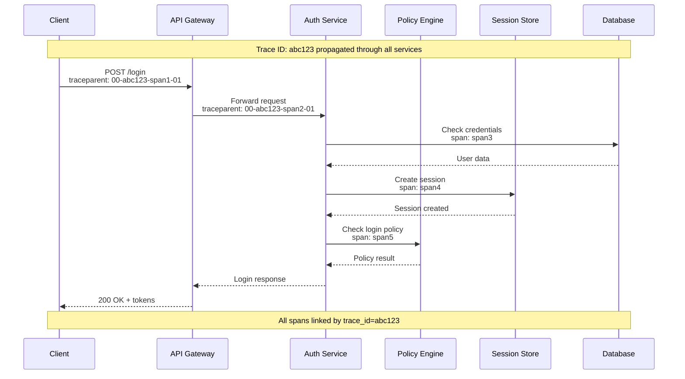

# Observability

[← Back to Index](./00-index.md)

---

## Metrics

### Key Performance Indicators (KPIs)

| Metric | Type | Description | Target |
|--------|------|-------------|--------|
| `auth.login.success_rate` | Gauge | Successful logins / Total attempts | > 99.5% |
| `auth.login.latency_p99` | Histogram | 99th percentile login time | < 500ms |
| `auth.token.validation_latency_p99` | Histogram | Token validation time | < 1ms (JWT), < 10ms (introspection) |
| `auth.mfa.adoption_rate` | Gauge | Users with MFA enabled | > 80% |
| `authz.policy.evaluation_latency_p99` | Histogram | Policy evaluation time | < 5ms |
| `authz.policy.cache_hit_rate` | Gauge | Policy cache hits | > 95% |
| `session.active_count` | Gauge | Currently active sessions | Monitor trend |
| `session.creation_rate` | Counter | Sessions created per second | Monitor trend |

### Authentication Metrics

```
// Core Authentication Metrics
METRICS:
    # Login metrics
    auth_login_attempts_total:
        type: counter
        labels: [tenant_id, auth_method, outcome, error_code]
        description: "Total login attempts"

    auth_login_duration_seconds:
        type: histogram
        labels: [tenant_id, auth_method, outcome]
        buckets: [0.05, 0.1, 0.25, 0.5, 1, 2.5, 5]
        description: "Login duration in seconds"

    auth_mfa_verifications_total:
        type: counter
        labels: [tenant_id, mfa_method, outcome]
        description: "MFA verification attempts"

    # Token metrics
    auth_tokens_issued_total:
        type: counter
        labels: [tenant_id, token_type, grant_type]
        description: "Tokens issued"

    auth_token_validations_total:
        type: counter
        labels: [tenant_id, token_type, outcome]
        description: "Token validation attempts"

    auth_token_validation_duration_seconds:
        type: histogram
        labels: [token_type, validation_method]
        buckets: [0.0001, 0.0005, 0.001, 0.005, 0.01, 0.05]
        description: "Token validation duration"

    # Session metrics
    auth_sessions_active:
        type: gauge
        labels: [tenant_id, region]
        description: "Currently active sessions"

    auth_session_duration_seconds:
        type: histogram
        labels: [tenant_id]
        buckets: [60, 300, 900, 3600, 14400, 86400]
        description: "Session duration before logout/expiry"
```

### Authorization Metrics

```
METRICS:
    # Policy evaluation
    authz_policy_evaluations_total:
        type: counter
        labels: [tenant_id, policy_type, decision]
        description: "Policy evaluation count"

    authz_policy_evaluation_duration_seconds:
        type: histogram
        labels: [tenant_id, policy_type, cache_status]
        buckets: [0.0001, 0.0005, 0.001, 0.005, 0.01, 0.05, 0.1]
        description: "Policy evaluation duration"

    authz_policy_cache_operations_total:
        type: counter
        labels: [operation, cache_tier, outcome]
        description: "Policy cache operations"

    # Permission checks
    authz_permission_checks_total:
        type: counter
        labels: [tenant_id, resource_type, action, outcome]
        description: "Permission check count"

    # ReBAC specific
    authz_relationship_traversals_total:
        type: counter
        labels: [tenant_id, object_type, depth]
        description: "Relationship graph traversals"

    authz_relationship_traversal_depth:
        type: histogram
        labels: [tenant_id, object_type]
        buckets: [1, 2, 3, 5, 10]
        description: "Relationship traversal depth"
```

### Security Metrics

```
METRICS:
    # Threat detection
    security_threat_signals_total:
        type: counter
        labels: [signal_type, severity]
        description: "Threat signals detected"

    security_blocked_requests_total:
        type: counter
        labels: [block_reason, tenant_id]
        description: "Requests blocked for security reasons"

    security_account_lockouts_total:
        type: counter
        labels: [tenant_id, reason]
        description: "Account lockouts"

    # Brute force
    security_failed_logins_total:
        type: counter
        labels: [tenant_id, failure_reason]
        description: "Failed login attempts"

    security_rate_limited_requests_total:
        type: counter
        labels: [limit_type, tenant_id]
        description: "Rate limited requests"

    # Anomalies
    security_anomalies_detected_total:
        type: counter
        labels: [anomaly_type, severity]
        description: "Security anomalies detected"
```

---

## Logging

### Structured Log Schema

```
LOG_SCHEMA:
    base_fields:
        timestamp: ISO8601
        level: enum(DEBUG, INFO, WARN, ERROR, CRITICAL)
        service: string
        version: string
        instance_id: string
        trace_id: string
        span_id: string

    authentication_log:
        extends: base_fields
        event_type: "authentication"
        user_id: string (nullable)
        tenant_id: string
        auth_method: enum(password, sso, passkey, mfa)
        outcome: enum(success, failure)
        error_code: string (nullable)
        ip_address: string
        user_agent: string
        geo_location:
            country: string
            city: string
        session_id: string (nullable)
        mfa_used: boolean
        mfa_method: string (nullable)
        duration_ms: integer

    authorization_log:
        extends: base_fields
        event_type: "authorization"
        user_id: string
        tenant_id: string
        resource_type: string
        resource_id: string
        action: string
        decision: enum(allow, deny)
        policies_evaluated: array[string]
        evaluation_time_ms: integer
        cache_hit: boolean

    security_log:
        extends: base_fields
        event_type: "security"
        threat_type: string
        severity: enum(low, medium, high, critical)
        user_id: string (nullable)
        ip_address: string
        details: object
        action_taken: string

    audit_log:
        extends: base_fields
        event_type: "audit"
        actor_id: string
        actor_type: enum(user, system, admin)
        action: string
        resource_type: string
        resource_id: string
        changes: object (nullable)
        outcome: enum(success, failure)
```

### Log Examples

```json
// Successful login
{
    "timestamp": "2024-01-15T10:30:45.123Z",
    "level": "INFO",
    "service": "auth-service",
    "trace_id": "abc123def456",
    "event_type": "authentication",
    "user_id": "user_12345",
    "tenant_id": "tenant_abc",
    "auth_method": "password",
    "outcome": "success",
    "ip_address": "192.168.1.100",
    "user_agent": "Mozilla/5.0...",
    "geo_location": {"country": "US", "city": "San Francisco"},
    "session_id": "sess_xyz789",
    "mfa_used": true,
    "mfa_method": "totp",
    "duration_ms": 245
}

// Failed login (brute force detected)
{
    "timestamp": "2024-01-15T10:31:00.456Z",
    "level": "WARN",
    "service": "auth-service",
    "trace_id": "def456ghi789",
    "event_type": "security",
    "threat_type": "brute_force_attempt",
    "severity": "medium",
    "user_id": "user_12345",
    "ip_address": "10.0.0.50",
    "details": {
        "failed_attempts": 5,
        "window_minutes": 5,
        "threshold": 5
    },
    "action_taken": "account_locked"
}

// Authorization decision
{
    "timestamp": "2024-01-15T10:31:15.789Z",
    "level": "INFO",
    "service": "policy-engine",
    "trace_id": "ghi789jkl012",
    "event_type": "authorization",
    "user_id": "user_12345",
    "tenant_id": "tenant_abc",
    "resource_type": "document",
    "resource_id": "doc_98765",
    "action": "read",
    "decision": "allow",
    "policies_evaluated": ["default_deny", "doc_viewer_policy"],
    "evaluation_time_ms": 2,
    "cache_hit": true
}
```

---

## Distributed Tracing

### Trace Context Propagation



### Trace Instrumentation

```
CLASS AuthTracer:
    """
    Distributed tracing for auth operations.
    """

    def trace_login(self, request: AuthRequest):
        """Trace a login operation."""
        with tracer.start_span("auth.login") as span:
            span.set_attribute("auth.method", request.auth_method)
            span.set_attribute("tenant.id", request.tenant_id)
            span.set_attribute("user.id", request.user_id or "unknown")

            TRY:
                // Credential verification
                with tracer.start_span("auth.verify_credentials", parent=span):
                    result = verify_credentials(request)

                // MFA if required
                IF result.requires_mfa:
                    with tracer.start_span("auth.mfa_verification", parent=span) as mfa_span:
                        mfa_span.set_attribute("mfa.method", request.mfa_method)
                        mfa_result = verify_mfa(request)

                // Session creation
                with tracer.start_span("auth.create_session", parent=span) as sess_span:
                    session = create_session(result.user)
                    sess_span.set_attribute("session.id", session.id)

                // Token generation
                with tracer.start_span("auth.generate_tokens", parent=span):
                    tokens = generate_tokens(result.user, session)

                span.set_attribute("auth.outcome", "success")
                RETURN tokens

            CATCH Exception as e:
                span.set_attribute("auth.outcome", "failure")
                span.set_attribute("error.type", type(e).__name__)
                span.record_exception(e)
                RAISE

    def trace_policy_evaluation(self, request: AuthzRequest):
        """Trace policy evaluation."""
        with tracer.start_span("authz.evaluate_policy") as span:
            span.set_attribute("authz.subject.id", request.subject.id)
            span.set_attribute("authz.resource.type", request.resource.type)
            span.set_attribute("authz.action", request.action)

            // Check cache
            with tracer.start_span("authz.cache_lookup", parent=span) as cache_span:
                cached = check_policy_cache(request)
                cache_span.set_attribute("cache.hit", cached IS NOT NULL)

                IF cached:
                    span.set_attribute("authz.decision", cached.decision)
                    RETURN cached

            // Load policies
            with tracer.start_span("authz.load_policies", parent=span) as load_span:
                policies = load_applicable_policies(request)
                load_span.set_attribute("policies.count", len(policies))

            // Evaluate
            with tracer.start_span("authz.evaluate", parent=span) as eval_span:
                decision = evaluate_policies(policies, request)
                eval_span.set_attribute("policies.evaluated", len(decision.evaluated))

            span.set_attribute("authz.decision", decision.result)
            RETURN decision
```

---

## Alerting

### Alert Definitions

```yaml
ALERTS:
    # Availability Alerts
    auth_service_down:
        condition: up{service="auth-service"} == 0
        for: 1m
        severity: critical
        summary: "Auth service is down"
        runbook: "runbooks/auth-service-down.md"

    high_login_latency:
        condition: |
            histogram_quantile(0.99, auth_login_duration_seconds) > 1
        for: 5m
        severity: warning
        summary: "Login latency p99 > 1s"

    token_validation_latency:
        condition: |
            histogram_quantile(0.99, auth_token_validation_duration_seconds{token_type="jwt"}) > 0.01
        for: 5m
        severity: warning
        summary: "JWT validation latency p99 > 10ms"

    # Security Alerts
    brute_force_attack:
        condition: |
            rate(security_failed_logins_total[5m]) > 100
        for: 2m
        severity: critical
        summary: "Possible brute force attack detected"
        runbook: "runbooks/brute-force-response.md"

    credential_stuffing:
        condition: |
            rate(security_threat_signals_total{signal_type="credential_stuffing"}[5m]) > 10
        for: 1m
        severity: critical
        summary: "Credential stuffing attack detected"

    account_lockout_spike:
        condition: |
            rate(security_account_lockouts_total[10m]) > 50
        for: 5m
        severity: warning
        summary: "Unusual spike in account lockouts"

    impossible_travel:
        condition: |
            security_anomalies_detected_total{anomaly_type="impossible_travel"} > 0
        for: 0s
        severity: high
        summary: "Impossible travel detected for user"

    # Capacity Alerts
    session_store_memory:
        condition: |
            redis_memory_used_bytes / redis_memory_max_bytes > 0.85
        for: 10m
        severity: warning
        summary: "Session store memory > 85%"

    policy_cache_miss_rate:
        condition: |
            1 - (rate(authz_policy_cache_operations_total{outcome="hit"}[5m]) /
                 rate(authz_policy_cache_operations_total[5m])) > 0.1
        for: 10m
        severity: warning
        summary: "Policy cache miss rate > 10%"

    database_connection_exhaustion:
        condition: |
            db_connections_active / db_connections_max > 0.9
        for: 5m
        severity: critical
        summary: "Database connections > 90% capacity"
```

### Alert Escalation Matrix

| Alert | First Response | 5 min | 15 min | 30 min |
|-------|----------------|-------|--------|--------|
| **Critical (Auth Down)** | On-call page | Manager | Director | VP Eng |
| **Critical (Security)** | Security team | CISO | Legal | Exec team |
| **High** | On-call Slack | On-call page | Manager | - |
| **Warning** | Slack channel | - | - | - |

---

## Dashboards

### Executive Security Dashboard

```
DASHBOARD: IAM Executive Overview
REFRESH: 5 minutes

PANELS:
    Row 1 - Key Metrics:
        - Total Active Users (gauge)
        - Login Success Rate (gauge with threshold)
        - MFA Adoption Rate (gauge with target)
        - Active Security Incidents (counter)

    Row 2 - Authentication Trends:
        - Logins Over Time (time series, by method)
        - Failed Login Rate (time series)
        - MFA Verification Rate (time series, by method)

    Row 3 - Security Posture:
        - Threat Signals by Type (pie chart)
        - Account Lockouts (time series)
        - Blocked Requests (time series)

    Row 4 - Compliance:
        - Audit Log Volume (time series)
        - Policy Violations (time series)
        - Data Residency Compliance (status)
```

### Operations Dashboard

```
DASHBOARD: IAM Operations
REFRESH: 30 seconds

PANELS:
    Row 1 - Service Health:
        - Auth Service Status (status map by region)
        - Policy Engine Status (status map)
        - Session Store Status (status map)
        - Database Status (status map)

    Row 2 - Performance:
        - Login Latency p50/p95/p99 (time series)
        - Token Validation Latency (time series)
        - Policy Evaluation Latency (time series)
        - Cache Hit Rates (time series)

    Row 3 - Throughput:
        - Logins/sec (time series)
        - Token Validations/sec (time series)
        - Policy Evaluations/sec (time series)
        - SCIM Operations/sec (time series)

    Row 4 - Resources:
        - Session Store Memory (gauge)
        - Policy Cache Memory (gauge)
        - Database Connections (gauge)
        - CPU Utilization by Service (time series)

    Row 5 - Errors:
        - Error Rate by Service (time series)
        - Top Error Codes (bar chart)
        - Failed Requests by Endpoint (table)
```

### Security Operations Dashboard

```
DASHBOARD: IAM Security Operations
REFRESH: 10 seconds

PANELS:
    Row 1 - Real-Time Threats:
        - Active Threat Signals (live counter)
        - Threat Map (geo visualization)
        - Blocked IPs (live list)
        - Active Attacks (status indicators)

    Row 2 - Authentication Security:
        - Failed Logins (real-time stream)
        - Brute Force Attempts (time series)
        - Credential Stuffing Signals (time series)
        - Account Lockouts (time series)

    Row 3 - Anomaly Detection:
        - Impossible Travel Events (map)
        - Unusual Login Times (heatmap)
        - New Device Logins (time series)
        - Suspicious IP Activity (table)

    Row 4 - Investigation Tools:
        - User Activity Search (search panel)
        - IP Investigation (input + results)
        - Session Details (drill-down table)
        - Audit Trail (log viewer)
```

---

## Health Checks

### Service Health Endpoints

```
ENDPOINT: GET /health

RESPONSE:
{
    "status": "healthy" | "degraded" | "unhealthy",
    "version": "1.2.3",
    "timestamp": "2024-01-15T10:30:00Z",
    "checks": {
        "database": {
            "status": "healthy",
            "latency_ms": 5,
            "details": {
                "primary": "connected",
                "replicas": 3
            }
        },
        "session_store": {
            "status": "healthy",
            "latency_ms": 1,
            "details": {
                "nodes": 6,
                "memory_used_percent": 45
            }
        },
        "policy_cache": {
            "status": "healthy",
            "hit_rate": 0.96
        },
        "external_idps": {
            "status": "degraded",
            "details": {
                "google": "healthy",
                "azure_ad": "timeout",
                "okta": "healthy"
            }
        },
        "hsm": {
            "status": "healthy",
            "details": {
                "signing_available": true
            }
        }
    }
}

HEALTH_CHECK_LOGIC:
    status = "healthy"

    FOR check IN checks:
        IF check.status == "unhealthy":
            IF check.is_critical:
                status = "unhealthy"
            ELSE:
                status = "degraded" IF status != "unhealthy"

    RETURN status
```

### Dependency Health Monitoring

```
CLASS DependencyHealthMonitor:
    """
    Monitor health of all dependencies.
    """

    DEPENDENCIES = [
        Dependency("database", critical=true, timeout=5s),
        Dependency("session_store", critical=true, timeout=2s),
        Dependency("policy_store", critical=true, timeout=5s),
        Dependency("hsm", critical=true, timeout=10s),
        Dependency("external_idp_google", critical=false, timeout=5s),
        Dependency("external_idp_azure", critical=false, timeout=5s),
        Dependency("audit_log", critical=false, timeout=5s),
    ]

    def check_all(self) -> HealthReport:
        """Check all dependencies concurrently."""
        results = {}

        // Run all checks concurrently with timeouts
        futures = {
            dep.name: executor.submit(self.check_dependency, dep)
            FOR dep IN self.DEPENDENCIES
        }

        FOR name, future IN futures:
            TRY:
                results[name] = future.result(timeout=10)
            CATCH TimeoutError:
                results[name] = HealthStatus(
                    status = "unhealthy",
                    error = "Health check timeout"
                )

        // Determine overall status
        overall = self.calculate_overall_status(results)

        RETURN HealthReport(
            status = overall,
            checks = results,
            timestamp = now()
        )

    def check_dependency(self, dep: Dependency) -> HealthStatus:
        """Check single dependency health."""
        start = now()

        TRY:
            IF dep.name == "database":
                result = db.execute("SELECT 1")
            ELIF dep.name == "session_store":
                result = redis.ping()
            ELIF dep.name.startswith("external_idp"):
                result = idp_client.check_connectivity(dep.name)
            // ... other checks

            latency = now() - start

            RETURN HealthStatus(
                status = "healthy",
                latency_ms = latency.milliseconds
            )

        CATCH Exception as e:
            RETURN HealthStatus(
                status = "unhealthy",
                error = str(e)
            )
```
