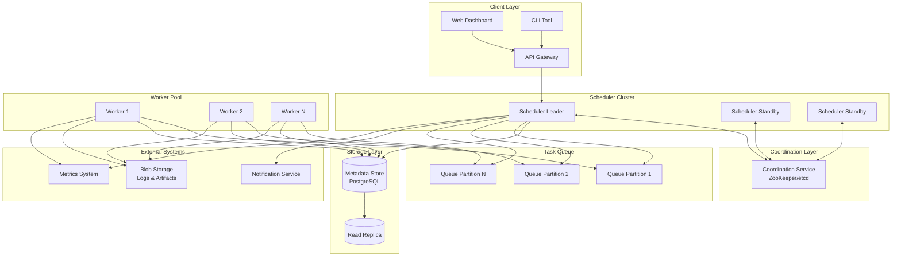
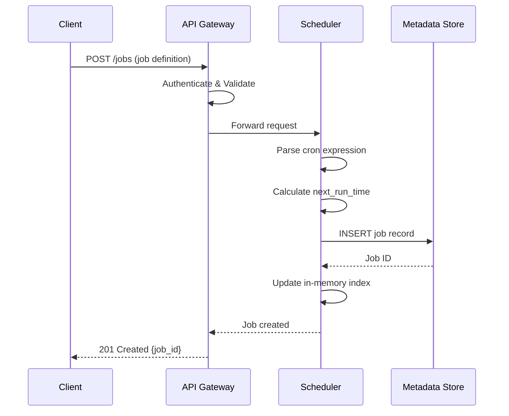
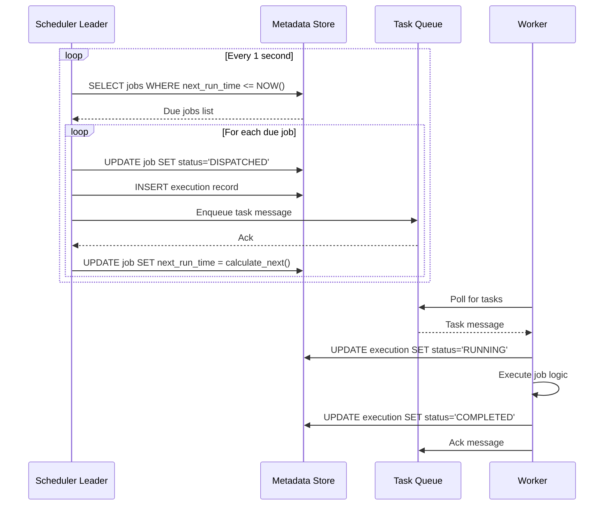
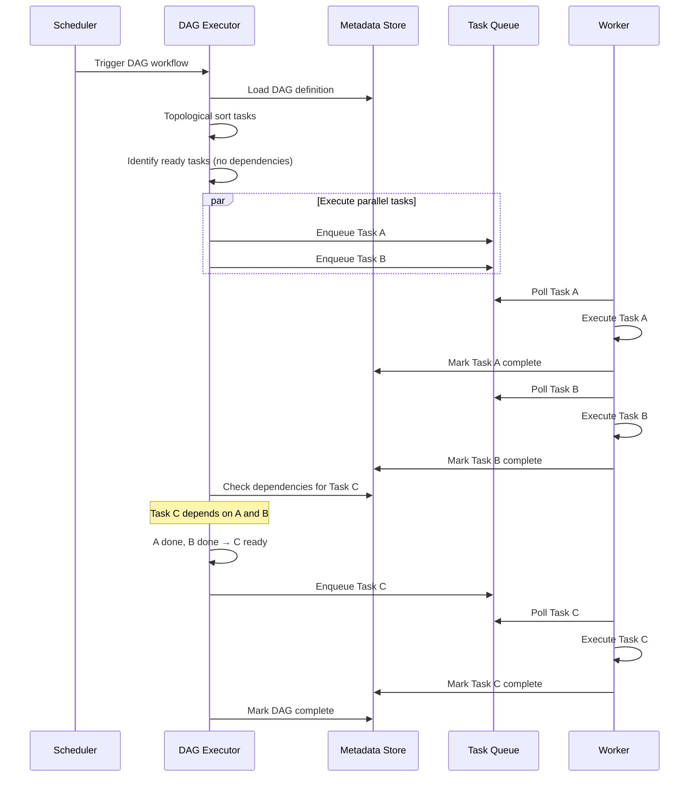
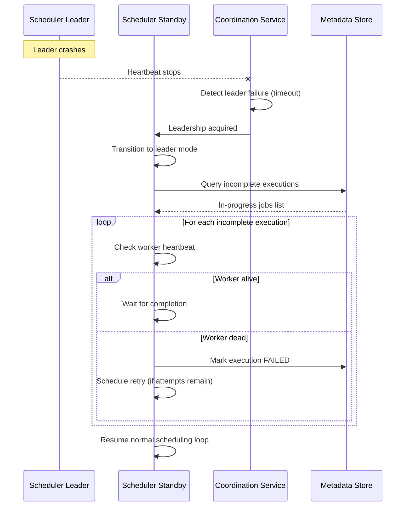

# High-Level Design

[← Back to Requirements](./01-requirements-and-estimations.md) | [Next: Low-Level Design →](./03-low-level-design.md)

---

## System Architecture



---

## Component Overview

| Component | Responsibility | Technology Options |
|-----------|----------------|-------------------|
| **API Gateway** | Request routing, auth, rate limiting | NGINX, Kong, custom |
| **Scheduler Cluster** | Poll due jobs, dispatch to queue | Custom service |
| **Coordination Service** | Leader election, distributed locks | ZooKeeper, etcd, Consul |
| **Metadata Store** | Job definitions, execution history | PostgreSQL, MySQL |
| **Task Queue** | Buffer tasks for workers | Kafka, RabbitMQ, SQS |
| **Worker Pool** | Execute job logic | Kubernetes pods, VMs |
| **Blob Storage** | Execution logs, artifacts | Object storage |

---

## Data Flow Diagrams

### Job Submission Flow



### Scheduling Loop (Core Flow)



### DAG Workflow Execution



### Failure Recovery Flow



---

## Key Design Decisions

### Decision 1: Leader-Based vs Active-Active Scheduling

| Approach | Description | Pros | Cons |
|----------|-------------|------|------|
| **Leader-Based** | Single scheduler processes all jobs | No duplicate executions, simpler | Failover delay |
| **Active-Active** | Multiple schedulers with partitioning | Higher availability, scales | Complex deduplication |

**Decision:** Leader-based with fast failover

**Rationale:**
- Simpler to ensure exactly-once dispatch
- ZooKeeper/etcd provides sub-second failover
- Can scale reads via replicas
- Most production systems (Airflow, Cadence) use this pattern

### Decision 2: Pull-Based vs Push-Based Task Distribution

| Approach | Description | Pros | Cons |
|----------|-------------|------|------|
| **Pull-Based** | Workers poll queue for tasks | Natural backpressure, worker autonomy | Polling overhead |
| **Push-Based** | Scheduler assigns to workers directly | Lower latency, better balancing | Requires health tracking |

**Decision:** Pull-based with long polling

**Rationale:**
- Workers control their own capacity
- Queue provides natural buffering
- No need for scheduler to track worker state
- Easier to add/remove workers dynamically

### Decision 3: Job Storage - Database vs Message Queue

| Approach | Pros | Cons |
|----------|------|------|
| **Database Primary** | Queryable, durable, consistent | Polling overhead for scheduling |
| **Queue Primary** | Low latency dispatch | Hard to query, less durable |
| **Hybrid** | Best of both | More components to manage |

**Decision:** Hybrid - Database for persistence, Queue for dispatch

**Rationale:**
- Database provides durability and queryability for job definitions
- Queue provides efficient task distribution to workers
- Clear separation of concerns
- Standard pattern in Airflow, Temporal, Cadence

### Decision 4: Execution Guarantee

| Guarantee | Implementation Complexity | Use Case |
|-----------|--------------------------|----------|
| **At-Most-Once** | Low | Notifications, best-effort |
| **At-Least-Once** | Medium | Most batch jobs |
| **Exactly-Once** | Very High | Financial transactions |

**Decision:** At-least-once with idempotency support

**Rationale:**
- Exactly-once requires distributed transactions (complex, slow)
- At-least-once is achievable with retries
- Jobs should be designed idempotent anyway
- Industry standard (Airflow, Temporal, Cadence)

---

## Component Details

### Scheduler Service

```
Responsibilities:
├── Poll metadata store for due jobs
├── Dispatch jobs to task queue
├── Calculate next run times
├── Handle DAG dependency resolution
├── Manage job lifecycle state machine
└── Participate in leader election

High Availability:
├── Multiple instances in cluster
├── Only leader processes jobs
├── Standby instances ready for failover
└── Heartbeat to coordination service
```

### Task Queue

```
Responsibilities:
├── Buffer tasks between scheduler and workers
├── Provide at-least-once delivery
├── Support multiple partitions for parallelism
├── Handle message acknowledgment
└── Dead-letter queue for failed messages

Partitioning Strategy:
├── By job_id hash (even distribution)
├── By tenant_id (isolation)
└── By priority (separate queues)
```

### Worker Pool

```
Responsibilities:
├── Poll task queue for work
├── Execute job logic in isolation
├── Report progress and completion
├── Handle graceful shutdown
└── Support concurrent job execution

Scaling Strategy:
├── Horizontal scaling based on queue depth
├── Auto-scaling during peak periods
├── Spot/preemptible instances for cost
└── Reserved capacity for critical jobs
```

### Metadata Store

```
Responsibilities:
├── Store job definitions
├── Track execution history
├── Maintain scheduling indexes
├── Support transactional updates
└── Provide query interface

Schema Highlights:
├── jobs (definition, schedule, config)
├── executions (run history, status)
├── dags (workflow definitions)
└── dag_tasks (task definitions within DAGs)
```

---

## Architecture Patterns

### Polling Window Pattern

To handle scheduler restarts and ensure no jobs are missed:

```
Polling Window: [NOW - buffer, NOW + lookahead]

Example with 60s buffer, 5s lookahead:
• NOW = 10:00:00
• Query: next_run_time BETWEEN 09:59:00 AND 10:00:05

Benefits:
• Catches jobs missed during brief outages
• Compensates for clock skew
• Requires idempotent execution (jobs may dispatch twice)
```

### Optimistic Locking for Job State

```
Prevent concurrent updates to same job:

UPDATE jobs
SET status = 'DISPATCHED',
    version = version + 1
WHERE job_id = ?
  AND version = ?
  AND status = 'SCHEDULED'

If rows_affected = 0:
    Another scheduler already processed this job
    Skip (deduplication)
```

### Circuit Breaker for Downstream Failures

```
When workers consistently fail:
1. CLOSED: Normal operation, jobs execute
2. OPEN: Stop dispatching jobs (downstream unhealthy)
3. HALF-OPEN: Try single job to test recovery

Prevents cascading failures when external systems are down.
```

---

## Integration Points

| Integration | Purpose | Protocol |
|-------------|---------|----------|
| **Notification Service** | Alert on job completion/failure | Webhook, Email, Slack |
| **Metrics System** | Publish execution metrics | Push (StatsD, Prometheus) |
| **Secret Manager** | Fetch job credentials | API call |
| **Blob Storage** | Store execution logs | Object storage API |
| **External APIs** | Job execution targets | HTTP, gRPC |

---

## Technology Stack Summary

| Layer | Component | Recommended Technology |
|-------|-----------|----------------------|
| **API** | Gateway | Load balancer + custom service |
| **Compute** | Scheduler | Stateless containers |
| **Compute** | Workers | Kubernetes pods / VMs |
| **Coordination** | Leader election | ZooKeeper or etcd |
| **Storage** | Metadata | PostgreSQL (with read replicas) |
| **Queue** | Task dispatch | Kafka or RabbitMQ |
| **Storage** | Logs | Object storage |
| **Observability** | Metrics | Prometheus + Grafana |

---

## High-Level Design Checklist

Before moving to low-level design, ensure:

- [ ] Clear component responsibilities defined
- [ ] Data flow for all major operations documented
- [ ] Key design decisions made with rationale
- [ ] Integration points identified
- [ ] Failure scenarios considered at high level
- [ ] Technology choices aligned with requirements

---

**Next:** [Low-Level Design →](./03-low-level-design.md)
