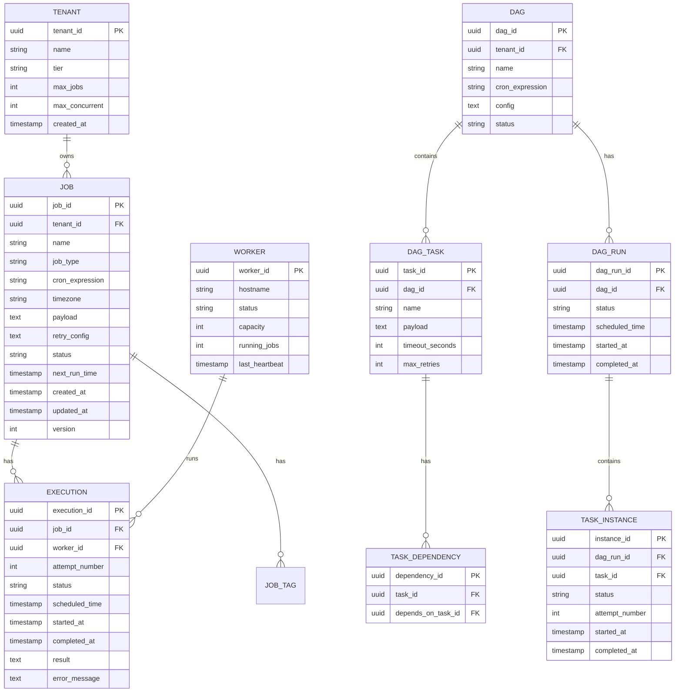
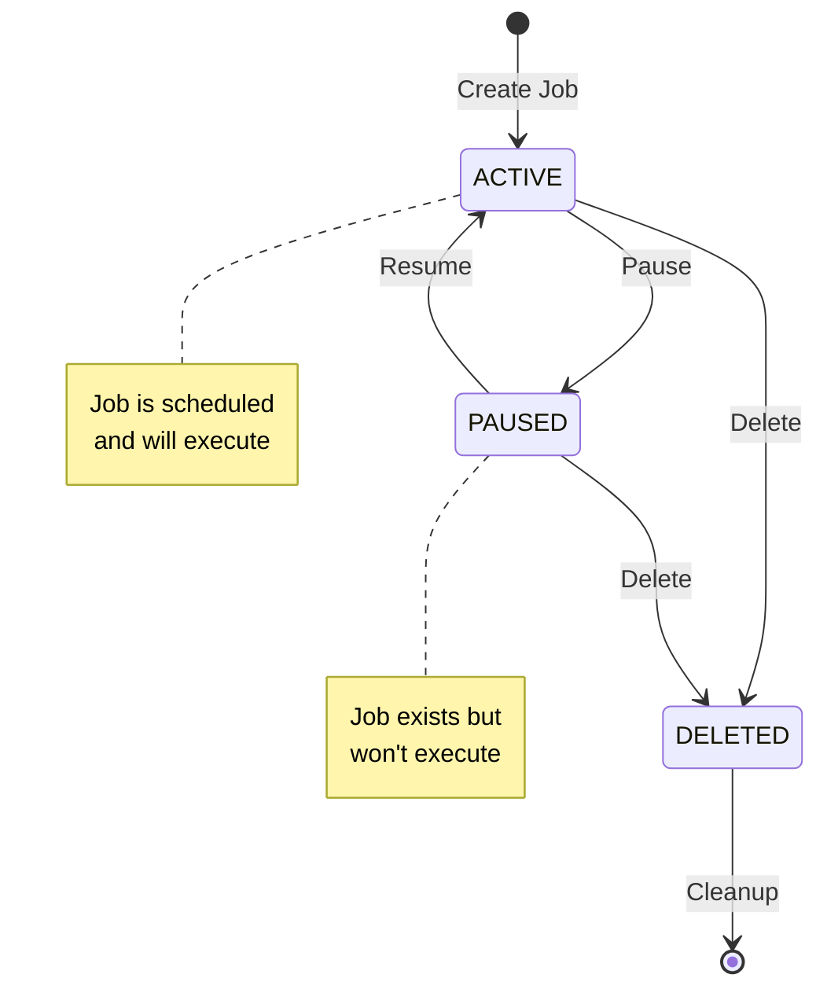
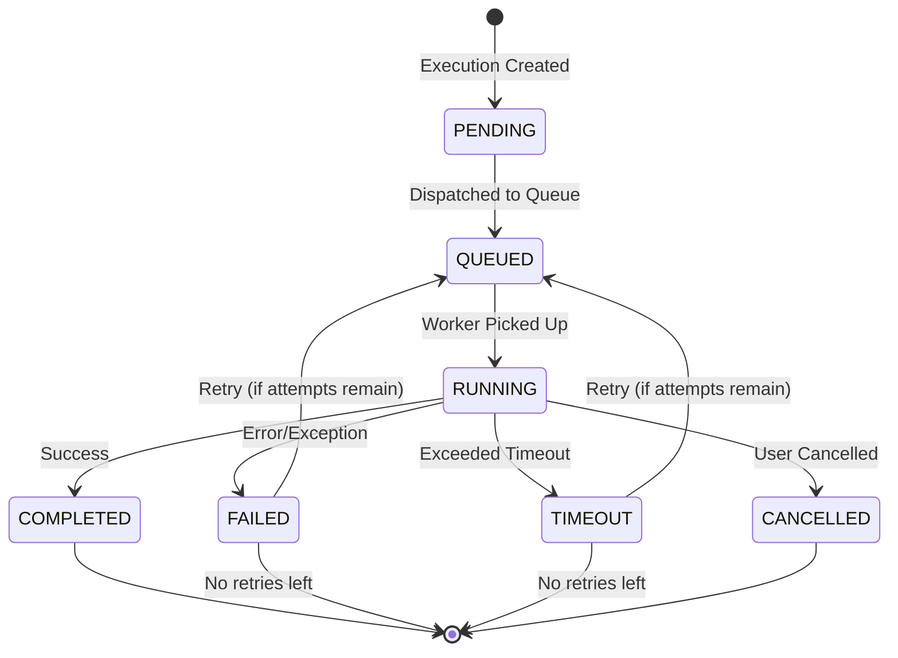

# Low-Level Design

[← Back to High-Level Design](./02-high-level-design.md) | [Next: Deep Dive & Bottlenecks →](./04-deep-dive-and-bottlenecks.md)

---

## Data Model

### Entity Relationship Diagram



### Core Tables

#### Jobs Table

```sql
CREATE TABLE jobs (
    job_id          UUID PRIMARY KEY DEFAULT gen_random_uuid(),
    tenant_id       UUID NOT NULL REFERENCES tenants(tenant_id),
    name            VARCHAR(255) NOT NULL,
    job_type        VARCHAR(50) NOT NULL,  -- 'CRON', 'ONE_TIME', 'DELAYED'
    cron_expression VARCHAR(100),
    timezone        VARCHAR(50) DEFAULT 'UTC',
    payload         JSONB NOT NULL,        -- Job configuration and parameters
    retry_config    JSONB DEFAULT '{"max_attempts": 3, "backoff_seconds": 60}',
    status          VARCHAR(20) NOT NULL DEFAULT 'ACTIVE',
    next_run_time   TIMESTAMP WITH TIME ZONE,
    last_run_time   TIMESTAMP WITH TIME ZONE,
    created_at      TIMESTAMP WITH TIME ZONE DEFAULT NOW(),
    updated_at      TIMESTAMP WITH TIME ZONE DEFAULT NOW(),
    version         INTEGER DEFAULT 1,

    CONSTRAINT valid_status CHECK (status IN ('ACTIVE', 'PAUSED', 'DELETED')),
    CONSTRAINT valid_job_type CHECK (job_type IN ('CRON', 'ONE_TIME', 'DELAYED'))
);

-- Critical index for scheduling loop
CREATE INDEX idx_jobs_next_run ON jobs(next_run_time)
    WHERE status = 'ACTIVE' AND next_run_time IS NOT NULL;

-- Tenant isolation
CREATE INDEX idx_jobs_tenant ON jobs(tenant_id);

-- Name search
CREATE INDEX idx_jobs_name ON jobs(tenant_id, name);
```

#### Executions Table

```sql
CREATE TABLE executions (
    execution_id    UUID PRIMARY KEY DEFAULT gen_random_uuid(),
    job_id          UUID NOT NULL REFERENCES jobs(job_id),
    worker_id       UUID REFERENCES workers(worker_id),
    attempt_number  INTEGER NOT NULL DEFAULT 1,
    status          VARCHAR(20) NOT NULL DEFAULT 'PENDING',
    scheduled_time  TIMESTAMP WITH TIME ZONE NOT NULL,
    queued_at       TIMESTAMP WITH TIME ZONE,
    started_at      TIMESTAMP WITH TIME ZONE,
    completed_at    TIMESTAMP WITH TIME ZONE,
    result          JSONB,
    error_message   TEXT,
    logs_url        VARCHAR(500),

    CONSTRAINT valid_exec_status CHECK (
        status IN ('PENDING', 'QUEUED', 'RUNNING', 'COMPLETED', 'FAILED', 'CANCELLED', 'TIMEOUT')
    )
);

-- Job execution history
CREATE INDEX idx_executions_job ON executions(job_id, scheduled_time DESC);

-- Status queries (recent executions)
CREATE INDEX idx_executions_status ON executions(status, scheduled_time DESC)
    WHERE status IN ('PENDING', 'QUEUED', 'RUNNING');

-- Worker's running jobs
CREATE INDEX idx_executions_worker ON executions(worker_id)
    WHERE status = 'RUNNING';

-- Partitioning by month for efficient cleanup
-- (Conceptual - actual syntax varies by database)
-- PARTITION BY RANGE (scheduled_time)
```

#### DAG Tables

```sql
CREATE TABLE dags (
    dag_id          UUID PRIMARY KEY DEFAULT gen_random_uuid(),
    tenant_id       UUID NOT NULL REFERENCES tenants(tenant_id),
    name            VARCHAR(255) NOT NULL,
    cron_expression VARCHAR(100),
    timezone        VARCHAR(50) DEFAULT 'UTC',
    config          JSONB DEFAULT '{}',
    status          VARCHAR(20) NOT NULL DEFAULT 'ACTIVE',
    next_run_time   TIMESTAMP WITH TIME ZONE,
    created_at      TIMESTAMP WITH TIME ZONE DEFAULT NOW(),
    updated_at      TIMESTAMP WITH TIME ZONE DEFAULT NOW()
);

CREATE TABLE dag_tasks (
    task_id         UUID PRIMARY KEY DEFAULT gen_random_uuid(),
    dag_id          UUID NOT NULL REFERENCES dags(dag_id) ON DELETE CASCADE,
    name            VARCHAR(255) NOT NULL,
    payload         JSONB NOT NULL,
    timeout_seconds INTEGER DEFAULT 3600,
    max_retries     INTEGER DEFAULT 3,

    UNIQUE(dag_id, name)
);

CREATE TABLE task_dependencies (
    dependency_id       UUID PRIMARY KEY DEFAULT gen_random_uuid(),
    task_id             UUID NOT NULL REFERENCES dag_tasks(task_id) ON DELETE CASCADE,
    depends_on_task_id  UUID NOT NULL REFERENCES dag_tasks(task_id) ON DELETE CASCADE,

    UNIQUE(task_id, depends_on_task_id),
    CHECK(task_id != depends_on_task_id)
);

CREATE TABLE dag_runs (
    dag_run_id      UUID PRIMARY KEY DEFAULT gen_random_uuid(),
    dag_id          UUID NOT NULL REFERENCES dags(dag_id),
    status          VARCHAR(20) NOT NULL DEFAULT 'PENDING',
    scheduled_time  TIMESTAMP WITH TIME ZONE NOT NULL,
    started_at      TIMESTAMP WITH TIME ZONE,
    completed_at    TIMESTAMP WITH TIME ZONE,
    config          JSONB  -- Runtime overrides
);

CREATE TABLE task_instances (
    instance_id     UUID PRIMARY KEY DEFAULT gen_random_uuid(),
    dag_run_id      UUID NOT NULL REFERENCES dag_runs(dag_run_id) ON DELETE CASCADE,
    task_id         UUID NOT NULL REFERENCES dag_tasks(task_id),
    status          VARCHAR(20) NOT NULL DEFAULT 'PENDING',
    attempt_number  INTEGER DEFAULT 0,
    started_at      TIMESTAMP WITH TIME ZONE,
    completed_at    TIMESTAMP WITH TIME ZONE,
    error_message   TEXT,

    UNIQUE(dag_run_id, task_id)
);
```

---

## API Design

### RESTful API Endpoints

#### Job Management

| Method | Endpoint | Description |
|--------|----------|-------------|
| POST | `/v1/jobs` | Create a new job |
| GET | `/v1/jobs` | List jobs (with filtering) |
| GET | `/v1/jobs/{job_id}` | Get job details |
| PUT | `/v1/jobs/{job_id}` | Update job configuration |
| DELETE | `/v1/jobs/{job_id}` | Delete job (soft delete) |
| POST | `/v1/jobs/{job_id}/pause` | Pause job scheduling |
| POST | `/v1/jobs/{job_id}/resume` | Resume job scheduling |
| POST | `/v1/jobs/{job_id}/trigger` | Trigger immediate execution |

#### Execution Management

| Method | Endpoint | Description |
|--------|----------|-------------|
| GET | `/v1/jobs/{job_id}/executions` | List job executions |
| GET | `/v1/executions/{execution_id}` | Get execution details |
| POST | `/v1/executions/{execution_id}/cancel` | Cancel running execution |
| GET | `/v1/executions/{execution_id}/logs` | Get execution logs |

#### DAG Management

| Method | Endpoint | Description |
|--------|----------|-------------|
| POST | `/v1/dags` | Create DAG workflow |
| GET | `/v1/dags/{dag_id}` | Get DAG definition |
| POST | `/v1/dags/{dag_id}/trigger` | Trigger DAG execution |
| GET | `/v1/dags/{dag_id}/runs` | List DAG runs |
| GET | `/v1/dag-runs/{dag_run_id}` | Get DAG run status |

### Request/Response Examples

#### Create Job

```
POST /v1/jobs
Content-Type: application/json

{
    "name": "daily-report-generator",
    "job_type": "CRON",
    "cron_expression": "0 9 * * *",
    "timezone": "America/New_York",
    "payload": {
        "endpoint": "https://api.example.com/reports/generate",
        "method": "POST",
        "headers": {
            "Authorization": "Bearer ${secrets.API_TOKEN}"
        },
        "body": {
            "report_type": "daily_summary"
        }
    },
    "retry_config": {
        "max_attempts": 3,
        "backoff_seconds": 300,
        "backoff_multiplier": 2
    },
    "timeout_seconds": 3600,
    "tags": ["reports", "daily"]
}
```

```
Response: 201 Created

{
    "job_id": "550e8400-e29b-41d4-a716-446655440000",
    "name": "daily-report-generator",
    "status": "ACTIVE",
    "next_run_time": "2024-01-16T14:00:00Z",
    "created_at": "2024-01-15T10:30:00Z"
}
```

#### Get Execution Details

```
GET /v1/executions/660e8400-e29b-41d4-a716-446655440001

Response: 200 OK

{
    "execution_id": "660e8400-e29b-41d4-a716-446655440001",
    "job_id": "550e8400-e29b-41d4-a716-446655440000",
    "job_name": "daily-report-generator",
    "attempt_number": 1,
    "status": "COMPLETED",
    "scheduled_time": "2024-01-15T14:00:00Z",
    "started_at": "2024-01-15T14:00:02Z",
    "completed_at": "2024-01-15T14:05:30Z",
    "duration_ms": 328000,
    "result": {
        "report_id": "rpt-12345",
        "rows_processed": 50000
    },
    "logs_url": "https://storage.example.com/logs/exec-660e8400.log"
}
```

#### Create DAG Workflow

```
POST /v1/dags
Content-Type: application/json

{
    "name": "etl-pipeline",
    "cron_expression": "0 2 * * *",
    "timezone": "UTC",
    "tasks": [
        {
            "name": "extract",
            "payload": {
                "action": "extract_data",
                "source": "production_db"
            },
            "timeout_seconds": 1800
        },
        {
            "name": "transform",
            "payload": {
                "action": "transform_data"
            },
            "dependencies": ["extract"],
            "timeout_seconds": 3600
        },
        {
            "name": "load",
            "payload": {
                "action": "load_data",
                "destination": "data_warehouse"
            },
            "dependencies": ["transform"],
            "timeout_seconds": 1800
        },
        {
            "name": "notify",
            "payload": {
                "action": "send_notification",
                "channel": "#data-team"
            },
            "dependencies": ["load"]
        }
    ]
}
```

### Error Responses

```
{
    "error": {
        "code": "JOB_NOT_FOUND",
        "message": "Job with ID 'xyz' not found",
        "request_id": "req-123456"
    }
}
```

| HTTP Status | Error Code | Description |
|-------------|------------|-------------|
| 400 | INVALID_CRON | Invalid cron expression |
| 400 | INVALID_TIMEZONE | Unknown timezone |
| 404 | JOB_NOT_FOUND | Job does not exist |
| 409 | JOB_ALREADY_EXISTS | Duplicate job name |
| 409 | VERSION_CONFLICT | Optimistic locking failure |
| 429 | RATE_LIMITED | Too many requests |
| 503 | SCHEDULER_UNAVAILABLE | Scheduler not healthy |

---

## Algorithms

### Cron Expression Parser (Pseudocode)

```
FUNCTION parse_cron(expression: String) -> CronSchedule:
    parts = expression.split(" ")

    IF parts.length != 5:
        THROW InvalidCronException("Expected 5 fields")

    schedule = new CronSchedule()
    schedule.minutes = parse_field(parts[0], 0, 59)
    schedule.hours = parse_field(parts[1], 0, 23)
    schedule.days_of_month = parse_field(parts[2], 1, 31)
    schedule.months = parse_field(parts[3], 1, 12)
    schedule.days_of_week = parse_field(parts[4], 0, 6)

    RETURN schedule


FUNCTION parse_field(field: String, min: Int, max: Int) -> Set<Int>:
    result = new Set<Int>()

    // Handle wildcard
    IF field == "*":
        FOR i FROM min TO max:
            result.add(i)
        RETURN result

    // Handle step values: */5 or 1-10/2
    IF field.contains("/"):
        parts = field.split("/")
        base = parts[0]
        step = parseInt(parts[1])

        IF base == "*":
            start = min
            end = max
        ELSE IF base.contains("-"):
            range_parts = base.split("-")
            start = parseInt(range_parts[0])
            end = parseInt(range_parts[1])
        ELSE:
            start = parseInt(base)
            end = max

        FOR i FROM start TO end STEP step:
            result.add(i)
        RETURN result

    // Handle ranges: 1-5
    IF field.contains("-"):
        parts = field.split("-")
        start = parseInt(parts[0])
        end = parseInt(parts[1])
        FOR i FROM start TO end:
            result.add(i)
        RETURN result

    // Handle lists: 1,3,5
    IF field.contains(","):
        FOR part IN field.split(","):
            result.add(parseInt(part))
        RETURN result

    // Single value
    result.add(parseInt(field))
    RETURN result
```

### Next Run Time Calculator (Pseudocode)

```
FUNCTION calculate_next_run(schedule: CronSchedule, after: DateTime, timezone: String) -> DateTime:
    // Convert to job's timezone
    local_time = after.in_timezone(timezone)

    // Start searching from next minute
    candidate = local_time.truncate_to_minute().add_minutes(1)

    // Safety limit to prevent infinite loops
    max_iterations = 366 * 24 * 60  // 1 year of minutes
    iterations = 0

    WHILE iterations < max_iterations:
        iterations++

        // Check month
        IF NOT schedule.months.contains(candidate.month):
            // Jump to first day of next valid month
            candidate = advance_to_next_month(candidate, schedule.months)
            CONTINUE

        // Check day of month and day of week
        // Cron uses OR logic: either day_of_month OR day_of_week must match
        day_of_month_match = schedule.days_of_month.contains(candidate.day)
        day_of_week_match = schedule.days_of_week.contains(candidate.day_of_week)

        IF NOT (day_of_month_match OR day_of_week_match):
            candidate = candidate.add_days(1).start_of_day()
            CONTINUE

        // Check hour
        IF NOT schedule.hours.contains(candidate.hour):
            // Jump to next valid hour
            next_hour = find_next_in_set(schedule.hours, candidate.hour)
            IF next_hour <= candidate.hour:
                // Wrap to next day
                candidate = candidate.add_days(1).start_of_day()
            ELSE:
                candidate = candidate.set_hour(next_hour).set_minute(0)
            CONTINUE

        // Check minute
        IF NOT schedule.minutes.contains(candidate.minute):
            next_minute = find_next_in_set(schedule.minutes, candidate.minute)
            IF next_minute <= candidate.minute:
                // Wrap to next hour
                candidate = candidate.add_hours(1).set_minute(0)
            ELSE:
                candidate = candidate.set_minute(next_minute)
            CONTINUE

        // All fields match!
        // Handle DST: check if this time exists
        IF NOT time_exists_in_timezone(candidate, timezone):
            // Skip forward (spring forward)
            candidate = candidate.add_hours(1)
            CONTINUE

        RETURN candidate.to_utc()

    THROW SchedulingException("Could not find next run time within 1 year")


FUNCTION find_next_in_set(values: Set<Int>, current: Int) -> Int:
    // Find smallest value > current, or smallest value overall (wrap)
    min_value = values.min()
    FOR value IN values.sorted():
        IF value > current:
            RETURN value
    RETURN min_value  // Wrap around
```

### DAG Topological Sort (Pseudocode)

```
FUNCTION topological_sort(dag: DAG) -> List<List<Task>>:
    // Returns tasks grouped by execution level (parallel groups)

    // Build adjacency list and in-degree map
    in_degree = new Map<TaskId, Int>()
    dependents = new Map<TaskId, List<TaskId>>()

    FOR task IN dag.tasks:
        in_degree[task.id] = 0
        dependents[task.id] = []

    FOR dependency IN dag.dependencies:
        in_degree[dependency.task_id]++
        dependents[dependency.depends_on_task_id].append(dependency.task_id)

    // Kahn's algorithm with level tracking
    result = []
    current_level = []

    // Start with tasks that have no dependencies
    FOR task_id, degree IN in_degree:
        IF degree == 0:
            current_level.append(task_id)

    WHILE current_level.not_empty():
        result.append(current_level.copy())
        next_level = []

        FOR task_id IN current_level:
            FOR dependent_id IN dependents[task_id]:
                in_degree[dependent_id]--
                IF in_degree[dependent_id] == 0:
                    next_level.append(dependent_id)

        current_level = next_level

    // Check for cycles
    total_tasks = sum(level.length FOR level IN result)
    IF total_tasks != dag.tasks.length:
        THROW CycleDetectedException("DAG contains a cycle")

    RETURN result


// Example output for ETL pipeline:
// Level 0: [extract]           <- No dependencies, runs first
// Level 1: [transform]         <- Depends on extract
// Level 2: [load]              <- Depends on transform
// Level 3: [notify]            <- Depends on load
```

### Leader Election Protocol (Pseudocode)

```
CLASS SchedulerLeaderElection:
    coordination_client: CoordinationClient  // ZooKeeper or etcd
    election_path: String = "/scheduler/leader"
    node_id: String
    is_leader: Boolean = false
    leadership_callback: Function

    FUNCTION start_election():
        // Create ephemeral sequential node
        node_path = coordination_client.create(
            path = election_path + "/candidate_",
            data = node_id,
            flags = EPHEMERAL | SEQUENTIAL
        )

        // Extract sequence number
        sequence_number = extract_sequence(node_path)

        check_leadership()


    FUNCTION check_leadership():
        // Get all candidates
        candidates = coordination_client.get_children(election_path)
        candidates.sort_by_sequence_number()

        my_index = candidates.index_of(my_node_name)

        IF my_index == 0:
            // I am the leader!
            become_leader()
        ELSE:
            // Watch the node ahead of me
            predecessor = candidates[my_index - 1]
            coordination_client.watch(
                path = election_path + "/" + predecessor,
                callback = on_predecessor_deleted
            )


    FUNCTION become_leader():
        is_leader = true
        LOG.info("This node is now the scheduler leader")
        leadership_callback.on_leadership_acquired()


    FUNCTION on_predecessor_deleted():
        // Re-check leadership (I might be leader now)
        check_leadership()


    FUNCTION resign_leadership():
        // Delete my ephemeral node (happens automatically on disconnect)
        coordination_client.delete(my_node_path)
        is_leader = false
```

### Scheduling Loop (Pseudocode)

```
CLASS SchedulerLoop:
    db: Database
    queue: TaskQueue
    is_leader: Boolean
    polling_interval_ms: Int = 1000
    safety_buffer_seconds: Int = 60

    FUNCTION run():
        WHILE running:
            IF NOT is_leader:
                sleep(polling_interval_ms)
                CONTINUE

            TRY:
                poll_and_dispatch()
            CATCH Exception as e:
                LOG.error("Scheduling loop error", e)
                metrics.increment("scheduler.errors")

            sleep(polling_interval_ms)


    FUNCTION poll_and_dispatch():
        now = current_time_utc()

        // Query window includes safety buffer for missed jobs
        window_start = now - seconds(safety_buffer_seconds)
        window_end = now

        // Fetch due jobs with optimistic locking
        due_jobs = db.query("""
            SELECT * FROM jobs
            WHERE status = 'ACTIVE'
              AND next_run_time >= ?
              AND next_run_time <= ?
            ORDER BY next_run_time
            LIMIT 1000
            FOR UPDATE SKIP LOCKED
        """, window_start, window_end)

        FOR job IN due_jobs:
            TRY:
                dispatch_job(job)
            CATCH Exception as e:
                LOG.error("Failed to dispatch job", job.id, e)
                metrics.increment("scheduler.dispatch_failures")


    FUNCTION dispatch_job(job: Job):
        // Create execution record
        execution = db.insert_execution(
            job_id = job.id,
            status = 'QUEUED',
            scheduled_time = job.next_run_time
        )

        // Enqueue task message
        task_message = TaskMessage(
            execution_id = execution.id,
            job_id = job.id,
            payload = job.payload,
            timeout_seconds = job.timeout_seconds,
            retry_config = job.retry_config
        )

        queue.enqueue(
            topic = determine_queue(job),
            message = task_message,
            deduplication_id = execution.id  // Prevent duplicates
        )

        // Calculate and update next run time
        IF job.job_type == 'CRON':
            next_run = calculate_next_run(job.schedule, now, job.timezone)
            db.update_job(
                job_id = job.id,
                next_run_time = next_run,
                last_run_time = job.next_run_time
            )
        ELSE IF job.job_type == 'ONE_TIME':
            db.update_job(
                job_id = job.id,
                status = 'COMPLETED',
                next_run_time = NULL
            )

        metrics.increment("scheduler.jobs_dispatched")
        LOG.info("Dispatched job", job.id, execution.id)
```

---

## State Machines

### Job Status State Machine



### Execution Status State Machine



---

## Queue Message Format

### Task Message Schema

```
TaskMessage:
    // Routing
    execution_id: UUID          // Unique execution identifier
    job_id: UUID                // Parent job reference
    tenant_id: UUID             // For routing/isolation
    priority: Integer           // 0-9, higher = more urgent

    // Execution
    payload: JSON               // Job-specific configuration
    timeout_seconds: Integer    // Maximum execution time

    // Retry
    attempt_number: Integer     // Current attempt (1, 2, 3...)
    max_attempts: Integer       // From retry config
    retry_delay_seconds: Int    // Delay before next retry

    // Metadata
    scheduled_time: Timestamp   // Original scheduled time
    enqueued_at: Timestamp      // When added to queue
    correlation_id: String      // For distributed tracing

Example:
{
    "execution_id": "exec-12345",
    "job_id": "job-67890",
    "tenant_id": "tenant-abc",
    "priority": 5,
    "payload": {
        "endpoint": "https://api.example.com/process",
        "method": "POST",
        "body": {"batch_id": "batch-999"}
    },
    "timeout_seconds": 300,
    "attempt_number": 1,
    "max_attempts": 3,
    "retry_delay_seconds": 60,
    "scheduled_time": "2024-01-15T10:00:00Z",
    "enqueued_at": "2024-01-15T10:00:01Z",
    "correlation_id": "trace-abc123"
}
```

---

## Index Strategy Summary

| Table | Index | Purpose | Type |
|-------|-------|---------|------|
| jobs | `(next_run_time) WHERE status='ACTIVE'` | Scheduling loop | Partial B-tree |
| jobs | `(tenant_id)` | Tenant isolation | B-tree |
| jobs | `(tenant_id, name)` | Name lookup | Composite |
| executions | `(job_id, scheduled_time DESC)` | Execution history | Composite |
| executions | `(status, scheduled_time)` | Status queries | Composite |
| executions | `(worker_id) WHERE status='RUNNING'` | Worker tracking | Partial |
| dag_runs | `(dag_id, scheduled_time DESC)` | DAG history | Composite |
| task_instances | `(dag_run_id, status)` | DAG progress | Composite |

---

**Next:** [Deep Dive & Bottlenecks →](./04-deep-dive-and-bottlenecks.md)
